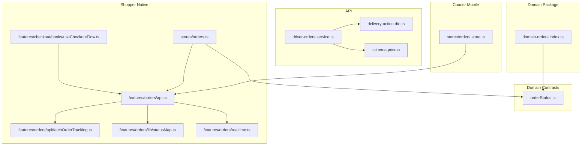
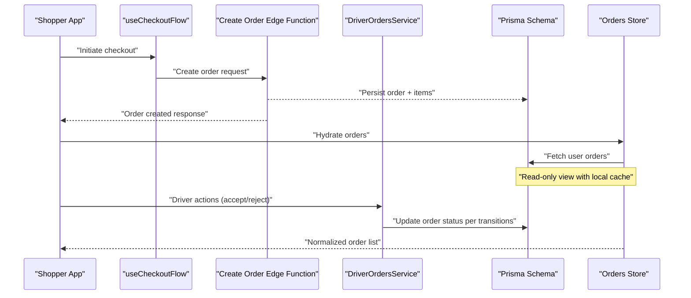
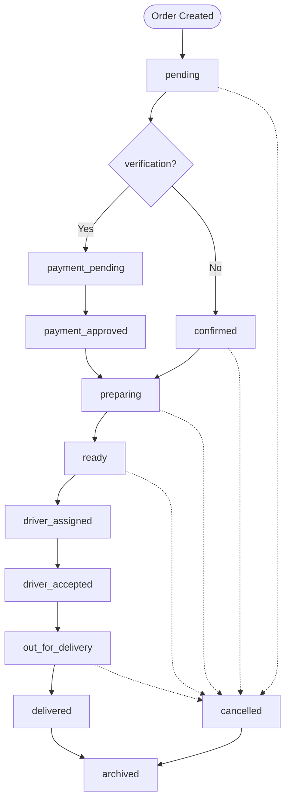
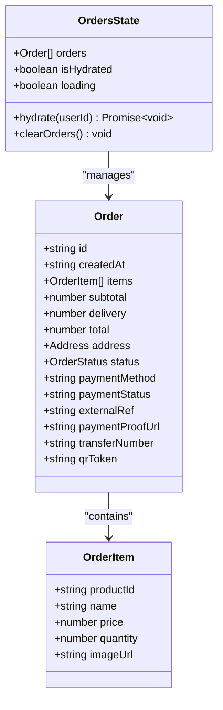
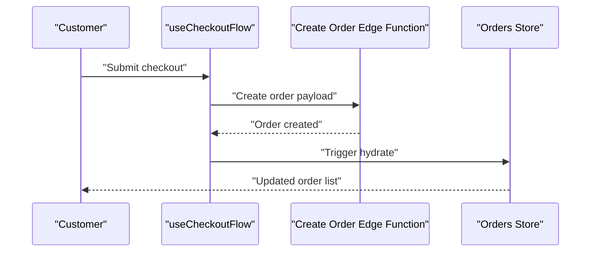
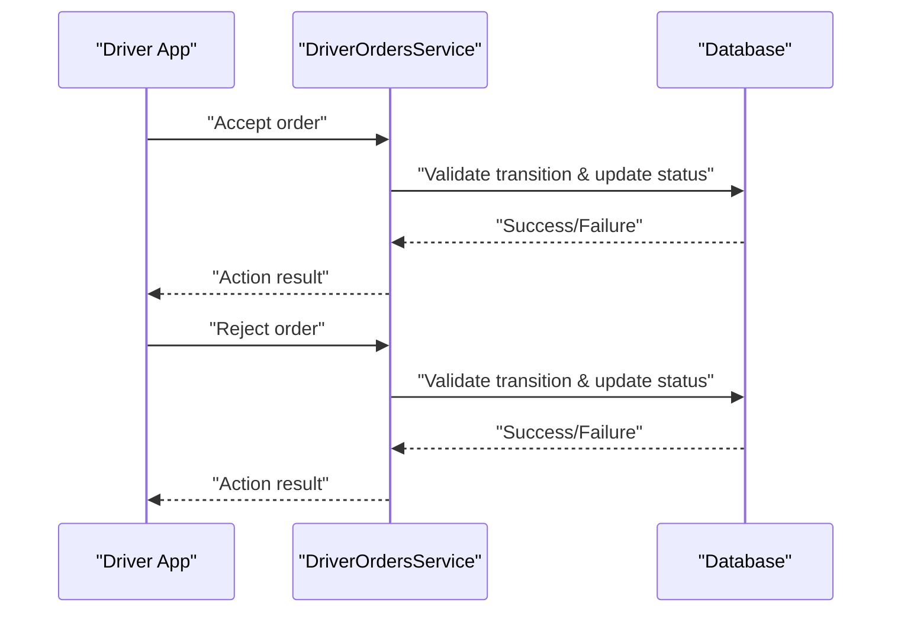
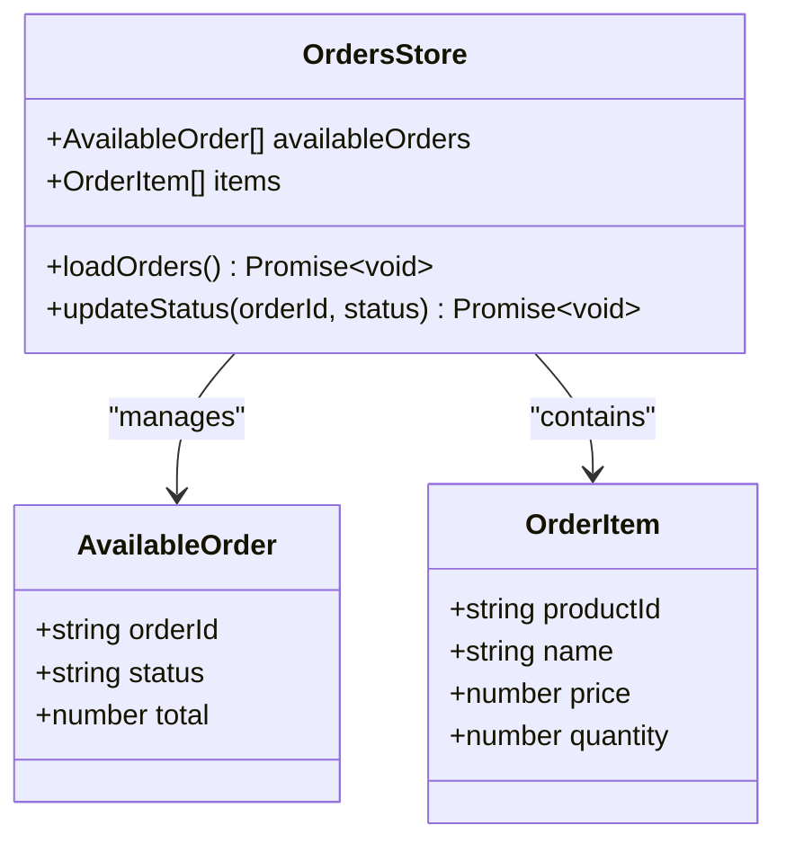
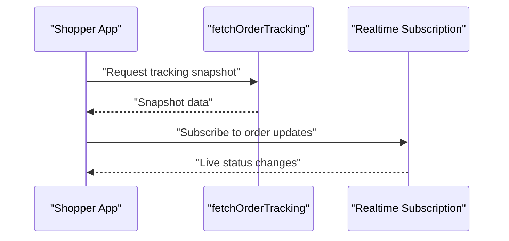
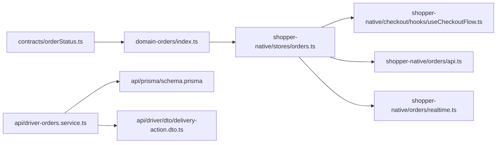

# Domain Orders

<cite>
**Referenced Files in This Document**
- [index.ts](file://packages/domain-orders/src/index.ts)
- [package.json](file://packages/domain-orders/package.json)
- [orderStatus.ts](file://packages/contracts/src/orderStatus.ts)
- [orders.ts](file://apps/shopper-native/src/stores/orders.ts)
- [driver-orders.service.ts](file://apps/api/src/modules/driver/driver-orders.service.ts)
- [delivery-action.dto.ts](file://apps/api/src/modules/driver/dto/delivery-action.dto.ts)
- [orders.store.ts](file://apps/courier-mobile/src/stores/orders.store.ts)
- [useCheckoutFlow.ts](file://apps/shopper-native/src/features/checkout/hooks/useCheckoutFlow.ts)
- [types.ts](file://apps/shopper-native/src/features/checkout/types.ts)
- [api.ts](file://apps/shopper-native/src/features/orders/api.ts)
- [fetchOrderTracking.ts](file://apps/shopper-native/src/features/orders/api/fetchOrderTracking.ts)
- [statusMap.ts](file://apps/shopper-native/src/features/orders/lib/statusMap.ts)
- [realtime.ts](file://apps/shopper-native/src/features/orders/realtime.ts)
- [schema.prisma](file://apps/api/prisma/schema.prisma)
</cite>

## Table of Contents
1. [Introduction](#introduction)
2. [Project Structure](#project-structure)
3. [Core Components](#core-components)
4. [Architecture Overview](#architecture-overview)
5. [Detailed Component Analysis](#detailed-component-analysis)
6. [Dependency Analysis](#dependency-analysis)
7. [Performance Considerations](#performance-considerations)
8. [Troubleshooting Guide](#troubleshooting-guide)
9. [Conclusion](#conclusion)
10. [Appendices](#appendices)

## Introduction
This document explains the Domain Orders package and how order processing business logic is implemented across the system. It covers the canonical order lifecycle, state transitions, validation rules, and constraints that govern orders from creation through fulfillment. It also documents aggregation patterns for order data, event handling for status changes, and integration points with inventory and payment domains. Practical examples are provided for creating, modifying, cancelling, and tracking orders. Finally, it addresses consistency guarantees, error handling strategies, and performance considerations for high-volume order processing scenarios.

## Project Structure
The Domain Orders package is a small TypeScript module that exposes shared types for order domain status. The canonical lifecycle and transition rules are centralized in the contracts package to ensure consistent behavior across all applications (API, shopper web/native, courier mobile). Order persistence and runtime orchestration live in the API application and client apps:
- packages/domain-orders: lightweight type exports for UI state
- packages/contracts: canonical statuses, labels, and allowed transitions
- apps/api: NestJS modules for driver actions and order operations
- apps/shopper-native: checkout flow, order store, and tracking APIs
- apps/courier-mobile: driver-side order management store
- apps/api/prisma: database schema definitions

**Diagram sources**
- [orderStatus.ts:59-167](file://packages/contracts/src/orderStatus.ts#L59-L167)
- [index.ts:1-2](file://packages/domain-orders/src/index.ts#L1-L2)
- [driver-orders.service.ts:50-50](file://apps/api/src/modules/driver/driver-orders.service.ts#L50-L50)
- [delivery-action.dto.ts:3-14](file://apps/api/src/modules/driver/dto/delivery-action.dto.ts#L3-L14)
- [schema.prisma:1-1](file://apps/api/prisma/schema.prisma#L1-L1)
- [orders.ts:1-166](file://apps/shopper-native/src/stores/orders.ts#L1-L166)
- [useCheckoutFlow.ts:571-571](file://apps/shopper-native/src/features/checkout/hooks/useCheckoutFlow.ts#L571-L571)
- [api.ts:20-42](file://apps/shopper-native/src/features/orders/api.ts#L20-L42)
- [fetchOrderTracking.ts:28-28](file://apps/shopper-native/src/features/orders/api/fetchOrderTracking.ts#L28-L28)
- [statusMap.ts:23-44](file://apps/shopper-native/src/features/orders/lib/statusMap.ts#L23-L44)
- [realtime.ts:43-43](file://apps/shopper-native/src/features/orders/realtime.ts#L43-L43)
- [orders.store.ts:10-90](file://apps/courier-mobile/src/stores/orders.store.ts#L10-L90)

**Section sources**
- [index.ts:1-2](file://packages/domain-orders/src/index.ts#L1-L2)
- [package.json:1-7](file://packages/domain-orders/package.json#L1-L7)
- [orderStatus.ts:59-167](file://packages/contracts/src/orderStatus.ts#L59-L167)
- [orders.ts:1-166](file://apps/shopper-native/src/stores/orders.ts#L1-L166)

## Core Components
- Canonical order lifecycle and transitions: Centralized in the contracts package to provide a single source of truth for statuses, labels, and allowed transitions.
- Domain package: Exposes minimal UI-related types for order domain status.
- Shopper native order store: Read-only view of orders with local caching and normalization of statuses.
- Checkout flow: Initiates order creation via an edge function; integrates with payment and inventory implicitly through backend orchestration.
- Driver services and DTOs: Handle delivery actions such as accepting or rejecting orders at the API layer.
- Courier mobile store: Manages available orders and order items for drivers.

Key responsibilities:
- Enforce canonical statuses and transitions consistently across clients and server.
- Provide normalized status values for UI rendering and analytics.
- Coordinate order creation, modification, cancellation, and tracking through well-defined boundaries.

**Section sources**
- [orderStatus.ts:59-167](file://packages/contracts/src/orderStatus.ts#L59-L167)
- [index.ts:1-2](file://packages/domain-orders/src/index.ts#L1-L2)
- [orders.ts:1-166](file://apps/shopper-native/src/stores/orders.ts#L1-L166)
- [useCheckoutFlow.ts:571-571](file://apps/shopper-native/src/features/checkout/hooks/useCheckoutFlow.ts#L571-L571)
- [driver-orders.service.ts:50-50](file://apps/api/src/modules/driver/driver-orders.service.ts#L50-L50)
- [delivery-action.dto.ts:3-14](file://apps/api/src/modules/driver/dto/delivery-action.dto.ts#L3-L14)
- [orders.store.ts:10-90](file://apps/courier-mobile/src/stores/orders.store.ts#L10-L90)

## Architecture Overview
The order architecture separates concerns between domain contracts, API orchestration, and client applications:
- Domain contracts define the canonical lifecycle and transitions.
- API services enforce role-based transitions and coordinate with inventory and payment domains during fulfillment.
- Client apps normalize statuses, fetch orders, and subscribe to real-time updates for tracking.

**Diagram sources**
- [useCheckoutFlow.ts:571-571](file://apps/shopper-native/src/features/checkout/hooks/useCheckoutFlow.ts#L571-L571)
- [driver-orders.service.ts:50-50](file://apps/api/src/modules/driver/driver-orders.service.ts#L50-L50)
- [schema.prisma:1-1](file://apps/api/prisma/schema.prisma#L1-L1)
- [orders.ts:1-166](file://apps/shopper-native/src/stores/orders.ts#L1-L166)

## Detailed Component Analysis

### Canonical Order Lifecycle and Transitions
The contracts package defines the canonical set of statuses, labels, and allowed transitions. It normalizes legacy spellings to canonical forms and provides helpers to validate transitions and detect terminal states.

**Diagram sources**
- [orderStatus.ts:59-167](file://packages/contracts/src/orderStatus.ts#L59-L167)

**Section sources**
- [orderStatus.ts:59-167](file://packages/contracts/src/orderStatus.ts#L59-L167)

### Shopper Native Orders Store
The store maintains a read-only view of orders, hydrating from the server and caching locally for fast rendering. It normalizes statuses using the same canonical mapping to ensure consistent UI presentation.

**Diagram sources**
- [orders.ts:24-115](file://apps/shopper-native/src/stores/orders.ts#L24-L115)
- [orders.ts:117-166](file://apps/shopper-native/src/stores/orders.ts#L117-L166)

**Section sources**
- [orders.ts:1-166](file://apps/shopper-native/src/stores/orders.ts#L1-L166)

### Checkout Flow and Order Creation
Order creation is initiated by the checkout hook, which calls the create-order edge function. The edge function handles idempotency, required fields, and persists the order and items. After creation, the client hydrates the orders store to reflect the new order.

**Diagram sources**
- [useCheckoutFlow.ts:571-571](file://apps/shopper-native/src/features/checkout/hooks/useCheckoutFlow.ts#L571-L571)
- [orders.ts:122-159](file://apps/shopper-native/src/stores/orders.ts#L122-L159)

**Section sources**
- [useCheckoutFlow.ts:571-571](file://apps/shopper-native/src/features/checkout/hooks/useCheckoutFlow.ts#L571-L571)
- [types.ts:99-99](file://apps/shopper-native/src/features/checkout/types.ts#L99-L99)
- [orders.ts:122-159](file://apps/shopper-native/src/stores/orders.ts#L122-L159)

### Driver Actions and Delivery Workflow
The API exposes driver order services and DTOs to accept or reject orders. These actions update order status according to the canonical transitions and roles enforced by the database.

**Diagram sources**
- [driver-orders.service.ts:50-50](file://apps/api/src/modules/driver/driver-orders.service.ts#L50-L50)
- [delivery-action.dto.ts:3-14](file://apps/api/src/modules/driver/dto/delivery-action.dto.ts#L3-L14)

**Section sources**
- [driver-orders.service.ts:50-50](file://apps/api/src/modules/driver/driver-orders.service.ts#L50-L50)
- [delivery-action.dto.ts:3-14](file://apps/api/src/modules/driver/dto/delivery-action.dto.ts#L3-L14)

### Courier Mobile Order Management
The courier mobile store manages available orders and order items, enabling drivers to view and interact with orders. It aligns with the canonical statuses and integrates with the API for updates.

**Diagram sources**
- [orders.store.ts:10-90](file://apps/courier-mobile/src/stores/orders.store.ts#L10-L90)

**Section sources**
- [orders.store.ts:10-90](file://apps/courier-mobile/src/stores/orders.store.ts#L10-L90)

### Order Tracking and Realtime Updates
Order tracking is supported via dedicated APIs and realtime subscriptions. Clients fetch snapshots and subscribe to updates to reflect current delivery progress.

**Diagram sources**
- [fetchOrderTracking.ts:28-28](file://apps/shopper-native/src/features/orders/api/fetchOrderTracking.ts#L28-L28)
- [realtime.ts:43-43](file://apps/shopper-native/src/features/orders/realtime.ts#L43-L43)

**Section sources**
- [api.ts:20-42](file://apps/shopper-native/src/features/orders/api.ts#L20-L42)
- [fetchOrderTracking.ts:28-28](file://apps/shopper-native/src/features/orders/api/fetchOrderTracking.ts#L28-L28)
- [statusMap.ts:23-44](file://apps/shopper-native/src/features/orders/lib/statusMap.ts#L23-L44)
- [realtime.ts:43-43](file://apps/shopper-native/src/features/orders/realtime.ts#L43-L43)

## Dependency Analysis
The Domain Orders package depends on the contracts package for canonical statuses and transitions. Client apps depend on both the contracts and their own stores to render and manage order data. The API depends on the Prisma schema for persistence and enforces transitions via service logic.

**Diagram sources**
- [orderStatus.ts:59-167](file://packages/contracts/src/orderStatus.ts#L59-L167)
- [index.ts:1-2](file://packages/domain-orders/src/index.ts#L1-L2)
- [orders.ts:1-166](file://apps/shopper-native/src/stores/orders.ts#L1-L166)
- [useCheckoutFlow.ts:571-571](file://apps/shopper-native/src/features/checkout/hooks/useCheckoutFlow.ts#L571-L571)
- [api.ts:20-42](file://apps/shopper-native/src/features/orders/api.ts#L20-L42)
- [realtime.ts:43-43](file://apps/shopper-native/src/features/orders/realtime.ts#L43-L43)
- [driver-orders.service.ts:50-50](file://apps/api/src/modules/driver/driver-orders.service.ts#L50-L50)
- [delivery-action.dto.ts:3-14](file://apps/api/src/modules/driver/dto/delivery-action.dto.ts#L3-L14)
- [schema.prisma:1-1](file://apps/api/prisma/schema.prisma#L1-L1)

**Section sources**
- [orderStatus.ts:59-167](file://packages/contracts/src/orderStatus.ts#L59-L167)
- [index.ts:1-2](file://packages/domain-orders/src/index.ts#L1-L2)
- [orders.ts:1-166](file://apps/shopper-native/src/stores/orders.ts#L1-L166)
- [driver-orders.service.ts:50-50](file://apps/api/src/modules/driver/driver-orders.service.ts#L50-L50)
- [delivery-action.dto.ts:3-14](file://apps/api/src/modules/driver/dto/delivery-action.dto.ts#L3-L14)
- [schema.prisma:1-1](file://apps/api/prisma/schema.prisma#L1-L1)

## Performance Considerations
- Local caching: The shopper native orders store caches orders locally to reduce network calls and improve initial render speed.
- Normalization overhead: Status normalization runs on each render; consider memoizing normalized values where appropriate.
- Batched updates: When updating multiple orders (e.g., driver actions), batch requests to minimize round trips.
- Indexing: Ensure database indexes support frequent queries on order status, customer ID, and timestamps for efficient retrieval.
- Realtime efficiency: Subscribe only to relevant orders to avoid unnecessary updates.

[No sources needed since this section provides general guidance]

## Troubleshooting Guide
Common issues and resolutions:
- Invalid status transitions: Validate transitions using the canonical transition map before attempting updates. If a transition fails, check role permissions and current status.
- Inconsistent statuses: Normalize incoming statuses to canonical forms to prevent mismatches in UI and analytics.
- Hydration failures: If hydrating orders fails, fall back to cached data and retry with exponential backoff.
- Driver action errors: Verify DTO inputs and ensure the driver has the correct role to perform the action.

**Section sources**
- [orderStatus.ts:134-167](file://packages/contracts/src/orderStatus.ts#L134-L167)
- [orders.ts:136-159](file://apps/shopper-native/src/stores/orders.ts#L136-L159)
- [delivery-action.dto.ts:3-14](file://apps/api/src/modules/driver/dto/delivery-action.dto.ts#L3-L14)

## Conclusion
The Domain Orders package centralizes order lifecycle definitions and collaborates with contracts, API services, and client apps to deliver a consistent, robust order processing workflow. By enforcing canonical statuses and transitions, normalizing data, and leveraging local caching and realtime updates, the system supports high-volume order processing while maintaining clarity and reliability.

[No sources needed since this section summarizes without analyzing specific files]

## Appendices

### Example Workflows

- Create Order:
  - Initiate checkout in the shopper app.
  - Call the create-order edge function to persist the order.
  - Hydrate the orders store to display the new order.

- Modify Order:
  - Use driver services to accept or reject orders based on role and transition rules.
  - Update order status via API endpoints validated against canonical transitions.

- Cancel Order:
  - Invoke cancellation from admin or manager surfaces if the current status allows transitioning to cancelled.
  - Ensure terminal state enforcement prevents further modifications.

- Track Order:
  - Fetch tracking snapshots and subscribe to realtime updates.
  - Render status using normalized labels and localized text.

**Section sources**
- [useCheckoutFlow.ts:571-571](file://apps/shopper-native/src/features/checkout/hooks/useCheckoutFlow.ts#L571-L571)
- [driver-orders.service.ts:50-50](file://apps/api/src/modules/driver/driver-orders.service.ts#L50-L50)
- [orderStatus.ts:134-167](file://packages/contracts/src/orderStatus.ts#L134-L167)
- [fetchOrderTracking.ts:28-28](file://apps/shopper-native/src/features/orders/api/fetchOrderTracking.ts#L28-L28)
- [realtime.ts:43-43](file://apps/shopper-native/src/features/orders/realtime.ts#L43-L43)