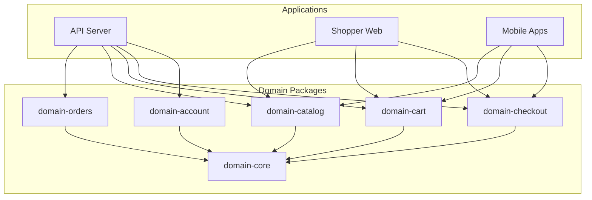
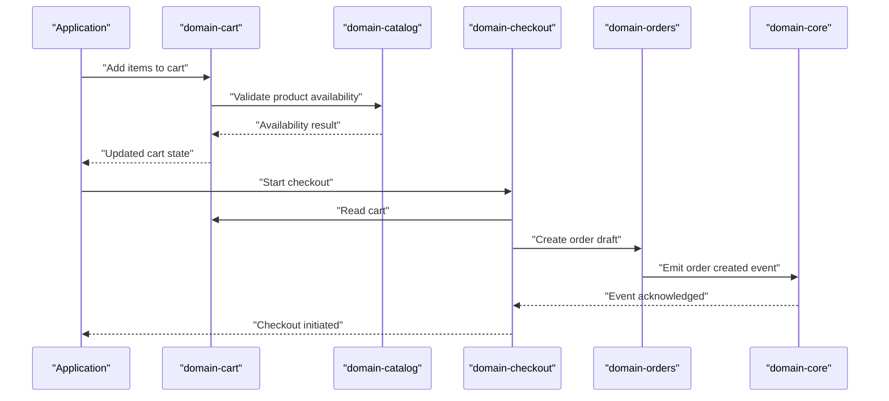
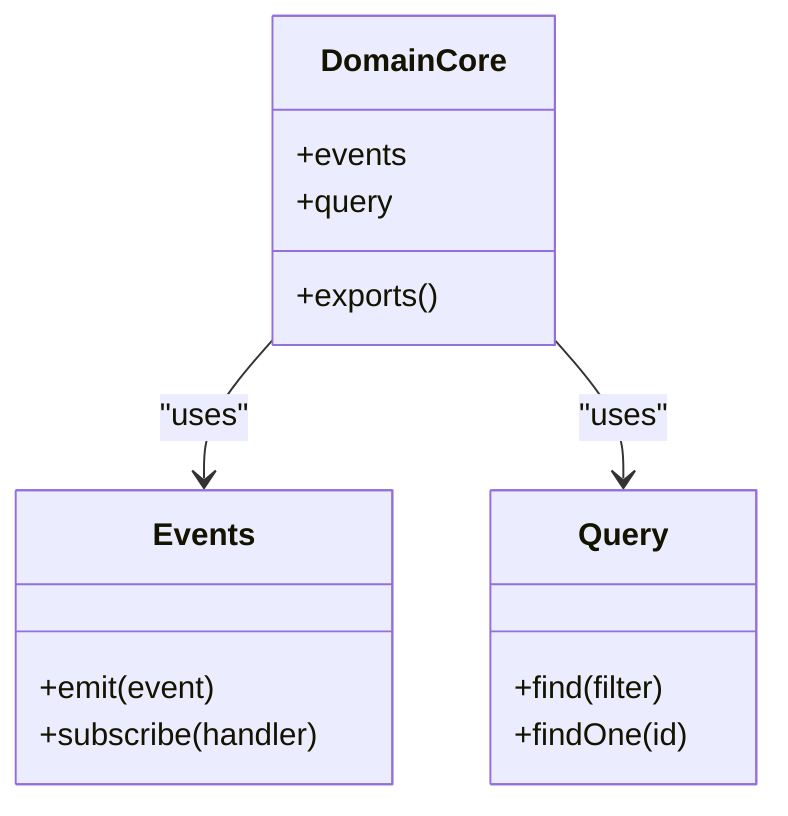
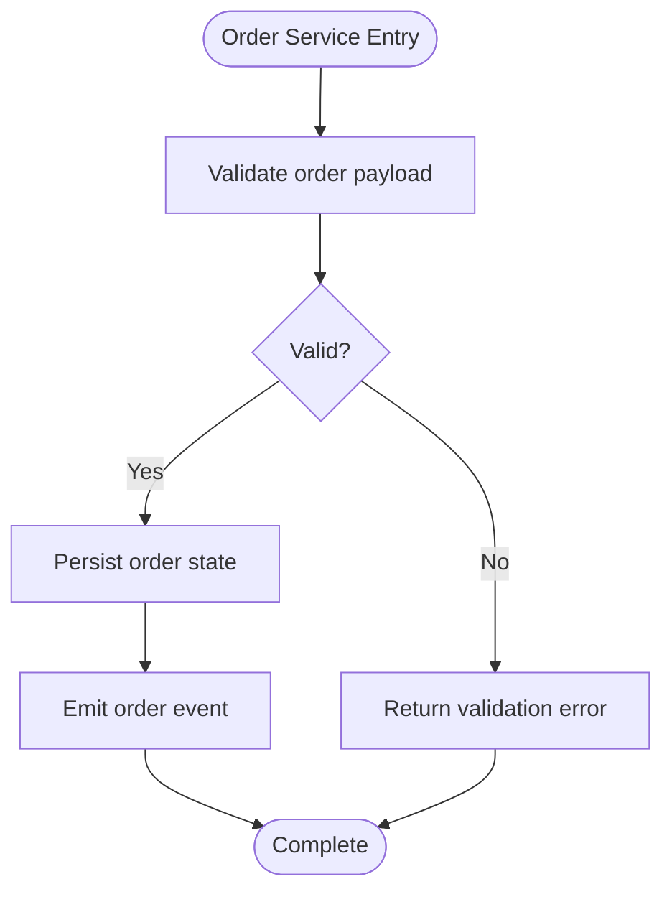
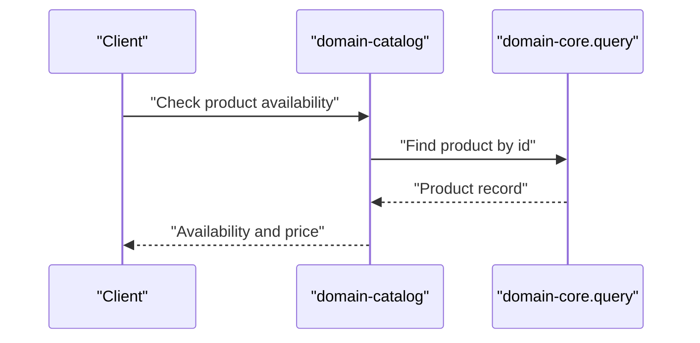
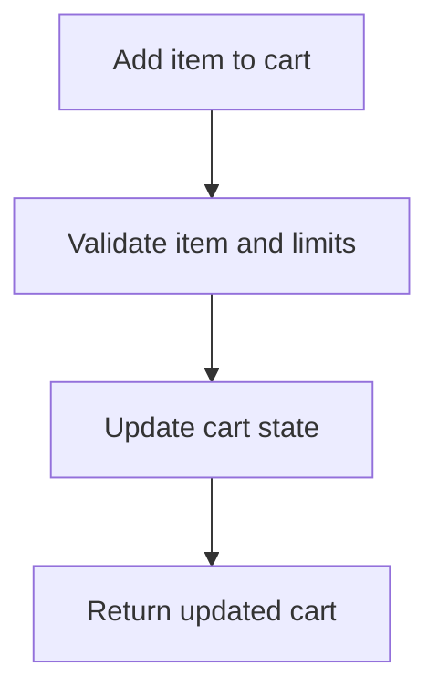
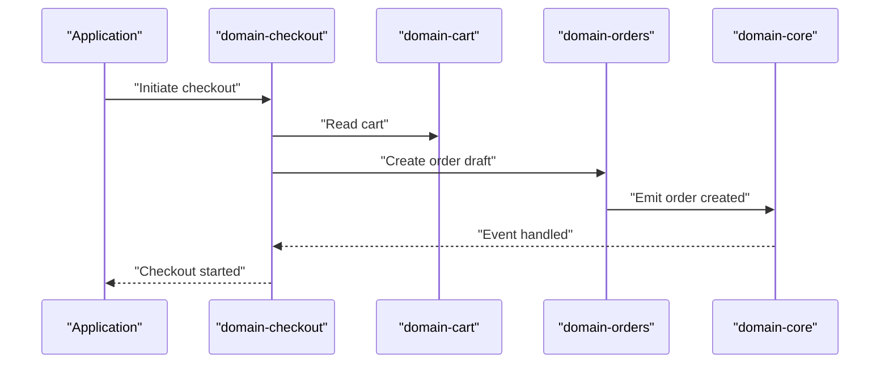
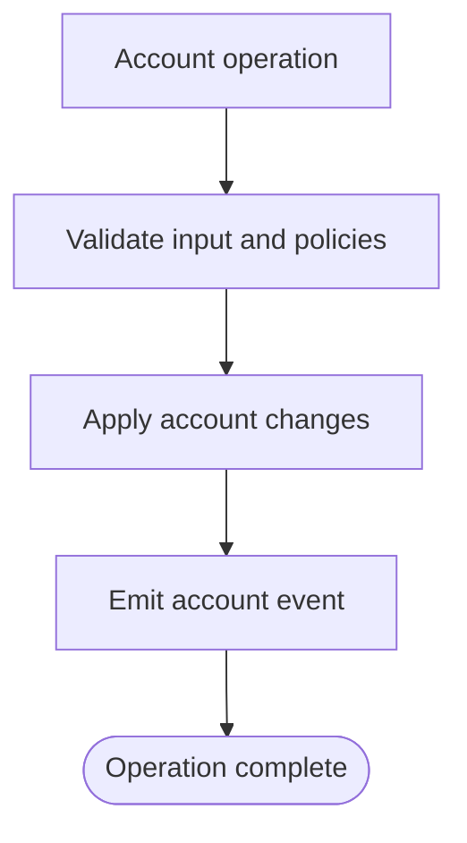
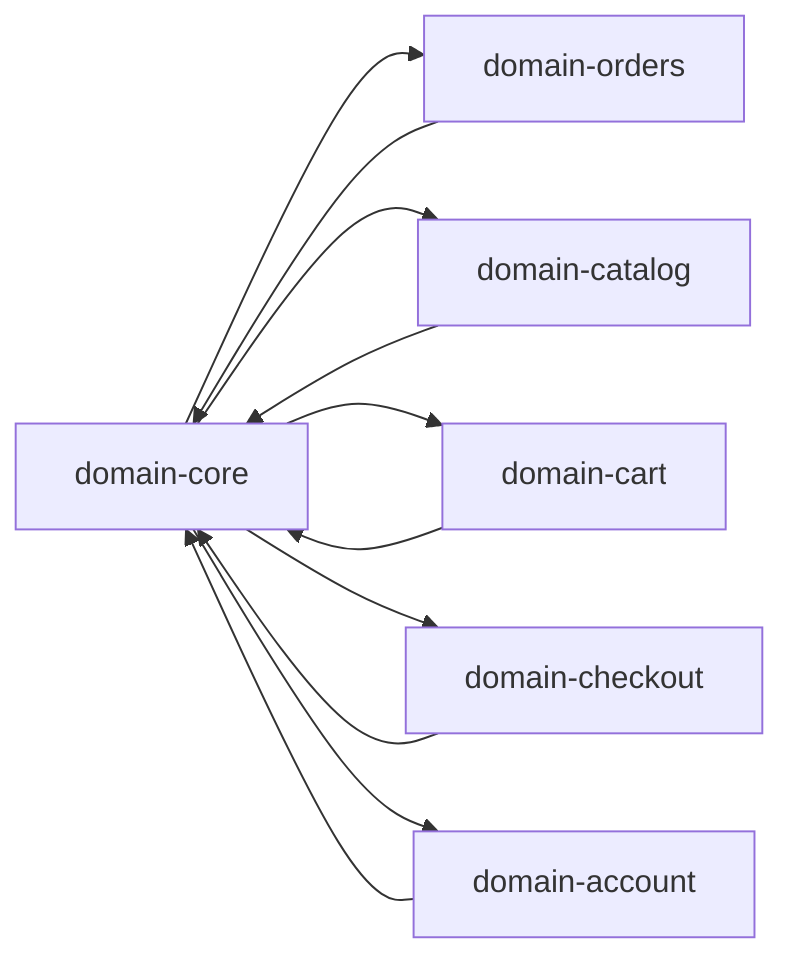

# Domain Packages

<cite>
**Referenced Files in This Document**
- [domain-core/src/index.ts](file://packages/domain-core/src/index.ts)
- [domain-core/src/events.ts](file://packages/domain-core/src/events.ts)
- [domain-core/src/query.ts](file://packages/domain-core/src/query.ts)
- [domain-orders/src/index.ts](file://packages/domain-orders/src/index.ts)
- [domain-catalog/src/index.ts](file://packages/domain-catalog/src/index.ts)
- [domain-cart/src/index.ts](file://packages/domain-cart/src/index.ts)
- [domain-checkout/src/index.ts](file://packages/domain-checkout/src/index.ts)
- [domain-account/src/index.ts](file://packages/domain-account/src/index.ts)
- [domain-core/package.json](file://packages/domain-core/package.json)
- [domain-orders/package.json](file://packages/domain-orders/package.json)
- [domain-catalog/package.json](file://packages/domain-catalog/package.json)
- [domain-cart/package.json](file://packages/domain-cart/package.json)
- [domain-checkout/package.json](file://packages/domain-checkout/package.json)
</cite>

## Table of Contents
1. [Introduction](#introduction)
2. [Project Structure](#project-structure)
3. [Core Components](#core-components)
4. [Architecture Overview](#architecture-overview)
5. [Detailed Component Analysis](#detailed-component-analysis)
6. [Dependency Analysis](#dependency-analysis)
7. [Performance Considerations](#performance-considerations)
8. [Troubleshooting Guide](#troubleshooting-guide)
9. [Conclusion](#conclusion)
10. [Appendices](#appendices)

## Introduction
This document explains the domain packages architecture that implements domain-driven design principles across the platform. The domain layer encapsulates business logic and rules for core operations, order processing, catalog management, cart functionality, checkout workflows, prescription handling, location services, search algorithms, account management, courier operations, and operational utilities. These packages provide reusable, testable business capabilities consumed by applications such as the API, shopper web, and mobile apps.

The architecture emphasizes:
- Clear separation of concerns per domain
- Reusable business logic independent of transport layers
- Event-driven interactions between domains
- Consistent contracts and types shared via packages

## Project Structure
The domain packages are organized under packages with a consistent structure: each package exposes a primary entry point (index.ts) and may include supporting modules for events, queries, or utilities. Core infrastructure is provided by domain-core, which centralizes cross-cutting concerns like event definitions and query abstractions.

**Diagram sources**
- [domain-core/src/index.ts:1-200](file://packages/domain-core/src/index.ts#L1-L200)
- [domain-orders/src/index.ts:1-200](file://packages/domain-orders/src/index.ts#L1-L200)
- [domain-catalog/src/index.ts:1-200](file://packages/domain-catalog/src/index.ts#L1-L200)
- [domain-cart/src/index.ts:1-200](file://packages/domain-cart/src/index.ts#L1-L200)
- [domain-checkout/src/index.ts:1-200](file://packages/domain-checkout/src/index.ts#L1-L200)
- [domain-account/src/index.ts:1-200](file://packages/domain-account/src/index.ts#L1-L200)

**Section sources**
- [domain-core/package.json:1-7](file://packages/domain-core/package.json#L1-L7)
- [domain-orders/package.json:1-7](file://packages/domain-orders/package.json#L1-L7)
- [domain-catalog/package.json:1-7](file://packages/domain-catalog/package.json#L1-L7)
- [domain-cart/package.json:1-7](file://packages/domain-cart/package.json#L1-L7)
- [domain-checkout/package.json:1-7](file://packages/domain-checkout/package.json#L1-L7)

## Core Components
- domain-core: Provides foundational building blocks including event definitions and query abstractions used by other domains to coordinate behavior and data access patterns.
- domain-orders: Encapsulates order lifecycle and orchestration rules.
- domain-catalog: Manages product and category-related business logic.
- domain-cart: Implements cart state transitions and validation rules.
- domain-checkout: Coordinates checkout workflow, pricing, and payment preparation.
- domain-account: Handles account-related business rules and validations.

These components expose stable APIs for applications to invoke without leaking infrastructure details.

**Section sources**
- [domain-core/src/index.ts:1-200](file://packages/domain-core/src/index.ts#L1-L200)
- [domain-core/src/events.ts:1-200](file://packages/domain-core/src/events.ts#L1-L200)
- [domain-core/src/query.ts:1-200](file://packages/domain-core/src/query.ts#L1-L200)
- [domain-orders/src/index.ts:1-200](file://packages/domain-orders/src/index.ts#L1-L200)
- [domain-catalog/src/index.ts:1-200](file://packages/domain-catalog/src/index.ts#L1-L200)
- [domain-cart/src/index.ts:1-200](file://packages/domain-cart/src/index.ts#L1-L200)
- [domain-checkout/src/index.ts:1-200](file://packages/domain-checkout/src/index.ts#L1-L200)
- [domain-account/src/index.ts:1-200](file://packages/domain-account/src/index.ts#L1-L200)

## Architecture Overview
The domain layer follows DDD boundaries:
- Each domain owns its aggregates, entities, and business rules
- Cross-domain coordination occurs through events and explicit service calls
- Applications depend on domain APIs, not on persistence or transport specifics

**Diagram sources**
- [domain-cart/src/index.ts:1-200](file://packages/domain-cart/src/index.ts#L1-L200)
- [domain-catalog/src/index.ts:1-200](file://packages/domain-catalog/src/index.ts#L1-L200)
- [domain-checkout/src/index.ts:1-200](file://packages/domain-checkout/src/index.ts#L1-L200)
- [domain-orders/src/index.ts:1-200](file://packages/domain-orders/src/index.ts#L1-L200)
- [domain-core/src/events.ts:1-200](file://packages/domain-core/src/events.ts#L1-L200)

## Detailed Component Analysis

### domain-core
Responsibilities:
- Centralized event definitions for cross-domain communication
- Query abstractions to standardize read-side operations
- Shared types and utilities consumed by other domains

Key aspects:
- Events define canonical domain occurrences (e.g., order created, item added)
- Query module provides consistent interfaces for fetching data across domains
- Index exports aggregate public APIs for consumers

**Diagram sources**
- [domain-core/src/index.ts:1-200](file://packages/domain-core/src/index.ts#L1-L200)
- [domain-core/src/events.ts:1-200](file://packages/domain-core/src/events.ts#L1-L200)
- [domain-core/src/query.ts:1-200](file://packages/domain-core/src/query.ts#L1-L200)

**Section sources**
- [domain-core/src/index.ts:1-200](file://packages/domain-core/src/index.ts#L1-L200)
- [domain-core/src/events.ts:1-200](file://packages/domain-core/src/events.ts#L1-L200)
- [domain-core/src/query.ts:1-200](file://packages/domain-core/src/query.ts#L1-L200)

### domain-orders
Responsibilities:
- Order lifecycle management (creation, updates, status transitions)
- Orchestration of downstream actions via events
- Validation of order data and constraints

Usage pattern:
- Applications call order services to create or update orders
- On successful transitions, events are emitted for audit and integration

**Diagram sources**
- [domain-orders/src/index.ts:1-200](file://packages/domain-orders/src/index.ts#L1-L200)
- [domain-core/src/events.ts:1-200](file://packages/domain-core/src/events.ts#L1-L200)

**Section sources**
- [domain-orders/src/index.ts:1-200](file://packages/domain-orders/src/index.ts#L1-L200)

### domain-catalog
Responsibilities:
- Product and category business rules
- Availability checks and pricing context
- Search-friendly data structures

Integration points:
- Consumed by cart and checkout for item validation and pricing
- Exposes query helpers for efficient retrieval

**Diagram sources**
- [domain-catalog/src/index.ts:1-200](file://packages/domain-catalog/src/index.ts#L1-L200)
- [domain-core/src/query.ts:1-200](file://packages/domain-core/src/query.ts#L1-L200)

**Section sources**
- [domain-catalog/src/index.ts:1-200](file://packages/domain-catalog/src/index.ts#L1-L200)

### domain-cart
Responsibilities:
- Cart state transitions (add, remove, update quantities)
- Business rule enforcement (limits, eligibility)
- Coordination with catalog for real-time validation

**Diagram sources**
- [domain-cart/src/index.ts:1-200](file://packages/domain-cart/src/index.ts#L1-L200)

**Section sources**
- [domain-cart/src/index.ts:1-200](file://packages/domain-cart/src/index.ts#L1-L200)

### domain-checkout
Responsibilities:
- Checkout orchestration (pricing, promotions, payment prep)
- Creation of order drafts and reservation of items
- Emission of checkout events for downstream processes

**Diagram sources**
- [domain-checkout/src/index.ts:1-200](file://packages/domain-checkout/src/index.ts#L1-L200)
- [domain-cart/src/index.ts:1-200](file://packages/domain-cart/src/index.ts#L1-L200)
- [domain-orders/src/index.ts:1-200](file://packages/domain-orders/src/index.ts#L1-L200)
- [domain-core/src/events.ts:1-200](file://packages/domain-core/src/events.ts#L1-L200)

**Section sources**
- [domain-checkout/src/index.ts:1-200](file://packages/domain-checkout/src/index.ts#L1-L200)

### domain-account
Responsibilities:
- Account creation, updates, and validation
- Role and permission checks relevant to business flows
- Integration hooks for notifications and compliance

**Diagram sources**
- [domain-account/src/index.ts:1-200](file://packages/domain-account/src/index.ts#L1-L200)
- [domain-core/src/events.ts:1-200](file://packages/domain-core/src/events.ts#L1-L200)

**Section sources**
- [domain-account/src/index.ts:1-200](file://packages/domain-account/src/index.ts#L1-L200)

## Dependency Analysis
- domain-core is a foundational dependency for all other domains
- Other domains depend on domain-core for events and query abstractions
- Application layers depend on domain packages but remain decoupled from infrastructure

**Diagram sources**
- [domain-core/src/index.ts:1-200](file://packages/domain-core/src/index.ts#L1-L200)
- [domain-orders/src/index.ts:1-200](file://packages/domain-orders/src/index.ts#L1-L200)
- [domain-catalog/src/index.ts:1-200](file://packages/domain-catalog/src/index.ts#L1-L200)
- [domain-cart/src/index.ts:1-200](file://packages/domain-cart/src/index.ts#L1-L200)
- [domain-checkout/src/index.ts:1-200](file://packages/domain-checkout/src/index.ts#L1-L200)
- [domain-account/src/index.ts:1-200](file://packages/domain-account/src/index.ts#L1-L200)

**Section sources**
- [domain-core/package.json:1-7](file://packages/domain-core/package.json#L1-L7)
- [domain-orders/package.json:1-7](file://packages/domain-orders/package.json#L1-L7)
- [domain-catalog/package.json:1-7](file://packages/domain-catalog/package.json#L1-L7)
- [domain-cart/package.json:1-7](file://packages/domain-cart/package.json#L1-L7)
- [domain-checkout/package.json:1-7](file://packages/domain-checkout/package.json#L1-L7)

## Performance Considerations
- Prefer batch reads via domain-core query abstractions to reduce round-trips
- Cache catalog lookups at the application boundary where appropriate
- Defer heavy computations to background tasks triggered by domain events
- Keep domain functions pure and side-effect free except for explicit event emissions

[No sources needed since this section provides general guidance]

## Troubleshooting Guide
Common issues and strategies:
- Event ordering and duplicates: Ensure idempotent handlers and deduplication keys
- Validation failures: Surface clear domain errors with actionable messages
- Query performance: Use indexes and selective projections in domain queries
- Cross-domain consistency: Rely on events for eventual consistency; handle retries gracefully

**Section sources**
- [domain-core/src/events.ts:1-200](file://packages/domain-core/src/events.ts#L1-L200)
- [domain-core/src/query.ts:1-200](file://packages/domain-core/src/query.ts#L1-L200)

## Conclusion
The domain packages implement a clean, scalable DDD architecture that isolates business logic, promotes reuse, and enables consistent behavior across applications. By leveraging domain-core for events and queries, domains communicate reliably while maintaining strong boundaries. This structure supports testing, extension, and evolution of business capabilities over time.

[No sources needed since this section summarizes without analyzing specific files]

## Appendices

### Example: Using Domain Services
- Create an order via domain-orders service
- Validate products via domain-catalog before adding to cart
- Initiate checkout via domain-checkout to orchestrate pricing and order creation
- Handle account-related operations via domain-account for user context

Reference paths:
- [domain-orders/src/index.ts:1-200](file://packages/domain-orders/src/index.ts#L1-L200)
- [domain-catalog/src/index.ts:1-200](file://packages/domain-catalog/src/index.ts#L1-L200)
- [domain-cart/src/index.ts:1-200](file://packages/domain-cart/src/index.ts#L1-L200)
- [domain-checkout/src/index.ts:1-200](file://packages/domain-checkout/src/index.ts#L1-L200)
- [domain-account/src/index.ts:1-200](file://packages/domain-account/src/index.ts#L1-L200)

### Example: Event Handling Patterns
- Emit canonical events from domain boundaries using domain-core events
- Subscribe to events in application layers to trigger side effects (notifications, analytics)
- Implement idempotent handlers to tolerate retries and out-of-order delivery

Reference paths:
- [domain-core/src/events.ts:1-200](file://packages/domain-core/src/events.ts#L1-L200)

### Testing Strategies for Domain Logic
- Unit tests for pure business functions and validations
- Integration tests for domain services with mocked repositories
- Contract tests for event schemas and payloads
- End-to-end tests for critical workflows (checkout, order lifecycle)

[No sources needed since this section provides general guidance]

### Extending Existing Domains
- Add new entities and aggregates within the domain package
- Introduce new events in domain-core if cross-domain signaling is required
- Update domain services to enforce new business rules
- Provide backward-compatible API changes to avoid breaking consumers

Reference paths:
- [domain-core/src/index.ts:1-200](file://packages/domain-core/src/index.ts#L1-L200)
- [domain-core/src/events.ts:1-200](file://packages/domain-core/src/events.ts#L1-L200)