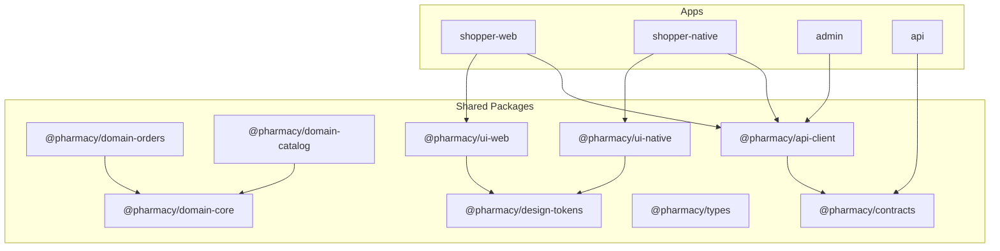
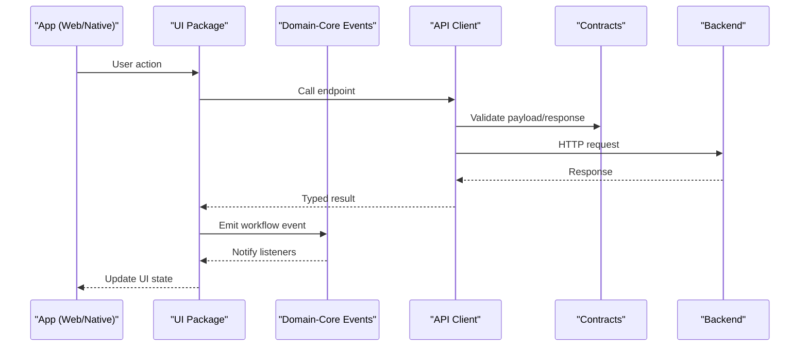
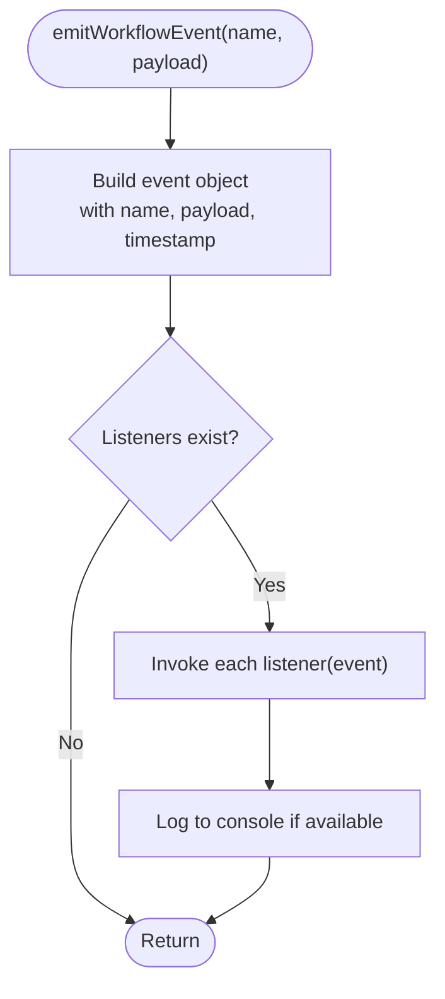
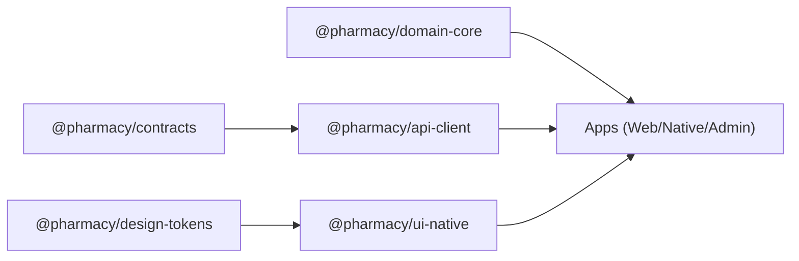

# Shared Packages

<cite>
**Referenced Files in This Document**
- [package.json](file://package.json)
- [packages/api-client/package.json](file://packages/api-client/package.json)
- [packages/contracts/package.json](file://packages/contracts/package.json)
- [packages/design-tokens/package.json](file://packages/design-tokens/package.json)
- [packages/ui-native/package.json](file://packages/ui-native/package.json)
- [packages/domain-core/src/index.ts](file://packages/domain-core/src/index.ts)
- [packages/domain-core/src/events.ts](file://packages/domain-core/src/events.ts)
- [packages/contracts/src/index.ts](file://packages/contracts/src/index.ts)
</cite>

## Table of Contents
1. Introduction
2. Project Structure
3. Core Components
4. Architecture Overview
5. Detailed Component Analysis
6. Dependency Analysis
7. Performance Considerations
8. Troubleshooting Guide
9. Conclusion
10. Appendices

## Introduction
This document explains the shared packages architecture used across the monorepo to support multiple applications (web, native, admin, API). The design follows domain-driven principles:
- Domain packages encapsulate business rules and workflows independent of UI or transport layers.
- UI packages provide consistent design systems for web and native platforms.
- API clients centralize backend communication and data contracts.
- Type definitions and contracts ensure type safety across all apps and services.

The goal is to enable reusable business logic, consistent user experiences, and reliable cross-platform compatibility while keeping build and test processes efficient.

## Project Structure
At the root, npm workspaces include apps and all packages under packages/. Each package is a TypeScript module with explicit exports and dependencies. Key categories:
- Domain packages: core business logic and workflow events (e.g., domain-core, domain-orders, domain-catalog).
- Contracts and types: shared schemas and types consumed by API clients and apps.
- API client: HTTP client configuration and typed endpoints using contracts.
- UI packages: platform-specific components and tokens (ui-web, ui-native).
- Design tokens: shared visual tokens consumed by UI packages.

**Diagram sources**
- [package.json:9-13](file://package.json#L9-L13)
- [packages/api-client/package.json:16-18](file://packages/api-client/package.json#L16-L18)
- [packages/ui-native/package.json:26-27](file://packages/ui-native/package.json#L26-L27)

**Section sources**
- [package.json:9-13](file://package.json#L9-L13)

## Core Components
- Domain-core: Exposes workflow event names, event emission, and subscription utilities that coordinate cross-cutting business flows.
- Contracts: Centralized Zod schemas and exported types for API responses, geo, branch, delivery, order status, and roles.
- API Client: Typed HTTP client that depends on contracts to validate requests/responses and expose a unified interface.
- UI Native: React Native component library with platform-aware exports and peer dependencies; consumes design tokens.
- Design Tokens: Shared token set for colors, spacing, typography, etc., consumed by UI packages.

These components form the foundation for consistent behavior and look-and-feel across apps.

**Section sources**
- [packages/domain-core/src/index.ts:1-3](file://packages/domain-core/src/index.ts#L1-L3)
- [packages/domain-core/src/events.ts:1-52](file://packages/domain-core/src/events.ts#L1-L52)
- [packages/contracts/src/index.ts:1-8](file://packages/contracts/src/index.ts#L1-L8)
- [packages/api-client/package.json:1-21](file://packages/api-client/package.json#L1-L21)
- [packages/ui-native/package.json:1-38](file://packages/ui-native/package.json#L1-L38)
- [packages/design-tokens/package.json:1-20](file://packages/design-tokens/package.json#L1-L20)

## Architecture Overview
The shared packages follow a layered approach:
- Apps depend on the API client for data access and on UI packages for presentation.
- The API client depends on contracts for schema validation and type safety.
- Domain packages encapsulate business rules and emit workflow events to coordinate state changes across features.
- UI packages consume design tokens to maintain consistency across platforms.

**Diagram sources**
- [packages/api-client/package.json:16-18](file://packages/api-client/package.json#L16-L18)
- [packages/contracts/src/index.ts:1-8](file://packages/contracts/src/index.ts#L1-L8)
- [packages/domain-core/src/events.ts:27-50](file://packages/domain-core/src/events.ts#L27-L50)

## Detailed Component Analysis

### Domain-Core: Workflow Events
Purpose:
- Define canonical workflow event names and payloads.
- Provide an in-process pub/sub mechanism for decoupled feature coordination.

Key behaviors:
- Event emission with timestamped payloads.
- Subscription management with cleanup.
- Console logging for observability when available.

**Diagram sources**
- [packages/domain-core/src/events.ts:27-50](file://packages/domain-core/src/events.ts#L27-L50)

**Section sources**
- [packages/domain-core/src/events.ts:1-52](file://packages/domain-core/src/events.ts#L1-L52)
- [packages/domain-core/src/index.ts:1-3](file://packages/domain-core/src/index.ts#L1-L3)

### Contracts: Shared Schemas and Types
Purpose:
- Centralize runtime validation schemas and exported types for API interactions.
- Ensure consistent shape of responses and errors across all consumers.

Highlights:
- Exports API response and error schemas.
- Re-exports domain-related schemas (geo, branch, delivery, order status, role).

Usage pattern:
- API client validates incoming/outgoing data against these schemas.
- Apps import types for compile-time safety.

**Section sources**
- [packages/contracts/src/index.ts:1-8](file://packages/contracts/src/index.ts#L1-L8)

### API Client: Centralized Backend Communication
Purpose:
- Provide a single source of truth for HTTP calls, headers, base URLs, and error handling.
- Enforce contract compliance via Zod schemas.

Export pattern:
- Single entry point re-exports typed methods and helpers.
- Depends on contracts for validation and typing.

Consumption example:
- Apps call client methods to fetch or mutate resources; results are validated and returned as strongly-typed objects.

**Section sources**
- [packages/api-client/package.json:1-21](file://packages/api-client/package.json#L1-L21)
- [packages/contracts/src/index.ts:1-8](file://packages/contracts/src/index.ts#L1-L8)

### UI Native: Platform-Specific UI Library
Purpose:
- Deliver consistent UI primitives for React Native apps.
- Use design tokens for theming and accessibility.

Export pattern:
- Conditional exports for React Native and standard environments.
- Additional named exports for courier-specific tokens.

Peer dependencies:
- Declares required versions of React, React Native, and related libraries to ensure compatibility.

Consumption example:
- Native apps import components and tokens from this package to build screens and dialogs.

**Section sources**
- [packages/ui-native/package.json:1-38](file://packages/ui-native/package.json#L1-L38)
- [packages/design-tokens/package.json:1-20](file://packages/design-tokens/package.json#L1-L20)

### Design Tokens: Shared Visual System
Purpose:
- Centralize colors, spacing, typography, and other design primitives.
- Provide a single source of truth for branding and theme consistency.

Export pattern:
- Single entry point exposing all tokens for consumption by UI packages.

**Section sources**
- [packages/design-tokens/package.json:1-20](file://packages/design-tokens/package.json#L1-L20)

## Dependency Analysis
- Workspaces: Root package.json defines workspaces including apps and packages/*, enabling local linking and unified scripts.
- API Client depends on Contracts for schemas and types.
- UI Native depends on Design Tokens for theming.
- Domain packages (e.g., domain-core) are consumed by feature-rich apps and potentially by other domain packages to share workflow semantics.

**Diagram sources**
- [package.json:9-13](file://package.json#L9-L13)
- [packages/api-client/package.json:16-18](file://packages/api-client/package.json#L16-L18)
- [packages/ui-native/package.json:26-27](file://packages/ui-native/package.json#L26-L27)

**Section sources**
- [package.json:9-13](file://package.json#L9-L13)
- [packages/api-client/package.json:16-18](file://packages/api-client/package.json#L16-L18)
- [packages/ui-native/package.json:26-27](file://packages/ui-native/package.json#L26-L27)

## Performance Considerations
- Keep domain packages free of UI and network concerns to minimize bundle size in apps.
- Use lazy imports in apps for heavy UI components where appropriate.
- Prefer schema validation at boundaries (API client) to fail fast and reduce downstream processing.
- Avoid circular dependencies between domain packages; use contracts and events to decouple.
- Leverage tree-shaking by exporting only necessary symbols from packages.

[No sources needed since this section provides general guidance]

## Troubleshooting Guide
Common issues and resolutions:
- Missing peer dependencies in UI Native: Ensure apps install compatible versions of React, React Native, and related libraries declared as peer dependencies.
- Contract mismatches: If API responses change, update Zod schemas in contracts and regenerate types to avoid runtime validation failures.
- Event listeners not firing: Verify that subscribers are registered before emitting events and that subscriptions are cleaned up to prevent memory leaks.
- Build errors due to workspace resolution: Confirm that package names match workspace entries and that imports resolve correctly within the monorepo.

**Section sources**
- [packages/ui-native/package.json:29-36](file://packages/ui-native/package.json#L29-L36)
- [packages/contracts/src/index.ts:1-8](file://packages/contracts/src/index.ts#L1-L8)
- [packages/domain-core/src/events.ts:27-50](file://packages/domain-core/src/events.ts#L27-L50)

## Conclusion
The shared packages establish a clear separation of concerns:
- Domain packages encapsulate business rules and workflow coordination.
- Contracts and types guarantee consistent data shapes across the system.
- API clients centralize backend communication and validation.
- UI packages deliver consistent experiences across platforms using shared design tokens.

This structure promotes reuse, maintainability, and scalability across the monorepo’s applications.

[No sources needed since this section summarizes without analyzing specific files]

## Appendices

### Package Consumption Examples
- Web app consuming API client and UI web:
  - Import typed endpoints from the API client and render UI components from the web UI package.
- Native app consuming API client and UI native:
  - Use the API client for data operations and compose screens with UI native components and design tokens.

[No sources needed since this section provides conceptual usage patterns]

### Versioning Strategy
- All packages are marked private with internal version numbers suitable for monorepo development.
- Coordinate breaking changes across packages by updating contracts first, then API client, then apps.
- Use semantic versioning when publishing packages externally; for now, keep internal versions aligned with feature releases.

[No sources needed since this section provides general guidance]

### Build Processes
- Root scripts orchestrate workspace builds and previews for key apps.
- Railway scripts automate building and starting services for deployment environments.
- TypeScript checks run via tsc configurations per project.

**Section sources**
- [package.json:14-26](file://package.json#L14-L26)

### Testing Strategies
- Unit tests for domain logic should be colocated with domain packages.
- Integration tests for API client can mock backend responses and assert contract compliance.
- UI tests should focus on component rendering and interaction using the respective UI packages.

[No sources needed since this section provides general guidance]

### Contribution Guidelines for Shared Code
- Add new business rules to domain packages; avoid leaking UI or transport details.
- Extend contracts for any new API shapes; update API client accordingly.
- Introduce new UI components in the appropriate UI package and consume design tokens.
- Run type checks and linting locally before submitting changes.
- Keep dependencies minimal and declare peer dependencies explicitly where applicable.

[No sources needed since this section provides general guidance]