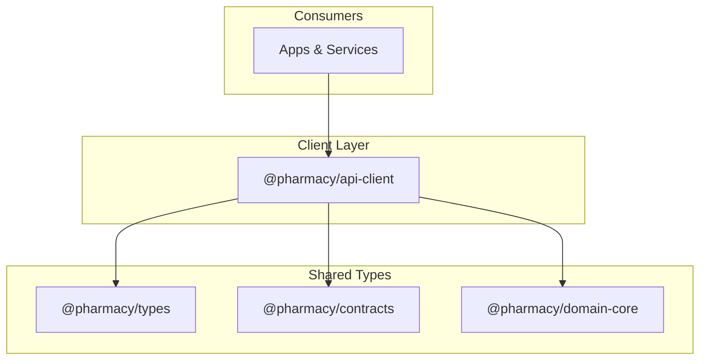
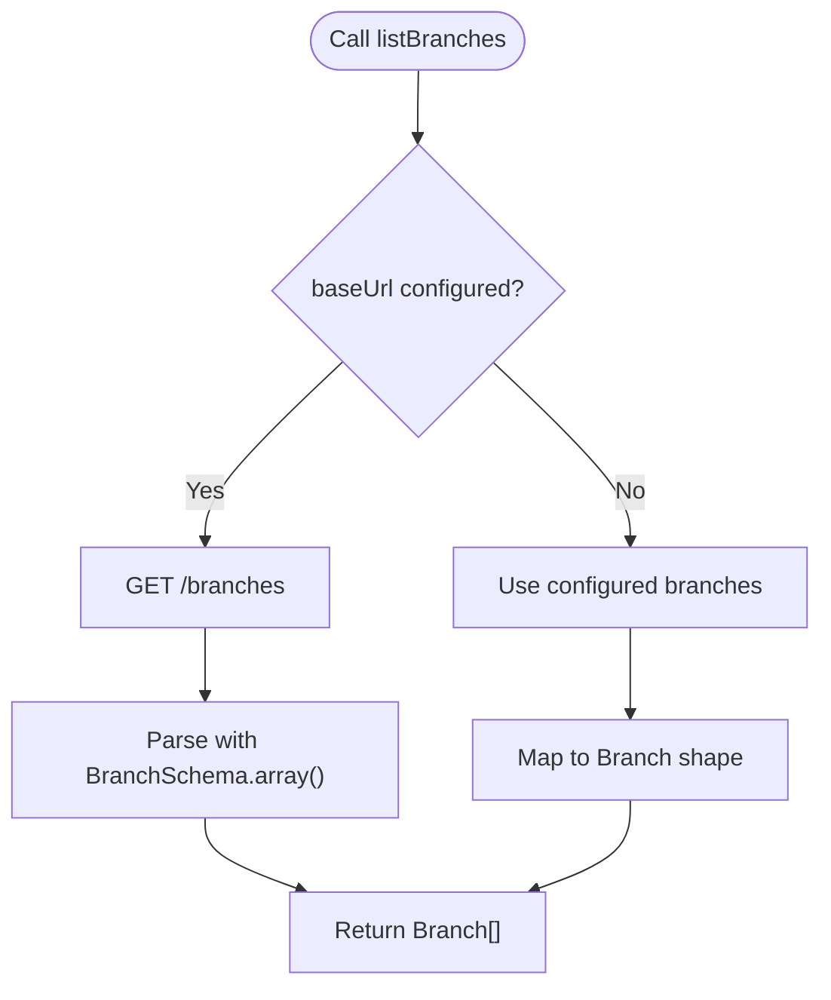
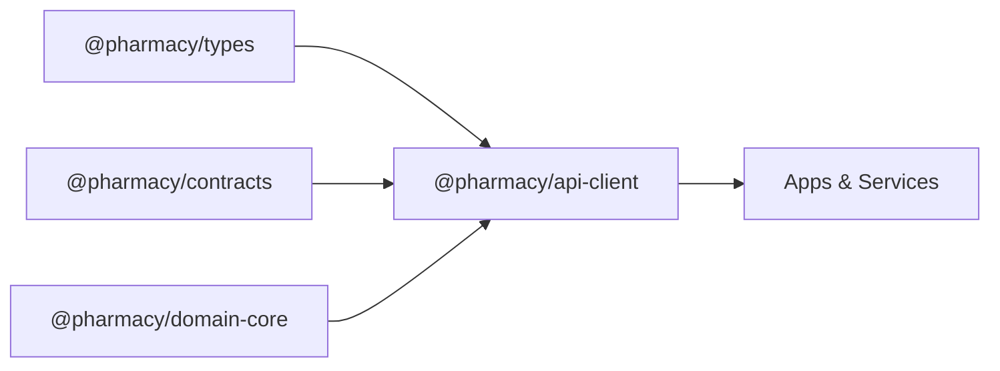

# Type Definitions and Contracts

<cite>
**Referenced Files in This Document**
- [packages/types/src/index.ts](file://packages/types/src/index.ts)
- [packages/contracts/src/index.ts](file://packages/contracts/src/index.ts)
- [packages/contracts/src/apiResponse.ts](file://packages/contracts/src/apiResponse.ts)
- [packages/contracts/src/branch.ts](file://packages/contracts/src/branch.ts)
- [packages/contracts/src/delivery.ts](file://packages/contracts/src/delivery.ts)
- [packages/contracts/src/orderStatus.ts](file://packages/contracts/src/orderStatus.ts)
- [packages/contracts/src/role.ts](file://packages/contracts/src/role.ts)
- [packages/domain-core/src/index.ts](file://packages/domain-core/src/index.ts)
- [packages/domain-core/src/events.ts](file://packages/domain-core/src/events.ts)
- [packages/domain-core/src/query.ts](file://packages/domain-core/src/query.ts)
- [packages/api-client/src/index.ts](file://packages/api-client/src/index.ts)
</cite>

## Table of Contents
1. Introduction
2. Project Structure
3. Core Components
4. Architecture Overview
5. Detailed Component Analysis
6. Dependency Analysis
7. Performance Considerations
8. Troubleshooting Guide
9. Conclusion
10. Appendices

## Introduction
This document explains the shared type definitions and contract packages that ensure type safety across the monorepo. It covers:
- The core TypeScript interfaces used by applications and services
- Shared Zod-based validation schemas for API responses
- Domain event and query contracts
- How the API client consumes and validates types at runtime
- Patterns for extending types, generating types from schemas, testing types, and maintaining backward compatibility

## Project Structure
The type system is organized into focused packages:
- @pharmacy/types: Pure TypeScript interfaces describing domain data (search results, cart, checkout, prescriptions, delivery quotes, tracking).
- @pharmacy/contracts: Re-exported Zod schemas and types for API boundaries (API envelope, branch, delivery status, order status, roles).
- @pharmacy/domain-core: Domain-level contracts such as events and queries.
- @pharmacy/api-client: A typed HTTP client that uses @pharmacy/types and @pharmacy/contracts to validate responses and provide a stable interface for apps.



**Diagram sources**
- [packages/api-client/src/index.ts:1-18](file://packages/api-client/src/index.ts#L1-L18)
- [packages/types/src/index.ts:1-191](file://packages/types/src/index.ts#L1-L191)
- [packages/contracts/src/index.ts:1-8](file://packages/contracts/src/index.ts#L1-L8)
- [packages/domain-core/src/index.ts:1-3](file://packages/domain-core/src/index.ts#L1-L3)

**Section sources**
- [packages/types/src/index.ts:1-191](file://packages/types/src/index.ts#L1-L191)
- [packages/contracts/src/index.ts:1-8](file://packages/contracts/src/index.ts#L1-L8)
- [packages/domain-core/src/index.ts:1-3](file://packages/domain-core/src/index.ts#L1-L3)
- [packages/api-client/src/index.ts:1-52](file://packages/api-client/src/index.ts#L1-L52)

## Core Components
- @pharmacy/types defines the canonical shape of domain objects used across UIs and services:
  - Search and catalog: search envelopes, suggestions, facets, adaptive collections
  - Location and delivery: coordinates, ETA bands, pharmacy branches and assignments, delivery quotes
  - Cart and checkout: cart snapshots, checkout drafts/submissions
  - Prescriptions: upload and decision models with review statuses
  - Order lifecycle: tracking statuses and snapshots, courier manifest items, earnings summary
- @pharmacy/contracts provides Zod schemas and re-exports for API boundary validation:
  - apiResponse schema wrapping success/error/data payloads
  - Branch, DeliveryStatus, OrderStatus, Role schemas
- @pharmacy/domain-core exposes domain contracts like events and queries
- @pharmacy/api-client implements a typed client that:
  - Uses @pharmacy/types for request inputs and response shapes
  - Validates all remote responses via @pharmacy/contracts schemas
  - Provides methods for search, location resolution, quoting, and listing branches

**Section sources**
- [packages/types/src/index.ts:1-191](file://packages/types/src/index.ts#L1-L191)
- [packages/contracts/src/index.ts:1-8](file://packages/contracts/src/index.ts#L1-L8)
- [packages/domain-core/src/index.ts:1-3](file://packages/domain-core/src/index.ts#L1-L3)
- [packages/api-client/src/index.ts:1-52](file://packages/api-client/src/index.ts#L1-L52)

## Architecture Overview
The type system enforces correctness at compile time (TypeScript) and runtime (Zod):
- Apps import stable interfaces from @pharmacy/types
- The API client validates network payloads against Zod schemas from @pharmacy/contracts
- Domain contracts in @pharmacy/domain-core define cross-cutting concerns (events, queries)

```mermaid
sequenceDiagram
participant App as "Application"
participant Client as "@pharmacy/api-client"
participant Schemas as "@pharmacy/contracts"
participant Types as "@pharmacy/types"
participant Backend as "Backend API"
App->>Client : call method (e.g., listBranches)
Client->>Backend : HTTP GET /branches
Backend-->>Client : JSON payload
Client->>Schemas : parse with Zod schema
Schemas-->>Client : validated data or error
Client-->>App : typed result (Branch[])
Note over Client,Types : Types guide compile-time usage; Schemas enforce runtime shape
```

**Diagram sources**
- [packages/api-client/src/index.ts:87-122](file://packages/api-client/src/index.ts#L87-L122)
- [packages/api-client/src/index.ts:247-267](file://packages/api-client/src/index.ts#L247-L267)
- [packages/contracts/src/index.ts:1-8](file://packages/contracts/src/index.ts#L1-L8)
- [packages/types/src/index.ts:1-191](file://packages/types/src/index.ts#L1-L191)

## Detailed Component Analysis

### @pharmacy/types: Canonical Domain Interfaces
Key responsibilities:
- Define immutable, versioned shapes for search, catalog, cart, checkout, prescriptions, delivery, and order tracking
- Provide consistent field names and constraints across all consumers
- Support localization via language codes and bilingual fields where applicable

Highlights:
- SearchEnvelope aggregates query, suggestions, results, collections, facets, and timestamps
- Coordinates, EtaBand, PharmacyAssignment model location and delivery estimates
- CartSnapshot and CheckoutSubmission capture cart state and submission context
- PrescriptionUpload and PrescriptionDecision model prescription lifecycle
- TrackingStatus and OrderTrackingSnapshot describe order lifecycle states and current snapshot
- CourierManifestItem and CourierEarningsSummary support driver workflows

Usage patterns:
- Import specific interfaces per feature area to minimize coupling
- Use union types for enums (e.g., TrackingStatus) to constrain values
- Prefer optional fields for non-critical metadata

**Section sources**
- [packages/types/src/index.ts:1-191](file://packages/types/src/index.ts#L1-L191)

### @pharmacy/contracts: API Boundary Validation
Responsibilities:
- Centralize Zod schemas for API responses and domain entities
- Re-export schemas and types for consistent use across the codebase
- Enforce strict parsing of external payloads before they enter application logic

Key exports:
- apiResponseSchema wraps success/error/data envelopes
- BranchSchema, DeliveryStatusSchema, OrderStatusSchema, RoleSchema define entity shapes

Validation flow:
- All network responses are parsed through apiResponseSchema(dataSchema)
- On success, typed data is returned; on failure, an error is thrown with structured details

**Section sources**
- [packages/contracts/src/index.ts:1-8](file://packages/contracts/src/index.ts#L1-L8)
- [packages/contracts/src/apiResponse.ts:1-200](file://packages/contracts/src/apiResponse.ts#L1-L200)
- [packages/contracts/src/branch.ts:1-200](file://packages/contracts/src/branch.ts#L1-L200)
- [packages/contracts/src/delivery.ts:1-200](file://packages/contracts/src/delivery.ts#L1-L200)
- [packages/contracts/src/orderStatus.ts:1-200](file://packages/contracts/src/orderStatus.ts#L1-L200)
- [packages/contracts/src/role.ts:1-200](file://packages/contracts/src/role.ts#L1-L200)

### @pharmacy/domain-core: Events and Queries
Responsibilities:
- Define domain events and query contracts consumed by services and features
- Provide a stable surface for cross-cutting domain operations

Exports:
- Event contracts for publishing/consuming domain events
- Query contracts for defining reusable read models and filters

**Section sources**
- [packages/domain-core/src/index.ts:1-3](file://packages/domain-core/src/index.ts#L1-L3)
- [packages/domain-core/src/events.ts:1-200](file://packages/domain-core/src/events.ts#L1-L200)
- [packages/domain-core/src/query.ts:1-200](file://packages/domain-core/src/query.ts#L1-L200)

### @pharmacy/api-client: Typed HTTP Client
Responsibilities:
- Provide a stable, typed interface for searching catalogs, resolving locations, quoting deliveries, and listing branches
- Validate all responses using Zod schemas from @pharmacy/contracts
- Offer local fallbacks for development when backend is unavailable

Key behaviors:
- fetchWrapped(path, init, dataSchema) parses and validates responses, throwing ApiClientError on failures
- searchCatalog builds a SearchEnvelope from local product lists using fuzzy matching
- resolveLocation computes nearest branch and ETA band based on configured branches
- quoteCheckout either calls backend or returns a deterministic local estimate
- listBranches prefers backend source when baseUrl is configured, otherwise falls back to local branches



**Diagram sources**
- [packages/api-client/src/index.ts:247-267](file://packages/api-client/src/index.ts#L247-L267)
- [packages/api-client/src/index.ts:87-122](file://packages/api-client/src/index.ts#L87-L122)

**Section sources**
- [packages/api-client/src/index.ts:1-52](file://packages/api-client/src/index.ts#L1-L52)
- [packages/api-client/src/index.ts:87-122](file://packages/api-client/src/index.ts#L87-L122)
- [packages/api-client/src/index.ts:145-213](file://packages/api-client/src/index.ts#L145-L213)
- [packages/api-client/src/index.ts:215-240](file://packages/api-client/src/index.ts#L215-L240)
- [packages/api-client/src/index.ts:242-347](file://packages/api-client/src/index.ts#L242-L347)

## Dependency Analysis
- @pharmacy/api-client depends on:
  - @pharmacy/types for input/output shapes
  - @pharmacy/contracts for runtime validation
  - Optional internal utilities (fuzzy-search) for local search behavior
- @pharmacy/contracts has no runtime dependencies beyond Zod
- @pharmacy/domain-core is independent and consumed by services and clients



**Diagram sources**
- [packages/api-client/src/index.ts:1-18](file://packages/api-client/src/index.ts#L1-L18)
- [packages/contracts/src/index.ts:1-8](file://packages/contracts/src/index.ts#L1-L8)
- [packages/domain-core/src/index.ts:1-3](file://packages/domain-core/src/index.ts#L1-L3)

**Section sources**
- [packages/api-client/src/index.ts:1-52](file://packages/api-client/src/index.ts#L1-L52)
- [packages/contracts/src/index.ts:1-8](file://packages/contracts/src/index.ts#L1-L8)
- [packages/domain-core/src/index.ts:1-3](file://packages/domain-core/src/index.ts#L1-L3)

## Performance Considerations
- Avoid heavy object creation in hot paths; reuse computed structures like facets and collections
- Prefer Zod schemas that match server payloads closely to reduce transformation overhead
- Use local fallbacks judiciously; prefer backend-driven data when available to avoid stale state
- Minimize network calls by caching results where appropriate (e.g., branches)

[No sources needed since this section provides general guidance]

## Troubleshooting Guide
Common issues and resolutions:
- Missing base URL: When calling endpoints, ensure configureApiClient sets baseUrl; otherwise, fetchWrapped throws a NO_BASE_URL error
- Invalid API response: If the server returns unexpected shapes, ApiClientError with INVALID_RESPONSE includes Zod issues for debugging
- No branches configured: resolveLocation requires branches; configure them or set baseUrl to enable backend assignment
- Quoting errors: quoteCheckout may throw if backend returns an error envelope; inspect error.code and error.message

Debugging tips:
- Log Zod parse issues from ApiClientError.details to identify mismatched fields
- Verify schema alignment between @pharmacy/contracts and server responses
- Use local fallbacks temporarily to isolate backend vs. client issues

**Section sources**
- [packages/api-client/src/index.ts:87-122](file://packages/api-client/src/index.ts#L87-L122)
- [packages/api-client/src/index.ts:269-294](file://packages/api-client/src/index.ts#L269-L294)
- [packages/api-client/src/index.ts:296-341](file://packages/api-client/src/index.ts#L296-L341)

## Conclusion
The monorepo’s type system combines compile-time guarantees with runtime validation:
- @pharmacy/types centralizes domain interfaces
- @pharmacy/contracts enforces API contracts via Zod
- @pharmacy/domain-core standardizes domain events and queries
- @pharmacy/api-client ties it together with a robust, typed client

Adopting these patterns ensures consistency, reduces bugs, and simplifies evolution across the codebase.

[No sources needed since this section summarizes without analyzing specific files]

## Appendices

### Using Shared Types in Applications
- Import interfaces from @pharmacy/types for UI state and service interactions
- Use @pharmacy/api-client methods to fetch data; rely on its return types for safe consumption
- For API boundaries, reference @pharmacy/contracts schemas when building custom integrations

Example references:
- Search envelope usage: [packages/types/src/index.ts:38-45](file://packages/types/src/index.ts#L38-L45)
- Delivery quote usage: [packages/types/src/index.ts:75-82](file://packages/types/src/index.ts#L75-L82)
- API client configuration: [packages/api-client/src/index.ts:61-67](file://packages/api-client/src/index.ts#L61-L67)

**Section sources**
- [packages/types/src/index.ts:38-45](file://packages/types/src/index.ts#L38-L45)
- [packages/types/src/index.ts:75-82](file://packages/types/src/index.ts#L75-L82)
- [packages/api-client/src/index.ts:61-67](file://packages/api-client/src/index.ts#L61-L67)

### Creating New Type Definitions
Guidelines:
- Place pure domain interfaces in @pharmacy/types
- Add Zod schemas in @pharmacy/contracts and re-export them
- Update @pharmacy/api-client to consume new schemas and expose typed methods
- Keep field names stable; add optional fields for non-breaking changes

References:
- Adding a new entity schema: [packages/contracts/src/branch.ts:1-200](file://packages/contracts/src/branch.ts#L1-L200)
- Re-exporting from contracts index: [packages/contracts/src/index.ts:1-8](file://packages/contracts/src/index.ts#L1-L8)
- Consuming schemas in client: [packages/api-client/src/index.ts:87-122](file://packages/api-client/src/index.ts#L87-L122)

**Section sources**
- [packages/contracts/src/branch.ts:1-200](file://packages/contracts/src/branch.ts#L1-L200)
- [packages/contracts/src/index.ts:1-8](file://packages/contracts/src/index.ts#L1-L8)
- [packages/api-client/src/index.ts:87-122](file://packages/api-client/src/index.ts#L87-L122)

### Maintaining Backward Compatibility
- Prefer additive changes: add optional fields rather than renaming existing ones
- Version APIs explicitly when breaking changes are necessary
- Use discriminated unions for evolving enums (e.g., TrackingStatus)
- Keep Zod schemas lenient during transitions, then tighten validations

References:
- Enum-like unions: [packages/types/src/index.ts:132-164](file://packages/types/src/index.ts#L132-L164)
- Schema validation wrapper: [packages/api-client/src/index.ts:87-122](file://packages/api-client/src/index.ts#L87-L122)

**Section sources**
- [packages/types/src/index.ts:132-164](file://packages/types/src/index.ts#L132-L164)
- [packages/api-client/src/index.ts:87-122](file://packages/api-client/src/index.ts#L87-L122)

### Type Generation from API Schemas
Approach:
- Maintain Zod schemas in @pharmacy/contracts as the single source of truth
- Derive TypeScript types from schemas using Zod’s inferred types where possible
- Generate additional artifacts (e.g., OpenAPI specs) from schemas for documentation and tooling

References:
- Re-exporting schemas and types: [packages/contracts/src/index.ts:1-8](file://packages/contracts/src/index.ts#L1-L8)
- Using schemas in client: [packages/api-client/src/index.ts:87-122](file://packages/api-client/src/index.ts#L87-L122)

**Section sources**
- [packages/contracts/src/index.ts:1-8](file://packages/contracts/src/index.ts#L1-L8)
- [packages/api-client/src/index.ts:87-122](file://packages/api-client/src/index.ts#L87-L122)

### Testing Type Definitions
Strategies:
- Write unit tests that assert schema parsing for valid and invalid payloads
- Use type-level tests to ensure expected inferences from Zod schemas
- Mock API responses to verify client error handling paths

References:
- Error handling and parsing: [packages/api-client/src/index.ts:87-122](file://packages/api-client/src/index.ts#L87-L122)
- Example schemas to test: [packages/contracts/src/branch.ts:1-200](file://packages/contracts/src/branch.ts#L1-L200), [packages/contracts/src/delivery.ts:1-200](file://packages/contracts/src/delivery.ts#L1-L200)

**Section sources**
- [packages/api-client/src/index.ts:87-122](file://packages/api-client/src/index.ts#L87-L122)
- [packages/contracts/src/branch.ts:1-200](file://packages/contracts/src/branch.ts#L1-L200)
- [packages/contracts/src/delivery.ts:1-200](file://packages/contracts/src/delivery.ts#L1-L200)

### Best Practices for Type Consistency
- Centralize shared types in @pharmacy/types; avoid duplicating interfaces
- Validate all external data with @pharmacy/contracts schemas
- Keep domain contracts in @pharmacy/domain-core for cross-cutting concerns
- Document breaking changes and migration steps when evolving schemas
- Use explicit types for API inputs and outputs in @pharmacy/api-client

References:
- Client interface definition: [packages/api-client/src/index.ts:47-52](file://packages/api-client/src/index.ts#L47-L52)
- Domain exports: [packages/domain-core/src/index.ts:1-3](file://packages/domain-core/src/index.ts#L1-L3)
- Contracts re-exports: [packages/contracts/src/index.ts:1-8](file://packages/contracts/src/index.ts#L1-L8)

**Section sources**
- [packages/api-client/src/index.ts:47-52](file://packages/api-client/src/index.ts#L47-L52)
- [packages/domain-core/src/index.ts:1-3](file://packages/domain-core/src/index.ts#L1-L3)
- [packages/contracts/src/index.ts:1-8](file://packages/contracts/src/index.ts#L1-L8)