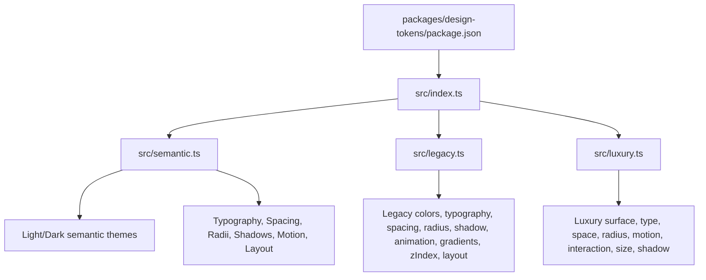
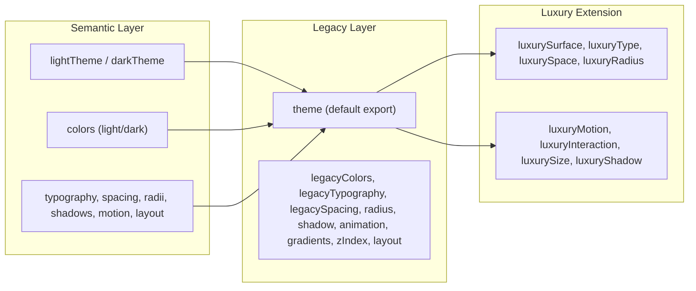
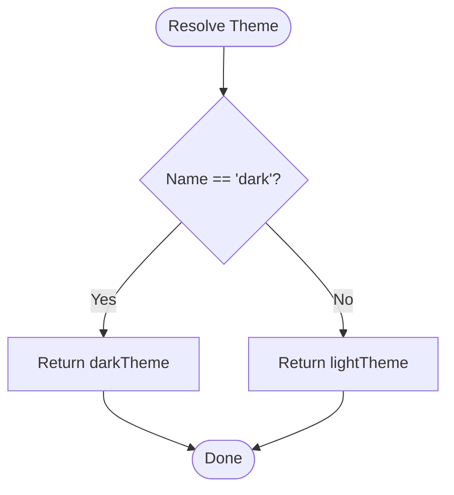
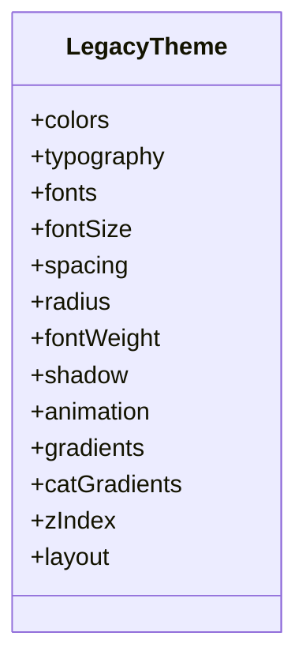
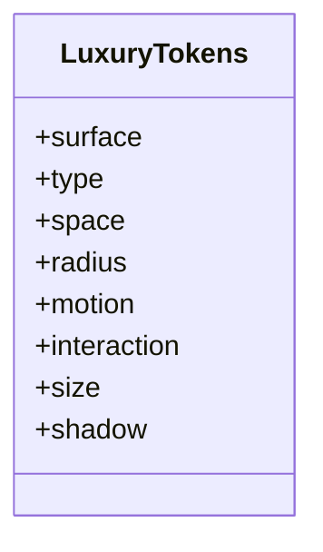
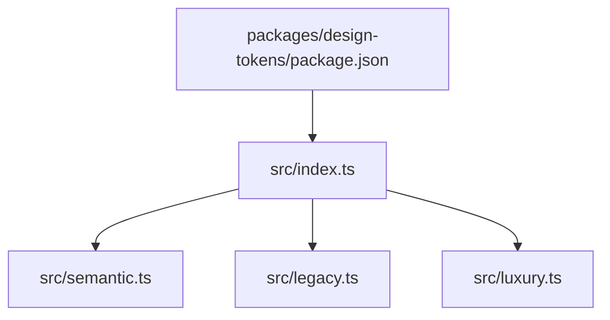

# Design Tokens

<cite>
**Referenced Files in This Document**
- [index.ts](file://packages/design-tokens/src/index.ts)
- [semantic.ts](file://packages/design-tokens/src/semantic.ts)
- [legacy.ts](file://packages/design-tokens/src/legacy.ts)
- [luxury.ts](file://packages/design-tokens/src/luxury.ts)
- [package.json](file://packages/design-tokens/package.json)
</cite>

## Table of Contents
1. Introduction
2. Project Structure
3. Core Components
4. Architecture Overview
5. Detailed Component Analysis
6. Dependency Analysis
7. Performance Considerations
8. Troubleshooting Guide
9. Conclusion
10. Appendices

## Introduction
This document describes the design tokens system that provides a consistent visual language across web and mobile platforms. It covers color palettes, typography scales, spacing systems, elevation levels, motion timings, and how tokens are structured, exported, and consumed by both web and native applications. It also explains naming conventions, versioning strategy, and migration processes for design updates.

## Project Structure
The design tokens are centralized in a dedicated package with clear separation between:
- Semantic, platform-neutral tokens (light/dark themes, typography, spacing, radii, shadows, motion, layout)
- Legacy theme for backward compatibility
- An additive “luxury” extension for project-specific enhancements without altering core tokens

**Diagram sources**
- [package.json:1-20](file://packages/design-tokens/package.json#L1-L20)
- [index.ts:1-20](file://packages/design-tokens/src/index.ts#L1-L20)
- [semantic.ts:1-369](file://packages/design-tokens/src/semantic.ts#L1-L369)
- [legacy.ts:1-566](file://packages/design-tokens/src/legacy.ts#L1-L566)
- [luxury.ts:1-204](file://packages/design-tokens/src/luxury.ts#L1-L204)

**Section sources**
- [package.json:1-20](file://packages/design-tokens/package.json#L1-L20)
- [index.ts:1-20](file://packages/design-tokens/src/index.ts#L1-L20)

## Core Components
- Semantic theme layer:
  - Light and dark color sets with semantic categories (brand, canvas, text, status, delivery, chart, pharmacy, border).
  - Platform-neutral typography, spacing, radii, shadows, motion, and layout tokens.
  - Theme resolution function to select light or dark at runtime.
- Legacy theme:
  - Comprehensive palette, semantic colors, typography, spacing, radius, shadows, animations, gradients, z-index, and layout constants.
  - Default export preserved for backward compatibility.
- Luxury extension:
  - Additive tokens for premium surfaces, commerce-focused typography roles, spacing aliases, radius, motion, interaction states, sizing, and shadows.

Key exports and their purposes:
- index.ts re-exports semantic, legacy, and luxury; exposes a default legacy theme and an alias for the semantic light theme.
- semantic.ts defines the canonical semantic contracts and theme objects.
- legacy.ts maintains full backward-compatible token set.
- luxury.ts extends tokens for project-specific needs without modifying core.

**Section sources**
- [index.ts:1-20](file://packages/design-tokens/src/index.ts#L1-L20)
- [semantic.ts:1-369](file://packages/design-tokens/src/semantic.ts#L1-L369)
- [legacy.ts:1-566](file://packages/design-tokens/src/legacy.ts#L1-L566)
- [luxury.ts:1-204](file://packages/design-tokens/src/luxury.ts#L1-L204)

## Architecture Overview
The token architecture is layered and additive:
- Base semantic tokens define a platform-neutral contract for colors, typography, spacing, radii, shadows, motion, and layout.
- Legacy theme preserves existing integrations and APIs.
- Luxury extension adds premium features on top without changing base tokens.

**Diagram sources**
- [index.ts:1-20](file://packages/design-tokens/src/index.ts#L1-L20)
- [semantic.ts:330-369](file://packages/design-tokens/src/semantic.ts#L330-L369)
- [legacy.ts:544-566](file://packages/design-tokens/src/legacy.ts#L544-L566)
- [luxury.ts:190-204](file://packages/design-tokens/src/luxury.ts#L190-L204)

## Detailed Component Analysis

### Semantic Theme (light/dark)
- Colors:
  - Semantic groups: brand, canvas, text, status, delivery, chart, pharmacy, border.
  - Two complete sets: lightColors and darkColors.
- Typography:
  - fontFamily, sizes, weights, lineHeights, letterSpacings.
- Spacing:
  - 4-point grid scale with numeric keys.
- Radii:
  - sm, md, lg, xl, 2xl, full.
- Shadows:
  - Five elevation levels defined as renderer-agnostic descriptors.
- Motion:
  - durations (fast, normal, slow) and easing curves.
- Layout:
  - maxContentWidth breakpoints, touchTarget, iconSizes.
- Theme resolution:
  - resolveTheme(name) returns light or dark theme.

**Diagram sources**
- [semantic.ts:362-369](file://packages/design-tokens/src/semantic.ts#L362-L369)

**Section sources**
- [semantic.ts:1-369](file://packages/design-tokens/src/semantic.ts#L1-L369)

### Legacy Theme
- Palette and semantic colors:
  - Full palette with brand, neutral, semantic, hero, glass, overlay, and category palettes.
- Typography:
  - Font references, size map, weight, letterSpacing.
- Spacing:
  - 8pt grid with named aliases.
- Radius:
  - Scale from none to full, plus pill alias.
- Shadows:
  - Multi-level elevation with boxShadow and elevation values.
- Animation:
  - Duration, spring configs, easing curves.
- Gradients:
  - Hero, brand, category pairs, shimmer, semantic gradients.
- Z-index:
  - Standardized stacking order.
- Layout:
  - Tab bar, header, bottom sheet, input/button heights, page padding, max width.
- Default export:
  - theme object aggregates all legacy tokens for backward compatibility.

**Diagram sources**
- [legacy.ts:544-566](file://packages/design-tokens/src/legacy.ts#L544-L566)

**Section sources**
- [legacy.ts:1-566](file://packages/design-tokens/src/legacy.ts#L1-L566)

### Luxury Extension
- Surface hierarchy:
  - Light and dark surfaces with base, s1-s4, overlay, sheet.
- Typography roles:
  - Commerce-oriented roles like navLabel, screenTitle, productName, price variants, button sizes, body, caption, badge, metric.
- Spacing:
  - 4pt grid with semantic aliases (screenH, cardH/V, sectionGap, rowGap, chipGap).
- Radius:
  - xs to 2xl, pill, component-specific radii (card, input, button, sheet, badge, chip).
- Motion:
  - duration tiers, spring presets, easing curves.
- Interaction states:
  - pressed/hover tints, focus ring color/width, disabled opacity per theme.
- Sizing:
  - Touch target, button/input heights, tab/header heights, product card dimensions, avatar/icon sizes.
- Shadow:
  - Native-friendly shadow descriptors with elevation, offset, opacity, radius, and optional color.
- Combined export:
  - luxury object aggregates all extension tokens.

**Diagram sources**
- [luxury.ts:190-204](file://packages/design-tokens/src/luxury.ts#L190-L204)

**Section sources**
- [luxury.ts:1-204](file://packages/design-tokens/src/luxury.ts#L1-L204)

### Token Usage Examples
- Web consumption:
  - Import semantic theme via index.ts and use resolveTheme to switch light/dark.
  - Use typography, spacing, radii, shadows, motion, and layout tokens in styles.
  - Example paths:
    - [semantic.ts:214-248](file://packages/design-tokens/src/semantic.ts#L214-L248)
    - [semantic.ts:250-265](file://packages/design-tokens/src/semantic.ts#L250-L265)
    - [semantic.ts:267-275](file://packages/design-tokens/src/semantic.ts#L267-L275)
    - [semantic.ts:288-295](file://packages/design-tokens/src/semantic.ts#L288-L295)
    - [semantic.ts:297-310](file://packages/design-tokens/src/semantic.ts#L297-L310)
    - [semantic.ts:312-325](file://packages/design-tokens/src/semantic.ts#L312-L325)
    - [semantic.ts:339-351](file://packages/design-tokens/src/semantic.ts#L339-L351)
    - [semantic.ts:362-369](file://packages/design-tokens/src/semantic.ts#L362-L369)
- Mobile consumption:
  - Use legacy theme defaults for backward compatibility.
  - Apply shadows with both elevation and boxShadow where needed.
  - Example paths:
    - [legacy.ts:377-440](file://packages/design-tokens/src/legacy.ts#L377-L440)
    - [legacy.ts:442-476](file://packages/design-tokens/src/legacy.ts#L442-L476)
    - [legacy.ts:544-566](file://packages/design-tokens/src/legacy.ts#L544-L566)
- Theming customization:
  - Extend luxury tokens for premium surfaces and commerce roles without altering core.
  - Example paths:
    - [luxury.ts:15-34](file://packages/design-tokens/src/luxury.ts#L15-L34)
    - [luxury.ts:39-60](file://packages/design-tokens/src/luxury.ts#L39-L60)
    - [luxury.ts:65-90](file://packages/design-tokens/src/luxury.ts#L65-L90)
    - [luxury.ts:94-108](file://packages/design-tokens/src/luxury.ts#L94-L108)
    - [luxury.ts:113-135](file://packages/design-tokens/src/luxury.ts#L113-L135)
    - [luxury.ts:139-154](file://packages/design-tokens/src/luxury.ts#L139-L154)
    - [luxury.ts:158-176](file://packages/design-tokens/src/luxury.ts#L158-L176)
    - [luxury.ts:180-188](file://packages/design-tokens/src/luxury.ts#L180-L188)

**Section sources**
- [semantic.ts:214-369](file://packages/design-tokens/src/semantic.ts#L214-L369)
- [legacy.ts:377-566](file://packages/design-tokens/src/legacy.ts#L377-L566)
- [luxury.ts:15-204](file://packages/design-tokens/src/luxury.ts#L15-L204)

## Dependency Analysis
- Package entry points:
  - package.json defines module entry and types pointing to src/index.ts.
- Exports:
  - index.ts re-exports semantic, legacy, and luxury; sets default export to legacy theme; exposes designTokens alias for semantic light theme.
- Internal dependencies:
  - semantic.ts defines core tokens and theme resolution.
  - legacy.ts provides comprehensive backward-compatible theme.
  - luxury.ts adds additive extensions.

**Diagram sources**
- [package.json:1-20](file://packages/design-tokens/package.json#L1-L20)
- [index.ts:1-20](file://packages/design-tokens/src/index.ts#L1-L20)

**Section sources**
- [package.json:1-20](file://packages/design-tokens/package.json#L1-L20)
- [index.ts:1-20](file://packages/design-tokens/src/index.ts#L1-L20)

## Performance Considerations
- Prefer semantic tokens for new components to ensure consistency and reduce duplication.
- Use resolveTheme to minimize conditional logic in components; compute theme once at app level.
- Avoid hardcoding colors, spacing, or radii; reference tokens to maintain single source of truth.
- For mobile shadows, leverage unified boxShadow where supported to avoid deprecation warnings and redundant properties.
- Keep luxury extensions additive; do not modify core semantic tokens to prevent ripple changes.

[No sources needed since this section provides general guidance]

## Troubleshooting Guide
- Theme mismatch:
  - Ensure resolveTheme is called with correct name ("light" or "dark") and that consumers read the returned theme consistently.
- Deprecated shadow properties:
  - On newer React Native versions, prefer boxShadow over legacy shadowColor/Offset/Opacity/Radius quartet to avoid console warnings.
- Missing tokens:
  - If a component requires a token not present in semantic layer, extend luxury tokens rather than adding ad-hoc values.
- Backward compatibility:
  - When updating tokens, keep legacy theme intact for existing code; gradually migrate to semantic tokens.

**Section sources**
- [semantic.ts:362-369](file://packages/design-tokens/src/semantic.ts#L362-L369)
- [legacy.ts:369-440](file://packages/design-tokens/src/legacy.ts#L369-L440)

## Conclusion
The design tokens system provides a robust, layered foundation for consistent visuals across web and mobile. The semantic layer ensures platform neutrality, the legacy layer preserves compatibility, and the luxury extension enables project-specific enhancements. By following the naming conventions, using theme resolution, and adopting additive extensions, teams can evolve the design system safely and efficiently.

[No sources needed since this section summarizes without analyzing specific files]

## Appendices

### Naming Conventions
- Colors:
  - Semantic groups: brand, canvas, text, status, delivery, chart, pharmacy, border.
  - Keys describe purpose and role (e.g., primary, secondary, muted, success, warning, error, info).
- Typography:
  - fontFamily, sizes (numeric), weights (regular, medium, semibold, bold, extrabold, black), lineHeights (tight, normal, relaxed), letterSpacings (tight, normal, wide).
- Spacing:
  - Numeric keys aligned to 4pt grid; luxury adds semantic aliases (screenH, cardH/V, sectionGap, rowGap, chipGap).
- Radii:
  - sm, md, lg, xl, 2xl, full; luxury adds component-specific radii (card, input, button, sheet, badge, chip).
- Shadows:
  - Levels: sm, md, lg, xl, 2xl; luxury includes none, hairline, card, raised, sheet, floating, brandFocus.
- Motion:
  - Durations: fast, normal, slow (semantic); luxury adds instant, micro, standard, emphasized, long.
  - Easing: standard, decelerate, accelerate, easeInOut; luxury adds sharp, emphasized.
- Layout:
  - maxContentWidth breakpoints (phone, tablet), touchTarget, iconSizes.

**Section sources**
- [semantic.ts:5-71](file://packages/design-tokens/src/semantic.ts#L5-L71)
- [semantic.ts:214-325](file://packages/design-tokens/src/semantic.ts#L214-L325)
- [luxury.ts:39-108](file://packages/design-tokens/src/luxury.ts#L39-L108)
- [luxury.ts:113-188](file://packages/design-tokens/src/luxury.ts#L113-L188)

### Versioning Strategy
- Package versioning:
  - Maintain semantic versioning in package.json; increment minor versions for additive changes (new tokens), patch for fixes, major for breaking changes.
- Token evolution:
  - Prefer additive changes in luxury extension to avoid breaking consumers.
  - Introduce new semantic tokens alongside legacy ones; deprecate old names gradually.
- Migration:
  - Provide mapping guides when renaming or restructuring tokens.
  - Update consumers incrementally; keep legacy theme stable until migration completes.

**Section sources**
- [package.json:1-20](file://packages/design-tokens/package.json#L1-L20)
- [index.ts:1-20](file://packages/design-tokens/src/index.ts#L1-L20)

### Migration Processes for Design Updates
- Step-by-step:
  - Identify affected components using hardcoded values.
  - Replace with semantic tokens; if unavailable, add to luxury extension first.
  - Validate theme switching with resolveTheme across light/dark modes.
  - Test shadows and motion on both web and mobile targets.
  - Update documentation and component stories to reflect new tokens.
- Validation:
  - Run type checks and linting to catch mismatches.
  - Visual regression tests for critical screens.

[No sources needed since this section provides general guidance]