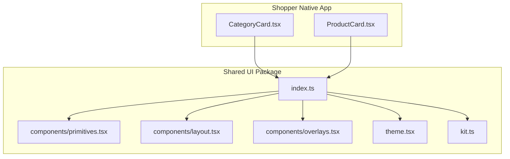
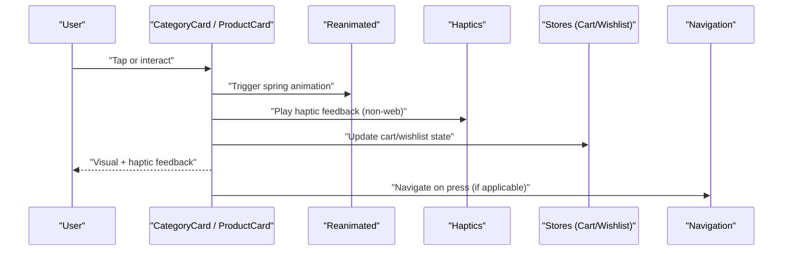
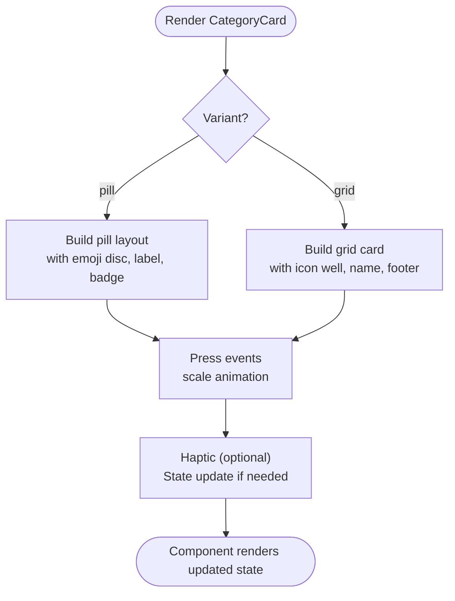
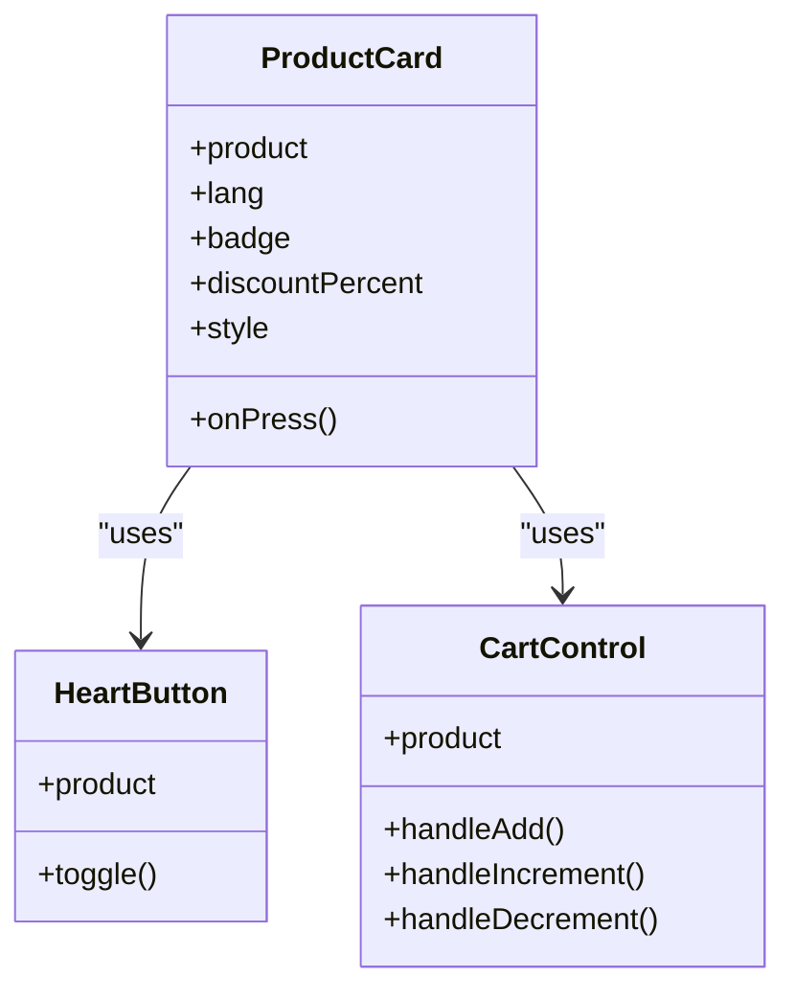
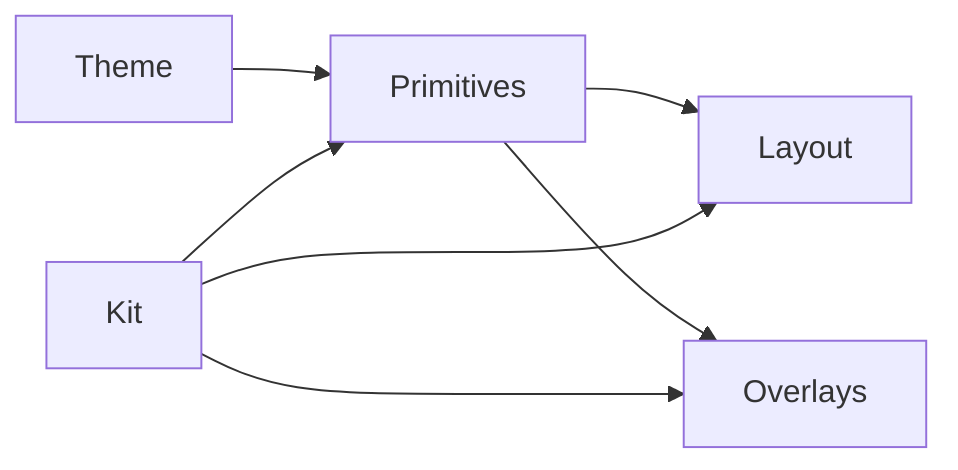
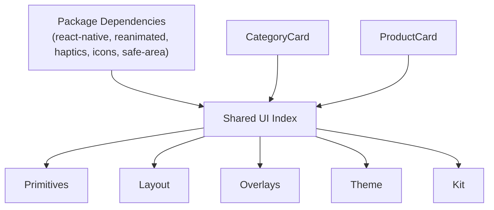

# Native Components (React Native)

<cite>
**Referenced Files in This Document**
- [package.json](file://packages/ui-native/package.json)
- [index.ts](file://packages/ui-native/src/index.ts)
- [primitives.tsx](file://packages/ui-native/src/components/primitives.tsx)
- [layout.tsx](file://packages/ui-native/src/components/layout.tsx)
- [overlays.tsx](file://packages/ui-native/src/components/overlays.tsx)
- [theme.tsx](file://packages/ui-native/src/theme.tsx)
- [kit.ts](file://packages/ui-native/src/kit.ts)
- [CategoryCard.tsx](file://apps/shopper-native/src/components/CategoryCard.tsx)
- [ProductCard.tsx](file://apps/shopper-native/src/components/ProductCard.tsx)
</cite>

## Table of Contents
1. [Introduction](#introduction)
2. [Project Structure](#project-structure)
3. [Core Components](#core-components)
4. [Architecture Overview](#architecture-overview)
5. [Detailed Component Analysis](#detailed-component-analysis)
6. [Dependency Analysis](#dependency-analysis)
7. [Performance Considerations](#performance-considerations)
8. [Troubleshooting Guide](#troubleshooting-guide)
9. [Conclusion](#conclusion)
10. [Appendices](#appendices)

## Introduction
This document describes the React Native component library and its usage within the shopper-native application. It focuses on:
- Component APIs exposed by the shared UI package
- Platform-specific adaptations for mobile layouts, gestures, and animations
- Integration with Reanimated for smooth interactions
- Accessibility, responsive layout strategies, and composition patterns
- Performance considerations, memory management, and testing approaches for native components

The goal is to help developers understand how to build consistent, accessible, and performant cross-platform mobile UIs using the provided primitives and higher-level components.

## Project Structure
At a high level:
- The shared design system lives under packages/ui-native and exposes primitives, layout utilities, overlays, theme tokens, and a curated CustomerUI surface.
- The shopper-native app composes these primitives into feature-specific screens and reusable cards like CategoryCard and ProductCard.
- Animations are implemented with react-native-reanimated; haptics via expo-haptics; icons via @expo/vector-icons; images via expo-image where applicable.

**Diagram sources**
- [index.ts:1-9](file://packages/ui-native/src/index.ts#L1-L9)
- [CategoryCard.tsx:35-68](file://apps/shopper-native/src/components/CategoryCard.tsx#L35-L68)
- [ProductCard.tsx:11-27](file://apps/shopper-native/src/components/ProductCard.tsx#L11-L27)

**Section sources**
- [package.json:1-38](file://packages/ui-native/package.json#L1-L38)
- [index.ts:1-9](file://packages/ui-native/src/index.ts#L1-L9)

## Core Components
The shared UI package provides:
- Primitives: foundational building blocks such as Text, View wrappers, and other base elements used across the app.
- Layout: direction-aware helpers (e.g., RTL support), spacing, and alignment utilities.
- Overlays: modals, sheets, and other overlay surfaces.
- Theme and Kit: design tokens, colors, radii, shadows, and typography scales.

These are exported from the package entry point and consumed by app components to ensure consistency and reusability.

Key responsibilities:
- Primitives encapsulate platform differences and provide a stable API.
- Layout utilities simplify RTL/LTR handling and flex arrangements.
- Overlays standardize modal behavior and safe area handling.
- Theme/Kit centralize visual tokens for consistent styling.

**Section sources**
- [index.ts:1-9](file://packages/ui-native/src/index.ts#L1-L9)
- [primitives.tsx:1-200](file://packages/ui-native/src/components/primitives.tsx#L1-L200)
- [layout.tsx:1-200](file://packages/ui-native/src/components/layout.tsx#L1-L200)
- [overlays.tsx:1-200](file://packages/ui-native/src/components/overlays.tsx#L1-L200)
- [theme.tsx:1-200](file://packages/ui-native/src/theme.tsx#L1-L200)
- [kit.ts:1-200](file://packages/ui-native/src/kit.ts#L1-L200)

## Architecture Overview
The architecture separates concerns between the shared UI package and the app’s feature components:
- Shared UI package: defines primitives, layout helpers, overlays, and theme tokens.
- App components: compose primitives into domain-specific UI (cards, lists, forms).
- Animation layer: uses Reanimated for gesture-driven transitions and spring-based feedback.
- Haptics and accessibility: integrated at interaction points for tactile and screen-reader feedback.

**Diagram sources**
- [CategoryCard.tsx:215-244](file://apps/shopper-native/src/components/CategoryCard.tsx#L215-L244)
- [ProductCard.tsx:43-74](file://apps/shopper-native/src/components/ProductCard.tsx#L43-L74)
- [ProductCard.tsx:77-135](file://apps/shopper-native/src/components/ProductCard.tsx#L77-L135)

## Detailed Component Analysis

### CategoryCard
Purpose:
- Displays categories in two variants: pill (horizontal strip) and grid (Shop tab).
- Provides animated press feedback, count badges, and RTL-aware layout.

API highlights:
- Props include category data, language selection, variant selection, active state, and onPress handler.
- Uses Reanimated for scale animations on press.
- Integrates with shared UI text and kit tokens for consistent styling.

Accessibility:
- Exposes accessibilityRole and accessibilityLabel for screen readers.

Platform specifics:
- Uses direction-aware row orientation and chevron glyph selection for RTL/LTR.
- Applies platform-appropriate shadows and borders via kit tokens.

**Diagram sources**
- [CategoryCard.tsx:215-333](file://apps/shopper-native/src/components/CategoryCard.tsx#L215-L333)
- [CategoryCard.tsx:341-439](file://apps/shopper-native/src/components/CategoryCard.tsx#L341-L439)

**Section sources**
- [CategoryCard.tsx:183-197](file://apps/shopper-native/src/components/CategoryCard.tsx#L183-L197)
- [CategoryCard.tsx:215-333](file://apps/shopper-native/src/components/CategoryCard.tsx#L215-L333)
- [CategoryCard.tsx:341-439](file://apps/shopper-native/src/components/CategoryCard.tsx#L341-L439)
- [CategoryCard.tsx:497-800](file://apps/shopper-native/src/components/CategoryCard.tsx#L497-L800)

### ProductCard
Purpose:
- Unified product card for Home, Search, Category, and Explore views.
- Supports badges (sale/new/bestseller), discount display, wishlist toggle, and cart quantity stepper.
- Integrates haptics and Reanimated for smooth interactions.

API highlights:
- Props include product data, language, optional badge/discount, onPress, and style overrides.
- Subcomponents: HeartButton (wishlist), CartControl (add/increment/decrement/remove).

Accessibility:
- Buttons expose roles and labels for screen readers.

Platform specifics:
- Haptics are gated behind non-web platforms.
- Image loading uses optimized image handling with placeholders and caching policies.

**Diagram sources**
- [ProductCard.tsx:33-40](file://apps/shopper-native/src/components/ProductCard.tsx#L33-L40)
- [ProductCard.tsx:43-74](file://apps/shopper-native/src/components/ProductCard.tsx#L43-L74)
- [ProductCard.tsx:77-135](file://apps/shopper-native/src/components/ProductCard.tsx#L77-L135)
- [ProductCard.tsx:138-223](file://apps/shopper-native/src/components/ProductCard.tsx#L138-L223)

**Section sources**
- [ProductCard.tsx:11-27](file://apps/shopper-native/src/components/ProductCard.tsx#L11-L27)
- [ProductCard.tsx:43-74](file://apps/shopper-native/src/components/ProductCard.tsx#L43-L74)
- [ProductCard.tsx:77-135](file://apps/shopper-native/src/components/ProductCard.tsx#L77-L135)
- [ProductCard.tsx:138-223](file://apps/shopper-native/src/components/ProductCard.tsx#L138-L223)
- [ProductCard.tsx:225-241](file://apps/shopper-native/src/components/ProductCard.tsx#L225-L241)

### Shared UI Package: Primitives, Layout, Overlays, Theme, Kit
Primitives:
- Provide base UI elements with consistent props and behaviors.
- Encapsulate platform differences and ensure predictable rendering.

Layout:
- Direction-aware helpers for RTL/LTR, including row orientation and text alignment.
- Utilities for spacing and alignment that work across languages.

Overlays:
- Standardized modal/sheet implementations with safe area handling.

Theme and Kit:
- Centralized design tokens for colors, radii, shadows, and typography.
- Consistent visual language across components.

**Diagram sources**
- [index.ts:1-9](file://packages/ui-native/src/index.ts#L1-L9)
- [primitives.tsx:1-200](file://packages/ui-native/src/components/primitives.tsx#L1-L200)
- [layout.tsx:1-200](file://packages/ui-native/src/components/layout.tsx#L1-L200)
- [overlays.tsx:1-200](file://packages/ui-native/src/components/overlays.tsx#L1-L200)
- [theme.tsx:1-200](file://packages/ui-native/src/theme.tsx#L1-L200)
- [kit.ts:1-200](file://packages/ui-native/src/kit.ts#L1-L200)

**Section sources**
- [primitives.tsx:1-200](file://packages/ui-native/src/components/primitives.tsx#L1-L200)
- [layout.tsx:1-200](file://packages/ui-native/src/components/layout.tsx#L1-L200)
- [overlays.tsx:1-200](file://packages/ui-native/src/components/overlays.tsx#L1-L200)
- [theme.tsx:1-200](file://packages/ui-native/src/theme.tsx#L1-L200)
- [kit.ts:1-200](file://packages/ui-native/src/kit.ts#L1-L200)

## Dependency Analysis
External dependencies and peer requirements:
- react-native and react versions are specified as peers.
- react-native-reanimated is required for animations.
- expo-haptics for tactile feedback on non-web platforms.
- @expo/vector-icons for icons.
- react-native-safe-area-context for safe area handling.

Internal relationships:
- App components depend on the shared UI package exports.
- Shared package depends on design tokens and peer libraries.

**Diagram sources**
- [package.json:26-36](file://packages/ui-native/package.json#L26-L36)
- [index.ts:1-9](file://packages/ui-native/src/index.ts#L1-L9)
- [CategoryCard.tsx:35-68](file://apps/shopper-native/src/components/CategoryCard.tsx#L35-L68)
- [ProductCard.tsx:11-27](file://apps/shopper-native/src/components/ProductCard.tsx#L11-L27)

**Section sources**
- [package.json:1-38](file://packages/ui-native/package.json#L1-L38)
- [index.ts:1-9](file://packages/ui-native/src/index.ts#L1-L9)

## Performance Considerations
- Use memoization for expensive components to avoid unnecessary re-renders.
- Prefer Reanimated for animations to keep them off the JS thread where possible.
- Gate haptics on non-web platforms to reduce overhead.
- Optimize images with placeholders and caching policies to improve perceived performance.
- Keep prop shapes minimal and stable to reduce diffing costs.
- Avoid heavy computations inside render; move to hooks or memoized values.
- Use skeleton loaders for list items to maintain scroll performance during data fetches.

[No sources needed since this section provides general guidance]

## Troubleshooting Guide
Common issues and resolutions:
- Animation jank: Ensure animations use Reanimated shared values and avoid layout thrashing.
- Haptics not firing: Confirm platform check excludes web and that haptics are installed/configured.
- RTL misalignment: Verify direction-aware layout helpers are applied consistently.
- Accessibility gaps: Add accessibilityRole and meaningful labels to interactive elements.
- Memory leaks: Unsubscribe listeners and cancel animations when components unmount.
- Navigation integration: Ensure navigation calls are guarded and handle back actions gracefully.

**Section sources**
- [CategoryCard.tsx:215-333](file://apps/shopper-native/src/components/CategoryCard.tsx#L215-L333)
- [ProductCard.tsx:43-74](file://apps/shopper-native/src/components/ProductCard.tsx#L43-L74)
- [ProductCard.tsx:77-135](file://apps/shopper-native/src/components/ProductCard.tsx#L77-L135)

## Conclusion
The React Native component library provides a robust foundation for building cross-platform mobile UIs with consistent design tokens, accessible primitives, and smooth animations. By composing shared primitives into feature-specific components like CategoryCard and ProductCard, teams can maintain visual consistency while adapting to platform nuances. Following the performance and accessibility guidelines ensures a high-quality user experience across devices and languages.

[No sources needed since this section summarizes without analyzing specific files]

## Appendices

### Component Composition Examples
- Combine primitives to build complex cards with layered content (image, badges, controls).
- Use layout utilities to ensure correct RTL/LTR behavior across all screens.
- Integrate overlays for modals and sheets with consistent safe area handling.

[No sources needed since this section doesn't analyze specific files]

### Testing Approaches for Native Components
- Unit test component logic and state updates using lightweight renderers.
- Snapshot tests for visual regression on static states.
- Interaction tests for gestures and animations where feasible.
- Accessibility audits to verify roles and labels.

[No sources needed since this section doesn't analyze specific files]