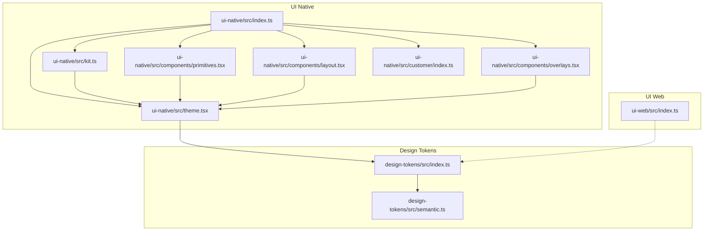
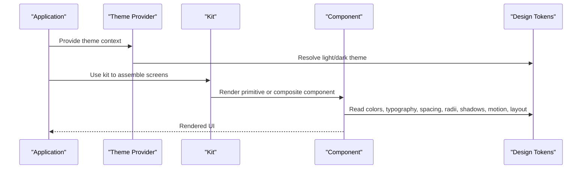
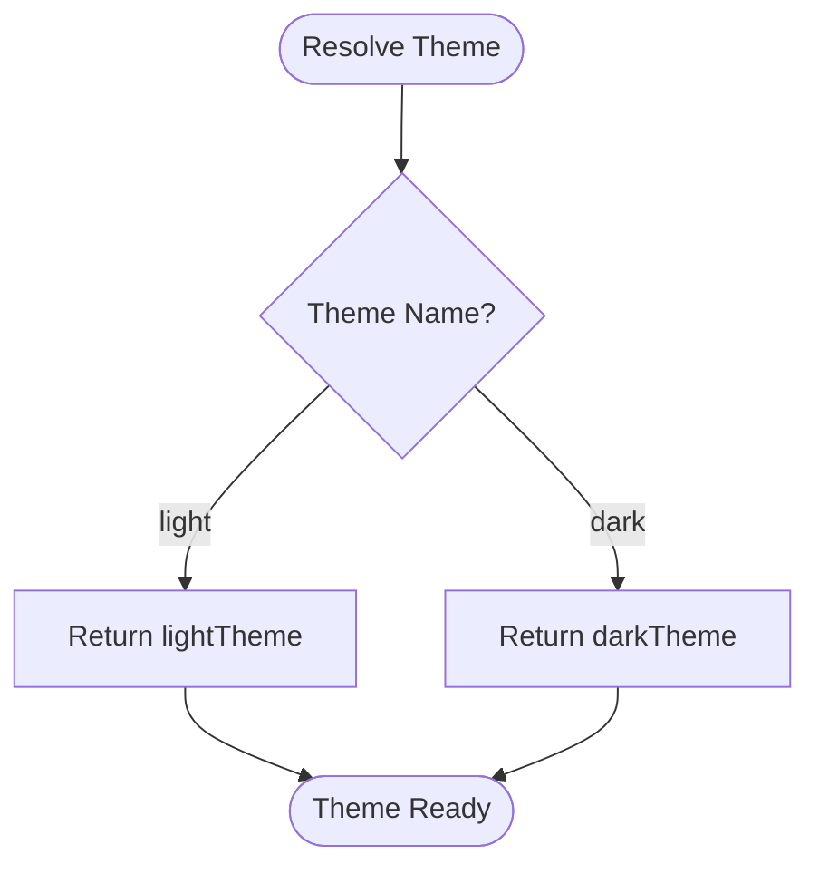
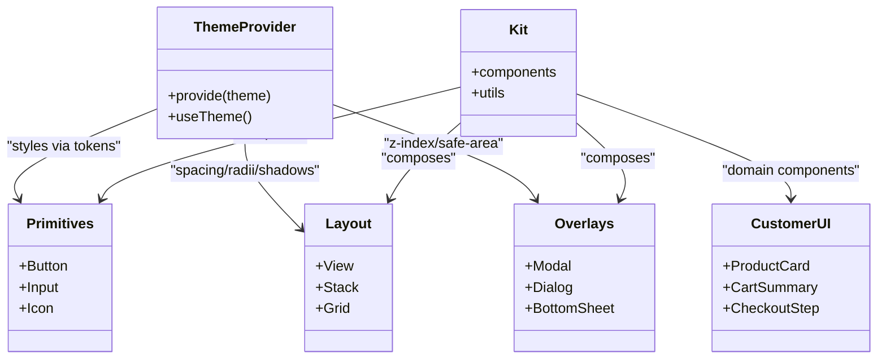
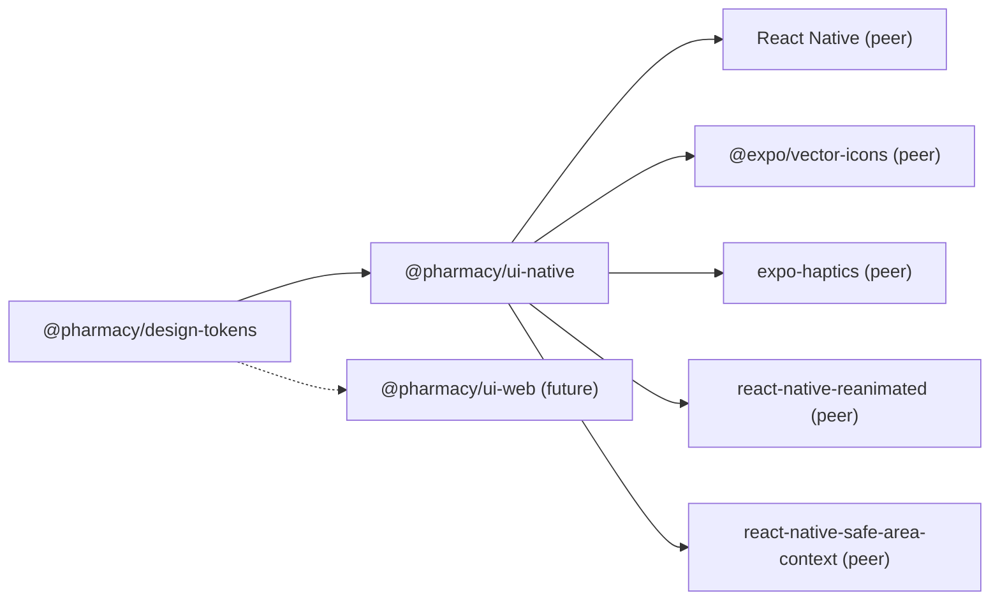

# UI Component Libraries

<cite>
**Referenced Files in This Document**
- [packages/design-tokens/src/index.ts](file://packages/design-tokens/src/index.ts)
- [packages/design-tokens/src/semantic.ts](file://packages/design-tokens/src/semantic.ts)
- [packages/ui-native/src/index.ts](file://packages/ui-native/src/index.ts)
- [packages/ui-native/src/theme.tsx](file://packages/ui-native/src/theme.tsx)
- [packages/ui-native/src/kit.ts](file://packages/ui-native/src/kit.ts)
- [packages/ui-native/src/components/primitives.tsx](file://packages/ui-native/src/components/primitives.tsx)
- [packages/ui-native/src/components/layout.tsx](file://packages/ui-native/src/components/layout.tsx)
- [packages/ui-native/src/components/overlays.tsx](file://packages/ui-native/src/components/overlays.tsx)
- [packages/ui-native/src/customer/index.ts](file://packages/ui-native/src/customer/index.ts)
- [packages/ui-web/src/index.ts](file://packages/ui-web/src/index.ts)
</cite>

## Table of Contents
1. Introduction
2. Project Structure
3. Core Components
4. Architecture Overview
5. Detailed Component Analysis
6. Dependency Analysis
7. Performance Considerations
8. Troubleshooting Guide
9. Conclusion

## Introduction
This document describes the shared design system and UI component libraries that provide consistent design across web and mobile platforms. It covers:
- Shared design tokens for colors, typography, spacing, radii, shadows, motion, and layout
- A theming system with light and dark semantic themes
- Platform-specific adaptations: React-based components for web and React Native primitives for native
- Component API surface, customization options, accessibility considerations, and responsive patterns
- Examples of composition, styling approaches, and integration points
- Performance and bundle optimization guidance
- Contribution guidelines for extending the library

## Project Structure
The design system is organized into three primary packages:
- Design tokens: platform-neutral definitions for colors, typography, spacing, radii, shadows, motion, and layout
- UI native: React Native components built on top of design tokens, exposing a cohesive kit and theme provider
- UI web: placeholder package indicating where web components will be published; currently minimal

**Diagram sources**
- [packages/design-tokens/src/index.ts:1-20](file://packages/design-tokens/src/index.ts#L1-L20)
- [packages/design-tokens/src/semantic.ts:1-369](file://packages/design-tokens/src/semantic.ts#L1-L369)
- [packages/ui-native/src/index.ts:1-9](file://packages/ui-native/src/index.ts#L1-L9)
- [packages/ui-native/src/theme.tsx:1-200](file://packages/ui-native/src/theme.tsx#L1-L200)
- [packages/ui-native/src/kit.ts:1-200](file://packages/ui-native/src/kit.ts#L1-L200)
- [packages/ui-native/src/components/primitives.tsx:1-200](file://packages/ui-native/src/components/primitives.tsx#L1-L200)
- [packages/ui-native/src/components/layout.tsx:1-200](file://packages/ui-native/src/components/layout.tsx#L1-L200)
- [packages/ui-native/src/components/overlays.tsx:1-200](file://packages/ui-native/src/components/overlays.tsx#L1-L200)
- [packages/ui-native/src/customer/index.ts:1-200](file://packages/ui-native/src/customer/index.ts#L1-L200)
- [packages/ui-web/src/index.ts:1-4](file://packages/ui-web/src/index.ts#L1-L4)

**Section sources**
- [packages/design-tokens/src/index.ts:1-20](file://packages/design-tokens/src/index.ts#L1-L20)
- [packages/ui-native/src/index.ts:1-9](file://packages/ui-native/src/index.ts#L1-L9)
- [packages/ui-web/src/index.ts:1-4](file://packages/ui-web/src/index.ts#L1-L4)

## Core Components
- Design tokens define a single source of truth for visual language:
  - Semantic color scales (brand, canvas, text, status, delivery, chart, pharmacy, border)
  - Typography (font family, sizes, weights, line heights, letter spacings)
  - Spacing scale, corner radii, shadows, motion timings/easings, and layout constraints
- Theming:
  - Light and dark semantic themes are provided as complete objects
  - A resolver function returns the requested theme by name
  - Legacy exports are preserved for backward compatibility
- UI Native:
  - Exposes a theme provider and a kit object to compose screens
  - Primitives, layout, overlays, and customer-facing components are re-exported from the package root
- UI Web:
  - Currently a stub package; intended for future React-based web components

**Section sources**
- [packages/design-tokens/src/semantic.ts:1-369](file://packages/design-tokens/src/semantic.ts#L1-L369)
- [packages/design-tokens/src/index.ts:1-20](file://packages/design-tokens/src/index.ts#L1-L20)
- [packages/ui-native/src/index.ts:1-9](file://packages/ui-native/src/index.ts#L1-L9)
- [packages/ui-native/src/theme.tsx:1-200](file://packages/ui-native/src/theme.tsx#L1-L200)
- [packages/ui-native/src/kit.ts:1-200](file://packages/ui-native/src/kit.ts#L1-L200)
- [packages/ui-native/src/components/primitives.tsx:1-200](file://packages/ui-native/src/components/primitives.tsx#L1-L200)
- [packages/ui-native/src/components/layout.tsx:1-200](file://packages/ui-native/src/components/layout.tsx#L1-L200)
- [packages/ui-native/src/components/overlays.tsx:1-200](file://packages/ui-native/src/components/overlays.tsx#L1-L200)
- [packages/ui-native/src/customer/index.ts:1-200](file://packages/ui-native/src/customer/index.ts#L1-L200)
- [packages/ui-web/src/index.ts:1-4](file://packages/ui-web/src/index.ts#L1-L4)

## Architecture Overview
The architecture separates concerns into layers:
- Token layer: platform-neutral definitions consumed by both web and native
- Theme layer: resolves semantic themes and exposes values to consumers
- Component layer: builds reusable UI primitives and higher-order components per platform
- Application layer: composes kits and providers to render screens consistently

**Diagram sources**
- [packages/design-tokens/src/semantic.ts:339-369](file://packages/design-tokens/src/semantic.ts#L339-L369)
- [packages/ui-native/src/theme.tsx:1-200](file://packages/ui-native/src/theme.tsx#L1-L200)
- [packages/ui-native/src/kit.ts:1-200](file://packages/ui-native/src/kit.ts#L1-L200)
- [packages/ui-native/src/components/primitives.tsx:1-200](file://packages/ui-native/src/components/primitives.tsx#L1-L200)

## Detailed Component Analysis

### Design Tokens
- Semantic colors:
  - Organized into brand, canvas, text, status, delivery, chart, pharmacy, and border groups
  - Separate light and dark palettes with a default export pointing to light
- Typography:
  - Cairo font family with standardized sizes, weights, line heights, and letter spacings
- Spacing and Radii:
  - Consistent 4-point spacing scale and corner radius tokens
- Shadows:
  - Renderer-agnostic shadow descriptors with elevation, blur, spread, color, and opacity
- Motion:
  - Standard durations and easing curves for consistent animations
- Layout:
  - Max content widths for phone/tablet, touch target size, and icon sizes
- Theme resolution:
  - resolveTheme returns the appropriate theme by name

**Diagram sources**
- [packages/design-tokens/src/semantic.ts:339-369](file://packages/design-tokens/src/semantic.ts#L339-L369)

**Section sources**
- [packages/design-tokens/src/semantic.ts:1-369](file://packages/design-tokens/src/semantic.ts#L1-L369)
- [packages/design-tokens/src/index.ts:1-20](file://packages/design-tokens/src/index.ts#L1-L20)

### UI Native Package
- Entry point:
  - Re-exports theme, kit, primitives, layout, overlays, and customer UI
- Theme provider:
  - Supplies resolved theme values to descendants via context
- Kit:
  - Aggregates components and utilities for composing screens quickly
- Primitives:
  - Low-level building blocks (e.g., buttons, inputs, icons) styled with tokens
- Layout:
  - Flexbox-based containers and spacing helpers aligned with token spacing
- Overlays:
  - Modals, dialogs, and bottom sheets using safe area and z-index strategies
- Customer UI:
  - Domain-specific components tailored for shopper experiences

**Diagram sources**
- [packages/ui-native/src/index.ts:1-9](file://packages/ui-native/src/index.ts#L1-L9)
- [packages/ui-native/src/theme.tsx:1-200](file://packages/ui-native/src/theme.tsx#L1-L200)
- [packages/ui-native/src/kit.ts:1-200](file://packages/ui-native/src/kit.ts#L1-L200)
- [packages/ui-native/src/components/primitives.tsx:1-200](file://packages/ui-native/src/components/primitives.tsx#L1-L200)
- [packages/ui-native/src/components/layout.tsx:1-200](file://packages/ui-native/src/components/layout.tsx#L1-L200)
- [packages/ui-native/src/components/overlays.tsx:1-200](file://packages/ui-native/src/components/overlays.tsx#L1-L200)
- [packages/ui-native/src/customer/index.ts:1-200](file://packages/ui-native/src/customer/index.ts#L1-L200)

**Section sources**
- [packages/ui-native/src/index.ts:1-9](file://packages/ui-native/src/index.ts#L1-L9)
- [packages/ui-native/src/theme.tsx:1-200](file://packages/ui-native/src/theme.tsx#L1-L200)
- [packages/ui-native/src/kit.ts:1-200](file://packages/ui-native/src/kit.ts#L1-L200)
- [packages/ui-native/src/components/primitives.tsx:1-200](file://packages/ui-native/src/components/primitives.tsx#L1-L200)
- [packages/ui-native/src/components/layout.tsx:1-200](file://packages/ui-native/src/components/layout.tsx#L1-L200)
- [packages/ui-native/src/components/overlays.tsx:1-200](file://packages/ui-native/src/components/overlays.tsx#L1-L200)
- [packages/ui-native/src/customer/index.ts:1-200](file://packages/ui-native/src/customer/index.ts#L1-L200)

### UI Web Package
- Current state:
  - Minimal stub exporting metadata about the package
- Future direction:
  - Intended to host React-based components that consume design tokens and mirror native APIs where possible

**Section sources**
- [packages/ui-web/src/index.ts:1-4](file://packages/ui-web/src/index.ts#L1-L4)

## Dependency Analysis
- ui-native depends on design-tokens for shared visual language
- ui-native declares peer dependencies for React, React Native, and related runtime libraries
- ui-web is currently independent but designed to depend on design-tokens when components are added

**Diagram sources**
- [packages/ui-native/package.json:1-38](file://packages/ui-native/package.json#L1-L38)
- [packages/design-tokens/package.json:1-20](file://packages/design-tokens/package.json#L1-L20)
- [packages/ui-web/package.json:1-7](file://packages/ui-web/package.json#L1-L7)

**Section sources**
- [packages/ui-native/package.json:1-38](file://packages/ui-native/package.json#L1-L38)
- [packages/design-tokens/package.json:1-20](file://packages/design-tokens/package.json#L1-L20)
- [packages/ui-web/package.json:1-7](file://packages/ui-web/package.json#L1-L7)

## Performance Considerations
- Bundle size:
  - Keep design tokens tree-shakeable by exporting only what is needed
  - Avoid importing entire theme objects when only specific tokens are used
- Rendering:
  - Prefer memoization for expensive components and derived styles
  - Use layout primitives to minimize reflows and ensure stable layouts
- Animations:
  - Leverage motion tokens for consistent durations and easings
  - Avoid heavy JS-driven animations; prefer native-backed solutions where available
- Accessibility:
  - Ensure minimum touch targets align with layout tokens
  - Maintain sufficient contrast ratios using semantic colors
- Theming:
  - Minimize theme context churn by providing stable theme references
  - Avoid dynamic style recalculations inside hot paths

[No sources needed since this section provides general guidance]

## Troubleshooting Guide
- Theme not applied:
  - Verify the theme provider wraps your app and resolves the correct theme name
  - Confirm components read from the theme context rather than hard-coded values
- Inconsistent colors:
  - Ensure components use semantic tokens instead of raw hex values
  - Check that legacy and semantic tokens are not mixed unintentionally
- Overlay issues:
  - Validate safe area usage and z-index stacking order
  - Test on multiple devices to confirm modal behavior
- Accessibility failures:
  - Add proper labels and roles to interactive elements
  - Verify focus states and keyboard navigation
- Build errors:
  - Ensure peer dependencies match declared versions
  - Run type checks to catch mismatches early

**Section sources**
- [packages/ui-native/src/theme.tsx:1-200](file://packages/ui-native/src/theme.tsx#L1-L200)
- [packages/ui-native/src/components/overlays.tsx:1-200](file://packages/ui-native/src/components/overlays.tsx#L1-L200)
- [packages/ui-native/src/components/primitives.tsx:1-200](file://packages/ui-native/src/components/primitives.tsx#L1-L200)

## Conclusion
The design system establishes a robust foundation for consistent UI across platforms:
- Centralized tokens ensure visual coherence
- A clear theming strategy supports light and dark modes
- The native package provides a practical component set built on React Native primitives
- The web package is positioned for future expansion with React-based components
Adopting these patterns will improve maintainability, accessibility, and performance while enabling scalable growth of the design system.

[No sources needed since this section summarizes without analyzing specific files]