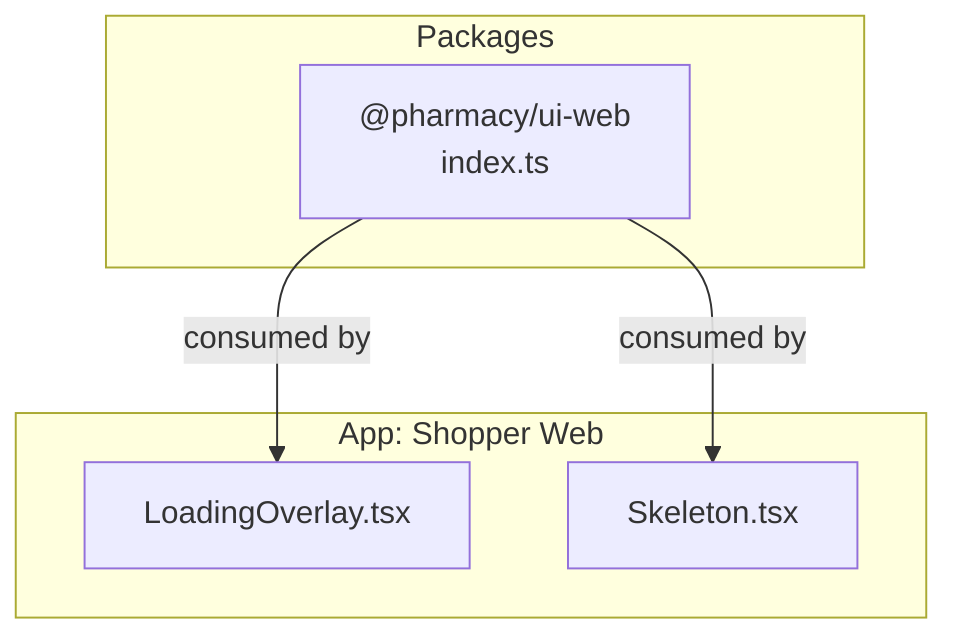
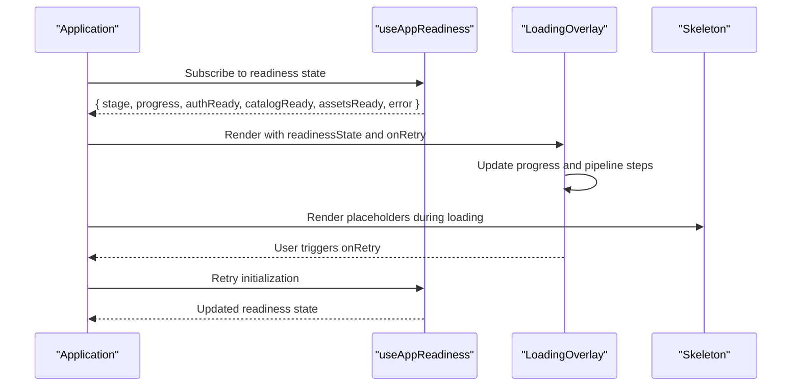
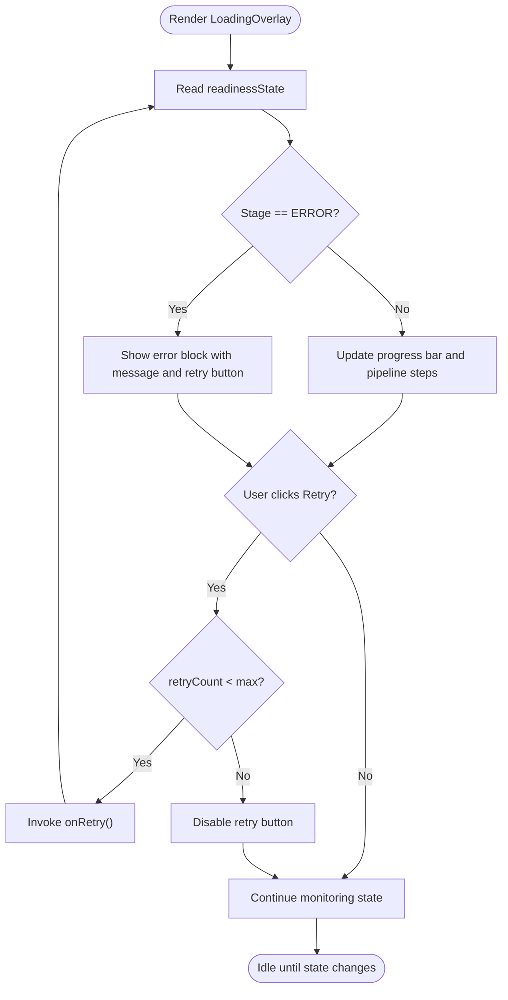
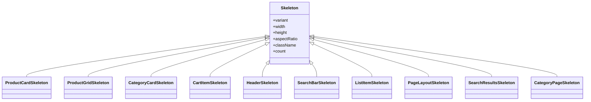
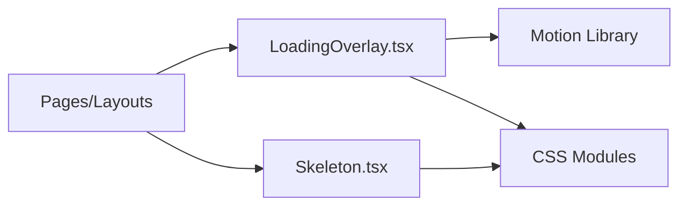

# Web Components (React)

<cite>
**Referenced Files in This Document**
- [LoadingOverlay.tsx](file://apps/shopper-web/src/components/LoadingOverlay.tsx)
- [Skeleton.tsx](file://apps/shopper-web/src/components/Skeleton.tsx)
- [index.ts](file://packages/ui-web/src/index.ts)
- [package.json](file://packages/ui-web/package.json)
</cite>

## Table of Contents
1. [Introduction](#introduction)
2. [Project Structure](#project-structure)
3. [Core Components](#core-components)
4. [Architecture Overview](#architecture-overview)
5. [Detailed Component Analysis](#detailed-component-analysis)
6. [Dependency Analysis](#dependency-analysis)
7. [Performance Considerations](#performance-considerations)
8. [Troubleshooting Guide](#troubleshooting-guide)
9. [Conclusion](#conclusion)
10. [Appendices](#appendices)

## Introduction
This document describes the React-based web component library and patterns used across the web application. It focuses on reusable UI elements, their APIs, props interfaces, event handling, styling approaches with CSS modules and Tailwind CSS, accessibility considerations, responsive design patterns, integration points with data fetching and state management, performance optimization techniques, bundle size considerations, and testing strategies. The goal is to provide a clear, progressive guide for both new and experienced contributors to understand how components are composed, styled, and optimized within the project.

## Project Structure
The repository organizes shared web UI assets under a dedicated package and implements concrete components within the shopper-web application:
- packages/ui-web: A lightweight package that currently exposes a minimal identifier for the web UI package.
- apps/shopper-web/src/components: Contains reusable UI components such as LoadingOverlay and Skeleton, which demonstrate composition, animation, and styling practices.

**Diagram sources**
- [index.ts:1-4](file://packages/ui-web/src/index.ts#L1-L4)
- [LoadingOverlay.tsx:1-236](file://apps/shopper-web/src/components/LoadingOverlay.tsx#L1-L236)
- [Skeleton.tsx:1-221](file://apps/shopper-web/src/components/Skeleton.tsx#L1-L221)

**Section sources**
- [index.ts:1-4](file://packages/ui-web/src/index.ts#L1-L4)
- [package.json:1-7](file://packages/ui-web/package.json#L1-L7)
- [LoadingOverlay.tsx:1-236](file://apps/shopper-web/src/components/LoadingOverlay.tsx#L1-L236)
- [Skeleton.tsx:1-221](file://apps/shopper-web/src/components/Skeleton.tsx#L1-L221)

## Core Components
This section documents the key web components found in the application and their usage patterns.

- LoadingOverlay
  - Purpose: Displays an animated loading overlay with stage messages, progress indication, pipeline steps, and error recovery.
  - Props:
    - readinessState: An object describing current app readiness, including flags like authReady, catalogReady, assetsReady, stage, progress, error, retryCount, and shouldShowOverlay.
    - onRetry: Callback invoked when the user retries loading after an error.
  - Behavior:
    - Renders different stages with localized messages and animated transitions.
    - Shows a progress bar and pipeline steps for Account, Catalog, and Assets.
    - Provides accessible attributes for screen readers and keyboard navigation.
    - Supports retry with a limited number of attempts and disables further retries when the limit is reached.
  - Styling: Uses CSS modules for layout and animations; leverages motion libraries for transitions.
  - Accessibility: Includes role="status", aria-live, aria-busy, aria-label, and aria-hidden where appropriate.

- Skeleton
  - Purpose: Provides zero CLS placeholders for text, images, cards, buttons, lists, and full-page layouts.
  - Props:
    - variant: One of 'text', 'card', 'circle', 'product', 'image', 'button'.
    - width, height: Dimensions for the placeholder.
    - aspectRatio: Maintains proportional sizing for image-like skeletons.
    - className: Additional classes for customization.
    - count: Renders multiple skeletons in a list context.
  - Behavior:
    - Composes higher-level skeletons for product grids, category pages, search results, headers, and cart items.
    - Avoids heavy dependencies for shimmer effects to keep bundle size small.
  - Styling: Pure CSS modules with shimmer animations; respects reduced motion preferences.
  - Accessibility: Uses semantic structure and avoids unnecessary interactive elements.

**Section sources**
- [LoadingOverlay.tsx:5-236](file://apps/shopper-web/src/components/LoadingOverlay.tsx#L5-L236)
- [Skeleton.tsx:3-221](file://apps/shopper-web/src/components/Skeleton.tsx#L3-L221)

## Architecture Overview
The web components integrate with application readiness and data loading pipelines. LoadingOverlay consumes readiness state from hooks and renders feedback while the app initializes authentication, loads catalog data, and prepares assets. Skeleton components are used throughout the UI to prevent layout shifts during data fetches.

**Diagram sources**
- [LoadingOverlay.tsx:25-213](file://apps/shopper-web/src/components/LoadingOverlay.tsx#L25-L213)
- [Skeleton.tsx:17-44](file://apps/shopper-web/src/components/Skeleton.tsx#L17-L44)

## Detailed Component Analysis

### LoadingOverlay
- API surface:
  - Props: readinessState (object), onRetry (function).
  - Internal subcomponents: PipelineStep (label, isComplete, isActive).
- Data flow:
  - Reads readinessState to determine current stage and progress.
  - Updates visual indicators based on authReady, catalogReady, assetsReady.
  - Handles error states and provides retry mechanism with attempt limits.
- Event handling:
  - onRetry invoked via button click; disabled when maximum retries reached.
- Styling:
  - CSS modules for layout and animations.
  - Motion library for entrance/exit transitions and progress bar animation.
- Accessibility:
  - Role and aria attributes ensure proper screen reader announcements.
  - Keyboard-friendly controls and descriptive labels.

**Diagram sources**
- [LoadingOverlay.tsx:25-213](file://apps/shopper-web/src/components/LoadingOverlay.tsx#L25-L213)

**Section sources**
- [LoadingOverlay.tsx:5-236](file://apps/shopper-web/src/components/LoadingOverlay.tsx#L5-L236)

### Skeleton
- API surface:
  - Base Skeleton with variant, dimensions, aspect ratio, class overrides, and count.
  - Composed skeletons: ProductCardSkeleton, ProductGridSkeleton, CategoryCardSkeleton, CartItemSkeleton, HeaderSkeleton, SearchBarSkeleton, ListItemSkeleton, PageLayoutSkeleton, SearchResultsSkeleton, CategoryPageSkeleton.
- Data flow:
  - Used during data loading to reserve space and avoid CLS.
  - Can render multiple items via count prop or composed grid skeletons.
- Styling:
  - CSS modules with shimmer effect; no heavy runtime dependencies.
  - Responsive behavior through flexible widths and aspect ratios.
- Accessibility:
  - Non-interactive placeholders; do not require focus management.

**Diagram sources**
- [Skeleton.tsx:3-221](file://apps/shopper-web/src/components/Skeleton.tsx#L3-L221)

**Section sources**
- [Skeleton.tsx:3-221](file://apps/shopper-web/src/components/Skeleton.tsx#L3-L221)

## Dependency Analysis
- External dependencies:
  - LoadingOverlay uses motion libraries for animations and transitions.
  - Skeleton relies on CSS modules for styling without heavy runtime dependencies.
- Internal relationships:
  - Both components are consumed by application pages and layouts during data fetching and initialization phases.
  - LoadingOverlay depends on readiness state provided by hooks; Skeleton is independent and composable.

**Diagram sources**
- [LoadingOverlay.tsx:1-236](file://apps/shopper-web/src/components/LoadingOverlay.tsx#L1-L236)
- [Skeleton.tsx:1-221](file://apps/shopper-web/src/components/Skeleton.tsx#L1-L221)

**Section sources**
- [LoadingOverlay.tsx:1-236](file://apps/shopper-web/src/components/LoadingOverlay.tsx#L1-L236)
- [Skeleton.tsx:1-221](file://apps/shopper-web/src/components/Skeleton.tsx#L1-L221)

## Performance Considerations
- Bundle size:
  - Skeleton avoids heavy dependencies to keep the bundle light; shimmer is implemented via CSS.
  - LoadingOverlay uses motion libraries; consider lazy-loading or code-splitting if the overlay is not always needed.
- Rendering efficiency:
  - Use Skeleton variants to minimize reflows and maintain stable layouts during data loading.
  - Limit the number of skeleton instances in large grids; prefer virtualization for very long lists.
- Animation performance:
  - Prefer transform and opacity animations for smoothness.
  - Respect prefers-reduced-motion to improve accessibility and reduce CPU usage.
- State-driven rendering:
  - Keep LoadingOverlay driven by a single source of truth (readiness state) to avoid redundant updates.
- Caching and data fetching:
  - Integrate with React Query or similar caching layers to reduce network requests and enable optimistic UI updates.
  - Use Skeleton during cache misses and refetches to maintain perceived performance.

[No sources needed since this section provides general guidance]

## Troubleshooting Guide
- LoadingOverlay errors:
  - If the overlay shows an error, verify readiness state values and ensure onRetry is properly wired.
  - Check that maximum retry limits are respected and that the underlying initialization logic can recover from transient failures.
- Skeleton issues:
  - If layout shifts occur, ensure aspect ratios are set correctly for image-like skeletons and that container sizes are constrained.
  - For large grids, confirm that skeleton counts are reasonable and consider pagination or virtualization.
- Accessibility checks:
  - Validate that aria attributes are present and meaningful.
  - Ensure keyboard navigation works for interactive elements like retry buttons.

**Section sources**
- [LoadingOverlay.tsx:170-207](file://apps/shopper-web/src/components/LoadingOverlay.tsx#L170-L207)
- [Skeleton.tsx:17-44](file://apps/shopper-web/src/components/Skeleton.tsx#L17-L44)

## Conclusion
The web component library emphasizes lightweight, accessible, and composable UI primitives. LoadingOverlay provides robust feedback during application initialization with clear state transitions and error handling. Skeleton components deliver consistent, zero-CLS placeholders across various UI surfaces. Together, they support responsive design, accessibility, and performance best practices. Integrating these components with data fetching and state management ensures a smooth user experience during loading and error scenarios.

[No sources needed since this section summarizes without analyzing specific files]

## Appendices

### Component Composition Examples
- LoadingOverlay composition:
  - Combine readinessState from hooks with onRetry to control overlay visibility and behavior.
  - Use pipeline steps to communicate multi-stage initialization to users.
- Skeleton composition:
  - Build complex page skeletons by composing base Skeleton with specialized variants.
  - Use count and aspectRatio to simulate realistic content structures.

[No sources needed since this section doesn't analyze specific files]

### Integration with React Query and State Management
- Use React Query to manage server state and leverage Skeleton during pending states.
- Connect LoadingOverlay to global readiness state derived from authentication and data loading hooks.
- Ensure retry mechanisms align with query invalidation and refetch policies.

[No sources needed since this section doesn't analyze specific files]

### Testing Strategies
- Unit tests:
  - Verify LoadingOverlay renders correct messages based on stage and progress.
  - Assert Skeleton renders expected variants and counts.
- Interaction tests:
  - Simulate retry clicks and validate onRetry invocation and disable behavior at max retries.
- Visual regression:
  - Capture snapshots of Skeleton compositions to detect unintended layout changes.
- Accessibility tests:
  - Check aria attributes and keyboard navigation for interactive elements.

[No sources needed since this section doesn't analyze specific files]