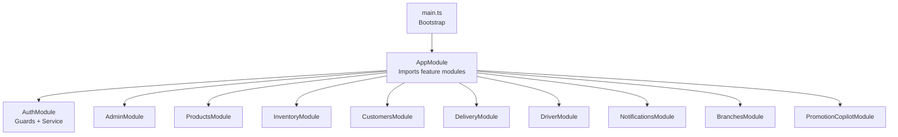
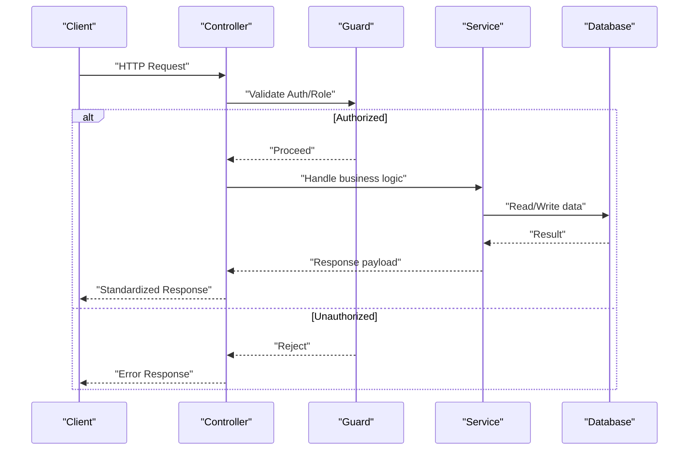
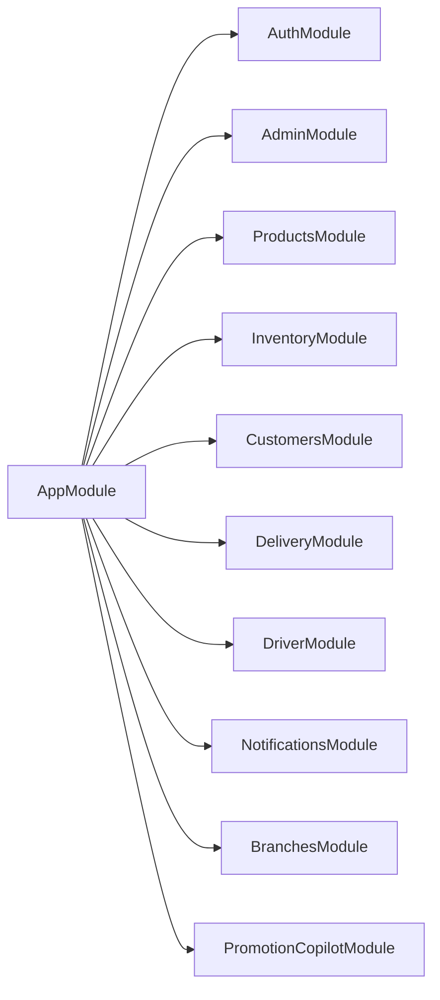

# API Endpoints Reference

<cite>
**Referenced Files in This Document**
- [main.ts](file://apps/api/src/main.ts)
- [app.module.ts](file://apps/api/src/app.module.ts)
- [auth.module.ts](file://apps/api/src/auth/auth.module.ts)
- [admin-auth.controller.ts](file://apps/api/src/modules/admin/admin-auth.controller.ts)
- [admin-operations.controller.ts](file://apps/api/src/modules/admin/admin-operations.controller.ts)
- [branches.controller.ts](file://apps/api/src/modules/branches/branches.controller.ts)
- [customers.controller.ts](file://apps/api/src/modules/customers/customers.controller.ts)
- [delivery.controller.ts](file://apps/api/src/modules/delivery/delivery.controller.ts)
- [driver.controller.ts](file://apps/api/src/modules/driver/driver.controller.ts)
- [admin-driver.controller.ts](file://apps/api/src/modules/driver/admin-driver.controller.ts)
- [inventory.controller.ts](file://apps/api/src/modules/inventory/inventory.controller.ts)
- [notifications.controller.ts](file://apps/api/src/modules/notifications/notifications.controller.ts)
- [products.controller.ts](file://apps/api/src/modules/products/products.controller.ts)
- [promotion-copilot.controller.ts](file://apps/api/src/modules/promotion-copilot/promotion-copilot.controller.ts)
</cite>

## Table of Contents
1. [Introduction](#introduction)
2. [Project Structure](#project-structure)
3. [Core Components](#core-components)
4. [Architecture Overview](#architecture-overview)
5. [Detailed Component Analysis](#detailed-component-analysis)
6. [Dependency Analysis](#dependency-analysis)
7. [Performance Considerations](#performance-considerations)
8. [Troubleshooting Guide](#troubleshooting-guide)
9. [Conclusion](#conclusion)
10. [Appendices](#appendices)

## Introduction
This document provides a comprehensive reference for the RESTful API endpoints exposed by the backend service. It covers authentication, product management, order processing, inventory operations, driver and delivery workflows, notifications, branches, and administrative functions. For each endpoint, you will find HTTP methods, URL patterns, request/response schemas, authentication requirements, parameter validation, status codes, and common usage patterns.

The API is built with NestJS, uses Prisma for data access, and integrates Supabase for authentication. Global interceptors and filters standardize responses and error handling. CORS is configured to allow specific origins and development hosts.

## Project Structure
The API server bootstraps an application module that imports feature modules for domains such as products, inventory, customers, delivery, drivers, notifications, branches, admin, and promotion copilot. The bootstrap process configures CORS, global response interceptor, and exception filter, then listens on a configurable port.

**Diagram sources**
- [main.ts:7-35](file://apps/api/src/main.ts#L7-L35)
- [app.module.ts:14-27](file://apps/api/src/app.module.ts#L14-L27)

**Section sources**
- [main.ts:7-35](file://apps/api/src/main.ts#L7-L35)
- [app.module.ts:14-27](file://apps/api/src/app.module.ts#L14-L27)

## Core Components
- Authentication: Admin login via Supabase; role enforcement ensures only admins can access protected routes. Driver registration/login and profile/location/order lifecycle endpoints are provided under the driver namespace.
- Product Management: Admin-only listing with pagination.
- Inventory Operations: Admin-only listing with pagination.
- Order Processing: Delivery quote calculation; driver order lifecycle (accept/reject, pickup, delivery stages).
- Notifications: Driver token registration and history; admin broadcast to drivers or specific users.
- Branches: Public listing; admin CRUD with pagination.
- Customers: Admin listing with pagination.
- Promotion Copilot: Admin-only proposal generation endpoint.

Authentication and authorization:
- Admin routes use an admin guard to enforce admin role.
- Driver routes use a driver guard to enforce authenticated driver context.
- Some endpoints validate payloads using DTOs and schema parsing.

Global behavior:
- CORS allows production domains and localhost for development.
- All responses are wrapped by a global interceptor.
- Exceptions are handled by a global filter.

**Section sources**
- [auth.module.ts:8-12](file://apps/api/src/auth/auth.module.ts#L8-L12)
- [main.ts:10-31](file://apps/api/src/main.ts#L10-L31)

## Architecture Overview
The API exposes domain-scoped controllers under clear namespaces:
- /admin/* for administrative operations
- /driver/* for driver-facing operations
- /delivery/* for delivery-related calculations
- /notifications/* for push notification management
- /branches/* for branch data
- /products/* and /inventory/* for catalog and stock visibility
- /customers/* for customer administration

[No sources needed since this diagram shows conceptual workflow, not actual code structure]

## Detailed Component Analysis

### Authentication Endpoints

#### Admin Authentication
- POST /admin/login
  - Purpose: Authenticate an admin user and return an access token and profile.
  - Authentication: None (public).
  - Request body:
    - identifier: string
    - password: string
  - Success response (200):
    - token: string
    - user: object with id, fullName, email, phone, role
  - Error responses:
    - 403 Forbidden if credentials are valid but role is not admin
    - 400 Bad Request if input validation fails
  - Notes: Uses Supabase authentication and verifies admin role before returning token.

**Section sources**
- [admin-auth.controller.ts:5-36](file://apps/api/src/modules/admin/admin-auth.controller.ts#L5-L36)

#### Driver Authentication and Profile
- POST /driver/register
  - Purpose: Register a new driver account.
  - Authentication: None (public).
  - Request body: See driver DTOs for fields (e.g., personal details, license info).
  - Success response (201): Created confirmation and token/profile as implemented by service.
  - Errors: 400 for invalid input.

- POST /driver/login
  - Purpose: Authenticate a driver and return session/token.
  - Authentication: None (public).
  - Request body: See driver DTOs for login fields.
  - Success response (200): Token and driver profile.
  - Errors: 400/401 for invalid credentials.

- GET /driver/profile
  - Purpose: Retrieve current driver’s profile.
  - Authentication: Driver guard required.
  - Success response (200): Driver profile object.

- PATCH /driver/profile
  - Purpose: Update driver profile fields.
  - Authentication: Driver guard required.
  - Request body: Partial update fields per DTO.
  - Success response (200): Updated profile.

- GET /driver/statistics
  - Purpose: Retrieve driver performance statistics.
  - Authentication: Driver guard required.
  - Success response (200): Statistics object.

**Section sources**
- [driver.controller.ts:49-79](file://apps/api/src/modules/driver/driver.controller.ts#L49-L79)

### Product Management APIs
- GET /admin/products
  - Purpose: List products with pagination.
  - Authentication: Admin guard required.
  - Query parameters:
    - page: number (default 1)
    - limit: number (default 20)
  - Success response (200): Paginated list of products.
  - Errors: 401/403 if unauthorized.

**Section sources**
- [products.controller.ts:5-13](file://apps/api/src/modules/products/products.controller.ts#L5-L13)

### Order Processing Endpoints

#### Delivery Quote
- POST /delivery/quote
  - Purpose: Calculate delivery cost based on inputs.
  - Authentication: Not explicitly guarded in controller; may rely on upstream middleware or be public depending on policy.
  - Request body: Validated against DeliveryQuoteRequestSchema.
  - Success response (200): Quote details (cost, estimated time, etc.).
  - Errors: 400 if payload does not match schema.

**Section sources**
- [delivery.controller.ts:6-14](file://apps/api/src/modules/delivery/delivery.controller.ts#L6-L14)

#### Driver Order Lifecycle
- GET /driver/orders/available
  - Purpose: List available orders for the authenticated driver.
  - Authentication: Driver guard required.
  - Success response (200): Array of available orders.

- GET /driver/orders/active
  - Purpose: Get the driver’s active delivery.
  - Authentication: Driver guard required.
  - Success response (200): Active order details.

- GET /driver/orders/history
  - Purpose: Retrieve delivery history with pagination.
  - Authentication: Driver guard required.
  - Query parameters:
    - page: number (default 1)
    - limit: number (default 20)
  - Success response (200): Paginated history.

- POST /driver/orders/:orderId/accept
  - Purpose: Accept an available order.
  - Authentication: Driver guard required.
  - Request body: AcceptOrderDto fields.
  - Success response (200): Confirmation and updated order state.

- POST /driver/orders/:orderId/reject
  - Purpose: Reject an available order.
  - Authentication: Driver guard required.
  - Request body: RejectOrderDto fields.
  - Success response (200): Confirmation.

- POST /driver/orders/:orderId/en-route-pickup
  - Purpose: Mark driver en route to pharmacy for pickup.
  - Authentication: Driver guard required.
  - Success response (200): Status updated.

- POST /driver/orders/:orderId/arrived-pharmacy
  - Purpose: Mark arrival at pharmacy.
  - Authentication: Driver guard required.
  - Request body: ArrivedPharmacyDto fields.
  - Success response (200): Status updated.

- POST /driver/orders/:orderId/picked-up
  - Purpose: Confirm pickup from pharmacy.
  - Authentication: Driver guard required.
  - Request body: PickedUpDto fields.
  - Success response (200): Status updated.

- POST /driver/orders/:orderId/en-route-customer
  - Purpose: Mark driver en route to customer.
  - Authentication: Driver guard required.
  - Success response (200): Status updated.

- POST /driver/orders/:orderId/arrived-customer
  - Purpose: Mark arrival at customer location.
  - Authentication: Driver guard required.
  - Request body: ArrivedCustomerDto fields.
  - Success response (200): Status updated.

- POST /driver/orders/:orderId/complete
  - Purpose: Complete delivery.
  - Authentication: Driver guard required.
  - Request body: CompleteDeliveryDto fields.
  - Success response (200): Delivery completed.

**Section sources**
- [driver.controller.ts:153-233](file://apps/api/src/modules/driver/driver.controller.ts#L153-L233)

### Inventory Operations
- GET /admin/inventory
  - Purpose: List inventory items with pagination.
  - Authentication: Admin guard required.
  - Query parameters:
    - page: number (default 1)
    - limit: number (default 20)
  - Success response (200): Paginated inventory list.

**Section sources**
- [inventory.controller.ts:5-13](file://apps/api/src/modules/inventory/inventory.controller.ts#L5-L13)

### Administrative Functions

#### Admin Operations
- GET /admin/drivers
  - Purpose: List drivers with optional filtering and pagination.
  - Authentication: Admin guard required.
  - Query parameters:
    - page: number (default 1)
    - limit: number (default 20)
    - status: string (optional)
  - Success response (200): Paginated driver list.

- GET /admin/drivers/:id
  - Purpose: Get driver details by ID.
  - Authentication: Admin guard required.
  - Success response (200): Driver details.

- PATCH /admin/drivers/:id/approve
  - Purpose: Approve a driver.
  - Authentication: Admin guard required.
  - Success response (200): Approval result.

- PATCH /admin/drivers/:id/reject
  - Purpose: Reject a driver with reason.
  - Authentication: Admin guard required.
  - Request body: { reason?: string }
  - Success response (200): Rejection result.

- PATCH /admin/drivers/:id/suspend
  - Purpose: Suspend a driver with reason.
  - Authentication: Admin guard required.
  - Request body: { reason?: string }
  - Success response (200): Suspension result.

- GET /admin/orders
  - Purpose: List orders with optional filtering and pagination.
  - Authentication: Admin guard required.
  - Query parameters:
    - page: number (default 1)
    - limit: number (default 20)
    - status: string (optional)
  - Success response (200): Paginated order list.

- POST /admin/orders/:id/assign
  - Purpose: Assign an order to a driver.
  - Authentication: Admin guard required.
  - Request body: { driverId?: string }
  - Success response (200): Assignment result.

- PATCH /admin/orders/:id/status
  - Purpose: Update order status.
  - Authentication: Admin guard required.
  - Request body: { status?: string }
  - Success response (200): Status updated.

- GET /admin/stats
  - Purpose: Retrieve administrative statistics.
  - Authentication: Admin guard required.
  - Success response (200): Stats object.

**Section sources**
- [admin-operations.controller.ts:15-71](file://apps/api/src/modules/admin/admin-operations.controller.ts#L15-L71)

#### Branches
- GET /branches
  - Purpose: List all branches (public).
  - Authentication: None.
  - Success response (200): Branches list.

- GET /admin/branches
  - Purpose: List branches with pagination (admin).
  - Authentication: Admin guard required.
  - Query parameters:
    - page: number (default 1)
    - limit: number (default 20)
  - Success response (200): Paginated branches list.

- GET /admin/branches/:id
  - Purpose: Get branch by ID.
  - Authentication: Admin guard required.
  - Success response (200): Branch details.

- POST /admin/branches
  - Purpose: Create a new branch.
  - Authentication: Admin guard required.
  - Request body: Branch creation fields.
  - Success response (201): Created branch.

- PATCH /admin/branches/:id
  - Purpose: Update branch by ID.
  - Authentication: Admin guard required.
  - Request body: Partial update fields.
  - Success response (200): Updated branch.

**Section sources**
- [branches.controller.ts:5-39](file://apps/api/src/modules/branches/branches.controller.ts#L5-L39)

#### Customers
- GET /admin/customers
  - Purpose: List customers with pagination.
  - Authentication: Admin guard required.
  - Query parameters:
    - page: number (default 1)
    - limit: number (default 20)
  - Success response (200): Paginated customers list.

**Section sources**
- [customers.controller.ts:5-13](file://apps/api/src/modules/customers/customers.controller.ts#L5-L13)

#### Notifications
- POST /notifications/token
  - Purpose: Register device token for push notifications.
  - Authentication: Driver guard required.
  - Request body: RegisterTokenDto fields (token, platform, deviceId, deviceName).
  - Success response (200): Registration confirmed.

- GET /notifications/history
  - Purpose: Retrieve driver’s notification history.
  - Authentication: Driver guard required.
  - Query parameters:
    - limit: number (default 50)
  - Success response (200): Notification history.

- POST /notifications/broadcast
  - Purpose: Broadcast notifications to drivers or specific users.
  - Authentication: Admin guard required.
  - Request body: BroadcastNotificationDto with target and payload (title, body, imageUrl, data).
  - Targets:
    - ALL_DRIVERS
    - ONLINE_DRIVERS
    - SPECIFIC_USERS (requires userIds array)
  - Success response (200): Aggregated sent/failed counts.

- GET /notifications/admin/history
  - Purpose: Retrieve global notification history for admin.
  - Authentication: Admin guard required.
  - Query parameters:
    - limit: number (default 100)
  - Success response (200): History list.

**Section sources**
- [notifications.controller.ts:7-58](file://apps/api/src/modules/notifications/notifications.controller.ts#L7-L58)

#### Driver Location and Administration
- GET /admin/drivers/online
  - Purpose: List all online drivers with current locations.
  - Authentication: Admin guard required.
  - Success response (200): Online drivers and locations.

- GET /admin/drivers/:driverId/location/history
  - Purpose: Get location history for a specific driver.
  - Authentication: Admin guard required.
  - Success response (200): Location history.
  - Errors: 404 if driver not found.

- POST /admin/drivers/cleanup-locations
  - Purpose: Clean up old location records.
  - Authentication: Admin guard required.
  - Request body: { olderThanDays?: number } (default 7)
  - Success response (200): Deletion summary.

**Section sources**
- [admin-driver.controller.ts:6-55](file://apps/api/src/modules/driver/admin-driver.controller.ts#L6-L55)

#### Promotion Copilot
- POST /admin/promotion-copilot/propose
  - Purpose: Generate a promotion proposal (read-only suggestion).
  - Authentication: Admin guard implied by route prefix; ensure guard applied at module level.
  - Headers:
    - Authorization: string
    - x-request-id: string
  - Request body: Proposal parameters (as defined by service).
  - Behavior: Supports cancellation on client disconnect; returns proposal without write actions.
  - Success response (200): Proposed promotion details.

**Section sources**
- [promotion-copilot.controller.ts:5-38](file://apps/api/src/modules/promotion-copilot/promotion-copilot.controller.ts#L5-L38)

### Driver-Specific Endpoints (Additional)
- POST /driver/status/online
  - Purpose: Set driver online and reset filters.
  - Authentication: Driver guard required.
  - Success response (200): Online status updated.

- POST /driver/status/offline
  - Purpose: Set driver offline and cleanup tracking.
  - Authentication: Driver guard required.
  - Success response (200): Offline status updated.

- POST /driver/location
  - Purpose: Update driver location.
  - Authentication: Driver guard required.
  - Request body: LocationUpdateDto fields.
  - Success response (200): Location recorded.

- GET /driver/location/current
  - Purpose: Get current location.
  - Authentication: Driver guard required.
  - Success response (200): Current location.

- GET /driver/location/history
  - Purpose: Get location history with limit.
  - Authentication: Driver guard required.
  - Query parameters:
    - limit: number (default 50)
  - Success response (200): Location history.

- POST /driver/documents/upload/:type
  - Purpose: Upload driver documents (license, id, vehicle, insurance).
  - Authentication: Driver guard required.
  - Path param: type (one of allowed types)
  - File: multipart file field named "file"
  - Success response (200): Upload confirmation with fileUrl and type.
  - Errors: 400 for invalid type or missing file.

**Section sources**
- [driver.controller.ts:83-149](file://apps/api/src/modules/driver/driver.controller.ts#L83-L149)

## Dependency Analysis
Feature modules are imported into the root AppModule, enabling NestJS dependency injection across controllers and services. Authentication guards and services are centralized in AuthModule and reused by feature controllers.

**Diagram sources**
- [app.module.ts:14-27](file://apps/api/src/app.module.ts#L14-L27)

**Section sources**
- [app.module.ts:14-27](file://apps/api/src/app.module.ts#L14-L27)

## Performance Considerations
- Pagination: Most admin listing endpoints support page and limit parameters to reduce payload size and improve responsiveness.
- CORS preflight caching: Preflight responses are cached for 24 hours to minimize OPTIONS requests during development.
- Request cancellation: Promotion copilot endpoint supports client disconnection cancellation to avoid wasted processing.
- Indexing and queries: Ensure database indexes align with frequent query patterns (e.g., driver status, order status, location timestamps).

[No sources needed since this section provides general guidance]

## Troubleshooting Guide
Common issues and resolutions:
- Unauthorized access (401/403):
  - Ensure proper authentication headers (Authorization) are set.
  - Verify user roles (admin vs driver) match endpoint requirements.
- Validation errors (400):
  - Check request bodies against DTOs and schemas (e.g., DeliveryQuoteRequestSchema).
  - Ensure required fields are present and correctly typed.
- Not found (404):
  - Validate resource IDs (e.g., driverId) exist before requesting.
- CORS errors:
  - Confirm origin is included in allowed origins configuration.
  - Use correct HTTP methods and headers as permitted.

Global behaviors:
- Responses are standardized via ApiResponseInterceptor.
- Exceptions are uniformly handled via HttpExceptionFilter.

**Section sources**
- [main.ts:10-31](file://apps/api/src/main.ts#L10-L31)

## Conclusion
This API provides a robust set of endpoints covering authentication, product and inventory management, order processing, driver operations, notifications, branches, and administrative functions. Endpoints are secured with role-based guards and validated through DTOs and schemas. Pagination and efficient request handling are supported where applicable. Follow the documented request/response formats and authentication requirements to integrate clients effectively.

[No sources needed since this section summarizes without analyzing specific files]

## Appendices

### Versioning Strategy
- No explicit version path segments are used in the controllers shown. If versioning is required, consider adding a version prefix (e.g., /api/v1) at the application level or via route prefixes in controllers.

### Rate Limiting
- No rate limiting middleware is visible in the analyzed files. Implement rate limiting at the gateway/proxy layer or via NestJS decorators/middleware if needed.

### Deprecation Policy
- No deprecation markers are present in the analyzed controllers. When deprecating endpoints, communicate via headers (e.g., Deprecation, Sunset) and provide migration timelines.

[No sources needed since this section provides general guidance]