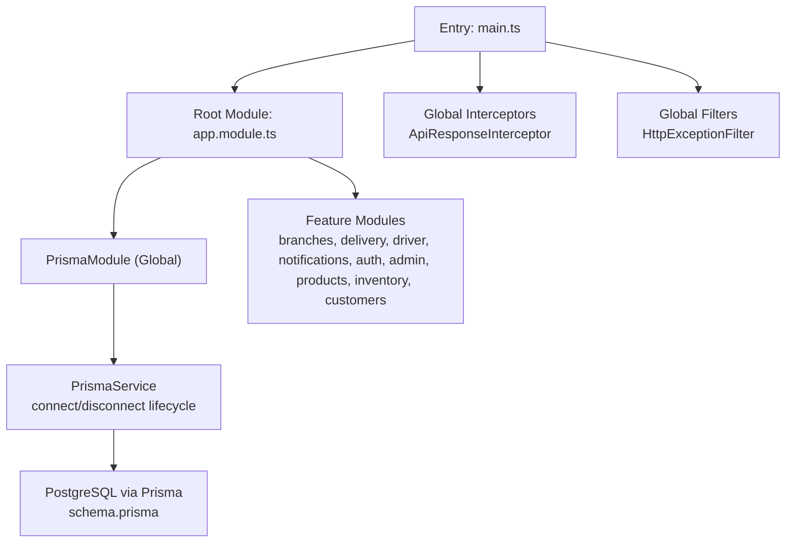
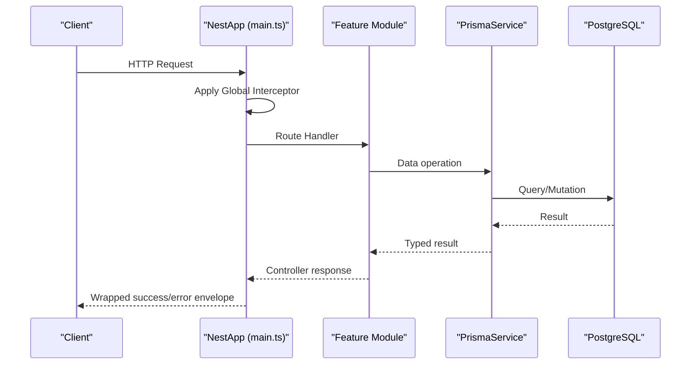
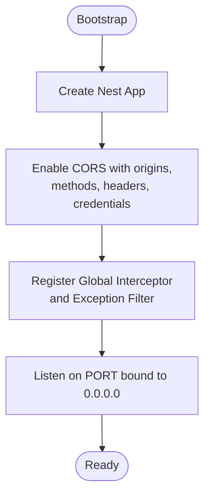
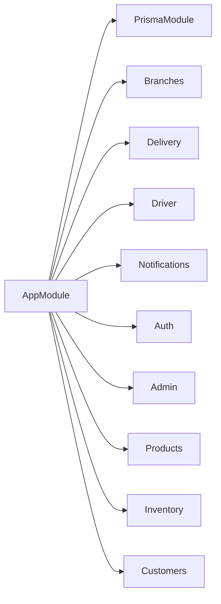
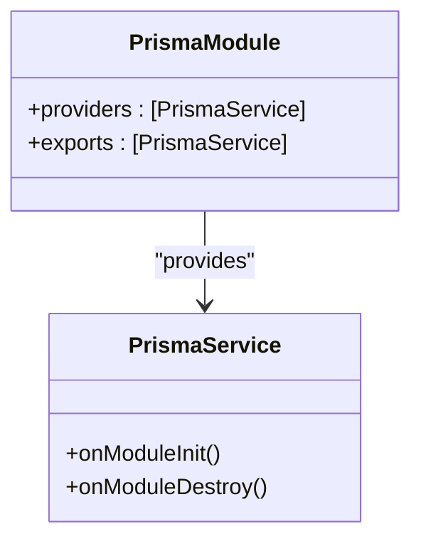
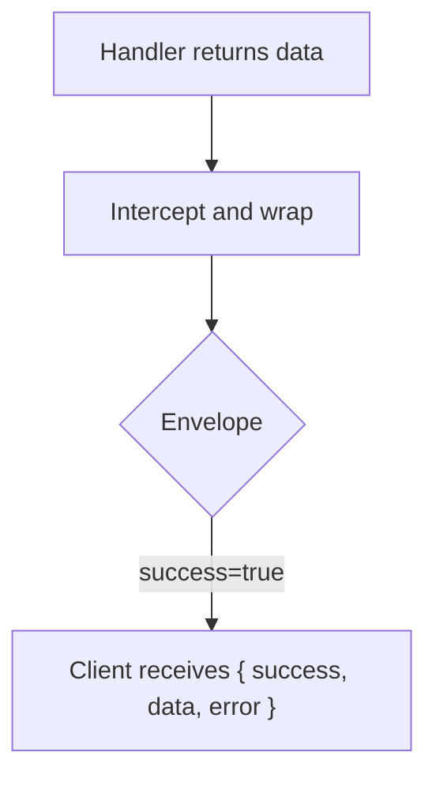
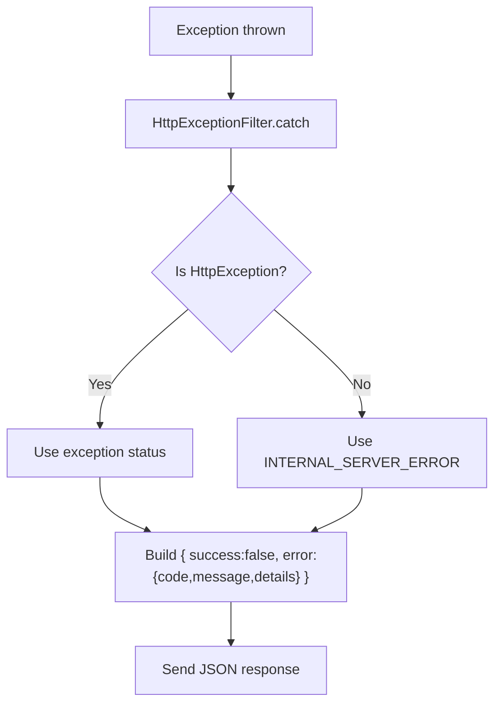
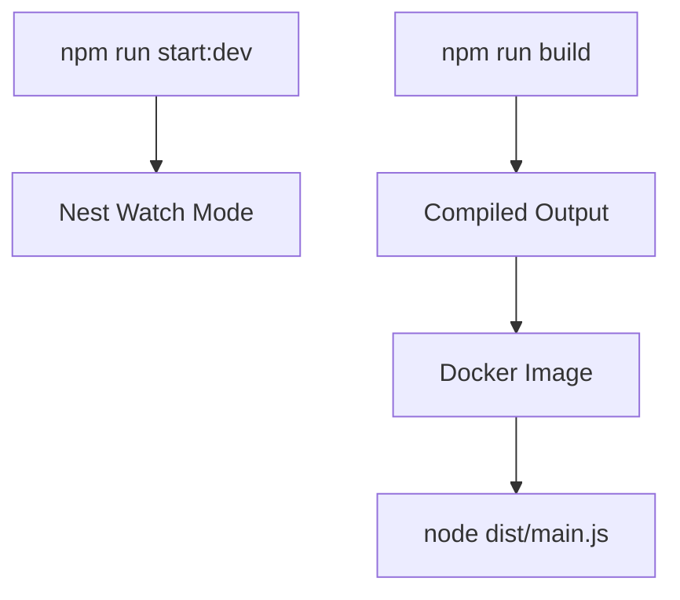
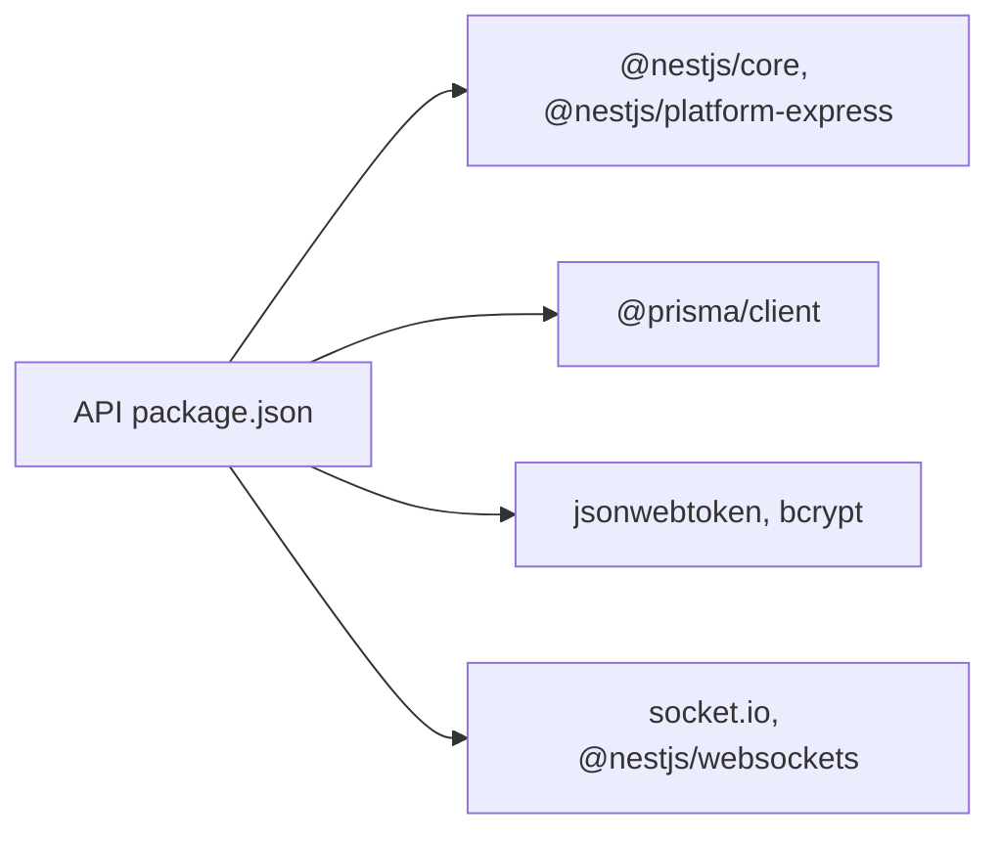

# API Server Setup & Configuration

<cite>
**Referenced Files in This Document**
- [main.ts](file://apps/api/src/main.ts)
- [app.module.ts](file://apps/api/src/app.module.ts)
- [package.json](file://apps/api/package.json)
- [schema.prisma](file://apps/api/prisma/schema.prisma)
- [prisma.module.ts](file://apps/api/src/prisma/prisma.module.ts)
- [prisma.service.ts](file://apps/api/src/prisma/prisma.service.ts)
- [api-response.interceptor.ts](file://apps/api/src/common/api-response.interceptor.ts)
- [http-exception.filter.ts](file://apps/api/src/common/http-exception.filter.ts)
- [Dockerfile](file://apps/api/Dockerfile)
</cite>

## Table of Contents
1. [Introduction](#introduction)
2. [Project Structure](#project-structure)
3. [Core Components](#core-components)
4. [Architecture Overview](#architecture-overview)
5. [Detailed Component Analysis](#detailed-component-analysis)
6. [Dependency Analysis](#dependency-analysis)
7. [Performance Considerations](#performance-considerations)
8. [Troubleshooting Guide](#troubleshooting-guide)
9. [Conclusion](#conclusion)
10. [Appendices](#appendices)

## Introduction
This document explains how the United Pharmacy API server is bootstrapped and configured as a NestJS application. It covers module initialization, global configuration (CORS, interceptors, filters), environment variables, Prisma ORM database connection, middleware registration, logging considerations, error handling strategies, performance monitoring notes, deployment across environments, and containerization with Docker.

## Project Structure
The API lives under apps/api and follows a modular NestJS architecture:
- Application bootstrap and global setup are defined in the entry point.
- The root AppModule aggregates feature modules and shared infrastructure modules.
- Database access is provided via a global PrismaModule that exports a PrismaService.
- Cross-cutting concerns include a global response interceptor and an HTTP exception filter.
- A multi-stage Dockerfile builds and runs the API in a lean runtime image.

**Diagram sources**
- [main.ts:7-35](file://apps/api/src/main.ts#L7-L35)
- [app.module.ts:14-28](file://apps/api/src/app.module.ts#L14-L28)
- [prisma.module.ts:4-8](file://apps/api/src/prisma/prisma.module.ts#L4-L8)
- [prisma.service.ts:4-12](file://apps/api/src/prisma/prisma.service.ts#L4-L12)
- [schema.prisma:6-11](file://apps/api/prisma/schema.prisma#L6-L11)

**Section sources**
- [main.ts:7-35](file://apps/api/src/main.ts#L7-L35)
- [app.module.ts:14-28](file://apps/api/src/app.module.ts#L14-L28)
- [package.json:9-13](file://apps/api/package.json#L9-L13)

## Core Components
- Bootstrap and global configuration: The application creates the Nest instance, enables CORS with explicit origins and headers, registers a global response interceptor and an HTTP exception filter, then listens on a configurable port bound to all interfaces.
- Root module: Imports the PrismaModule and all feature modules to wire up controllers, services, and providers.
- Prisma integration: A global PrismaModule provides a PrismaService that connects on module init and disconnects on destroy. The Prisma schema defines PostgreSQL datasource with multiple schemas and business models.
- Cross-cutting concerns:
  - ApiResponseInterceptor wraps successful responses into a consistent envelope.
  - HttpExceptionFilter normalizes errors into a structured JSON payload with status, code, message, and request details.

**Section sources**
- [main.ts:7-35](file://apps/api/src/main.ts#L7-L35)
- [app.module.ts:14-28](file://apps/api/src/app.module.ts#L14-L28)
- [prisma.module.ts:4-8](file://apps/api/src/prisma/prisma.module.ts#L4-L8)
- [prisma.service.ts:4-12](file://apps/api/src/prisma/prisma.service.ts#L4-L12)
- [schema.prisma:6-11](file://apps/api/prisma/schema.prisma#L6-L11)
- [api-response.interceptor.ts:10-21](file://apps/api/src/common/api-response.interceptor.ts#L10-L21)
- [http-exception.filter.ts:9-43](file://apps/api/src/common/http-exception.filter.ts#L9-L43)

## Architecture Overview
The API uses a layered approach:
- Entry point configures the HTTP server, CORS, and global pipes/interceptors/filters.
- AppModule composes domain modules (e.g., branches, delivery, driver, notifications, auth, admin, products, inventory, customers).
- All modules consume a globally available PrismaService for data access against PostgreSQL.
- Responses are consistently wrapped; exceptions are uniformly handled.

**Diagram sources**
- [main.ts:7-35](file://apps/api/src/main.ts#L7-L35)
- [api-response.interceptor.ts:10-21](file://apps/api/src/common/api-response.interceptor.ts#L10-L21)
- [http-exception.filter.ts:9-43](file://apps/api/src/common/http-exception.filter.ts#L9-L43)
- [prisma.service.ts:4-12](file://apps/api/src/prisma/prisma.service.ts#L4-L12)
- [schema.prisma:6-11](file://apps/api/prisma/schema.prisma#L6-L11)

## Detailed Component Analysis

### Bootstrap and Global Configuration
- Creates the Nest application from AppModule.
- Enables CORS with explicit allowed origins (including localhost patterns), methods, headers, credentials, and preflight caching.
- Registers global interceptor and filter.
- Starts listening on a port derived from environment or default, bound to all interfaces.

**Diagram sources**
- [main.ts:7-35](file://apps/api/src/main.ts#L7-L35)

**Section sources**
- [main.ts:7-35](file://apps/api/src/main.ts#L7-L35)

### Module Initialization
- The root module imports the PrismaModule and all feature modules, centralizing dependency wiring.
- Feature modules encapsulate their own controllers, services, and providers while sharing Prisma access.

**Diagram sources**
- [app.module.ts:14-28](file://apps/api/src/app.module.ts#L14-L28)

**Section sources**
- [app.module.ts:14-28](file://apps/api/src/app.module.ts#L14-L28)

### Environment Variables Management
- Port: Read from environment variable with a fallback default; the server binds to all interfaces.
- Database: Prisma reads DATABASE_URL and DIRECT_URL from environment to connect to PostgreSQL and enable direct queries when needed.
- Schemas: Prisma is configured to use both auth and public schemas.

Operational guidance:
- Ensure DATABASE_URL and DIRECT_URL are set before starting the process.
- Set PORT to expose the desired service port in your environment.

**Section sources**
- [main.ts:33-35](file://apps/api/src/main.ts#L33-L35)
- [schema.prisma:6-11](file://apps/api/prisma/schema.prisma#L6-L11)

### Database Connection Setup with Prisma ORM
- PrismaModule is marked global so any module can inject PrismaService without re-importing.
- PrismaService extends PrismaClient and connects on module init and disconnects on destroy, ensuring resource cleanup.
- Schema defines PostgreSQL provider and multiple schemas, including business entities and Supabase auth tables.

**Diagram sources**
- [prisma.module.ts:4-8](file://apps/api/src/prisma/prisma.module.ts#L4-L8)
- [prisma.service.ts:4-12](file://apps/api/src/prisma/prisma.service.ts#L4-L12)

**Section sources**
- [prisma.module.ts:4-8](file://apps/api/src/prisma/prisma.module.ts#L4-L8)
- [prisma.service.ts:4-12](file://apps/api/src/prisma/prisma.service.ts#L4-L12)
- [schema.prisma:6-11](file://apps/api/prisma/schema.prisma#L6-L11)

### Middleware Registration
- No custom Express middlewares are registered in the bootstrap file.
- Cross-cutting behavior is implemented via:
  - Global interceptor for response wrapping.
  - Global filter for standardized error responses.
  - CORS enabled through Nest’s built-in mechanism.

Note: If additional middleware is required in the future, it can be added in the bootstrap step using Nest’s application-level middleware registration.

**Section sources**
- [main.ts:7-35](file://apps/api/src/main.ts#L7-L35)
- [api-response.interceptor.ts:10-21](file://apps/api/src/common/api-response.interceptor.ts#L10-L21)
- [http-exception.filter.ts:9-43](file://apps/api/src/common/http-exception.filter.ts#L9-L43)

### CORS Configuration
- Explicitly configured with:
  - Allowed origins including production domains and local development patterns.
  - Methods covering standard REST verbs plus OPTIONS.
  - Headers including Content-Type, Authorization, Accept, and x-request-id.
  - Credentials enabled for cookie-based sessions or token storage.
  - Preflight cache maxAge set to reduce OPTIONS round-trips.

Best practices:
- Keep origin lists tight per environment.
- Use environment-specific configuration if you need different CORS policies per environment.

**Section sources**
- [main.ts:10-28](file://apps/api/src/main.ts#L10-L28)

### Request/Response Interceptors
- ApiResponseInterceptor wraps successful handler results into a uniform envelope containing success flag, data, and error fields.
- This ensures consistent client-side parsing and simplifies error handling on consumers.

**Diagram sources**
- [api-response.interceptor.ts:10-21](file://apps/api/src/common/api-response.interceptor.ts#L10-L21)

**Section sources**
- [api-response.interceptor.ts:10-21](file://apps/api/src/common/api-response.interceptor.ts#L10-L21)

### Exception Filters
- HttpExceptionFilter catches all exceptions and returns a structured error envelope with:
  - HTTP status derived from the exception or a default internal server error.
  - Error code string.
  - Human-readable message.
  - Details including request path and method.

**Diagram sources**
- [http-exception.filter.ts:9-43](file://apps/api/src/common/http-exception.filter.ts#L9-L43)

**Section sources**
- [http-exception.filter.ts:9-43](file://apps/api/src/common/http-exception.filter.ts#L9-L43)

### Global Pipes
- No global validation pipes are registered in the bootstrap file.
- Validation can be applied at controller or DTO level using class-validator decorators where needed.

**Section sources**
- [main.ts:7-35](file://apps/api/src/main.ts#L7-L35)

### Logging Setup
- The bootstrap logs the running URL to stdout.
- For richer logging, consider adding a logging library and configuring it in the bootstrap or a dedicated configuration module.

Recommendation:
- Add structured logging around request lifecycle and external calls for observability.

**Section sources**
- [main.ts:33-35](file://apps/api/src/main.ts#L33-L35)

### Performance Monitoring Configuration
- No explicit metrics or tracing libraries are configured in the bootstrap.
- Consider integrating a metrics exporter and request tracing for production visibility.

Recommendation:
- Integrate OpenTelemetry or a similar solution to capture latency, errors, and throughput.

**Section sources**
- [main.ts:7-35](file://apps/api/src/main.ts#L7-L35)

### Deployment Considerations
- Development:
  - Run with the dev script to start the watcher.
  - Ensure DATABASE_URL and DIRECT_URL are set.
  - Local CORS allows localhost origins by pattern.
- Staging/Production:
  - Build the application using the build script.
  - Provide environment variables for PORT, DATABASE_URL, DIRECT_URL, and any secrets.
  - Adjust CORS origins to restrict to production domains.
  - Use the containerized image for consistent deployments.

Containerization with Docker:
- Multi-stage build:
  - Builder stage installs dependencies and compiles the Nest app.
  - Runtime stage copies only dist and node_modules to run the compiled output.
- Exposes port 3000 and runs the compiled main.js.

**Diagram sources**
- [package.json:9-13](file://apps/api/package.json#L9-L13)
- [Dockerfile:1-47](file://apps/api/Dockerfile#L1-L47)

**Section sources**
- [package.json:9-13](file://apps/api/package.json#L9-L13)
- [Dockerfile:1-47](file://apps/api/Dockerfile#L1-L47)

## Dependency Analysis
- The API depends on NestJS core and platform-express for HTTP handling.
- Prisma client is used for database access with PostgreSQL.
- Authentication utilities and JWT libraries are present for securing endpoints.
- Socket.IO and websockets packages indicate real-time capabilities are supported.

**Diagram sources**
- [package.json:14-36](file://apps/api/package.json#L14-L36)

**Section sources**
- [package.json:14-36](file://apps/api/package.json#L14-L36)

## Performance Considerations
- Response envelope adds minimal overhead but improves consistency.
- CORS preflight caching reduces repeated OPTIONS requests.
- Prisma connection lifecycle ensures proper resource management.
- Consider enabling compression, connection pooling tuning, and query optimization based on workload.

[No sources needed since this section provides general guidance]

## Troubleshooting Guide
- Application fails to start:
  - Verify PORT is available and not blocked.
  - Check DATABASE_URL and DIRECT_URL connectivity and permissions.
- CORS issues:
  - Confirm browser origin matches one of the allowed origins.
  - Ensure credentials are sent when cookies or tokens are used.
- Unexpected errors:
  - Inspect the structured error envelope returned by the global filter for code, message, and request details.
- Database connectivity:
  - Validate Prisma schema and ensure migrations are applied.
  - Confirm both auth and public schemas exist and are accessible.

**Section sources**
- [main.ts:7-35](file://apps/api/src/main.ts#L7-L35)
- [http-exception.filter.ts:9-43](file://apps/api/src/common/http-exception.filter.ts#L9-L43)
- [schema.prisma:6-11](file://apps/api/prisma/schema.prisma#L6-L11)

## Conclusion
The United Pharmacy API is a well-structured NestJS application with clear separation of concerns:
- Centralized bootstrap configures CORS, interceptors, and filters.
- Modular architecture organizes features cleanly.
- Prisma provides robust database access with lifecycle-managed connections.
- Consistent response envelopes and error handling improve reliability and developer experience.
- Containerization supports repeatable builds and deployments across environments.

[No sources needed since this section summarizes without analyzing specific files]

## Appendices

### Environment Variables Reference
- PORT: Service port (default fallback applied).
- DATABASE_URL: Primary database connection string for Prisma.
- DIRECT_URL: Direct connection string for Prisma (used for certain operations).

**Section sources**
- [main.ts:33-35](file://apps/api/src/main.ts#L33-L35)
- [schema.prisma:6-11](file://apps/api/prisma/schema.prisma#L6-L11)

### Docker Build and Run
- Build image using the provided Dockerfile.
- Run container exposing port 3000.
- Supply environment variables at runtime for configuration.

**Section sources**
- [Dockerfile:1-47](file://apps/api/Dockerfile#L1-L47)