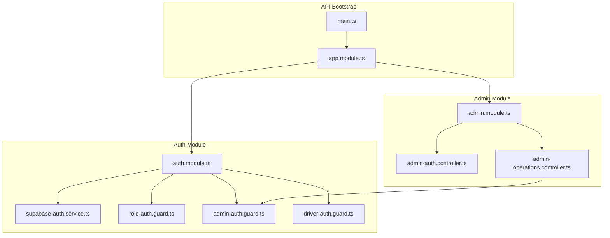
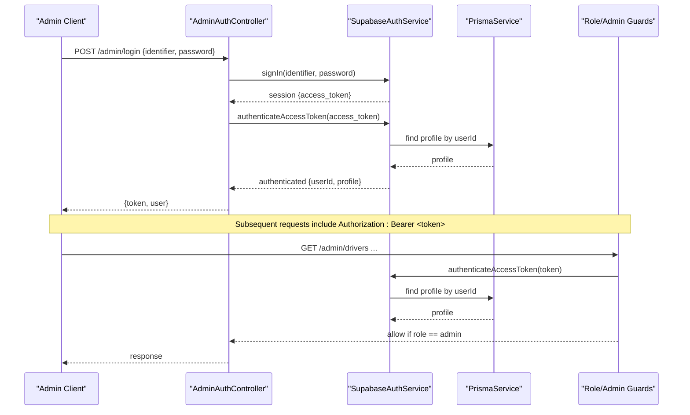
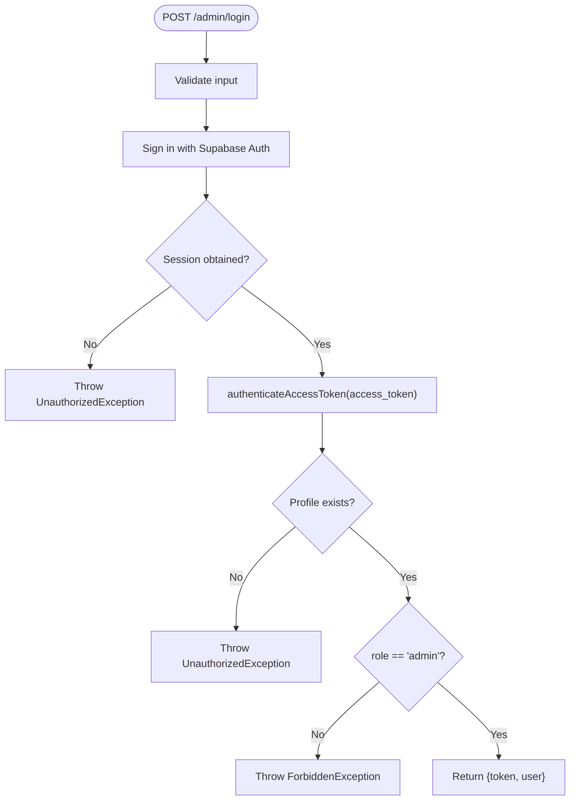
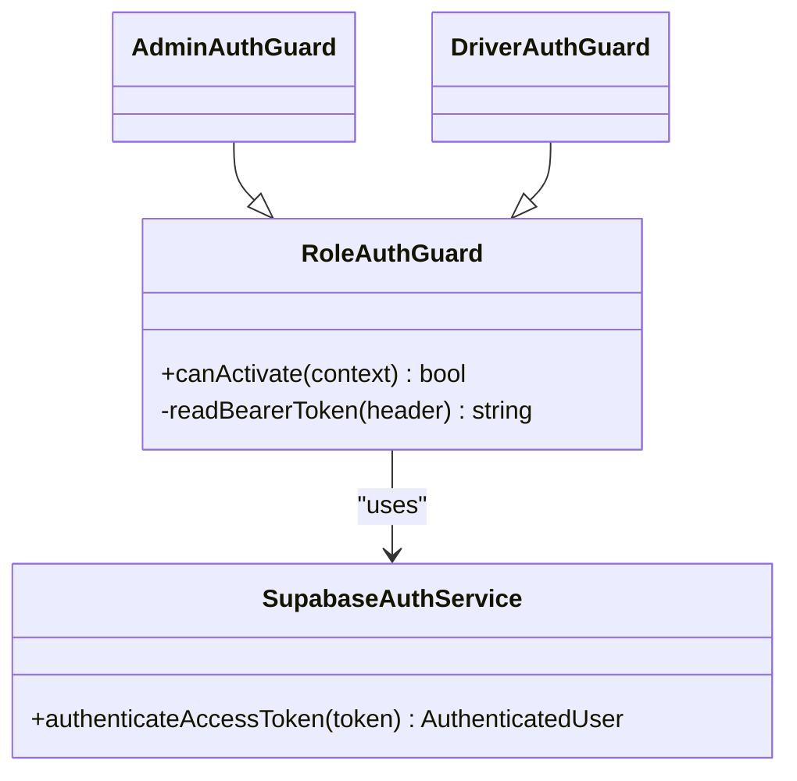
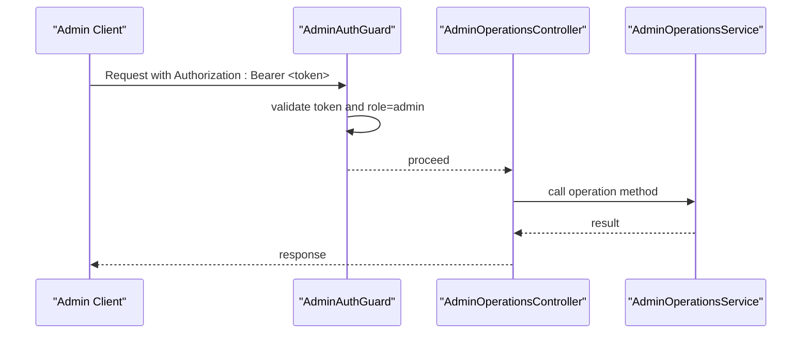
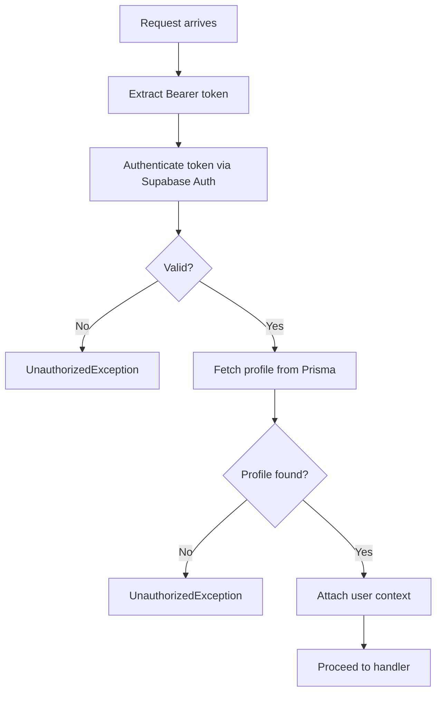
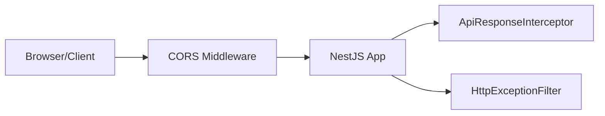
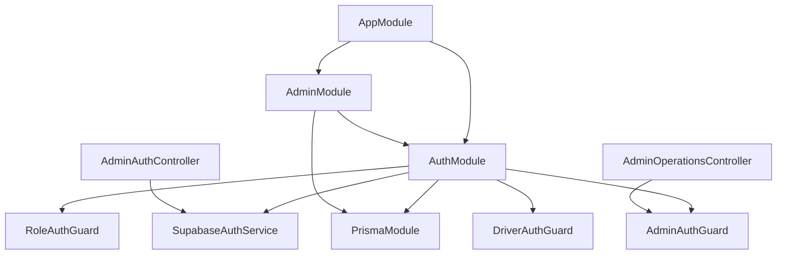

# Admin Authentication & Authorization

<cite>
**Referenced Files in This Document**
- [admin-auth.controller.ts](file://apps/api/src/modules/admin/admin-auth.controller.ts)
- [admin-operations.controller.ts](file://apps/api/src/modules/admin/admin-operations.controller.ts)
- [admin.module.ts](file://apps/api/src/modules/admin/admin.module.ts)
- [auth.module.ts](file://apps/api/src/auth/auth.module.ts)
- [supabase-auth.service.ts](file://apps/api/src/auth/supabase-auth.service.ts)
- [role-auth.guard.ts](file://apps/api/src/auth/role-auth.guard.ts)
- [admin-auth.guard.ts](file://apps/api/src/auth/admin-auth.guard.ts)
- [driver-auth.guard.ts](file://apps/api/src/auth/driver-auth.guard.ts)
- [app.module.ts](file://apps/api/src/app.module.ts)
- [main.ts](file://apps/api/src/main.ts)
</cite>

## Table of Contents
1. Introduction
2. Project Structure
3. Core Components
4. Architecture Overview
5. Detailed Component Analysis
6. Dependency Analysis
7. Performance Considerations
8. Troubleshooting Guide
9. Conclusion

## Introduction
This document explains the admin authentication and authorization system used by the API service. It covers how admins log in, how protected routes enforce role-based access control (RBAC), how JWT tokens are handled via Supabase Auth, and how security middleware validates requests. It also provides examples of protected routes, role verification, permission validation, common flows, error handling, and best practices for securing admin operations.

## Project Structure
The admin authentication and authorization features are implemented in the NestJS API under:
- Authentication module providing guards and a service that integrates with Supabase Auth and Prisma
- Admin module exposing login and protected administrative endpoints
- Application bootstrap configuring CORS, global interceptors, and filters

**Diagram sources**
- [main.ts:7-35](file://apps/api/src/main.ts#L7-L35)
- [app.module.ts:14-27](file://apps/api/src/app.module.ts#L14-L27)
- [auth.module.ts:8-12](file://apps/api/src/auth/auth.module.ts#L8-L12)
- [admin.module.ts:8-12](file://apps/api/src/modules/admin/admin.module.ts#L8-L12)
- [admin-auth.controller.ts:13-36](file://apps/api/src/modules/admin/admin-auth.controller.ts#L13-L36)
- [admin-operations.controller.ts:15-71](file://apps/api/src/modules/admin/admin-operations.controller.ts#L15-L71)

**Section sources**
- [main.ts:7-35](file://apps/api/src/main.ts#L7-L35)
- [app.module.ts:14-27](file://apps/api/src/app.module.ts#L14-L27)
- [auth.module.ts:8-12](file://apps/api/src/auth/auth.module.ts#L8-L12)
- [admin.module.ts:8-12](file://apps/api/src/modules/admin/admin.module.ts#L8-L12)

## Core Components
- SupabaseAuthService: Authenticates users against Supabase Auth, resolves email from phone if needed, and retrieves user profile data from Prisma.
- RoleAuthGuard: Base guard that reads Bearer token, authenticates via Supabase, and enforces a required role.
- AdminAuthGuard: Extends RoleAuthGuard to require the admin role.
- DriverAuthGuard: Extends RoleAuthGuard to require the driver role.
- AdminAuthController: Provides admin login endpoint that returns an access token and minimal user info after verifying admin role.
- AdminOperationsController: Exposes protected admin endpoints for managing drivers, orders, and stats; guarded globally by AdminAuthGuard.

Key responsibilities:
- Token issuance and validation through Supabase Auth
- Role enforcement at controller level using guards
- Profile resolution and enrichment from Prisma
- Consistent error responses via NestJS exceptions

**Section sources**
- [supabase-auth.service.ts:26-64](file://apps/api/src/auth/supabase-auth.service.ts#L26-L64)
- [role-auth.guard.ts:5-36](file://apps/api/src/auth/role-auth.guard.ts#L5-L36)
- [admin-auth.guard.ts:5-9](file://apps/api/src/auth/admin-auth.guard.ts#L5-L9)
- [driver-auth.guard.ts:5-9](file://apps/api/src/auth/driver-auth.guard.ts#L5-L9)
- [admin-auth.controller.ts:13-36](file://apps/api/src/modules/admin/admin-auth.controller.ts#L13-L36)
- [admin-operations.controller.ts:15-71](file://apps/api/src/modules/admin/admin-operations.controller.ts#L15-L71)

## Architecture Overview
The admin auth flow uses Supabase Auth for identity and JWT tokens. The API validates tokens on each request using guards and enriches the request context with user and profile information. Protected admin routes are secured by a role guard that ensures the caller has the admin role.

**Diagram sources**
- [admin-auth.controller.ts:17-36](file://apps/api/src/modules/admin/admin-auth.controller.ts#L17-L36)
- [supabase-auth.service.ts:26-64](file://apps/api/src/auth/supabase-auth.service.ts#L26-L64)
- [role-auth.guard.ts:11-27](file://apps/api/src/auth/role-auth.guard.ts#L11-L27)
- [admin-auth.guard.ts:5-9](file://apps/api/src/auth/admin-auth.guard.ts#L5-L9)

## Detailed Component Analysis

### Admin Login Flow
- Endpoint: POST /admin/login
- Input: identifier (email or phone), password
- Behavior:
  - Validates credentials via Supabase Auth
  - Retrieves access token and authenticates it to fetch profile
  - Enforces admin role before returning token and user info
- Output: access token and minimal user metadata

**Diagram sources**
- [admin-auth.controller.ts:17-36](file://apps/api/src/modules/admin/admin-auth.controller.ts#L17-L36)
- [supabase-auth.service.ts:26-64](file://apps/api/src/auth/supabase-auth.service.ts#L26-L64)

**Section sources**
- [admin-auth.controller.ts:17-36](file://apps/api/src/modules/admin/admin-auth.controller.ts#L17-L36)
- [supabase-auth.service.ts:26-64](file://apps/api/src/auth/supabase-auth.service.ts#L26-L64)

### Role-Based Access Control (RBAC)
- RoleAuthGuard:
  - Reads Bearer token from Authorization header
  - Authenticates token via Supabase Auth
  - Verifies profile role matches required role
  - Attaches user context to request
- AdminAuthGuard: Requires role = admin
- DriverAuthGuard: Requires role = driver

Protected routes example:
- All endpoints under /admin/* in AdminOperationsController are guarded by AdminAuthGuard, ensuring only admins can access them.

**Diagram sources**
- [role-auth.guard.ts:5-36](file://apps/api/src/auth/role-auth.guard.ts#L5-L36)
- [admin-auth.guard.ts:5-9](file://apps/api/src/auth/admin-auth.guard.ts#L5-L9)
- [driver-auth.guard.ts:5-9](file://apps/api/src/auth/driver-auth.guard.ts#L5-L9)
- [supabase-auth.service.ts:49-64](file://apps/api/src/auth/supabase-auth.service.ts#L49-L64)

**Section sources**
- [role-auth.guard.ts:11-36](file://apps/api/src/auth/role-auth.guard.ts#L11-L36)
- [admin-auth.guard.ts:5-9](file://apps/api/src/auth/admin-auth.guard.ts#L5-L9)
- [driver-auth.guard.ts:5-9](file://apps/api/src/auth/driver-auth.guard.ts#L5-L9)
- [admin-operations.controller.ts:15-71](file://apps/api/src/modules/admin/admin-operations.controller.ts#L15-L71)

### Protected Admin Endpoints
- Global guard: AdminAuthGuard applied to AdminOperationsController
- Available endpoints:
  - GET /admin/drivers (list with pagination and optional status filter)
  - GET /admin/drivers/:id (get driver details)
  - PATCH /admin/drivers/:id/approve (approve driver)
  - PATCH /admin/drivers/:id/reject (reject driver)
  - PATCH /admin/drivers/:id/suspend (suspend driver)
  - GET /admin/orders (list with pagination and optional status filter)
  - POST /admin/orders/:id/assign (assign order to driver)
  - PATCH /admin/orders/:id/status (update order status)
  - GET /admin/stats (dashboard statistics)

**Diagram sources**
- [admin-operations.controller.ts:15-71](file://apps/api/src/modules/admin/admin-operations.controller.ts#L15-L71)
- [admin-auth.guard.ts:5-9](file://apps/api/src/auth/admin-auth.guard.ts#L5-L9)

**Section sources**
- [admin-operations.controller.ts:15-71](file://apps/api/src/modules/admin/admin-operations.controller.ts#L15-L71)

### JWT Token Handling and Session Management
- Token source: Supabase Auth access token returned on successful sign-in
- Validation: Each protected request is validated by RoleAuthGuard using Supabase Auth’s getUser(token)
- Profile enrichment: After token validation, the user’s profile is fetched from Prisma and attached to the request context
- No server-side sessions: The API is stateless; tokens are passed per request via Authorization header

**Diagram sources**
- [role-auth.guard.ts:11-36](file://apps/api/src/auth/role-auth.guard.ts#L11-L36)
- [supabase-auth.service.ts:49-64](file://apps/api/src/auth/supabase-auth.service.ts#L49-L64)

**Section sources**
- [role-auth.guard.ts:11-36](file://apps/api/src/auth/role-auth.guard.ts#L11-L36)
- [supabase-auth.service.ts:49-64](file://apps/api/src/auth/supabase-auth.service.ts#L49-L64)

### Security Middleware and CORS
- CORS is explicitly configured in the application bootstrap to allow specific origins and methods, including Authorization headers
- Global exception filter and response interceptor standardize error and success responses across all endpoints

**Diagram sources**
- [main.ts:10-31](file://apps/api/src/main.ts#L10-L31)

**Section sources**
- [main.ts:10-31](file://apps/api/src/main.ts#L10-L31)

## Dependency Analysis
- AppModule imports AuthModule and AdminModule, wiring controllers and providers
- AuthModule exports SupabaseAuthService and guards
- AdminModule depends on AuthModule and PrismaModule for database access
- Guards depend on SupabaseAuthService for token validation and profile retrieval
- Controllers depend on guards for authorization and services for business logic

**Diagram sources**
- [app.module.ts:14-27](file://apps/api/src/app.module.ts#L14-L27)
- [auth.module.ts:8-12](file://apps/api/src/auth/auth.module.ts#L8-L12)
- [admin.module.ts:8-12](file://apps/api/src/modules/admin/admin.module.ts#L8-L12)

**Section sources**
- [app.module.ts:14-27](file://apps/api/src/app.module.ts#L14-L27)
- [auth.module.ts:8-12](file://apps/api/src/auth/auth.module.ts#L8-L12)
- [admin.module.ts:8-12](file://apps/api/src/modules/admin/admin.module.ts#L8-L12)

## Performance Considerations
- Stateless authentication: Relying on Supabase Auth tokens avoids server-side session storage overhead
- Minimal profile queries: Profile is fetched once per protected request; consider caching strategies if high traffic
- Pagination limits: Admin list endpoints cap page size to prevent excessive queries
- Database transactions: Administrative mutations use transactions to ensure consistency and reduce partial updates

[No sources needed since this section provides general guidance]

## Troubleshooting Guide
Common errors and their causes:
- Invalid authorization header format: Missing or malformed Authorization header; ensure it follows "Bearer <token>"
- Invalid or expired token: Token not recognized or expired; re-authenticate to obtain a new token
- Profile not found: User exists but no profile record; ensure profile creation during onboarding
- Insufficient permissions: Non-admin attempting to access admin routes; verify role assignment
- Admin credentials required: Non-admin logged in successfully but trying to access admin login response path; ensure role check passes

Where these are handled:
- Role guard validates token and role, throwing appropriate exceptions
- Admin login verifies admin role before returning token and user info
- Supabase Auth integration throws unauthorized exceptions for invalid credentials or tokens

**Section sources**
- [role-auth.guard.ts:11-36](file://apps/api/src/auth/role-auth.guard.ts#L11-L36)
- [admin-auth.controller.ts:17-36](file://apps/api/src/modules/admin/admin-auth.controller.ts#L17-L36)
- [supabase-auth.service.ts:26-64](file://apps/api/src/auth/supabase-auth.service.ts#L26-L64)

## Conclusion
The admin authentication and authorization system leverages Supabase Auth for secure, stateless JWT-based authentication and NestJS guards for role-based access control. Admin login issues a token after verifying credentials and admin role. Protected admin endpoints enforce strict role checks and rely on consistent error handling. Following the recommended practices—validating tokens, enforcing roles, limiting exposure of sensitive data, and using CORS and global filters—ensures a robust and secure admin experience.

[No sources needed since this section summarizes without analyzing specific files]