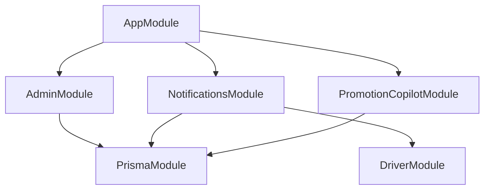
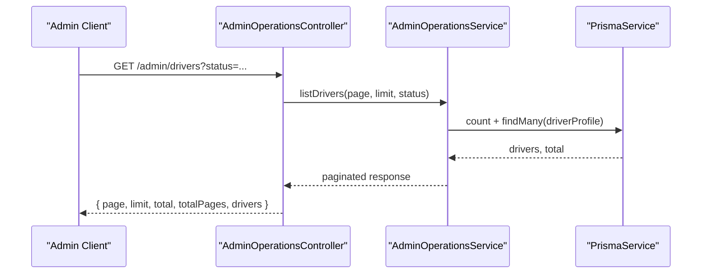
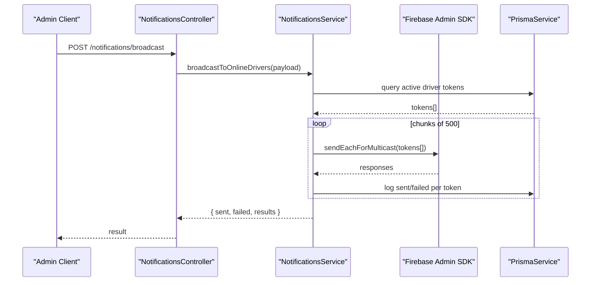
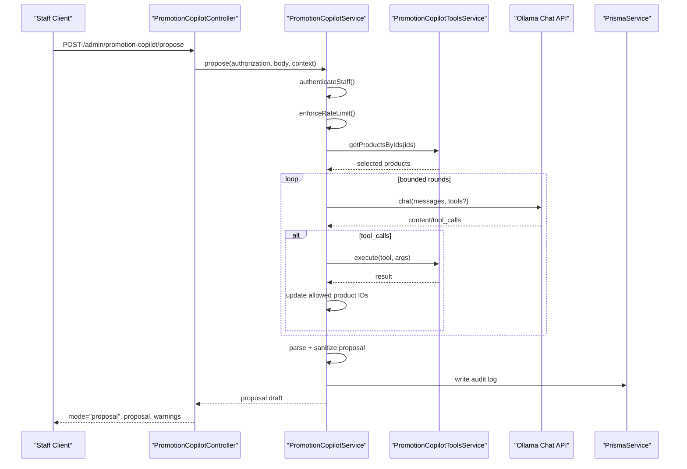
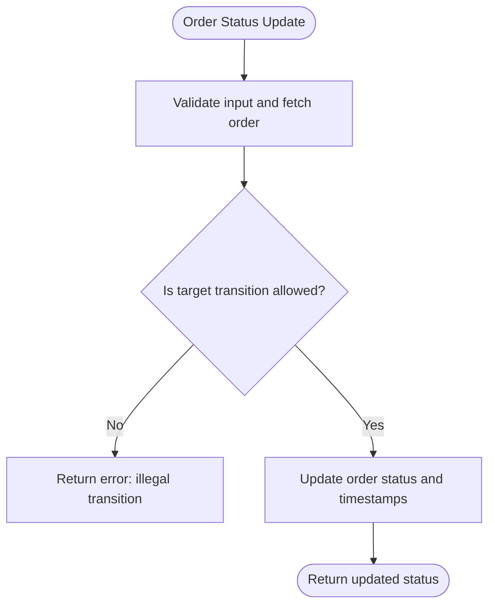
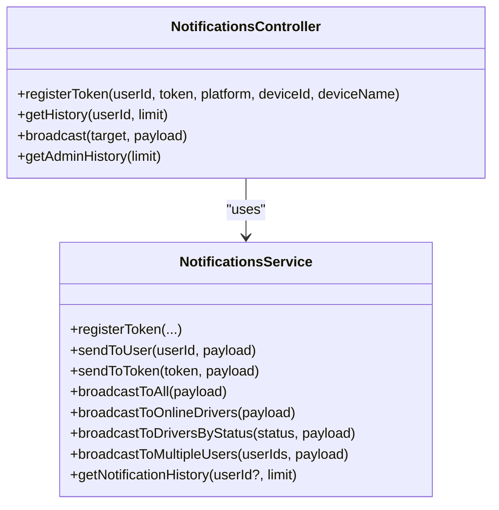
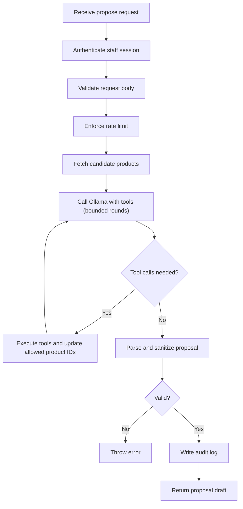
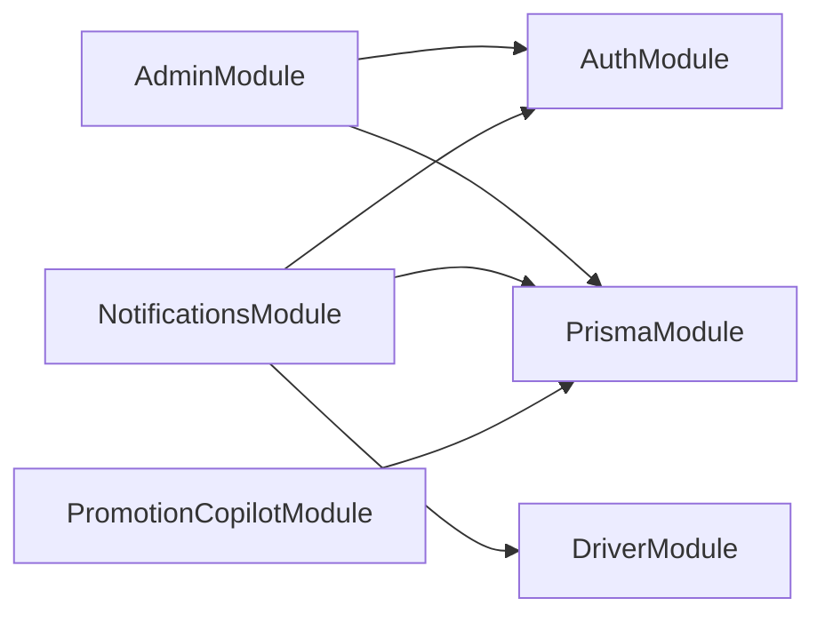

# Admin Operations & Management

<cite>
**Referenced Files in This Document**
- [app.module.ts](file://apps/api/src/app.module.ts)
- [admin.module.ts](file://apps/api/src/modules/admin/admin.module.ts)
- [admin-operations.controller.ts](file://apps/api/src/modules/admin/admin-operations.controller.ts)
- [admin-operations.service.ts](file://apps/api/src/modules/admin/admin-operations.service.ts)
- [notifications.module.ts](file://apps/api/src/modules/notifications/notifications.module.ts)
- [notifications.controller.ts](file://apps/api/src/modules/notifications/notifications.controller.ts)
- [notifications.service.ts](file://apps/api/src/modules/notifications/notifications.service.ts)
- [promotion-copilot.module.ts](file://apps/api/src/modules/promotion-copilot/promotion-copilot.module.ts)
- [promotion-copilot.controller.ts](file://apps/api/src/modules/promotion-copilot/promotion-copilot.controller.ts)
- [promotion-copilot.service.ts](file://apps/api/src/modules/promotion-copilot/promotion-copilot.service.ts)
</cite>

## Table of Contents
1. Introduction
2. Project Structure
3. Core Components
4. Architecture Overview
5. Detailed Component Analysis
6. Dependency Analysis
7. Performance Considerations
8. Troubleshooting Guide
9. Conclusion

## Introduction
This document explains the administrative operations and management features exposed by the API, focusing on:
- Admin module for user and operational controls (driver lifecycle, order assignment, status transitions, stats)
- Notifications module for multi-channel push messaging with token management, broadcast targeting, and delivery logging
- Promotion Copilot feature that generates AI-powered promotion drafts using tool calls to catalog and pricing data, with strict validation and audit logging
It also covers admin dashboard APIs, reporting endpoints, bulk operations, permission checks, activity tracking, and system health considerations.

## Project Structure
The backend is a NestJS application composed of feature modules registered at the root module. The relevant modules for this documentation are:
- AdminModule: exposes admin-only controllers for driver and order operations and statistics
- NotificationsModule: exposes token registration, history retrieval, and broadcast endpoints
- PromotionCopilotModule: exposes an endpoint to propose editable promotion drafts via an AI model with tool use

**Diagram sources**
- [app.module.ts:1-30](file://apps/api/src/app.module.ts#L1-L30)
- [admin.module.ts:1-13](file://apps/api/src/modules/admin/admin.module.ts#L1-L13)
- [notifications.module.ts:1-14](file://apps/api/src/modules/notifications/notifications.module.ts#L1-L14)
- [promotion-copilot.module.ts:1-11](file://apps/api/src/modules/promotion-copilot/promotion-copilot.module.ts#L1-L11)

**Section sources**
- [app.module.ts:1-30](file://apps/api/src/app.module.ts#L1-L30)

## Core Components
- AdminOperationsController: Protected by AdminAuthGuard; provides endpoints for listing drivers/orders, approving/rejecting/suspending drivers, assigning orders, updating order status, and retrieving stats.
- AdminOperationsService: Implements business logic including canonical order state transitions, safe pagination, transactional updates, and mapping results.
- NotificationsController: Provides driver token registration, notification history, admin broadcast, and admin-wide history.
- NotificationsService: Manages device tokens, sends single or multicast push notifications via Firebase Admin SDK, logs delivery outcomes, and supports targeted broadcasts.
- PromotionCopilotController: Exposes a read-only proposal endpoint that returns editable drafts for staff review.
- PromotionCopilotService: Authenticates staff via Supabase, enforces rate limits, orchestrates AI tool calls against an Ollama model, sanitizes proposals, and writes audit records.

**Section sources**
- [admin-operations.controller.ts:1-72](file://apps/api/src/modules/admin/admin-operations.controller.ts#L1-L72)
- [admin-operations.service.ts:1-391](file://apps/api/src/modules/admin/admin-operations.service.ts#L1-L391)
- [notifications.controller.ts:1-60](file://apps/api/src/modules/notifications/notifications.controller.ts#L1-L60)
- [notifications.service.ts:1-229](file://apps/api/src/modules/notifications/notifications.service.ts#L1-L229)
- [promotion-copilot.controller.ts:1-40](file://apps/api/src/modules/promotion-copilot/promotion-copilot.controller.ts#L1-L40)
- [promotion-copilot.service.ts:1-467](file://apps/api/src/modules/promotion-copilot/promotion-copilot.service.ts#L1-L467)

## Architecture Overview
High-level flow for key admin operations:

**Diagram sources**
- [admin-operations.controller.ts:1-72](file://apps/api/src/modules/admin/admin-operations.controller.ts#L1-L72)
- [admin-operations.service.ts:1-391](file://apps/api/src/modules/admin/admin-operations.service.ts#L1-L391)
- [notifications.controller.ts:1-60](file://apps/api/src/modules/notifications/notifications.controller.ts#L1-L60)
- [notifications.service.ts:1-229](file://apps/api/src/modules/notifications/notifications.service.ts#L1-L229)
- [promotion-copilot.controller.ts:1-40](file://apps/api/src/modules/promotion-copilot/promotion-copilot.controller.ts#L1-L40)
- [promotion-copilot.service.ts:1-467](file://apps/api/src/modules/promotion-copilot/promotion-copilot.service.ts#L1-L467)

## Detailed Component Analysis

### Admin Module: User and Operational Controls
Responsibilities:
- Driver lifecycle: approve, reject, suspend with reasons and timestamps
- Order operations: assign to eligible drivers, update status following canonical transitions
- Reporting: list drivers and orders with pagination and filters; aggregate stats for active deliveries, daily deliveries, and revenue

Key behaviors:
- Pagination safety: clamps page and limit to safe ranges
- Transactional updates: driver approval/rejection/suspension updates both driver profile and user profile atomically
- Canonical order transitions: only allows predefined next states; normalizes legacy aliases
- Assignment guardrails: ensures driver eligibility and order state before assignment

API surface (protected by AdminAuthGuard):
- GET /admin/drivers?page&limit&status
- GET /admin/drivers/:id
- PATCH /admin/drivers/:id/approve
- PATCH /admin/drivers/:id/reject
- PATCH /admin/drivers/:id/suspend
- GET /admin/orders?page&limit&status
- POST /admin/orders/:id/assign
- PATCH /admin/orders/:id/status
- GET /admin/stats

**Diagram sources**
- [admin-operations.service.ts:266-294](file://apps/api/src/modules/admin/admin-operations.service.ts#L266-L294)

**Section sources**
- [admin-operations.controller.ts:1-72](file://apps/api/src/modules/admin/admin-operations.controller.ts#L1-L72)
- [admin-operations.service.ts:1-391](file://apps/api/src/modules/admin/admin-operations.service.ts#L1-L391)

### Notifications Module: Multi-Channel Messaging and Broadcasts
Capabilities:
- Token management: register device tokens per platform/device, deactivate stale tokens, upsert new tokens
- Single and bulk delivery: send to specific users or broadcast to all, online drivers, or by driver status
- Delivery logging: record success/failure per token with payload and platform metadata
- Admin history: retrieve recent notification logs across all users

API surface:
- POST /notifications/token (DriverAuthGuard)
- GET /notifications/history?limit (DriverAuthGuard)
- POST /notifications/broadcast (AdminAuthGuard)
- GET /notifications/admin/history?limit (AdminAuthGuard)

**Diagram sources**
- [notifications.controller.ts:1-60](file://apps/api/src/modules/notifications/notifications.controller.ts#L1-L60)
- [notifications.service.ts:1-229](file://apps/api/src/modules/notifications/notifications.service.ts#L1-L229)

**Section sources**
- [notifications.controller.ts:1-60](file://apps/api/src/modules/notifications/notifications.controller.ts#L1-L60)
- [notifications.service.ts:1-229](file://apps/api/src/modules/notifications/notifications.service.ts#L1-L229)

### Promotion Copilot: AI-Powered Marketing Drafts
Purpose:
- Generate editable promotion drafts based on staff prompts and candidate products
- Use tool calls to safely access catalog, pricing, conflict detection, preview, and validation facts
- Enforce strict rules: drafts only, no database writes from the model, percentage discount bounds, valid date windows, and product ID allowlisting

Core flow:
- Authenticate staff session via Supabase and validate role/status
- Rate-limit requests per user within a time window
- Fetch candidate products and call Ollama with optional tools
- Parse and sanitize model output, enforcing schema and business rules
- Write audit entries for successful or failed attempts

API surface:
- POST /admin/promotion-copilot/propose (requires Authorization header)

**Diagram sources**
- [promotion-copilot.controller.ts:1-40](file://apps/api/src/modules/promotion-copilot/promotion-copilot.controller.ts#L1-L40)
- [promotion-copilot.service.ts:1-467](file://apps/api/src/modules/promotion-copilot/promotion-copilot.service.ts#L1-L467)

**Section sources**
- [promotion-copilot.controller.ts:1-40](file://apps/api/src/modules/promotion-copilot/promotion-copilot.controller.ts#L1-L40)
- [promotion-copilot.service.ts:1-467](file://apps/api/src/modules/promotion-copilot/promotion-copilot.service.ts#L1-L467)

## Dependency Analysis
Module relationships and external dependencies:
- AdminModule depends on AuthModule and PrismaModule
- NotificationsModule depends on AuthModule, DriverModule, and PrismaModule; integrates with Firebase Admin SDK for push delivery
- PromotionCopilotModule depends on PrismaModule and uses an external Ollama service; authenticates via Supabase

**Diagram sources**
- [admin.module.ts:1-13](file://apps/api/src/modules/admin/admin.module.ts#L1-L13)
- [notifications.module.ts:1-14](file://apps/api/src/modules/notifications/notifications.module.ts#L1-L14)
- [promotion-copilot.module.ts:1-11](file://apps/api/src/modules/promotion-copilot/promotion-copilot.module.ts#L1-L11)

**Section sources**
- [admin.module.ts:1-13](file://apps/api/src/modules/admin/admin.module.ts#L1-L13)
- [notifications.module.ts:1-14](file://apps/api/src/modules/notifications/notifications.module.ts#L1-L14)
- [promotion-copilot.module.ts:1-11](file://apps/api/src/modules/promotion-copilot/promotion-copilot.module.ts#L1-L11)

## Performance Considerations
- Pagination and limits: Admin endpoints clamp page and limit to prevent excessive queries
- Bulk push delivery: Notifications service chunks multicast messages to avoid large payloads and throttling
- Rate limiting: Promotion Copilot enforces per-user request windows to protect downstream services
- Timeouts and cancellation: Promotion Copilot honors client abort signals and applies timeouts for auth and model calls
- Database transactions: Driver lifecycle and order assignment use transactions to ensure consistency

[No sources needed since this section provides general guidance]

## Troubleshooting Guide
Common issues and diagnostics:
- Push notifications not delivered:
  - Verify Firebase credentials are configured; if missing, push is disabled
  - Check notification logs for failed entries and invalid tokens; invalid tokens are deactivated automatically
- Broadcast targets yield zero results:
  - Ensure target drivers exist and have active tokens; verify driver online status or status filter
- Promotion Copilot failures:
  - Authentication errors indicate expired or invalid staff sessions
  - Service unavailable or gateway timeout indicates Ollama or Supabase connectivity issues
  - Invalid model output triggers revalidation; adjust prompt or retry
- Order status updates rejected:
  - Ensure requested status is a valid transition from current order state

**Section sources**
- [notifications.service.ts:32-48](file://apps/api/src/modules/notifications/notifications.service.ts#L32-L48)
- [notifications.service.ts:112-132](file://apps/api/src/modules/notifications/notifications.service.ts#L112-L132)
- [notifications.service.ts:166-211](file://apps/api/src/modules/notifications/notifications.service.ts#L166-L211)
- [promotion-copilot.service.ts:145-185](file://apps/api/src/modules/promotion-copilot/promotion-copilot.service.ts#L145-L185)
- [promotion-copilot.service.ts:280-327](file://apps/api/src/modules/promotion-copilot/promotion-copilot.service.ts#L280-L327)
- [admin-operations.service.ts:266-294](file://apps/api/src/modules/admin/admin-operations.service.ts#L266-L294)

## Conclusion
The admin operations, notifications, and promotion copilot modules provide a cohesive set of management capabilities:
- Admin controls for driver lifecycle and order management with robust state enforcement and reporting
- Scalable push notification delivery with token hygiene, targeted broadcasts, and comprehensive logging
- AI-assisted promotion drafting with strict validation, tool-based data access, and full auditability
These components integrate through shared infrastructure (Prisma, authentication) and external services (Firebase, Supabase, Ollama), enabling secure, observable, and maintainable administrative workflows.

[No sources needed since this section summarizes without analyzing specific files]