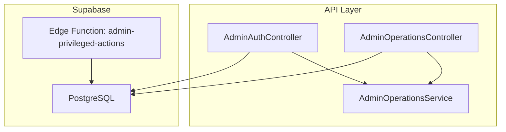
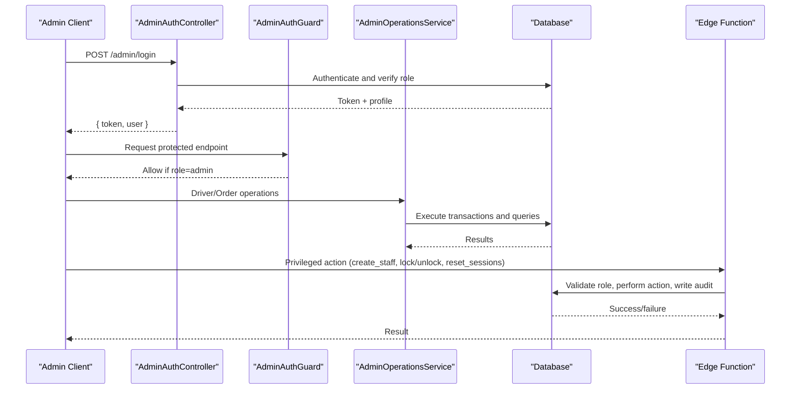
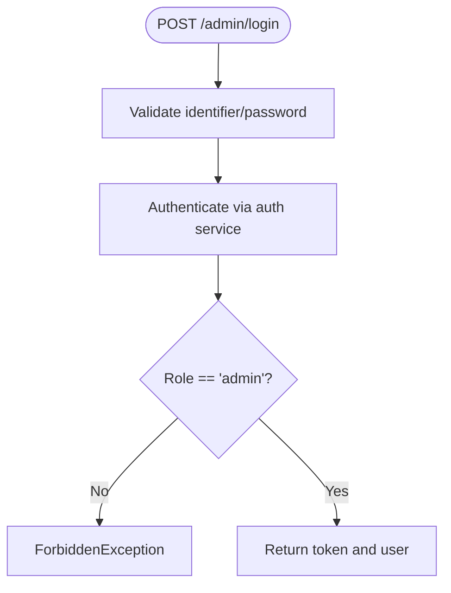
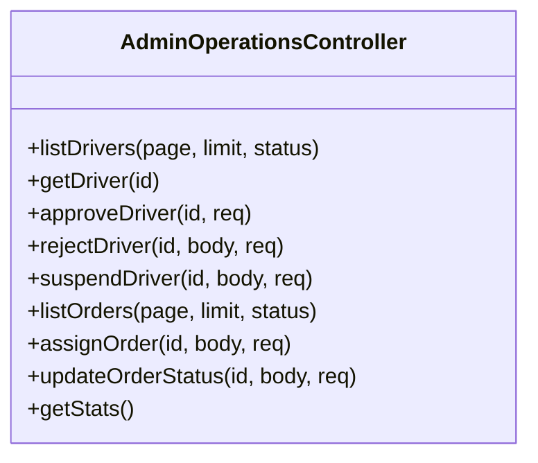
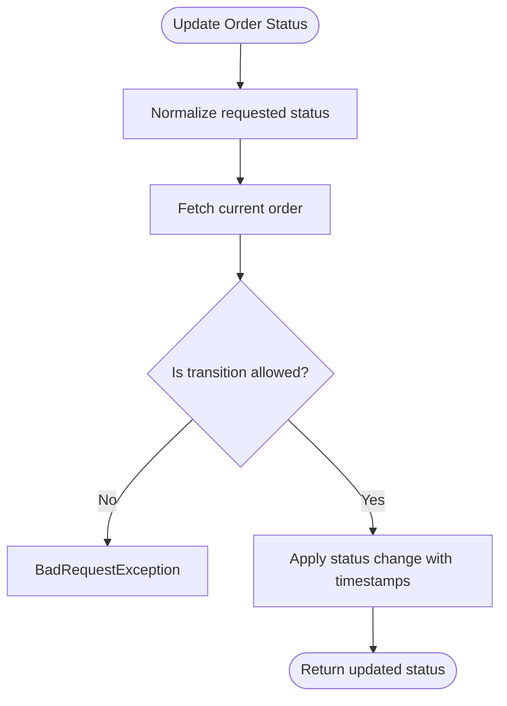
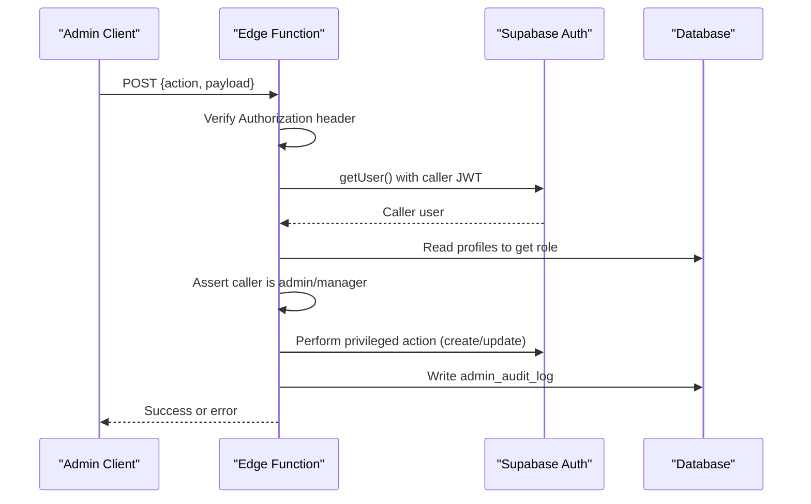
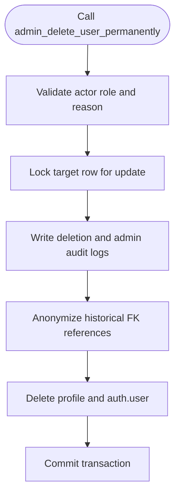
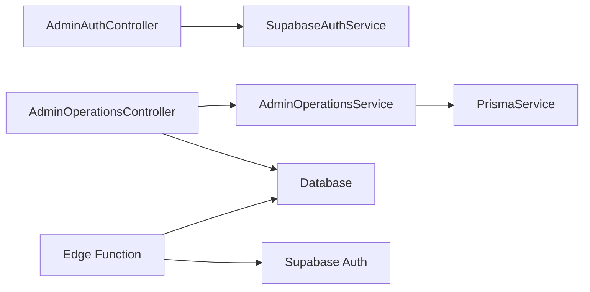

# Core Admin Operations

<cite>
**Referenced Files in This Document**
- [admin-operations.controller.ts](file://apps/api/src/modules/admin/admin-operations.controller.ts)
- [admin-operations.service.ts](file://apps/api/src/modules/admin/admin-operations.service.ts)
- [admin-auth.controller.ts](file://apps/api/src/modules/admin/admin-auth.controller.ts)
- [admin.module.ts](file://apps/api/src/modules/admin/admin.module.ts)
- [admin-auth.guard.ts](file://apps/api/src/auth/admin-auth.guard.ts)
- [index.ts](file://supabase/functions/admin-privileged-actions/index.ts)
- [20260713130000_admin_profile_access_controls.sql](file://supabase/migrations/20260713130000_admin_profile_access_controls.sql)
- [20260715120000_admin_permanent_user_deletion.sql](file://supabase/migrations/20260715120000_admin_permanent_user_deletion.sql)
- [supabase_indexes.sql](file://database/supabase_indexes.sql)
</cite>

## Table of Contents
1. Introduction
2. Project Structure
3. Core Components
4. Architecture Overview
5. Detailed Component Analysis
6. Dependency Analysis
7. Performance Considerations
8. Troubleshooting Guide
9. Conclusion

## Introduction
This document explains the core administrative operations for user management, system monitoring, and operational controls. It covers the admin controller endpoints, the service layer business logic, privileged Supabase Edge Functions for account lifecycle actions, database-level access controls and audit logging, and performance considerations for large-scale operations. It also provides examples for common tasks such as suspending a driver, updating order status, assigning orders, and performing permanent user deletion with full audit trails.

## Project Structure
The admin subsystem is implemented as a NestJS module exposing authenticated endpoints for drivers, orders, and statistics, plus an authentication endpoint to obtain admin tokens. Privileged account actions (staff creation, account lock/unlock, session reset) are executed via a Supabase Edge Function that enforces role checks and writes audit records. Database migrations provide secure functions for profile access changes and permanent user deletion with anonymization and auditing.

**Diagram sources**
- [admin-auth.controller.ts:13-37](file://apps/api/src/modules/admin/admin-auth.controller.ts#L13-L37)
- [admin-operations.controller.ts:15-72](file://apps/api/src/modules/admin/admin-operations.controller.ts#L15-L72)
- [admin-operations.service.ts:47-391](file://apps/api/src/modules/admin/admin-operations.service.ts#L47-L391)
- [index.ts:92-295](file://supabase/functions/admin-privileged-actions/index.ts#L92-L295)

**Section sources**
- [admin.module.ts:1-13](file://apps/api/src/modules/admin/admin.module.ts#L1-L13)
- [admin-auth.controller.ts:13-37](file://apps/api/src/modules/admin/admin-auth.controller.ts#L13-L37)
- [admin-operations.controller.ts:15-72](file://apps/api/src/modules/admin/admin-operations.controller.ts#L15-L72)
- [admin-operations.service.ts:47-391](file://apps/api/src/modules/admin/admin-operations.service.ts#L47-L391)
- [index.ts:92-295](file://supabase/functions/admin-privileged-actions/index.ts#L92-L295)

## Core Components
- Admin authentication controller: issues admin tokens after verifying credentials and role.
- Admin operations controller: exposes paginated lists and mutations for drivers and orders, plus stats.
- Admin operations service: implements business rules for driver approval/rejection/suspension, order assignment/status transitions, listing, and stats aggregation.
- Admin guard: restricts endpoints to users with the admin role.
- Privileged Edge Function: performs staff creation, account locking/unlocking, and session resets with strict authorization and audit logging.
- Database-level controls: secure functions for profile access changes and permanent user deletion with anonymization and audit entries.

**Section sources**
- [admin-auth.controller.ts:13-37](file://apps/api/src/modules/admin/admin-auth.controller.ts#L13-L37)
- [admin-auth.guard.ts:1-10](file://apps/api/src/auth/admin-auth.guard.ts#L1-L10)
- [admin-operations.controller.ts:15-72](file://apps/api/src/modules/admin/admin-operations.controller.ts#L15-L72)
- [admin-operations.service.ts:47-391](file://apps/api/src/modules/admin/admin-operations.service.ts#L47-L391)
- [index.ts:92-295](file://supabase/functions/admin-privileged-actions/index.ts#L92-L295)
- [20260713130000_admin_profile_access_controls.sql:1-26](file://supabase/migrations/20260713130000_admin_profile_access_controls.sql#L1-L26)
- [20260715120000_admin_permanent_user_deletion.sql:93-287](file://supabase/migrations/20260715120000_admin_permanent_user_deletion.sql#L93-L287)

## Architecture Overview
The admin API uses role-based guards to protect endpoints. Business logic resides in the service layer, which interacts with Prisma and the database. For sensitive account lifecycle actions, clients call a Supabase Edge Function that validates caller identity and role server-side, then executes privileged operations and writes audit logs. Database functions enforce additional constraints and ensure data integrity during profile updates and permanent deletions.

**Diagram sources**
- [admin-auth.controller.ts:17-37](file://apps/api/src/modules/admin/admin-auth.controller.ts#L17-L37)
- [admin-auth.guard.ts:5-10](file://apps/api/src/auth/admin-auth.guard.ts#L5-L10)
- [admin-operations.controller.ts:15-72](file://apps/api/src/modules/admin/admin-operations.controller.ts#L15-L72)
- [admin-operations.service.ts:47-391](file://apps/api/src/modules/admin/admin-operations.service.ts#L47-L391)
- [index.ts:92-295](file://supabase/functions/admin-privileged-actions/index.ts#L92-L295)

## Detailed Component Analysis

### Admin Authentication Controller
- Purpose: Issue admin tokens after validating credentials and ensuring the user has the admin role.
- Behavior: Validates input, authenticates via the auth service, verifies role, and returns token plus minimal user info.

**Diagram sources**
- [admin-auth.controller.ts:17-37](file://apps/api/src/modules/admin/admin-auth.controller.ts#L17-L37)

**Section sources**
- [admin-auth.controller.ts:1-37](file://apps/api/src/modules/admin/admin-auth.controller.ts#L1-L37)

### Admin Operations Controller
- Endpoints:
  - GET /admin/drivers: Paginated list with optional status filter.
  - GET /admin/drivers/:id: Single driver detail.
  - PATCH /admin/drivers/:id/approve: Approve a driver application.
  - PATCH /admin/drivers/:id/reject: Reject with reason.
  - PATCH /admin/drivers/:id/suspend: Suspend a driver.
  - GET /admin/orders: Paginated list with optional status filter.
  - POST /admin/orders/:id/assign: Assign a driver to an order.
  - PATCH /admin/orders/:id/status: Update order status with canonical transition validation.
  - GET /admin/stats: Operational metrics (active deliveries, today’s deliveries, revenue).
- Security: All endpoints protected by AdminAuthGuard.

**Diagram sources**
- [admin-operations.controller.ts:15-72](file://apps/api/src/modules/admin/admin-operations.controller.ts#L15-L72)

**Section sources**
- [admin-operations.controller.ts:15-72](file://apps/api/src/modules/admin/admin-operations.controller.ts#L15-L72)

### Admin Operations Service
- Responsibilities:
  - Driver management: approve, reject, suspend; list and fetch details.
  - Order management: assign eligible drivers, update status with canonical transitions, list with pagination.
  - Stats: aggregate active deliveries, daily delivered count, and daily revenue.
- Key patterns:
  - Transactions for multi-table updates (driver profile and user profile).
  - Canonical order lifecycle enforcement with legacy alias normalization.
  - Safe pagination parameters with bounds checking.

**Diagram sources**
- [admin-operations.service.ts:266-294](file://apps/api/src/modules/admin/admin-operations.service.ts#L266-L294)

**Section sources**
- [admin-operations.service.ts:47-391](file://apps/api/src/modules/admin/admin-operations.service.ts#L47-L391)

### Privileged Account Actions (Supabase Edge Function)
- Capabilities:
  - create_staff: Create a new staff user with validated fields, set initial role/status, and write audit log.
  - set_account_lock: Lock or unlock accounts using ban_duration; managers cannot manage admins.
  - reset_sessions: Temporarily invalidate sessions by setting a short ban duration.
- Security model:
  - Re-verifies caller identity and role inside the function.
  - Uses service-role client only for privileged actions; normal client for reads under RLS.
  - Writes to admin_audit_log for all actions.

**Diagram sources**
- [index.ts:92-295](file://supabase/functions/admin-privileged-actions/index.ts#L92-L295)

**Section sources**
- [index.ts:1-296](file://supabase/functions/admin-privileged-actions/index.ts#L1-L296)

### Database-Level Access Controls and Auditing
- Profile access control function:
  - Atomic updates to role and status with validations and restrictions (e.g., managers cannot modify admins).
  - Writes detailed audit entries to admin_audit_log.
- Permanent user deletion function:
  - Enforces admin-only execution and required reason.
  - Anonymizes retained historical references by setting foreign keys to NULL.
  - Records deletion in user_deletion_log and admin_audit_log within a single transaction.

**Diagram sources**
- [20260715120000_admin_permanent_user_deletion.sql:93-287](file://supabase/migrations/20260715120000_admin_permanent_user_deletion.sql#L93-L287)

**Section sources**
- [20260713130000_admin_profile_access_controls.sql:1-26](file://supabase/migrations/20260713130000_admin_profile_access_controls.sql#L1-L26)
- [20260715120000_admin_permanent_user_deletion.sql:93-287](file://supabase/migrations/20260715120000_admin_permanent_user_deletion.sql#L93-L287)

## Dependency Analysis
- Controllers depend on guards for authorization and services for business logic.
- Services depend on Prisma for data access and implement domain rules (lifecycle transitions, eligibility checks).
- Edge Function depends on Supabase Auth and Postgres for privileged actions and auditing.
- Migrations introduce secure functions that encapsulate complex, audited administrative workflows at the database level.

**Diagram sources**
- [admin-auth.controller.ts:13-37](file://apps/api/src/modules/admin/admin-auth.controller.ts#L13-L37)
- [admin-operations.controller.ts:15-72](file://apps/api/src/modules/admin/admin-operations.controller.ts#L15-L72)
- [admin-operations.service.ts:47-391](file://apps/api/src/modules/admin/admin-operations.service.ts#L47-L391)
- [index.ts:92-295](file://supabase/functions/admin-privileged-actions/index.ts#L92-L295)

**Section sources**
- [admin.module.ts:1-13](file://apps/api/src/modules/admin/admin.module.ts#L1-L13)
- [admin-auth.guard.ts:1-10](file://apps/api/src/auth/admin-auth.guard.ts#L1-L10)

## Performance Considerations
- Pagination and limits:
  - List endpoints normalize page and limit to safe ranges to prevent excessive loads.
- Transactional updates:
  - Multi-table changes use transactions to ensure consistency and reduce contention.
- Database indexes:
  - Indexes exist for orders, products, categories, and order items to optimize filtering, sorting, and analytics.
  - Statistics are analyzed to improve query plans.
- Bulk operations:
  - Use batched requests where possible and avoid large unpaginated scans.
  - For bulk imports or heavy maintenance, run index/stat updates and consider off-peak scheduling.

[No sources needed since this section provides general guidance]

## Troubleshooting Guide
- Common errors:
  - Forbidden when calling privileged actions without admin/manager role.
  - BadRequest for invalid transitions or missing required fields.
  - Conflict when assigning already-assigned orders or ineligible drivers.
  - Not Found for missing drivers or orders.
- Diagnostics:
  - Inspect admin_audit_log for action history and details.
  - Use database views for slow queries and index usage to identify bottlenecks.
  - Validate order lifecycle transitions against canonical states.

**Section sources**
- [admin-operations.service.ts:183-294](file://apps/api/src/modules/admin/admin-operations.service.ts#L183-L294)
- [index.ts:149-295](file://supabase/functions/admin-privileged-actions/index.ts#L149-L295)
- [supabase_indexes.sql:149-173](file://database/supabase_indexes.sql#L149-L173)

## Conclusion
The admin subsystem combines NestJS controllers and services with Supabase Edge Functions and database-level safeguards to deliver secure, auditable administrative operations. Drivers and orders can be managed through well-defined workflows with canonical state transitions and robust error handling. Privileged account actions are isolated in serverless functions with strict authorization and comprehensive audit logging. Database indexes and transactions support performance and reliability at scale.