# Driver Management

<cite>
**Referenced Files in This Document**
- [admin-driver.controller.ts](file://apps/api/src/modules/driver/admin-driver.controller.ts)
- [driver.controller.ts](file://apps/api/src/modules/driver/driver.controller.ts)
- [driver-profile.service.ts](file://apps/api/src/modules/driver/driver-profile.service.ts)
- [schema.prisma](file://apps/api/prisma/schema.prisma)
- [api.ts](file://apps/admin/src/lib/api.ts)
- [DriversPage.tsx](file://apps/admin/src/pages/DriversPage.tsx)
</cite>

## Table of Contents
1. Introduction
2. Project Structure
3. Core Components
4. Architecture Overview
5. Detailed Component Analysis
6. Dependency Analysis
7. Performance Considerations
8. Troubleshooting Guide
9. Conclusion

## Introduction
This document explains driver management operations across the full lifecycle: listing drivers with pagination and filtering, retrieving individual driver details, approving applications, rejecting with reasons, and suspending drivers. It also covers status management, audit logging, common tasks (bulk approvals, suspension handling, performance monitoring), and error handling for invalid IDs, permission checks, and business rule validation.

## Project Structure
Driver management spans the API module and Admin UI:
- API exposes admin endpoints under /admin/drivers and driver-facing endpoints under /driver.
- Admin UI calls these endpoints to list, filter, approve/reject/suspend, and view details.

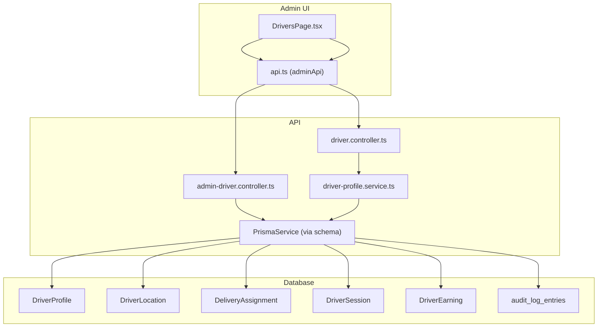

**Diagram sources**
- [admin-driver.controller.ts:6-56](file://apps/api/src/modules/driver/admin-driver.controller.ts#L6-L56)
- [driver.controller.ts:37-235](file://apps/api/src/modules/driver/driver.controller.ts#L37-L235)
- [driver-profile.service.ts:1-266](file://apps/api/src/modules/driver/driver-profile.service.ts#L1-L266)
- [schema.prisma:805-1066](file://apps/api/prisma/schema.prisma#L805-L1066)
- [api.ts:33-54](file://apps/admin/src/lib/api.ts#L33-L54)
- [DriversPage.tsx:244-389](file://apps/admin/src/pages/DriversPage.tsx#L244-L389)

**Section sources**
- [admin-driver.controller.ts:6-56](file://apps/api/src/modules/driver/admin-driver.controller.ts#L6-L56)
- [driver.controller.ts:37-235](file://apps/api/src/modules/driver/driver.controller.ts#L37-L235)
- [api.ts:33-54](file://apps/admin/src/lib/api.ts#L33-L54)
- [DriversPage.tsx:244-389](file://apps/admin/src/pages/DriversPage.tsx#L244-L389)
- [schema.prisma:805-1066](file://apps/api/prisma/schema.prisma#L805-L1066)

## Core Components
- Admin driver controller: protected by admin guard; provides online drivers list, location history, and cleanup utilities.
- Driver controller: driver registration/login, profile management, online/offline status, location tracking, documents upload, order acceptance/completion flows.
- Driver profile service: profile retrieval/update, online status transitions, statistics aggregation, session management.
- Data models: DriverProfile, DriverLocation, DeliveryAssignment, DriverSession, DriverEarning, and audit logs.

Key responsibilities:
- Listing and filtering drivers via admin endpoints.
- Approving/rejecting/suspending drivers through admin endpoints.
- Managing driver availability and real-time location.
- Tracking delivery assignments and earnings.
- Enforcing permissions and business rules.

**Section sources**
- [admin-driver.controller.ts:6-56](file://apps/api/src/modules/driver/admin-driver.controller.ts#L6-L56)
- [driver.controller.ts:37-235](file://apps/api/src/modules/driver/driver.controller.ts#L37-L235)
- [driver-profile.service.ts:1-266](file://apps/api/src/modules/driver/driver-profile.service.ts#L1-L266)
- [schema.prisma:805-1066](file://apps/api/prisma/schema.prisma#L805-L1066)

## Architecture Overview
The system uses a layered architecture:
- Admin UI calls REST APIs for driver management.
- Controllers enforce authentication/authorization and delegate to services.
- Services implement business logic and interact with Prisma to persist data.
- Database stores profiles, locations, assignments, sessions, earnings, and audit logs.

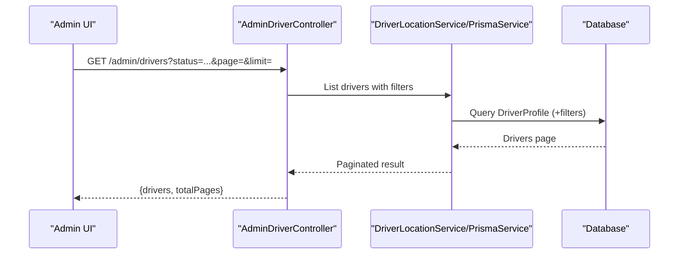

**Diagram sources**
- [admin-driver.controller.ts:6-56](file://apps/api/src/modules/driver/admin-driver.controller.ts#L6-L56)
- [api.ts:33-54](file://apps/admin/src/lib/api.ts#L33-L54)
- [DriversPage.tsx:244-389](file://apps/admin/src/pages/DriversPage.tsx#L244-L389)
- [schema.prisma:805-1066](file://apps/api/prisma/schema.prisma#L805-L1066)

## Detailed Component Analysis

### Driver Lifecycle and Status Management
- States: PENDING_APPROVAL, APPROVED, ACTIVE, SUSPENDED, REJECTED, INACTIVE.
- Transitions enforced by services and guards:
  - Only approved or active drivers can go online; going online sets ACTIVE, going offline reverts to APPROVED.
  - Suspended or rejected drivers cannot update profile or go online.
- Session tracking:
  - Going online creates a session; going offline ends it and records total online time.

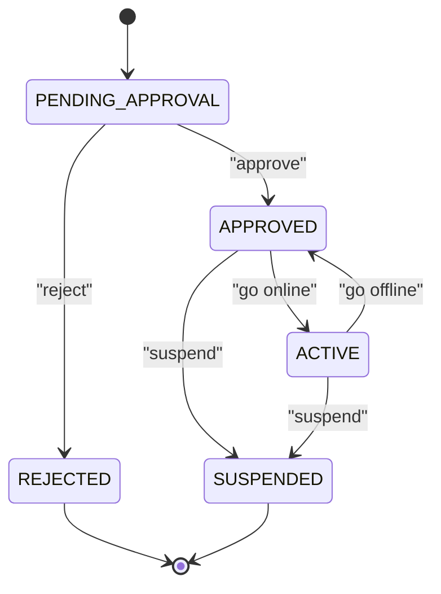

**Diagram sources**
- [schema.prisma:1038-1048](file://apps/api/prisma/schema.prisma#L1038-L1048)
- [driver-profile.service.ts:111-178](file://apps/api/src/modules/driver/driver-profile.service.ts#L111-L178)

**Section sources**
- [driver-profile.service.ts:111-178](file://apps/api/src/modules/driver/driver-profile.service.ts#L111-L178)
- [schema.prisma:805-855](file://apps/api/prisma/schema.prisma#L805-L855)
- [schema.prisma:936-954](file://apps/api/prisma/schema.prisma#L936-L954)
- [schema.prisma:1038-1048](file://apps/api/prisma/schema.prisma#L1038-L1048)

### Listing Drivers with Pagination and Filtering
- Admin endpoint supports page, limit, and optional status filter.
- Admin UI renders paginated table with status badges and modal actions.

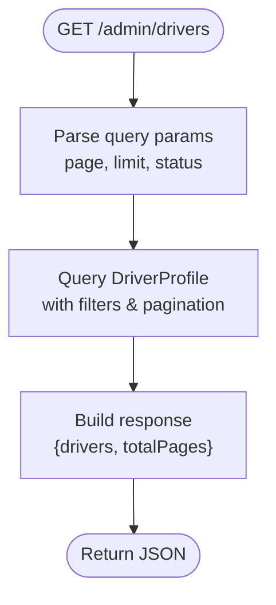

**Diagram sources**
- [api.ts:41-42](file://apps/admin/src/lib/api.ts#L41-L42)
- [DriversPage.tsx:244-389](file://apps/admin/src/pages/DriversPage.tsx#L244-L389)
- [schema.prisma:805-855](file://apps/api/prisma/schema.prisma#L805-L855)

**Section sources**
- [api.ts:41-42](file://apps/admin/src/lib/api.ts#L41-L42)
- [DriversPage.tsx:244-389](file://apps/admin/src/pages/DriversPage.tsx#L244-L389)

### Retrieving Individual Driver Details
- Admin UI fetches a single driver by ID for detailed view and actions.
- Driver profile service returns enriched profile including vehicle info, documents, metrics, and timestamps.

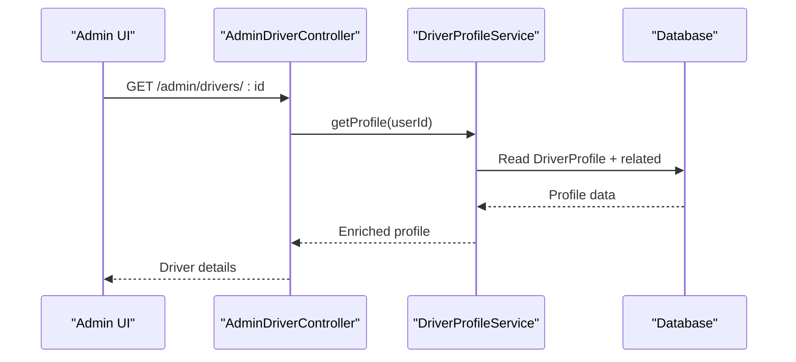

**Diagram sources**
- [api.ts:44-45](file://apps/admin/src/lib/api.ts#L44-L45)
- [driver-profile.service.ts:17-63](file://apps/api/src/modules/driver/driver-profile.service.ts#L17-L63)
- [schema.prisma:805-855](file://apps/api/prisma/schema.prisma#L805-L855)

**Section sources**
- [api.ts:44-45](file://apps/admin/src/lib/api.ts#L44-L45)
- [driver-profile.service.ts:17-63](file://apps/api/src/modules/driver/driver-profile.service.ts#L17-L63)

### Approving Driver Applications
- Admin action triggers approval workflow.
- Business rules ensure only eligible drivers are approved; updates metadata such as approvedAt/approvedBy.

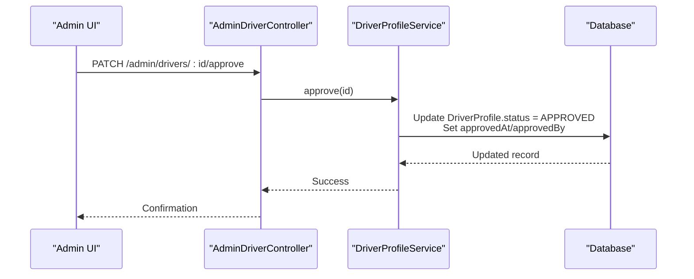

**Diagram sources**
- [api.ts:47-48](file://apps/admin/src/lib/api.ts#L47-L48)
- [schema.prisma:805-855](file://apps/api/prisma/schema.prisma#L805-L855)

**Section sources**
- [api.ts:47-48](file://apps/admin/src/lib/api.ts#L47-L48)
- [schema.prisma:805-855](file://apps/api/prisma/schema.prisma#L805-L855)

### Rejecting Applications with Reasons
- Admin rejects pending applications with a required reason.
- Updates status to REJECTED and persists rejectionReason.

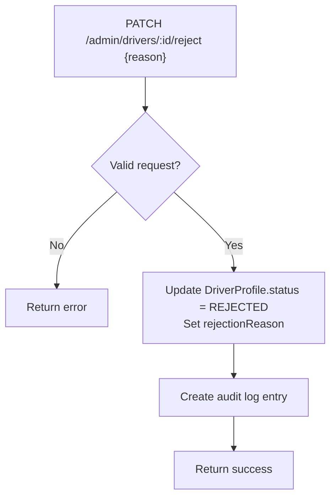

**Diagram sources**
- [api.ts:50-51](file://apps/admin/src/lib/api.ts#L50-L51)
- [schema.prisma:805-855](file://apps/api/prisma/schema.prisma#L805-L855)
- [schema.prisma:15-24](file://apps/api/prisma/schema.prisma#L15-L24)

**Section sources**
- [api.ts:50-51](file://apps/admin/src/lib/api.ts#L50-L51)
- [schema.prisma:15-24](file://apps/api/prisma/schema.prisma#L15-L24)
- [schema.prisma:805-855](file://apps/api/prisma/schema.prisma#L805-L855)

### Suspending Drivers
- Admin can suspend approved or active drivers with a reason.
- Suspended drivers cannot go online or update profile.

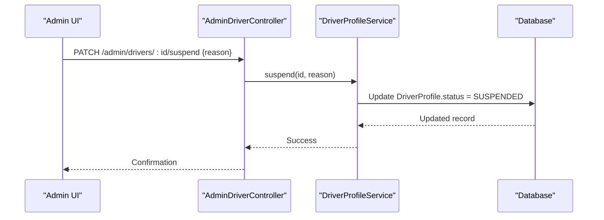

**Diagram sources**
- [api.ts:53-54](file://apps/admin/src/lib/api.ts#L53-L54)
- [schema.prisma:805-855](file://apps/api/prisma/schema.prisma#L805-L855)

**Section sources**
- [api.ts:53-54](file://apps/admin/src/lib/api.ts#L53-L54)
- [schema.prisma:805-855](file://apps/api/prisma/schema.prisma#L805-L855)

### Online/Offline Status and Location Tracking
- Drivers toggle online/offline; online requires APPROVED/ACTIVE status.
- Location updates and history are exposed for drivers and admins.

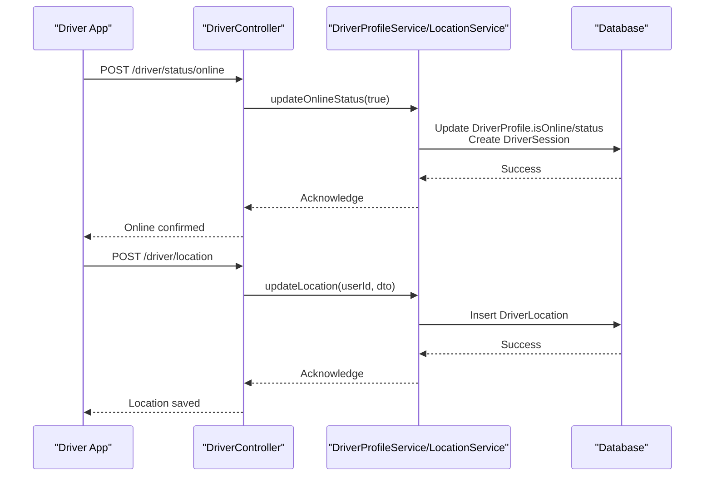

**Diagram sources**
- [driver.controller.ts:83-119](file://apps/api/src/modules/driver/driver.controller.ts#L83-L119)
- [driver-profile.service.ts:111-178](file://apps/api/src/modules/driver/driver-profile.service.ts#L111-L178)
- [schema.prisma:857-877](file://apps/api/prisma/schema.prisma#L857-L877)
- [schema.prisma:936-954](file://apps/api/prisma/schema.prisma#L936-L954)

**Section sources**
- [driver.controller.ts:83-119](file://apps/api/src/modules/driver/driver.controller.ts#L83-L119)
- [driver-profile.service.ts:111-178](file://apps/api/src/modules/driver/driver-profile.service.ts#L111-L178)
- [schema.prisma:857-877](file://apps/api/prisma/schema.prisma#L857-L877)
- [schema.prisma:936-954](file://apps/api/prisma/schema.prisma#L936-L954)

### Order Acceptance and Completion Flow
- Drivers accept, reject, and progress orders through defined stages.
- Each stage updates timestamps and status on DeliveryAssignment.

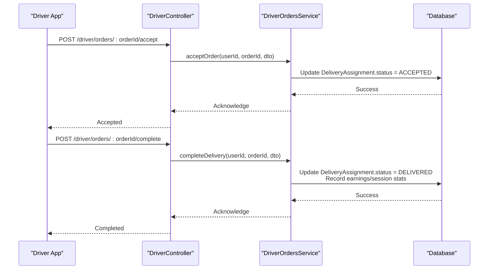

**Diagram sources**
- [driver.controller.ts:179-233](file://apps/api/src/modules/driver/driver.controller.ts#L179-L233)
- [schema.prisma:879-934](file://apps/api/prisma/schema.prisma#L879-L934)
- [schema.prisma:956-983](file://apps/api/prisma/schema.prisma#L956-L983)

**Section sources**
- [driver.controller.ts:179-233](file://apps/api/src/modules/driver/driver.controller.ts#L179-L233)
- [schema.prisma:879-934](file://apps/api/prisma/schema.prisma#L879-L934)
- [schema.prisma:956-983](file://apps/api/prisma/schema.prisma#L956-L983)

### Audit Logging for Driver Actions
- Audit log entries are available for tracking administrative actions and system events.
- Ensure critical driver lifecycle changes (approve/reject/suspend) create corresponding audit records.

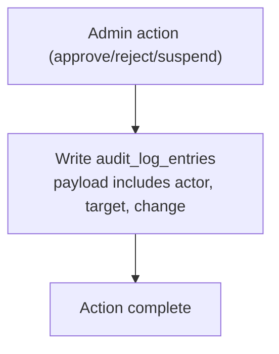

**Diagram sources**
- [schema.prisma:15-24](file://apps/api/prisma/schema.prisma#L15-L24)

**Section sources**
- [schema.prisma:15-24](file://apps/api/prisma/schema.prisma#L15-L24)

## Dependency Analysis
- Admin UI depends on adminApi methods to call backend endpoints.
- AdminDriverController depends on guards and services to enforce access and perform operations.
- DriverController depends on multiple services for auth, profile, location, and orders.
- All services depend on PrismaService and database models.

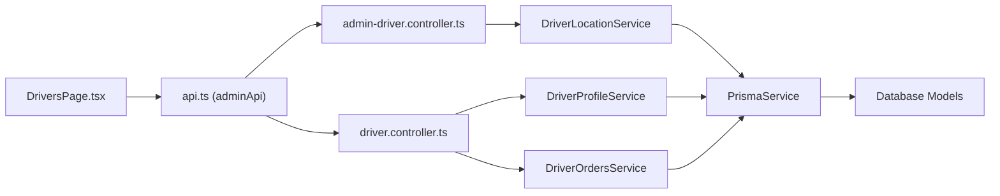

**Diagram sources**
- [DriversPage.tsx:244-389](file://apps/admin/src/pages/DriversPage.tsx#L244-L389)
- [api.ts:33-54](file://apps/admin/src/lib/api.ts#L33-L54)
- [admin-driver.controller.ts:6-56](file://apps/api/src/modules/driver/admin-driver.controller.ts#L6-L56)
- [driver.controller.ts:37-235](file://apps/api/src/modules/driver/driver.controller.ts#L37-L235)
- [driver-profile.service.ts:1-266](file://apps/api/src/modules/driver/driver-profile.service.ts#L1-L266)
- [schema.prisma:805-1066](file://apps/api/prisma/schema.prisma#L805-L1066)

**Section sources**
- [DriversPage.tsx:244-389](file://apps/admin/src/pages/DriversPage.tsx#L244-L389)
- [api.ts:33-54](file://apps/admin/src/lib/api.ts#L33-L54)
- [admin-driver.controller.ts:6-56](file://apps/api/src/modules/driver/admin-driver.controller.ts#L6-L56)
- [driver.controller.ts:37-235](file://apps/api/src/modules/driver/driver.controller.ts#L37-L235)
- [driver-profile.service.ts:1-266](file://apps/api/src/modules/driver/driver-profile.service.ts#L1-L266)
- [schema.prisma:805-1066](file://apps/api/prisma/schema.prisma#L805-L1066)

## Performance Considerations
- Use pagination and status filters when listing drivers to reduce payload size.
- Indexes on DriverProfile.status and isOnline improve query performance.
- Limit location history queries with a configurable limit parameter.
- Clean up old location records periodically to control storage growth.
- Aggregate earnings per day/week/month efficiently using database aggregations.

[No sources needed since this section provides general guidance]

## Troubleshooting Guide
Common issues and resolutions:
- Invalid driver ID:
  - Expect not found errors when fetching non-existent drivers; validate IDs before calling endpoints.
- Permission checks:
  - Admin endpoints require admin authentication; unauthorized requests will be rejected.
- Business rule validation:
  - Cannot go online if not approved/active; cannot update profile while suspended/rejected.
- Missing required fields:
  - Rejection and suspension require reasons; ensure they are provided.

Error handling patterns:
- Return appropriate HTTP status codes for not found, forbidden, and bad request scenarios.
- Provide clear messages indicating the cause and next steps.

**Section sources**
- [driver-profile.service.ts:68-106](file://apps/api/src/modules/driver/driver-profile.service.ts#L68-L106)
- [driver-profile.service.ts:111-178](file://apps/api/src/modules/driver/driver-profile.service.ts#L111-L178)
- [driver.controller.ts:123-149](file://apps/api/src/modules/driver/driver.controller.ts#L123-L149)

## Conclusion
Driver management is implemented with clear separation of concerns: controllers handle routing and guards, services enforce business rules, and Prisma manages persistence. The system supports full lifecycle operations with robust status management, location tracking, and audit logging. Admin UI integrates seamlessly to provide efficient workflows for listing, filtering, approving, rejecting, and suspending drivers, along with performance monitoring and troubleshooting support.

[No sources needed since this section summarizes without analyzing specific files]