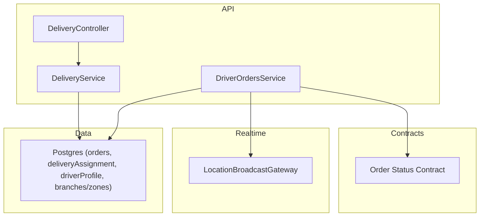
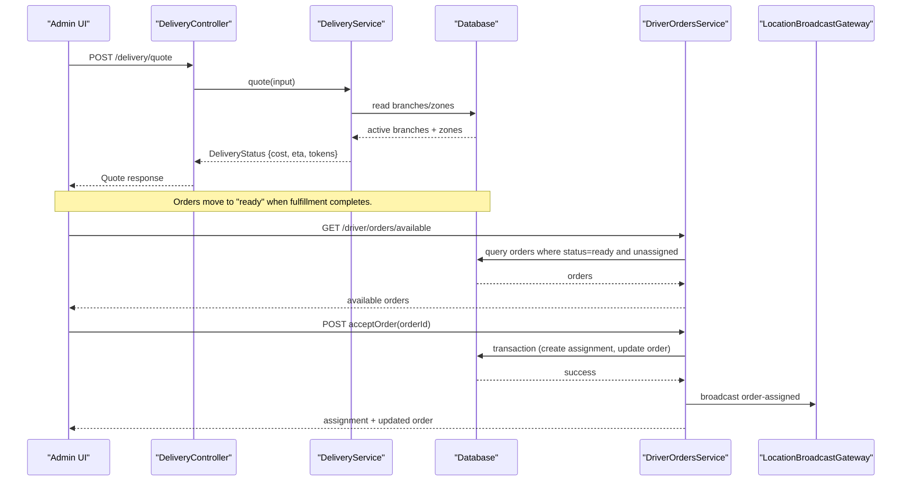
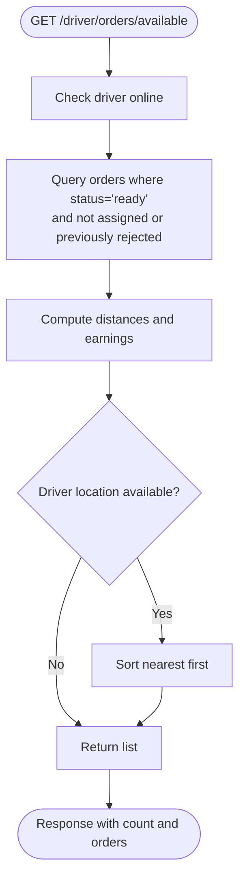
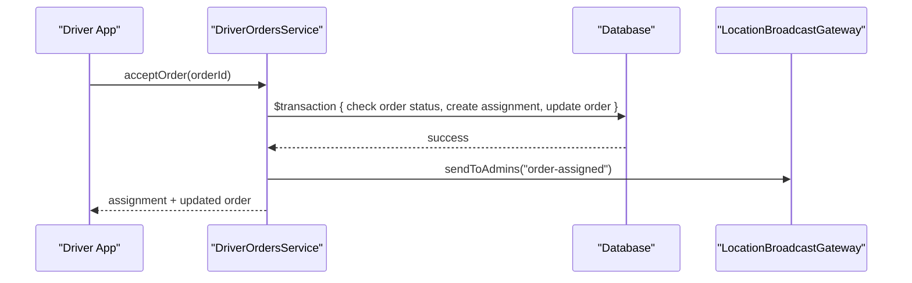
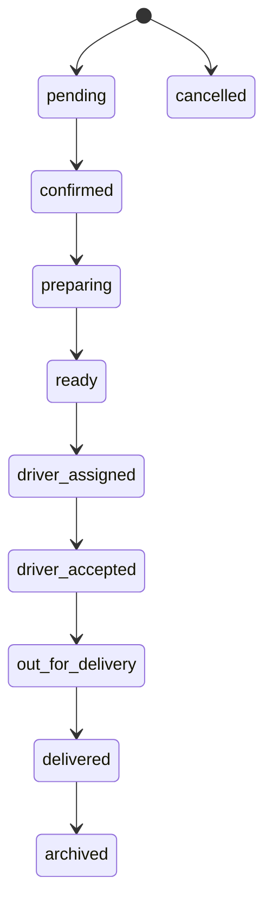
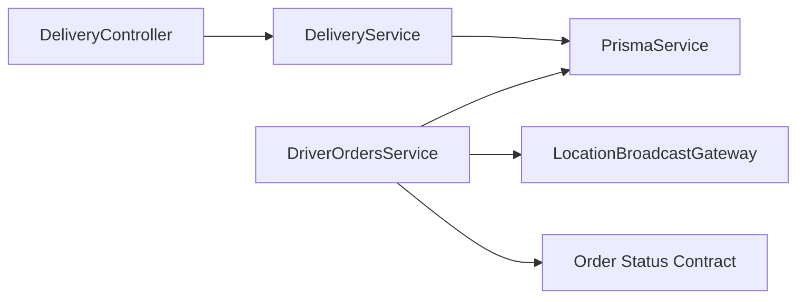

# Order Management

<cite>
**Referenced Files in This Document**
- [delivery.controller.ts](file://apps/api/src/modules/delivery/delivery.controller.ts)
- [delivery.service.ts](file://apps/api/src/modules/delivery/delivery.service.ts)
- [driver-orders.service.ts](file://apps/api/src/modules/driver/driver-orders.service.ts)
- [delivery-action.dto.ts](file://apps/api/src/modules/driver/dto/delivery-action.dto.ts)
- [orderStatus.ts](file://packages/contracts/src/orderStatus.ts)
</cite>

## Table of Contents
1. Introduction
2. Project Structure
3. Core Components
4. Architecture Overview
5. Detailed Component Analysis
6. Dependency Analysis
7. Performance Considerations
8. Troubleshooting Guide
9. Conclusion

## Introduction
This document explains order management operations with a focus on listing orders, filtering by status, and retrieving details; assigning orders to drivers (manual and automatic); updating statuses through the canonical lifecycle; and handling common scenarios such as reassignment, delivery updates, and exceptions. It also covers data integrity, concurrent access safeguards, and real-time synchronization for status changes.

## Project Structure
Order management spans several modules:
- Delivery quoting and zone matching (branch and zone selection, ETA/cost estimation).
- Driver-facing workflows for available orders, acceptance/rejection, and end-to-end delivery transitions.
- A shared contract defining the canonical order lifecycle and allowed transitions.

**Diagram sources**
- [delivery.controller.ts:1-17](file://apps/api/src/modules/delivery/delivery.controller.ts#L1-L17)
- [delivery.service.ts:58-239](file://apps/api/src/modules/delivery/delivery.service.ts#L58-L239)
- [driver-orders.service.ts:49-620](file://apps/api/src/modules/driver/driver-orders.service.ts#L49-L620)
- [orderStatus.ts:59-168](file://packages/contracts/src/orderStatus.ts#L59-L168)

**Section sources**
- [delivery.controller.ts:1-17](file://apps/api/src/modules/delivery/delivery.controller.ts#L1-L17)
- [delivery.service.ts:58-239](file://apps/api/src/modules/delivery/delivery.service.ts#L58-L239)
- [driver-orders.service.ts:49-620](file://apps/api/src/modules/driver/driver-orders.service.ts#L49-L620)
- [orderStatus.ts:59-168](file://packages/contracts/src/orderStatus.ts#L59-L168)

## Core Components
- DeliveryService: Computes delivery quotes, matches nearest branch/zone, calculates cost and ETA, and returns assignment tokens for subsequent flows.
- DriverOrdersService: Exposes driver endpoints to list available orders, accept/reject assignments, transition through delivery stages, complete deliveries, and view history.
- Order Status Contract: Defines canonical statuses, labels, normalization, and allowed transitions across the entire system.

Key responsibilities:
- Listing and filtering: DriverOrdersService provides an “available orders” endpoint that filters by status and assignment state. Pagination is supported via dedicated history endpoints.
- Assignment: Manual acceptance by drivers; future automatic assignment can be built atop the same service using distance and availability heuristics.
- Lifecycle: All transitions are enforced via transactions and validated against the canonical transition graph.

**Section sources**
- [delivery.service.ts:58-239](file://apps/api/src/modules/delivery/delivery.service.ts#L58-L239)
- [driver-orders.service.ts:74-183](file://apps/api/src/modules/driver/driver-orders.service.ts#L74-L183)
- [driver-orders.service.ts:187-322](file://apps/api/src/modules/driver/driver-orders.service.ts#L187-L322)
- [driver-orders.service.ts:380-611](file://apps/api/src/modules/driver/driver-orders.service.ts#L380-L611)
- [orderStatus.ts:59-168](file://packages/contracts/src/orderStatus.ts#L59-L168)

## Architecture Overview
The order flow integrates quoting, assignment, and delivery execution with real-time notifications.

**Diagram sources**
- [delivery.controller.ts:1-17](file://apps/api/src/modules/delivery/delivery.controller.ts#L1-L17)
- [delivery.service.ts:62-239](file://apps/api/src/modules/delivery/delivery.service.ts#L62-L239)
- [driver-orders.service.ts:74-183](file://apps/api/src/modules/driver/driver-orders.service.ts#L74-L183)
- [driver-orders.service.ts:187-295](file://apps/api/src/modules/driver/driver-orders.service.ts#L187-L295)

## Detailed Component Analysis

### Order Listing, Filtering, and Retrieval
- Available orders for drivers:
  - Filters orders by status "ready" and ensures no active assignment or previous failed/rejected assignment.
  - Includes items and computes estimated distances and earnings.
  - Sorts by proximity to pickup when driver location is available.
- History pagination:
  - Delivered deliveries are paginated with total count and page metadata.

**Diagram sources**
- [driver-orders.service.ts:74-183](file://apps/api/src/modules/driver/driver-orders.service.ts#L74-L183)

**Section sources**
- [driver-orders.service.ts:74-183](file://apps/api/src/modules/driver/driver-orders.service.ts#L74-L183)
- [driver-orders.service.ts:514-554](file://apps/api/src/modules/driver/driver-orders.service.ts#L514-L554)

### Order Assignment (Manual and Automatic Workflows)
- Manual acceptance:
  - Validates driver online and no active delivery.
  - Uses a database transaction to create a delivery assignment and update the order to the canonical driver-accepted state.
  - Broadcasts assignment event to admins.
- Automatic assignment (design guidance):
  - Use the same service methods to assign orders programmatically based on driver availability, distance, and workload balancing.
  - Enforce the same constraints (no active delivery, valid order status) to maintain consistency.

**Diagram sources**
- [driver-orders.service.ts:187-295](file://apps/api/src/modules/driver/driver-orders.service.ts#L187-L295)

**Section sources**
- [driver-orders.service.ts:187-295](file://apps/api/src/modules/driver/driver-orders.service.ts#L187-L295)

### Order Status Updates and Lifecycle Transitions
- Canonical lifecycle:
  - The contract defines all canonical statuses, labels, normalization rules, and allowed transitions. Terminal states include delivered and cancelled; archived is terminal after completion.
- Driver-driven transitions:
  - Mark en route to pickup, arrive at pharmacy, pick up, en route to customer, arrive at customer, and complete delivery.
  - Each transition validates current state and updates both assignment and order status within a transaction.
  - Real-time broadcast notifies admins of key milestones.

**Diagram sources**
- [orderStatus.ts:59-168](file://packages/contracts/src/orderStatus.ts#L59-L168)

**Section sources**
- [orderStatus.ts:59-168](file://packages/contracts/src/orderStatus.ts#L59-L168)
- [driver-orders.service.ts:380-611](file://apps/api/src/modules/driver/driver-orders.service.ts#L380-L611)

### Common Scenarios

#### Reassigning Orders
- If a driver rejects an assignment or fails to accept, the order remains available for other drivers.
- To reassign manually:
  - Ensure the prior assignment is in a terminal or failed state.
  - Create a new assignment for another eligible driver using the same acceptance workflow.

Implementation notes:
- Rejecting an order resets the order to "ready" and clears the driver assignment.
- Subsequent drivers can then accept the order following normal checks.

**Section sources**
- [driver-orders.service.ts:299-322](file://apps/api/src/modules/driver/driver-orders.service.ts#L299-L322)
- [driver-orders.service.ts:187-295](file://apps/api/src/modules/driver/driver-orders.service.ts#L187-L295)

#### Updating Delivery Status
- Drivers progress through predefined steps with geofence validation at arrival points.
- Each step updates the assignment and synchronizes the order status to the canonical equivalent.
- Completion records proof, ratings, and earnings, and broadcasts final status.

**Section sources**
- [driver-orders.service.ts:380-510](file://apps/api/src/modules/driver/driver-orders.service.ts#L380-L510)

#### Handling Exceptions
- Geofence violations at arrival raise errors and prevent invalid transitions.
- Conflicts occur if a driver already has an active delivery or if the order is no longer available.
- Non-critical failures (e.g., broadcasting) do not abort the main operation.

**Section sources**
- [driver-orders.service.ts:386-433](file://apps/api/src/modules/driver/driver-orders.service.ts#L386-L433)
- [driver-orders.service.ts:187-203](file://apps/api/src/modules/driver/driver-orders.service.ts#L187-L203)
- [driver-orders.service.ts:613-619](file://apps/api/src/modules/driver/driver-orders.service.ts#L613-L619)

### Data Integrity and Concurrent Access
- Transactions:
  - Acceptance and completion use database transactions to ensure atomic updates to orders and assignments.
- State guards:
  - Precondition checks enforce correct order status and driver eligibility before mutations.
- Idempotency:
  - Guards against duplicate acceptance and multiple active deliveries per driver.

**Section sources**
- [driver-orders.service.ts:204-295](file://apps/api/src/modules/driver/driver-orders.service.ts#L204-L295)
- [driver-orders.service.ts:443-501](file://apps/api/src/modules/driver/driver-orders.service.ts#L443-L501)

### Real-Time Status Synchronization
- Broadcasting:
  - Key events (assignment, delivery milestones, completion) are broadcast to admins via a gateway.
- Client behavior:
  - Admin dashboards should subscribe to these events to reflect live changes without polling.

**Section sources**
- [driver-orders.service.ts:259-265](file://apps/api/src/modules/driver/driver-orders.service.ts#L259-L265)
- [driver-orders.service.ts:613-619](file://apps/api/src/modules/driver/driver-orders.service.ts#L613-L619)

## Dependency Analysis
- DeliveryController depends on DeliveryService for quoting logic.
- DeliveryService depends on PrismaService to read branches/zones and compute quotes.
- DriverOrdersService depends on PrismaService for order/assignment reads/writes and on LocationBroadcastGateway for real-time updates.
- Both services rely on the canonical order status contract to align lifecycle semantics.

**Diagram sources**
- [delivery.controller.ts:1-17](file://apps/api/src/modules/delivery/delivery.controller.ts#L1-L17)
- [delivery.service.ts:58-239](file://apps/api/src/modules/delivery/delivery.service.ts#L58-L239)
- [driver-orders.service.ts:49-620](file://apps/api/src/modules/driver/driver-orders.service.ts#L49-L620)
- [orderStatus.ts:59-168](file://packages/contracts/src/orderStatus.ts#L59-L168)

**Section sources**
- [delivery.controller.ts:1-17](file://apps/api/src/modules/delivery/delivery.controller.ts#L1-L17)
- [delivery.service.ts:58-239](file://apps/api/src/modules/delivery/delivery.service.ts#L58-L239)
- [driver-orders.service.ts:49-620](file://apps/api/src/modules/driver/driver-orders.service.ts#L49-L620)
- [orderStatus.ts:59-168](file://packages/contracts/src/orderStatus.ts#L59-L168)

## Performance Considerations
- Quoting performance:
  - Branch and zone queries are filtered to active branches and sorted by distance; consider indexing branch coordinates and zone polygons for faster lookups.
- Distance calculations:
  - Haversine computations are lightweight but repeated; cache driver locations and minimize recalculations on hot paths.
- Pagination:
  - Use skip/take patterns for large datasets (e.g., delivery history) to avoid heavy payloads.
- Concurrency:
  - Rely on database transactions and row-level locks to prevent race conditions during assignment and completion.

[No sources needed since this section provides general guidance]

## Troubleshooting Guide
- Order not found or no longer available:
  - Occurs when attempting to accept an order that has changed status or been assigned elsewhere.
- Driver must be online:
  - Ensure driver profile indicates online status before accepting or transitioning.
- Already have an active delivery:
  - Prevents accepting additional orders until the current one completes or is rejected.
- Geofence violation:
  - Arrival actions require being within a defined radius; verify GPS accuracy and retry.
- Broadcasting failures:
  - Non-critical; they do not fail the request but may delay admin visibility.

**Section sources**
- [driver-orders.service.ts:187-203](file://apps/api/src/modules/driver/driver-orders.service.ts#L187-L203)
- [driver-orders.service.ts:386-433](file://apps/api/src/modules/driver/driver-orders.service.ts#L386-L433)
- [driver-orders.service.ts:613-619](file://apps/api/src/modules/driver/driver-orders.service.ts#L613-L619)

## Conclusion
Order management in this system is centered around a canonical lifecycle, robust assignment workflows, and real-time synchronization. Delivery quoting informs cost and ETA, while driver workflows ensure safe, auditable transitions from acceptance to completion. Transactions and guards protect data integrity under concurrency. Future enhancements can add automatic assignment algorithms leveraging the same service contracts and constraints.

[No sources needed since this section summarizes without analyzing specific files]