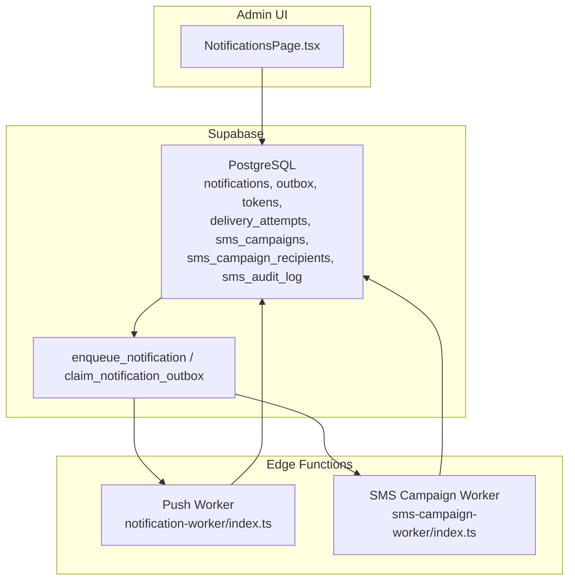
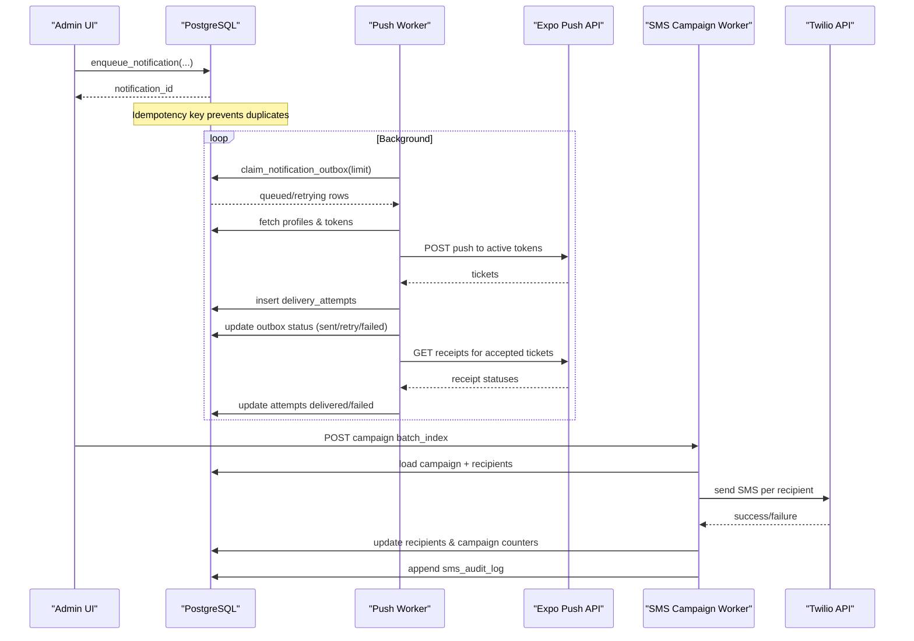
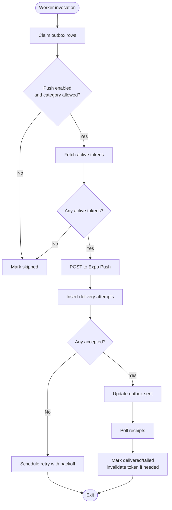
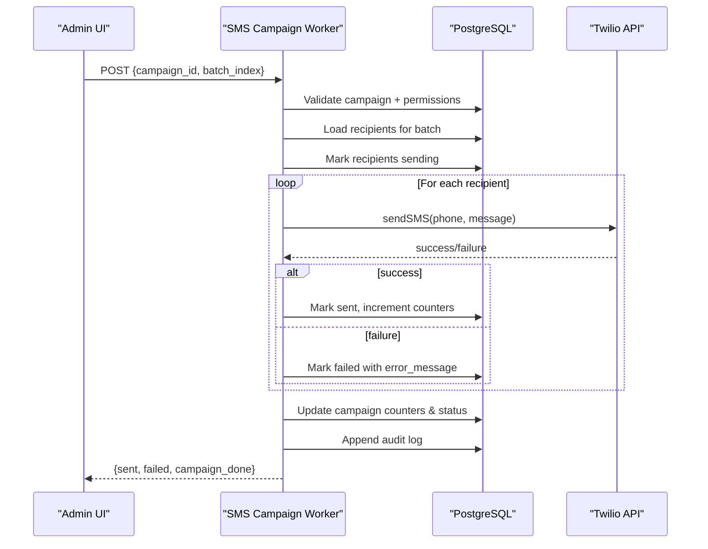
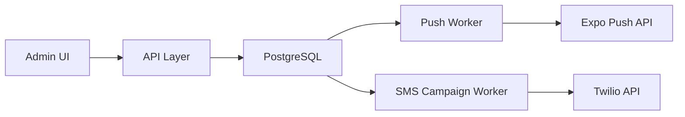

# Notification Channels

<cite>
**Referenced Files in This Document**
- [notification-worker/index.ts](file://supabase/functions/notification-worker/index.ts)
- [sms-campaign-worker/index.ts](file://supabase/functions/sms-campaign-worker/index.ts)
- [20260713090000_notification_delivery_pipeline.sql](file://supabase/migrations/20260713090000_notification_delivery_pipeline.sql)
- [20260728120000_sms_marketing.sql](file://supabase/migrations/20260728120000_sms_marketing.sql)
- [NotificationsPage.tsx](file://apps/admin/src/pages/NotificationsPage.tsx)
</cite>

## Table of Contents
1. Introduction
2. Project Structure
3. Core Components
4. Architecture Overview
5. Detailed Component Analysis
6. Dependency Analysis
7. Performance Considerations
8. Troubleshooting Guide
9. Conclusion

## Introduction
This document explains the multi-channel notification system implemented across push notifications and SMS campaigns. It covers channel selection logic, provider integration patterns, fallback strategies, background processing via worker services, rate limiting, retry mechanisms, and delivery status tracking. The goal is to help developers configure channels, handle errors, and manage priorities while ensuring reliable delivery.

## Project Structure
The notification system spans Supabase Edge Functions for background processing and database migrations that define durable queues, audit logs, and security policies:
- Push notifications are processed by a dedicated worker that claims jobs from an outbox table, sends them via Expo Push, and tracks receipts.
- SMS marketing campaigns are processed by a separate worker that batches recipients, sends messages via Twilio (with no-op mode when credentials are missing), and updates campaign counters and audit logs.
- Database schemas provide idempotent enqueueing, secure claim-and-lock semantics, and comprehensive delivery attempt tracking.

**Diagram sources**
- [notification-worker/index.ts:37-126](file://supabase/functions/notification-worker/index.ts#L37-L126)
- [sms-campaign-worker/index.ts:140-305](file://supabase/functions/sms-campaign-worker/index.ts#L140-L305)
- [20260713090000_notification_delivery_pipeline.sql:50-94](file://supabase/migrations/20260713090000_notification_delivery_pipeline.sql#L50-L94)
- [20260728120000_sms_marketing.sql:51-137](file://supabase/migrations/20260728120000_sms_marketing.sql#L51-L137)
- [NotificationsPage.tsx:30-48](file://apps/admin/src/pages/NotificationsPage.tsx#L30-L48)

**Section sources**
- [notification-worker/index.ts:1-127](file://supabase/functions/notification-worker/index.ts#L1-L127)
- [sms-campaign-worker/index.ts:1-306](file://supabase/functions/sms-campaign-worker/index.ts#L1-L306)
- [20260713090000_notification_delivery_pipeline.sql:1-94](file://supabase/migrations/20260713090000_notification_delivery_pipeline.sql#L1-L94)
- [20260728120000_sms_marketing.sql:1-259](file://supabase/migrations/20260728120000_sms_marketing.sql#L1-L259)
- [NotificationsPage.tsx:1-208](file://apps/admin/src/pages/NotificationsPage.tsx#L1-L208)

## Core Components
- Push Notification Worker: Claims pending or retryable outbox rows, respects recipient preferences, retrieves active device tokens, sends pushes via Expo, records delivery attempts, and reconciles receipts to mark delivered or failed.
- SMS Campaign Worker: Validates admin access, loads a batch of recipients for a campaign, normalizes phone numbers, sends SMS via Twilio (no-op if credentials are absent), updates per-recipient status, increments campaign counters, and appends audit log entries.
- Database Pipeline: Provides idempotent enqueueing, secure claim-and-lock with SKIP LOCKED, robust state machines for outbox and delivery attempts, and indexes optimized for batching and retries.

Key responsibilities:
- Channel selection: For push, recipient preferences determine whether to send; for SMS, campaign targeting and consent flags drive eligibility.
- Provider integration: Push uses Expo Push API; SMS uses Twilio REST API with environment-driven configuration.
- Fallback strategy: SMS worker supports no-op mode when credentials are missing; push worker marks skipped when preferences disable push or when no active tokens exist.
- Retry and rate limiting: Outbox uses exponential backoff based on attempts; SMS campaigns rely on caller-controlled cadence between batches.

**Section sources**
- [notification-worker/index.ts:23-25](file://supabase/functions/notification-worker/index.ts#L23-L25)
- [notification-worker/index.ts:47-99](file://supabase/functions/notification-worker/index.ts#L47-L99)
- [sms-campaign-worker/index.ts:75-136](file://supabase/functions/sms-campaign-worker/index.ts#L75-L136)
- [sms-campaign-worker/index.ts:196-281](file://supabase/functions/sms-campaign-worker/index.ts#L196-L281)
- [20260713090000_notification_delivery_pipeline.sql:11-45](file://supabase/migrations/20260713090000_notification_delivery_pipeline.sql#L11-L45)
- [20260713090000_notification_delivery_pipeline.sql:72-76](file://supabase/migrations/20260713090000_notification_delivery_pipeline.sql#L72-L76)

## Architecture Overview
The system separates concerns into durable queues (database), background workers (Edge Functions), and external providers (Expo, Twilio). Admin UI triggers enqueues or campaign runs, while workers process batches asynchronously with strong consistency guarantees.

**Diagram sources**
- [20260713090000_notification_delivery_pipeline.sql:50-94](file://supabase/migrations/20260713090000_notification_delivery_pipeline.sql#L50-L94)
- [notification-worker/index.ts:37-126](file://supabase/functions/notification-worker/index.ts#L37-L126)
- [sms-campaign-worker/index.ts:140-305](file://supabase/functions/sms-campaign-worker/index.ts#L140-L305)

## Detailed Component Analysis

### Push Notification Delivery
- Enqueueing: Uses a SQL function to create both a notification record and an outbox entry with an idempotency key derived from event type, recipient, and payload hash.
- Claiming: Workers call a secure function that locks eligible rows using SKIP LOCKED and sets a lock window to avoid concurrent processing.
- Preferences: Before sending, the worker checks recipient preferences; if push is disabled or category opted out, it marks the job skipped.
- Token resolution: Retrieves active device tokens for the recipient; if none exist, marks the job skipped.
- Sending: Batches tokens and posts to Expo Push; records each attempt with ticket IDs and provider responses.
- Receipt reconciliation: Periodically polls Expo receipts to finalize delivery status and invalidates tokens on DeviceNotRegistered.

**Diagram sources**
- [notification-worker/index.ts:23-25](file://supabase/functions/notification-worker/index.ts#L23-L25)
- [notification-worker/index.ts:47-99](file://supabase/functions/notification-worker/index.ts#L47-L99)
- [notification-worker/index.ts:102-124](file://supabase/functions/notification-worker/index.ts#L102-L124)
- [20260713090000_notification_delivery_pipeline.sql:72-76](file://supabase/migrations/20260713090000_notification_delivery_pipeline.sql#L72-L76)

**Section sources**
- [notification-worker/index.ts:1-127](file://supabase/functions/notification-worker/index.ts#L1-L127)
- [20260713090000_notification_delivery_pipeline.sql:11-45](file://supabase/migrations/20260713090000_notification_delivery_pipeline.sql#L11-L45)
- [20260713090000_notification_delivery_pipeline.sql:50-94](file://supabase/migrations/20260713090000_notification_delivery_pipeline.sql#L50-L94)

### SMS Campaign Delivery
- Authorization: Requires valid JWT and manager role; service-role client used for writes.
- Campaign lifecycle: Supports states draft → queued → running → completed | failed | cancelled; counters updated atomically.
- Batch processing: Loads recipients by batch_index and status; marks them sending before dispatch.
- Provider integration: Normalizes phone numbers and sends via Twilio REST; returns structured results without throwing to keep batch processing resilient.
- No-op mode: When credentials are absent, logs and succeeds to support staging environments.
- Auditability: Appends immutable audit log entries for batch start/completion and final completion.

**Diagram sources**
- [sms-campaign-worker/index.ts:140-305](file://supabase/functions/sms-campaign-worker/index.ts#L140-L305)
- [20260728120000_sms_marketing.sql:51-137](file://supabase/migrations/20260728120000_sms_marketing.sql#L51-L137)

**Section sources**
- [sms-campaign-worker/index.ts:1-306](file://supabase/functions/sms-campaign-worker/index.ts#L1-L306)
- [20260728120000_sms_marketing.sql:1-259](file://supabase/migrations/20260728120000_sms_marketing.sql#L1-L259)

### Channel Selection Logic and Priorities
- Push channel:
  - Recipient preferences control whether push is enabled and which categories are allowed.
  - If disabled or category opted out, the job is skipped rather than retried.
  - Active tokens must exist; otherwise, the job is skipped.
- SMS channel:
  - Eligibility determined by campaign targeting and user consent flags.
  - Phone normalization ensures E.164 format; invalid numbers fail immediately.
- Priority handling:
  - Push priority set high for timely delivery.
  - SMS campaigns use caller-controlled pacing between batches to respect rate limits.

**Section sources**
- [notification-worker/index.ts:47-65](file://supabase/functions/notification-worker/index.ts#L47-L65)
- [notification-worker/index.ts:66-99](file://supabase/functions/notification-worker/index.ts#L66-L99)
- [sms-campaign-worker/index.ts:75-136](file://supabase/functions/sms-campaign-worker/index.ts#L75-L136)
- [sms-campaign-worker/index.ts:196-281](file://supabase/functions/sms-campaign-worker/index.ts#L196-L281)

### Configuration Examples
- Push notifications:
  - Ensure SUPABASE_URL and service role key are configured for the worker.
  - Set NOTIFICATION_WORKER_SECRET and enforce header-based authorization.
  - Configure Expo Push endpoints and ensure devices register tokens correctly.
- SMS campaigns:
  - Provide TWILIO_ACCOUNT_SID, TWILIO_AUTH_TOKEN, and TWILIO_FROM to enable sending.
  - Without credentials, the worker operates in no-op mode for safe staging usage.
  - Define campaign batch_size and rate_limit_secs to control throughput.

**Section sources**
- [notification-worker/index.ts:37-43](file://supabase/functions/notification-worker/index.ts#L37-L43)
- [sms-campaign-worker/index.ts:75-127](file://supabase/functions/sms-campaign-worker/index.ts#L75-L127)
- [sms-campaign-worker/index.ts:140-181](file://supabase/functions/sms-campaign-worker/index.ts#L140-L181)

### Error Handling and Fallback Strategies
- Push:
  - Preference-disabled or missing tokens result in skipped status.
  - Provider errors recorded per attempt; exponential backoff schedules retries.
  - Receipt reconciliation marks delivered or failed; invalidates tokens on DeviceNotRegistered.
- SMS:
  - Invalid phone numbers return immediate failure with specific error codes.
  - Network or provider errors captured per recipient without aborting the batch.
  - No-op mode allows development/testing without live provider calls.

**Section sources**
- [notification-worker/index.ts:47-99](file://supabase/functions/notification-worker/index.ts#L47-L99)
- [notification-worker/index.ts:102-124](file://supabase/functions/notification-worker/index.ts#L102-L124)
- [sms-campaign-worker/index.ts:75-136](file://supabase/functions/sms-campaign-worker/index.ts#L75-L136)
- [sms-campaign-worker/index.ts:244-264](file://supabase/functions/sms-campaign-worker/index.ts#L244-L264)

### Delivery Status Tracking
- Push:
  - Outbox tracks overall job status and next_attempt_at for retries.
  - Delivery attempts store provider responses, error codes, and receipt timestamps.
  - Unique index on expo_ticket_id ensures receipt updates are idempotent.
- SMS:
  - Per-recipient status transitions: pending → sending → sent | failed.
  - Campaign counters reflect totals; audit log provides immutable history.

**Section sources**
- [20260713090000_notification_delivery_pipeline.sql:11-45](file://supabase/migrations/20260713090000_notification_delivery_pipeline.sql#L11-L45)
- [notification-worker/index.ts:66-99](file://supabase/functions/notification-worker/index.ts#L66-L99)
- [notification-worker/index.ts:102-124](file://supabase/functions/notification-worker/index.ts#L102-L124)
- [20260728120000_sms_marketing.sql:87-137](file://supabase/migrations/20260728120000_sms_marketing.sql#L87-L137)

## Dependency Analysis
- Workers depend on PostgreSQL functions and tables for durable queuing and state management.
- Push worker depends on Expo Push APIs; SMS worker depends on Twilio REST API.
- Admin UI interacts with the API layer to trigger broadcasts and view history; workers operate independently in the background.

**Diagram sources**
- [NotificationsPage.tsx:30-48](file://apps/admin/src/pages/NotificationsPage.tsx#L30-L48)
- [notification-worker/index.ts:37-126](file://supabase/functions/notification-worker/index.ts#L37-L126)
- [sms-campaign-worker/index.ts:140-305](file://supabase/functions/sms-campaign-worker/index.ts#L140-L305)

**Section sources**
- [NotificationsPage.tsx:1-208](file://apps/admin/src/pages/NotificationsPage.tsx#L1-L208)
- [notification-worker/index.ts:1-127](file://supabase/functions/notification-worker/index.ts#L1-L127)
- [sms-campaign-worker/index.ts:1-306](file://supabase/functions/sms-campaign-worker/index.ts#L1-L306)

## Performance Considerations
- Batching:
  - Push worker processes up to a configurable batch size per invocation.
  - SMS campaigns split recipients into fixed-size batches to control throughput.
- Locking and concurrency:
  - Outbox claiming uses SKIP LOCKED to prevent duplicate processing under concurrency.
  - Lock windows reduce contention and allow safe retries.
- Backoff and retries:
  - Exponential backoff based on attempt count avoids thundering herds.
  - SMS campaigns rely on caller-enforced pacing between batches.
- Indexes:
  - Optimized indexes on outbox claim fields and delivery attempts improve query performance.
  - Campaign recipient indexes support efficient batch retrieval.

[No sources needed since this section provides general guidance]

## Troubleshooting Guide
Common issues and resolutions:
- Push disabled by recipient preferences:
  - Symptom: Jobs marked skipped with reason indicating push disabled.
  - Resolution: Update recipient preferences to enable push or adjust category opt-outs.
- No active device tokens:
  - Symptom: Jobs skipped due to missing tokens.
  - Resolution: Ensure devices register tokens and remain valid; check invalidation events.
- Provider errors:
  - Symptom: Attempts marked failed with error codes/messages.
  - Resolution: Inspect provider_response and error_message; retry automatically based on backoff.
- SMS no-op mode:
  - Symptom: Logs indicate no-op sends when credentials are absent.
  - Resolution: Provide required Twilio credentials to enable live sending.
- Campaign not progressing:
  - Symptom: Campaign remains running or does not complete.
  - Resolution: Verify batch_index progression and rate_limit_secs; ensure all batches are processed.

**Section sources**
- [notification-worker/index.ts:47-99](file://supabase/functions/notification-worker/index.ts#L47-L99)
- [notification-worker/index.ts:102-124](file://supabase/functions/notification-worker/index.ts#L102-L124)
- [sms-campaign-worker/index.ts:75-136](file://supabase/functions/sms-campaign-worker/index.ts#L75-L136)
- [sms-campaign-worker/index.ts:244-281](file://supabase/functions/sms-campaign-worker/index.ts#L244-L281)

## Conclusion
The multi-channel notification system combines durable queues, robust background workers, and provider integrations to deliver push notifications and SMS campaigns reliably. Channel selection respects user preferences and consent, while retry and receipt mechanisms ensure accurate delivery tracking. By configuring environment variables, managing campaign pacing, and monitoring audit logs, teams can maintain high availability and observability across channels.

[No sources needed since this section summarizes without analyzing specific files]