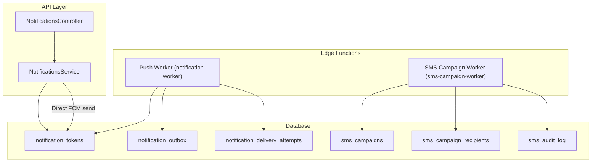
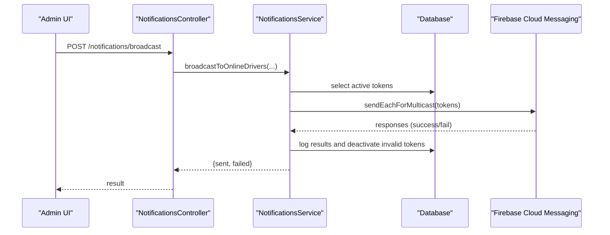
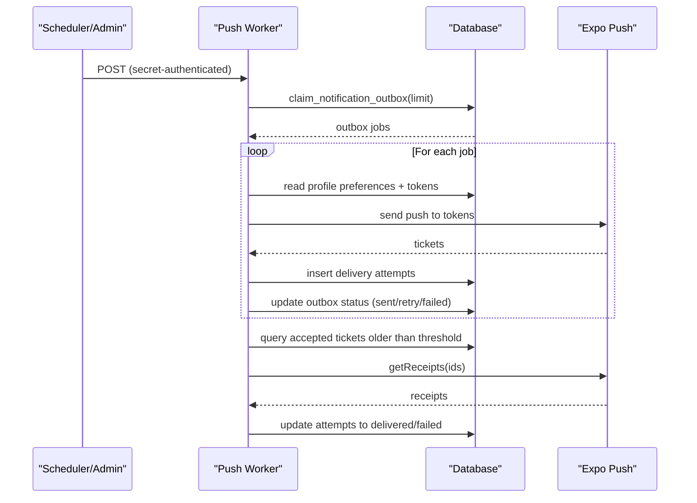
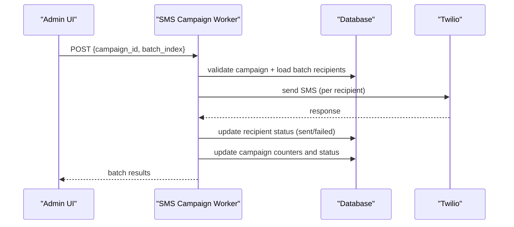
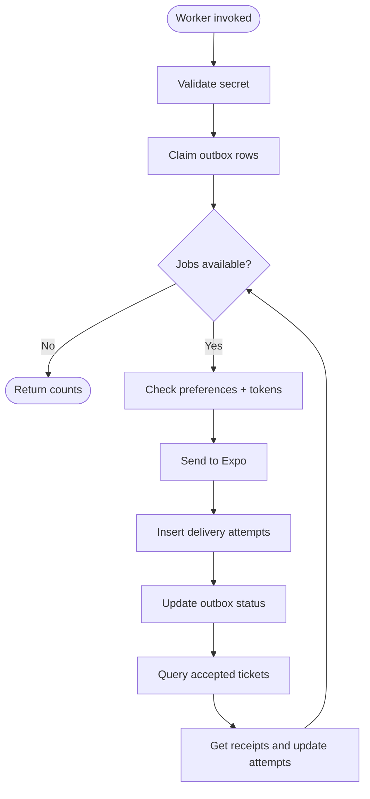
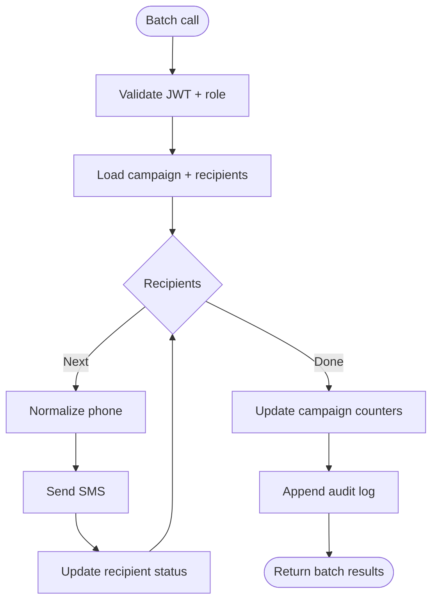
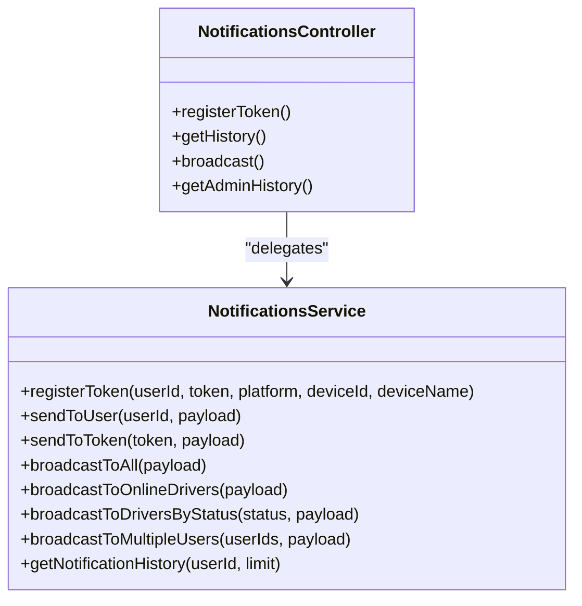
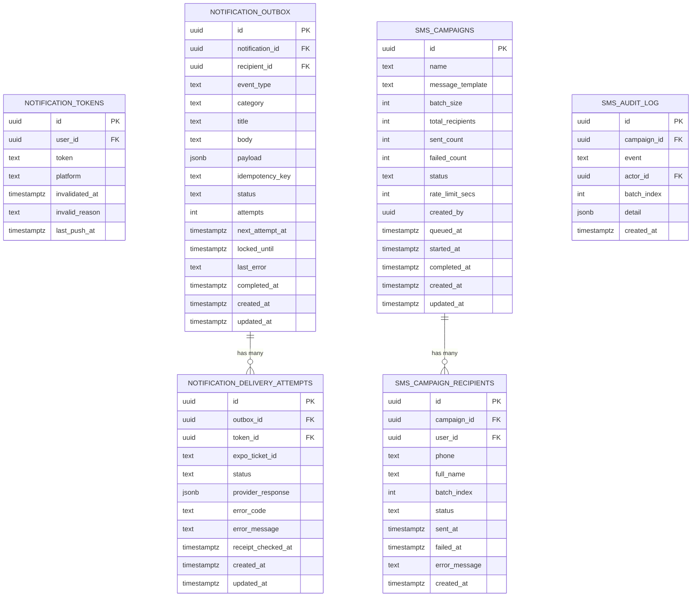

# Notification System

<cite>
**Referenced Files in This Document**
- [index.ts](file://supabase/functions/notification-worker/index.ts)
- [index.ts](file://supabase/functions/sms-campaign-worker/index.ts)
- [notifications.service.ts](file://apps/api/src/modules/notifications/notifications.service.ts)
- [notifications.controller.ts](file://apps/api/src/modules/notifications/notifications.controller.ts)
- [broadcast.dto.ts](file://apps/api/src/modules/notifications/dto/broadcast.dto.ts)
- [20260713090000_notification_delivery_pipeline.sql](file://supabase/migrations/20260713090000_notification_delivery_pipeline.sql)
- [20260728120000_sms_marketing.sql](file://supabase/migrations/20260728120000_sms_marketing.sql)
</cite>

## Table of Contents
1. [Introduction](#introduction)
2. [Project Structure](#project-structure)
3. [Core Components](#core-components)
4. [Architecture Overview](#architecture-overview)
5. [Detailed Component Analysis](#detailed-component-analysis)
6. [Dependency Analysis](#dependency-analysis)
7. [Performance Considerations](#performance-considerations)
8. [Troubleshooting Guide](#troubleshooting-guide)
9. [Conclusion](#conclusion)
10. [Appendices](#appendices)

## Introduction
This document explains the multi-channel notification system that supports push notifications, SMS campaigns, and background delivery workers. It covers:
- Push notifications via a durable outbox pipeline with retry and receipt tracking
- SMS marketing campaigns with batched processing and audit logging
- Admin APIs for broadcast and token management
- Scheduling concepts, recipient list management, and delivery status tracking
- Rate limiting, retries, analytics, external provider integration, and fallback strategies

## Project Structure
The notification system spans three layers:
- API layer (NestJS): token registration, broadcast endpoints, and direct push sending
- Edge functions (Supabase): background workers for push delivery and SMS campaign batching
- Database schema: durable outbox tables, delivery attempts, SMS campaign tables, and RPCs

**Diagram sources**
- [notifications.controller.ts:1-60](file://apps/api/src/modules/notifications/notifications.controller.ts#L1-L60)
- [notifications.service.ts:1-229](file://apps/api/src/modules/notifications/notifications.service.ts#L1-L229)
- [index.ts:1-127](file://supabase/functions/notification-worker/index.ts#L1-L127)
- [index.ts:1-306](file://supabase/functions/sms-campaign-worker/index.ts#L1-L306)
- [20260713090000_notification_delivery_pipeline.sql:1-94](file://supabase/migrations/20260713090000_notification_delivery_pipeline.sql#L1-L94)
- [20260728120000_sms_marketing.sql:1-259](file://supabase/migrations/20260728120000_sms_marketing.sql#L1-L259)

**Section sources**
- [notifications.controller.ts:1-60](file://apps/api/src/modules/notifications/notifications.controller.ts#L1-L60)
- [notifications.service.ts:1-229](file://apps/api/src/modules/notifications/notifications.service.ts#L1-L229)
- [index.ts:1-127](file://supabase/functions/notification-worker/index.ts#L1-L127)
- [index.ts:1-306](file://supabase/functions/sms-campaign-worker/index.ts#L1-L306)
- [20260713090000_notification_delivery_pipeline.sql:1-94](file://supabase/migrations/20260713090000_notification_delivery_pipeline.sql#L1-L94)
- [20260728120000_sms_marketing.sql:1-259](file://supabase/migrations/20260728120000_sms_marketing.sql#L1-L259)

## Core Components
- Push Outbox Worker: claims queued or retrying outbox rows, respects user preferences, sends via Expo Push, records per-token delivery attempts, and reconciles receipts to mark delivered or failed.
- SMS Campaign Worker: processes one batch per invocation, validates admin privileges, normalizes phone numbers, sends via Twilio (with no-op mode when credentials are missing), updates recipient statuses, and logs audit events.
- API Notifications Service: manages device tokens, sends single or multicast push messages via Firebase Admin SDK, and provides broadcast helpers targeting drivers or specific users.
- API Notifications Controller: exposes endpoints for token registration, history retrieval, and admin broadcasts.

Key capabilities:
- Templates: message templates stored in campaign definitions; push payloads include title, body, optional image URL, and data fields.
- Scheduling: outbox uses next_attempt_at and locked_until for retry scheduling; SMS campaigns use batch_index and rate_limit_secs enforced by caller.
- Broadcast: targeted broadcasts to all drivers, online drivers, or specific users.
- Delivery status: per-attempt records and campaign counters provide visibility into success/failure.

**Section sources**
- [index.ts:1-127](file://supabase/functions/notification-worker/index.ts#L1-L127)
- [index.ts:1-306](file://supabase/functions/sms-campaign-worker/index.ts#L1-L306)
- [notifications.service.ts:1-229](file://apps/api/src/modules/notifications/notifications.service.ts#L1-L229)
- [notifications.controller.ts:1-60](file://apps/api/src/modules/notifications/notifications.controller.ts#L1-L60)
- [broadcast.dto.ts:1-53](file://apps/api/src/modules/notifications/dto/broadcast.dto.ts#L1-L53)
- [20260713090000_notification_delivery_pipeline.sql:1-94](file://supabase/migrations/20260713090000_notification_delivery_pipeline.sql#L1-L94)
- [20260728120000_sms_marketing.sql:1-259](file://supabase/migrations/20260728120000_sms_marketing.sql#L1-L259)

## Architecture Overview
The system separates concerns between API-triggered actions and background processing:
- Direct push via API using Firebase Admin SDK for immediate delivery
- Durable push delivery via Supabase Edge Function reading from an outbox table with retry and receipt reconciliation
- SMS marketing via a batched worker that processes recipients in controlled batches

**Diagram sources**
- [notifications.controller.ts:27-50](file://apps/api/src/modules/notifications/notifications.controller.ts#L27-L50)
- [notifications.service.ts:136-211](file://apps/api/src/modules/notifications/notifications.service.ts#L136-L211)

**Diagram sources**
- [index.ts:1-127](file://supabase/functions/notification-worker/index.ts#L1-L127)
- [20260713090000_notification_delivery_pipeline.sql:50-76](file://supabase/migrations/20260713090000_notification_delivery_pipeline.sql#L50-L76)

**Diagram sources**
- [index.ts:140-306](file://supabase/functions/sms-campaign-worker/index.ts#L140-L306)
- [20260728120000_sms_marketing.sql:51-131](file://supabase/migrations/20260728120000_sms_marketing.sql#L51-L131)

## Detailed Component Analysis

### Push Outbox Worker
Responsibilities:
- Authenticate via secret header
- Claim up to a fixed batch size of outbox rows
- Respect recipient preferences and active device tokens
- Send pushes via Expo, record per-token attempts, and reconcile receipts
- Update outbox status to sent, retrying, failed, or skipped based on outcomes

Retry and rate behavior:
- Exponential backoff computed from attempt count
- Max attempts capped before marking failed
- Receipt reconciliation marks delivered or failed and invalidates unregistered devices

**Diagram sources**
- [index.ts:1-127](file://supabase/functions/notification-worker/index.ts#L1-L127)

**Section sources**
- [index.ts:1-127](file://supabase/functions/notification-worker/index.ts#L1-L127)
- [20260713090000_notification_delivery_pipeline.sql:11-45](file://supabase/migrations/20260713090000_notification_delivery_pipeline.sql#L11-L45)

### SMS Campaign Worker
Responsibilities:
- Validate admin JWT and role
- Load campaign and ensure processable state
- Fetch a batch of pending recipients by batch_index
- Normalize phone numbers and send SMS via Twilio
- Update recipient statuses and campaign counters
- Append audit log entries for batch lifecycle

Rate limiting and fallback:
- Rate limit is enforced by caller between batch calls using campaign.rate_limit_secs
- No-op mode when provider credentials are absent (useful for staging)

**Diagram sources**
- [index.ts:140-306](file://supabase/functions/sms-campaign-worker/index.ts#L140-L306)

**Section sources**
- [index.ts:1-306](file://supabase/functions/sms-campaign-worker/index.ts#L1-L306)
- [20260728120000_sms_marketing.sql:51-131](file://supabase/migrations/20260728120000_sms_marketing.sql#L51-L131)

### API Notifications Service and Controller
Responsibilities:
- Register and manage device tokens with deactivation of stale tokens
- Send single or multicast push messages via Firebase Admin SDK
- Provide broadcast endpoints for drivers and specific users
- Log delivery outcomes and deactivate invalid tokens automatically

Broadcast targets:
- All approved/active drivers
- Online drivers
- Specific user IDs

**Diagram sources**
- [notifications.controller.ts:1-60](file://apps/api/src/modules/notifications/notifications.controller.ts#L1-L60)
- [notifications.service.ts:1-229](file://apps/api/src/modules/notifications/notifications.service.ts#L1-L229)

**Section sources**
- [notifications.controller.ts:1-60](file://apps/api/src/modules/notifications/notifications.controller.ts#L1-L60)
- [notifications.service.ts:1-229](file://apps/api/src/modules/notifications/notifications.service.ts#L1-L229)
- [broadcast.dto.ts:1-53](file://apps/api/src/modules/notifications/dto/broadcast.dto.ts#L1-L53)

### Data Models and Schema
Key tables and relationships:
- notification_tokens: stores device tokens with validity and last push timestamps
- notification_outbox: durable queue for push delivery with idempotency keys and retry scheduling
- notification_delivery_attempts: per-token delivery outcomes and provider responses
- sms_campaigns: campaign metadata, batch size, counters, and rate limits
- sms_campaign_recipients: per-user campaign rows with status and timestamps
- sms_audit_log: append-only audit trail for campaign events

**Diagram sources**
- [20260713090000_notification_delivery_pipeline.sql:5-45](file://supabase/migrations/20260713090000_notification_delivery_pipeline.sql#L5-L45)
- [20260728120000_sms_marketing.sql:51-131](file://supabase/migrations/20260728120000_sms_marketing.sql#L51-L131)

**Section sources**
- [20260713090000_notification_delivery_pipeline.sql:1-94](file://supabase/migrations/20260713090000_notification_delivery_pipeline.sql#L1-L94)
- [20260728120000_sms_marketing.sql:1-259](file://supabase/migrations/20260728120000_sms_marketing.sql#L1-L259)

## Dependency Analysis
- API depends on Prisma-managed database for token storage and logs
- Push worker depends on Supabase RPC to claim outbox rows and writes to delivery attempts
- SMS worker depends on campaign and recipient tables plus audit log
- External integrations:
  - Firebase Cloud Messaging via Admin SDK for direct push
  - Expo Push for outbox-based push delivery
  - Twilio for SMS delivery

Potential coupling points:
- Token lifecycle managed by API; worker reads tokens to deliver
- Outbox relies on idempotency keys to prevent duplicates
- SMS campaign state machine driven by worker updates

**Section sources**
- [notifications.service.ts:1-229](file://apps/api/src/modules/notifications/notifications.service.ts#L1-L229)
- [index.ts:1-127](file://supabase/functions/notification-worker/index.ts#L1-L127)
- [index.ts:1-306](file://supabase/functions/sms-campaign-worker/index.ts#L1-L306)

## Performance Considerations
- Batch sizes:
  - Push worker claims up to a fixed batch size per invocation
  - SMS campaigns enforce batch sizes at creation time
- Multicast messaging:
  - API chunks tokens into batches for efficient multicast sends
- Retry strategy:
  - Exponential backoff for push outbox with max attempts
  - SMS failures recorded per recipient for later retry workflows
- Receipt reconciliation:
  - Periodic polling of Expo receipts to mark delivered or failed
- Indexes:
  - Optimized indexes on outbox claim queries and campaign recipient lookups

[No sources needed since this section provides general guidance]

## Troubleshooting Guide
Common issues and diagnostics:
- Push not received:
  - Check recipient preferences and active tokens
  - Review delivery attempts for provider errors and receipt status
  - Invalidate tokens marked as DeviceNotRegistered
- SMS campaign stalls:
  - Verify campaign status and batch_index progression
  - Ensure caller respects rate_limit_secs between batches
  - Inspect sms_audit_log for batch_started/batch_completed events
- Invalid tokens:
  - API deactivates tokens on registration errors
  - Worker invalidates tokens on provider feedback

Operational checks:
- Confirm environment variables for providers (Firebase, Expo, Twilio)
- Validate secret headers for push worker authentication
- Ensure service-role access for worker database operations

**Section sources**
- [index.ts:1-127](file://supabase/functions/notification-worker/index.ts#L1-L127)
- [index.ts:1-306](file://supabase/functions/sms-campaign-worker/index.ts#L1-L306)
- [notifications.service.ts:100-132](file://apps/api/src/modules/notifications/notifications.service.ts#L100-L132)

## Conclusion
The notification system combines immediate push delivery via the API with a robust, durable outbox pipeline for reliable push distribution and a scalable SMS campaign engine. Together, they provide:
- Template-driven messaging
- Configurable scheduling and batching
- Comprehensive delivery status and analytics
- Resilient retries and provider-specific fallbacks
- Clear separation of responsibilities across API, workers, and database

[No sources needed since this section summarizes without analyzing specific files]

## Appendices

### Examples and Usage Patterns
- Sending push notifications:
  - Use the broadcast endpoint to target drivers or specific users
  - Reference token registration and history endpoints for device management
- Managing SMS campaigns:
  - Create a campaign with a template and batch size
  - Select recipients and queue the campaign
  - Invoke the worker repeatedly with increasing batch_index values, respecting rate limits
- Handling delivery status:
  - Query delivery attempts for push outcomes
  - Review campaign counters and audit logs for SMS progress

**Section sources**
- [notifications.controller.ts:11-58](file://apps/api/src/modules/notifications/notifications.controller.ts#L11-L58)
- [notifications.service.ts:104-162](file://apps/api/src/modules/notifications/notifications.service.ts#L104-L162)
- [index.ts:175-306](file://supabase/functions/sms-campaign-worker/index.ts#L175-L306)