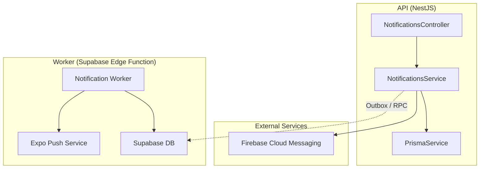
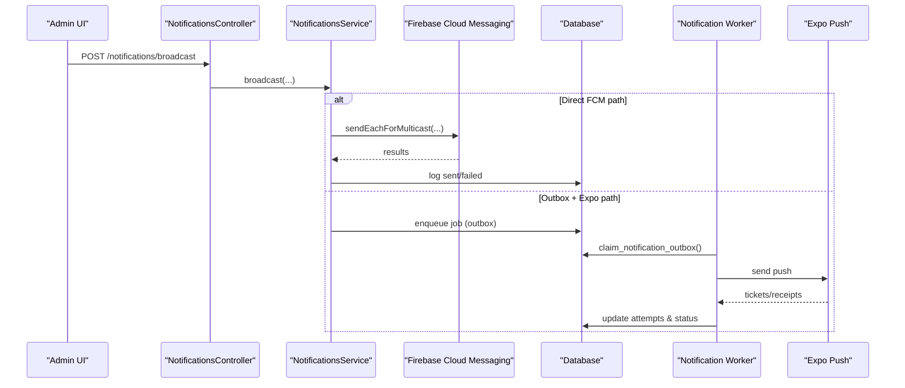
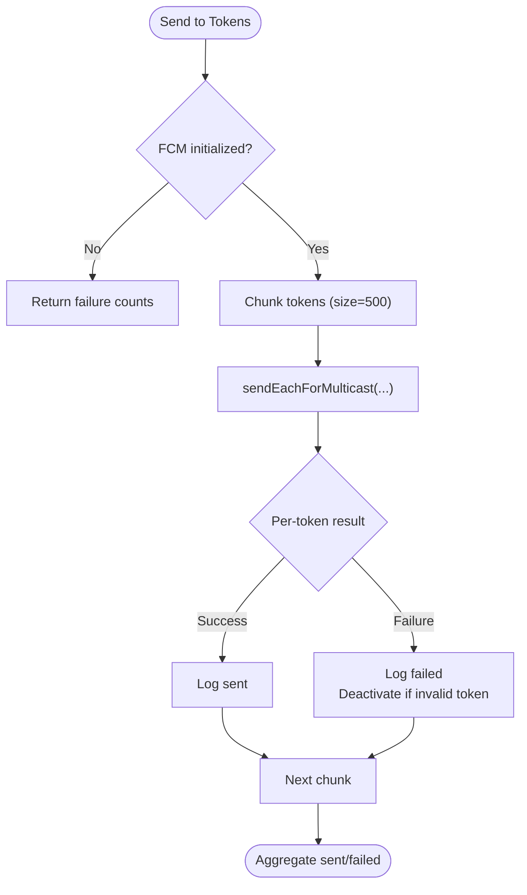
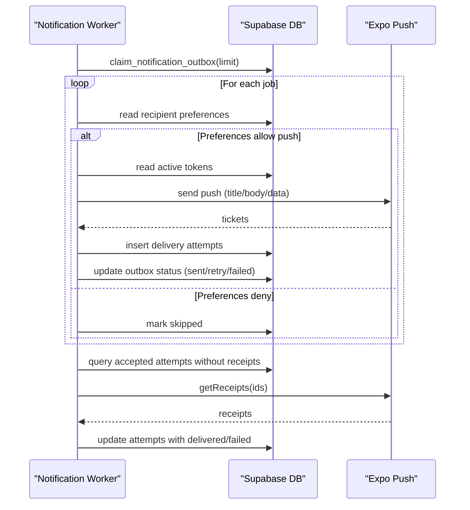
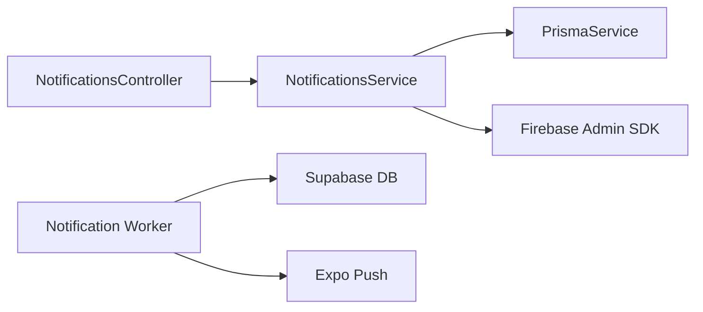

# Template Management

<cite>
**Referenced Files in This Document**
- [notifications.service.ts](file://apps/api/src/modules/notifications/notifications.service.ts)
- [notifications.controller.ts](file://apps/api/src/modules/notifications/notifications.controller.ts)
- [broadcast.dto.ts](file://apps/api/src/modules/notifications/dto/broadcast.dto.ts)
- [index.ts](file://supabase/functions/notification-worker/index.ts)
</cite>

## Table of Contents
1. [Introduction](#introduction)
2. [Project Structure](#project-structure)
3. [Core Components](#core-components)
4. [Architecture Overview](#architecture-overview)
5. [Detailed Component Analysis](#detailed-component-analysis)
6. [Dependency Analysis](#dependency-analysis)
7. [Performance Considerations](#performance-considerations)
8. [Troubleshooting Guide](#troubleshooting-guide)
9. [Conclusion](#conclusion)
10. [Appendices](#appendices)

## Introduction
This document explains the notification template management system as implemented in this repository. It focuses on how templates are created, versioned, localized, and rendered into dynamic notifications for multiple channels (FCM push via Firebase Admin SDK and Expo Push via a Supabase Edge Function worker). It also covers variables, conditional content, A/B testing strategies, validation, rendering, performance optimization, security considerations, and content sanitization.

## Project Structure
The notification system spans two primary areas:
- API layer (NestJS): Handles token registration, broadcasting, and direct sends to FCM.
- Worker layer (Supabase Edge Function): Processes an outbox queue to deliver Expo pushes with retry and receipt handling.

**Diagram sources**
- [notifications.controller.ts:1-60](file://apps/api/src/modules/notifications/notifications.controller.ts#L1-L60)
- [notifications.service.ts:1-229](file://apps/api/src/modules/notifications/notifications.service.ts#L1-L229)
- [index.ts:1-127](file://supabase/functions/notification-worker/index.ts#L1-L127)

**Section sources**
- [notifications.controller.ts:1-60](file://apps/api/src/modules/notifications/notifications.controller.ts#L1-L60)
- [notifications.service.ts:1-229](file://apps/api/src/modules/notifications/notifications.service.ts#L1-L229)
- [broadcast.dto.ts:1-53](file://apps/api/src/modules/notifications/dto/broadcast.dto.ts#L1-L53)
- [index.ts:1-127](file://supabase/functions/notification-worker/index.ts#L1-L127)

## Core Components
- NotificationsController: Exposes endpoints for driver token registration, history retrieval, admin broadcast, and admin history.
- NotificationsService: Implements token lifecycle management, single and bulk messaging via Firebase Admin SDK, and logging.
- Broadcast DTOs: Validate and describe broadcast payloads and targets.
- Notification Worker: Claims jobs from an outbox table, respects recipient preferences, delivers via Expo Push, retries with backoff, and updates delivery attempts and receipts.

Key responsibilities:
- Token management: register, deactivate, and prune tokens per user/device/platform.
- Delivery: send to individual users or broadcast to targeted groups.
- Reliability: retry logic, preference checks, and receipt tracking in the worker.
- Observability: logs and history endpoints.

**Section sources**
- [notifications.controller.ts:1-60](file://apps/api/src/modules/notifications/notifications.controller.ts#L1-L60)
- [notifications.service.ts:1-229](file://apps/api/src/modules/notifications/notifications.service.ts#L1-L229)
- [broadcast.dto.ts:1-53](file://apps/api/src/modules/notifications/dto/broadcast.dto.ts#L1-L53)
- [index.ts:1-127](file://supabase/functions/notification-worker/index.ts#L1-L127)

## Architecture Overview
Two complementary delivery paths exist:
- Direct FCM path: API calls NotificationsService to send immediately via Firebase Admin SDK.
- Outbox + Expo path: Jobs are queued (via database/RPC), claimed by the worker, delivered via Expo Push, with retries and receipt processing.

**Diagram sources**
- [notifications.controller.ts:27-50](file://apps/api/src/modules/notifications/notifications.controller.ts#L27-L50)
- [notifications.service.ts:104-211](file://apps/api/src/modules/notifications/notifications.service.ts#L104-L211)
- [index.ts:37-125](file://supabase/functions/notification-worker/index.ts#L37-L125)

## Detailed Component Analysis

### NotificationsService (FCM delivery and token management)
Responsibilities:
- Initialize Firebase Admin SDK using environment credentials.
- Register and manage device tokens with deactivation of stale tokens.
- Send single or multicast messages to FCM with platform-specific options.
- Log delivery outcomes and handle invalid tokens by deactivating them.

Important behaviors:
- Multicast batching uses chunks to respect provider limits.
- Invalid tokens are deactivated automatically on specific error responses.
- Logging is best-effort and non-blocking to avoid impacting delivery latency.

**Diagram sources**
- [notifications.service.ts:166-211](file://apps/api/src/modules/notifications/notifications.service.ts#L166-L211)

**Section sources**
- [notifications.service.ts:1-229](file://apps/api/src/modules/notifications/notifications.service.ts#L1-L229)

### NotificationsController (API surface)
Endpoints:
- Driver token registration and history.
- Admin broadcast targeting all drivers, online drivers, or specific users.
- Admin history retrieval.

Validation:
- Uses class-validator decorators in DTOs to enforce required fields and enums.

**Section sources**
- [notifications.controller.ts:1-60](file://apps/api/src/modules/notifications/notifications.controller.ts#L1-L60)
- [broadcast.dto.ts:1-53](file://apps/api/src/modules/notifications/dto/broadcast.dto.ts#L1-L53)

### Notification Worker (Expo delivery, retries, receipts)
Responsibilities:
- Authenticate via secret header.
- Claim jobs from outbox with batch size limit.
- Respect recipient preferences before sending.
- Deliver via Expo Push, record delivery attempts, and process receipts.
- Retry with exponential backoff; mark failed after max attempts.

**Diagram sources**
- [index.ts:37-125](file://supabase/functions/notification-worker/index.ts#L37-L125)

**Section sources**
- [index.ts:1-127](file://supabase/functions/notification-worker/index.ts#L1-L127)

## Dependency Analysis
- NotificationsController depends on NotificationsService and guards for authorization.
- NotificationsService depends on PrismaService for token and log persistence and on Firebase Admin SDK for delivery.
- Notification Worker depends on Supabase client, database tables/RPCs, and Expo Push service.

**Diagram sources**
- [notifications.controller.ts:1-60](file://apps/api/src/modules/notifications/notifications.controller.ts#L1-L60)
- [notifications.service.ts:1-229](file://apps/api/src/modules/notifications/notifications.service.ts#L1-L229)
- [index.ts:1-127](file://supabase/functions/notification-worker/index.ts#L1-L127)

**Section sources**
- [notifications.controller.ts:1-60](file://apps/api/src/modules/notifications/notifications.controller.ts#L1-L60)
- [notifications.service.ts:1-229](file://apps/api/src/modules/notifications/notifications.service.ts#L1-L229)
- [index.ts:1-127](file://supabase/functions/notification-worker/index.ts#L1-L127)

## Performance Considerations
- Batching: Multicast messages are sent in chunks of 500 to respect provider limits and reduce overhead.
- Backoff: The worker uses exponential backoff for retries to avoid overwhelming providers.
- Preference checks: Early exit when recipients disable push reduces unnecessary work.
- Receipt polling: Batches of ticket IDs are polled together to minimize network calls.
- Non-blocking logging: Logs are written asynchronously and failures are ignored to keep delivery fast.

[No sources needed since this section provides general guidance]

## Troubleshooting Guide
Common issues and resolutions:
- Firebase not configured: Ensure environment variables for Firebase are set; otherwise, direct FCM sends will fail.
- Invalid or unregistered tokens: The service auto-deactivates tokens on specific errors; verify device registration flows.
- No active tokens: Worker marks jobs as skipped when no active tokens exist; ensure apps register tokens correctly.
- Recipient preferences: If push is disabled in preferences, jobs are skipped; check profile settings.
- Provider errors: Review last_error and delivery attempts; adjust payload or retry strategy as needed.

Operational tips:
- Use history endpoints to inspect recent logs and filter by user or globally.
- Monitor worker metrics (claimed/sent counts) and database tables for stuck jobs.

**Section sources**
- [notifications.service.ts:112-131](file://apps/api/src/modules/notifications/notifications.service.ts#L112-L131)
- [notifications.service.ts:166-211](file://apps/api/src/modules/notifications/notifications.service.ts#L166-L211)
- [index.ts:47-99](file://supabase/functions/notification-worker/index.ts#L47-L99)

## Conclusion
The system provides robust notification delivery through two complementary paths: immediate FCM dispatch from the API and reliable outbox-driven Expo delivery via a worker. Token lifecycle management, preference-aware delivery, retry/backoff, and receipt tracking form a resilient foundation. While template storage and templating engines are not present in the current codebase, the existing architecture supports adding a template layer that renders variables, conditions, and localization prior to dispatch.

[No sources needed since this section summarizes without analyzing specific files]

## Appendices

### Template Creation, Versioning, and Localization (Design Guidance)
- Create templates as structured objects with fields such as title, body, and optional image URL. Store versions with metadata (version number, effective date, locale).
- Support localization by storing multiple locale variants keyed by language code; resolve at render time based on user preferences.
- Example types for templates:
  - id, name, type, versions[], default_locale, i18n{locale: {title, body, imageUrl}}
- Rendering pipeline:
  - Resolve template by name/type and version.
  - Select locale variant based on user preferences.
  - Render variables into title/body/imageUrl.
  - Apply conditional blocks based on context data.
  - Output final payload for either FCM or Expo.

[No sources needed since this section provides conceptual guidance]

### Variables, Conditional Content, and Dynamic Generation
- Variables: Replace placeholders like {{user_name}}, {{order_id}}, {{discount_pct}} with runtime values.
- Conditionals: Include/exclude sections based on flags such as has_promo, is_vip, channel.
- Dynamic content: Generate titles/bodies from order state, pricing, or location data at render time.

[No sources needed since this section provides conceptual guidance]

### Examples: Creating Templates for Different Notification Types
- Order confirmation: variables include order_id, items_count, total_price.
- Delivery update: variables include driver_eta, location_link.
- Promotional offer: conditionally includes discount_code when promo is active.

[No sources needed since this section provides conceptual guidance]

### Managing Template Versions and Rollouts
- Maintain semantic versions per template.
- Activate new versions with effective dates and fallback to previous versions if rendering fails.
- Track which version was used in logs for auditability.

[No sources needed since this section provides conceptual guidance]

### Implementing A/B Testing
- Define variants A and B with different titles/bodies.
- Assign users to variants deterministically or randomly.
- Measure engagement via click-through or conversion events tied to notification_id.
- Compare metrics to select winning variant.

[No sources needed since this section provides conceptual guidance]

### Validation Process
- Server-side validation:
  - Enforce required fields (title, body) and allowed characters.
  - Sanitize HTML/markdown if supported.
  - Limit length and disallow unsafe constructs.
- Client-side validation:
  - Provide real-time feedback for missing or invalid fields.

[No sources needed since this section provides conceptual guidance]

### Rendering Engine and Channel-Specific Options
- FCM: Set high priority, default sound/vibration for Android; set APNS headers for iOS.
- Expo: Include sound, priority, channelId, and custom data fields.
- Ensure consistent variable resolution across channels.

**Section sources**
- [notifications.service.ts:112-131](file://apps/api/src/modules/notifications/notifications.service.ts#L112-L131)
- [notifications.service.ts:166-211](file://apps/api/src/modules/notifications/notifications.service.ts#L166-L211)
- [index.ts:66-70](file://supabase/functions/notification-worker/index.ts#L66-L70)

### Security Considerations and Content Sanitization
- Input validation: Reject unsafe inputs and enforce strict schemas.
- Sanitization: Strip scripts and dangerous markup from user-provided content.
- Secrets management: Keep Firebase and worker secrets in environment variables; validate worker requests via secret headers.
- Access control: Guard admin endpoints with appropriate guards.

**Section sources**
- [notifications.controller.ts:27-58](file://apps/api/src/modules/notifications/notifications.controller.ts#L27-L58)
- [index.ts:37-43](file://supabase/functions/notification-worker/index.ts#L37-L43)