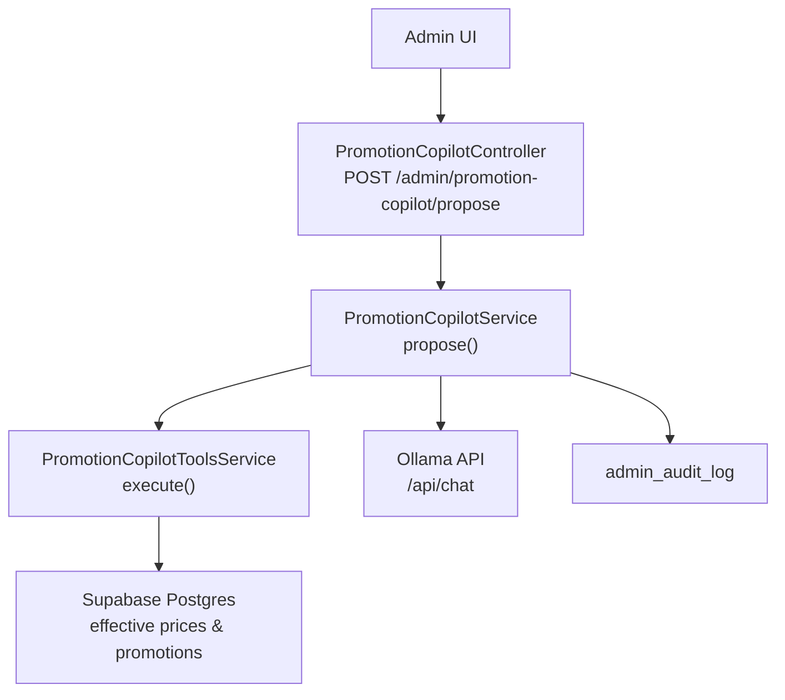
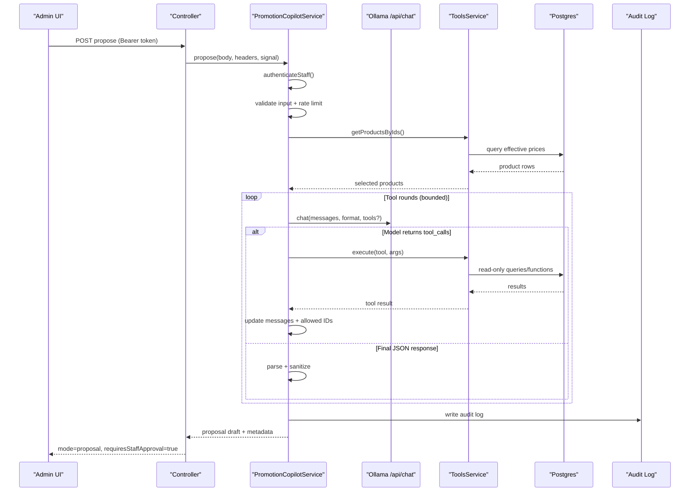
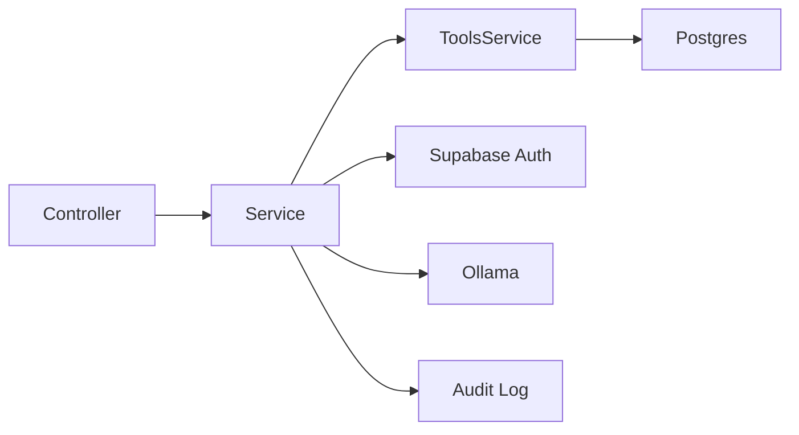
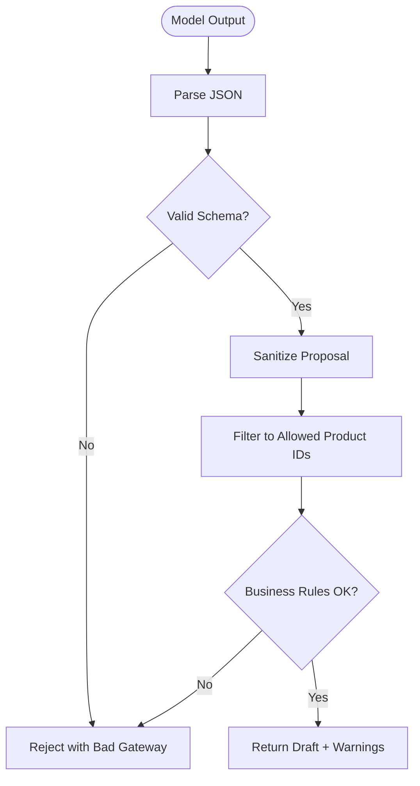

# AI Integration & Model Management

<cite>
**Referenced Files in This Document**
- [promotion-copilot.module.ts](file://apps/api/src/modules/promotion-copilot/promotion-copilot.module.ts)
- [promotion-copilot.controller.ts](file://apps/api/src/modules/promotion-copilot/promotion-copilot.controller.ts)
- [promotion-copilot.service.ts](file://apps/api/src/modules/promotion-copilot/promotion-copilot.service.ts)
- [promotion-copilot-tools.service.ts](file://apps/api/src/modules/promotion-copilot/promotion-copilot-tools.service.ts)
- [promotion-copilot.dto.ts](file://apps/api/src/modules/promotion-copilot/promotion-copilot.dto.ts)
- [promotion-copilot-deployment.md](file://docs/promotion-copilot-deployment.md)
</cite>

## Table of Contents
1. Introduction
2. Project Structure
3. Core Components
4. Architecture Overview
5. Detailed Component Analysis
6. Dependency Analysis
7. Performance Considerations
8. Troubleshooting Guide
9. Conclusion
10. Appendices

## Introduction
This document explains the AI integration layer for the Promotion Copilot system. It covers how the system configures and calls an Ollama-based model, how prompts are engineered to produce structured promotion drafts, how tool calls provide catalog and pricing context, and how responses are validated and sanitized before being returned to staff. It also documents error handling, rate limiting, timeouts, audit logging, and operational guidance for deployment and monitoring.

## Project Structure
The Promotion Copilot is implemented as a NestJS module with a controller, service, tools service, and shared DTOs. The controller exposes a single proposal endpoint that orchestrates authentication, request validation, model interaction, tool execution, response sanitization, and auditing.

**Diagram sources**
- [promotion-copilot.controller.ts:5-38](file://apps/api/src/modules/promotion-copilot/promotion-copilot.controller.ts#L5-L38)
- [promotion-copilot.service.ts:55-143](file://apps/api/src/modules/promotion-copilot/promotion-copilot.service.ts#L55-L143)
- [promotion-copilot-tools.service.ts:199-221](file://apps/api/src/modules/promotion-copilot/promotion-copilot-tools.service.ts#L199-L221)
- [promotion-copilot-deployment.md:72-88](file://docs/promotion-copilot-deployment.md#L72-L88)

**Section sources**
- [promotion-copilot.module.ts:1-11](file://apps/api/src/modules/promotion-copilot/promotion-copilot.module.ts#L1-L11)
- [promotion-copilot.controller.ts:1-40](file://apps/api/src/modules/promotion-copilot/promotion-copilot.controller.ts#L1-L40)
- [promotion-copilot.service.ts:1-467](file://apps/api/src/modules/promotion-copilot/promotion-copilot.service.ts#L1-L467)
- [promotion-copilot-tools.service.ts:1-430](file://apps/api/src/modules/promotion-copilot/promotion-copilot-tools.service.ts#L1-L430)
- [promotion-copilot.dto.ts:1-101](file://apps/api/src/modules/promotion-copilot/promotion-copilot.dto.ts#L1-L101)
- [promotion-copilot-deployment.md:1-128](file://docs/promotion-copilot-deployment.md#L1-L128)

## Core Components
- Controller: Exposes a read-only proposal endpoint with cancellation support and request ID propagation.
- Service: Authenticates staff via Supabase Auth, validates input, enforces rate limits, interacts with Ollama, executes tools, parses and sanitizes model output, and writes audit logs.
- Tools Service: Provides bounded, read-only functions for catalog search, product lookup, category search, promotion inspection, conflict detection, discount calculation, preview, and validation. All arguments and results are strictly validated.
- DTOs: Define schemas for requests, model responses, and promotion drafts; also define the JSON schema sent to the model to enforce structured output.

Key responsibilities:
- Authentication and authorization using Supabase user session and role checks.
- Rate limiting per staff member within a time window.
- Bounded multi-turn tool use with maximum rounds and call counts.
- Strict JSON schema enforcement for model responses.
- Sanitization to ensure only allowed products and safe values are included.
- Comprehensive audit logging of success/failure outcomes.

**Section sources**
- [promotion-copilot.controller.ts:5-38](file://apps/api/src/modules/promotion-copilot/promotion-copilot.controller.ts#L5-L38)
- [promotion-copilot.service.ts:55-143](file://apps/api/src/modules/promotion-copilot/promotion-copilot.service.ts#L55-L143)
- [promotion-copilot-tools.service.ts:90-191](file://apps/api/src/modules/promotion-copilot/promotion-copilot-tools.service.ts#L90-L191)
- [promotion-copilot.dto.ts:1-101](file://apps/api/src/modules/promotion-copilot/promotion-copilot.dto.ts#L1-L101)

## Architecture Overview
The copilot follows a secure, bounded, and auditable flow:

**Diagram sources**
- [promotion-copilot.controller.ts:14-38](file://apps/api/src/modules/promotion-copilot/promotion-copilot.controller.ts#L14-L38)
- [promotion-copilot.service.ts:55-143](file://apps/api/src/modules/promotion-copilot/promotion-copilot.service.ts#L55-L143)
- [promotion-copilot.service.ts:203-278](file://apps/api/src/modules/promotion-copilot/promotion-copilot.service.ts#L203-L278)
- [promotion-copilot-tools.service.ts:199-221](file://apps/api/src/modules/promotion-copilot/promotion-copilot-tools.service.ts#L199-L221)
- [promotion-copilot-tools.service.ts:240-390](file://apps/api/src/modules/promotion-copilot/promotion-copilot-tools.service.ts#L240-L390)
- [promotion-copilot-deployment.md:72-88](file://docs/promotion-copilot-deployment.md#L72-L88)

## Detailed Component Analysis

### Controller: Proposal Endpoint
- Accepts Authorization header and optional request ID.
- Supports client disconnect cancellation via AbortSignal.
- Delegates to the service and forwards structured results.

Operational notes:
- No write operations; proposals remain editable drafts.
- Request lifecycle is tied to HTTP request/response signals for clean cancellation.

**Section sources**
- [promotion-copilot.controller.ts:5-38](file://apps/api/src/modules/promotion-copilot/promotion-copilot.controller.ts#L5-L38)

### Service: Orchestration, Model Interaction, Validation, Auditing
Responsibilities:
- Staff authentication via Supabase Auth endpoint with bounded timeout.
- Input validation against request schema.
- Per-user rate limiting within a fixed window.
- Multi-turn model interaction with tool calling, bounded by configurable rounds and call count.
- Response parsing against a strict JSON schema provided to the model.
- Sanitization to restrict product IDs to approved sets and enforce business rules.
- Audit logging of success and failure events.

Model configuration:
- Base URL and model name are read from environment variables.
- Optional bearer key can be set for protected Ollama endpoints.
- JSON schema is enforced at the model level and again on the server side.

Prompt engineering:
- System prompt defines role, constraints, tool usage policy, language localization, and current time.
- User message includes the natural-language prompt and selected products.

Response parsing and sanitization:
- Parses JSON and validates against schema.
- Forces status to draft.
- Filters product IDs to those returned by approved tools or explicitly selected.
- Enforces percentage discount bounds and valid date windows.
- Adds warnings if the proposal is incomplete.

Error handling:
- Distinguishes between client aborts, timeouts, network errors, invalid model output, oversized responses, and unauthorized access.
- Returns appropriate HTTP status codes and safe messages.

Performance characteristics:
- Bounded tool rounds and calls prevent runaway loops.
- Timeouts protect both auth and inference steps.
- Response size cap prevents memory pressure.

**Section sources**
- [promotion-copilot.service.ts:55-143](file://apps/api/src/modules/promotion-copilot/promotion-copilot.service.ts#L55-L143)
- [promotion-copilot.service.ts:145-185](file://apps/api/src/modules/promotion-copilot/promotion-copilot.service.ts#L145-L185)
- [promotion-copilot.service.ts:187-201](file://apps/api/src/modules/promotion-copilot/promotion-copilot.service.ts#L187-L201)
- [promotion-copilot.service.ts:203-278](file://apps/api/src/modules/promotion-copilot/promotion-copilot.service.ts#L203-L278)
- [promotion-copilot.service.ts:280-342](file://apps/api/src/modules/promotion-copilot/promotion-copilot.service.ts#L280-L342)
- [promotion-copilot.service.ts:344-380](file://apps/api/src/modules/promotion-copilot/promotion-copilot.service.ts#L344-L380)
- [promotion-copilot.service.ts:422-437](file://apps/api/src/modules/promotion-copilot/promotion-copilot.service.ts#L422-L437)

### Tools Service: Read-Only Catalog and Pricing Functions
Available tools:
- searchProducts: Search active catalog with canonical effective pricing.
- getProduct: Retrieve one product by UUID with effective pricing.
- searchCategories: List categories represented by active products.
- getPromotion: Read existing promotion and assigned product IDs.
- detectPromotionConflicts: Find overlapping enabled promotions for proposed dates/products.
- calculateDiscount: Compute effective price using canonical function.
- previewPromotion: Preview proposed prices and conflicts without saving.
- validatePromotion: Validate a complete draft against rules and catalog eligibility.

Implementation highlights:
- All tool parameters are strictly validated with Zod schemas.
- Database interactions use read-only queries and canonical functions/views.
- Results are normalized and capped to prevent abuse.
- Errors return structured ok/error payloads rather than throwing, enabling graceful fallback in the service.

Data flows:
- Product lookups use effective price views/functions to reflect current promotions.
- Conflict detection uses time overlap logic against enabled promotions.
- Discount calculations delegate to database functions for consistency.

**Section sources**
- [promotion-copilot-tools.service.ts:90-191](file://apps/api/src/modules/promotion-copilot/promotion-copilot-tools.service.ts#L90-L191)
- [promotion-copilot-tools.service.ts:199-221](file://apps/api/src/modules/promotion-copilot/promotion-copilot-tools.service.ts#L199-L221)
- [promotion-copilot-tools.service.ts:240-390](file://apps/api/src/modules/promotion-copilot/promotion-copilot-tools.service.ts#L240-L390)

### DTOs: Schemas and Model Contract
- Request schema enforces prompt length, locale, and candidate product list.
- Model response schema ensures the model returns a message, proposal, warnings, and questions.
- Draft schema enforces discount types, value ranges, datetime validity, and product list constraints.
- A JSON schema object is passed to the model to constrain its output structure.

Validation strategy:
- Zod schemas validate both incoming requests and model outputs.
- Custom refinements enforce business rules such as percentage caps and date ordering.

**Section sources**
- [promotion-copilot.dto.ts:1-101](file://apps/api/src/modules/promotion-copilot/promotion-copilot.dto.ts#L1-L101)

## Dependency Analysis
Internal dependencies:
- Controller depends on the service.
- Service depends on Prisma for profile lookups and audit logging, and on the tools service for catalog/pricing data.
- Tools service depends on Prisma for read-only queries and canonical functions.
- DTOs are shared across controller, service, and tools for consistent validation.

External dependencies:
- Supabase Auth for staff session verification.
- Ollama for model inference over a private network.
- Postgres for catalog, promotions, and audit storage.

Coupling and cohesion:
- Tight coupling between service and tools for orchestration; tools encapsulate all data access.
- Cohesion is high within each component: controller handles HTTP, service handles workflow, tools handle data.

Potential risks:
- Over-reliance on external services (Supabase Auth, Ollama) introduces availability risk; mitigated by timeouts, bounded retries, and clear error messaging.
- Tool misuse is prevented by strict schemas and allowed product ID tracking.

**Diagram sources**
- [promotion-copilot.controller.ts:5-38](file://apps/api/src/modules/promotion-copilot/promotion-copilot.controller.ts#L5-L38)
- [promotion-copilot.service.ts:55-143](file://apps/api/src/modules/promotion-copilot/promotion-copilot.service.ts#L55-L143)
- [promotion-copilot-tools.service.ts:199-221](file://apps/api/src/modules/promotion-copilot/promotion-copilot-tools.service.ts#L199-L221)

**Section sources**
- [promotion-copilot.module.ts:1-11](file://apps/api/src/modules/promotion-copilot/promotion-copilot.module.ts#L1-L11)
- [promotion-copilot.service.ts:145-185](file://apps/api/src/modules/promotion-copilot/promotion-copilot.service.ts#L145-L185)
- [promotion-copilot-tools.service.ts:240-390](file://apps/api/src/modules/promotion-copilot/promotion-copilot-tools.service.ts#L240-L390)

## Performance Considerations
- Bounded tool rounds and calls reduce latency and resource usage.
- Timeouts protect against slow or unresponsive services.
- Response size cap prevents large payloads from impacting memory.
- Read-only tools leverage canonical functions/views for efficient pricing and conflict checks.
- Rate limiting protects backend resources and prevents abuse.

[No sources needed since this section provides general guidance]

## Troubleshooting Guide
Common issues and resolutions:
- Missing configuration: Ensure SUPABASE_URL, SUPABASE_ANON_KEY, OLLAMA_BASE_URL, and OLLAMA_MODEL are set.
- Unavailable Ollama: Verify the private service is running and reachable; confirm model appears in /api/tags.
- Generation timeout: Increase service resources or adjust PROMOTION_COPILOT_OLLAMA_TIMEOUT_MS cautiously.
- Invalid model output: Check that the model adheres to the required JSON schema; the API will reject malformed responses.
- Too many requests: Wait before retrying; per-user rate limiting is enforced.

Operational checks:
- Confirm admin users have Active status and roles admin or manager.
- Validate that effective pricing functions and views exist and return expected results.
- Inspect structured application logs for event names, durations, and error classes.

**Section sources**
- [promotion-copilot-deployment.md:22-60](file://docs/promotion-copilot-deployment.md#L22-L60)
- [promotion-copilot.service.ts:145-185](file://apps/api/src/modules/promotion-copilot/promotion-copilot.service.ts#L145-L185)
- [promotion-copilot.service.ts:280-342](file://apps/api/src/modules/promotion-copilot/promotion-copilot.service.ts#L280-L342)

## Conclusion
The Promotion Copilot integrates an Ollama-based model through a secure, bounded, and auditable pipeline. It generates editable promotion drafts using structured prompts, tool-assisted catalog and pricing context, and strict validation. Error handling, rate limiting, timeouts, and audit logging ensure reliability and traceability. Staff retain full control by approving and saving proposals through the existing promotion workflow.

[No sources needed since this section summarizes without analyzing specific files]

## Appendices

### Environment Variables and Configuration
- SUPABASE_URL, SUPABASE_ANON_KEY: Used to verify staff sessions.
- OLLAMA_BASE_URL, OLLAMA_MODEL: Target inference service and model name.
- OLLAMA_API_KEY: Optional bearer token for protected Ollama.
- PROMOTION_COPILOT_AUTH_TIMEOUT_MS, PROMOTION_COPILOT_OLLAMA_TIMEOUT_MS: Bounded timeouts.
- PROMOTION_COPILOT_MAX_TOOL_ROUNDS: Limits multi-turn tool use.

**Section sources**
- [promotion-copilot-deployment.md:22-37](file://docs/promotion-copilot-deployment.md#L22-L37)
- [promotion-copilot.service.ts:203-213](file://apps/api/src/modules/promotion-copilot/promotion-copilot.service.ts#L203-L213)
- [promotion-copilot.service.ts:280-307](file://apps/api/src/modules/promotion-copilot/promotion-copilot.service.ts#L280-L307)

### API Contract Example
- Endpoint: POST /admin/promotion-copilot/propose
- Authorization: Bearer <Supabase access token>
- Request body includes prompt, locale, and candidateProductIds
- Response includes mode, message, proposal, warnings, questions, and flags indicating staff approval is required

**Section sources**
- [promotion-copilot-deployment.md:72-88](file://docs/promotion-copilot-deployment.md#L72-L88)

### Model Initialization and Prompt Strategy
- Model initialization occurs via environment-driven base URL and model name.
- System prompt defines behavior, tool usage, constraints, localization, and current time.
- User message carries the natural-language prompt and selected products.
- JSON schema is enforced at the model and server layers.

**Section sources**
- [promotion-copilot.service.ts:203-239](file://apps/api/src/modules/promotion-copilot/promotion-copilot.service.ts#L203-L239)
- [promotion-copilot.dto.ts:57-93](file://apps/api/src/modules/promotion-copilot/promotion-copilot.dto.ts#L57-L93)

### Result Validation and Sanitization Flow

**Diagram sources**
- [promotion-copilot.service.ts:329-380](file://apps/api/src/modules/promotion-copilot/promotion-copilot.service.ts#L329-L380)

### Error Handling and Fallbacks
- Authentication failures: Unauthorized or Forbidden based on session and role checks.
- Service unavailability: Clear messages when Supabase or Ollama are unreachable or misconfigured.
- Timeouts: Distinct messages for auth and inference timeouts.
- Model errors: Rejection for empty, oversized, or invalid responses.
- Tool errors: Graceful handling returning structured errors without crashing the flow.

**Section sources**
- [promotion-copilot.service.ts:145-185](file://apps/api/src/modules/promotion-copilot/promotion-copilot.service.ts#L145-L185)
- [promotion-copilot.service.ts:280-342](file://apps/api/src/modules/promotion-copilot/promotion-copilot.service.ts#L280-L342)
- [promotion-copilot-tools.service.ts:199-221](file://apps/api/src/modules/promotion-copilot/promotion-copilot-tools.service.ts#L199-L221)

### Monitoring and Observability
- Structured logs include event names, request IDs, actor details, durations, tool usage, and error classes.
- Audit log entries record success/failure outcomes without storing prompts or generated content.
- Operational dashboards can monitor these logs to assess quality and performance.

**Section sources**
- [promotion-copilot.service.ts:85-101](file://apps/api/src/modules/promotion-copilot/promotion-copilot.service.ts#L85-L101)
- [promotion-copilot.service.ts:422-437](file://apps/api/src/modules/promotion-copilot/promotion-copilot.service.ts#L422-L437)
- [promotion-copilot-deployment.md:108-128](file://docs/promotion-copilot-deployment.md#L108-L128)