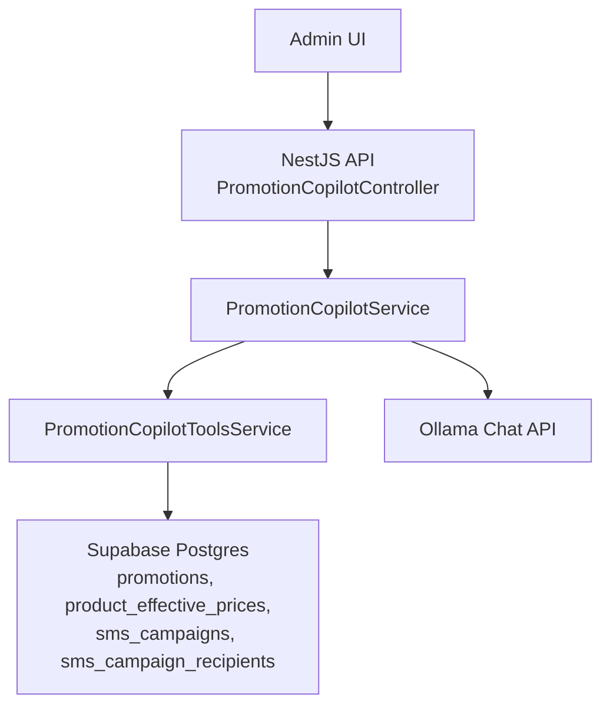
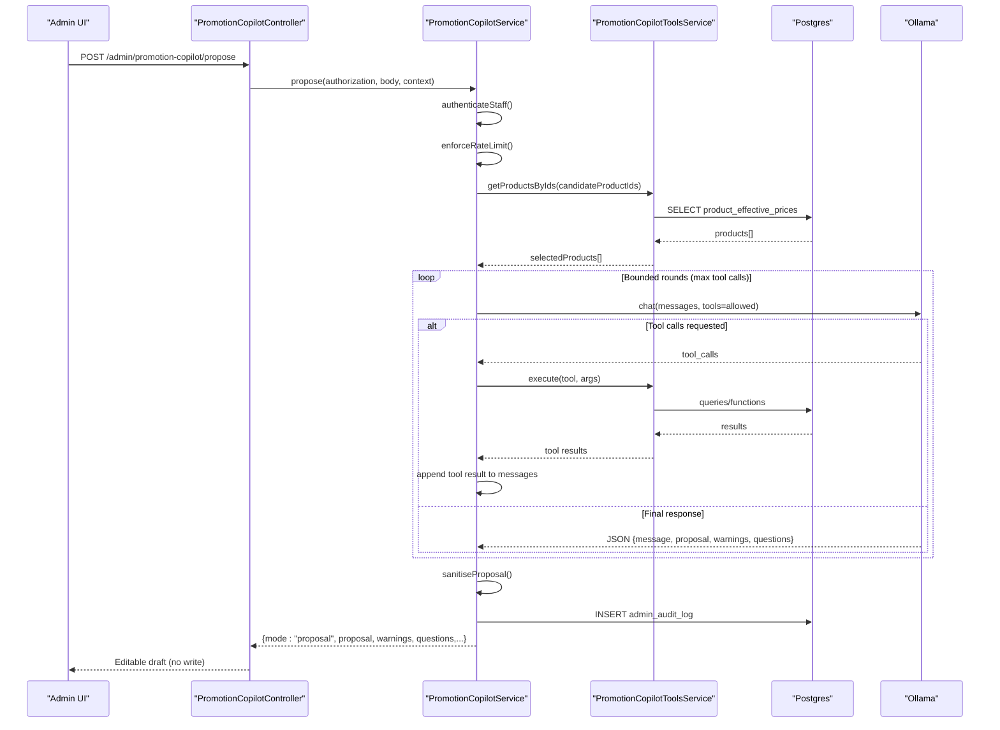
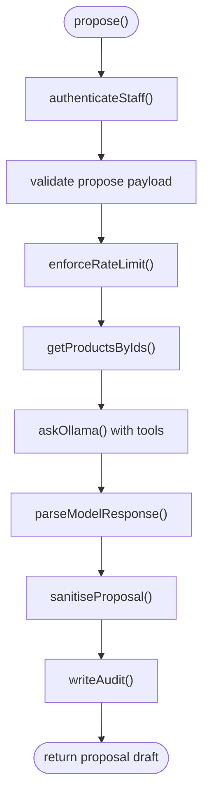
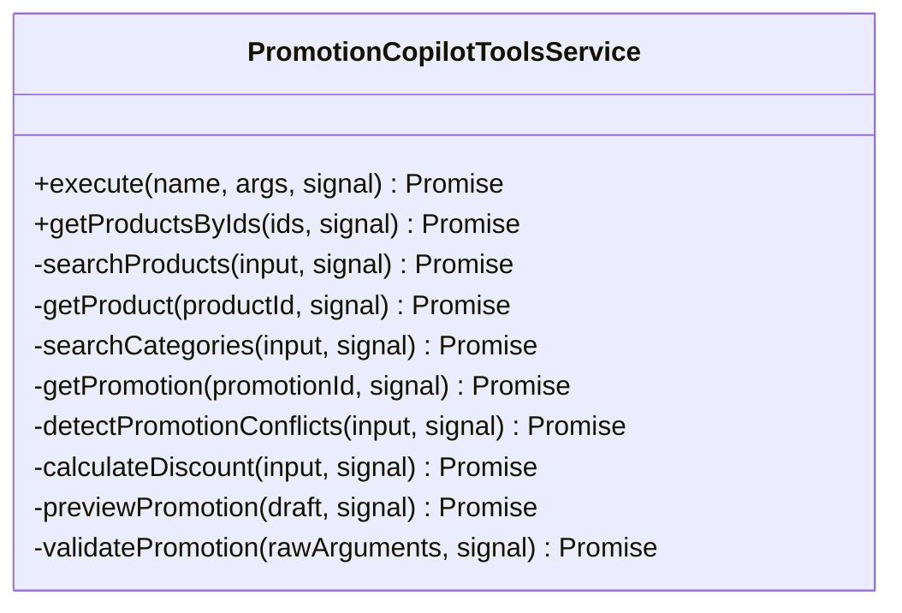
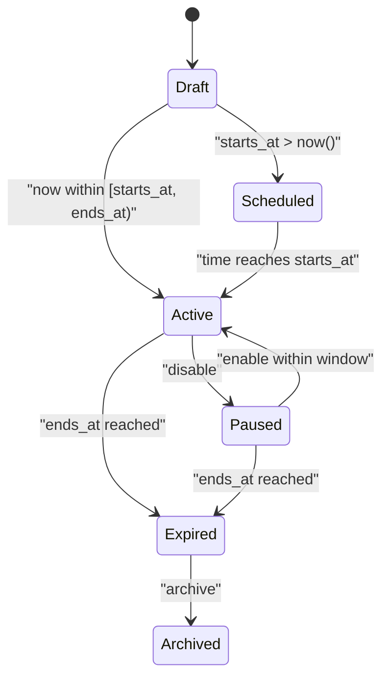
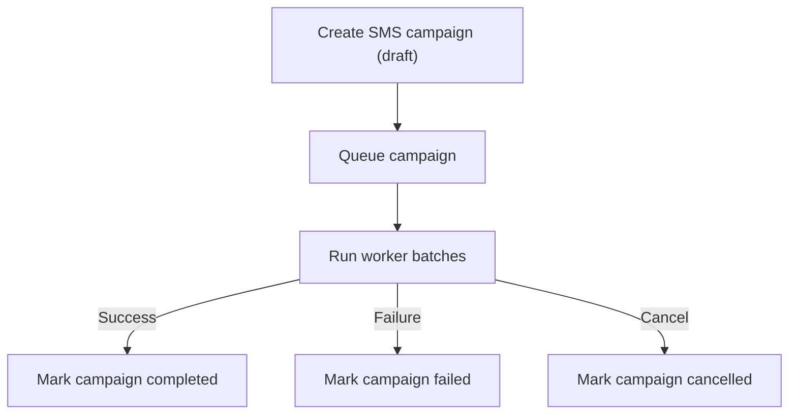
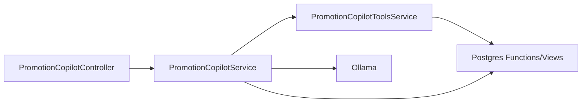

# Campaign Creation & Management Workflows

<cite>
**Referenced Files in This Document**
- [promotion-copilot.controller.ts](file://apps/api/src/modules/promotion-copilot/promotion-copilot.controller.ts)
- [promotion-copilot.service.ts](file://apps/api/src/modules/promotion-copilot/promotion-copilot.service.ts)
- [promotion-copilot.dto.ts](file://apps/api/src/modules/promotion-copilot/promotion-copilot.dto.ts)
- [promotion-copilot-tools.service.ts](file://apps/api/src/modules/promotion-copilot/promotion-copilot-tools.service.ts)
- [20260713120000_promotions_domain.sql](file://supabase/migrations/20260713120000_promotions_domain.sql)
- [20260716110000_promotions_lifecycle_and_catalog.sql](file://supabase/migrations/20260716110000_promotions_lifecycle_and_catalog.sql)
- [20260728120000_sms_marketing.sql](file://supabase/migrations/20260728120000_sms_marketing.sql)
</cite>

## Table of Contents
1. Introduction
2. Project Structure
3. Core Components
4. Architecture Overview
5. Detailed Component Analysis
6. Dependency Analysis
7. Performance Considerations
8. Troubleshooting Guide
9. Conclusion

## Introduction
This document explains the end-to-end campaign creation and management workflow for the Promotion Copilot. It covers how staff propose promotions, how the system generates editable drafts with automated content and pricing guidance, how product selection and conflict detection work, and how campaigns move through states from draft to scheduled or active. It also documents SMS marketing campaigns, including recipient targeting, batching, and auditability. Where applicable, it maps workflows to API endpoints, service logic, database functions, and schema constraints.

## Project Structure
The Promotion Copilot is implemented as a NestJS module exposing an admin endpoint that orchestrates model-assisted proposal generation and tool-based catalog/pricing checks. The backend integrates with Supabase Postgres for promotion lifecycle, effective pricing, and SMS marketing data.

**Diagram sources**
- [promotion-copilot.controller.ts:5-39](file://apps/api/src/modules/promotion-copilot/promotion-copilot.controller.ts#L5-L39)
- [promotion-copilot.service.ts:55-143](file://apps/api/src/modules/promotion-copilot/promotion-copilot.service.ts#L55-L143)
- [promotion-copilot-tools.service.ts:199-221](file://apps/api/src/modules/promotion-copilot/promotion-copilot-tools.service.ts#L199-L221)
- [20260716110000_promotions_lifecycle_and_catalog.sql:187-216](file://supabase/migrations/20260716110000_promotions_lifecycle_and_catalog.sql#L187-L216)
- [20260728120000_sms_marketing.sql:51-74](file://supabase/migrations/20260728120000_sms_marketing.sql#L51-L74)

**Section sources**
- [promotion-copilot.controller.ts:5-39](file://apps/api/src/modules/promotion-copilot/promotion-copilot.controller.ts#L5-L39)
- [promotion-copilot.service.ts:55-143](file://apps/api/src/modules/promotion-copilot/promotion-copilot.service.ts#L55-L143)

## Core Components
- Promotion Copilot Controller: Exposes a single read-only proposal endpoint that returns an editable draft without persisting changes.
- Promotion Copilot Service: Authenticates staff, validates input, enforces rate limits, calls Ollama with tools enabled, sanitizes proposals, and writes audit logs.
- Promotion Copilot Tools Service: Provides function tools for catalog search, category lookup, promotion reads, conflict detection, discount calculation, preview, and validation. All operations are read-only or simulation; no direct promotion saves.
- Database Schema and Functions: Define promotion tables, lifecycle status transitions, effective pricing view, and safe mutation functions for saving and status updates. Also include SMS marketing tables and RPC for target selection.

Key responsibilities:
- Automated content generation: Model produces message, warnings, questions, and a structured draft proposal constrained by schemas.
- Product selection algorithms: Tools query canonical effective prices and categories; allowed product IDs are restricted to those returned by approved tools.
- Pricing optimization: Discount calculations use a canonical SQL function to ensure consistent pricing across previews and validations.
- Workflow states: Promotions support draft, scheduled, active, paused, expired, archived with server-side enforcement.
- Collaboration and approval: Proposals require staff review before saving via existing promotion workflow; audit logs capture actor and outcome.

**Section sources**
- [promotion-copilot.controller.ts:9-39](file://apps/api/src/modules/promotion-copilot/promotion-copilot.controller.ts#L9-L39)
- [promotion-copilot.service.ts:55-143](file://apps/api/src/modules/promotion-copilot/promotion-copilot.service.ts#L55-L143)
- [promotion-copilot-tools.service.ts:90-191](file://apps/api/src/modules/promotion-copilot/promotion-copilot-tools.service.ts#L90-L191)
- [20260713120000_promotions_domain.sql:4-18](file://supabase/migrations/20260713120000_promotions_domain.sql#L4-L18)
- [20260716110000_promotions_lifecycle_and_catalog.sql:5-25](file://supabase/migrations/20260716110000_promotions_lifecycle_and_catalog.sql#L5-L25)

## Architecture Overview
The Proposal flow uses a bounded multi-turn interaction with the language model, gated by strict tool usage and response schemas.

**Diagram sources**
- [promotion-copilot.controller.ts:14-39](file://apps/api/src/modules/promotion-copilot/promotion-copilot.controller.ts#L14-L39)
- [promotion-copilot.service.ts:55-143](file://apps/api/src/modules/promotion-copilot/promotion-copilot.service.ts#L55-L143)
- [promotion-copilot.service.ts:203-278](file://apps/api/src/modules/promotion-copilot/promotion-copilot.service.ts#L203-L278)
- [promotion-copilot-tools.service.ts:199-221](file://apps/api/src/modules/promotion-copilot/promotion-copilot-tools.service.ts#L199-L221)
- [20260716110000_promotions_lifecycle_and_catalog.sql:187-216](file://supabase/migrations/20260716110000_promotions_lifecycle_and_catalog.sql#L187-L216)

## Detailed Component Analysis

### Promotion Copilot Controller
- Endpoint: POST /admin/promotion-copilot/propose
- Purpose: Generate an editable promotion proposal only; no write capability. Staff must review and save via the existing promotion workflow.
- Behavior:
  - Captures cancellation signals to abort long-running requests on client disconnect.
  - Delegates to PromotionCopilotService.propose with authorization, request body, and context.

**Section sources**
- [promotion-copilot.controller.ts:5-39](file://apps/api/src/modules/promotion-copilot/promotion-copilot.controller.ts#L5-L39)

### Promotion Copilot Service
- Authentication: Validates staff session via Supabase Auth and ensures role is admin or manager with Active status.
- Input validation: Enforces Zod schema for propose payload (prompt, locale, candidateProductIds).
- Rate limiting: Per-user sliding window prevents abuse.
- Model orchestration:
  - Builds system prompt enforcing rules: draft-only, no DB writes, valid discount ranges, time windows, and tool usage.
  - Calls Ollama with optional tools enabled; supports bounded rounds and max tool calls.
  - Parses and validates model output against a strict JSON schema.
- Sanitization: Filters product IDs to those returned by approved tools, enforces status=draft, and validates discount/window constraints.
- Audit trail: Writes immutable audit log entries for success/failure with actor role and metrics.

**Diagram sources**
- [promotion-copilot.service.ts:55-143](file://apps/api/src/modules/promotion-copilot/promotion-copilot.service.ts#L55-L143)
- [promotion-copilot.service.ts:203-278](file://apps/api/src/modules/promotion-copilot/promotion-copilot.service.ts#L203-L278)
- [promotion-copilot.service.ts:329-380](file://apps/api/src/modules/promotion-copilot/promotion-copilot.service.ts#L329-L380)
- [promotion-copilot.service.ts:422-437](file://apps/api/src/modules/promotion-copilot/promotion-copilot.service.ts#L422-L437)

**Section sources**
- [promotion-copilot.service.ts:55-143](file://apps/api/src/modules/promotion-copilot/promotion-copilot.service.ts#L55-L143)
- [promotion-copilot.service.ts:145-201](file://apps/api/src/modules/promotion-copilot/promotion-copilot.service.ts#L145-L201)
- [promotion-copilot.service.ts:203-278](file://apps/api/src/modules/promotion-copilot/promotion-copilot.service.ts#L203-L278)
- [promotion-copilot.service.ts:329-380](file://apps/api/src/modules/promotion-copilot/promotion-copilot.service.ts#L329-L380)
- [promotion-copilot.service.ts:422-437](file://apps/api/src/modules/promotion-copilot/promotion-copilot.service.ts#L422-L437)

### Promotion Copilot Tools Service
- Catalog and pricing tools:
  - searchProducts: Query canonical effective prices and active promotion context.
  - getProduct: Retrieve one product’s effective price by UUID.
  - searchCategories: Discover categories represented by active catalog products.
  - getPromotion: Read existing promotion metadata and assigned product IDs.
  - detectPromotionConflicts: Find overlapping enabled promotions within proposed windows.
  - calculateDiscount: Compute effective price using canonical SQL function.
  - previewPromotion: Preview proposed prices and conflicts without saving.
  - validatePromotion: Validate a complete draft against rules and catalog eligibility without saving.
- Data access: Uses Prisma raw queries to call Postgres functions and views such as product_effective_prices and promotion_effective_price.
- Safety: All tool executions are read-only or simulation; errors return structured failures rather than throwing.

**Diagram sources**
- [promotion-copilot-tools.service.ts:199-221](file://apps/api/src/modules/promotion-copilot/promotion-copilot-tools.service.ts#L199-L221)
- [promotion-copilot-tools.service.ts:240-390](file://apps/api/src/modules/promotion-copilot/promotion-copilot-tools.service.ts#L240-L390)

**Section sources**
- [promotion-copilot-tools.service.ts:90-191](file://apps/api/src/modules/promotion-copilot/promotion-copilot-tools.service.ts#L90-L191)
- [promotion-copilot-tools.service.ts:240-390](file://apps/api/src/modules/promotion-copilot/promotion-copilot-tools.service.ts#L240-L390)

### DTOs and Validation
- proposePromotionSchema: Validates prompt length, locale, and candidate product list size.
- modelResponseSchema: Enforces structure of model output including message, proposal, warnings, and questions.
- promotionDraftSchema: Defines required fields for a complete promotion draft with business rule refinements (percentage cap, date ordering).
- MODEL_RESPONSE_JSON_SCHEMA: Declares the expected JSON schema sent to the model to constrain responses.

**Section sources**
- [promotion-copilot.dto.ts:1-101](file://apps/api/src/modules/promotion-copilot/promotion-copilot.dto.ts#L1-L101)

### Promotion Lifecycle and Catalog Integration
- Tables:
  - promotions: Stores name, description, discount type/value, start/end times, enable flag, creator, timestamps.
  - promotion_products: Many-to-many mapping between promotions and products.
- Status lifecycle:
  - Supports draft, scheduled, active, paused, expired, archived with constraints and indexes.
  - Server-side functions compute derived status based on time windows and enable flags.
- Effective pricing:
  - product_effective_prices view computes current effective price considering active promotions and their time windows.
  - promotion_effective_price function calculates discounted price consistently across services.
- Safe mutations:
  - admin_save_promotion: Transactional create/update with validation and assignment enforcement.
  - admin_set_promotion_status: Securely transitions status while preserving scheduling invariants.
  - Bulk enable/disable helpers.

**Diagram sources**
- [20260716110000_promotions_lifecycle_and_catalog.sql:5-25](file://supabase/migrations/20260716110000_promotions_lifecycle_and_catalog.sql#L5-L25)
- [20260716110000_promotions_lifecycle_and_catalog.sql:116-181](file://supabase/migrations/20260716110000_promotions_lifecycle_and_catalog.sql#L116-L181)
- [20260713120000_promotions_domain.sql:4-18](file://supabase/migrations/20260713120000_promotions_domain.sql#L4-L18)

**Section sources**
- [20260713120000_promotions_domain.sql:4-18](file://supabase/migrations/20260713120000_promotions_domain.sql#L4-L18)
- [20260716110000_promotions_lifecycle_and_catalog.sql:5-25](file://supabase/migrations/20260716110000_promotions_lifecycle_and_catalog.sql#L5-L25)
- [20260716110000_promotions_lifecycle_and_catalog.sql:116-181](file://supabase/migrations/20260716110000_promotions_lifecycle_and_catalog.sql#L116-L181)
- [20260716110000_promotions_lifecycle_and_catalog.sql:187-216](file://supabase/migrations/20260716110000_promotions_lifecycle_and_catalog.sql#L187-L216)

### SMS Marketing Campaigns
- Tables:
  - sms_campaigns: Tracks campaign metadata, batch size, counters, and lifecycle (draft → queued → running → completed | failed | cancelled).
  - sms_campaign_recipients: One row per (campaign, user), with per-recipient status and batch indexing.
  - sms_audit_log: Append-only immutable log for compliance and debugging.
- Targeting:
  - get_marketing_targets RPC returns eligible customers with filters for consent, account status, and search/sort options.
- Worker execution:
  - Recipients are processed in batches with rate limiting; statuses update atomically with timestamps and error messages.

**Diagram sources**
- [20260728120000_sms_marketing.sql:51-74](file://supabase/migrations/20260728120000_sms_marketing.sql#L51-L74)
- [20260728120000_sms_marketing.sql:87-104](file://supabase/migrations/20260728120000_sms_marketing.sql#L87-L104)
- [20260728120000_sms_marketing.sql:120-137](file://supabase/migrations/20260728120000_sms_marketing.sql#L120-L137)
- [20260728120000_sms_marketing.sql:160-252](file://supabase/migrations/20260728120000_sms_marketing.sql#L160-L252)

**Section sources**
- [20260728120000_sms_marketing.sql:51-74](file://supabase/migrations/20260728120000_sms_marketing.sql#L51-L74)
- [20260728120000_sms_marketing.sql:87-104](file://supabase/migrations/20260728120000_sms_marketing.sql#L87-L104)
- [20260728120000_sms_marketing.sql:120-137](file://supabase/migrations/20260728120000_sms_marketing.sql#L120-L137)
- [20260728120000_sms_marketing.sql:160-252](file://supabase/migrations/20260728120000_sms_marketing.sql#L160-L252)

## Dependency Analysis
- Controller depends on Service for all proposal logic.
- Service depends on:
  - Tools for catalog/pricing reads and simulations.
  - Ollama for model-assisted drafting with constrained tools.
  - Prisma for authentication lookups and audit logging.
- Tools depend on Postgres functions/views for canonical pricing and conflict detection.
- Database layer enforces business invariants via constraints, functions, and RLS policies.

**Diagram sources**
- [promotion-copilot.controller.ts:5-39](file://apps/api/src/modules/promotion-copilot/promotion-copilot.controller.ts#L5-L39)
- [promotion-copilot.service.ts:55-143](file://apps/api/src/modules/promotion-copilot/promotion-copilot.service.ts#L55-L143)
- [promotion-copilot-tools.service.ts:199-221](file://apps/api/src/modules/promotion-copilot/promotion-copilot-tools.service.ts#L199-L221)
- [20260716110000_promotions_lifecycle_and_catalog.sql:187-216](file://supabase/migrations/20260716110000_promotions_lifecycle_and_catalog.sql#L187-L216)

**Section sources**
- [promotion-copilot.controller.ts:5-39](file://apps/api/src/modules/promotion-copilot/promotion-copilot.controller.ts#L5-L39)
- [promotion-copilot.service.ts:55-143](file://apps/api/src/modules/promotion-copilot/promotion-copilot.service.ts#L55-L143)
- [promotion-copilot-tools.service.ts:199-221](file://apps/api/src/modules/promotion-copilot/promotion-copilot-tools.service.ts#L199-L221)

## Performance Considerations
- Request cancellation: Controllers attach AbortSignal handling to avoid wasted processing when clients disconnect.
- Rate limiting: In-memory per-user sliding window reduces load spikes.
- Bounded interactions: Max tool rounds and calls prevent runaway loops with the model.
- Response size guard: Caps model response bytes to protect memory and parsing overhead.
- Efficient queries: Tools use targeted raw queries and existing functions/views for effective pricing and conflict detection.
- Timeouts: Configurable timeouts for auth and model calls reduce hanging requests.

[No sources needed since this section provides general guidance]

## Troubleshooting Guide
Common issues and where they surface:
- Invalid or missing staff session: UnauthorizedException during authentication.
- Unconfigured environment: ServiceUnavailableException if Supabase URL/key or Ollama settings are missing.
- Too many requests: HTTP 429 when exceeding per-user rate limit.
- Model errors: BadGatewayException for empty, oversized, invalid, or non-OK responses from Ollama.
- Tool argument validation: Structured failure with details for invalid tool inputs.
- Audit write failures: ServiceUnavailableException if audit logging fails; logged with error details.

Operational tips:
- Inspect admin_audit_log entries for detailed outcomes and durations.
- Check tool execution logs for tool-specific failures and retry conditions.
- Validate environment variables for Supabase and Ollama endpoints and keys.
- Use preview and validate tools to catch issues before saving promotions.

**Section sources**
- [promotion-copilot.service.ts:145-185](file://apps/api/src/modules/promotion-copilot/promotion-copilot.service.ts#L145-L185)
- [promotion-copilot.service.ts:187-201](file://apps/api/src/modules/promotion-copilot/promotion-copilot.service.ts#L187-L201)
- [promotion-copilot.service.ts:280-327](file://apps/api/src/modules/promotion-copilot/promotion-copilot.service.ts#L280-L327)
- [promotion-copilot-tools.service.ts:199-221](file://apps/api/src/modules/promotion-copilot/promotion-copilot-tools.service.ts#L199-L221)
- [promotion-copilot.service.ts:422-437](file://apps/api/src/modules/promotion-copilot/promotion-copilot.service.ts#L422-L437)

## Conclusion
The Promotion Copilot streamlines campaign ideation to deployment-ready drafts by combining model-assisted generation with strict tool-based catalog and pricing checks. Staff retain control through a read-only proposal workflow, ensuring safety and compliance. The database layer enforces robust lifecycle state management, canonical pricing, and secure mutations. SMS marketing campaigns complement promotions with compliant targeting, batching, and full auditability. Together, these components provide a reliable foundation for creating, validating, and managing promotional campaigns at scale.

[No sources needed since this section summarizes without analyzing specific files]