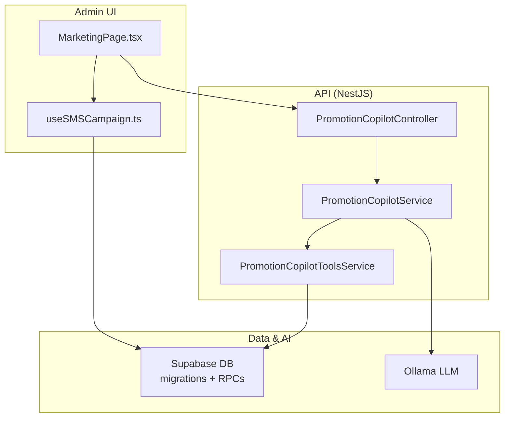
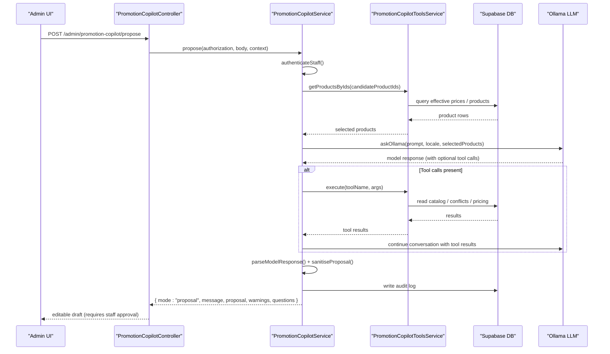
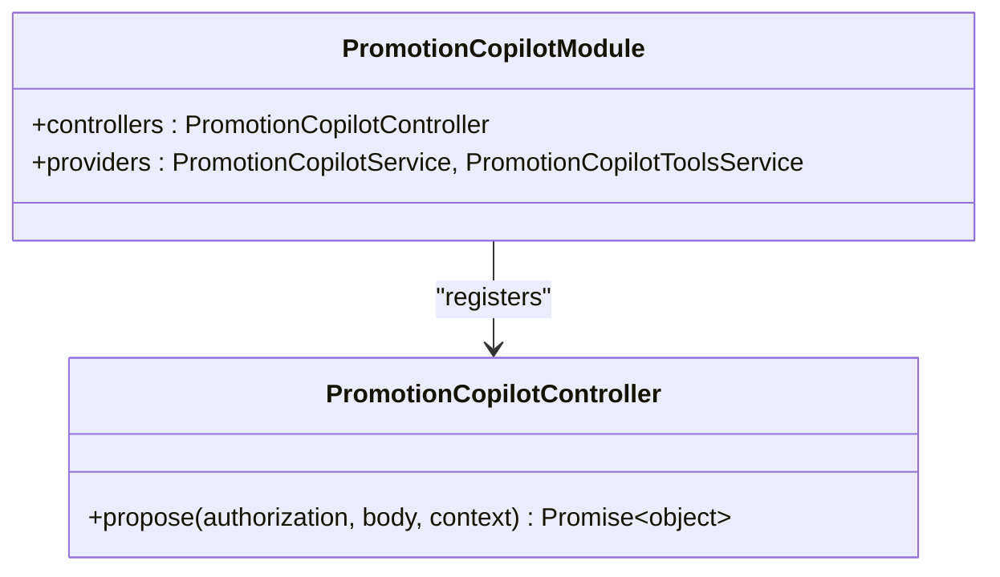
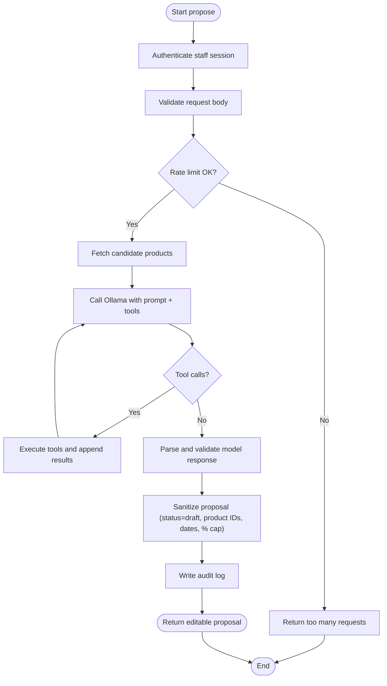
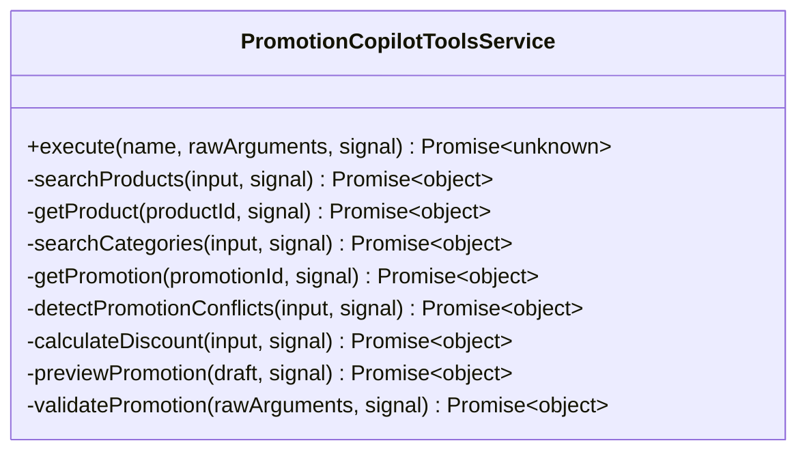
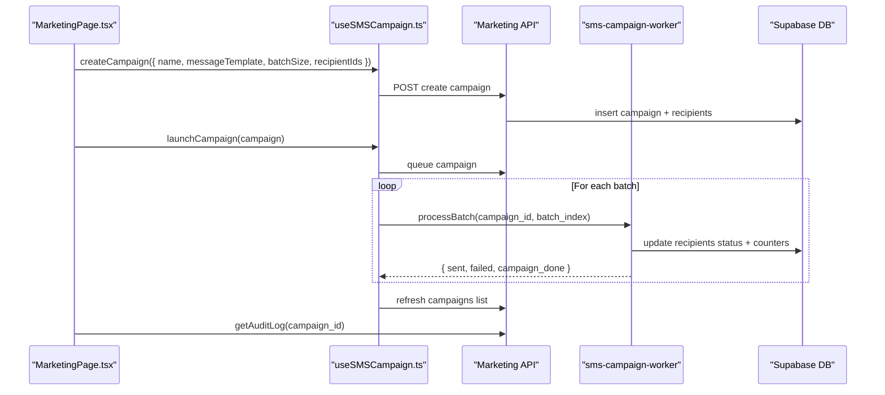
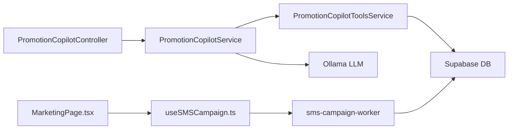

# Promotion Copilot & Marketing Tools

<cite>
**Referenced Files in This Document**
- [promotion-copilot.module.ts](file://apps/api/src/modules/promotion-copilot/promotion-copilot.module.ts)
- [promotion-copilot.controller.ts](file://apps/api/src/modules/promotion-copilot/promotion-copilot.controller.ts)
- [promotion-copilot.service.ts](file://apps/api/src/modules/promotion-copilot/promotion-copilot.service.ts)
- [promotion-copilot-tools.service.ts](file://apps/api/src/modules/promotion-copilot/promotion-copilot-tools.service.ts)
- [promotion-copilot.dto.ts](file://apps/api/src/modules/promotion-copilot/promotion-copilot.dto.ts)
- [MarketingPage.tsx](file://apps/admin/src/pages/MarketingPage.tsx)
- [useSMSCampaign.ts](file://apps/admin/src/hooks/useSMSCampaign.ts)
- [20260728120000_sms_marketing.sql](file://supabase/migrations/20260728120000_sms_marketing.sql)
- [sms-campaign-worker/index.ts](file://supabase/functions/sms-campaign-worker/index.ts)
</cite>

## Table of Contents
1. Introduction
2. Project Structure
3. Core Components
4. Architecture Overview
5. Detailed Component Analysis
6. Dependency Analysis
7. Performance Considerations
8. Troubleshooting Guide
9. Conclusion
10. Appendices

## Introduction
This document explains the AI-powered promotion copilot and marketing tools that help staff create, optimize, and manage promotional campaigns. It covers:
- Campaign creation workflows for promotions and SMS marketing
- Product selection and integration with the product catalog
- Promotional pricing calculations and conflict detection
- AI capabilities for generating editable promotion drafts, optimizing discounts, and providing recommendations
- Analytics tracking and performance metrics via audit logs and campaign progress
- Examples of creating promotional campaigns, integrating with the product catalog, and measuring effectiveness
- AI model integration, prompt engineering, and result validation processes

## Project Structure
The promotion copilot is implemented as a NestJS module exposing an admin endpoint that generates editable promotion proposals. The marketing tool provides an admin UI to target customers and run SMS campaigns through a Supabase Edge Function worker.

**Diagram sources**
- [promotion-copilot.controller.ts:5-39](file://apps/api/src/modules/promotion-copilot/promotion-copilot.controller.ts#L5-L39)
- [promotion-copilot.service.ts:55-143](file://apps/api/src/modules/promotion-copilot/promotion-copilot.service.ts#L55-L143)
- [promotion-copilot-tools.service.ts:199-221](file://apps/api/src/modules/promotion-copilot/promotion-copilot-tools.service.ts#L199-L221)
- [MarketingPage.tsx:321-377](file://apps/admin/src/pages/MarketingPage.tsx#L321-L377)
- [useSMSCampaign.ts:71-119](file://apps/admin/src/hooks/useSMSCampaign.ts#L71-L119)
- [20260728120000_sms_marketing.sql:160-259](file://supabase/migrations/20260728120000_sms_marketing.sql#L160-L259)

**Section sources**
- [promotion-copilot.module.ts:1-11](file://apps/api/src/modules/promotion-copilot/promotion-copilot.module.ts#L1-L11)
- [promotion-copilot.controller.ts:5-39](file://apps/api/src/modules/promotion-copilot/promotion-copilot.controller.ts#L5-L39)
- [MarketingPage.tsx:321-377](file://apps/admin/src/pages/MarketingPage.tsx#L321-L377)

## Core Components
- Promotion Copilot Controller: Exposes a single admin endpoint to propose editable promotion drafts without writing to the database.
- Promotion Copilot Service: Authenticates staff, validates input, enforces rate limits, orchestrates AI calls, sanitizes outputs, and records audit events.
- Promotion Copilot Tools Service: Provides read-only tools for catalog, categories, promotions, conflict detection, discount calculation, preview, and validation.
- DTOs and Schemas: Define strict request/response schemas and JSON schema used by the AI model to ensure consistent output.
- Admin Marketing UI: Enables targeting zero-order customers, creating SMS campaigns, launching batches, and viewing audit logs.
- SMS Campaign Worker: Processes batches, sends messages, updates counters, and appends immutable audit entries.

**Section sources**
- [promotion-copilot.controller.ts:5-39](file://apps/api/src/modules/promotion-copilot/promotion-copilot.controller.ts#L5-L39)
- [promotion-copilot.service.ts:55-143](file://apps/api/src/modules/promotion-copilot/promotion-copilot.service.ts#L55-L143)
- [promotion-copilot-tools.service.ts:90-221](file://apps/api/src/modules/promotion-copilot/promotion-copilot-tools.service.ts#L90-L221)
- [promotion-copilot.dto.ts:1-101](file://apps/api/src/modules/promotion-copilot/promotion-copilot.dto.ts#L1-L101)
- [MarketingPage.tsx:321-377](file://apps/admin/src/pages/MarketingPage.tsx#L321-L377)
- [useSMSCampaign.ts:71-119](file://apps/admin/src/hooks/useSMSCampaign.ts#L71-L119)
- [sms-campaign-worker/index.ts:140-305](file://supabase/functions/sms-campaign-worker/index.ts#L140-L305)

## Architecture Overview
The system combines an AI-driven proposal engine with deterministic data tools and a robust marketing execution pipeline.

**Diagram sources**
- [promotion-copilot.controller.ts:14-39](file://apps/api/src/modules/promotion-copilot/promotion-copilot.controller.ts#L14-L39)
- [promotion-copilot.service.ts:55-143](file://apps/api/src/modules/promotion-copilot/promotion-copilot.service.ts#L55-L143)
- [promotion-copilot-tools.service.ts:223-238](file://apps/api/src/modules/promotion-copilot/promotion-copilot-tools.service.ts#L223-L238)
- [promotion-copilot.service.ts:203-278](file://apps/api/src/modules/promotion-copilot/promotion-copilot.service.ts#L203-L278)
- [promotion-copilot.service.ts:329-380](file://apps/api/src/modules/promotion-copilot/promotion-copilot.service.ts#L329-L380)

## Detailed Component Analysis

### Promotion Copilot Module and Controller
- Module registration wires controller and services.
- Controller exposes a single safe endpoint that returns an editable proposal only; no writes are performed here.
- Request cancellation is handled to avoid orphaned work.

**Diagram sources**
- [promotion-copilot.module.ts:1-11](file://apps/api/src/modules/promotion-copilot/promotion-copilot.module.ts#L1-L11)
- [promotion-copilot.controller.ts:5-39](file://apps/api/src/modules/promotion-copilot/promotion-copilot.controller.ts#L5-L39)

**Section sources**
- [promotion-copilot.module.ts:1-11](file://apps/api/src/modules/promotion-copilot/promotion-copilot.module.ts#L1-L11)
- [promotion-copilot.controller.ts:5-39](file://apps/api/src/modules/promotion-copilot/promotion-copilot.controller.ts#L5-L39)

### Promotion Copilot Service
Responsibilities:
- Staff authentication against Supabase Auth and profile role check.
- Input validation using Zod schemas.
- Rate limiting per user within a time window.
- Orchestration of AI interaction with bounded tool rounds and call limits.
- Sanitization of model output to enforce business rules and allowed product IDs.
- Audit logging for success/failure outcomes.

Key behaviors:
- Authentication requires a valid bearer token and active manager/admin role.
- Ollama integration uses a structured JSON schema to constrain responses.
- Tool usage is tracked and limited; product IDs are validated against tool-provided sets.
- Errors are normalized and logged; timeouts and cancellations are respected.

**Diagram sources**
- [promotion-copilot.service.ts:55-143](file://apps/api/src/modules/promotion-copilot/promotion-copilot.service.ts#L55-L143)
- [promotion-copilot.service.ts:145-201](file://apps/api/src/modules/promotion-copilot/promotion-copilot.service.ts#L145-L201)
- [promotion-copilot.service.ts:203-278](file://apps/api/src/modules/promotion-copilot/promotion-copilot.service.ts#L203-L278)
- [promotion-copilot.service.ts:329-380](file://apps/api/src/modules/promotion-copilot/promotion-copilot.service.ts#L329-L380)
- [promotion-copilot.service.ts:422-437](file://apps/api/src/modules/promotion-copilot/promotion-copilot.service.ts#L422-L437)

**Section sources**
- [promotion-copilot.service.ts:55-143](file://apps/api/src/modules/promotion-copilot/promotion-copilot.service.ts#L55-L143)
- [promotion-copilot.service.ts:145-201](file://apps/api/src/modules/promotion-copilot/promotion-copilot.service.ts#L145-L201)
- [promotion-copilot.service.ts:203-278](file://apps/api/src/modules/promotion-copilot/promotion-copilot.service.ts#L203-L278)
- [promotion-copilot.service.ts:329-380](file://apps/api/src/modules/promotion-copilot/promotion-copilot.service.ts#L329-L380)
- [promotion-copilot.service.ts:422-437](file://apps/api/src/modules/promotion-copilot/promotion-copilot.service.ts#L422-L437)

### Promotion Copilot Tools Service
Provides deterministic, read-only tools for the AI:
- Catalog search and retrieval with canonical effective pricing
- Category discovery
- Existing promotion lookup
- Conflict detection for overlapping enabled promotions
- Discount calculation using a canonical function
- Preview and validation of complete drafts without saving

Tool definitions are exposed to the model so it can request facts instead of guessing. All arguments are strictly validated before execution.

**Diagram sources**
- [promotion-copilot-tools.service.ts:90-221](file://apps/api/src/modules/promotion-copilot/promotion-copilot-tools.service.ts#L90-L221)
- [promotion-copilot-tools.service.ts:240-390](file://apps/api/src/modules/promotion-copilot/promotion-copilot-tools.service.ts#L240-L390)

**Section sources**
- [promotion-copilot-tools.service.ts:90-221](file://apps/api/src/modules/promotion-copilot/promotion-copilot-tools.service.ts#L90-L221)
- [promotion-copilot-tools.service.ts:240-390](file://apps/api/src/modules/promotion-copilot/promotion-copilot-tools.service.ts#L240-L390)

### DTOs and Validation
- Strict Zod schemas define inputs, outputs, and the JSON schema enforced by the AI model.
- Enforced constraints include discount types, value ranges, date ordering, and product ID counts.
- Model response must conform to a fixed structure with message, proposal, warnings, and questions.

**Section sources**
- [promotion-copilot.dto.ts:1-101](file://apps/api/src/modules/promotion-copilot/promotion-copilot.dto.ts#L1-L101)

### Admin Marketing Page and Hook
- Targets zero-order customers with filtering, search, sorting, and pagination.
- Creates SMS campaigns with batch sizes restricted to 100 or 200 recipients.
- Launches campaigns sequentially, respecting rate limits between batches.
- Displays progress and audit logs for transparency and compliance.

**Diagram sources**
- [MarketingPage.tsx:351-377](file://apps/admin/src/pages/MarketingPage.tsx#L351-L377)
- [useSMSCampaign.ts:71-119](file://apps/admin/src/hooks/useSMSCampaign.ts#L71-L119)
- [sms-campaign-worker/index.ts:140-305](file://supabase/functions/sms-campaign-worker/index.ts#L140-L305)
- [20260728120000_sms_marketing.sql:51-138](file://supabase/migrations/20260728120000_sms_marketing.sql#L51-L138)

**Section sources**
- [MarketingPage.tsx:321-377](file://apps/admin/src/pages/MarketingPage.tsx#L321-L377)
- [useSMSCampaign.ts:71-119](file://apps/admin/src/hooks/useSMSCampaign.ts#L71-L119)
- [sms-campaign-worker/index.ts:140-305](file://supabase/functions/sms-campaign-worker/index.ts#L140-L305)
- [20260728120000_sms_marketing.sql:51-138](file://supabase/migrations/20260728120000_sms_marketing.sql#L51-L138)

## Dependency Analysis
- Controller depends on Service for all business logic.
- Service depends on Tools for catalog/pricing/conflict facts and on Ollama for AI generation.
- Tools depend on Prisma to call database functions and read tables.
- Admin UI depends on hooks for stateful campaign lifecycle management.
- SMS worker depends on Supabase service-role client and environment variables for messaging provider.

**Diagram sources**
- [promotion-copilot.controller.ts:5-39](file://apps/api/src/modules/promotion-copilot/promotion-copilot.controller.ts#L5-L39)
- [promotion-copilot.service.ts:55-143](file://apps/api/src/modules/promotion-copilot/promotion-copilot.service.ts#L55-L143)
- [promotion-copilot-tools.service.ts:199-221](file://apps/api/src/modules/promotion-copilot/promotion-copilot-tools.service.ts#L199-L221)
- [MarketingPage.tsx:321-377](file://apps/admin/src/pages/MarketingPage.tsx#L321-L377)
- [useSMSCampaign.ts:71-119](file://apps/admin/src/hooks/useSMSCampaign.ts#L71-L119)
- [sms-campaign-worker/index.ts:140-305](file://supabase/functions/sms-campaign-worker/index.ts#L140-L305)

**Section sources**
- [promotion-copilot.service.ts:55-143](file://apps/api/src/modules/promotion-copilot/promotion-copilot.service.ts#L55-L143)
- [promotion-copilot-tools.service.ts:199-221](file://apps/api/src/modules/promotion-copilot/promotion-copilot-tools.service.ts#L199-L221)
- [useSMSCampaign.ts:71-119](file://apps/admin/src/hooks/useSMSCampaign.ts#L71-L119)

## Performance Considerations
- Rate limiting protects the AI endpoint from abuse and ensures fair usage per staff member.
- Bounded tool rounds and maximum tool calls prevent runaway conversations.
- Response size limits guard against oversized model outputs.
- Database queries use specific functions and indexes to retrieve effective prices and targets efficiently.
- SMS batching respects configurable rate limits between batches to control throughput.

[No sources needed since this section provides general guidance]

## Troubleshooting Guide
Common issues and where they originate:
- Invalid or expired staff session: Authentication fails when token is missing or Supabase verification fails.
- Missing configuration: If Ollama or Supabase URLs/keys are not set, the service reports unavailability.
- Invalid model output: When the model does not return the expected JSON schema, a bad gateway error is raised.
- Overlapping promotions: Detected by tools; surfaced as warnings during preview/validation.
- SMS delivery failures: Worker marks recipients as failed with error messages; retry flows can be triggered from the UI.

Operational checks:
- Verify environment variables for Supabase and Ollama endpoints and keys.
- Confirm staff roles and account status allow access to the copilot.
- Review audit logs for both copilot actions and SMS campaign events.

**Section sources**
- [promotion-copilot.service.ts:145-185](file://apps/api/src/modules/promotion-copilot/promotion-copilot.service.ts#L145-L185)
- [promotion-copilot.service.ts:203-278](file://apps/api/src/modules/promotion-copilot/promotion-copilot.service.ts#L203-L278)
- [promotion-copilot.service.ts:329-380](file://apps/api/src/modules/promotion-copilot/promotion-copilot.service.ts#L329-L380)
- [promotion-copilot-tools.service.ts:299-390](file://apps/api/src/modules/promotion-copilot/promotion-copilot-tools.service.ts#L299-L390)
- [sms-campaign-worker/index.ts:239-295](file://supabase/functions/sms-campaign-worker/index.ts#L239-L295)

## Conclusion
The promotion copilot provides a safe, auditable, and AI-assisted workflow for creating editable promotion drafts while enforcing strict validation and business rules. The marketing tool complements this by enabling targeted SMS campaigns with transparent execution and comprehensive auditability. Together, they streamline campaign creation, integrate tightly with the product catalog, and provide clear metrics for measuring effectiveness.

[No sources needed since this section summarizes without analyzing specific files]

## Appendices

### Example Workflows

- Create a promotional campaign using the copilot:
  - Call the propose endpoint with a prompt, locale, and candidate product IDs.
  - Review the returned editable draft, warnings, and any clarifying questions.
  - Save the draft via the existing promotion workflow after staff approval.

- Integrate with the product catalog:
  - Use catalog tools to discover products and categories.
  - Leverage effective pricing and conflict detection to refine proposals.

- Measure campaign effectiveness:
  - For promotions: review audit logs and downstream sales impact.
  - For SMS: monitor campaign progress, sent/failed counts, and audit entries.

**Section sources**
- [promotion-copilot.controller.ts:14-39](file://apps/api/src/modules/promotion-copilot/promotion-copilot.controller.ts#L14-L39)
- [promotion-copilot-tools.service.ts:240-390](file://apps/api/src/modules/promotion-copilot/promotion-copilot-tools.service.ts#L240-L390)
- [useSMSCampaign.ts:71-119](file://apps/admin/src/hooks/useSMSCampaign.ts#L71-L119)
- [20260728120000_sms_marketing.sql:160-259](file://supabase/migrations/20260728120000_sms_marketing.sql#L160-L259)