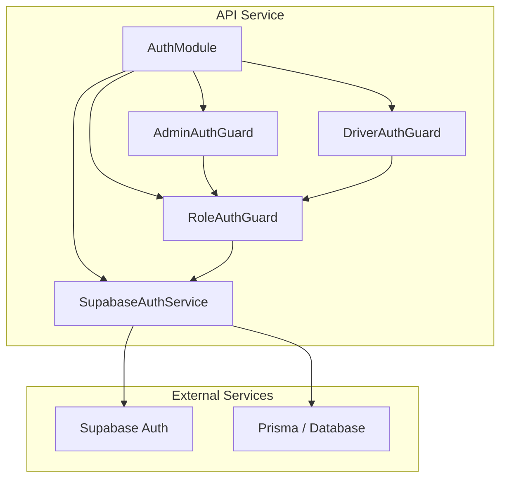
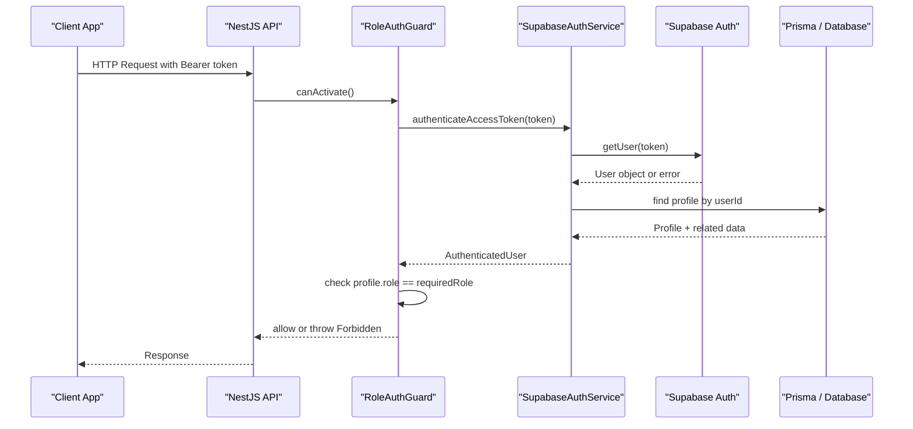
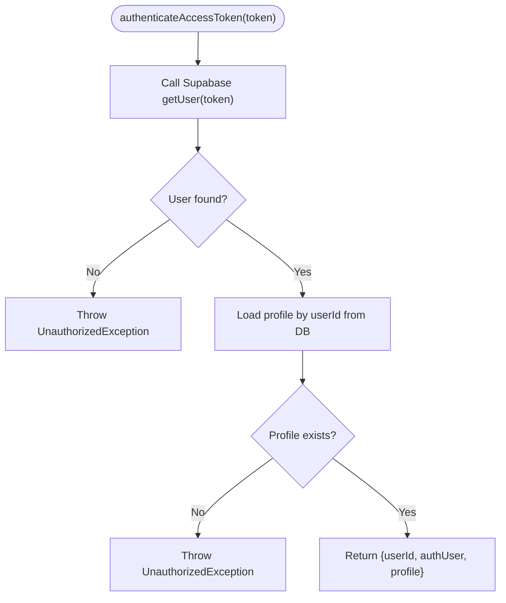
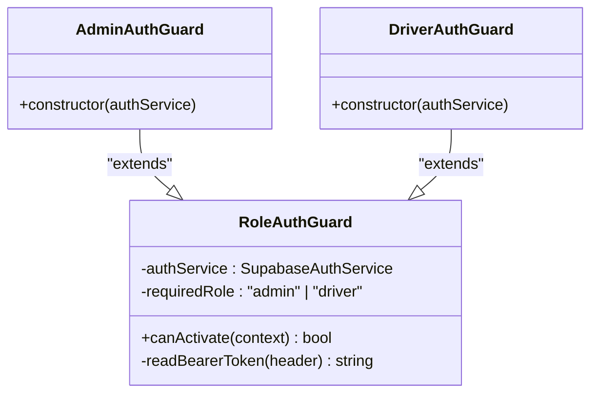
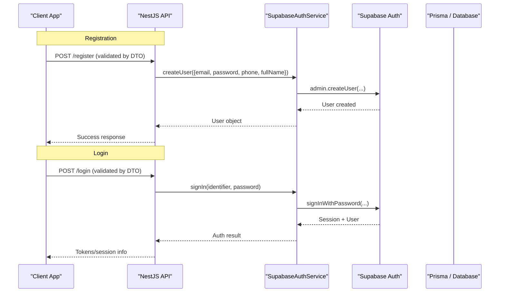
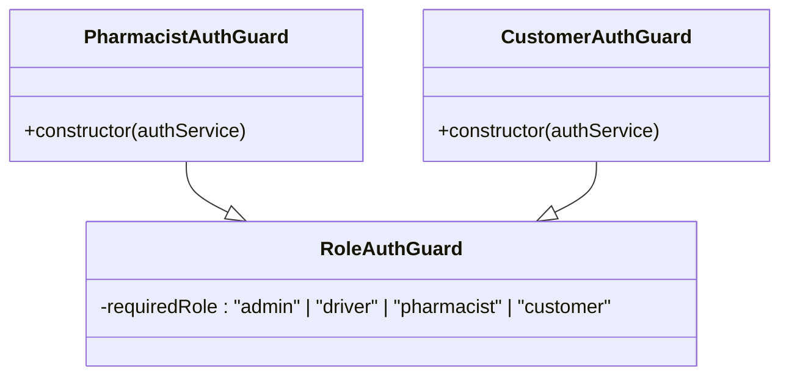
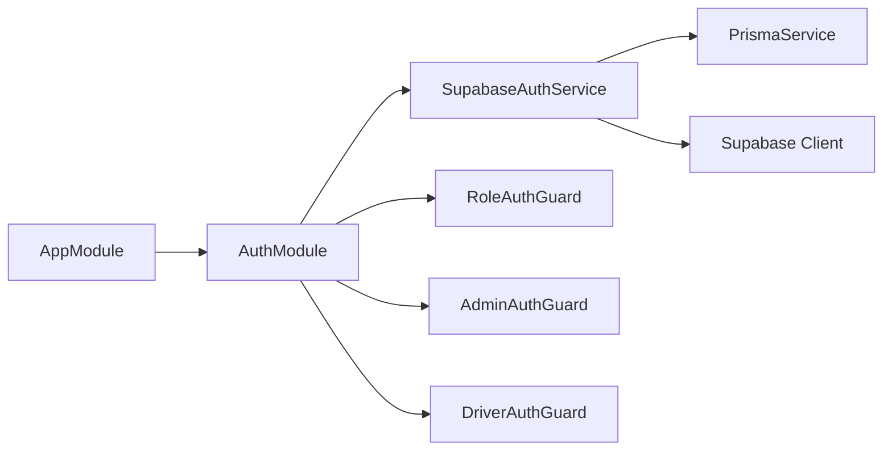

# Authentication & Authorization

<cite>
**Referenced Files in This Document**
- [supabase-auth.service.ts](file://apps/api/src/auth/supabase-auth.service.ts)
- [role-auth.guard.ts](file://apps/api/src/auth/role-auth.guard.ts)
- [admin-auth.guard.ts](file://apps/api/src/auth/admin-auth.guard.ts)
- [driver-auth.guard.ts](file://apps/api/src/auth/driver-auth.guard.ts)
- [auth.module.ts](file://apps/api/src/auth/auth.module.ts)
- [app.module.ts](file://apps/api/src/app.module.ts)
- [login-driver.dto.ts](file://apps/api/src/modules/driver/dto/login-driver.dto.ts)
- [register-driver.dto.ts](file://apps/api/src/modules/driver/dto/register-driver.dto.ts)
</cite>

## Table of Contents
1. Introduction
2. Project Structure
3. Core Components
4. Architecture Overview
5. Detailed Component Analysis
6. Dependency Analysis
7. Performance Considerations
8. Troubleshooting Guide
9. Conclusion

## Introduction
This document explains the authentication and authorization system implemented in the API service. It covers how users are authenticated via Supabase, how JWT access tokens are validated, role-based access control (RBAC) for admin and driver roles, request validation for registration and login, and where to extend the system for additional roles such as pharmacist and customer. It also outlines security middleware patterns, token refresh considerations, logout handling strategies, and best practices for protecting sensitive endpoints.

## Project Structure
The authentication subsystem is centered around a dedicated AuthModule that provides:
- A Supabase integration service for user authentication and profile resolution
- Role-based guards to enforce RBAC on protected routes
- Registration and login DTOs for input validation

**Diagram sources**
- [auth.module.ts:8-12](file://apps/api/src/auth/auth.module.ts#L8-L12)
- [supabase-auth.service.ts:11-24](file://apps/api/src/auth/supabase-auth.service.ts#L11-L24)
- [role-auth.guard.ts:4-10](file://apps/api/src/auth/role-auth.guard.ts#L4-L10)
- [admin-auth.guard.ts:5-9](file://apps/api/src/auth/admin-auth.guard.ts#L5-L9)
- [driver-auth.guard.ts:5-9](file://apps/api/src/auth/driver-auth.guard.ts#L5-L9)

**Section sources**
- [auth.module.ts:1-13](file://apps/api/src/auth/auth.module.ts#L1-L13)
- [app.module.ts:14-27](file://apps/api/src/app.module.ts#L14-L27)

## Core Components
- SupabaseAuthService: Handles sign-in with email/password, user creation via admin API, and access token verification by calling Supabase and resolving the local profile from Prisma.
- Role-based Guards: Base guard validates Bearer tokens and enforces required roles; specialized guards for admin and driver.
- Request Validation DTOs: Strongly-typed inputs for driver login and registration using class-validator decorators.

Key responsibilities:
- Token validation and user context enrichment
- Role enforcement at route level
- Input validation for auth flows
- Centralized Supabase client configuration

**Section sources**
- [supabase-auth.service.ts:11-68](file://apps/api/src/auth/supabase-auth.service.ts#L11-L68)
- [role-auth.guard.ts:4-37](file://apps/api/src/auth/role-auth.guard.ts#L4-L37)
- [admin-auth.guard.ts:5-9](file://apps/api/src/auth/admin-auth.guard.ts#L5-L9)
- [driver-auth.guard.ts:5-9](file://apps/api/src/auth/driver-auth.guard.ts#L5-L9)
- [login-driver.dto.ts:1-15](file://apps/api/src/modules/driver/dto/login-driver.dto.ts#L1-L15)
- [register-driver.dto.ts:1-49](file://apps/api/src/modules/driver/dto/register-driver.dto.ts#L1-L49)

## Architecture Overview
The API uses Supabase Auth for identity management. Clients authenticate via email/password or social providers configured in Supabase. The API validates requests by inspecting the Authorization header, verifying the JWT with Supabase, and loading the user’s profile from the database to enforce RBAC.

**Diagram sources**
- [role-auth.guard.ts:11-36](file://apps/api/src/auth/role-auth.guard.ts#L11-L36)
- [supabase-auth.service.ts:49-64](file://apps/api/src/auth/supabase-auth.service.ts#L49-L64)

## Detailed Component Analysis

### SupabaseAuthService
Responsibilities:
- Sign-in with email or phone identifier mapped to email
- Create users via Supabase admin API with auto-confirmed email and metadata
- Verify access tokens and attach profile information to the request context

Security notes:
- Uses service role key for server-side operations
- Disables session persistence and auto-refresh in the client instance
- Throws standardized unauthorized exceptions on failures

**Diagram sources**
- [supabase-auth.service.ts:49-64](file://apps/api/src/auth/supabase-auth.service.ts#L49-L64)

**Section sources**
- [supabase-auth.service.ts:11-80](file://apps/api/src/auth/supabase-auth.service.ts#L11-L80)

### Role-Based Access Control (RBAC)
- Base guard reads the Bearer token, verifies it via SupabaseAuthService, and attaches user context to the request.
- Enforces required role by comparing profile.role against the expected value.
- Specialized guards simplify usage for specific roles.

**Diagram sources**
- [role-auth.guard.ts:4-37](file://apps/api/src/auth/role-auth.guard.ts#L4-L37)
- [admin-auth.guard.ts:5-9](file://apps/api/src/auth/admin-auth.guard.ts#L5-L9)
- [driver-auth.guard.ts:5-9](file://apps/api/src/auth/driver-auth.guard.ts#L5-L9)

**Section sources**
- [role-auth.guard.ts:4-37](file://apps/api/src/auth/role-auth.guard.ts#L4-L37)
- [admin-auth.guard.ts:1-10](file://apps/api/src/auth/admin-auth.guard.ts#L1-L10)
- [driver-auth.guard.ts:1-10](file://apps/api/src/auth/driver-auth.guard.ts#L1-L10)

### Registration and Login Flows
- Registration: Use Supabase admin API to create users with confirmed email and metadata. Validate inputs with DTOs before calling the service.
- Login: Accept email or phone identifier plus password; resolve email if needed and call Supabase sign-in. On success, return session/user data to the client.

**Diagram sources**
- [supabase-auth.service.ts:26-47](file://apps/api/src/auth/supabase-auth.service.ts#L26-L47)
- [login-driver.dto.ts:1-15](file://apps/api/src/modules/driver/dto/login-driver.dto.ts#L1-L15)
- [register-driver.dto.ts:1-49](file://apps/api/src/modules/driver/dto/register-driver.dto.ts#L1-L49)

**Section sources**
- [supabase-auth.service.ts:26-47](file://apps/api/src/auth/supabase-auth.service.ts#L26-L47)
- [login-driver.dto.ts:1-15](file://apps/api/src/modules/driver/dto/login-driver.dto.ts#L1-L15)
- [register-driver.dto.ts:1-49](file://apps/api/src/modules/driver/dto/register-driver.dto.ts#L1-L49)

### Extending RBAC for Pharmacist and Customer Roles
To support pharmacist and customer roles:
- Add new guards similar to AdminAuthGuard and DriverAuthGuard, specifying the required role.
- Ensure profiles store a role field that matches the required values.
- Apply guards to relevant controllers to protect endpoints.

[No diagram sources since this extends existing patterns conceptually]

### Security Middleware, Request Validation, Rate Limiting, and CSRF
- Request validation: Use DTOs with class-validator decorators to validate inputs for login and registration endpoints.
- Rate limiting: Integrate a NestJS rate limiter (e.g., @nestjs/throttler) globally or per-controller to protect auth endpoints from brute-force attacks.
- CSRF protection: For web clients, enable CSRF protection on state-changing endpoints and ensure cookies are handled securely.
- Helmet and CORS: Configure helmet for secure headers and restrict CORS origins to trusted domains.

[No sources needed since this section provides general guidance]

### Token Refresh Mechanisms
- Strategy: Store short-lived access tokens and long-lived refresh tokens on the client. When an access token expires, use the refresh token to obtain a new access token via Supabase refresh logic.
- Server side: Continue validating access tokens with Supabase.getUser. Optionally implement a /refresh endpoint that accepts a valid refresh token and returns a new access token.

[No sources needed since this section provides general guidance]

### Logout Handling
- Client-side: Clear stored tokens and session state when logging out.
- Server-side: If you maintain server-side sessions or token blacklists, invalidate them accordingly. With Supabase JWTs, rely on token expiration and client cleanup.

[No sources needed since this section provides general guidance]

## Dependency Analysis
The AuthModule wires together the service and guards and exports them for use across modules. The application module imports AuthModule so guards and services are available throughout the API.

**Diagram sources**
- [app.module.ts:14-27](file://apps/api/src/app.module.ts#L14-L27)
- [auth.module.ts:8-12](file://apps/api/src/auth/auth.module.ts#L8-L12)
- [supabase-auth.service.ts:11-24](file://apps/api/src/auth/supabase-auth.service.ts#L11-L24)

**Section sources**
- [app.module.ts:1-30](file://apps/api/src/app.module.ts#L1-L30)
- [auth.module.ts:1-13](file://apps/api/src/auth/auth.module.ts#L1-L13)

## Performance Considerations
- Minimize database calls: Cache profile lookups when appropriate, but be mindful of stale data risks.
- Avoid unnecessary Supabase calls: Reuse validated tokens within request scope where possible.
- Keep DTO validations lightweight and focused on auth-critical fields.
- Use efficient queries in profile retrieval to reduce latency.

[No sources needed since this section provides general guidance]

## Troubleshooting Guide
Common issues and resolutions:
- Invalid or expired token: Ensure the Authorization header uses the correct Bearer scheme and contains a valid token.
- Insufficient permissions: Verify the user’s profile role matches the required role for the endpoint.
- Profile not found: Confirm that the Supabase user has a corresponding profile record in the database.
- Missing environment variables: Ensure SUPABASE_URL and SUPABASE_SERVICE_ROLE_KEY are set correctly.

**Section sources**
- [role-auth.guard.ts:30-36](file://apps/api/src/auth/role-auth.guard.ts#L30-L36)
- [supabase-auth.service.ts:15-23](file://apps/api/src/auth/supabase-auth.service.ts#L15-L23)
- [supabase-auth.service.ts:49-64](file://apps/api/src/auth/supabase-auth.service.ts#L49-L64)

## Conclusion
The authentication and authorization system leverages Supabase for identity management and implements robust RBAC through NestJS guards. Requests are validated with strong DTOs, and sensitive endpoints are protected by role checks. Extend the system by adding guards for additional roles, integrating rate limiting and CSRF protections, and implementing token refresh and logout flows tailored to your clients’ needs.