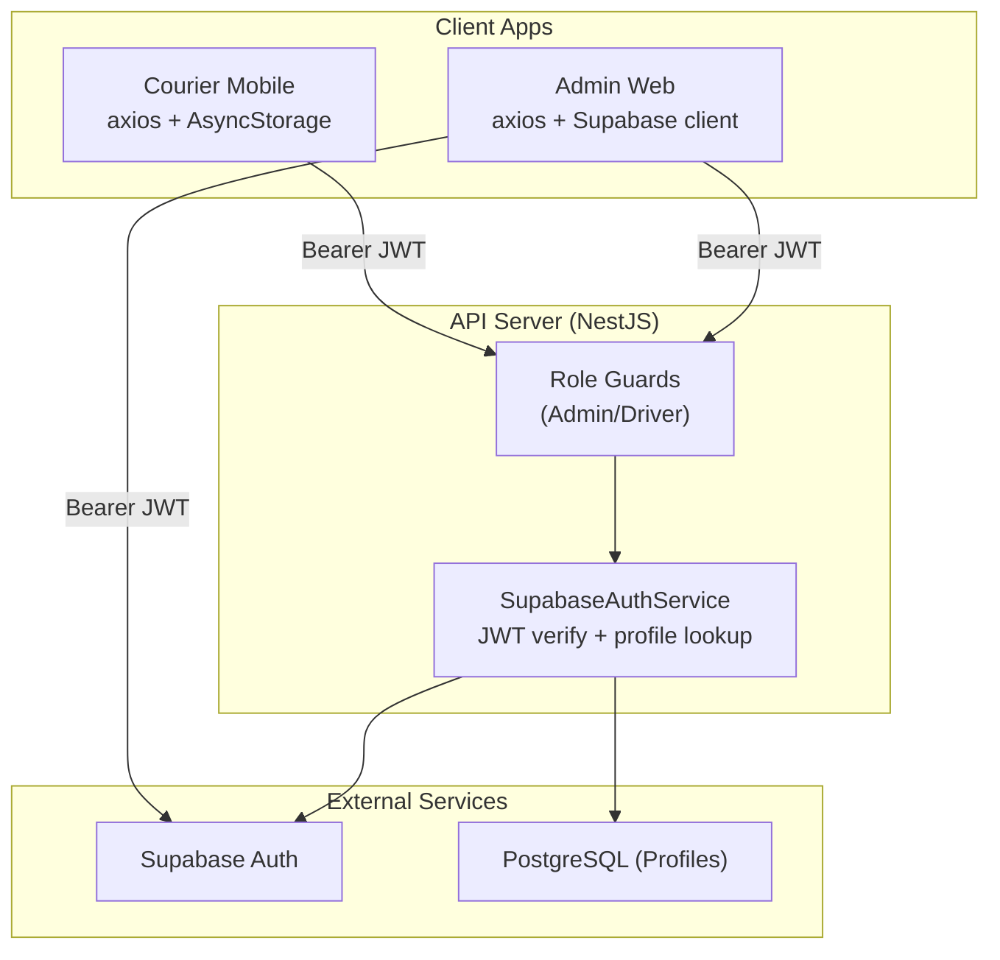
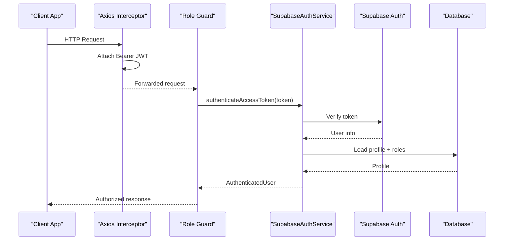
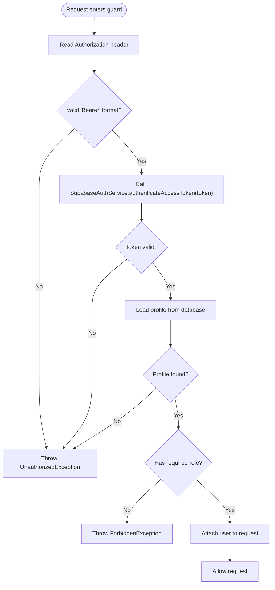
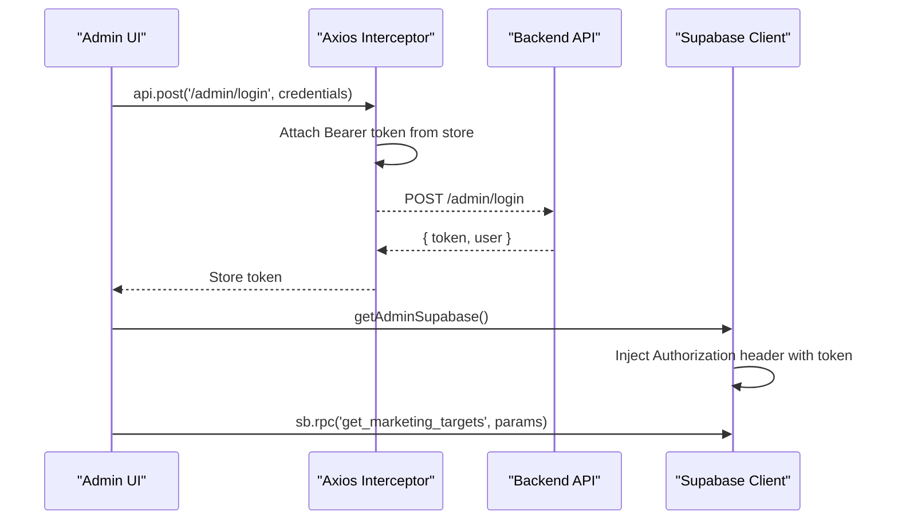
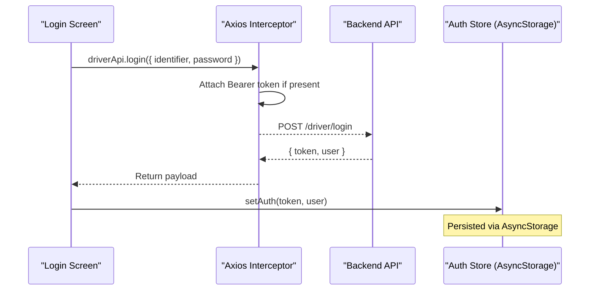
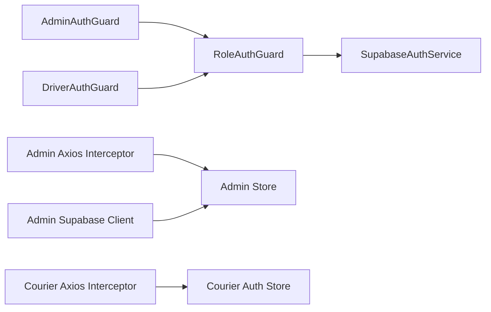

# JWT Token Management

<cite>
**Referenced Files in This Document**
- [supabase-auth.service.ts](file://apps/api/src/auth/supabase-auth.service.ts)
- [role-auth.guard.ts](file://apps/api/src/auth/role-auth.guard.ts)
- [admin-auth.guard.ts](file://apps/api/src/auth/admin-auth.guard.ts)
- [driver-auth.guard.ts](file://apps/api/src/auth/driver-auth.guard.ts)
- [api.ts (Admin)](file://apps/admin/src/lib/api.ts)
- [supabase.ts (Admin)](file://apps/admin/src/lib/supabase.ts)
- [auth.store.ts (Courier Mobile)](file://apps/courier-mobile/src/stores/auth.store.ts)
- [login.tsx (Courier Mobile)](file://apps/courier-mobile/app/(auth)/login.tsx)
- [api.ts (Courier Mobile)](file://apps/courier-mobile/src/lib/api.ts)
</cite>

## Table of Contents
1. Introduction
2. Project Structure
3. Core Components
4. Architecture Overview
5. Detailed Component Analysis
6. Dependency Analysis
7. Performance Considerations
8. Troubleshooting Guide
9. Conclusion

## Introduction
This document explains how JWT tokens are generated, validated, refreshed, and handled across the system. It covers:
- Server-side token validation via Supabase and NestJS guards
- Client-side token storage and attachment to requests for web and mobile apps
- Integration with Supabase for admin direct calls and RLS enforcement
- Error handling for expired or invalid tokens
- Security considerations and best practices for token management

## Project Structure
The authentication flow spans three main areas:
- API server (NestJS): validates JWTs using Supabase and enforces roles via guards
- Admin web app: attaches JWT to API and Supabase calls; handles 401 by redirecting to login
- Courier mobile app: persists JWT locally, attaches it to API calls, and clears state on 401

**Diagram sources**
- [role-auth.guard.ts:11-36](file://apps/api/src/auth/role-auth.guard.ts#L11-L36)
- [supabase-auth.service.ts:49-64](file://apps/api/src/auth/supabase-auth.service.ts#L49-L64)
- [api.ts (Admin):12-18](file://apps/admin/src/lib/api.ts#L12-L18)
- [supabase.ts (Admin):38-46](file://apps/admin/src/lib/supabase.ts#L38-L46)
- [api.ts (Courier Mobile):25-31](file://apps/courier-mobile/src/lib/api.ts#L25-L31)

**Section sources**
- [role-auth.guard.ts:11-36](file://apps/api/src/auth/role-auth.guard.ts#L11-L36)
- [supabase-auth.service.ts:49-64](file://apps/api/src/auth/supabase-auth.service.ts#L49-L64)
- [api.ts (Admin):12-18](file://apps/admin/src/lib/api.ts#L12-L18)
- [supabase.ts (Admin):38-46](file://apps/admin/src/lib/supabase.ts#L38-L46)
- [api.ts (Courier Mobile):25-31](file://apps/courier-mobile/src/lib/api.ts#L25-L31)

## Core Components
- SupabaseAuthService: Validates access tokens against Supabase and enriches context with user profile data from the database.
- Role-based guards: Extract Bearer token from Authorization header, validate via service, enforce role, and attach user to request.
- Admin web axios interceptor: Automatically attaches current admin JWT to all API calls; redirects on 401.
- Admin Supabase client: Creates a per-request Supabase client that injects the current admin JWT into headers for RPCs and Edge Functions.
- Courier mobile axios interceptor: Attaches stored JWT to all API calls; clears local auth state on 401.
- Courier mobile login: Calls backend login, validates role, and stores token and user profile.

**Section sources**
- [supabase-auth.service.ts:11-64](file://apps/api/src/auth/supabase-auth.service.ts#L11-L64)
- [role-auth.guard.ts:11-36](file://apps/api/src/auth/role-auth.guard.ts#L11-L36)
- [admin-auth.guard.ts:5-9](file://apps/api/src/auth/admin-auth.guard.ts#L5-L9)
- [driver-auth.guard.ts:5-9](file://apps/api/src/auth/driver-auth.guard.ts#L5-L9)
- [api.ts (Admin):12-28](file://apps/admin/src/lib/api.ts#L12-L28)
- [supabase.ts (Admin):38-46](file://apps/admin/src/lib/supabase.ts#L38-L46)
- [api.ts (Courier Mobile):25-43](file://apps/courier-mobile/src/lib/api.ts#L25-L43)
- [login.tsx (Courier Mobile):44-63](file://apps/courier-mobile/app/(auth)/login.tsx#L44-L63)

## Architecture Overview
The system uses short-lived JWTs issued by Supabase. The API validates them server-side and resolves additional permissions from the database. Clients store tokens securely and attach them to every request.

**Diagram sources**
- [api.ts (Admin):12-18](file://apps/admin/src/lib/api.ts#L12-L18)
- [api.ts (Courier Mobile):25-31](file://apps/courier-mobile/src/lib/api.ts#L25-L31)
- [role-auth.guard.ts:11-36](file://apps/api/src/auth/role-auth.guard.ts#L11-L36)
- [supabase-auth.service.ts:49-64](file://apps/api/src/auth/supabase-auth.service.ts#L49-L64)

## Detailed Component Analysis

### Server-Side JWT Validation and Role Enforcement
- Token extraction: Guards parse the Authorization header and require a Bearer token.
- Validation: Service calls Supabase to verify the token and retrieve user details.
- Enrichment: Service loads the user’s profile and driver profile from the database.
- Authorization: Guards compare the required role (admin or driver) against the profile role and set request.user.

**Diagram sources**
- [role-auth.guard.ts:11-36](file://apps/api/src/auth/role-auth.guard.ts#L11-L36)
- [supabase-auth.service.ts:49-64](file://apps/api/src/auth/supabase-auth.service.ts#L49-L64)

**Section sources**
- [role-auth.guard.ts:11-36](file://apps/api/src/auth/role-auth.guard.ts#L11-L36)
- [admin-auth.guard.ts:5-9](file://apps/api/src/auth/admin-auth.guard.ts#L5-L9)
- [driver-auth.guard.ts:5-9](file://apps/api/src/auth/driver-auth.guard.ts#L5-L9)
- [supabase-auth.service.ts:49-64](file://apps/api/src/auth/supabase-auth.service.ts#L49-L64)

### Admin Web: Token Storage and Attachment
- Storage: Admin JWT is kept in application store and used per request.
- API attachment: Axios interceptor adds Authorization header with the current token.
- 401 handling: On 401, the app logs out and redirects to login.
- Supabase integration: Per-request Supabase client injects the same admin JWT for RPCs and Edge Functions, enabling RLS checks based on the caller’s identity.

**Diagram sources**
- [api.ts (Admin):12-28](file://apps/admin/src/lib/api.ts#L12-L28)
- [supabase.ts (Admin):38-46](file://apps/admin/src/lib/supabase.ts#L38-L46)

**Section sources**
- [api.ts (Admin):12-28](file://apps/admin/src/lib/api.ts#L12-L28)
- [supabase.ts (Admin):38-46](file://apps/admin/src/lib/supabase.ts#L38-L46)

### Courier Mobile: Token Storage and Attachment
- Storage: JWT persisted in AsyncStorage via Zustand middleware.
- Attachment: Axios interceptor attaches Bearer token to all requests.
- 401 handling: Clears persisted auth state on 401.
- Login flow: Calls backend login, validates role, then stores token and user.

**Diagram sources**
- [login.tsx (Courier Mobile):44-63](file://apps/courier-mobile/app/(auth)/login.tsx#L44-L63)
- [api.ts (Courier Mobile):25-43](file://apps/courier-mobile/src/lib/api.ts#L25-L43)
- [auth.store.ts (Courier Mobile):47-90](file://apps/courier-mobile/src/stores/auth.store.ts#L47-L90)

**Section sources**
- [login.tsx (Courier Mobile):44-63](file://apps/courier-mobile/app/(auth)/login.tsx#L44-L63)
- [api.ts (Courier Mobile):25-43](file://apps/courier-mobile/src/lib/api.ts#L25-L43)
- [auth.store.ts (Courier Mobile):47-90](file://apps/courier-mobile/src/stores/auth.store.ts#L47-L90)

### Supabase Integration Details
- Server-side verification: Access tokens are verified via Supabase; profiles are loaded from the database for authorization decisions.
- Admin direct calls: Admin Supabase client injects the current admin JWT into headers for RPCs and Edge Functions, ensuring RLS sees the authenticated caller.
- Environment configuration: Service uses environment variables for URL and service role key; clients use environment variables for URL and anon key.

**Section sources**
- [supabase-auth.service.ts:15-23](file://apps/api/src/auth/supabase-auth.service.ts#L15-L23)
- [supabase-auth.service.ts:49-64](file://apps/api/src/auth/supabase-auth.service.ts#L49-L64)
- [supabase.ts (Admin):25-46](file://apps/admin/src/lib/supabase.ts#L25-L46)

## Dependency Analysis
- Guards depend on SupabaseAuthService for token validation and profile resolution.
- Admin and Courier mobile interceptors depend on their respective stores for token retrieval.
- Admin Supabase client depends on the admin store to fetch the current token per request.

**Diagram sources**
- [admin-auth.guard.ts:5-9](file://apps/api/src/auth/admin-auth.guard.ts#L5-L9)
- [driver-auth.guard.ts:5-9](file://apps/api/src/auth/driver-auth.guard.ts#L5-L9)
- [role-auth.guard.ts:11-36](file://apps/api/src/auth/role-auth.guard.ts#L11-L36)
- [supabase-auth.service.ts:49-64](file://apps/api/src/auth/supabase-auth.service.ts#L49-L64)
- [api.ts (Admin):12-18](file://apps/admin/src/lib/api.ts#L12-L18)
- [api.ts (Courier Mobile):25-31](file://apps/courier-mobile/src/lib/api.ts#L25-L31)
- [supabase.ts (Admin):38-46](file://apps/admin/src/lib/supabase.ts#L38-L46)

**Section sources**
- [admin-auth.guard.ts:5-9](file://apps/api/src/auth/admin-auth.guard.ts#L5-L9)
- [driver-auth.guard.ts:5-9](file://apps/api/src/auth/driver-auth.guard.ts#L5-L9)
- [role-auth.guard.ts:11-36](file://apps/api/src/auth/role-auth.guard.ts#L11-L36)
- [supabase-auth.service.ts:49-64](file://apps/api/src/auth/supabase-auth.service.ts#L49-L64)
- [api.ts (Admin):12-18](file://apps/admin/src/lib/api.ts#L12-L18)
- [api.ts (Courier Mobile):25-31](file://apps/courier-mobile/src/lib/api.ts#L25-L31)
- [supabase.ts (Admin):38-46](file://apps/admin/src/lib/supabase.ts#L38-L46)

## Performance Considerations
- Token verification cost: Each protected request triggers a Supabase call to verify the token and a database query to load the profile. Consider caching short-lived user metadata where appropriate to reduce round trips.
- Interceptor overhead: Attaching headers is lightweight; ensure base URLs and timeouts are tuned for network conditions.
- Direct Supabase calls: Admin RPCs bypass the API; ensure efficient queries and proper indexing in Supabase to avoid latency spikes.

[No sources needed since this section provides general guidance]

## Troubleshooting Guide
Common issues and resolutions:
- Invalid or expired token:
  - Symptom: 401 responses from API or Supabase
  - Resolution: Clear local token and redirect to login; re-authenticate
  - References:
    - [role-auth.guard.ts:30-36](file://apps/api/src/auth/role-auth.guard.ts#L30-L36)
    - [supabase-auth.service.ts:49-53](file://apps/api/src/auth/supabase-auth.service.ts#L49-L53)
    - [api.ts (Admin):20-28](file://apps/admin/src/lib/api.ts#L20-L28)
    - [api.ts (Courier Mobile):34-43](file://apps/courier-mobile/src/lib/api.ts#L34-L43)
- Insufficient permissions:
  - Symptom: 403 after successful token validation
  - Resolution: Ensure user has the required role in profile
  - Reference: [role-auth.guard.ts:16-18](file://apps/api/src/auth/role-auth.guard.ts#L16-L18)
- Missing profile:
  - Symptom: 401 when profile not found
  - Resolution: Complete onboarding or fix profile linkage
  - Reference: [supabase-auth.service.ts:55-61](file://apps/api/src/auth/supabase-auth.service.ts#L55-L61)
- Incorrect Authorization header format:
  - Symptom: 401 due to malformed header
  - Resolution: Ensure header is exactly "Bearer <token>"
  - Reference: [role-auth.guard.ts:30-36](file://apps/api/src/auth/role-auth.guard.ts#L30-L36)

**Section sources**
- [role-auth.guard.ts:16-36](file://apps/api/src/auth/role-auth.guard.ts#L16-L36)
- [supabase-auth.service.ts:49-61](file://apps/api/src/auth/supabase-auth.service.ts#L49-L61)
- [api.ts (Admin):20-28](file://apps/admin/src/lib/api.ts#L20-L28)
- [api.ts (Courier Mobile):34-43](file://apps/courier-mobile/src/lib/api.ts#L34-L43)

## Conclusion
This system validates JWTs server-side using Supabase and enforces role-based access through NestJS guards. Clients persist tokens securely and attach them to every request. Admin applications can also call Supabase directly while preserving authentication context. For robust operations:
- Always attach Bearer tokens via interceptors
- Handle 401 by clearing local state and prompting re-login
- Keep tokens short-lived and refresh at the client level as needed
- Use environment variables for secrets and keys
- Monitor performance of token verification and profile lookups

[No sources needed since this section summarizes without analyzing specific files]