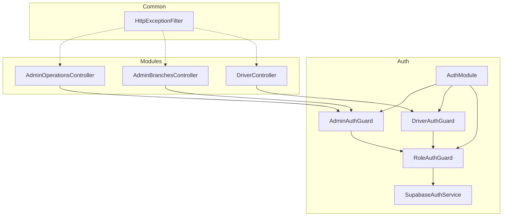
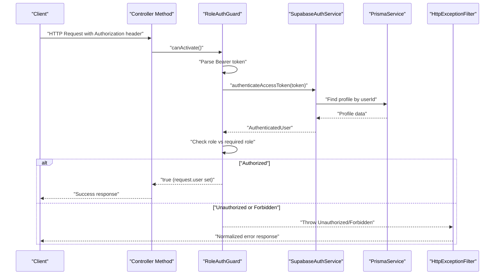
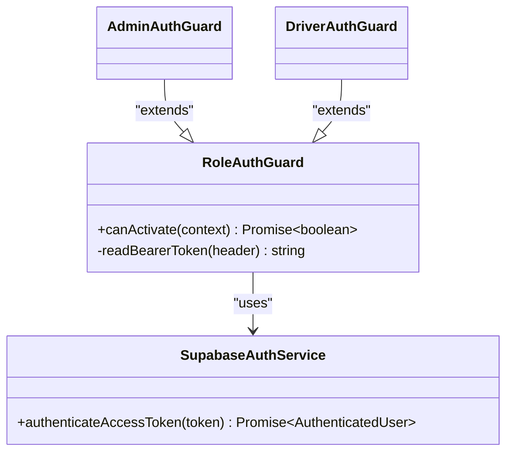
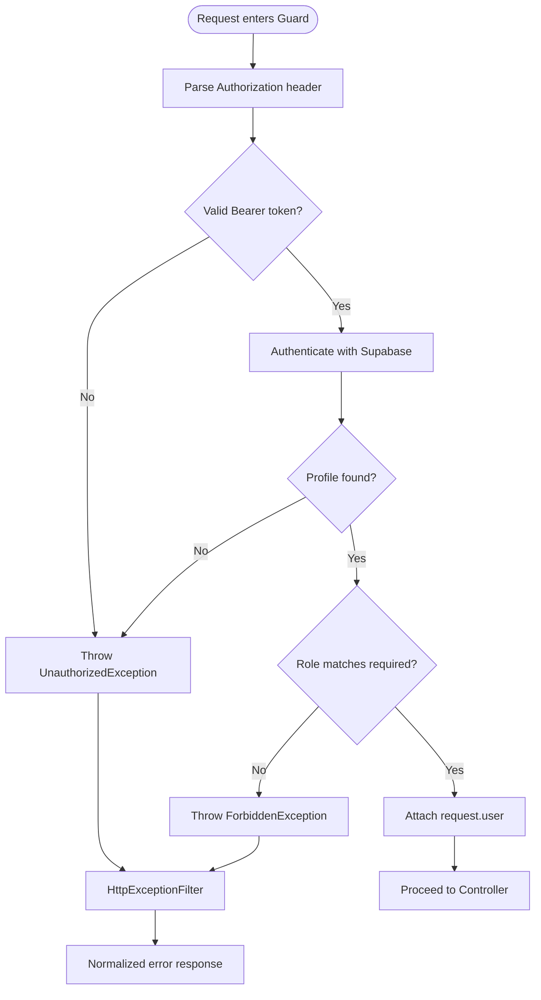
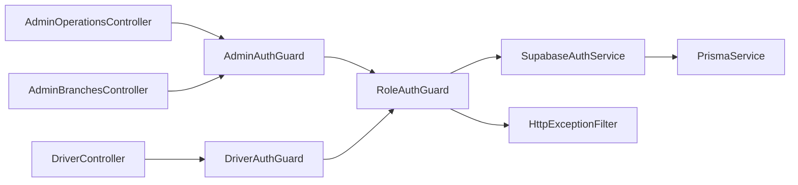

# Guard Implementations

<cite>
**Referenced Files in This Document**
- [role-auth.guard.ts](file://apps/api/src/auth/role-auth.guard.ts)
- [admin-auth.guard.ts](file://apps/api/src/auth/admin-auth.guard.ts)
- [driver-auth.guard.ts](file://apps/api/src/auth/driver-auth.guard.ts)
- [supabase-auth.service.ts](file://apps/api/src/auth/supabase-auth.service.ts)
- [auth.module.ts](file://apps/api/src/auth/auth.module.ts)
- [http-exception.filter.ts](file://apps/api/src/common/http-exception.filter.ts)
- [admin-operations.controller.ts](file://apps/api/src/modules/admin/admin-operations.controller.ts)
- [branches.controller.ts](file://apps/api/src/modules/branches/branches.controller.ts)
- [driver.controller.ts](file://apps/api/src/modules/driver/driver.controller.ts)
</cite>

## Table of Contents
1. Introduction
2. Project Structure
3. Core Components
4. Architecture Overview
5. Detailed Component Analysis
6. Dependency Analysis
7. Performance Considerations
8. Troubleshooting Guide
9. Conclusion

## Introduction
This document explains the Role-Based Access Control (RBAC) guard implementations used to protect routes and endpoints in the API. It covers the base RoleAuthGuard class, its specialized guards AdminAuthGuard and DriverAuthGuard, how they integrate with Supabase authentication, how controllers apply them, and how errors are handled consistently. It also provides guidance on implementing custom guards, extending existing ones, composing multiple guards, and following best practices for route protection.

## Project Structure
The RBAC guards live under apps/api/src/auth and are consumed by feature modules such as admin, branches, and driver. The guards rely on a Supabase-based authentication service and Prisma for profile lookups. Controllers apply guards at the controller or method level to enforce role-based access.

**Diagram sources**
- [role-auth.guard.ts:1-37](file://apps/api/src/auth/role-auth.guard.ts#L1-L37)
- [admin-auth.guard.ts:1-10](file://apps/api/src/auth/admin-auth.guard.ts#L1-L10)
- [driver-auth.guard.ts:1-10](file://apps/api/src/auth/driver-auth.guard.ts#L1-L10)
- [supabase-auth.service.ts:1-80](file://apps/api/src/auth/supabase-auth.service.ts#L1-L80)
- [auth.module.ts:1-13](file://apps/api/src/auth/auth.module.ts#L1-L13)
- [admin-operations.controller.ts:1-72](file://apps/api/src/modules/admin/admin-operations.controller.ts#L1-L72)
- [branches.controller.ts:1-40](file://apps/api/src/modules/branches/branches.controller.ts#L1-L40)
- [driver.controller.ts:60-235](file://apps/api/src/modules/driver/driver.controller.ts#L60-L235)
- [http-exception.filter.ts:1-46](file://apps/api/src/common/http-exception.filter.ts#L1-L46)

**Section sources**
- [auth.module.ts:1-13](file://apps/api/src/auth/auth.module.ts#L1-L13)
- [admin-operations.controller.ts:1-72](file://apps/api/src/modules/admin/admin-operations.controller.ts#L1-L72)
- [branches.controller.ts:1-40](file://apps/api/src/modules/branches/branches.controller.ts#L1-L40)
- [driver.controller.ts:60-235](file://apps/api/src/modules/driver/driver.controller.ts#L60-L235)

## Core Components
- RoleAuthGuard: Base guard that validates Bearer tokens via SupabaseAuthService, verifies the user’s role matches the required role, and attaches user metadata to the request.
- AdminAuthGuard: Specialized guard requiring the “admin” role.
- DriverAuthGuard: Specialized guard requiring the “driver” role.
- SupabaseAuthService: Validates access tokens against Supabase Auth and loads the user’s profile from Prisma.
- HttpExceptionFilter: Global filter that normalizes HTTP exceptions into a consistent error response shape.

Key behaviors:
- Token parsing: Extracts token from Authorization header; rejects malformed headers.
- Authentication: Uses Supabase to validate the token and fetch the user profile including role and optional driver profile.
- Authorization: Compares the authenticated user’s role to the required role; denies with a forbidden error if mismatched.
- Request enrichment: Attaches userId, role, profile, and driverProfile to request.user for downstream handlers.

**Section sources**
- [role-auth.guard.ts:1-37](file://apps/api/src/auth/role-auth.guard.ts#L1-L37)
- [admin-auth.guard.ts:1-10](file://apps/api/src/auth/admin-auth.guard.ts#L1-L10)
- [driver-auth.guard.ts:1-10](file://apps/api/src/auth/driver-auth.guard.ts#L1-L10)
- [supabase-auth.service.ts:1-80](file://apps/api/src/auth/supabase-auth.service.ts#L1-L80)
- [http-exception.filter.ts:1-46](file://apps/api/src/common/http-exception.filter.ts#L1-L46)

## Architecture Overview
The guard pipeline enforces authentication and authorization before controller logic executes. When a request arrives:
1. The guard extracts and validates the Bearer token.
2. The authentication service validates the token with Supabase and retrieves the user profile.
3. The guard checks the role against the required role.
4. On success, the guard injects user context into the request.
5. If any step fails, an HTTP exception is thrown and normalized by the global filter.

**Diagram sources**
- [role-auth.guard.ts:11-36](file://apps/api/src/auth/role-auth.guard.ts#L11-L36)
- [supabase-auth.service.ts:49-64](file://apps/api/src/auth/supabase-auth.service.ts#L49-L64)
- [http-exception.filter.ts:11-43](file://apps/api/src/common/http-exception.filter.ts#L11-L43)

## Detailed Component Analysis

### RoleAuthGuard
Responsibilities:
- Parse Authorization header and extract Bearer token.
- Authenticate token using SupabaseAuthService.
- Enforce role requirement and attach user context to request.
- Throw appropriate HTTP exceptions for invalid tokens or insufficient permissions.

Complexity:
- Time complexity per request: O(1) network call to Supabase plus O(1) database lookup by primary key.
- Space complexity: Minimal, only temporary objects for user context.

Error handling:
- Invalid or missing Authorization header: Unauthorized.
- Invalid or expired token: Unauthorized.
- Profile not found: Unauthorized.
- Role mismatch: Forbidden.

Usage patterns:
- Extend RoleAuthGuard to create new role-specific guards.
- Apply at controller or method level to protect endpoints.

**Section sources**
- [role-auth.guard.ts:1-37](file://apps/api/src/auth/role-auth.guard.ts#L1-L37)

#### Class Diagram

**Diagram sources**
- [role-auth.guard.ts:5-36](file://apps/api/src/auth/role-auth.guard.ts#L5-L36)
- [admin-auth.guard.ts:5-9](file://apps/api/src/auth/admin-auth.guard.ts#L5-L9)
- [driver-auth.guard.ts:5-9](file://apps/api/src/auth/driver-auth.guard.ts#L5-L9)
- [supabase-auth.service.ts:11-64](file://apps/api/src/auth/supabase-auth.service.ts#L11-L64)

### AdminAuthGuard and DriverAuthGuard
- AdminAuthGuard requires the “admin” role.
- DriverAuthGuard requires the “driver” role.
- Both inherit all behavior from RoleAuthGuard and simply configure the required role.

Best practice:
- Keep these classes minimal and focused on role configuration.
- Add additional role-specific logic in RoleAuthGuard or via composition when needed.

**Section sources**
- [admin-auth.guard.ts:1-10](file://apps/api/src/auth/admin-auth.guard.ts#L1-L10)
- [driver-auth.guard.ts:1-10](file://apps/api/src/auth/driver-auth.guard.ts#L1-L10)

### SupabaseAuthService
Responsibilities:
- Validate access tokens against Supabase Auth.
- Retrieve user profiles from Prisma, including related driverProfile where applicable.
- Provide helper methods for sign-in and user creation.

Error handling:
- Throws UnauthorizedException for invalid credentials, invalid/expired tokens, and missing profiles.

Integration points:
- Used by RoleAuthGuard during canActivate.
- Depends on PrismaService for profile retrieval.

**Section sources**
- [supabase-auth.service.ts:1-80](file://apps/api/src/auth/supabase-auth.service.ts#L1-L80)

### Guard Usage in Controllers
- Admin endpoints use AdminAuthGuard at controller or method level to restrict access to administrators.
- Driver endpoints use DriverAuthGuard to ensure only drivers can perform driver-specific actions.

Examples:
- Admin operations controller applies AdminAuthGuard at the controller level to protect all admin routes.
- Branches admin controller applies AdminAuthGuard to protect branch management endpoints.
- Driver controller applies DriverAuthGuard on individual methods for profile, status, location, documents, and order lifecycle endpoints.

**Section sources**
- [admin-operations.controller.ts:15-17](file://apps/api/src/modules/admin/admin-operations.controller.ts#L15-L17)
- [branches.controller.ts:15-17](file://apps/api/src/modules/branches/branches.controller.ts#L15-L17)
- [driver.controller.ts:64-235](file://apps/api/src/modules/driver/driver.controller.ts#L64-L235)

### Error Handling Flow
All HTTP exceptions thrown by guards are caught by the global HttpExceptionFilter, which returns a standardized JSON structure with success flag, error code, message, and contextual details.

**Diagram sources**
- [role-auth.guard.ts:11-36](file://apps/api/src/auth/role-auth.guard.ts#L11-L36)
- [supabase-auth.service.ts:49-64](file://apps/api/src/auth/supabase-auth.service.ts#L49-L64)
- [http-exception.filter.ts:11-43](file://apps/api/src/common/http-exception.filter.ts#L11-L43)

## Dependency Analysis
- RoleAuthGuard depends on SupabaseAuthService for token validation and profile retrieval.
- AdminAuthGuard and DriverAuthGuard depend on RoleAuthGuard for shared logic.
- Controllers depend on specific guards to protect endpoints.
- The global HttpExceptionFilter handles all HTTP exceptions uniformly.

**Diagram sources**
- [admin-operations.controller.ts:15-17](file://apps/api/src/modules/admin/admin-operations.controller.ts#L15-L17)
- [branches.controller.ts:15-17](file://apps/api/src/modules/branches/branches.controller.ts#L15-L17)
- [driver.controller.ts:64-235](file://apps/api/src/modules/driver/driver.controller.ts#L64-L235)
- [role-auth.guard.ts:1-37](file://apps/api/src/auth/role-auth.guard.ts#L1-L37)
- [supabase-auth.service.ts:1-80](file://apps/api/src/auth/supabase-auth.service.ts#L1-L80)
- [http-exception.filter.ts:1-46](file://apps/api/src/common/http-exception.filter.ts#L1-L46)

**Section sources**
- [auth.module.ts:1-13](file://apps/api/src/auth/auth.module.ts#L1-L13)

## Performance Considerations
- Minimize network calls: The guard performs one Supabase call and one Prisma lookup per request. Ensure indexes exist on user IDs for fast profile retrieval.
- Avoid heavy work in guards: Keep canActivate lightweight; move expensive checks to services if necessary.
- Cache profiles when appropriate: If the same user accesses many endpoints within a short window, consider caching profile data in memory or Redis to reduce database load.
- Use module-level guards for entire controllers to avoid per-method overhead when all endpoints share the same role requirement.

[No sources needed since this section provides general guidance]

## Troubleshooting Guide
Common issues and resolutions:
- Missing or malformed Authorization header:
  - Symptom: Unauthorized error.
  - Resolution: Ensure requests include “Authorization: Bearer <token>”.
- Invalid or expired token:
  - Symptom: Unauthorized error.
  - Resolution: Refresh or re-authenticate to obtain a valid token.
- Profile not found:
  - Symptom: Unauthorized error.
  - Resolution: Verify that the user has a corresponding profile record in the database.
- Insufficient permissions:
  - Symptom: Forbidden error.
  - Resolution: Confirm the user’s role matches the endpoint’s required role.

Global error normalization:
- All HTTP exceptions are transformed into a consistent JSON structure with success, error.code, error.message, and contextual details like path and method.

**Section sources**
- [role-auth.guard.ts:11-36](file://apps/api/src/auth/role-auth.guard.ts#L11-L36)
- [supabase-auth.service.ts:49-64](file://apps/api/src/auth/supabase-auth.service.ts#L49-L64)
- [http-exception.filter.ts:11-43](file://apps/api/src/common/http-exception.filter.ts#L11-L43)

## Conclusion
The RBAC guard system provides a clean, extensible way to protect routes based on roles. RoleAuthGuard centralizes authentication and authorization logic, while AdminAuthGuard and DriverAuthGuard specialize it for specific roles. Controllers apply guards declaratively to enforce access control consistently. Errors are normalized globally, ensuring predictable client responses. For new requirements, extend RoleAuthGuard or compose additional guards to implement fine-grained policies while keeping controllers simple and focused on business logic.

[No sources needed since this section summarizes without analyzing specific files]