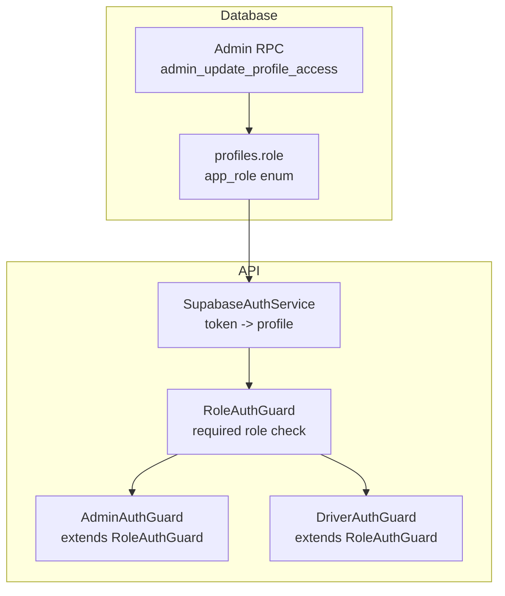
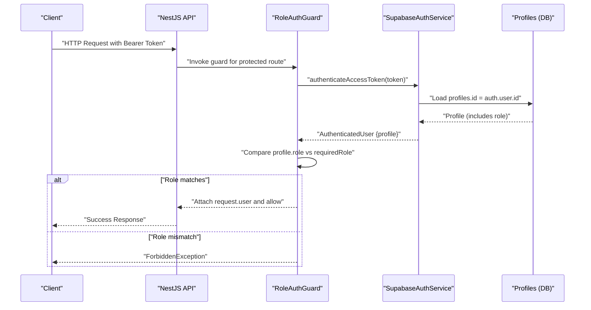
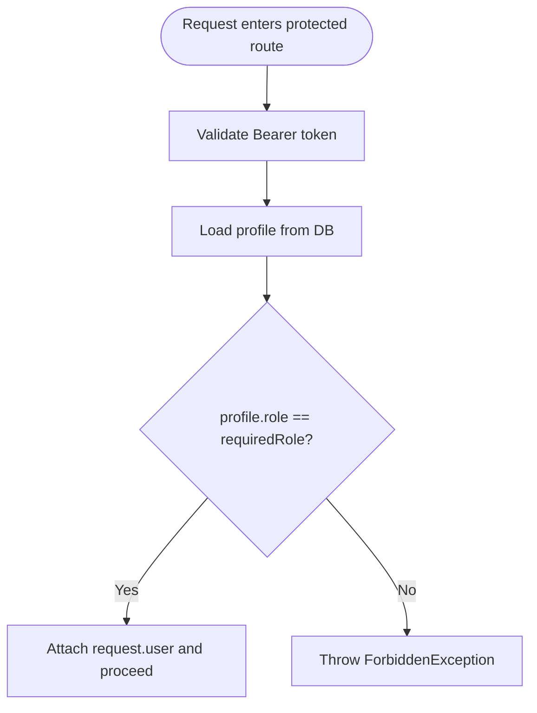
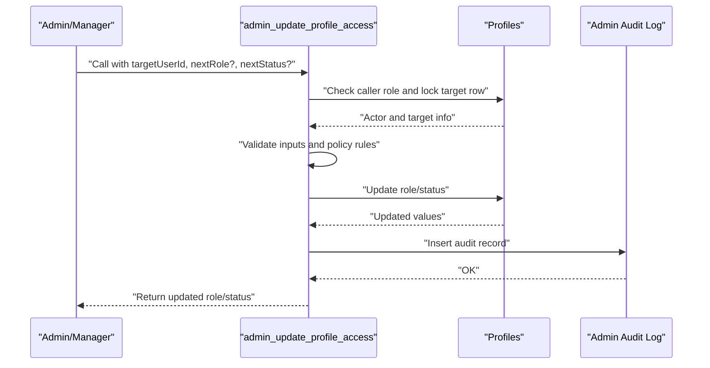
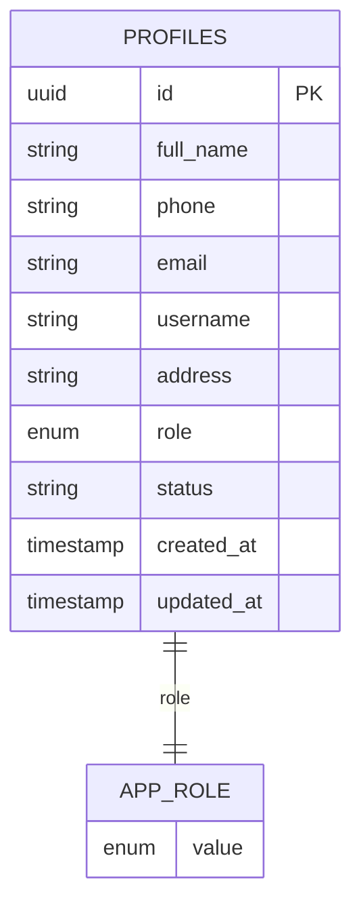
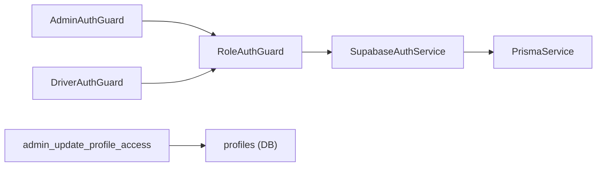

# Role Definitions and Permissions

<cite>
**Referenced Files in This Document**
- [schema.prisma](file://apps/api/prisma/schema.prisma)
- [role-auth.guard.ts](file://apps/api/src/auth/role-auth.guard.ts)
- [admin-auth.guard.ts](file://apps/api/src/auth/admin-auth.guard.ts)
- [driver-auth.guard.ts](file://apps/api/src/auth/driver-auth.guard.ts)
- [supabase-auth.service.ts](file://apps/api/src/auth/supabase-auth.service.ts)
- [20260714120000_fix_admin_update_profile_access_role_type.sql](file://supabase/migrations/20260714120000_fix_admin_update_profile_access_role_type.sql)
</cite>

## Table of Contents
1. Introduction
2. Project Structure
3. Core Components
4. Architecture Overview
5. Detailed Component Analysis
6. Dependency Analysis
7. Performance Considerations
8. Troubleshooting Guide
9. Conclusion

## Introduction
This document explains the role-based access control (RBAC) system used by the application. It covers available roles, their permissions, how roles are stored and managed, and how permission checks are enforced at runtime. The focus is on admin, driver, pharmacist, manager, and customer roles as defined in the database schema and enforced via API guards and server-side functions.

## Project Structure
The RBAC implementation spans three layers:
- Database layer: defines roles as an enum and stores the active role per user profile.
- API layer: validates tokens and enforces role-based access using NestJS guards.
- Server-side function: provides a secure RPC to update roles with strict validation and auditing.

**Diagram sources**
- [schema.prisma:617-635](file://apps/api/prisma/schema.prisma#L617-L635)
- [schema.prisma:743-751](file://apps/api/prisma/schema.prisma#L743-L751)
- [supabase-auth.service.ts:49-64](file://apps/api/src/auth/supabase-auth.service.ts#L49-L64)
- [role-auth.guard.ts:11-27](file://apps/api/src/auth/role-auth.guard.ts#L11-L27)
- [admin-auth.guard.ts:5-9](file://apps/api/src/auth/admin-auth.guard.ts#L5-L9)
- [driver-auth.guard.ts:5-9](file://apps/api/src/auth/driver-auth.guard.ts#L5-L9)
- [20260714120000_fix_admin_update_profile_access_role_type.sql:6-99](file://supabase/migrations/20260714120000_fix_admin_update_profile_access_role_type.sql#L6-L99)

**Section sources**
- [schema.prisma:617-635](file://apps/api/prisma/schema.prisma#L617-L635)
- [schema.prisma:743-751](file://apps/api/prisma/schema.prisma#L743-L751)
- [supabase-auth.service.ts:49-64](file://apps/api/src/auth/supabase-auth.service.ts#L49-L64)
- [role-auth.guard.ts:11-27](file://apps/api/src/auth/role-auth.guard.ts#L11-L27)
- [admin-auth.guard.ts:5-9](file://apps/api/src/auth/admin-auth.guard.ts#L5-L9)
- [driver-auth.guard.ts:5-9](file://apps/api/src/auth/driver-auth.guard.ts#L5-L9)
- [20260714120000_fix_admin_update_profile_access_role_type.sql:6-99](file://supabase/migrations/20260714120000_fix_admin_update_profile_access_role_type.sql#L6-L99)

## Core Components
- Role storage: Each user has a profile with a role field constrained by the app_role enum. Default role is customer.
- Roles: manager, pharmacist, driver, admin, customer.
- Permission enforcement:
  - API-level: Role guards validate that the authenticated user’s profile role matches the required role for a route.
  - DB-level: An admin-only RPC restricts role changes to authorized actors and validates allowed target roles and statuses.

Key behaviors:
- Authentication: SupabaseAuthService verifies the token and loads the user’s profile including related data.
- Authorization: RoleAuthGuard compares the profile role against the required role and attaches user context to the request.
- Admin operations: Only admin or manager can change roles; certain transitions are blocked (e.g., managers cannot assign admin).

**Section sources**
- [schema.prisma:617-635](file://apps/api/prisma/schema.prisma#L617-L635)
- [schema.prisma:743-751](file://apps/api/prisma/schema.prisma#L743-L751)
- [supabase-auth.service.ts:49-64](file://apps/api/src/auth/supabase-auth.service.ts#L49-L64)
- [role-auth.guard.ts:11-27](file://apps/api/src/auth/role-auth.guard.ts#L11-L27)
- [20260714120000_fix_admin_update_profile_access_role_type.sql:28-63](file://supabase/migrations/20260714120000_fix_admin_update_profile_access_role_type.sql#L28-L63)

## Architecture Overview
The RBAC flow combines token-based authentication with role checks at the API boundary and privileged updates through a secured database function.

**Diagram sources**
- [role-auth.guard.ts:11-27](file://apps/api/src/auth/role-auth.guard.ts#L11-L27)
- [supabase-auth.service.ts:49-64](file://apps/api/src/auth/supabase-auth.service.ts#L49-L64)
- [schema.prisma:617-635](file://apps/api/prisma/schema.prisma#L617-L635)

## Detailed Component Analysis

### Roles and Inheritance Model
- Roles are explicitly enumerated and stored per profile. There is no explicit inheritance hierarchy in code; instead, access is enforced by checking the exact role required by each endpoint or operation.
- Allowed roles: manager, pharmacist, driver, admin, customer.
- Default role: customer.

Practical implications:
- Routes requiring admin must be guarded with AdminAuthGuard.
- Routes requiring driver must be guarded with DriverAuthGuard.
- Other roles (pharmacist, manager, customer) are typically checked within business logic or via additional guards/RPCs not shown here.

**Section sources**
- [schema.prisma:743-751](file://apps/api/prisma/schema.prisma#L743-L751)
- [schema.prisma:617-635](file://apps/api/prisma/schema.prisma#L617-L635)
- [admin-auth.guard.ts:5-9](file://apps/api/src/auth/admin-auth.guard.ts#L5-L9)
- [driver-auth.guard.ts:5-9](file://apps/api/src/auth/driver-auth.guard.ts#L5-L9)

### Permission Checking Mechanisms
- API-level checks:
  - RoleAuthGuard reads the bearer token, authenticates via SupabaseAuthService, loads the profile, and ensures profile.role equals the required role.
  - AdminAuthGuard and DriverAuthGuard extend RoleAuthGuard to enforce admin or driver roles respectively.
- DB-level checks:
  - admin_update_profile_access enforces actor privileges, prevents self-role changes, validates allowed target roles and statuses, and logs changes.

**Diagram sources**
- [role-auth.guard.ts:11-27](file://apps/api/src/auth/role-auth.guard.ts#L11-L27)
- [supabase-auth.service.ts:49-64](file://apps/api/src/auth/supabase-auth.service.ts#L49-L64)

**Section sources**
- [role-auth.guard.ts:11-27](file://apps/api/src/auth/role-auth.guard.ts#L11-L27)
- [admin-auth.guard.ts:5-9](file://apps/api/src/auth/admin-auth.guard.ts#L5-L9)
- [driver-auth.guard.ts:5-9](file://apps/api/src/auth/driver-auth.guard.ts#L5-L9)
- [20260714120000_fix_admin_update_profile_access_role_type.sql:28-63](file://supabase/migrations/20260714120000_fix_admin_update_profile_access_role_type.sql#L28-L63)

### Role Assignment and Management
- Role assignment is performed via a secured RPC that:
  - Requires authentication and checks that the caller is admin or manager.
  - Disallows self-role changes.
  - Validates target role and status values.
  - Prevents managers from assigning admin.
  - Updates profiles.role and status, and writes an audit log entry.

**Diagram sources**
- [20260714120000_fix_admin_update_profile_access_role_type.sql:6-99](file://supabase/migrations/20260714120000_fix_admin_update_profile_access_role_type.sql#L6-L99)

**Section sources**
- [20260714120000_fix_admin_update_profile_access_role_type.sql:28-99](file://supabase/migrations/20260714120000_fix_admin_update_profile_access_role_type.sql#L28-L99)

### Data Models and Relationships
- profiles stores the user’s role and status.
- app_role enum enumerates all supported roles.
- Related models (e.g., orders, driver-related tables) reference profiles where applicable.

**Diagram sources**
- [schema.prisma:617-635](file://apps/api/prisma/schema.prisma#L617-L635)
- [schema.prisma:743-751](file://apps/api/prisma/schema.prisma#L743-L751)

**Section sources**
- [schema.prisma:617-635](file://apps/api/prisma/schema.prisma#L617-L635)
- [schema.prisma:743-751](file://apps/api/prisma/schema.prisma#L743-L751)

## Dependency Analysis
- SupabaseAuthService depends on PrismaService to fetch profiles.
- RoleAuthGuard depends on SupabaseAuthService and enforces required role.
- AdminAuthGuard and DriverAuthGuard depend on RoleAuthGuard to specialize checks.
- The admin RPC depends on database policies and the profiles table.

**Diagram sources**
- [supabase-auth.service.ts:1-24](file://apps/api/src/auth/supabase-auth.service.ts#L1-L24)
- [supabase-auth.service.ts:49-64](file://apps/api/src/auth/supabase-auth.service.ts#L49-L64)
- [role-auth.guard.ts:1-37](file://apps/api/src/auth/role-auth.guard.ts#L1-L37)
- [admin-auth.guard.ts:1-10](file://apps/api/src/auth/admin-auth.guard.ts#L1-L10)
- [driver-auth.guard.ts:1-10](file://apps/api/src/auth/driver-auth.guard.ts#L1-L10)
- [20260714120000_fix_admin_update_profile_access_role_type.sql:6-99](file://supabase/migrations/20260714120000_fix_admin_update_profile_access_role_type.sql#L6-L99)

**Section sources**
- [supabase-auth.service.ts:1-24](file://apps/api/src/auth/supabase-auth.service.ts#L1-L24)
- [supabase-auth.service.ts:49-64](file://apps/api/src/auth/supabase-auth.service.ts#L49-L64)
- [role-auth.guard.ts:1-37](file://apps/api/src/auth/role-auth.guard.ts#L1-L37)
- [admin-auth.guard.ts:1-10](file://apps/api/src/auth/admin-auth.guard.ts#L1-L10)
- [driver-auth.guard.ts:1-10](file://apps/api/src/auth/driver-auth.guard.ts#L1-L10)
- [20260714120000_fix_admin_update_profile_access_role_type.sql:6-99](file://supabase/migrations/20260714120000_fix_admin_update_profile_access_role_type.sql#L6-L99)

## Performance Considerations
- Profile loading: Ensure indexes exist on profiles.id and any frequently queried role/status fields to minimize latency during authentication and authorization.
- Guard overhead: Keep guards minimal; rely on centralized SupabaseAuthService for token verification and profile retrieval.
- RPC efficiency: The admin RPC locks the target row only when necessary and performs validations before updates to reduce retries.

[No sources needed since this section provides general guidance]

## Troubleshooting Guide
Common issues and resolutions:
- Invalid or expired token:
  - Symptom: UnauthorizedException during authentication.
  - Cause: Expired or malformed token passed to SupabaseAuthService.
  - Resolution: Refresh client token and retry.

- Profile not found:
  - Symptom: UnauthorizedException after token validation.
  - Cause: No matching profile for the authenticated user.
  - Resolution: Ensure profile creation on user signup.

- Insufficient permissions:
  - Symptom: ForbiddenException from RoleAuthGuard.
  - Cause: profile.role does not match the required role for the endpoint.
  - Resolution: Assign correct role via admin RPC or adjust endpoint requirements.

- Self-role change not allowed:
  - Symptom: Error raised by admin RPC when attempting to change own role.
  - Cause: Policy disallows self-updates.
  - Resolution: Use another admin account to perform the change.

- Invalid role or status:
  - Symptom: Error raised by admin RPC.
  - Cause: Target role or status not in allowed set.
  - Resolution: Use one of the allowed roles (manager, pharmacist, driver, admin, customer) and statuses (Active, Inactive, Suspended).

- Manager cannot assign admin:
  - Symptom: Error raised by admin RPC.
  - Cause: Policy blocks managers from assigning admin role.
  - Resolution: Perform the change with an admin account.

**Section sources**
- [supabase-auth.service.ts:49-64](file://apps/api/src/auth/supabase-auth.service.ts#L49-L64)
- [role-auth.guard.ts:11-27](file://apps/api/src/auth/role-auth.guard.ts#L11-L27)
- [20260714120000_fix_admin_update_profile_access_role_type.sql:28-63](file://supabase/migrations/20260714120000_fix_admin_update_profile_access_role_type.sql#L28-L63)

## Conclusion
The RBAC system uses a simple but robust model:
- Roles are stored per user profile and constrained by an enum.
- API endpoints enforce roles via reusable guards.
- Privileged role changes are handled by a secured RPC with strict validation and auditing.
This design provides clear separation between authentication, authorization, and administrative management while maintaining security and traceability.

[No sources needed since this section summarizes without analyzing specific files]