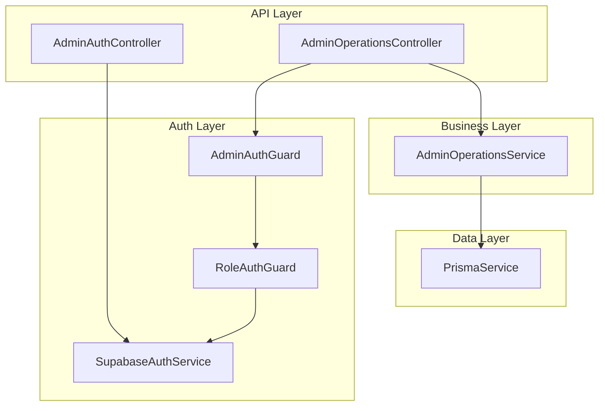
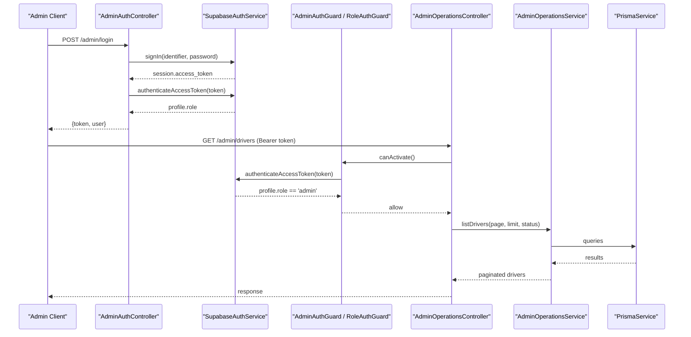
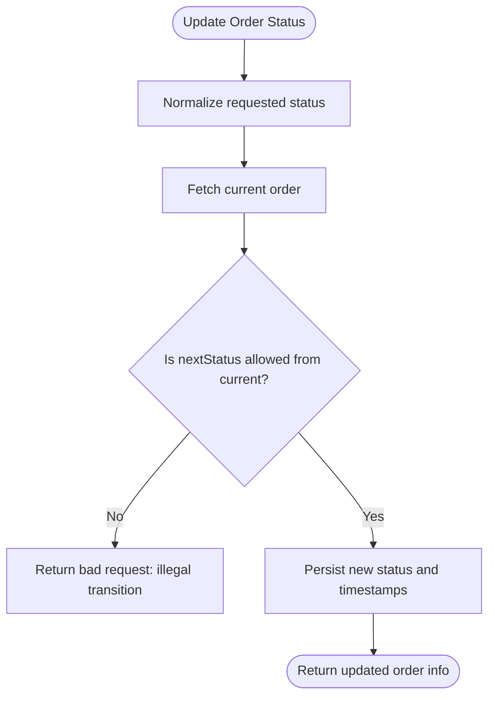
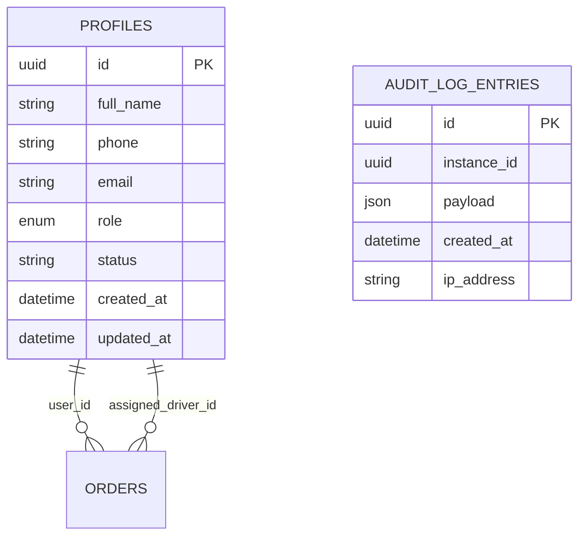
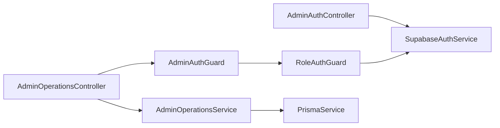

# Role Management and Administration

<cite>
**Referenced Files in This Document**
- [admin.module.ts](file://apps/api/src/modules/admin/admin.module.ts)
- [admin-auth.controller.ts](file://apps/api/src/modules/admin/admin-auth.controller.ts)
- [admin-operations.controller.ts](file://apps/api/src/modules/admin/admin-operations.controller.ts)
- [admin-operations.service.ts](file://apps/api/src/modules/admin/admin-operations.service.ts)
- [role-auth.guard.ts](file://apps/api/src/auth/role-auth.guard.ts)
- [admin-auth.guard.ts](file://apps/api/src/auth/admin-auth.guard.ts)
- [supabase-auth.service.ts](file://apps/api/src/auth/supabase-auth.service.ts)
- [schema.prisma](file://apps/api/prisma/schema.prisma)
</cite>

## Table of Contents
1. Introduction
2. Project Structure
3. Core Components
4. Architecture Overview
5. Detailed Component Analysis
6. Dependency Analysis
7. Performance Considerations
8. Troubleshooting Guide
9. Conclusion

## Introduction
This document explains role management and administrative functions exposed by the API service. It covers how administrators authenticate, how roles are enforced, and the available administrative endpoints for managing drivers and orders. It also documents validation rules, security considerations, and where audit-related data is modeled in the database schema.

## Project Structure
The role and admin functionality is implemented as a NestJS module with dedicated controllers and guards:
- Admin module registers authentication and operations controllers and services.
- Authentication uses Supabase tokens and enforces role checks via guards.
- Administrative operations are guarded to ensure only users with the required role can perform actions.

**Diagram sources**
- [admin.module.ts:1-13](file://apps/api/src/modules/admin/admin.module.ts#L1-L13)
- [admin-auth.controller.ts:1-37](file://apps/api/src/modules/admin/admin-auth.controller.ts#L1-L37)
- [admin-operations.controller.ts:1-72](file://apps/api/src/modules/admin/admin-operations.controller.ts#L1-L72)
- [role-auth.guard.ts:1-37](file://apps/api/src/auth/role-auth.guard.ts#L1-L37)
- [admin-auth.guard.ts:1-10](file://apps/api/src/auth/admin-auth.guard.ts#L1-L10)
- [supabase-auth.service.ts:1-80](file://apps/api/src/auth/supabase-auth.service.ts#L1-L80)

**Section sources**
- [admin.module.ts:1-13](file://apps/api/src/modules/admin/admin.module.ts#L1-L13)

## Core Components
- Admin authentication controller handles admin login and returns an access token along with profile information. It enforces that the authenticated user has the admin role.
- Role guard validates bearer tokens and ensures the caller’s role matches the required role before allowing access.
- Admin guard specializes the role guard to require the admin role.
- Admin operations service implements business logic for listing and managing drivers and orders, including status transitions and assignments.
- Prisma models define the application roles and related entities used by these flows.

Key responsibilities:
- Authentication and role enforcement at the gateway (guards).
- Business rules for driver lifecycle and order state machine.
- Data access through Prisma.

**Section sources**
- [admin-auth.controller.ts:1-37](file://apps/api/src/modules/admin/admin-auth.controller.ts#L1-L37)
- [role-auth.guard.ts:1-37](file://apps/api/src/auth/role-auth.guard.ts#L1-L37)
- [admin-auth.guard.ts:1-10](file://apps/api/src/auth/admin-auth.guard.ts#L1-L10)
- [admin-operations.service.ts:1-391](file://apps/api/src/modules/admin/admin-operations.service.ts#L1-L391)
- [schema.prisma:617-635](file://apps/api/prisma/schema.prisma#L617-L635)
- [schema.prisma:743-751](file://apps/api/prisma/schema.prisma#L743-L751)

## Architecture Overview
Administrative requests flow through guards that validate identity and role, then reach controllers that delegate to services for business logic and persistence.

**Diagram sources**
- [admin-auth.controller.ts:1-37](file://apps/api/src/modules/admin/admin-auth.controller.ts#L1-L37)
- [supabase-auth.service.ts:1-80](file://apps/api/src/auth/supabase-auth.service.ts#L1-L80)
- [admin-auth.guard.ts:1-10](file://apps/api/src/auth/admin-auth.guard.ts#L1-L10)
- [role-auth.guard.ts:1-37](file://apps/api/src/auth/role-auth.guard.ts#L1-L37)
- [admin-operations.controller.ts:1-72](file://apps/api/src/modules/admin/admin-operations.controller.ts#L1-L72)
- [admin-operations.service.ts:1-391](file://apps/api/src/modules/admin/admin-operations.service.ts#L1-L391)

## Detailed Component Analysis

### Admin Authentication
- Endpoint: POST /admin/login
- Behavior: Authenticates using Supabase, verifies the user’s role is admin, and returns an access token plus minimal profile fields.
- Validation: Identifier and password are validated as strings.
- Security: Only users with role admin can obtain an admin token; non-admins receive a forbidden error.

Example request/response shape:
- Request body: identifier, password
- Response: token, user (id, fullName, email, phone, role)

**Section sources**
- [admin-auth.controller.ts:5-37](file://apps/api/src/modules/admin/admin-auth.controller.ts#L5-L37)
- [supabase-auth.service.ts:26-33](file://apps/api/src/auth/supabase-auth.service.ts#L26-L33)
- [supabase-auth.service.ts:49-64](file://apps/api/src/auth/supabase-auth.service.ts#L49-L64)

### Role Enforcement Guards
- Role-based guard validates Bearer tokens and checks the caller’s role against a required role.
- Admin guard extends the role guard to enforce the admin role on protected routes.

Validation and error handling:
- Missing or malformed Authorization header raises unauthorized errors.
- Insufficient permissions raise forbidden errors when role does not match.

**Section sources**
- [role-auth.guard.ts:1-37](file://apps/api/src/auth/role-auth.guard.ts#L1-L37)
- [admin-auth.guard.ts:1-10](file://apps/api/src/auth/admin-auth.guard.ts#L1-L10)

### Administrative Operations Endpoints
All endpoints under /admin are protected by the admin guard.

- List drivers: GET /admin/drivers?page=...&limit=...&status=...
  - Returns paginated drivers with user details and driver profile summary.
- Get driver: GET /admin/drivers/:id
  - Returns a single driver by id or throws not found.
- Approve driver: PATCH /admin/drivers/:id/approve
  - Sets driver status to approved and marks the associated profile active.
- Reject driver: PATCH /admin/drivers/:id/reject
  - Sets driver status to rejected and marks the associated profile inactive; stores reason.
- Suspend driver: PATCH /admin/drivers/:id/suspend
  - Suspends driver and updates profile status; stores reason.
- List orders: GET /admin/orders?page=...&limit=...&status=...
  - Returns paginated orders with items and normalized status.
- Assign order: POST /admin/orders/:id/assign
  - Assigns an eligible driver to an order if the order is in an assignable state.
- Update order status: PATCH /admin/orders/:id/status
  - Updates order status only if the transition is allowed by the canonical lifecycle.
- Stats: GET /admin/stats
  - Returns active deliveries, today’s delivered count, and revenue.

Validation and business rules:
- Driver assignment requires a valid driverId and an eligible driver status.
- Order status updates must follow the canonical transitions; legacy aliases are normalized.
- Pagination parameters are bounded to safe ranges.

Error handling:
- Not found for missing drivers or orders.
- Bad request for invalid inputs or illegal transitions.
- Conflict for ineligible assignments or already assigned orders.

**Section sources**
- [admin-operations.controller.ts:15-72](file://apps/api/src/modules/admin/admin-operations.controller.ts#L15-L72)
- [admin-operations.service.ts:51-391](file://apps/api/src/modules/admin/admin-operations.service.ts#L51-L391)

### Order Lifecycle Transitions
Order status changes are constrained to a defined set of transitions. Legacy aliases are mapped to canonical states before validation.

**Diagram sources**
- [admin-operations.service.ts:19-45](file://apps/api/src/modules/admin/admin-operations.service.ts#L19-L45)
- [admin-operations.service.ts:266-294](file://apps/api/src/modules/admin/admin-operations.service.ts#L266-L294)

**Section sources**
- [admin-operations.service.ts:19-45](file://apps/api/src/modules/admin/admin-operations.service.ts#L19-L45)
- [admin-operations.service.ts:266-294](file://apps/api/src/modules/admin/admin-operations.service.ts#L266-L294)

### Database Models Relevant to Roles and Auditing
- Profiles store the application role and status per user.
- App roles include manager, pharmacist, driver, admin, customer.
- Audit log entries exist in the auth schema for tracking events.

**Diagram sources**
- [schema.prisma:617-635](file://apps/api/prisma/schema.prisma#L617-L635)
- [schema.prisma:743-751](file://apps/api/prisma/schema.prisma#L743-L751)
- [schema.prisma:15-24](file://apps/api/prisma/schema.prisma#L15-L24)
- [schema.prisma:556-592](file://apps/api/prisma/schema.prisma#L556-L592)

**Section sources**
- [schema.prisma:617-635](file://apps/api/prisma/schema.prisma#L617-L635)
- [schema.prisma:743-751](file://apps/api/prisma/schema.prisma#L743-L751)
- [schema.prisma:15-24](file://apps/api/prisma/schema.prisma#L15-L24)

## Dependency Analysis
- Controllers depend on guards for authorization and on services for business logic.
- Services depend on Prisma for data access.
- Authentication depends on Supabase client configuration and Prisma to resolve profiles.

**Diagram sources**
- [admin.module.ts:1-13](file://apps/api/src/modules/admin/admin.module.ts#L1-L13)
- [admin-auth.controller.ts:1-37](file://apps/api/src/modules/admin/admin-auth.controller.ts#L1-L37)
- [admin-operations.controller.ts:1-72](file://apps/api/src/modules/admin/admin-operations.controller.ts#L1-L72)
- [role-auth.guard.ts:1-37](file://apps/api/src/auth/role-auth.guard.ts#L1-L37)
- [admin-auth.guard.ts:1-10](file://apps/api/src/auth/admin-auth.guard.ts#L1-L10)
- [supabase-auth.service.ts:1-80](file://apps/api/src/auth/supabase-auth.service.ts#L1-L80)

**Section sources**
- [admin.module.ts:1-13](file://apps/api/src/modules/admin/admin.module.ts#L1-L13)

## Performance Considerations
- Pagination limits are enforced to prevent large result sets.
- Transactions are used for multi-step updates (e.g., approving drivers) to maintain consistency.
- Order status normalization reduces branching complexity and improves predictability.

[No sources needed since this section provides general guidance]

## Troubleshooting Guide
Common issues and resolutions:
- Unauthorized access: Ensure the Authorization header contains a valid Bearer token.
- Forbidden access: Verify the user’s role is admin for protected endpoints.
- Illegal order transition: Check the current order status and target status against allowed transitions.
- Driver not eligible: Confirm the driver’s status allows assignment.
- Not found: Validate IDs for drivers and orders.

Security considerations:
- Always protect admin endpoints with the admin guard.
- Validate all inputs on the server side.
- Use transactions for critical updates to avoid partial state changes.

**Section sources**
- [role-auth.guard.ts:11-36](file://apps/api/src/auth/role-auth.guard.ts#L11-L36)
- [admin-operations.service.ts:183-294](file://apps/api/src/modules/admin/admin-operations.service.ts#L183-L294)

## Conclusion
The system provides secure, role-gated administrative capabilities for managing drivers and orders. Authentication is handled via Supabase, role enforcement is centralized in guards, and business logic is encapsulated in services with strict validation and transactional integrity. The database schema supports application roles and includes audit logging structures for future auditing needs.

[No sources needed since this section summarizes without analyzing specific files]