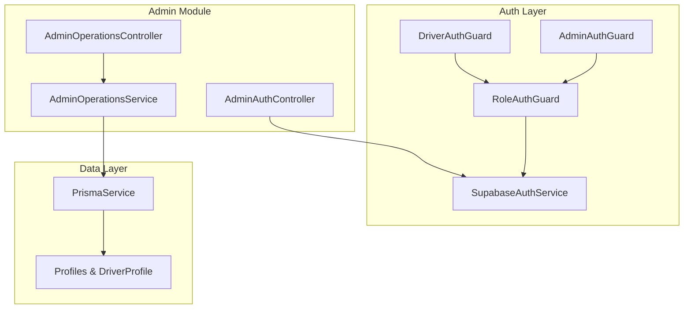
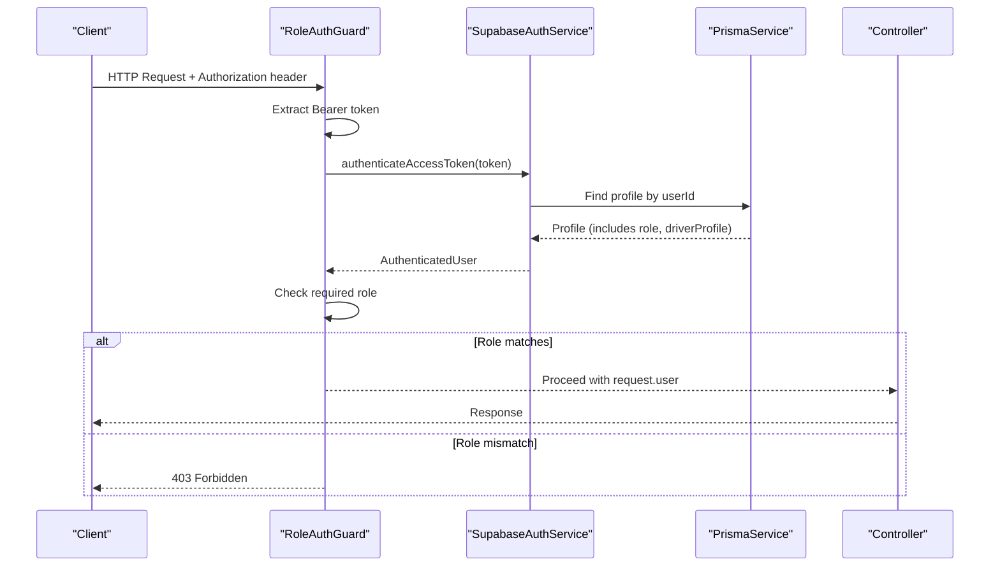
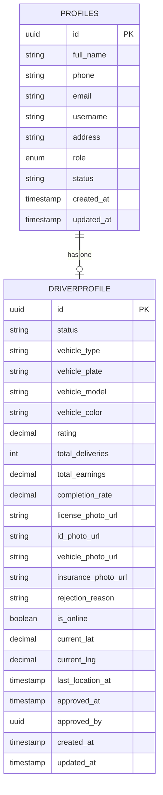
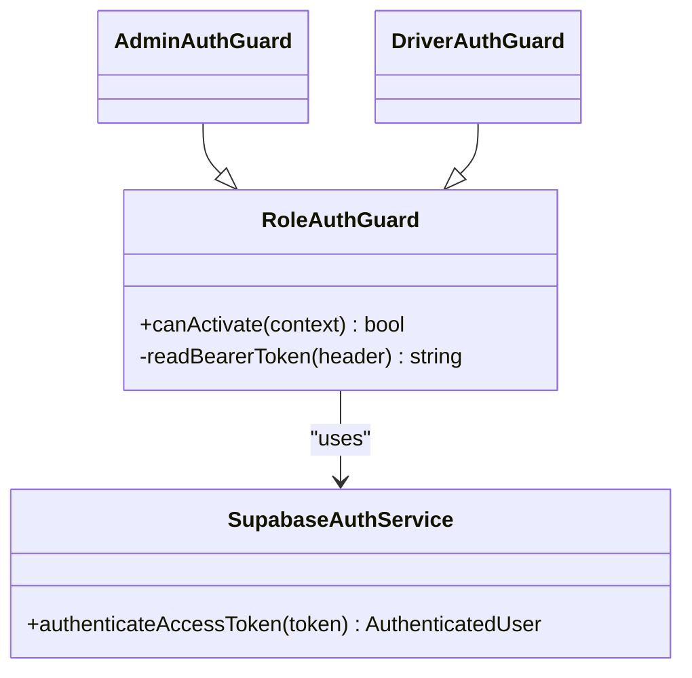
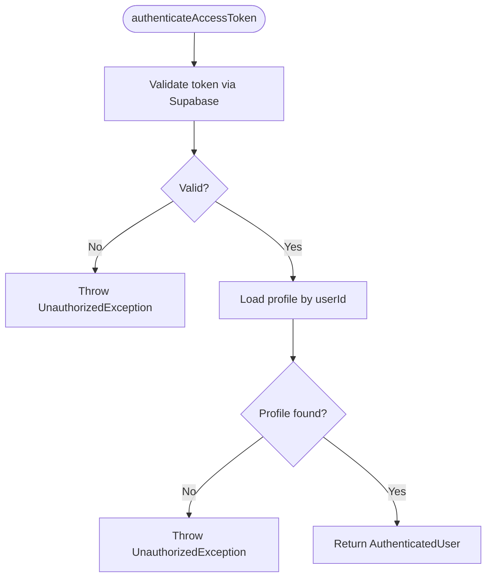
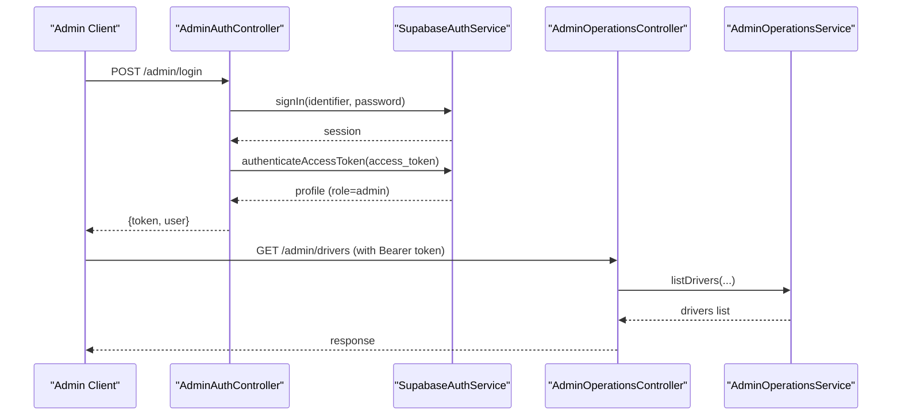
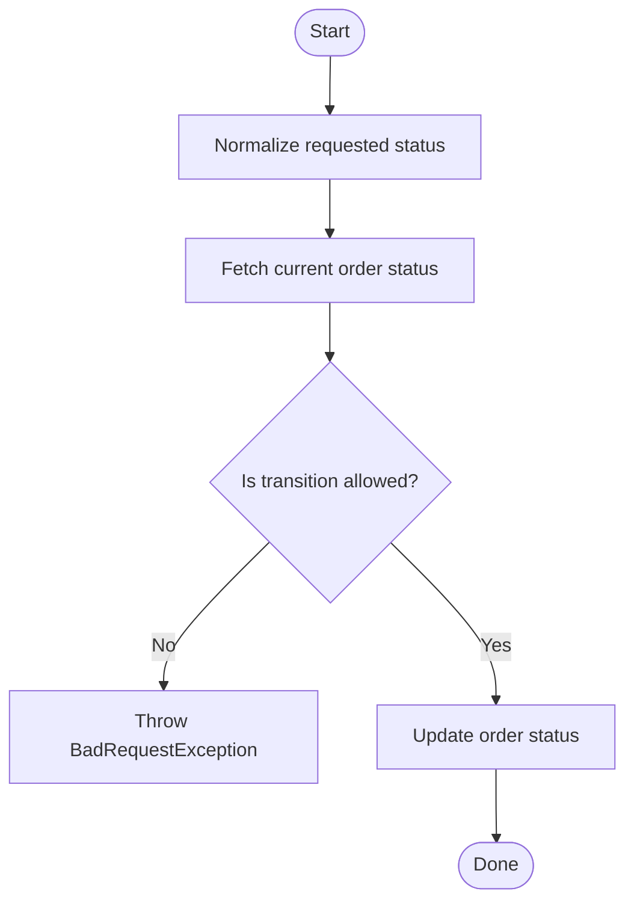
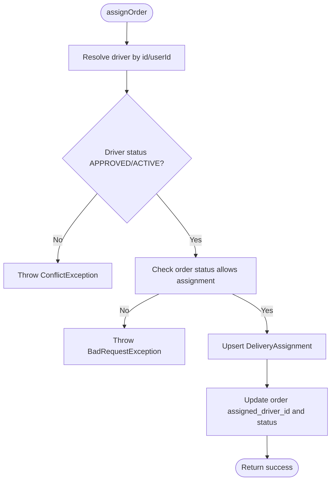
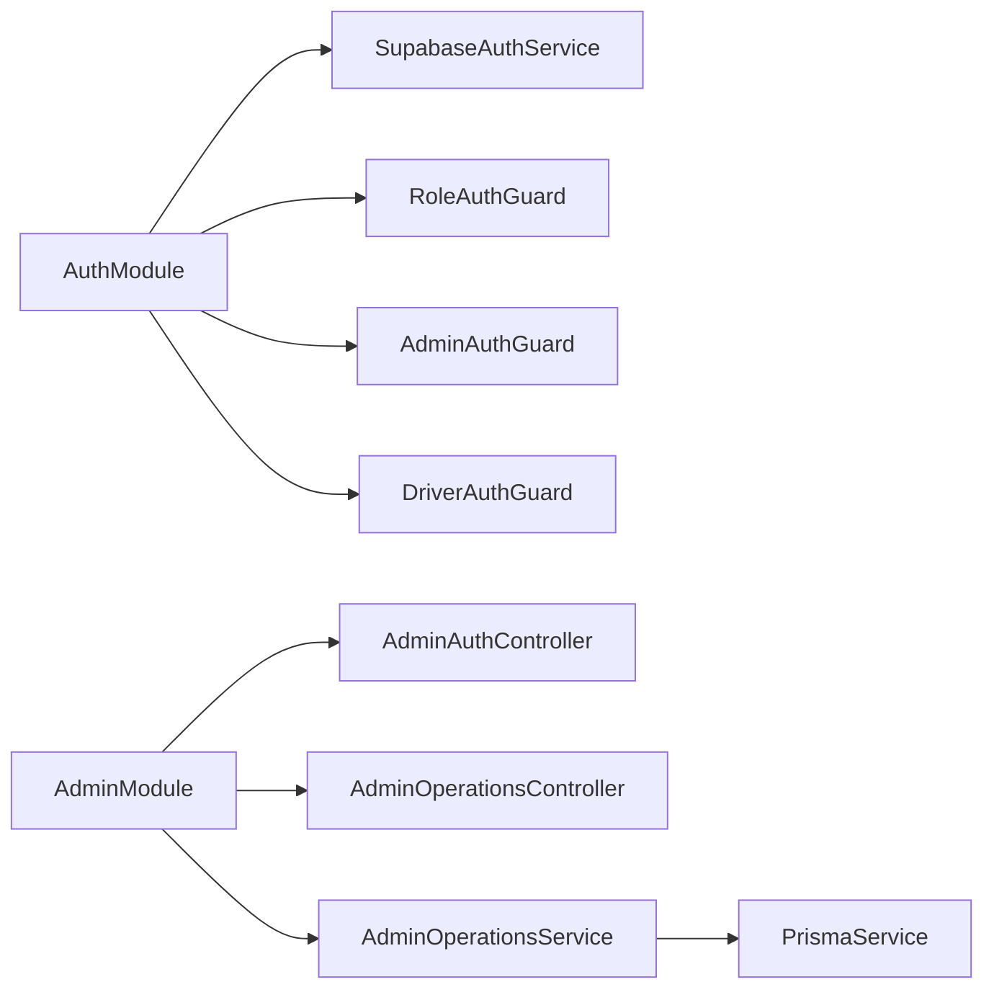

# Role-Based Access Control (RBAC)

<cite>
**Referenced Files in This Document**
- [admin-auth.guard.ts](file://apps/api/src/auth/admin-auth.guard.ts)
- [driver-auth.guard.ts](file://apps/api/src/auth/driver-auth.guard.ts)
- [role-auth.guard.ts](file://apps/api/src/auth/role-auth.guard.ts)
- [supabase-auth.service.ts](file://apps/api/src/auth/supabase-auth.service.ts)
- [auth.module.ts](file://apps/api/src/auth/auth.module.ts)
- [schema.prisma](file://apps/api/prisma/schema.prisma)
- [admin-auth.controller.ts](file://apps/api/src/modules/admin/admin-auth.controller.ts)
- [admin-operations.controller.ts](file://apps/api/src/modules/admin/admin-operations.controller.ts)
- [admin-operations.service.ts](file://apps/api/src/modules/admin/admin-operations.service.ts)
- [admin.module.ts](file://apps/api/src/modules/admin/admin.module.ts)
</cite>

## Table of Contents
1. [Introduction](#introduction)
2. [Project Structure](#project-structure)
3. [Core Components](#core-components)
4. [Architecture Overview](#architecture-overview)
5. [Detailed Component Analysis](#detailed-component-analysis)
6. [Dependency Analysis](#dependency-analysis)
7. [Performance Considerations](#performance-considerations)
8. [Troubleshooting Guide](#troubleshooting-guide)
9. [Conclusion](#conclusion)
10. [Appendices](#appendices)

## Introduction
This document explains the role-based access control system implemented in the API service. It covers available roles, guard implementations for protecting routes and endpoints, how roles are assigned to users, permission checks, and administrative functions for managing drivers and orders. The system uses Supabase Auth for token validation and Prisma to read user profiles and related data from a PostgreSQL database.

## Project Structure
The RBAC implementation is centered around:
- Authentication and authorization modules under apps/api/src/auth
- Admin module under apps/api/src/modules/admin
- Database schema defining roles and relationships under apps/api/prisma/schema.prisma

**Diagram sources**
- [auth.module.ts:1-13](file://apps/api/src/auth/auth.module.ts#L1-L13)
- [admin.module.ts:1-13](file://apps/api/src/modules/admin/admin.module.ts#L1-L13)
- [supabase-auth.service.ts:1-80](file://apps/api/src/auth/supabase-auth.service.ts#L1-L80)
- [role-auth.guard.ts:1-37](file://apps/api/src/auth/role-auth.guard.ts#L1-L37)
- [admin-auth.guard.ts:1-10](file://apps/api/src/auth/admin-auth.guard.ts#L1-L10)
- [driver-auth.guard.ts:1-10](file://apps/api/src/auth/driver-auth.guard.ts#L1-L10)
- [admin-auth.controller.ts:1-37](file://apps/api/src/modules/admin/admin-auth.controller.ts#L1-L37)
- [admin-operations.controller.ts:1-72](file://apps/api/src/modules/admin/admin-operations.controller.ts#L1-L72)
- [admin-operations.service.ts:1-391](file://apps/api/src/modules/admin/admin-operations.service.ts#L1-L391)

**Section sources**
- [auth.module.ts:1-13](file://apps/api/src/auth/auth.module.ts#L1-L13)
- [admin.module.ts:1-13](file://apps/api/src/modules/admin/admin.module.ts#L1-L13)

## Core Components
- Roles and permissions hierarchy:
  - Defined by the app_role enum with values: manager, pharmacist, driver, admin, customer.
  - Profiles store the current role per user and determine access at the application layer.
- Guards:
  - RoleAuthGuard validates tokens and enforces a required role.
  - AdminAuthGuard and DriverAuthGuard specialize guards for specific roles.
- Authentication service:
  - SupabaseAuthService validates access tokens via Supabase and loads profile data including driverProfile when needed.
- Admin APIs:
  - AdminAuthController provides an admin login that enforces admin role.
  - AdminOperationsController exposes admin-only endpoints for driver and order management.

**Section sources**
- [schema.prisma:743-751](file://apps/api/prisma/schema.prisma#L743-L751)
- [schema.prisma:617-635](file://apps/api/prisma/schema.prisma#L617-L635)
- [role-auth.guard.ts:1-37](file://apps/api/src/auth/role-auth.guard.ts#L1-L37)
- [admin-auth.guard.ts:1-10](file://apps/api/src/auth/admin-auth.guard.ts#L1-L10)
- [driver-auth.guard.ts:1-10](file://apps/api/src/auth/driver-auth.guard.ts#L1-L10)
- [supabase-auth.service.ts:1-80](file://apps/api/src/auth/supabase-auth.service.ts#L1-L80)
- [admin-auth.controller.ts:1-37](file://apps/api/src/modules/admin/admin-auth.controller.ts#L1-L37)
- [admin-operations.controller.ts:1-72](file://apps/api/src/modules/admin/admin-operations.controller.ts#L1-L72)

## Architecture Overview
The request flow for protected endpoints:
- Client sends a request with a Bearer token.
- Guard extracts the token, authenticates via Supabase, loads the user profile from Prisma, and verifies the role.
- If authorized, the request proceeds to the controller/service; otherwise, an error is thrown.

**Diagram sources**
- [role-auth.guard.ts:11-36](file://apps/api/src/auth/role-auth.guard.ts#L11-L36)
- [supabase-auth.service.ts:49-64](file://apps/api/src/auth/supabase-auth.service.ts#L49-L64)

## Detailed Component Analysis

### Roles and Permission Model
- Roles are stored on the profiles table and enumerated in the schema.
- Default role for new profiles is customer.
- Driver-specific details are linked via a one-to-one relationship to profiles through DriverProfile.

**Diagram sources**
- [schema.prisma:617-635](file://apps/api/prisma/schema.prisma#L617-L635)
- [schema.prisma:743-751](file://apps/api/prisma/schema.prisma#L743-L751)

**Section sources**
- [schema.prisma:617-635](file://apps/api/prisma/schema.prisma#L617-L635)
- [schema.prisma:743-751](file://apps/api/prisma/schema.prisma#L743-L751)

### Guard Implementations
- RoleAuthGuard:
  - Validates Bearer token format.
  - Authenticates token using SupabaseAuthService.
  - Loads profile and checks if profile.role matches the required role.
  - Attaches user context to the request for downstream use.
- AdminAuthGuard:
  - Extends RoleAuthGuard with required role set to admin.
- DriverAuthGuard:
  - Extends RoleAuthGuard with required role set to driver.

**Diagram sources**
- [role-auth.guard.ts:1-37](file://apps/api/src/auth/role-auth.guard.ts#L1-L37)
- [admin-auth.guard.ts:1-10](file://apps/api/src/auth/admin-auth.guard.ts#L1-L10)
- [driver-auth.guard.ts:1-10](file://apps/api/src/auth/driver-auth.guard.ts#L1-L10)
- [supabase-auth.service.ts:1-80](file://apps/api/src/auth/supabase-auth.service.ts#L1-L80)

**Section sources**
- [role-auth.guard.ts:1-37](file://apps/api/src/auth/role-auth.guard.ts#L1-L37)
- [admin-auth.guard.ts:1-10](file://apps/api/src/auth/admin-auth.guard.ts#L1-L10)
- [driver-auth.guard.ts:1-10](file://apps/api/src/auth/driver-auth.guard.ts#L1-L10)

### Authentication Flow and Token Handling
- SupabaseAuthService:
  - Uses service role key to call Supabase auth.getUser for token introspection.
  - Retrieves profile via Prisma, including driverProfile when needed.
  - Throws UnauthorizedException for invalid/expired tokens or missing profiles.

**Diagram sources**
- [supabase-auth.service.ts:49-64](file://apps/api/src/auth/supabase-auth.service.ts#L49-L64)

**Section sources**
- [supabase-auth.service.ts:1-80](file://apps/api/src/auth/supabase-auth.service.ts#L1-L80)

### Admin Role Enforcement and APIs
- Admin login endpoint enforces admin role after authentication.
- Admin operations controller is guarded globally with AdminAuthGuard.
- Endpoints include listing/approving/rejecting/suspending drivers and managing orders.

**Diagram sources**
- [admin-auth.controller.ts:17-36](file://apps/api/src/modules/admin/admin-auth.controller.ts#L17-L36)
- [admin-operations.controller.ts:15-72](file://apps/api/src/modules/admin/admin-operations.controller.ts#L15-L72)
- [admin-operations.service.ts:51-73](file://apps/api/src/modules/admin/admin-operations.service.ts#L51-L73)

**Section sources**
- [admin-auth.controller.ts:1-37](file://apps/api/src/modules/admin/admin-auth.controller.ts#L1-L37)
- [admin-operations.controller.ts:1-72](file://apps/api/src/modules/admin/admin-operations.controller.ts#L1-L72)
- [admin-operations.service.ts:1-391](file://apps/api/src/modules/admin/admin-operations.service.ts#L1-L391)

### Order Status Transitions (Admin)
- Admin can update order status only along allowed transitions defined in the service.
- Normalization handles legacy aliases to canonical states.

**Diagram sources**
- [admin-operations.service.ts:19-45](file://apps/api/src/modules/admin/admin-operations.service.ts#L19-L45)
- [admin-operations.service.ts:266-294](file://apps/api/src/modules/admin/admin-operations.service.ts#L266-L294)

**Section sources**
- [admin-operations.service.ts:19-45](file://apps/api/src/modules/admin/admin-operations.service.ts#L19-L45)
- [admin-operations.service.ts:266-294](file://apps/api/src/modules/admin/admin-operations.service.ts#L266-L294)

### Driver Assignment Logic
- Admin assigns orders to eligible drivers based on driver status and order lifecycle state.
- Ensures no conflicting assignments and persists delivery assignment records.

**Diagram sources**
- [admin-operations.service.ts:183-264](file://apps/api/src/modules/admin/admin-operations.service.ts#L183-L264)

**Section sources**
- [admin-operations.service.ts:183-264](file://apps/api/src/modules/admin/admin-operations.service.ts#L183-L264)

## Dependency Analysis
- Modules:
  - AuthModule exports SupabaseAuthService and guards.
  - AdminModule imports AuthModule and PrismaModule to provide admin controllers and services.
- Service dependencies:
  - Guards depend on SupabaseAuthService for token validation.
  - AdminOperationsService depends on PrismaService for data access.

**Diagram sources**
- [auth.module.ts:1-13](file://apps/api/src/auth/auth.module.ts#L1-L13)
- [admin.module.ts:1-13](file://apps/api/src/modules/admin/admin.module.ts#L1-L13)

**Section sources**
- [auth.module.ts:1-13](file://apps/api/src/auth/auth.module.ts#L1-L13)
- [admin.module.ts:1-13](file://apps/api/src/modules/admin/admin.module.ts#L1-L13)

## Performance Considerations
- Token validation is performed per request; ensure Supabase service key and URL are configured to minimize latency.
- Profile loading includes driverProfile only when necessary; avoid unnecessary joins in other services.
- Pagination and limits are enforced in admin listing endpoints to prevent large result sets.

[No sources needed since this section provides general guidance]

## Troubleshooting Guide
Common issues and resolutions:
- Invalid or expired token:
  - Ensure the client sends a valid Bearer token obtained from Supabase login.
  - Verify SUPABASE_URL and SUPABASE_SERVICE_ROLE_KEY environment variables.
- Insufficient permissions:
  - Confirm the user’s profile.role matches the required role for the endpoint.
  - For admin endpoints, ensure the profile role is admin.
- Profile not found:
  - Ensure a corresponding profile exists in the database for the authenticated user.
- Illegal order transitions:
  - Only allow transitions defined in the canonical order state machine.

**Section sources**
- [role-auth.guard.ts:30-36](file://apps/api/src/auth/role-auth.guard.ts#L30-L36)
- [supabase-auth.service.ts:49-64](file://apps/api/src/auth/supabase-auth.service.ts#L49-L64)
- [admin-auth.controller.ts:17-36](file://apps/api/src/modules/admin/admin-auth.controller.ts#L17-L36)
- [admin-operations.service.ts:266-294](file://apps/api/src/modules/admin/admin-operations.service.ts#L266-L294)

## Conclusion
The RBAC system combines Supabase Auth for token validation with Prisma-backed profile lookups to enforce role-based access. Guards provide reusable, composable protection for routes, while admin APIs offer controlled operations for driver and order management. The model supports multiple roles and extensibility for future permission requirements.

[No sources needed since this section summarizes without analyzing specific files]

## Appendices

### Available Roles and Typical Permissions
- admin: Full administrative access to manage drivers and orders.
- driver: Access to driver-specific features and deliveries.
- pharmacist: Access to pharmacy-related operations (as modeled in the domain).
- customer: Standard customer-facing operations.
- manager: Additional managerial capabilities as modeled in the domain.

Permissions are enforced primarily by role checks in guards and business logic in services.

**Section sources**
- [schema.prisma:743-751](file://apps/api/prisma/schema.prisma#L743-L751)

### Guard Usage Examples
- Protecting admin routes:
  - Apply AdminAuthGuard at the controller level to restrict to admin users.
- Protecting driver routes:
  - Apply DriverAuthGuard to restrict to driver users.
- Generic role guard:
  - Use RoleAuthGuard with a custom required role for specialized endpoints.

**Section sources**
- [admin-operations.controller.ts:15-17](file://apps/api/src/modules/admin/admin-operations.controller.ts#L15-L17)
- [role-auth.guard.ts:1-37](file://apps/api/src/auth/role-auth.guard.ts#L1-L37)

### Role Management APIs
- Admin login:
  - POST /admin/login returns a token and user info after verifying admin role.
- Driver management:
  - List, approve, reject, suspend drivers via admin endpoints.
- Order management:
  - Assign orders to drivers and update order status within allowed transitions.

**Section sources**
- [admin-auth.controller.ts:17-36](file://apps/api/src/modules/admin/admin-auth.controller.ts#L17-L36)
- [admin-operations.controller.ts:20-70](file://apps/api/src/modules/admin/admin-operations.controller.ts#L20-L70)
- [admin-operations.service.ts:84-181](file://apps/api/src/modules/admin/admin-operations.service.ts#L84-L181)
- [admin-operations.service.ts:183-294](file://apps/api/src/modules/admin/admin-operations.service.ts#L183-L294)