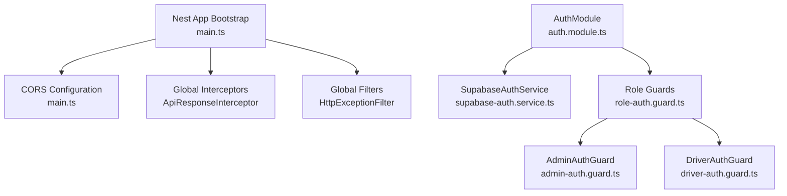
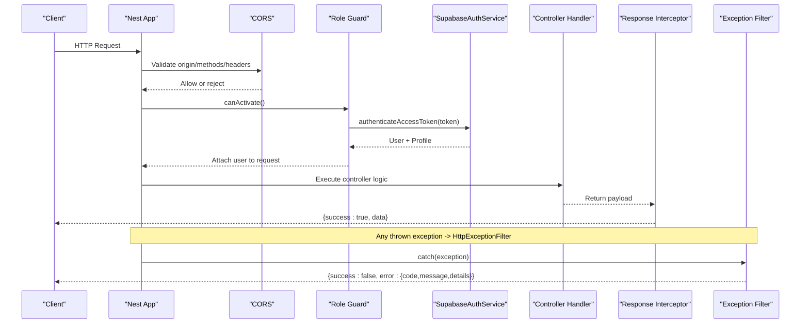
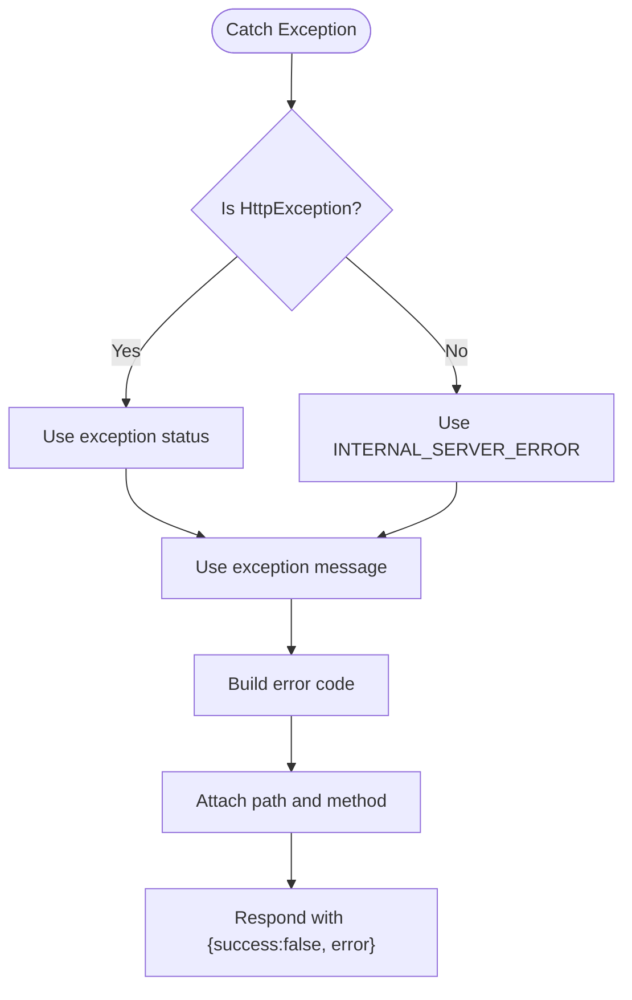
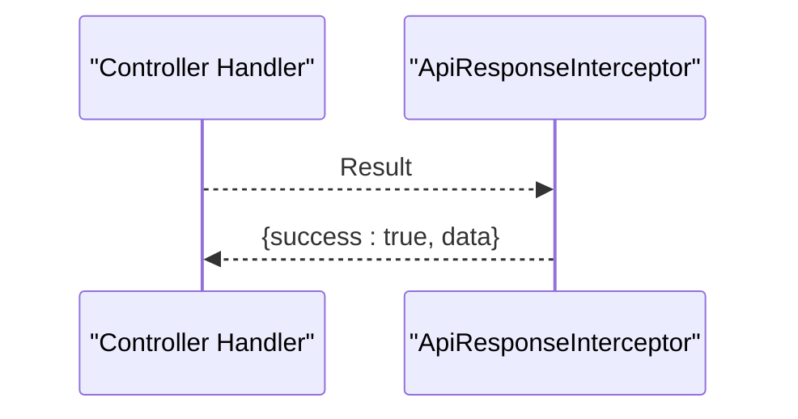
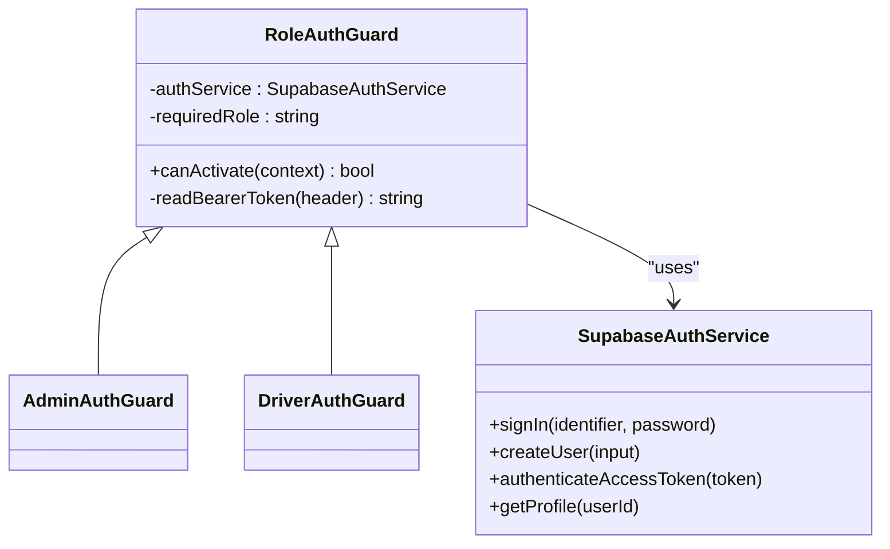
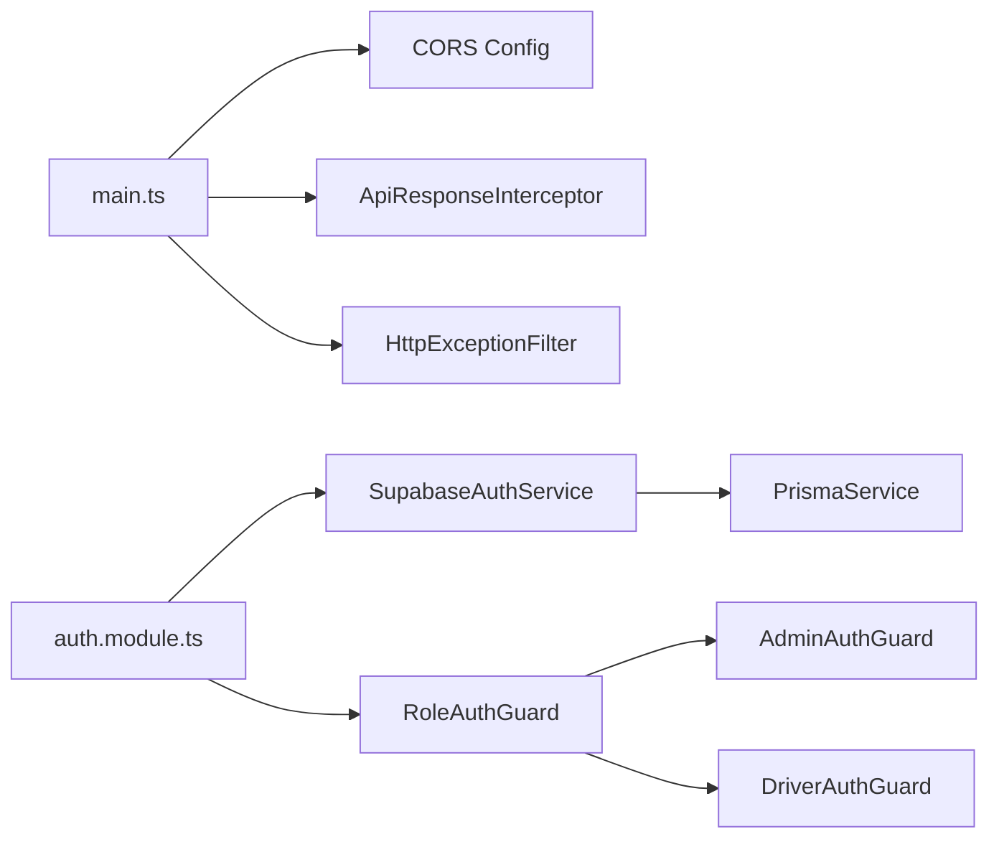

# Security Middleware & Validation

<cite>
**Referenced Files in This Document**
- [main.ts](file://apps/api/src/main.ts)
- [app.module.ts](file://apps/api/src/app.module.ts)
- [http-exception.filter.ts](file://apps/api/src/common/http-exception.filter.ts)
- [api-response.interceptor.ts](file://apps/api/src/common/api-response.interceptor.ts)
- [auth.module.ts](file://apps/api/src/auth/auth.module.ts)
- [supabase-auth.service.ts](file://apps/api/src/auth/supabase-auth.service.ts)
- [role-auth.guard.ts](file://apps/api/src/auth/role-auth.guard.ts)
- [admin-auth.guard.ts](file://apps/api/src/auth/admin-auth.guard.ts)
- [driver-auth.guard.ts](file://apps/api/src/auth/driver-auth.guard.ts)
</cite>

## Table of Contents
1. Introduction
2. Project Structure
3. Core Components
4. Architecture Overview
5. Detailed Component Analysis
6. Dependency Analysis
7. Performance Considerations
8. Troubleshooting Guide
9. Conclusion

## Introduction
This document explains the security middleware and request validation system implemented in the API application. It covers HTTP exception filtering, global error handling, standardized API response formatting, CORS configuration, authentication and authorization via Supabase, and guidance for input validation, sanitization, rate limiting, CSRF protection, logging strategies, and security best practices.

## Project Structure
The API is a NestJS application that configures global interceptors and filters at bootstrap, sets up CORS, and wires authentication modules. The core security-related pieces are:
- Bootstrap and global middleware setup
- Global HTTP exception filter for consistent error responses
- Global response interceptor for standardized success payloads
- Authentication service and role-based guards
- Module composition to expose auth capabilities

**Diagram sources**
- [main.ts:7-31](file://apps/api/src/main.ts#L7-L31)
- [api-response.interceptor.ts:10-21](file://apps/api/src/common/api-response.interceptor.ts#L10-L21)
- [http-exception.filter.ts:9-44](file://apps/api/src/common/http-exception.filter.ts#L9-L44)
- [auth.module.ts:8-12](file://apps/api/src/auth/auth.module.ts#L8-L12)
- [supabase-auth.service.ts:11-64](file://apps/api/src/auth/supabase-auth.service.ts#L11-L64)
- [role-auth.guard.ts:4-36](file://apps/api/src/auth/role-auth.guard.ts#L4-L36)
- [admin-auth.guard.ts:5-9](file://apps/api/src/auth/admin-auth.guard.ts#L5-L9)
- [driver-auth.guard.ts:5-9](file://apps/api/src/auth/driver-auth.guard.ts#L5-L9)

**Section sources**
- [main.ts:7-31](file://apps/api/src/main.ts#L7-L31)
- [app.module.ts:14-27](file://apps/api/src/app.module.ts#L14-L27)

## Core Components
- Global HTTP Exception Filter: Normalizes all errors into a consistent JSON structure with success flag, data, and error object including code, message, and contextual details.
- Global Response Interceptor: Wraps successful handler results into a unified envelope with success flag and data.
- CORS Configuration: Explicitly allows specific origins, methods, headers, credentials, and caches preflight responses.
- Authentication Service: Validates tokens against Supabase, resolves user profiles from Prisma, and supports sign-in and user creation flows.
- Role-Based Guards: Enforce required roles (admin, driver) by validating bearer tokens and profile roles; attach authenticated user context to requests.

Key responsibilities:
- Standardized responses reduce client parsing complexity and improve consistency.
- Centralized error handling ensures uniform error codes and safe messages.
- Strict CORS prevents unintended cross-origin access while supporting development workflows.
- Token-based auth with role checks provides secure endpoint protection.

**Section sources**
- [http-exception.filter.ts:9-44](file://apps/api/src/common/http-exception.filter.ts#L9-L44)
- [api-response.interceptor.ts:10-21](file://apps/api/src/common/api-response.interceptor.ts#L10-L21)
- [main.ts:10-28](file://apps/api/src/main.ts#L10-L28)
- [supabase-auth.service.ts:26-64](file://apps/api/src/auth/supabase-auth.service.ts#L26-L64)
- [role-auth.guard.ts:11-36](file://apps/api/src/auth/role-auth.guard.ts#L11-L36)

## Architecture Overview
The request lifecycle flows through global middleware before reaching route handlers. Errors are caught centrally, and responses are normalized globally.

**Diagram sources**
- [main.ts:10-31](file://apps/api/src/main.ts#L10-L31)
- [role-auth.guard.ts:11-36](file://apps/api/src/auth/role-auth.guard.ts#L11-L36)
- [supabase-auth.service.ts:49-64](file://apps/api/src/auth/supabase-auth.service.ts#L49-L64)
- [api-response.interceptor.ts:12-19](file://apps/api/src/common/api-response.interceptor.ts#L12-L19)
- [http-exception.filter.ts:11-43](file://apps/api/src/common/http-exception.filter.ts#L11-L43)

## Detailed Component Analysis

### Global HTTP Exception Filter
- Purpose: Convert all exceptions into a consistent error envelope.
- Behavior:
  - Detects Nest HttpException to derive status and message; otherwise defaults to internal server error.
  - Produces a structured error object with code, message, and contextual details such as path and method.
- Impact: Ensures clients receive predictable error shapes and avoids leaking stack traces.

**Diagram sources**
- [http-exception.filter.ts:11-43](file://apps/api/src/common/http-exception.filter.ts#L11-L43)

**Section sources**
- [http-exception.filter.ts:9-44](file://apps/api/src/common/http-exception.filter.ts#L9-L44)

### Global Response Interceptor
- Purpose: Wrap successful handler outputs into a standard envelope.
- Behavior: Maps handler result to an object with success flag and data field; error is null on success.
- Impact: Simplifies client-side response handling and unifies success/error structures.

**Diagram sources**
- [api-response.interceptor.ts:12-19](file://apps/api/src/common/api-response.interceptor.ts#L12-L19)

**Section sources**
- [api-response.interceptor.ts:10-21](file://apps/api/src/common/api-response.interceptor.ts#L10-L21)

### CORS Configuration
- Purpose: Restrict cross-origin requests to trusted domains and control allowed methods and headers.
- Behavior:
  - Whitelists production origins and local development addresses.
  - Allows necessary headers including Authorization and Accept.
  - Enables credentials and caches preflight responses for performance.
- Best Practices:
  - Keep origins explicit; avoid wildcard in production.
  - Limit allowed methods to only what endpoints require.
  - Ensure credentials are only used when necessary.

**Section sources**
- [main.ts:10-28](file://apps/api/src/main.ts#L10-L28)

### Authentication and Authorization
- SupabaseAuthService:
  - Validates tokens via Supabase and fetches user profiles from Prisma.
  - Supports sign-in and user creation flows.
  - Throws appropriate unauthorized exceptions for invalid tokens or missing profiles.
- Role-Based Guards:
  - Extract Bearer token from Authorization header.
  - Validate token and ensure profile role matches required role.
  - Attach authenticated user context to request for downstream use.

**Diagram sources**
- [supabase-auth.service.ts:11-64](file://apps/api/src/auth/supabase-auth.service.ts#L11-L64)
- [role-auth.guard.ts:4-36](file://apps/api/src/auth/role-auth.guard.ts#L4-L36)
- [admin-auth.guard.ts:5-9](file://apps/api/src/auth/admin-auth.guard.ts#L5-L9)
- [driver-auth.guard.ts:5-9](file://apps/api/src/auth/driver-auth.guard.ts#L5-L9)

**Section sources**
- [supabase-auth.service.ts:26-64](file://apps/api/src/auth/supabase-auth.service.ts#L26-L64)
- [role-auth.guard.ts:11-36](file://apps/api/src/auth/role-auth.guard.ts#L11-L36)
- [auth.module.ts:8-12](file://apps/api/src/auth/auth.module.ts#L8-L12)

### Input Validation Patterns and Sanitization
- Recommended approach:
  - Use DTOs with validation decorators to validate incoming request bodies, query parameters, and path parameters.
  - Apply transformation pipes to coerce types and normalize inputs.
  - Sanitize strings to prevent injection and XSS by trimming, escaping, or using a sanitizer library where needed.
  - Validate file uploads with size/type constraints and scan for malicious content.
- Integration points:
  - Apply validation at controllers or via custom pipes to keep business logic clean.
  - Leverage the global exception filter to convert validation failures into standardized error envelopes.

[No sources needed since this section provides general guidance]

### Rate Limiting Implementation
- Recommended approach:
  - Implement per-IP or per-user rate limiting using a Redis-backed store to track request counts and enforce thresholds.
  - Configure different limits for sensitive endpoints (e.g., login, password reset).
  - Return standardized 429 responses wrapped by the global exception filter.
- Integration points:
  - Place rate limiting early in the pipeline to protect downstream services.
  - Log rate limit events for audit and alerting.

[No sources needed since this section provides general guidance]

### CSRF Protection Measures
- Recommendations:
  - For state-changing requests, validate CSRF tokens when cookies are used for session management.
  - Prefer token-based authentication (Bearer tokens) to mitigate CSRF risks.
  - If using same-site cookies, set SameSite and Secure flags appropriately.
- Integration points:
  - Add a CSRF guard for cookie-based sessions if applicable.
  - Combine with strict CORS and Origin checking.

[No sources needed since this section provides general guidance]

### Custom Middleware Creation and Request/Response Transformation
- Patterns:
  - Create middleware to parse and normalize headers, inject correlation IDs, or enrich requests with metadata.
  - Use interceptors for response transformation and logging around handler execution.
  - Compose multiple interceptors to build layered transformations (e.g., timing, metrics, masking sensitive fields).
- Best practices:
  - Keep middleware focused and testable.
  - Avoid heavy computation in middleware; offload to background jobs when necessary.

[No sources needed since this section provides general guidance]

### Security Headers Configuration
- Recommendations:
  - Set security headers such as Content-Security-Policy, X-Content-Type-Options, X-Frame-Options, Referrer-Policy, and Permissions-Policy.
  - Disable unnecessary features like caching for sensitive endpoints.
- Integration points:
  - Use a helmet-like solution or Express middleware to apply headers globally.
  - Validate headers in tests to ensure compliance.

[No sources needed since this section provides general guidance]

### Logging Strategies for Security Events and Audit Trails
- Recommendations:
  - Log authentication attempts, successes, and failures with minimal PII.
  - Record authorization decisions, including user ID, role, and target resource.
  - Capture request identifiers and timestamps for traceability.
  - Mask or omit sensitive fields (passwords, tokens) from logs.
- Integration points:
  - Use a structured logger and integrate with centralized log aggregation.
  - Emit alerts for anomalous patterns (e.g., repeated failures).

[No sources needed since this section provides general guidance]

## Dependency Analysis
The following diagram shows how the core security components depend on each other and on external services.

**Diagram sources**
- [main.ts:7-31](file://apps/api/src/main.ts#L7-L31)
- [auth.module.ts:8-12](file://apps/api/src/auth/auth.module.ts#L8-L12)
- [supabase-auth.service.ts:11-64](file://apps/api/src/auth/supabase-auth.service.ts#L11-L64)
- [role-auth.guard.ts:4-36](file://apps/api/src/auth/role-auth.guard.ts#L4-L36)
- [admin-auth.guard.ts:5-9](file://apps/api/src/auth/admin-auth.guard.ts#L5-L9)
- [driver-auth.guard.ts:5-9](file://apps/api/src/auth/driver-auth.guard.ts#L5-L9)

**Section sources**
- [main.ts:7-31](file://apps/api/src/main.ts#L7-L31)
- [auth.module.ts:8-12](file://apps/api/src/auth/auth.module.ts#L8-L12)

## Performance Considerations
- CORS preflight caching reduces OPTIONS overhead for cross-origin requests.
- Global interceptors and filters add minimal overhead but provide significant benefits for consistency and maintainability.
- Token validation should be cached judiciously if supported by the identity provider to reduce latency.
- Avoid heavy processing in middleware; prefer asynchronous tasks for expensive operations.

[No sources needed since this section provides general guidance]

## Troubleshooting Guide
Common issues and resolutions:
- Invalid or expired token:
  - Ensure Authorization header uses correct Bearer format.
  - Verify token validity and expiration; refresh if necessary.
- Insufficient permissions:
  - Confirm user profile role matches the required role for the endpoint.
- Unexpected errors:
  - Check global exception filter output for standardized error codes and messages.
  - Review logs for stack traces and contextual details.

**Section sources**
- [role-auth.guard.ts:30-36](file://apps/api/src/auth/role-auth.guard.ts#L30-L36)
- [supabase-auth.service.ts:49-64](file://apps/api/src/auth/supabase-auth.service.ts#L49-L64)
- [http-exception.filter.ts:11-43](file://apps/api/src/common/http-exception.filter.ts#L11-L43)

## Conclusion
The API implements a robust security foundation with global error handling, standardized responses, strict CORS, and token-based authentication with role enforcement. To further harden the system, adopt input validation and sanitization, implement rate limiting and CSRF protections, configure security headers, and establish comprehensive logging for security events and audit trails. These practices collectively enhance resilience, maintainability, and trustworthiness of the API surface.