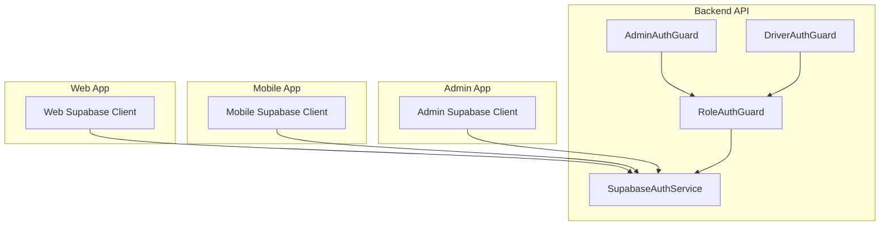
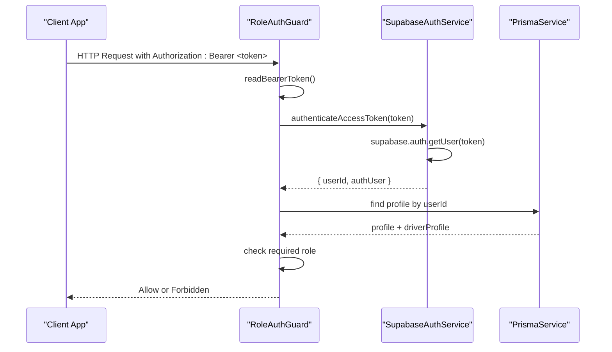
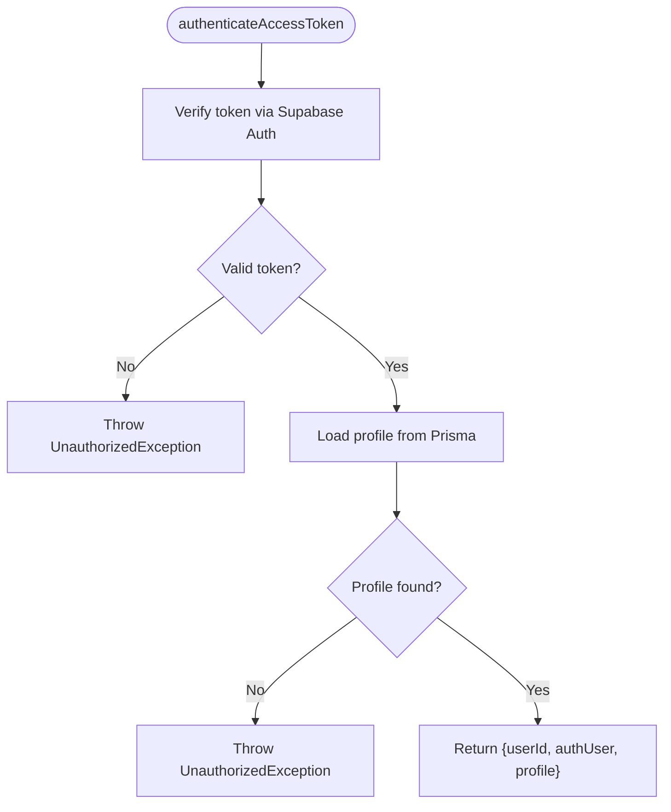
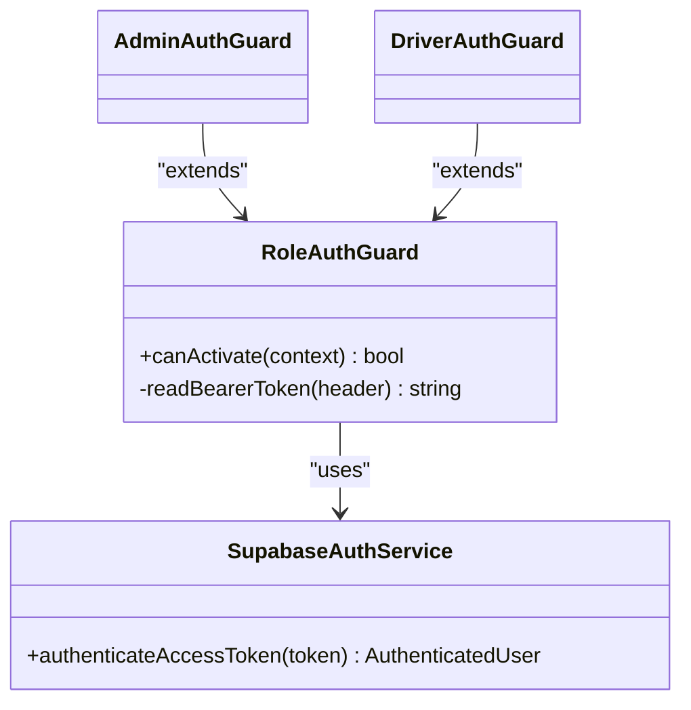
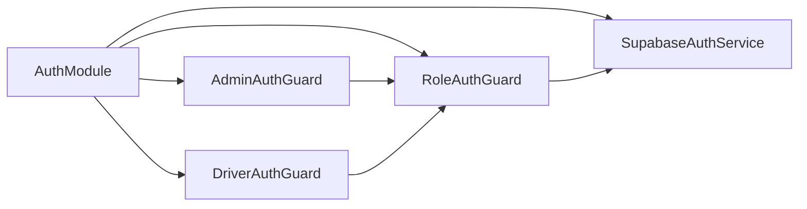

# Supabase Authentication Integration

<cite>
**Referenced Files in This Document**
- [supabase-auth.service.ts](file://apps/api/src/auth/supabase-auth.service.ts)
- [role-auth.guard.ts](file://apps/api/src/auth/role-auth.guard.ts)
- [admin-auth.guard.ts](file://apps/api/src/auth/admin-auth.guard.ts)
- [driver-auth.guard.ts](file://apps/api/src/auth/driver-auth.guard.ts)
- [auth.module.ts](file://apps/api/src/auth/auth.module.ts)
- [supabaseClient.ts](file://apps/shopper-web/src/lib/supabaseClient.ts)
- [supabase.ts (Admin)](file://apps/admin/src/lib/supabase.ts)
- [supabase.ts (Shopper Native)](file://apps/shopper-native/src/lib/supabase.ts)
</cite>

## Table of Contents
1. Introduction
2. Project Structure
3. Core Components
4. Architecture Overview
5. Detailed Component Analysis
6. Dependency Analysis
7. Performance Considerations
8. Troubleshooting Guide
9. Conclusion

## Introduction
This document explains how Supabase authentication is integrated across the project’s backend API and client applications. It covers the service implementation for sign-in, user creation, token validation, role-based access control, and how each client configures its Supabase client for secure sessions. It also outlines security measures such as service-role usage on the server, PKCE flows on mobile, session persistence on web, and environment configuration.

## Project Structure
Authentication spans three layers:
- Backend API (NestJS): Validates tokens, resolves profiles, enforces roles via guards.
- Web app: Uses a browser-based Supabase client with session persistence and URL-based session detection.
- Mobile app: Uses a React Native Supabase client with PKCE flow and persistent storage.
- Admin app: Uses an anon client but injects an admin JWT per request to enforce RLS and SECURITY DEFINER functions.

**Diagram sources**
- [supabase-auth.service.ts:1-80](file://apps/api/src/auth/supabase-auth.service.ts#L1-L80)
- [role-auth.guard.ts:1-37](file://apps/api/src/auth/role-auth.guard.ts#L1-L37)
- [admin-auth.guard.ts:1-10](file://apps/api/src/auth/admin-auth.guard.ts#L1-L10)
- [driver-auth.guard.ts:1-10](file://apps/api/src/auth/driver-auth.guard.ts#L1-L10)
- [supabaseClient.ts:1-40](file://apps/shopper-web/src/lib/supabaseClient.ts#L1-L40)
- [supabase.ts (Shopper Native):1-46](file://apps/shopper-native/src/lib/supabase.ts#L1-L46)
- [supabase.ts (Admin):1-47](file://apps/admin/src/lib/supabase.ts#L1-L47)

**Section sources**
- [supabase-auth.service.ts:1-80](file://apps/api/src/auth/supabase-auth.service.ts#L1-L80)
- [auth.module.ts:1-13](file://apps/api/src/auth/auth.module.ts#L1-L13)

## Core Components
- SupabaseAuthService: Handles sign-in, user creation, token authentication, and profile resolution. Uses service-role key on the server for privileged operations and disables session persistence/auto-refresh since it is server-side.
- Role-based Guards: Extract Bearer token, validate via SupabaseAuthService, enforce required role, and attach user context to requests.
- Client Configurations:
  - Web: Browser client with persisted sessions and URL-based session detection.
  - Mobile: RN client using PKCE flow, persistent storage, and manual deep link handling.
  - Admin: Anon client with per-request Authorization header injection to leverage RLS and SECURITY DEFINER functions.

**Section sources**
- [supabase-auth.service.ts:1-80](file://apps/api/src/auth/supabase-auth.service.ts#L1-L80)
- [role-auth.guard.ts:1-37](file://apps/api/src/auth/role-auth.guard.ts#L1-L37)
- [supabaseClient.ts:1-40](file://apps/shopper-web/src/lib/supabaseClient.ts#L1-L40)
- [supabase.ts (Shopper Native):1-46](file://apps/shopper-native/src/lib/supabase.ts#L1-L46)
- [supabase.ts (Admin):1-47](file://apps/admin/src/lib/supabase.ts#L1-L47)

## Architecture Overview
The API validates incoming requests by extracting the Bearer token from the Authorization header, verifying it against Supabase Auth, loading the associated profile from Prisma, and enforcing role-based access. Clients authenticate via their respective Supabase clients and send tokens to protected endpoints.

**Diagram sources**
- [role-auth.guard.ts:1-37](file://apps/api/src/auth/role-auth.guard.ts#L1-L37)
- [supabase-auth.service.ts:49-64](file://apps/api/src/auth/supabase-auth.service.ts#L49-L64)

## Detailed Component Analysis

### SupabaseAuthService
Responsibilities:
- Sign-in: Accepts email or phone; resolves email if needed; authenticates via Supabase Auth.
- User creation: Creates users with admin API, sets metadata, and auto-confirms email.
- Token authentication: Verifies token, loads profile from Prisma, and returns enriched user context.
- Profile lookup: Retrieves profile by userId.

Security notes:
- Uses service-role key on the server for privileged operations.
- Disables session persistence and auto-refresh since this is server-side.

**Diagram sources**
- [supabase-auth.service.ts:49-64](file://apps/api/src/auth/supabase-auth.service.ts#L49-L64)

**Section sources**
- [supabase-auth.service.ts:1-80](file://apps/api/src/auth/supabase-auth.service.ts#L1-L80)

### Role-Based Access Control (Guards)
Responsibilities:
- Extract Bearer token from Authorization header.
- Validate token and load profile.
- Enforce required role (admin or driver).
- Attach user context to request for downstream handlers.

**Diagram sources**
- [role-auth.guard.ts:1-37](file://apps/api/src/auth/role-auth.guard.ts#L1-L37)
- [admin-auth.guard.ts:1-10](file://apps/api/src/auth/admin-auth.guard.ts#L1-L10)
- [driver-auth.guard.ts:1-10](file://apps/api/src/auth/driver-auth.guard.ts#L1-L10)
- [supabase-auth.service.ts:49-64](file://apps/api/src/auth/supabase-auth.service.ts#L49-L64)

**Section sources**
- [role-auth.guard.ts:1-37](file://apps/api/src/auth/role-auth.guard.ts#L1-L37)
- [admin-auth.guard.ts:1-10](file://apps/api/src/auth/admin-auth.guard.ts#L1-L10)
- [driver-auth.guard.ts:1-10](file://apps/api/src/auth/driver-auth.guard.ts#L1-L10)

### Client Configurations

#### Web Client
- Uses public env variables for URL and anon key.
- Enables session persistence and URL-based session detection.
- Provides a factory function to retrieve the client and surface configuration errors.

**Section sources**
- [supabaseClient.ts:1-40](file://apps/shopper-web/src/lib/supabaseClient.ts#L1-L40)

#### Mobile Client
- Reads Expo public env variables with local fallbacks.
- Uses PKCE flow for secure deep-link-based authentication on mobile.
- Persists sessions in AsyncStorage and disables automatic URL detection to handle deep links manually.

**Section sources**
- [supabase.ts (Shopper Native):1-46](file://apps/shopper-native/src/lib/supabase.ts#L1-L46)

#### Admin Client
- Uses anon key but injects current admin JWT per request via Authorization header.
- Ensures RLS and SECURITY DEFINER functions see the caller’s JWT for authorization checks.

**Section sources**
- [supabase.ts (Admin):1-47](file://apps/admin/src/lib/supabase.ts#L1-L47)

## Dependency Analysis
- The AuthModule registers guards and the SupabaseAuthService, exporting them for use across modules.
- Guards depend on SupabaseAuthService for token verification and profile resolution.
- Clients depend on environment variables to configure Supabase clients appropriately for their runtime.

**Diagram sources**
- [auth.module.ts:1-13](file://apps/api/src/auth/auth.module.ts#L1-L13)
- [role-auth.guard.ts:1-37](file://apps/api/src/auth/role-auth.guard.ts#L1-L37)
- [admin-auth.guard.ts:1-10](file://apps/api/src/auth/admin-auth.guard.ts#L1-L10)
- [driver-auth.guard.ts:1-10](file://apps/api/src/auth/driver-auth.guard.ts#L1-L10)
- [supabase-auth.service.ts:1-80](file://apps/api/src/auth/supabase-auth.service.ts#L1-L80)

**Section sources**
- [auth.module.ts:1-13](file://apps/api/src/auth/auth.module.ts#L1-L13)

## Performance Considerations
- Server-side Supabase client disables session persistence and auto-refresh to avoid unnecessary overhead.
- Token verification is performed once per request via guards; ensure middleware does not duplicate work.
- Profile fetching uses Prisma with specific includes; consider indexing and caching strategies for high-traffic endpoints.
- Mobile PKCE flow reduces redirect complexity and improves reliability on deep links.

[No sources needed since this section provides general guidance]

## Troubleshooting Guide
Common issues and resolutions:
- Missing environment variables:
  - Backend requires SUPABASE_URL and SUPABASE_SERVICE_ROLE_KEY.
  - Web requires VITE_SUPABASE_URL and VITE_SUPABASE_ANON_KEY.
  - Mobile reads EXPO_PUBLIC_SUPABASE_URL and EXPO_PUBLIC_SUPABASE_ANON_KEY.
  - Admin requires VITE_SUPABASE_URL and VITE_SUPABASE_ANON_KEY.
- Invalid or expired tokens:
  - Ensure clients persist sessions correctly and refresh tokens when necessary.
  - Verify that Authorization headers are set as “Bearer <token>”.
- Insufficient permissions:
  - Confirm the user’s profile role matches the required role enforced by guards.
- Deep link handling on mobile:
  - Use PKCE flow and handle code exchange manually as configured.

**Section sources**
- [supabase-auth.service.ts:15-23](file://apps/api/src/auth/supabase-auth.service.ts#L15-L23)
- [role-auth.guard.ts:30-36](file://apps/api/src/auth/role-auth.guard.ts#L30-L36)
- [supabaseClient.ts:12-26](file://apps/shopper-web/src/lib/supabaseClient.ts#L12-L26)
- [supabase.ts (Shopper Native):20-45](file://apps/shopper-native/src/lib/supabase.ts#L20-L45)
- [supabase.ts (Admin):25-45](file://apps/admin/src/lib/supabase.ts#L25-L45)

## Conclusion
The integration leverages Supabase Auth for identity management with robust server-side validation and role-based access control. Each client is configured for its runtime environment to ensure secure, reliable sessions. Guards centralize token verification and authorization, while client configurations tailor session handling to web, mobile, and admin contexts. Following the troubleshooting guidance will help resolve common configuration and runtime issues.