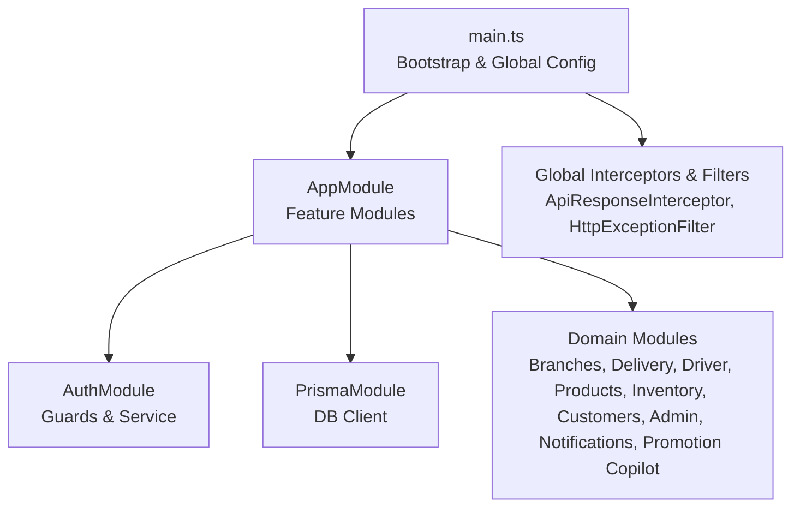
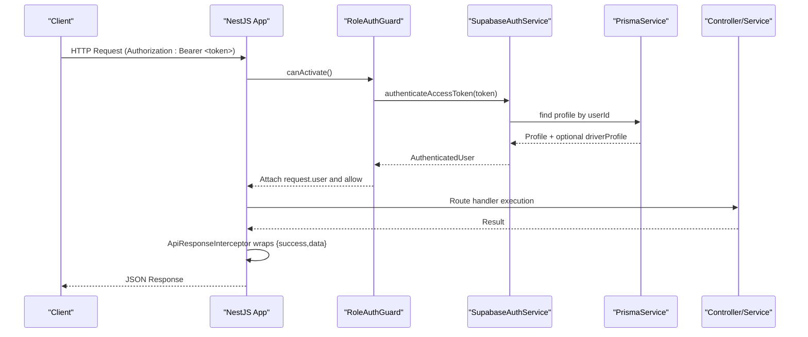
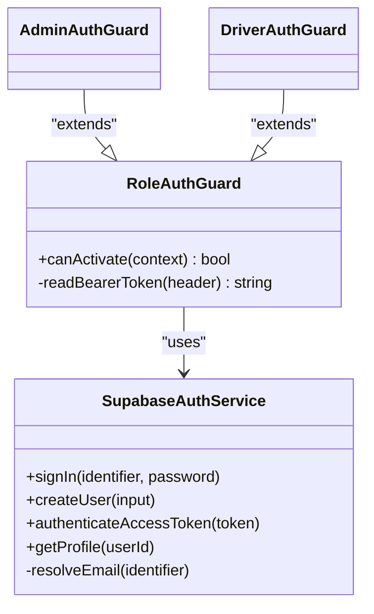
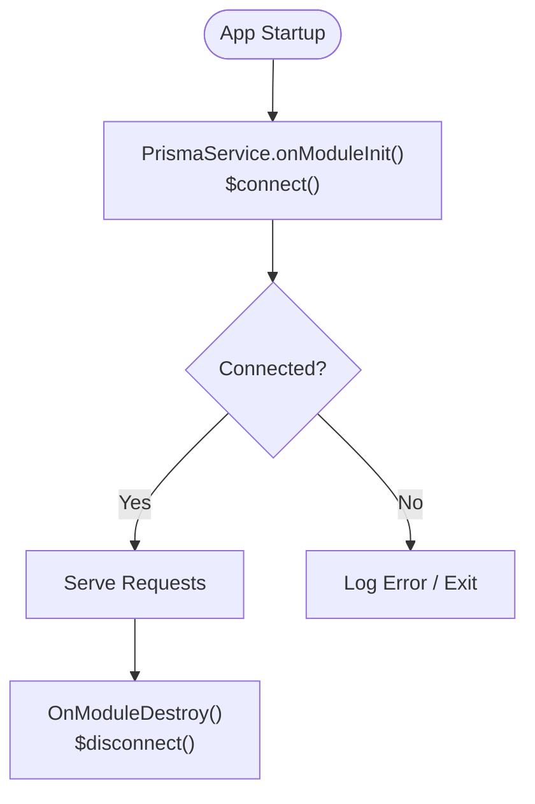
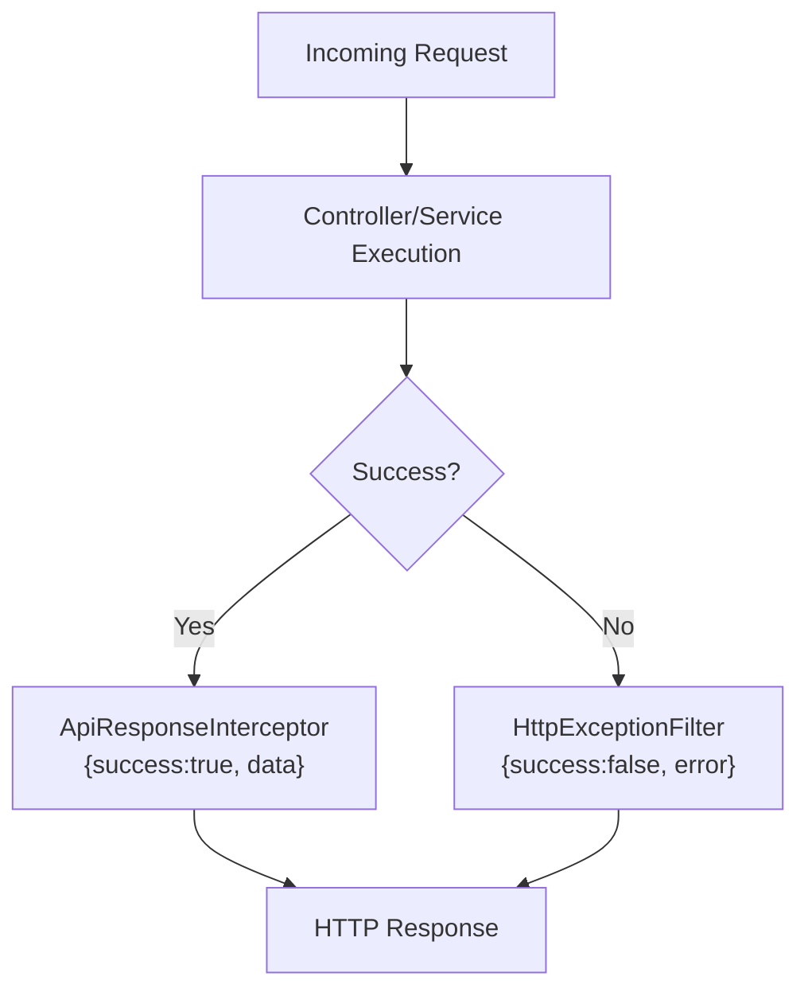
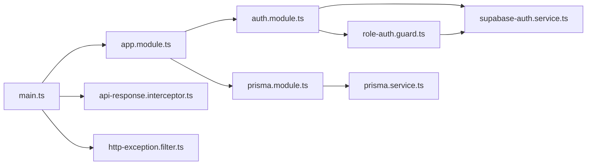

# Backend API Documentation

<cite>
**Referenced Files in This Document**
- [main.ts](file://apps/api/src/main.ts)
- [app.module.ts](file://apps/api/src/app.module.ts)
- [package.json](file://apps/api/package.json)
- [auth.module.ts](file://apps/api/src/auth/auth.module.ts)
- [supabase-auth.service.ts](file://apps/api/src/auth/supabase-auth.service.ts)
- [role-auth.guard.ts](file://apps/api/src/auth/role-auth.guard.ts)
- [admin-auth.guard.ts](file://apps/api/src/auth/admin-auth.guard.ts)
- [driver-auth.guard.ts](file://apps/api/src/auth/driver-auth.guard.ts)
- [prisma.module.ts](file://apps/api/src/prisma/prisma.module.ts)
- [prisma.service.ts](file://apps/api/src/prisma/prisma.service.ts)
- [schema.prisma](file://apps/api/prisma/schema.prisma)
- [api-response.interceptor.ts](file://apps/api/src/common/api-response.interceptor.ts)
- [http-exception.filter.ts](file://apps/api/src/common/http-exception.filter.ts)
</cite>

## Table of Contents
1. Introduction
2. Project Structure
3. Core Components
4. Architecture Overview
5. Detailed Component Analysis
6. Dependency Analysis
7. Performance Considerations
8. Troubleshooting Guide
9. Conclusion

## Introduction
This document provides comprehensive backend API documentation for the United Pharmacy NestJS server. It covers server bootstrap and configuration, module structure, middleware and interceptors, authentication and authorization with Supabase and role-based access control, database connectivity via Prisma ORM, error handling, request/response formatting, environment configuration, CORS, and deployment considerations.

## Project Structure
The API is a NestJS application organized into feature modules under src/modules, shared infrastructure under src/common and src/auth, and data access via Prisma under src/prisma. The root AppModule wires all domain modules together. The entry point configures CORS, global interceptors, and filters before starting the HTTP server.

**Diagram sources**
- [main.ts:7-35](file://apps/api/src/main.ts#L7-L35)
- [app.module.ts:14-28](file://apps/api/src/app.module.ts#L14-L28)

**Section sources**
- [main.ts:7-35](file://apps/api/src/main.ts#L7-L35)
- [app.module.ts:14-28](file://apps/api/src/app.module.ts#L14-L28)

## Core Components
- Server bootstrap and runtime configuration (CORS, port, global interceptors/filters).
- Module composition wiring domain features and shared services.
- Authentication service integrating Supabase Auth and Prisma to resolve user profiles.
- Role-based guards enforcing admin and driver roles.
- Prisma integration providing typed database access across modules.
- Global response interceptor standardizing success payloads.
- Global exception filter standardizing error payloads.

**Section sources**
- [main.ts:7-35](file://apps/api/src/main.ts#L7-L35)
- [app.module.ts:14-28](file://apps/api/src/app.module.ts#L14-L28)
- [supabase-auth.service.ts:11-64](file://apps/api/src/auth/supabase-auth.service.ts#L11-L64)
- [role-auth.guard.ts:4-37](file://apps/api/src/auth/role-auth.guard.ts#L4-L37)
- [prisma.service.ts:4-13](file://apps/api/src/prisma/prisma.service.ts#L4-L13)
- [api-response.interceptor.ts:10-21](file://apps/api/src/common/api-response.interceptor.ts#L10-L21)
- [http-exception.filter.ts:9-44](file://apps/api/src/common/http-exception.filter.ts#L9-L44)

## Architecture Overview
The API follows a layered architecture:
- Entry layer: Express-backed NestJS server configured in main.ts.
- Cross-cutting: Global interceptor normalizes responses; global filter normalizes errors.
- Security: SupabaseAuthService validates tokens and resolves profiles; RoleAuthGuard enforces roles.
- Domain: Feature modules encapsulate business logic (branches, delivery, driver, products, inventory, customers, admin, notifications, promotion copilot).
- Data: PrismaService provides a single PrismaClient instance connected to PostgreSQL with multi-schema support (auth and public).

**Diagram sources**
- [role-auth.guard.ts:11-27](file://apps/api/src/auth/role-auth.guard.ts#L11-L27)
- [supabase-auth.service.ts:49-64](file://apps/api/src/auth/supabase-auth.service.ts#L49-L64)
- [api-response.interceptor.ts:12-19](file://apps/api/src/common/api-response.interceptor.ts#L12-L19)

## Detailed Component Analysis

### Server Bootstrap and Configuration
- Creates the Nest application and enables CORS with explicit origins, methods, headers, credentials, and preflight caching.
- Registers global interceptor and filter for consistent response/error shapes.
- Reads PORT from environment and binds to 0.0.0.0.

Key behaviors:
- CORS explicitly configured to avoid proxy header stripping issues.
- Global interceptor ensures successful responses follow a uniform envelope.
- Global filter catches unhandled exceptions and returns structured errors.

**Section sources**
- [main.ts:7-35](file://apps/api/src/main.ts#L7-L35)
- [api-response.interceptor.ts:10-21](file://apps/api/src/common/api-response.interceptor.ts#L10-L21)
- [http-exception.filter.ts:9-44](file://apps/api/src/common/http-exception.filter.ts#L9-L44)

### Module Composition
- AppModule imports PrismaModule and all feature modules (branches, delivery, driver, notifications, auth, admin, products, inventory, customers, promotion-copilot).
- Keeps domain boundaries clear and reusable.

**Section sources**
- [app.module.ts:14-28](file://apps/api/src/app.module.ts#L14-L28)

### Authentication and Authorization
- SupabaseAuthService:
  - Initializes Supabase client using SUPABASE_URL and SUPABASE_SERVICE_ROLE_KEY.
  - signIn supports email or phone identifier resolution via Prisma profiles.
  - createUser creates an authenticated user with metadata.
  - authenticateAccessToken validates the token and attaches profile including driverProfile when present.
- Role-based guards:
  - RoleAuthGuard reads Bearer token, authenticates via SupabaseAuthService, checks required role, and attaches request.user.
  - AdminAuthGuard and DriverAuthGuard specialize the required role.

**Diagram sources**
- [supabase-auth.service.ts:11-80](file://apps/api/src/auth/supabase-auth.service.ts#L11-L80)
- [role-auth.guard.ts:4-37](file://apps/api/src/auth/role-auth.guard.ts#L4-L37)
- [admin-auth.guard.ts:5-10](file://apps/api/src/auth/admin-auth.guard.ts#L5-L10)
- [driver-auth.guard.ts:5-10](file://apps/api/src/auth/driver-auth.guard.ts#L5-L10)

**Section sources**
- [auth.module.ts:8-12](file://apps/api/src/auth/auth.module.ts#L8-L12)
- [supabase-auth.service.ts:11-80](file://apps/api/src/auth/supabase-auth.service.ts#L11-L80)
- [role-auth.guard.ts:4-37](file://apps/api/src/auth/role-auth.guard.ts#L4-L37)
- [admin-auth.guard.ts:5-10](file://apps/api/src/auth/admin-auth.guard.ts#L5-L10)
- [driver-auth.guard.ts:5-10](file://apps/api/src/auth/driver-auth.guard.ts#L5-L10)

### Database Connection and Schema
- PrismaModule exports a global PrismaService that connects on module init and disconnects on destroy.
- schema.prisma defines:
  - Multi-schema datasource with PostgreSQL, connecting to both auth and public schemas.
  - Business entities such as Branch, DeliveryZone, orders, order_items, products, inventory, profiles, favorites, integration_events, etc.
  - Enums for app roles and order statuses.
- Migrations are managed via Prisma migrations under apps/api/prisma/migrations.

**Diagram sources**
- [prisma.service.ts:4-13](file://apps/api/src/prisma/prisma.service.ts#L4-L13)
- [schema.prisma:6-11](file://apps/api/prisma/schema.prisma#L6-L11)

**Section sources**
- [prisma.module.ts:4-9](file://apps/api/src/prisma/prisma.module.ts#L4-L9)
- [prisma.service.ts:4-13](file://apps/api/src/prisma/prisma.service.ts#L4-L13)
- [schema.prisma:6-11](file://apps/api/prisma/schema.prisma#L6-L11)
- [schema.prisma:556-592](file://apps/api/prisma/schema.prisma#L556-L592)
- [schema.prisma:595-613](file://apps/api/prisma/schema.prisma#L595-L613)
- [schema.prisma:617-635](file://apps/api/prisma/schema.prisma#L617-L635)
- [schema.prisma:743-763](file://apps/api/prisma/schema.prisma#L743-L763)
- [schema.prisma:765-800](file://apps/api/prisma/schema.prisma#L765-L800)

### Error Handling and Logging
- Global HttpExceptionFilter converts all exceptions into a consistent error envelope with code, message, and contextual details.
- Successful responses are wrapped by ApiResponseInterceptor into a unified shape with success flag, data payload, and null error field.
- No dedicated logging library is registered in the bootstrap; console logging is used for startup messages.

**Diagram sources**
- [api-response.interceptor.ts:12-19](file://apps/api/src/common/api-response.interceptor.ts#L12-L19)
- [http-exception.filter.ts:11-43](file://apps/api/src/common/http-exception.filter.ts#L11-L43)

**Section sources**
- [api-response.interceptor.ts:10-21](file://apps/api/src/common/api-response.interceptor.ts#L10-L21)
- [http-exception.filter.ts:9-44](file://apps/api/src/common/http-exception.filter.ts#L9-L44)

### API Versioning Strategy
- No explicit versioning mechanism (e.g., URL prefix or header) is implemented in the current bootstrap or modules.
- Recommendation: Introduce a route-level versioning strategy (e.g., /api/v1/*) or use a NestJS versioning module if needed in future iterations.

[No sources needed since this section provides general guidance]

### Rate Limiting Implementation
- No rate limiting middleware is configured in the bootstrap or modules.
- Recommendation: Add a rate limiter (e.g., @nestjs/throttler) at the application level to protect endpoints.

[No sources needed since this section provides general guidance]

### Security Best Practices
- Token validation: SupabaseAuthService validates access tokens and resolves profiles via Prisma.
- Role enforcement: RoleAuthGuard ensures only authorized roles can access protected routes.
- CORS: Explicitly configured to restrict origins and allow credentials.
- Environment variables: Sensitive keys (SUPABASE_URL, SUPABASE_SERVICE_ROLE_KEY) are read from environment.

**Section sources**
- [supabase-auth.service.ts:15-23](file://apps/api/src/auth/supabase-auth.service.ts#L15-L23)
- [supabase-auth.service.ts:49-64](file://apps/api/src/auth/supabase-auth.service.ts#L49-L64)
- [role-auth.guard.ts:11-27](file://apps/api/src/auth/role-auth.guard.ts#L11-L27)
- [main.ts:13-28](file://apps/api/src/main.ts#L13-L28)

### CORS Configuration
- Origins include production domains and localhost patterns for development.
- Methods include common HTTP verbs plus OPTIONS.
- Allowed headers include Content-Type, Authorization, Accept, x-request-id.
- Credentials enabled; preflight cached for 24 hours.

**Section sources**
- [main.ts:13-28](file://apps/api/src/main.ts#L13-L28)

### Environment-Specific Settings
- PORT defaults to 3000 if not provided.
- Supabase client requires SUPABASE_URL and SUPABASE_SERVICE_ROLE_KEY.
- Prisma uses DATABASE_URL and DIRECT_URL from environment.

**Section sources**
- [main.ts:33-35](file://apps/api/src/main.ts#L33-L35)
- [supabase-auth.service.ts:15-23](file://apps/api/src/auth/supabase-auth.service.ts#L15-L23)
- [schema.prisma:6-11](file://apps/api/prisma/schema.prisma#L6-L11)

### Deployment Considerations
- Node engine requirement: >=22.0.0.
- Production start script runs compiled output.
- Dockerfile exists in apps/api for containerized deployments.
- Ensure environment variables are set in the target environment (PORT, SUPABASE_*, DATABASE_URL, DIRECT_URL).

**Section sources**
- [package.json:6-12](file://apps/api/package.json#L6-L12)
- [package.json:48-51](file://apps/api/package.json#L48-L51)

## Dependency Analysis
High-level dependencies between core components:

**Diagram sources**
- [main.ts:7-35](file://apps/api/src/main.ts#L7-L35)
- [app.module.ts:14-28](file://apps/api/src/app.module.ts#L14-L28)
- [auth.module.ts:8-12](file://apps/api/src/auth/auth.module.ts#L8-L12)
- [supabase-auth.service.ts:11-64](file://apps/api/src/auth/supabase-auth.service.ts#L11-L64)
- [role-auth.guard.ts:4-37](file://apps/api/src/auth/role-auth.guard.ts#L4-L37)
- [prisma.module.ts:4-9](file://apps/api/src/prisma/prisma.module.ts#L4-L9)
- [prisma.service.ts:4-13](file://apps/api/src/prisma/prisma.service.ts#L4-L13)
- [api-response.interceptor.ts:10-21](file://apps/api/src/common/api-response.interceptor.ts#L10-L21)
- [http-exception.filter.ts:9-44](file://apps/api/src/common/http-exception.filter.ts#L9-L44)

**Section sources**
- [app.module.ts:14-28](file://apps/api/src/app.module.ts#L14-L28)
- [auth.module.ts:8-12](file://apps/api/src/auth/auth.module.ts#L8-L12)
- [prisma.module.ts:4-9](file://apps/api/src/prisma/prisma.module.ts#L4-L9)

## Performance Considerations
- Use Prisma connection lifecycle hooks to ensure efficient connect/disconnect behavior.
- Keep global interceptors lightweight; the current response wrapper is minimal.
- Avoid heavy operations in guards; token validation is delegated to Supabase.
- Consider adding caching layers (e.g., Redis) for frequently accessed data like branch zones or product catalogs.
- Monitor database query performance and leverage indexes defined in schema.prisma.

[No sources needed since this section provides general guidance]

## Troubleshooting Guide
Common issues and resolutions:
- Missing Supabase credentials: Ensure SUPABASE_URL and SUPABASE_SERVICE_ROLE_KEY are set; otherwise, initialization throws an error.
- Invalid or expired token: authenticateAccessToken will throw an unauthorized error; verify client-side token handling.
- Profile not found: If a valid token maps to a user without a corresponding profile, an unauthorized error is thrown.
- Unexpected server errors: HttpExceptionFilter returns a standardized error envelope; check logs for stack traces and context.
- CORS failures: Verify origin matches allowed list; confirm credentials and headers are sent correctly.

**Section sources**
- [supabase-auth.service.ts:15-23](file://apps/api/src/auth/supabase-auth.service.ts#L15-L23)
- [supabase-auth.service.ts:49-64](file://apps/api/src/auth/supabase-auth.service.ts#L49-L64)
- [http-exception.filter.ts:11-43](file://apps/api/src/common/http-exception.filter.ts#L11-L43)
- [main.ts:13-28](file://apps/api/src/main.ts#L13-L28)

## Conclusion
The United Pharmacy NestJS API provides a robust foundation with modular architecture, secure authentication via Supabase, role-based access control, and consistent error/response handling through global interceptors and filters. Prisma integrates cleanly with a multi-schema PostgreSQL setup. For production readiness, consider adding API versioning, rate limiting, centralized logging, and comprehensive monitoring.

[No sources needed since this section summarizes without analyzing specific files]