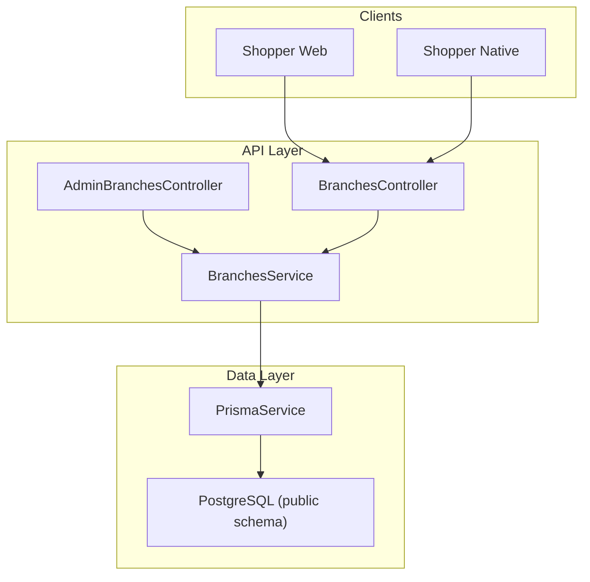
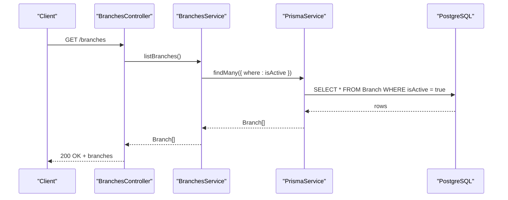
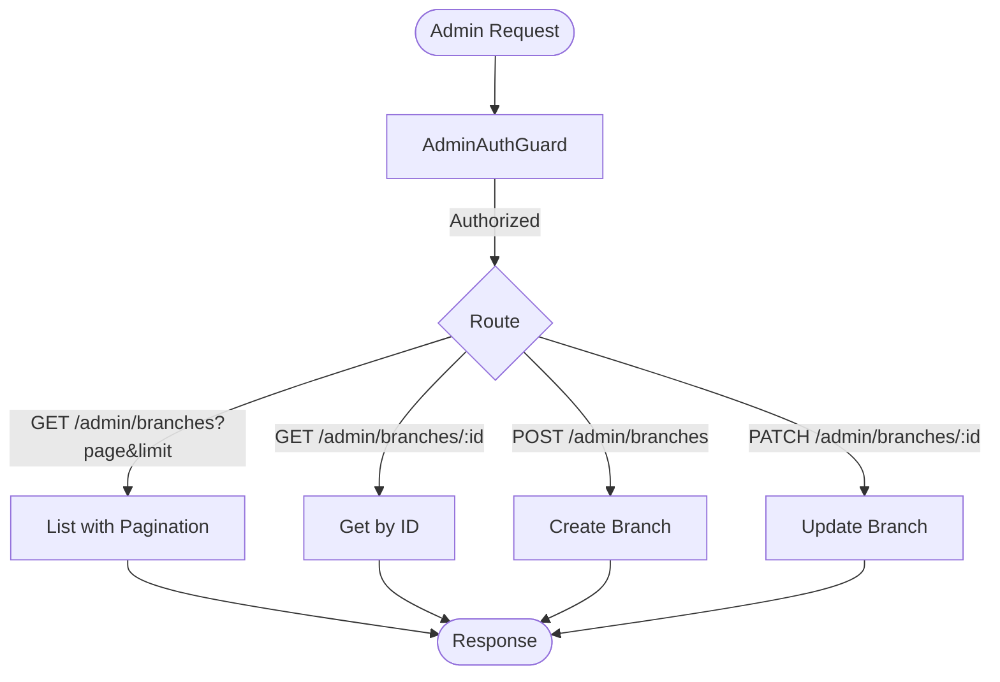
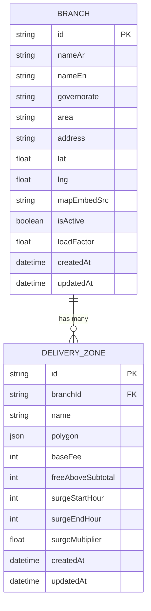
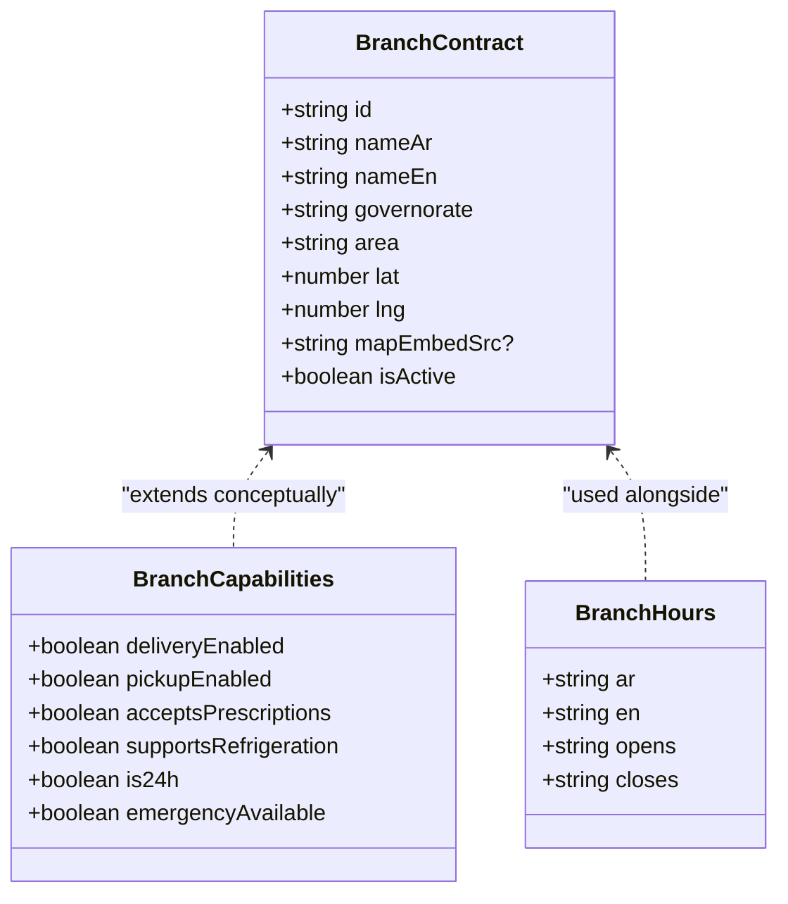
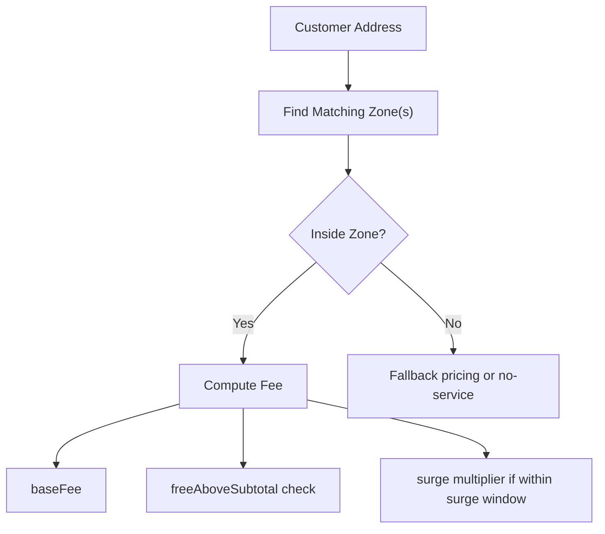
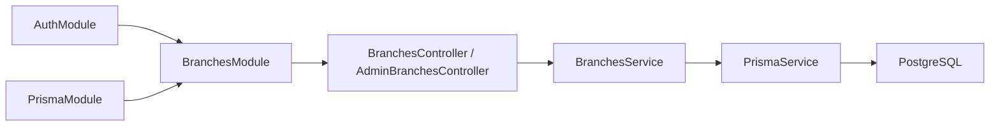

# Branches Module

<cite>
**Referenced Files in This Document**
- [branches.controller.ts](file://apps/api/src/modules/branches/branches.controller.ts)
- [branches.service.ts](file://apps/api/src/modules/branches/branches.service.ts)
- [branches.module.ts](file://apps/api/src/modules/branches/branches.module.ts)
- [schema.prisma](file://apps/api/prisma/schema.prisma)
- [seed_branches_and_zones.sql](file://database/seed_branches_and_zones.sql)
- [branch.ts](file://packages/contracts/src/branch.ts)
- [branchesApi.ts](file://apps/shopper-web/src/services/branchesApi.ts)
- [types.ts](file://apps/shopper-native/src/features/delivery/branches/types.ts)
</cite>

## Table of Contents
1. Introduction
2. Project Structure
3. Core Components
4. Architecture Overview
5. Detailed Component Analysis
6. Dependency Analysis
7. Performance Considerations
8. Troubleshooting Guide
9. Conclusion

## Introduction
This document describes the Branches module that enables multi-location pharmacy operations. It covers branch CRUD, location management with geofencing via delivery zones, and branch-specific configurations. It also explains zone-based delivery areas, pricing variations by location, inventory allocation per branch, analytics and reporting considerations, hierarchy management, and cross-branch operations. The module integrates a NestJS API layer with Prisma and a PostgreSQL database, and exposes endpoints for both public listing and admin management.

## Project Structure
The Branches module is implemented as a NestJS feature module with controllers, services, and Prisma models. Seed data defines branches and their delivery zones. Frontend clients consume a public list endpoint and an admin-managed set of endpoints protected by authentication guards.

**Diagram sources**
- [branches.controller.ts:1-40](file://apps/api/src/modules/branches/branches.controller.ts#L1-L40)
- [branches.service.ts:1-57](file://apps/api/src/modules/branches/branches.service.ts#L1-L57)
- [schema.prisma:765-803](file://apps/api/prisma/schema.prisma#L765-L803)

**Section sources**
- [branches.controller.ts:1-40](file://apps/api/src/modules/branches/branches.controller.ts#L1-L40)
- [branches.service.ts:1-57](file://apps/api/src/modules/branches/branches.service.ts#L1-L57)
- [branches.module.ts:1-14](file://apps/api/src/modules/branches/branches.module.ts#L1-L14)
- [schema.prisma:765-803](file://apps/api/prisma/schema.prisma#L765-L803)

## Core Components
- BranchesController: Exposes public GET /branches to list active branches and admin routes under /admin/branches for CRUD operations protected by AdminAuthGuard.
- AdminBranchesController: Provides paginated listing, single branch retrieval, creation, and update.
- BranchesService: Implements business logic for listing, pagination, fetching a branch with its zones, creating, and updating branches using Prisma.
- Data Models: Branch and DeliveryZone are defined in Prisma; seed script populates initial branches and zones.
- Contracts and Clients: Zod schemas define Branch contract; web client fetches branches with fallbacks; native app types describe richer branch capabilities and hours.

Key responsibilities:
- Public listing filters to active branches only.
- Admin listing supports pagination with total and page metadata.
- Single branch retrieval includes associated delivery zones.
- Creation/update delegates to Prisma with minimal validation at this layer.

**Section sources**
- [branches.controller.ts:1-40](file://apps/api/src/modules/branches/branches.controller.ts#L1-L40)
- [branches.service.ts:1-57](file://apps/api/src/modules/branches/branches.service.ts#L1-L57)
- [schema.prisma:765-803](file://apps/api/prisma/schema.prisma#L765-L803)
- [branch.ts:1-21](file://packages/contracts/src/branch.ts#L1-L21)
- [branchesApi.ts:1-84](file://apps/shopper-web/src/services/branchesApi.ts#L1-L84)
- [types.ts:1-67](file://apps/shopper-native/src/features/delivery/branches/types.ts#L1-L67)

## Architecture Overview
The module follows a layered architecture:
- Controllers handle HTTP requests and route them to service methods.
- Service encapsulates domain logic and interacts with Prisma.
- Prisma maps to PostgreSQL tables Branch and DeliveryZone.
- Seed SQL initializes branches and delivery zones with polygons and pricing parameters.

**Diagram sources**
- [branches.controller.ts:9-12](file://apps/api/src/modules/branches/branches.controller.ts#L9-L12)
- [branches.service.ts:8-13](file://apps/api/src/modules/branches/branches.service.ts#L8-L13)
- [schema.prisma:765-784](file://apps/api/prisma/schema.prisma#L765-L784)

## Detailed Component Analysis

### Branch CRUD Operations
- List active branches: Returns all active branches sorted by name.
- Admin list with pagination: Returns items, total count, current page, limit, and total pages.
- Get branch by id: Returns branch details including related delivery zones; throws not found if missing.
- Create branch: Inserts a new branch record via Prisma.
- Update branch: Updates fields for a given branch id.

**Diagram sources**
- [branches.controller.ts:15-39](file://apps/api/src/modules/branches/branches.controller.ts#L15-L39)
- [branches.service.ts:15-55](file://apps/api/src/modules/branches/branches.service.ts#L15-L55)

**Section sources**
- [branches.controller.ts:15-39](file://apps/api/src/modules/branches/branches.controller.ts#L15-L39)
- [branches.service.ts:15-55](file://apps/api/src/modules/branches/branches.service.ts#L15-L55)

### Location Management and Geofencing with Delivery Zones
- Each branch can have one or more DeliveryZone records defining a polygonal area.
- Seed data creates primary zones per branch with base fee, free delivery threshold above subtotal, and surge pricing windows.
- Zone attributes include baseFee, freeAboveSubtotal, surgeStartHour, surgeEndHour, surgeMultiplier.

**Diagram sources**
- [schema.prisma:765-803](file://apps/api/prisma/schema.prisma#L765-L803)
- [seed_branches_and_zones.sql:72-115](file://database/seed_branches_and_zones.sql#L72-L115)

**Section sources**
- [schema.prisma:765-803](file://apps/api/prisma/schema.prisma#L765-L803)
- [seed_branches_and_zones.sql:72-115](file://database/seed_branches_and_zones.sql#L72-L115)

### Branch-Specific Configurations
- Branch-level configuration fields include geographic coordinates, map embed source, activity status, and optional load factor.
- Frontend contracts and types define additional capabilities such as delivery/prescription acceptance, refrigeration support, 24-hour operation, emergency availability, and operating hours.
- Web client provides a fallback list of branches when the API is unreachable.

**Diagram sources**
- [branch.ts:1-21](file://packages/contracts/src/branch.ts#L1-L21)
- [types.ts:11-66](file://apps/shopper-native/src/features/delivery/branches/types.ts#L11-L66)

**Section sources**
- [branch.ts:1-21](file://packages/contracts/src/branch.ts#L1-L21)
- [types.ts:11-66](file://apps/shopper-native/src/features/delivery/branches/types.ts#L11-L66)
- [branchesApi.ts:11-84](file://apps/shopper-web/src/services/branchesApi.ts#L11-L84)

### Zone-Based Delivery Areas and Pricing Variations by Location
- Delivery zones define serviceable areas via polygon points.
- Pricing rules per zone include base fee, free delivery above a subtotal threshold, and surge multiplier during specified hours.
- These values enable dynamic shipping cost calculation based on customer location relative to branch zones.

[No sources needed since this diagram shows conceptual workflow, not actual code structure]

**Section sources**
- [seed_branches_and_zones.sql:72-115](file://database/seed_branches_and_zones.sql#L72-L115)

### Inventory Allocation Per Branch
- The current Prisma schema does not include a direct branch-inventory relationship.
- To allocate inventory per branch, introduce a branch-scoped inventory model linking products to branches with quantities reserved and on-hand per branch.
- Recommended additions:
  - Model: BranchInventory with fields product_id, branch_id, on_hand, reserved, reorder_point, lead_time_days.
  - Relations: Link to Product and Branch; enforce unique(product_id, branch_id).
  - Indexes: On branch_id and product_id for fast lookups.
  - Business logic: Adjust on_hand/reserved during order fulfillment and stock adjustments per branch.

[No sources needed since this section proposes future schema changes]

### Branch Analytics, Performance Metrics, and Operational Reporting
- Current implementation focuses on branch and zone management; analytics are not exposed via dedicated endpoints.
- To enable analytics:
  - Add metrics tables or views aggregating orders, deliveries, and driver performance per branch.
  - Introduce endpoints for branch-level KPIs: revenue, order volume, average delivery time, fill rate, and stockouts.
  - Use existing DriverProfile and DeliveryAssignment fields (e.g., ratings, completion rates, earnings) to compute branch-level operational metrics.

[No sources needed since this section provides general guidance]

### Branch Hierarchy Management and Cross-Branch Operations
- The schema currently treats branches as peers without explicit hierarchy.
- To support hierarchy:
  - Add parent_id to Branch to enable parent-child relationships.
  - Enforce constraints to prevent cycles and ensure a single root.
  - Provide APIs to manage hierarchy and propagate policies from parent to child branches.
- For cross-branch operations:
  - Enable inter-branch transfers with transfer records tracking origin, destination, status, and timestamps.
  - Implement workflows for approval, inventory movement, and audit trails.

[No sources needed since this section provides general guidance]

## Dependency Analysis
- BranchesModule imports PrismaModule and AuthModule, exposing BranchesService to other modules.
- Controllers depend on BranchesService; service depends on PrismaService.
- Database models Branch and DeliveryZone are strongly coupled through a one-to-many relation.
- Seed SQL ensures consistent initialization of branches and zones.

**Diagram sources**
- [branches.module.ts:1-14](file://apps/api/src/modules/branches/branches.module.ts#L1-L14)
- [branches.controller.ts:1-40](file://apps/api/src/modules/branches/branches.controller.ts#L1-L40)
- [branches.service.ts:1-57](file://apps/api/src/modules/branches/branches.service.ts#L1-L57)
- [schema.prisma:765-803](file://apps/api/prisma/schema.prisma#L765-L803)

**Section sources**
- [branches.module.ts:1-14](file://apps/api/src/modules/branches/branches.module.ts#L1-L14)
- [branches.controller.ts:1-40](file://apps/api/src/modules/branches/branches.controller.ts#L1-L40)
- [branches.service.ts:1-57](file://apps/api/src/modules/branches/branches.service.ts#L1-L57)
- [schema.prisma:765-803](file://apps/api/prisma/schema.prisma#L765-L803)

## Performance Considerations
- Listing active branches uses a simple filter and ordering; ensure indexes on isActive and nameEn for large datasets.
- Admin listing uses skip/take pagination; consider cursor-based pagination for very large lists.
- Fetching a branch with zones performs a join; ensure index on DeliveryZone.branchId.
- Seed operations use upserts to avoid duplicates; keep seed idempotent.

[No sources needed since this section provides general guidance]

## Troubleshooting Guide
- Not Found errors: When retrieving a branch by id, a NotFoundException is thrown if the branch does not exist. Ensure the id exists before calling get.
- Authentication: Admin endpoints require AdminAuthGuard; verify role and permissions.
- Data consistency: If branches or zones appear inconsistent, re-run seed_branches_and_zones.sql to reconcile state.
- Frontend fallback: If the API is unreachable, the web client falls back to a hardcoded list; verify network connectivity and API availability.

**Section sources**
- [branches.service.ts:35-41](file://apps/api/src/modules/branches/branches.service.ts#L35-L41)
- [branches.controller.ts:15-39](file://apps/api/src/modules/branches/branches.controller.ts#L15-L39)
- [seed_branches_and_zones.sql:117-127](file://database/seed_branches_and_zones.sql#L117-L127)
- [branchesApi.ts:74-84](file://apps/shopper-web/src/services/branchesApi.ts#L74-L84)

## Conclusion
The Branches module provides foundational multi-location support with robust CRUD operations, location-based delivery zones, and configurable branch attributes. While analytics and advanced features like per-branch inventory and hierarchy are not fully implemented, the current design allows straightforward extension. Adding branch-scoped inventory, hierarchy, and analytics endpoints will enhance operational visibility and control across locations.