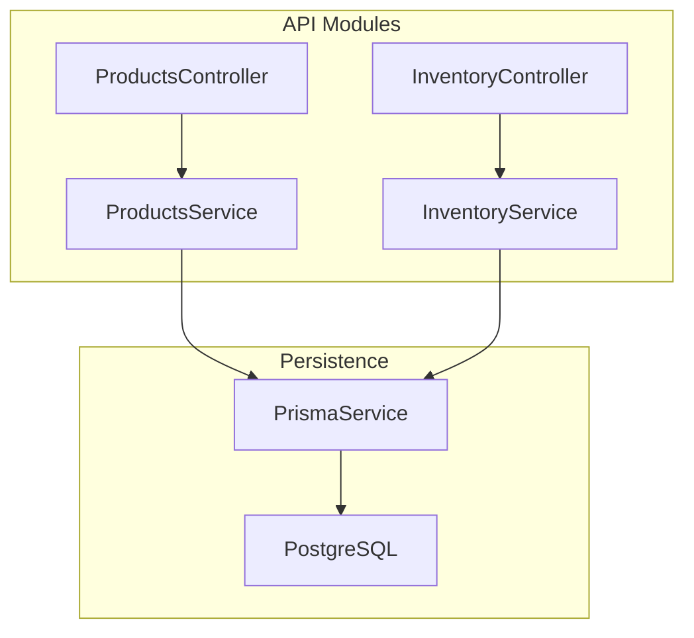
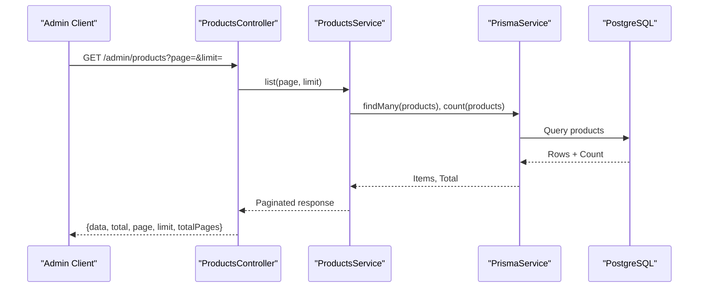
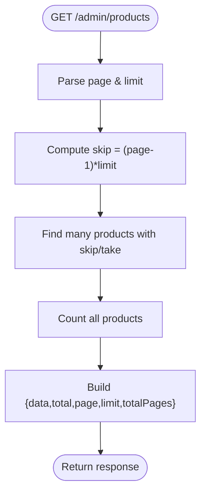
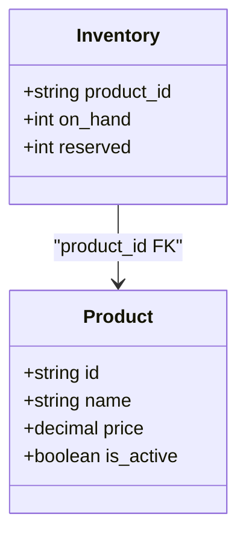
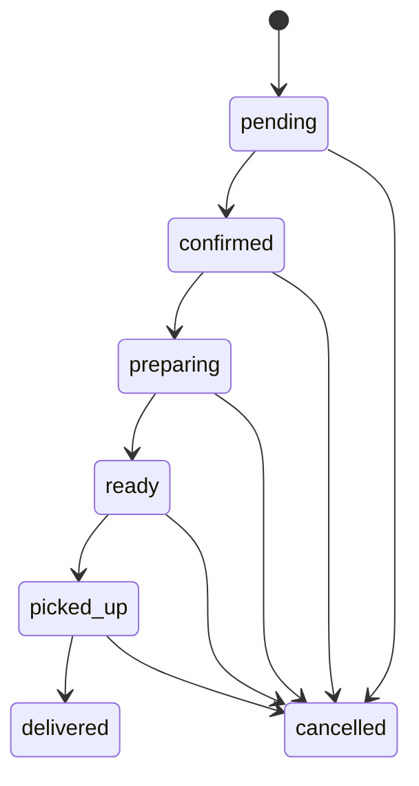
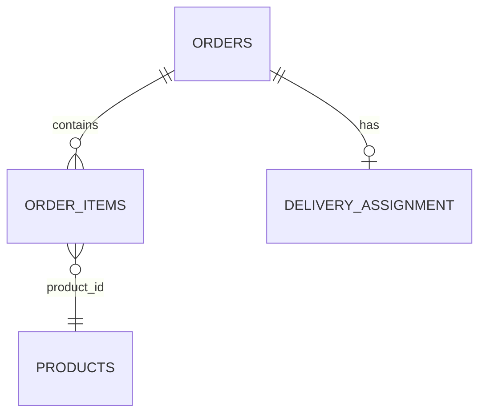
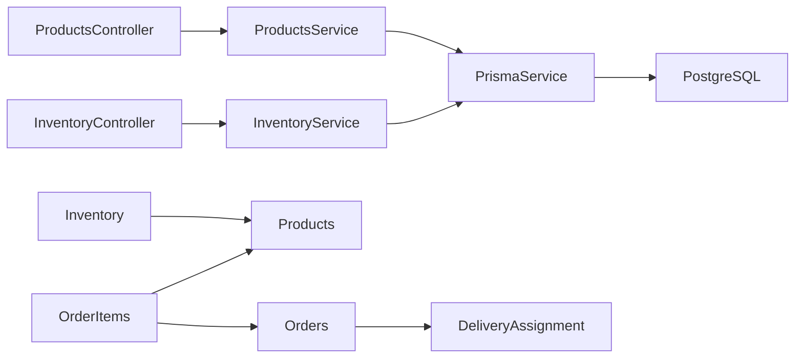

# Core Business Modules

<cite>
**Referenced Files in This Document**
- [schema.prisma](file://apps/api/prisma/schema.prisma)
- [products.controller.ts](file://apps/api/src/modules/products/products.controller.ts)
- [products.service.ts](file://apps/api/src/modules/products/products.service.ts)
- [inventory.controller.ts](file://apps/api/src/modules/inventory/inventory.controller.ts)
- [inventory.service.ts](file://apps/api/src/modules/inventory/inventory.service.ts)
</cite>

## Table of Contents
1. [Introduction](#introduction)
2. [Project Structure](#project-structure)
3. [Core Components](#core-components)
4. [Architecture Overview](#architecture-overview)
5. [Detailed Component Analysis](#detailed-component-analysis)
6. [Dependency Analysis](#dependency-analysis)
7. [Performance Considerations](#performance-considerations)
8. [Troubleshooting Guide](#troubleshooting-guide)
9. [Conclusion](#conclusion)
10. [Appendices](#appendices)

## Introduction
This document describes the core business modules of the United Pharmacy API with a focus on:
- Products module: catalog listing and pagination, search foundations, category fields, and inventory integration.
- Orders module: order lifecycle, status management, payment fields, and delivery tracking via assignments.
- Inventory module: stock levels, reservations, and multi-branch considerations.
- Prescriptions module: upload handling, pharmacist review workflow, and approval processes.

It consolidates data models, business rules, and integration patterns between modules as implemented in the repository.

## Project Structure
The API is organized by feature modules under apps/api/src/modules, with shared authentication and Prisma-based persistence. The database schema defines entities for products, inventory, orders, profiles, drivers, deliveries, notifications, and related operational tables.

**Diagram sources**
- [products.controller.ts:5-13](file://apps/api/src/modules/products/products.controller.ts#L5-L13)
- [products.service.ts:8-25](file://apps/api/src/modules/products/products.service.ts#L8-L25)
- [inventory.controller.ts:5-13](file://apps/api/src/modules/inventory/inventory.controller.ts#L5-L13)
- [inventory.service.ts:8-25](file://apps/api/src/modules/inventory/inventory.service.ts#L8-L25)

**Section sources**
- [products.controller.ts:1-15](file://apps/api/src/modules/products/products.controller.ts#L1-L15)
- [products.service.ts:1-27](file://apps/api/src/modules/products/products.service.ts#L1-L27)
- [inventory.controller.ts:1-15](file://apps/api/src/modules/inventory/inventory.controller.ts#L1-L15)
- [inventory.service.ts:1-27](file://apps/api/src/modules/inventory/inventory.service.ts#L1-L27)
- [schema.prisma:595-613](file://apps/api/prisma/schema.prisma#L595-L613)
- [schema.prisma:529-536](file://apps/api/prisma/schema.prisma#L529-L536)
- [schema.prisma:556-592](file://apps/api/prisma/schema.prisma#L556-L592)

## Core Components
- Products: Admin-scoped listing endpoint with pagination; product model includes name, category fields, pricing, and active flag.
- Inventory: Admin-scoped listing endpoint with pagination; inventory model tracks on-hand and reserved quantities per product.
- Orders: Order entity with status, totals, payment fields, and relationships to items and delivery assignment.
- Profiles and Roles: User profiles with roles (customer, manager, pharmacist, driver, admin).
- Delivery: Driver profiles, locations, sessions, earnings, and delivery assignments with timestamps and statuses.
- Notifications: Device tokens and notification logs for push notifications.

Key data models and their responsibilities are defined in the Prisma schema.

**Section sources**
- [schema.prisma:595-613](file://apps/api/prisma/schema.prisma#L595-L613)
- [schema.prisma:529-536](file://apps/api/prisma/schema.prisma#L529-L536)
- [schema.prisma:556-592](file://apps/api/prisma/schema.prisma#L556-L592)
- [schema.prisma:617-635](file://apps/api/prisma/schema.prisma#L617-L635)
- [schema.prisma:806-855](file://apps/api/prisma/schema.prisma#L806-L855)
- [schema.prisma:879-934](file://apps/api/prisma/schema.prisma#L879-L934)
- [schema.prisma:986-1036](file://apps/api/prisma/schema.prisma#L986-L1036)

## Architecture Overview
The API exposes admin endpoints protected by guards. Controllers delegate to services that use Prisma to query the database. Orders integrate with delivery assignments to track fulfillment.

**Diagram sources**
- [products.controller.ts:5-13](file://apps/api/src/modules/products/products.controller.ts#L5-L13)
- [products.service.ts:8-25](file://apps/api/src/modules/products/products.service.ts#L8-L25)

**Section sources**
- [products.controller.ts:1-15](file://apps/api/src/modules/products/products.controller.ts#L1-L15)
- [products.service.ts:1-27](file://apps/api/src/modules/products/products.service.ts#L1-L27)

## Detailed Component Analysis

### Products Module
- Endpoints:
  - GET /admin/products?page=&limit=: Returns paginated product listings.
- Service logic:
  - Computes skip based on page and limit.
  - Fetches items and total count concurrently.
  - Returns standardized pagination envelope.
- Data model:
  - Product includes identifiers, names (multilingual), category fields, price, active flag, timestamps, and optional inventory relation.

**Diagram sources**
- [products.controller.ts:10-13](file://apps/api/src/modules/products/products.controller.ts#L10-L13)
- [products.service.ts:8-25](file://apps/api/src/modules/products/products.service.ts#L8-L25)

**Section sources**
- [products.controller.ts:1-15](file://apps/api/src/modules/products/products.controller.ts#L1-L15)
- [products.service.ts:1-27](file://apps/api/src/modules/products/products.service.ts#L1-L27)
- [schema.prisma:595-613](file://apps/api/prisma/schema.prisma#L595-L613)

### Inventory Module
- Endpoints:
  - GET /admin/inventory?page=&limit=: Returns paginated inventory records.
- Service logic:
  - Same pagination pattern as products.
- Data model:
  - Inventory links to a product and tracks on_hand and reserved quantities.

**Diagram sources**
- [schema.prisma:529-536](file://apps/api/prisma/schema.prisma#L529-L536)
- [schema.prisma:595-613](file://apps/api/prisma/schema.prisma#L595-L613)

**Section sources**
- [inventory.controller.ts:1-15](file://apps/api/src/modules/inventory/inventory.controller.ts#L1-L15)
- [inventory.service.ts:1-27](file://apps/api/src/modules/inventory/inventory.service.ts#L1-L27)
- [schema.prisma:529-536](file://apps/api/prisma/schema.prisma#L529-L536)

### Orders Module
- Data model highlights:
  - Orders include customer details, coordinates, status, totals, payment method/status/reference, idempotency key, failure reason, and timestamps.
  - Order items capture product snapshot, quantity, unit price, and line total.
  - DeliveryAssignment ties an order to a driver and pharmacy location, with rich timestamps and proof fields.
- Lifecycle and status:
  - Order status enum supports pending, confirmed, preparing, ready, picked_up, delivered, cancelled.
  - Delivery status enum supports ASSIGNED through DELIVERED/FAILED/CANCELLED with detailed milestones.

**Diagram sources**
- [schema.prisma:556-592](file://apps/api/prisma/schema.prisma#L556-L592)
- [schema.prisma:753-763](file://apps/api/prisma/schema.prisma#L753-L763)

**Diagram sources**
- [schema.prisma:540-553](file://apps/api/prisma/schema.prisma#L540-L553)
- [schema.prisma:556-592](file://apps/api/prisma/schema.prisma#L556-L592)
- [schema.prisma:595-613](file://apps/api/prisma/schema.prisma#L595-L613)
- [schema.prisma:879-934](file://apps/api/prisma/schema.prisma#L879-L934)

Business rules and integration points:
- Payment fields exist on orders but no payment service implementation is visible in the referenced files.
- Delivery assignment provides full tracking timeline from assignment to delivery or cancellation.
- Order items store a product snapshot to preserve historical pricing and details.

**Section sources**
- [schema.prisma:540-592](file://apps/api/prisma/schema.prisma#L540-L592)
- [schema.prisma:753-763](file://apps/api/prisma/schema.prisma#L753-L763)
- [schema.prisma:879-934](file://apps/api/prisma/schema.prisma#L879-L934)

### Prescriptions Module
- Upload handling:
  - A migration indicates support for prescription image uploads.
- Pharmacist review workflow:
  - Migrations indicate admin/pharmacist review capabilities and RPCs for prescription review.
- Approval processes:
  - Review-related migrations suggest structured workflows for submission, review, and outcomes.

Note: No controller/service code for prescriptions was found in the analyzed paths; functionality appears to be driven by Supabase functions/migrations and possibly other services not included here.

**Section sources**
- [schema.prisma:1009-1036](file://apps/api/prisma/schema.prisma#L1009-L1036)

## Dependency Analysis
- Controller-to-service coupling:
  - ProductsController depends on ProductsService.
  - InventoryController depends on InventoryService.
- Service-to-persistence coupling:
  - Services depend on PrismaService to access PostgreSQL.
- Data model relationships:
  - Inventory references Products.
  - OrderItems reference Orders and Products.
  - Orders relate to DeliveryAssignment and Profiles (user and driver).

**Diagram sources**
- [products.controller.ts:5-13](file://apps/api/src/modules/products/products.controller.ts#L5-L13)
- [products.service.ts:8-25](file://apps/api/src/modules/products/products.service.ts#L8-L25)
- [inventory.controller.ts:5-13](file://apps/api/src/modules/inventory/inventory.controller.ts#L5-L13)
- [inventory.service.ts:8-25](file://apps/api/src/modules/inventory/inventory.service.ts#L8-L25)
- [schema.prisma:529-536](file://apps/api/prisma/schema.prisma#L529-L536)
- [schema.prisma:540-592](file://apps/api/prisma/schema.prisma#L540-L592)
- [schema.prisma:879-934](file://apps/api/prisma/schema.prisma#L879-L934)

**Section sources**
- [products.controller.ts:1-15](file://apps/api/src/modules/products/products.controller.ts#L1-L15)
- [products.service.ts:1-27](file://apps/api/src/modules/products/products.service.ts#L1-L27)
- [inventory.controller.ts:1-15](file://apps/api/src/modules/inventory/inventory.controller.ts#L1-L15)
- [inventory.service.ts:1-27](file://apps/api/src/modules/inventory/inventory.service.ts#L1-L27)
- [schema.prisma:529-592](file://apps/api/prisma/schema.prisma#L529-L592)
- [schema.prisma:879-934](file://apps/api/prisma/schema.prisma#L879-L934)

## Performance Considerations
- Pagination: Both products and inventory endpoints implement server-side pagination using skip/take and count, reducing payload size and improving responsiveness.
- Concurrent queries: Services fetch items and counts concurrently to minimize latency.
- Indexing: The schema includes indexes on frequently queried fields such as order status, user associations, and timestamps, aiding performance for order and delivery queries.
- Snapshotting: Order items store product snapshots to avoid future schema changes affecting historical accuracy.

[No sources needed since this section provides general guidance derived from observed implementations]

## Troubleshooting Guide
- Authentication:
  - Admin endpoints are guarded by AdminAuthGuard; ensure requests include valid admin credentials.
- Pagination errors:
  - Invalid page or limit values may cause unexpected results; validate inputs before calling list methods.
- Database connectivity:
  - Ensure DATABASE_URL and DIRECT_URL are configured for Prisma to connect to PostgreSQL.
- Missing features:
  - If expected endpoints (e.g., product creation/update, advanced search) are missing, verify whether they are implemented elsewhere or planned.

**Section sources**
- [products.controller.ts:3-6](file://apps/api/src/modules/products/products.controller.ts#L3-L6)
- [inventory.controller.ts:3-6](file://apps/api/src/modules/inventory/inventory.controller.ts#L3-L6)
- [schema.prisma:6-11](file://apps/api/prisma/schema.prisma#L6-L11)

## Conclusion
The United Pharmacy API’s current core modules provide foundational capabilities:
- Products and inventory listing with pagination under admin protection.
- Robust order and delivery data models supporting lifecycle tracking and fulfillment.
- Notification infrastructure for real-time updates.
Prescription functionality appears to be enabled via migrations and functions, indicating a pharmacist review workflow beyond the analyzed controllers. Future enhancements can extend CRUD operations, add search and category management APIs, and integrate payment processing within the existing order framework.

[No sources needed since this section summarizes without analyzing specific files]

## Appendices

### Data Models Summary
- Products: Catalog entries with multilingual names, categories, pricing, and active status.
- Inventory: Per-product stock and reservation tracking.
- Orders: Customer-facing orders with totals, payment fields, and status transitions.
- Order Items: Line items with product snapshots and pricing.
- Delivery Assignment: Fulfillment tracking linking orders to drivers and pharmacies with milestone timestamps.
- Profiles and Roles: User identities and roles across the system.
- Notifications: Device tokens and delivery logs for push notifications.

**Section sources**
- [schema.prisma:595-613](file://apps/api/prisma/schema.prisma#L595-L613)
- [schema.prisma:529-536](file://apps/api/prisma/schema.prisma#L529-L536)
- [schema.prisma:540-592](file://apps/api/prisma/schema.prisma#L540-L592)
- [schema.prisma:617-635](file://apps/api/prisma/schema.prisma#L617-L635)
- [schema.prisma:879-934](file://apps/api/prisma/schema.prisma#L879-L934)
- [schema.prisma:986-1036](file://apps/api/prisma/schema.prisma#L986-L1036)