# Customers Module

<cite>
**Referenced Files in This Document**
- [customers.controller.ts](file://apps/api/src/modules/customers/customers.controller.ts)
- [customers.service.ts](file://apps/api/src/modules/customers/customers.service.ts)
- [customers.module.ts](file://apps/api/src/modules/customers/customers.module.ts)
- [schema.prisma](file://apps/api/prisma/schema.prisma)
- [20260526_fix_loyalty_points_and_orders.sql](file://database/20260526_fix_loyalty_points_and_orders.sql)
- [20260530_create_addresses.sql](file://database/20260530_create_addresses.sql)
- [api.ts](file://apps/admin/src/lib/api.ts)
- [auth.module.ts](file://apps/api/src/auth/auth.module.ts)
- [admin-auth.guard.ts](file://apps/api/src/auth/admin-auth.guard.ts)
- [role-auth.guard.ts](file://apps/api/src/auth/role-auth.guard.ts)
- [supabase-auth.service.ts](file://apps/api/src/auth/supabase-auth.service.ts)
</cite>

## Table of Contents
1. [Introduction](#introduction)
2. [Project Structure](#project-structure)
3. [Core Components](#core-components)
4. [Architecture Overview](#architecture-overview)
5. [Detailed Component Analysis](#detailed-component-analysis)
6. [Dependency Analysis](#dependency-analysis)
7. [Performance Considerations](#performance-considerations)
8. [Troubleshooting Guide](#troubleshooting-guide)
9. [Conclusion](#conclusion)
10. [Appendices](#appendices)

## Introduction
This document provides comprehensive documentation for the Customers module, focusing on customer management and profile operations within the system. It covers:
- Customer registration and authentication integration
- Profile management and address handling
- Loyalty program mechanics (points, wallet, ledger)
- Analytics, segmentation, and marketing automation foundations
- Customer support tools, communication history, and service level tracking

The implementation leverages a NestJS API with Prisma ORM and Supabase Postgres, using role-based guards and row-level security to enforce data access policies.

## Project Structure
The Customers module is implemented as a NestJS feature module exposing an admin-only endpoint to list customers. The backend uses Prisma to query profiles and integrates with authentication guards for authorization.

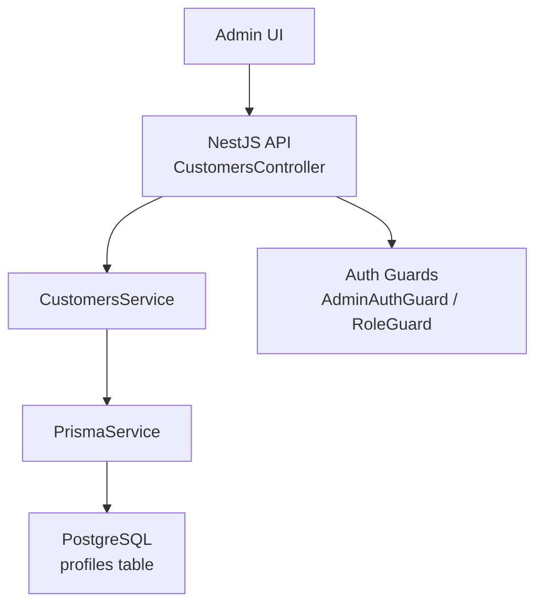

**Diagram sources**
- [customers.controller.ts:5-13](file://apps/api/src/modules/customers/customers.controller.ts#L5-L13)
- [customers.service.ts:8-25](file://apps/api/src/modules/customers/customers.service.ts#L8-L25)
- [schema.prisma:617-635](file://apps/api/prisma/schema.prisma#L617-L635)
- [admin-auth.guard.ts](file://apps/api/src/auth/admin-auth.guard.ts)
- [role-auth.guard.ts:16-25](file://apps/api/src/auth/role-auth.guard.ts#L16-L25)

**Section sources**
- [customers.controller.ts:1-15](file://apps/api/src/modules/customers/customers.controller.ts#L1-L15)
- [customers.service.ts:1-27](file://apps/api/src/modules/customers/customers.service.ts#L1-L27)
- [customers.module.ts:1-14](file://apps/api/src/modules/customers/customers.module.ts#L1-L14)
- [schema.prisma:617-635](file://apps/api/prisma/schema.prisma#L617-L635)

## Core Components
- CustomersController: Exposes an admin-only GET endpoint to list customers with pagination.
- CustomersService: Implements pagination logic and queries profiles via Prisma.
- Authentication: Uses AdminAuthGuard and role-based guard to restrict access to admin users.
- Data Model: Profiles represent customer records with fields such as full name, phone, email, username, address, role, and status.

Key responsibilities:
- Enforce admin-only access to customer listing
- Provide paginated customer lists
- Return total counts and page metadata

**Section sources**
- [customers.controller.ts:5-13](file://apps/api/src/modules/customers/customers.controller.ts#L5-L13)
- [customers.service.ts:8-25](file://apps/api/src/modules/customers/customers.service.ts#L8-L25)
- [schema.prisma:617-635](file://apps/api/prisma/schema.prisma#L617-L635)
- [role-auth.guard.ts:16-25](file://apps/api/src/auth/role-auth.guard.ts#L16-L25)

## Architecture Overview
The Customers module follows a layered architecture:
- Controller layer handles HTTP requests and parameters
- Service layer encapsulates business logic and database interactions
- Prisma ORM abstracts database queries
- Auth guards enforce role-based access control

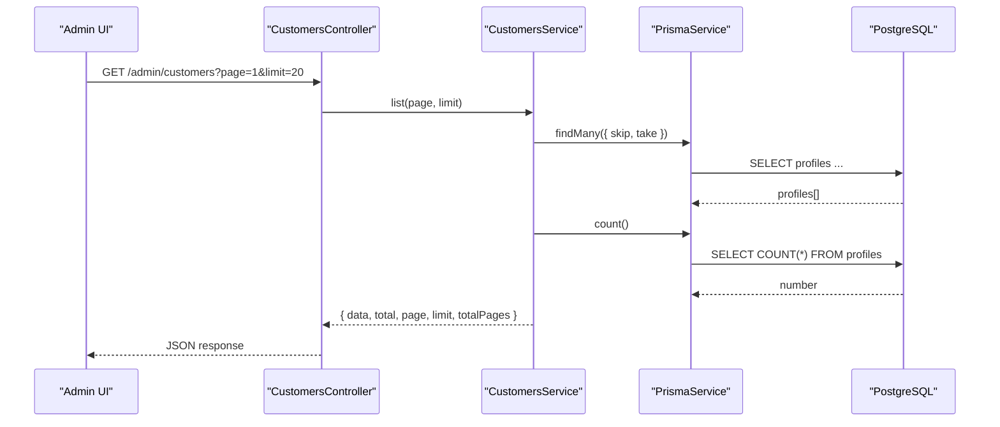

**Diagram sources**
- [customers.controller.ts:10-13](file://apps/api/src/modules/customers/customers.controller.ts#L10-L13)
- [customers.service.ts:8-25](file://apps/api/src/modules/customers/customers.service.ts#L8-L25)
- [schema.prisma:617-635](file://apps/api/prisma/schema.prisma#L617-L635)

## Detailed Component Analysis

### CustomersModule
- Registers controller and service providers
- Imports PrismaModule and AuthModule for database and authentication capabilities
- Exports CustomersService for potential reuse

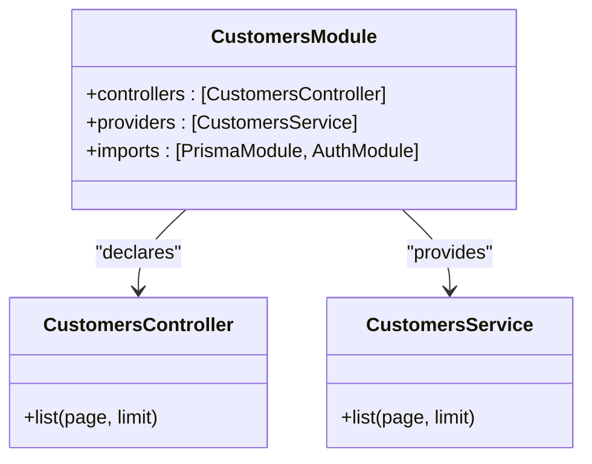

**Diagram sources**
- [customers.module.ts:7-12](file://apps/api/src/modules/customers/customers.module.ts#L7-L12)
- [customers.controller.ts:5-13](file://apps/api/src/modules/customers/customers.controller.ts#L5-L13)
- [customers.service.ts:4-25](file://apps/api/src/modules/customers/customers.service.ts#L4-L25)

**Section sources**
- [customers.module.ts:1-14](file://apps/api/src/modules/customers/customers.module.ts#L1-L14)

### CustomersController
- Endpoint: GET /admin/customers
- Query parameters: page (default 1), limit (default 20)
- Guard: AdminAuthGuard ensures only admins can access

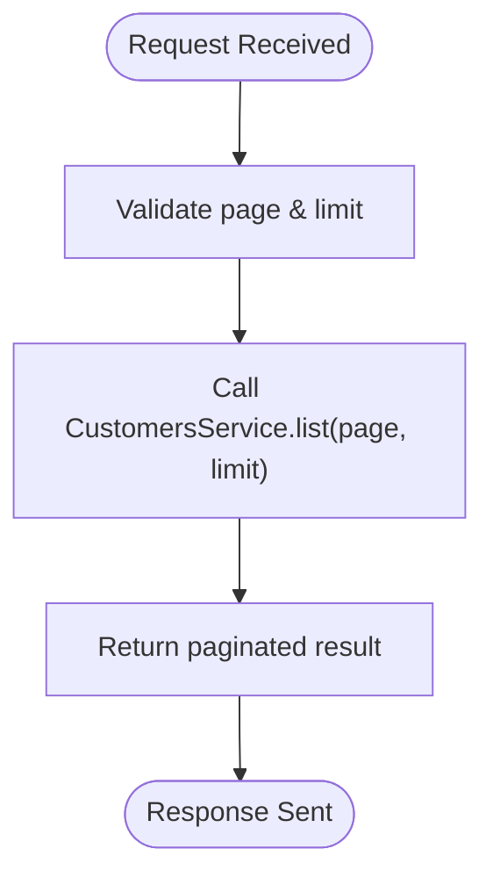

**Diagram sources**
- [customers.controller.ts:5-13](file://apps/api/src/modules/customers/customers.controller.ts#L5-L13)

**Section sources**
- [customers.controller.ts:1-15](file://apps/api/src/modules/customers/customers.controller.ts#L1-L15)

### CustomersService
- Pagination: Computes skip based on page and limit
- Queries: Retrieves profiles and total count concurrently
- Returns: Structured response including data, total, page, limit, and totalPages

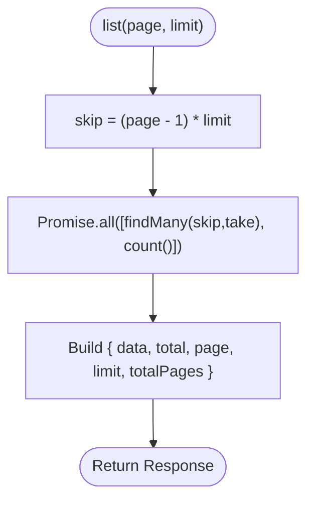

**Diagram sources**
- [customers.service.ts:8-25](file://apps/api/src/modules/customers/customers.service.ts#L8-L25)

**Section sources**
- [customers.service.ts:1-27](file://apps/api/src/modules/customers/customers.service.ts#L1-L27)

### Authentication Integration
- AdminAuthGuard protects the CustomersController
- Role-based guard validates user roles and attaches profile context
- Supabase auth service provides authenticated profile information

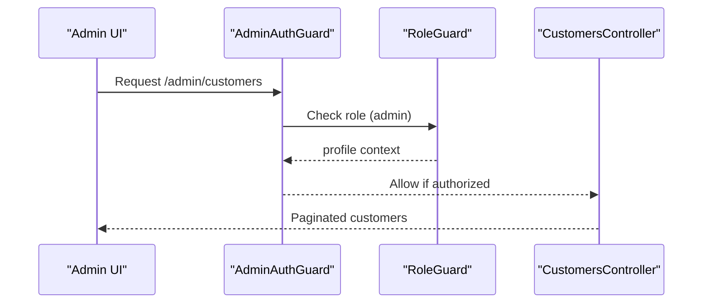

**Diagram sources**
- [admin-auth.guard.ts](file://apps/api/src/auth/admin-auth.guard.ts)
- [role-auth.guard.ts:16-25](file://apps/api/src/auth/role-auth.guard.ts#L16-L25)
- [supabase-auth.service.ts:8-8](file://apps/api/src/auth/supabase-auth.service.ts#L8-L8)

**Section sources**
- [role-auth.guard.ts:16-25](file://apps/api/src/auth/role-auth.guard.ts#L16-L25)
- [supabase-auth.service.ts:8-8](file://apps/api/src/auth/supabase-auth.service.ts#L8-L8)

### Profile Management and Address Handling
- Profiles store core customer identity and contact details
- Addresses are managed separately with RLS policies ensuring users can only access their own addresses
- Default address selection supported via is_default flag

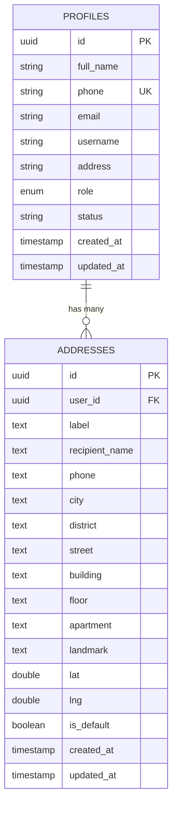

**Diagram sources**
- [schema.prisma:617-635](file://apps/api/prisma/schema.prisma#L617-L635)
- [20260530_create_addresses.sql:5-23](file://database/20260530_create_addresses.sql#L5-L23)

**Section sources**
- [schema.prisma:617-635](file://apps/api/prisma/schema.prisma#L617-L635)
- [20260530_create_addresses.sql:5-70](file://database/20260530_create_addresses.sql#L5-L70)

### Loyalty Program Integration
- Points awarded when order payment_status transitions to verified
- Idempotency ensured via unique constraint on order_id in loyalty_point_awards
- Wallet balances updated atomically; ledger records track all point movements
- Configurable points-per-EGP rate and minimum order threshold

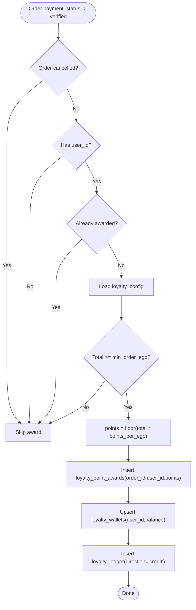

**Diagram sources**
- [20260526_fix_loyalty_points_and_orders.sql:94-175](file://database/20260526_fix_loyalty_points_and_orders.sql#L94-L175)
- [20260526_fix_loyalty_points_and_orders.sql:181-187](file://database/20260526_fix_loyalty_points_and_orders.sql#L181-L187)
- [20260526_fix_loyalty_points_and_orders.sql:194-212](file://database/20260526_fix_loyalty_points_and_orders.sql#L194-L212)

**Section sources**
- [20260526_fix_loyalty_points_and_orders.sql:27-37](file://database/20260526_fix_loyalty_points_and_orders.sql#L27-L37)
- [20260526_fix_loyalty_points_and_orders.sql:43-52](file://database/20260526_fix_loyalty_points_and_orders.sql#L43-L52)
- [20260526_fix_loyalty_points_and_orders.sql:94-175](file://database/20260526_fix_loyalty_points_and_orders.sql#L94-L175)
- [20260526_fix_loyalty_points_and_orders.sql:181-187](file://database/20260526_fix_loyalty_points_and_orders.sql#L181-L187)
- [20260526_fix_loyalty_points_and_orders.sql:194-212](file://database/20260526_fix_loyalty_points_and_orders.sql#L194-L212)

### Customer Analytics, Segmentation, and Marketing Automation
- Zero-order customers eligible for SMS campaigns are surfaced by the admin client
- Admin API integrates with Supabase to fetch profiles and map them for campaign targeting
- Segmentation can be extended using profile attributes (role, status, phone, email)

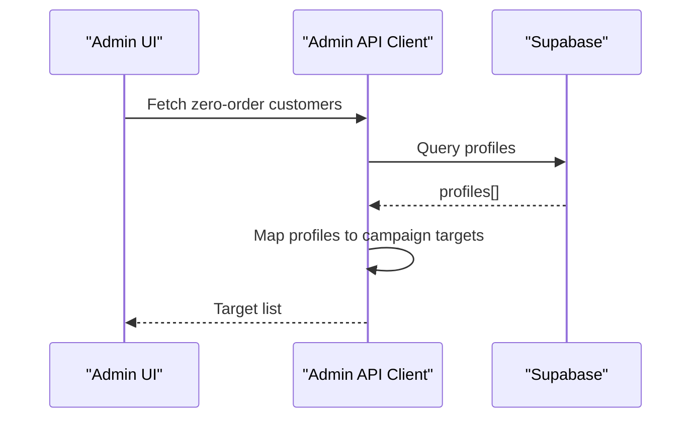

**Diagram sources**
- [api.ts:148-148](file://apps/admin/src/lib/api.ts#L148-L148)
- [api.ts:207-223](file://apps/admin/src/lib/api.ts#L207-L223)
- [api.ts:344-344](file://apps/admin/src/lib/api.ts#L344-L344)

**Section sources**
- [api.ts:148-148](file://apps/admin/src/lib/api.ts#L148-L148)
- [api.ts:207-223](file://apps/admin/src/lib/api.ts#L207-L223)
- [api.ts:344-344](file://apps/admin/src/lib/api.ts#L344-L344)

### Customer Support Tools, Communication History, and Service Level Tracking
- Orders capture delivery address snapshots and timestamps for service tracking
- Roles and statuses enable filtering for support workflows
- Notifications and driver-customer interactions provide communication channels

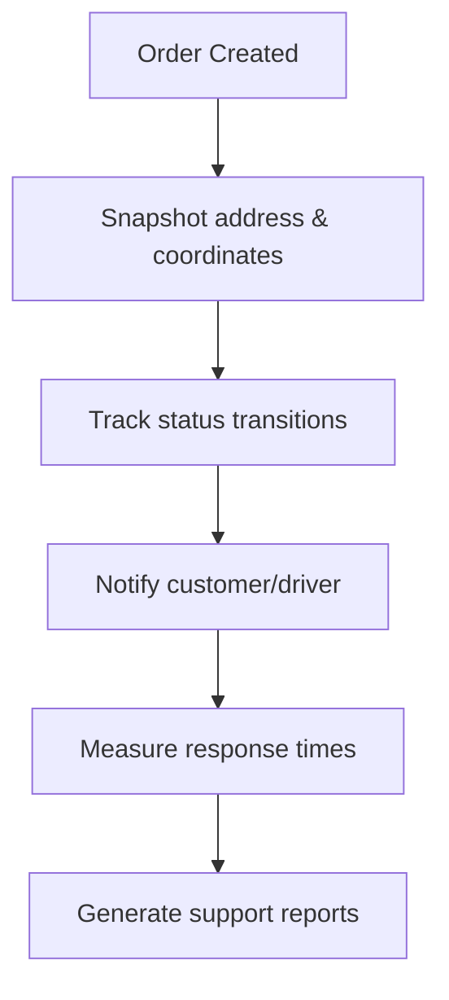

[No sources needed since this diagram shows conceptual workflow, not actual code structure]

## Dependency Analysis
The Customers module depends on:
- PrismaModule for database access
- AuthModule for authentication and authorization
- Role-based guards to enforce admin-only access

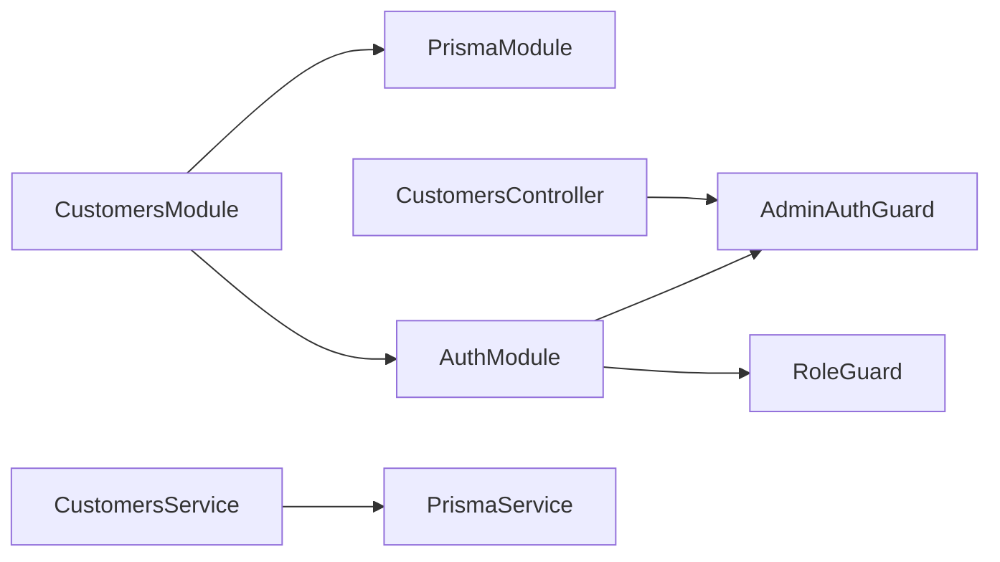

**Diagram sources**
- [customers.module.ts:7-12](file://apps/api/src/modules/customers/customers.module.ts#L7-L12)
- [auth.module.ts](file://apps/api/src/auth/auth.module.ts)
- [admin-auth.guard.ts](file://apps/api/src/auth/admin-auth.guard.ts)
- [role-auth.guard.ts:16-25](file://apps/api/src/auth/role-auth.guard.ts#L16-L25)

**Section sources**
- [customers.module.ts:1-14](file://apps/api/src/modules/customers/customers.module.ts#L1-L14)
- [auth.module.ts](file://apps/api/src/auth/auth.module.ts)
- [role-auth.guard.ts:16-25](file://apps/api/src/auth/role-auth.guard.ts#L16-L25)

## Performance Considerations
- Use pagination to avoid large result sets
- Leverage indexes on frequently queried columns (e.g., orders.status, orders.payment_status)
- Ensure concurrent queries are batched where possible (already done via Promise.all)
- Apply row-level security to minimize data exposure and improve query efficiency

[No sources needed since this section provides general guidance]

## Troubleshooting Guide
Common issues and resolutions:
- Unauthorized access: Verify AdminAuthGuard and role checks are correctly configured
- Missing profiles: Ensure profiles exist and have correct role/status values
- Loyalty points not awarded: Confirm payment_status transition to verified and that order is not cancelled
- Address access denied: Check RLS policies and ensure user_id matches current authenticated user

**Section sources**
- [role-auth.guard.ts:16-25](file://apps/api/src/auth/role-auth.guard.ts#L16-L25)
- [20260526_fix_loyalty_points_and_orders.sql:94-175](file://database/20260526_fix_loyalty_points_and_orders.sql#L94-L175)
- [20260530_create_addresses.sql:35-55](file://database/20260530_create_addresses.sql#L35-L55)

## Conclusion
The Customers module provides a secure, paginated interface for managing customer profiles with robust authentication and authorization. It integrates with loyalty programs through database triggers and supports address management with strict access controls. While basic analytics and marketing features are present, additional enhancements can be built upon the existing foundation to support advanced segmentation and communication workflows.

[No sources needed since this section summarizes without analyzing specific files]

## Appendices
- API Reference: GET /admin/customers?page=1&limit=20 returns paginated customer list
- Data Models: profiles, addresses, loyalty tables (wallets, ledger, awards)
- Security: Row-level security policies for addresses and loyalty data

[No sources needed since this section provides general reference information]