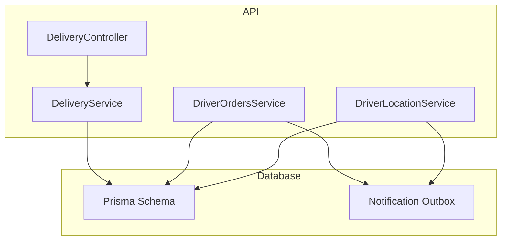
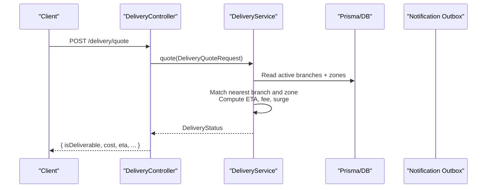
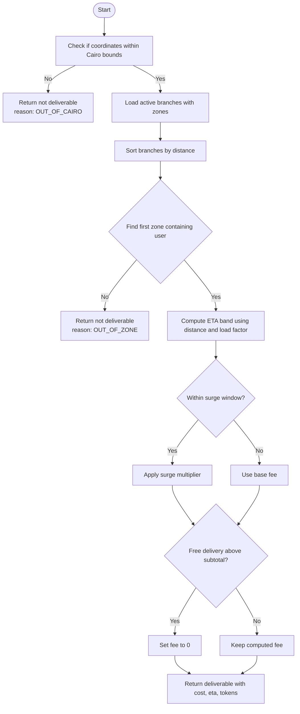
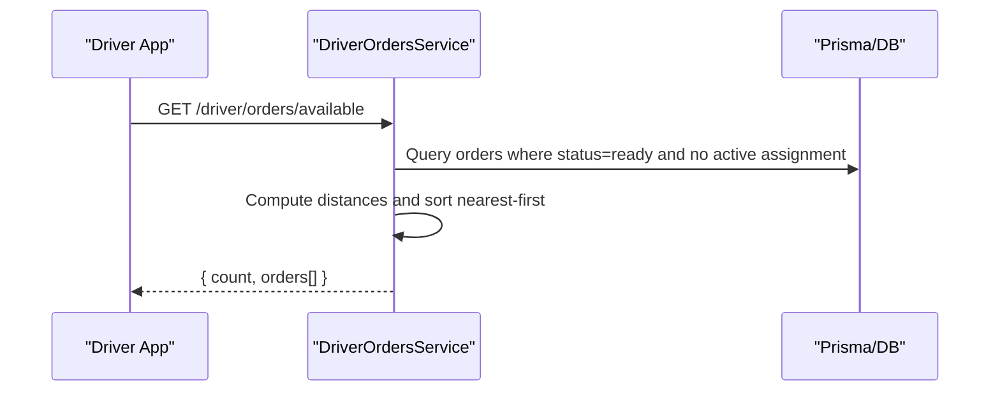
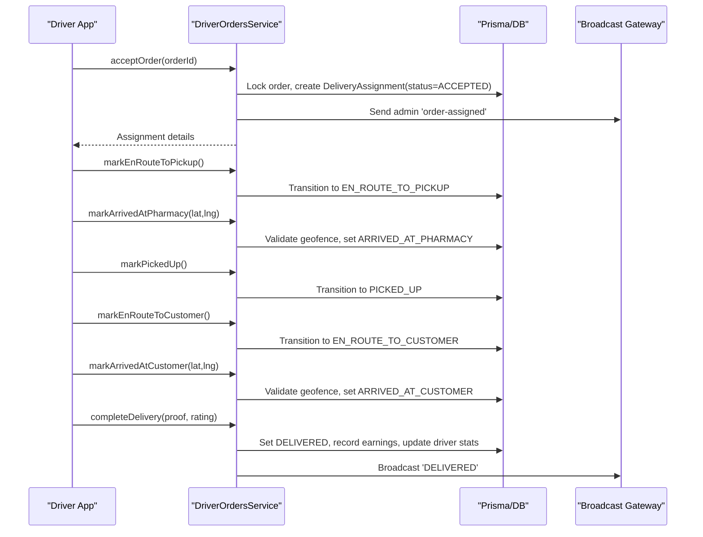
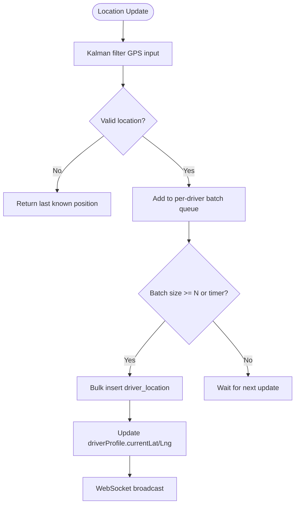
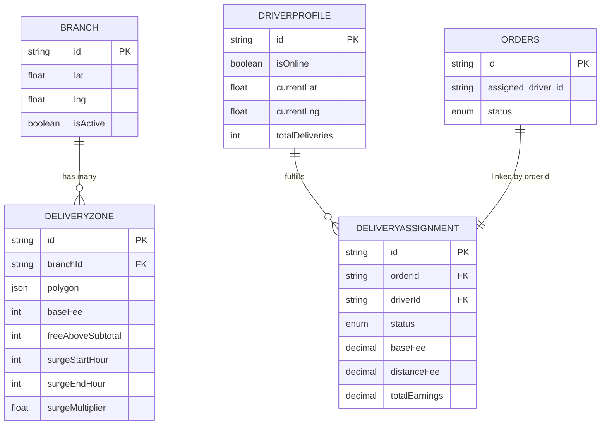
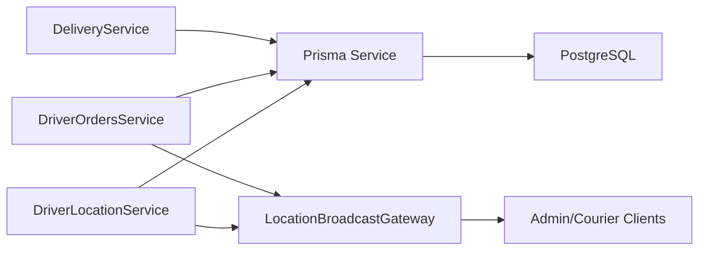

# Delivery Assignment & Scheduling

<cite>
**Referenced Files in This Document**
- [delivery.service.ts](file://apps/api/src/modules/delivery/delivery.service.ts)
- [delivery.controller.ts](file://apps/api/src/modules/delivery/delivery.controller.ts)
- [driver-orders.service.ts](file://apps/api/src/modules/driver/driver-orders.service.ts)
- [driver-location.service.ts](file://apps/api/src/modules/driver/driver-location.service.ts)
- [schema.prisma](file://apps/api/prisma/schema.prisma)
- [20260713090000_notification_delivery_pipeline.sql](file://supabase/migrations/20260713090000_notification_delivery_pipeline.sql)
</cite>

## Table of Contents
1. Introduction
2. Project Structure
3. Core Components
4. Architecture Overview
5. Detailed Component Analysis
6. Dependency Analysis
7. Performance Considerations
8. Troubleshooting Guide
9. Conclusion
10. Appendices

## Introduction
This document explains the delivery assignment and scheduling functionality implemented in the API layer. It covers:
- Automatic driver assignment logic based on proximity, availability, and workload balancing
- Delivery scheduling logic including time windows, priority handling, and batch optimization
- End-to-end workflow from order creation to driver notification
- Configuration options for assignment rules, fallback mechanisms, and manual override capabilities

The system uses a branch-and-zone model to determine deliverability and cost, a driver-driven acceptance flow with geofence validation, and a durable notification pipeline for real-time updates.

## Project Structure
The delivery and driver features are implemented under the API module:
- Delivery quote and zone matching: apps/api/src/modules/delivery
- Driver orders lifecycle and transitions: apps/api/src/modules/driver
- Location tracking and batching: apps/api/src/modules/driver
- Data models and enums: apps/api/prisma/schema.prisma
- Notification outbox and idempotency: supabase/migrations/20260713090000_notification_delivery_pipeline.sql

**Diagram sources**
- [delivery.controller.ts:6-14](file://apps/api/src/modules/delivery/delivery.controller.ts#L6-L14)
- [delivery.service.ts:58-238](file://apps/api/src/modules/delivery/delivery.service.ts#L58-L238)
- [driver-orders.service.ts:49-621](file://apps/api/src/modules/driver/driver-orders.service.ts#L49-L621)
- [driver-location.service.ts:7-352](file://apps/api/src/modules/driver/driver-location.service.ts#L7-L352)
- [schema.prisma:765-1066](file://apps/api/prisma/schema.prisma#L765-L1066)
- [20260713090000_notification_delivery_pipeline.sql:11-94](file://supabase/migrations/20260713090000_notification_delivery_pipeline.sql#L11-L94)

**Section sources**
- [delivery.controller.ts:6-14](file://apps/api/src/modules/delivery/delivery.controller.ts#L6-L14)
- [delivery.service.ts:58-238](file://apps/api/src/modules/delivery/delivery.service.ts#L58-L238)
- [driver-orders.service.ts:49-621](file://apps/api/src/modules/driver/driver-orders.service.ts#L49-L621)
- [driver-location.service.ts:7-352](file://apps/api/src/modules/driver/driver-location.service.ts#L7-L352)
- [schema.prisma:765-1066](file://apps/api/prisma/schema.prisma#L765-L1066)
- [20260713090000_notification_delivery_pipeline.sql:11-94](file://supabase/migrations/20260713090000_notification_delivery_pipeline.sql#L11-L94)

## Core Components
- DeliveryService: Computes quotes, matches branches/zones, calculates ETA and fees, and enforces geographic constraints.
- DriverOrdersService: Manages available orders, driver acceptance, workflow transitions, earnings, and broadcasts status updates.
- DriverLocationService: Filters GPS data, batches writes, updates driver current location, and broadcasts status changes.
- Prisma schema: Defines Branch, DeliveryZone, DriverProfile, DeliveryAssignment, and related entities/enums.
- Notification pipeline: Provides durable, idempotent notifications via an outbox table and SQL functions.

Key responsibilities:
- Quote and eligibility: branch selection by distance, zone polygon containment, surge pricing, free delivery thresholds.
- Assignment: driver-driven acceptance with concurrency control and active-delivery guardrails.
- Scheduling: ETA bands, time-window surge checks, and optional load factor adjustments.
- Tracking: Kalman-filtered locations, batched persistence, and real-time broadcast.
- Notifications: Enqueue and claim-based processing for reliable delivery.

**Section sources**
- [delivery.service.ts:58-238](file://apps/api/src/modules/delivery/delivery.service.ts#L58-L238)
- [driver-orders.service.ts:74-322](file://apps/api/src/modules/driver/driver-orders.service.ts#L74-L322)
- [driver-location.service.ts:30-127](file://apps/api/src/modules/driver/driver-location.service.ts#L30-L127)
- [schema.prisma:765-1066](file://apps/api/prisma/schema.prisma#L765-L1066)
- [20260713090000_notification_delivery_pipeline.sql:50-94](file://supabase/migrations/20260713090000_notification_delivery_pipeline.sql#L50-L94)

## Architecture Overview
The system separates concerns into three layers:
- API controllers expose endpoints (e.g., delivery quote).
- Services implement business logic (quote calculation, assignment, transitions, location updates).
- Database and messaging provide persistence and durable notifications.

**Diagram sources**
- [delivery.controller.ts:6-14](file://apps/api/src/modules/delivery/delivery.controller.ts#L6-L14)
- [delivery.service.ts:62-238](file://apps/api/src/modules/delivery/delivery.service.ts#L62-L238)

## Detailed Component Analysis

### Delivery Quote and Zone Matching
- Geographic gating: Rejects coordinates outside Greater Cairo bounding box.
- Branch selection: Sorts active branches by distance to user; supports requested branch override.
- Zone matching: For each branch, sorts zones by baseFee ascending and tests point-in-polygon to find the best zone.
- ETA and cost: Uses a traffic-aware ETA band and applies surge multiplier within configured hours; free delivery threshold can zero the fee.
- Tokens: Generates assignment and quote tokens for downstream flows.

**Diagram sources**
- [delivery.service.ts:39-56](file://apps/api/src/modules/delivery/delivery.service.ts#L39-L56)
- [delivery.service.ts:62-238](file://apps/api/src/modules/delivery/delivery.service.ts#L62-L238)

**Section sources**
- [delivery.service.ts:39-56](file://apps/api/src/modules/delivery/delivery.service.ts#L39-L56)
- [delivery.service.ts:62-238](file://apps/api/src/modules/delivery/delivery.service.ts#L62-L238)

### Driver Availability and Order Discovery
- Available orders: Returns orders in ready state without an active assignment or with failed/rejected/cancelled assignments.
- Proximity sorting: When driver location is available, orders are sorted by distance to pickup (pharmacy), improving response time and reducing deadhead miles.
- Earnings estimate: Combines a base fee with a per-kilometer component derived from estimated total distance.

**Diagram sources**
- [driver-orders.service.ts:74-183](file://apps/api/src/modules/driver/driver-orders.service.ts#L74-L183)

**Section sources**
- [driver-orders.service.ts:74-183](file://apps/api/src/modules/driver/driver-orders.service.ts#L74-L183)

### Assignment Workflow: Acceptance, Transitions, and Completion
- Accept order: Validates driver online status, ensures no active delivery, locks order in transaction, creates DeliveryAssignment, updates order status, and broadcasts assignment to admins.
- Rejection: Marks assignment rejected and reopens order to ready state.
- Lifecycle transitions: Enforce valid state transitions, update both assignment and order statuses, and broadcast updates.
- Completion: Records proof, computes actual duration, records earnings, updates driver metrics, and marks order delivered.

**Diagram sources**
- [driver-orders.service.ts:187-510](file://apps/api/src/modules/driver/driver-orders.service.ts#L187-L510)
- [driver-orders.service.ts:569-619](file://apps/api/src/modules/driver/driver-orders.service.ts#L569-L619)

**Section sources**
- [driver-orders.service.ts:187-510](file://apps/api/src/modules/driver/driver-orders.service.ts#L187-L510)
- [driver-orders.service.ts:569-619](file://apps/api/src/modules/driver/driver-orders.service.ts#L569-L619)

### Time Windows, Priority Handling, and Batch Optimization
- Time windows: Surge pricing is applied when the current hour falls within configured start/end hours for a zone, supporting midnight wrap-around.
- Priority handling: Orders are surfaced to drivers ordered by proximity to pickup when driver location is known; older orders surface earlier due to created_at ordering.
- Batch optimization:
  - Driver location updates are filtered via Kalman filter and batched for efficient database writes.
  - Notification enqueueing uses an outbox with idempotency keys and claim-based processing to ensure durability and avoid duplicates.

**Diagram sources**
- [driver-location.service.ts:30-127](file://apps/api/src/modules/driver/driver-location.service.ts#L30-L127)
- [driver-location.service.ts:268-318](file://apps/api/src/modules/driver/driver-location.service.ts#L268-L318)

**Section sources**
- [delivery.service.ts:49-56](file://apps/api/src/modules/delivery/delivery.service.ts#L49-L56)
- [driver-orders.service.ts:74-183](file://apps/api/src/modules/driver/driver-orders.service.ts#L74-L183)
- [driver-location.service.ts:30-127](file://apps/api/src/modules/driver/driver-location.service.ts#L30-L127)
- [driver-location.service.ts:268-318](file://apps/api/src/modules/driver/driver-location.service.ts#L268-L318)
- [20260713090000_notification_delivery_pipeline.sql:50-94](file://supabase/migrations/20260713090000_notification_delivery_pipeline.sql#L50-L94)

### Data Model Relationships

**Diagram sources**
- [schema.prisma:765-934](file://apps/api/prisma/schema.prisma#L765-L934)

**Section sources**
- [schema.prisma:765-934](file://apps/api/prisma/schema.prisma#L765-L934)

## Dependency Analysis
- DeliveryService depends on Prisma for branch and zone queries and uses geometry utilities for point-in-polygon checks.
- DriverOrdersService depends on Prisma for order and assignment state management and on a broadcast gateway for admin updates.
- DriverLocationService depends on Prisma for profile/location tables and on a broadcast gateway for live updates.
- Notification pipeline relies on SQL functions and outbox tables for durable, idempotent messaging.

**Diagram sources**
- [delivery.service.ts:58-238](file://apps/api/src/modules/delivery/delivery.service.ts#L58-L238)
- [driver-orders.service.ts:49-621](file://apps/api/src/modules/driver/driver-orders.service.ts#L49-L621)
- [driver-location.service.ts:7-352](file://apps/api/src/modules/driver/driver-location.service.ts#L7-L352)

**Section sources**
- [delivery.service.ts:58-238](file://apps/api/src/modules/delivery/delivery.service.ts#L58-L238)
- [driver-orders.service.ts:49-621](file://apps/api/src/modules/driver/driver-orders.service.ts#L49-L621)
- [driver-location.service.ts:7-352](file://apps/api/src/modules/driver/driver-location.service.ts#L7-L352)

## Performance Considerations
- ETA estimation uses a simple linear model with a base prep time and drive time scaled by distance and load factor; suitable for quick client feedback.
- Sorting candidates by distance minimizes average travel time and improves customer experience.
- Kalman filtering reduces noisy GPS updates; batching reduces database write overhead.
- Notification outbox prevents duplicate sends and enables retry semantics.

[No sources needed since this section provides general guidance]

## Troubleshooting Guide
Common issues and resolutions:
- Out-of-area deliveries: Ensure coordinates fall within the supported region; otherwise, the quote returns a not-deliverable reason code.
- No matching zone: Verify that branch zones cover the customer’s location and that polygons are correctly defined.
- Driver cannot accept order: Confirm the driver is online and has no active delivery; check for conflicts indicating existing assignments.
- Geofence errors at pharmacy/customer arrival: Ensure driver is within the allowed radius before marking arrivals.
- Duplicate notifications: Use idempotency keys when enqueuing; rely on the outbox’s unique constraint to deduplicate.

**Section sources**
- [delivery.service.ts:74-178](file://apps/api/src/modules/delivery/delivery.service.ts#L74-L178)
- [driver-orders.service.ts:187-215](file://apps/api/src/modules/driver/driver-orders.service.ts#L187-L215)
- [driver-orders.service.ts:386-433](file://apps/api/src/modules/driver/driver-orders.service.ts#L386-L433)
- [20260713090000_notification_delivery_pipeline.sql:50-69](file://supabase/migrations/20260713090000_notification_delivery_pipeline.sql#L50-L69)

## Conclusion
The system implements a robust delivery assignment and scheduling flow:
- Quote engine determines deliverability, cost, and ETA using branch proximity, zone geometry, and surge windows.
- Driver-driven assignment ensures fairness and capacity control while providing proximity-based discovery.
- Strict state transitions and geofence validations maintain operational integrity.
- Location tracking and notifications are optimized for performance and reliability.

Configuration points include:
- Branch load factors and zone surge settings to tune ETA and pricing.
- Free delivery thresholds to incentivize larger orders.
- Geofence radii for arrival validations.
- Notification outbox usage for durable messaging.

[No sources needed since this section summarizes without analyzing specific files]

## Appendices

### Configuration Options Summary
- Delivery quoting:
  - Region gating: Greater Cairo bounding box enforced.
  - Branch selection: Nearest active branch; optional requested branch override.
  - Zone matching: Polygon containment; sorted by baseFee.
  - ETA: Base prep time plus drive time scaled by load factor; buffer added.
  - Pricing: Base fee with surge multiplier during configured hours; free delivery above subtotal.
- Assignment:
  - Driver must be online and have no active delivery.
  - Orders returned nearest-first when driver location is available.
- Transitions:
  - Pharmacy and customer arrivals validated within a fixed radius.
  - Status transitions update both assignment and order states.
- Notifications:
  - Idempotent enqueue via SQL function; outbox-based processing.

**Section sources**
- [delivery.service.ts:39-56](file://apps/api/src/modules/delivery/delivery.service.ts#L39-L56)
- [delivery.service.ts:62-238](file://apps/api/src/modules/delivery/delivery.service.ts#L62-L238)
- [driver-orders.service.ts:74-183](file://apps/api/src/modules/driver/driver-orders.service.ts#L74-L183)
- [driver-orders.service.ts:386-433](file://apps/api/src/modules/driver/driver-orders.service.ts#L386-L433)
- [20260713090000_notification_delivery_pipeline.sql:50-94](file://supabase/migrations/20260713090000_notification_delivery_pipeline.sql#L50-L94)