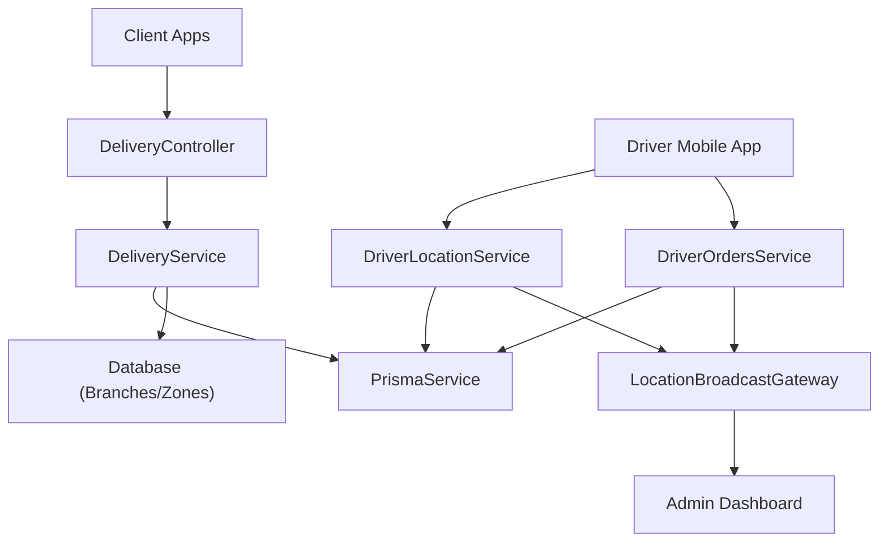
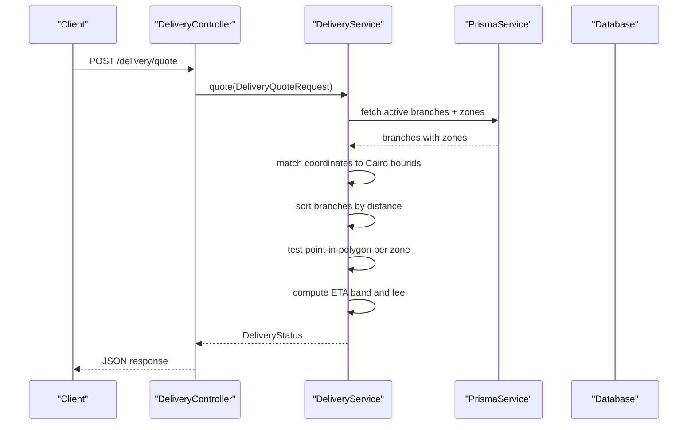
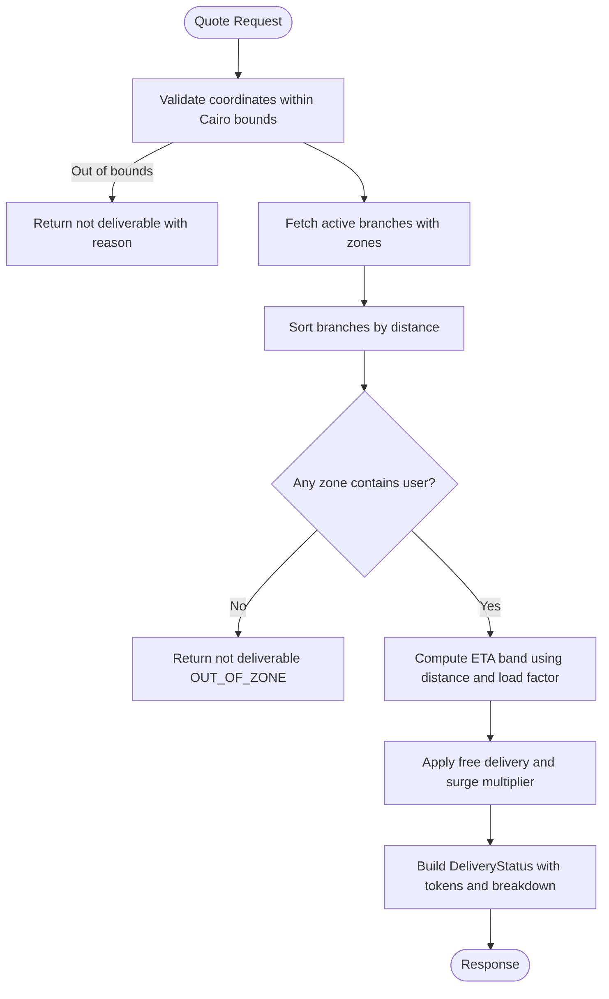
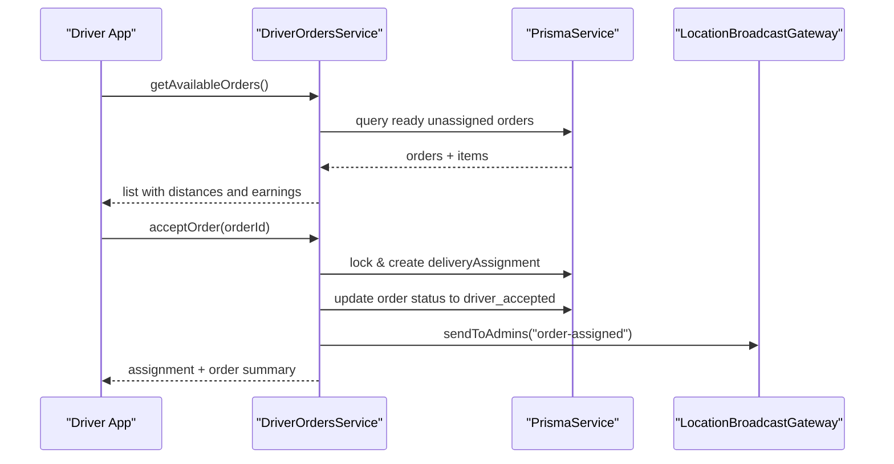
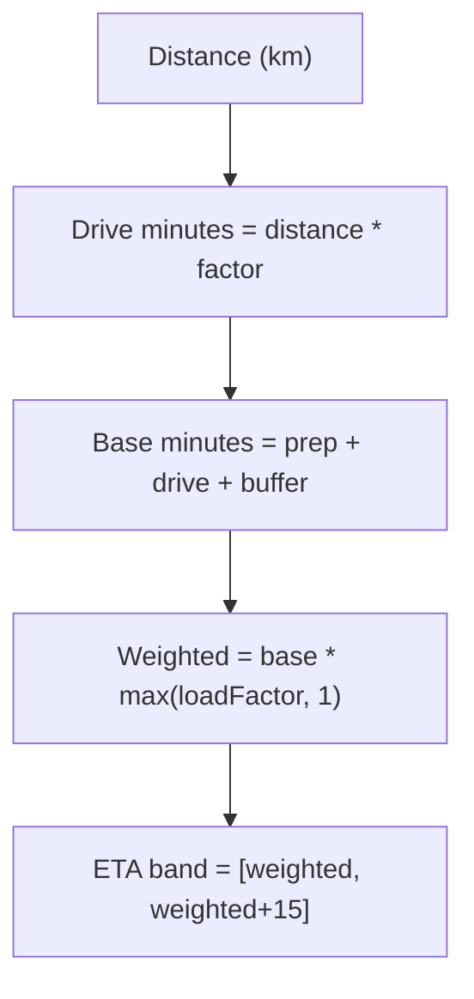
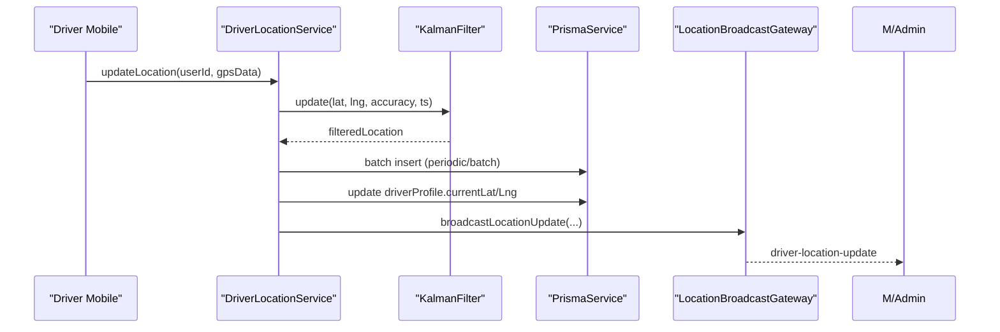
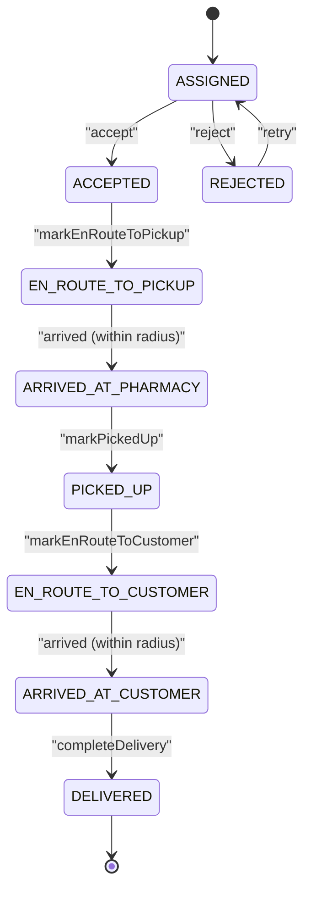
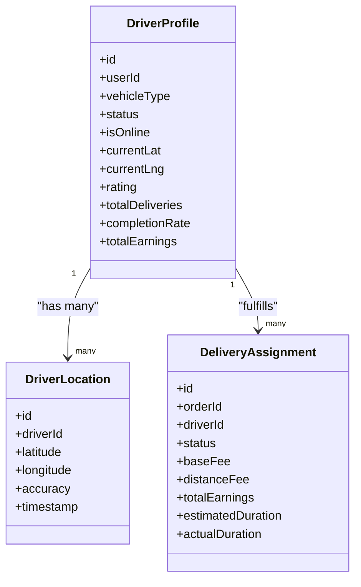
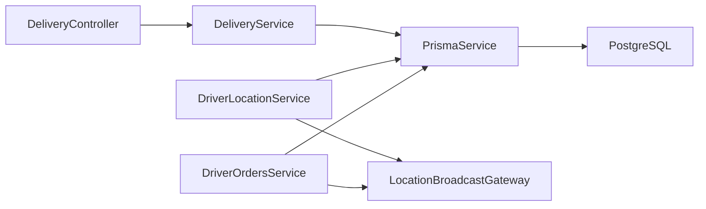

# Delivery Module

<cite>
**Referenced Files in This Document**
- [delivery.service.ts](file://apps/api/src/modules/delivery/delivery.service.ts)
- [delivery.controller.ts](file://apps/api/src/modules/delivery/delivery.controller.ts)
- [driver-location.service.ts](file://apps/api/src/modules/driver/driver-location.service.ts)
- [location-broadcast.gateway.ts](file://apps/api/src/modules/driver/location-broadcast.gateway.ts)
- [driver-orders.service.ts](file://apps/api/src/modules/driver/driver-orders.service.ts)
- [delivery.ts](file://packages/contracts/src/delivery.ts)
- [schema.prisma](file://apps/api/prisma/schema.prisma)
</cite>

## Table of Contents
1. Introduction
2. Project Structure
3. Core Components
4. Architecture Overview
5. Detailed Component Analysis
6. Dependency Analysis
7. Performance Considerations
8. Troubleshooting Guide
9. Conclusion

## Introduction
This document explains the end-to-end delivery management capabilities implemented in the Delivery module. It covers driver assignment and availability, route and zone logic used for quoting and ETA, real-time GPS tracking with WebSocket broadcasting, delivery status transitions, scheduling via order lifecycle, batch handling, and exception handling for failed deliveries. The goal is to provide a clear, code-grounded understanding of how orders are quoted, assigned, tracked, and completed.

## Project Structure
The Delivery module spans API controllers, services, contracts, and database models:
- Delivery quoting and zone matching live in the delivery service and controller.
- Driver location tracking and broadcast use a dedicated service and WebSocket gateway.
- Order acceptance, workflow transitions, and completion are handled by the driver orders service.
- Contracts define request/response schemas for quotes and statuses.
- Prisma schema defines core entities such as Branch, DeliveryZone, DriverProfile, DriverLocation, DeliveryAssignment, and related tables.

**Diagram sources**
- [delivery.controller.ts:6-14](file://apps/api/src/modules/delivery/delivery.controller.ts#L6-L14)
- [delivery.service.ts:58-238](file://apps/api/src/modules/delivery/delivery.service.ts#L58-L238)
- [driver-location.service.ts:7-127](file://apps/api/src/modules/driver/driver-location.service.ts#L7-L127)
- [location-broadcast.gateway.ts:27-93](file://apps/api/src/modules/driver/location-broadcast.gateway.ts#L27-L93)
- [driver-orders.service.ts:49-183](file://apps/api/src/modules/driver/driver-orders.service.ts#L49-L183)

**Section sources**
- [delivery.controller.ts:1-17](file://apps/api/src/modules/delivery/delivery.controller.ts#L1-L17)
- [delivery.service.ts:1-240](file://apps/api/src/modules/delivery/delivery.service.ts#L1-L240)
- [driver-location.service.ts:1-352](file://apps/api/src/modules/driver/driver-location.service.ts#L1-L352)
- [location-broadcast.gateway.ts:1-214](file://apps/api/src/modules/driver/location-broadcast.gateway.ts#L1-L214)
- [driver-orders.service.ts:1-621](file://apps/api/src/modules/driver/driver-orders.service.ts#L1-L621)
- [delivery.ts:1-67](file://packages/contracts/src/delivery.ts#L1-L67)
- [schema.prisma:765-1066](file://apps/api/prisma/schema.prisma#L765-L1066)

## Core Components
- Delivery Quoting and Zone Matching: Computes deliverability, cost, ETA band, and assigns tokens based on branch proximity and polygon containment.
- Real-Time Location Tracking: Accepts GPS updates, applies Kalman filtering, batches writes, updates current position, and broadcasts changes via WebSockets.
- Driver Orders Workflow: Lists available orders, accepts/rejects, transitions through pickup/delivery states, enforces geofencing, records earnings, and updates order statuses.
- WebSocket Broadcast Gateway: Authenticates admin clients, manages rooms, and emits driver location/status updates and delivery events.
- Data Models: Branch, DeliveryZone, DriverProfile, DriverLocation, DeliveryAssignment, and related tables store all state required for delivery operations.

**Section sources**
- [delivery.service.ts:58-238](file://apps/api/src/modules/delivery/delivery.service.ts#L58-L238)
- [driver-location.service.ts:7-127](file://apps/api/src/modules/driver/driver-location.service.ts#L7-L127)
- [driver-orders.service.ts:74-183](file://apps/api/src/modules/driver/driver-orders.service.ts#L74-L183)
- [location-broadcast.gateway.ts:27-93](file://apps/api/src/modules/driver/location-broadcast.gateway.ts#L27-L93)
- [schema.prisma:765-1066](file://apps/api/prisma/schema.prisma#L765-L1066)

## Architecture Overview
The system separates concerns into clear layers:
- API Layer: Controllers expose REST endpoints for quoting and driver actions.
- Service Layer: Business logic for quoting, location processing, and order workflow.
- Persistence Layer: Prisma client interacts with PostgreSQL for all entities.
- Real-Time Layer: WebSocket gateway broadcasts driver locations and delivery events to admins and clients.

**Diagram sources**
- [delivery.controller.ts:6-14](file://apps/api/src/modules/delivery/delivery.controller.ts#L6-L14)
- [delivery.service.ts:58-238](file://apps/api/src/modules/delivery/delivery.service.ts#L58-L238)

## Detailed Component Analysis

### Delivery Quoting and Zone Management
- Coordinate validation: Enforces Greater Cairo bounding box to gate service area.
- Branch selection: Retrieves active branches and sorts by distance from user coordinates.
- Zone matching: For each branch, sorts zones by base fee and tests point-in-polygon to find the nearest applicable zone.
- ETA calculation: Uses a traffic-aware model that adds base prep time, drive minutes proportional to distance, and handover buffer; scales by load factor.
- Pricing: Applies free delivery thresholds and surge multipliers within configured windows; returns breakdown details.
- Tokens: Generates assignment and quote tokens for downstream flows.

**Diagram sources**
- [delivery.service.ts:58-238](file://apps/api/src/modules/delivery/delivery.service.ts#L58-L238)

**Section sources**
- [delivery.service.ts:58-238](file://apps/api/src/modules/delivery/delivery.service.ts#L58-L238)
- [delivery.ts:21-67](file://packages/contracts/src/delivery.ts#L21-L67)
- [schema.prisma:765-803](file://apps/api/prisma/schema.prisma#L765-L803)

### Driver Assignment and Availability
- Available orders: Returns ready orders not assigned or previously rejected/cancelled; computes distances and estimated earnings; optionally sorts by proximity when driver location is known.
- Acceptance: Ensures driver has no active delivery; creates a delivery assignment with estimated metrics; updates order to driver-accepted state; broadcasts assignment to admins.
- Rejection: Marks assignment as rejected and reverts order to ready for retry.

**Diagram sources**
- [driver-orders.service.ts:74-183](file://apps/api/src/modules/driver/driver-orders.service.ts#L74-L183)
- [driver-orders.service.ts:187-295](file://apps/api/src/modules/driver/driver-orders.service.ts#L187-L295)
- [location-broadcast.gateway.ts:190-195](file://apps/api/src/modules/driver/location-broadcast.gateway.ts#L190-L195)

**Section sources**
- [driver-orders.service.ts:74-183](file://apps/api/src/modules/driver/driver-orders.service.ts#L74-L183)
- [driver-orders.service.ts:187-295](file://apps/api/src/modules/driver/driver-orders.service.ts#L187-L295)

### Route Optimization and ETA
- Distance computation: Haversine formula used for both branch-to-user and pharmacy-to-customer legs.
- ETA bands: Base prep time plus drive minutes scaled by city speed assumptions and handover buffer; multiplied by load factor to reflect branch congestion.
- Surge pricing: Time-window checks apply surge multipliers to fees without changing ETA band logic.

**Diagram sources**
- [delivery.service.ts:21-33](file://apps/api/src/modules/delivery/delivery.service.ts#L21-L33)

**Section sources**
- [delivery.service.ts:21-33](file://apps/api/src/modules/delivery/delivery.service.ts#L21-L33)
- [delivery.service.ts:181-200](file://apps/api/src/modules/delivery/delivery.service.ts#L181-L200)

### Real-Time Delivery Tracking with GPS Integration
- GPS filtering: Each driver’s incoming GPS points are smoothed using a Kalman filter to reject outliers and impossible speeds.
- Batched persistence: Updates are accumulated per driver and flushed periodically or when batch size threshold is reached to reduce DB writes.
- Current position: Driver profile fields are updated immediately for low-latency queries and map rendering.
- Broadcasting: On successful update, a WebSocket event is emitted containing driver identity, vehicle info, latest coordinates, and timestamp.

**Diagram sources**
- [driver-location.service.ts:30-127](file://apps/api/src/modules/driver/driver-location.service.ts#L30-L127)
- [location-broadcast.gateway.ts:120-127](file://apps/api/src/modules/driver/location-broadcast.gateway.ts#L120-L127)

**Section sources**
- [driver-location.service.ts:30-127](file://apps/api/src/modules/driver/driver-location.service.ts#L30-L127)
- [driver-location.service.ts:268-318](file://apps/api/src/modules/driver/driver-location.service.ts#L268-L318)
- [location-broadcast.gateway.ts:120-127](file://apps/api/src/modules/driver/location-broadcast.gateway.ts#L120-L127)

### Delivery Status Updates and Exception Handling
- Geofenced arrivals: Pharmacy and customer arrival checks enforce a radius threshold before allowing transition to arrived states.
- State machine: Transitions move between accepted, en-route, arrived, picked-up, delivered; order status is synchronized accordingly.
- Completion: Records proof, notes, ratings, calculates actual duration, creates earnings, increments driver counters, and broadcasts final status.
- Exceptions: Throws appropriate errors for invalid transitions, out-of-range arrivals, missing assignments, and conflicts like multiple active deliveries.

**Diagram sources**
- [driver-orders.service.ts:382-510](file://apps/api/src/modules/driver/driver-orders.service.ts#L382-L510)
- [schema.prisma:1050-1065](file://apps/api/prisma/schema.prisma#L1050-L1065)

**Section sources**
- [driver-orders.service.ts:382-510](file://apps/api/src/modules/driver/driver-orders.service.ts#L382-L510)

### Driver Management: Registration, Availability, and Metrics
- Profiles and documents: Driver profiles store vehicle details, license info, and photo URLs.
- Availability: Online/offline flags and last location timestamps enable dispatch visibility.
- Performance metrics: Ratings, total deliveries, completion rate, and cumulative earnings are maintained and updated upon completion.
- Sessions: Track online time, deliveries, earnings, and distance per shift.

**Diagram sources**
- [schema.prisma:806-855](file://apps/api/prisma/schema.prisma#L806-L855)
- [schema.prisma:857-877](file://apps/api/prisma/schema.prisma#L857-L877)
- [schema.prisma:879-934](file://apps/api/prisma/schema.prisma#L879-L934)

**Section sources**
- [schema.prisma:806-855](file://apps/api/prisma/schema.prisma#L806-L855)
- [schema.prisma:857-877](file://apps/api/prisma/schema.prisma#L857-L877)
- [schema.prisma:879-934](file://apps/api/prisma/schema.prisma#L879-L934)

### Delivery Scheduling and Batch Deliveries
- Scheduling: Orders progress through canonical statuses; drivers pick up “ready” orders and advance them through the workflow.
- Batch handling: Driver location updates are batched to minimize DB writes; order listing supports retries for previously rejected/cancelled assignments.
- Note: Dedicated batching of multiple orders per trip is not implemented in the analyzed code; the system focuses on one active delivery per driver at a time.

**Section sources**
- [driver-orders.service.ts:74-183](file://apps/api/src/modules/driver/driver-orders.service.ts#L74-L183)
- [driver-location.service.ts:268-318](file://apps/api/src/modules/driver/driver-location.service.ts#L268-L318)

## Dependency Analysis
Key dependencies and interactions:
- DeliveryController depends on DeliveryService and contract schemas for input validation.
- DeliveryService depends on PrismaService to read branches/zones and uses geometry utilities for point-in-polygon checks.
- DriverLocationService depends on PrismaService, a Kalman filter utility, and the WebSocket gateway for broadcasting.
- DriverOrdersService depends on PrismaService and the gateway to notify admins of assignment and status changes.
- Database schema provides the relational backbone for all entities.

**Diagram sources**
- [delivery.controller.ts:6-14](file://apps/api/src/modules/delivery/delivery.controller.ts#L6-L14)
- [delivery.service.ts:58-238](file://apps/api/src/modules/delivery/delivery.service.ts#L58-L238)
- [driver-location.service.ts:7-127](file://apps/api/src/modules/driver/driver-location.service.ts#L7-L127)
- [driver-orders.service.ts:49-183](file://apps/api/src/modules/driver/driver-orders.service.ts#L49-L183)
- [location-broadcast.gateway.ts:27-93](file://apps/api/src/modules/driver/location-broadcast.gateway.ts#L27-L93)

**Section sources**
- [delivery.controller.ts:1-17](file://apps/api/src/modules/delivery/delivery.controller.ts#L1-L17)
- [delivery.service.ts:1-240](file://apps/api/src/modules/delivery/delivery.service.ts#L1-L240)
- [driver-location.service.ts:1-352](file://apps/api/src/modules/driver/driver-location.service.ts#L1-L352)
- [driver-orders.service.ts:1-621](file://apps/api/src/modules/driver/driver-orders.service.ts#L1-L621)
- [location-broadcast.gateway.ts:1-214](file://apps/api/src/modules/driver/location-broadcast.gateway.ts#L1-L214)

## Performance Considerations
- Location batching reduces write amplification; tune batch size and interval to balance latency vs throughput.
- Kalman filtering prevents noisy GPS spikes from degrading map rendering and analytics.
- Sorting branches by distance and zones by base fee ensures optimal quoting performance and fairness.
- Use indexes defined in the schema for efficient queries on driver locations, assignments, and orders.

[No sources needed since this section provides general guidance]

## Troubleshooting Guide
Common issues and resolutions:
- Out-of-area requests: Quote returns not deliverable with reason codes; verify coordinates and zone configuration.
- No active branches: Ensure at least one branch is active and has zones covering target areas.
- Driver cannot update location: Must be online; check driver online flag and authentication.
- Arrival validation failures: Ensure driver is within geofence radius before marking arrival.
- Multiple active deliveries: Prevent concurrent assignments; ensure previous deliveries are completed or rejected.

**Section sources**
- [delivery.service.ts:71-179](file://apps/api/src/modules/delivery/delivery.service.ts#L71-L179)
- [driver-location.service.ts:30-44](file://apps/api/src/modules/driver/driver-location.service.ts#L30-L44)
- [driver-orders.service.ts:187-203](file://apps/api/src/modules/driver/driver-orders.service.ts#L187-L203)
- [driver-orders.service.ts:386-433](file://apps/api/src/modules/driver/driver-orders.service.ts#L386-L433)

## Conclusion
The Delivery module provides a robust foundation for end-to-end delivery management: accurate quoting with zone-based pricing and ETA, reliable driver assignment and workflow, real-time GPS tracking with noise filtering and broadcasting, and comprehensive status transitions with exception handling. The data model supports driver performance tracking and operational insights. Future enhancements could include advanced route optimization algorithms, multi-order batching, and expanded geofencing strategies.

[No sources needed since this section summarizes without analyzing specific files]