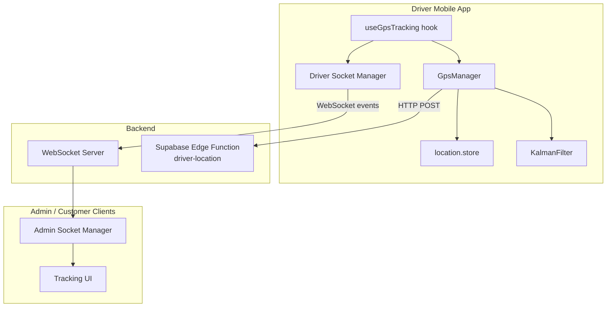
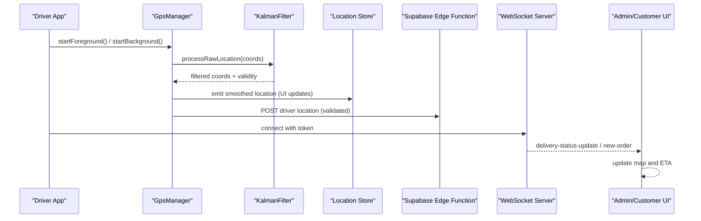
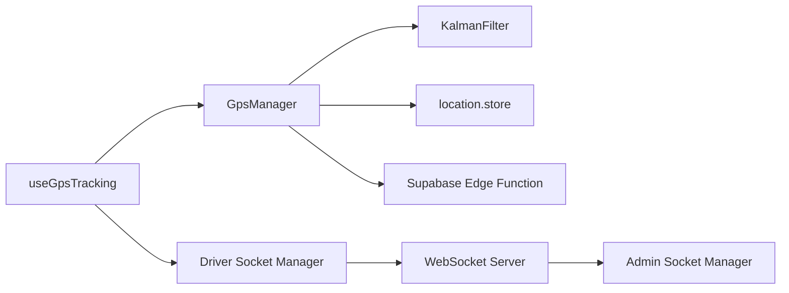

# Real-time Delivery Tracking

<cite>
**Referenced Files in This Document**
- [apps/courier-mobile/src/hooks/useGpsTracking.ts](file://apps/courier-mobile/src/hooks/useGpsTracking.ts)
- [apps/courier-mobile/src/lib/gps/GpsManager.ts](file://apps/courier-mobile/src/lib/gps/GpsManager.ts)
- [apps/courier-mobile/src/lib/gps/KalmanFilter.ts](file://apps/courier-mobile/src/lib/gps/KalmanFilter.ts)
- [apps/courier-mobile/src/stores/location.store.ts](file://apps/courier-mobile/src/stores/location.store.ts)
- [apps/courier-mobile/src/lib/socket.ts](file://apps/courier-mobile/src/lib/socket.ts)
- [apps/admin/src/lib/socket.ts](file://apps/admin/src/lib/socket.ts)
- [supabase/functions/driver-location/index.ts](file://supabase/functions/driver-location/index.ts)
</cite>

## Table of Contents
1. [Introduction](#introduction)
2. [Project Structure](#project-structure)
3. [Core Components](#core-components)
4. [Architecture Overview](#architecture-overview)
5. [Detailed Component Analysis](#detailed-component-analysis)
6. [Dependency Analysis](#dependency-analysis)
7. [Performance Considerations](#performance-considerations)
8. [Troubleshooting Guide](#troubleshooting-guide)
9. [Conclusion](#conclusion)

## Introduction
This document explains the real-time delivery tracking system with a focus on:
- GPS location broadcasting from the driver app to the backend via HTTP and WebSocket
- ETA calculations using distance algorithms (Haversine) and speed-based heuristics
- Live delivery status updates for customers and admin dashboards
- Location tracking architecture including frequency controls, accuracy filtering, and battery optimization
- Client-side integration points for tracking UI components and real-time map updates
- Error handling for location service failures and offline scenarios

## Project Structure
The tracking system spans mobile client logic, a background task for continuous tracking, a Supabase Edge Function for secure ingestion, and WebSocket channels for live updates across clients.

**Diagram sources**
- [apps/courier-mobile/src/hooks/useGpsTracking.ts:1-110](file://apps/courier-mobile/src/hooks/useGpsTracking.ts#L1-L110)
- [apps/courier-mobile/src/lib/gps/GpsManager.ts:1-245](file://apps/courier-mobile/src/lib/gps/GpsManager.ts#L1-L245)
- [apps/courier-mobile/src/lib/gps/KalmanFilter.ts:1-182](file://apps/courier-mobile/src/lib/gps/KalmanFilter.ts#L1-L182)
- [apps/courier-mobile/src/stores/location.store.ts:1-44](file://apps/courier-mobile/src/stores/location.store.ts#L1-L44)
- [apps/courier-mobile/src/lib/socket.ts:1-87](file://apps/courier-mobile/src/lib/socket.ts#L1-L87)
- [apps/admin/src/lib/socket.ts:1-61](file://apps/admin/src/lib/socket.ts#L1-L61)
- [supabase/functions/driver-location/index.ts:1-236](file://supabase/functions/driver-location/index.ts#L1-L236)

**Section sources**
- [apps/courier-mobile/src/hooks/useGpsTracking.ts:1-110](file://apps/courier-mobile/src/hooks/useGpsTracking.ts#L1-L110)
- [apps/courier-mobile/src/lib/gps/GpsManager.ts:1-245](file://apps/courier-mobile/src/lib/gps/GpsManager.ts#L1-L245)
- [apps/courier-mobile/src/lib/gps/KalmanFilter.ts:1-182](file://apps/courier-mobile/src/lib/gps/KalmanFilter.ts#L1-L182)
- [apps/courier-mobile/src/stores/location.store.ts:1-44](file://apps/courier-mobile/src/stores/location.store.ts#L1-L44)
- [apps/courier-mobile/src/lib/socket.ts:1-87](file://apps/courier-mobile/src/lib/socket.ts#L1-L87)
- [apps/admin/src/lib/socket.ts:1-61](file://apps/admin/src/lib/socket.ts#L1-L61)
- [supabase/functions/driver-location/index.ts:1-236](file://supabase/functions/driver-location/index.ts#L1-L236)

## Core Components
- Driver GPS Hook: Orchestrates foreground/background tracking, posts filtered locations, and manages lifecycle based on online state and active deliveries.
- GpsManager: Handles permissions, raw location subscriptions, adaptive posting intervals, accuracy warnings, and background tasks.
- KalmanFilter: Smooths coordinates, applies accuracy/speed gates, and suppresses jitter.
- Location Store: Centralized reactive state for current position and tracking flags.
- Driver Socket Manager: Manages WebSocket connection, reconnection, and event handling for order assignments and delivery status updates.
- Admin Socket Manager: Provides a reusable socket wrapper for admin clients to subscribe to driver-related events.
- Supabase Edge Function: Securely ingests driver location pings with validation and authorization checks.

**Section sources**
- [apps/courier-mobile/src/hooks/useGpsTracking.ts:1-110](file://apps/courier-mobile/src/hooks/useGpsTracking.ts#L1-L110)
- [apps/courier-mobile/src/lib/gps/GpsManager.ts:1-245](file://apps/courier-mobile/src/lib/gps/GpsManager.ts#L1-L245)
- [apps/courier-mobile/src/lib/gps/KalmanFilter.ts:1-182](file://apps/courier-mobile/src/lib/gps/KalmanFilter.ts#L1-L182)
- [apps/courier-mobile/src/stores/location.store.ts:1-44](file://apps/courier-mobile/src/stores/location.store.ts#L1-L44)
- [apps/courier-mobile/src/lib/socket.ts:1-87](file://apps/courier-mobile/src/lib/socket.ts#L1-L87)
- [apps/admin/src/lib/socket.ts:1-61](file://apps/admin/src/lib/socket.ts#L1-L61)
- [supabase/functions/driver-location/index.ts:1-236](file://supabase/functions/driver-location/index.ts#L1-L236)

## Architecture Overview
The system uses a hybrid approach:
- HTTP POST for reliable location persistence to Supabase
- WebSocket for low-latency live updates between clients and server

**Diagram sources**
- [apps/courier-mobile/src/hooks/useGpsTracking.ts:1-110](file://apps/courier-mobile/src/hooks/useGpsTracking.ts#L1-L110)
- [apps/courier-mobile/src/lib/gps/GpsManager.ts:1-245](file://apps/courier-mobile/src/lib/gps/GpsManager.ts#L1-L245)
- [apps/courier-mobile/src/lib/gps/KalmanFilter.ts:1-182](file://apps/courier-mobile/src/lib/gps/KalmanFilter.ts#L1-L182)
- [apps/courier-mobile/src/stores/location.store.ts:1-44](file://apps/courier-mobile/src/stores/location.store.ts#L1-L44)
- [apps/courier-mobile/src/lib/socket.ts:1-87](file://apps/courier-mobile/src/lib/socket.ts#L1-L87)
- [apps/admin/src/lib/socket.ts:1-61](file://apps/admin/src/lib/socket.ts#L1-L61)
- [supabase/functions/driver-location/index.ts:1-236](file://supabase/functions/driver-location/index.ts#L1-L236)

## Detailed Component Analysis

### GPS Hook: useGpsTracking
Responsibilities:
- Start/stop foreground tracking based on driver online status
- Start/stop background tracking during active deliveries
- Post filtered locations to the backend with queueing and retry
- Update local location store for UI rendering

Key behaviors:
- Uses a stable ref to avoid stale callbacks when registering listeners
- Queues concurrent posts to prevent race conditions
- Reacts to app state changes to resume tracking when returning to foreground

**Section sources**
- [apps/courier-mobile/src/hooks/useGpsTracking.ts:1-110](file://apps/courier-mobile/src/hooks/useGpsTracking.ts#L1-L110)

### GpsManager: Adaptive Frequency, Accuracy Filtering, Background Tasks
Responsibilities:
- Request and manage foreground/background location permissions
- Subscribe to high-frequency raw locations and apply filters
- Compute adaptive posting intervals based on speed
- Enforce minimum movement thresholds and stationary behavior
- Emit accuracy warnings and integrate with background tasks

Frequency controls:
- Foreground: 1-second raw sampling with 2m distance interval
- Background: 5-second interval with 10m distance interval
- Adaptive post interval: 15s when stationary, 5s when slow, 3s when fast
- Minimum movement threshold: skip posts if less than 5m from last post (with stricter rules when stationary)

Accuracy filtering:
- Warns when accuracy > 50m
- Discards readings that fail Kalman filter validity checks

Battery optimization:
- Lower-frequency background updates
- Pauses are disabled only when required; otherwise rely on OS scheduling
- Reduces network calls by skipping redundant or small movements

**Section sources**
- [apps/courier-mobile/src/lib/gps/GpsManager.ts:1-245](file://apps/courier-mobile/src/lib/gps/GpsManager.ts#L1-L245)

### KalmanFilter: Smoothing and Distance Algorithms
Responsibilities:
- Smooth latitude and longitude independently using 1D Kalman filters
- Apply accuracy gate (reject poor-quality measurements)
- Enforce speed gate to reject implausible jumps
- Suppress jitter for very small displacements
- Provide Haversine distance calculation for distance-based decisions

Complexity:
- Each update is O(1) time and space
- Haversine distance is O(1)

Optimization opportunities:
- Tune Q and R parameters per environment
- Adjust MAX_ACCURACY_METERS and MIN_DISPLACEMENT_METERS for device characteristics

**Section sources**
- [apps/courier-mobile/src/lib/gps/KalmanFilter.ts:1-182](file://apps/courier-mobile/src/lib/gps/KalmanFilter.ts#L1-L182)

### Location Store: Reactive State for UI
Responsibilities:
- Hold current latitude, longitude, heading, speed, accuracy, altitude
- Track whether tracking is active and last updated timestamp
- Expose actions to set location, start/stop tracking, and reset

Integration:
- Updated by the GPS hook whenever a filtered location arrives
- Consumed by map components and ETA displays

**Section sources**
- [apps/courier-mobile/src/stores/location.store.ts:1-44](file://apps/courier-mobile/src/stores/location.store.ts#L1-L44)

### Driver Socket Manager: Live Updates and Reconnection
Responsibilities:
- Connect to WebSocket with authentication token
- Handle connect/disconnect/connect_error events
- Listen for new orders and delivery status updates
- Invalidate relevant queries to refresh UI data

Error handling:
- Configured reconnection with exponential backoff and max attempts
- Graceful disconnect and cleanup

**Section sources**
- [apps/courier-mobile/src/lib/socket.ts:1-87](file://apps/courier-mobile/src/lib/socket.ts#L1-L87)

### Admin Socket Manager: Reusable Subscription Wrapper
Responsibilities:
- Manage connections to the driver-locations namespace
- Maintain listener registry to reattach handlers after reconnect
- Provide on/off methods for event subscription

**Section sources**
- [apps/admin/src/lib/socket.ts:1-61](file://apps/admin/src/lib/socket.ts#L1-L61)

### Supabase Edge Function: Secure Location Ingestion
Responsibilities:
- Validate and sanitize incoming location payloads
- Verify JWT and enforce role-based access (driver)
- Ensure driver is assigned to the order before accepting pings
- Insert location records with safe defaults and timestamps

Error handling:
- Returns appropriate error messages for invalid inputs, unauthorized access, and database errors

**Section sources**
- [supabase/functions/driver-location/index.ts:1-236](file://supabase/functions/driver-location/index.ts#L1-L236)

## Dependency Analysis

**Diagram sources**
- [apps/courier-mobile/src/hooks/useGpsTracking.ts:1-110](file://apps/courier-mobile/src/hooks/useGpsTracking.ts#L1-L110)
- [apps/courier-mobile/src/lib/gps/GpsManager.ts:1-245](file://apps/courier-mobile/src/lib/gps/GpsManager.ts#L1-L245)
- [apps/courier-mobile/src/lib/gps/KalmanFilter.ts:1-182](file://apps/courier-mobile/src/lib/gps/KalmanFilter.ts#L1-L182)
- [apps/courier-mobile/src/stores/location.store.ts:1-44](file://apps/courier-mobile/src/stores/location.store.ts#L1-L44)
- [apps/courier-mobile/src/lib/socket.ts:1-87](file://apps/courier-mobile/src/lib/socket.ts#L1-L87)
- [apps/admin/src/lib/socket.ts:1-61](file://apps/admin/src/lib/socket.ts#L1-L61)
- [supabase/functions/driver-location/index.ts:1-236](file://supabase/functions/driver-location/index.ts#L1-L236)

**Section sources**
- [apps/courier-mobile/src/hooks/useGpsTracking.ts:1-110](file://apps/courier-mobile/src/hooks/useGpsTracking.ts#L1-L110)
- [apps/courier-mobile/src/lib/gps/GpsManager.ts:1-245](file://apps/courier-mobile/src/lib/gps/GpsManager.ts#L1-L245)
- [apps/courier-mobile/src/lib/gps/KalmanFilter.ts:1-182](file://apps/courier-mobile/src/lib/gps/KalmanFilter.ts#L1-L182)
- [apps/courier-mobile/src/stores/location.store.ts:1-44](file://apps/courier-mobile/src/stores/location.store.ts#L1-L44)
- [apps/courier-mobile/src/lib/socket.ts:1-87](file://apps/courier-mobile/src/lib/socket.ts#L1-L87)
- [apps/admin/src/lib/socket.ts:1-61](file://apps/admin/src/lib/socket.ts#L1-L61)
- [supabase/functions/driver-location/index.ts:1-236](file://supabase/functions/driver-location/index.ts#L1-L236)

## Performance Considerations
- Adaptive posting intervals reduce unnecessary network requests while maintaining responsiveness
- Kalman smoothing reduces marker jitter and improves map UX without heavy computation
- Background tracking uses lower frequency and larger distance thresholds to conserve battery
- Queueing location posts prevents request storms and ensures ordered processing
- Accuracy gating avoids storing and transmitting unreliable positions

[No sources needed since this section provides general guidance]

## Troubleshooting Guide
Common issues and resolutions:
- Location permission denied: The manager emits an accuracy warning and stops tracking; ensure permissions are granted in settings
- Background task not defined: Starting background tracking returns false; register the background task at app entry point
- Low GPS accuracy: Warnings are emitted when accuracy exceeds thresholds; consider moving to open areas or waiting for better signal
- Network errors: Posts are queued and retried sequentially; check connectivity and retry later
- WebSocket disconnects: Automatic reconnection with backoff; verify server URL and token validity

**Section sources**
- [apps/courier-mobile/src/lib/gps/GpsManager.ts:58-121](file://apps/courier-mobile/src/lib/gps/GpsManager.ts#L58-L121)
- [apps/courier-mobile/src/lib/gps/GpsManager.ts:150-213](file://apps/courier-mobile/src/lib/gps/GpsManager.ts#L150-L213)
- [apps/courier-mobile/src/lib/socket.ts:24-69](file://apps/courier-mobile/src/lib/socket.ts#L24-L69)
- [apps/admin/src/lib/socket.ts:10-36](file://apps/admin/src/lib/socket.ts#L10-L36)
- [supabase/functions/driver-location/index.ts:91-165](file://supabase/functions/driver-location/index.ts#L91-L165)

## Conclusion
The real-time delivery tracking system combines robust GPS filtering, adaptive frequency control, and resilient networking to deliver accurate, battery-efficient, and responsive tracking. The separation of concerns—hook orchestration, GPS management, filtering, state storage, and secure ingestion—enables scalable updates and clear maintenance paths. WebSocket channels provide immediate feedback for all stakeholders, while careful error handling ensures reliability under varying conditions.

[No sources needed since this section summarizes without analyzing specific files]