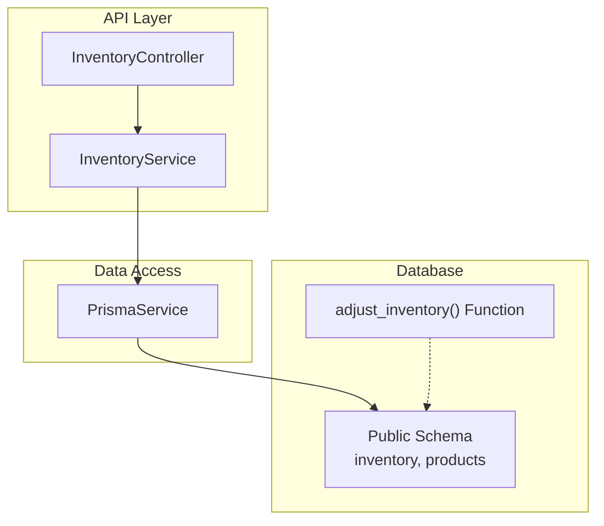
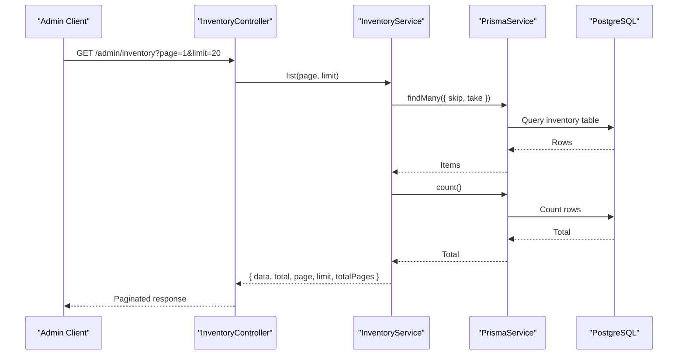
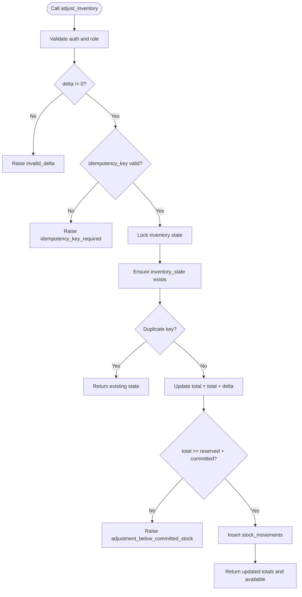
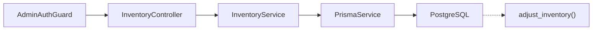
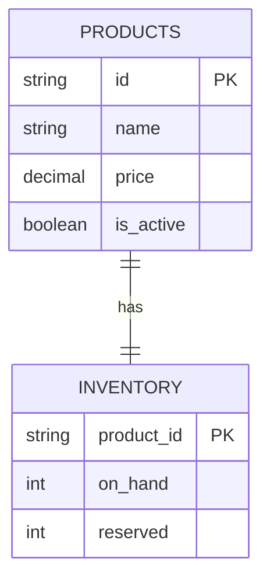

# Inventory Module

<cite>
**Referenced Files in This Document**
- [inventory.controller.ts](file://apps/api/src/modules/inventory/inventory.controller.ts)
- [inventory.service.ts](file://apps/api/src/modules/inventory/inventory.service.ts)
- [inventory.module.ts](file://apps/api/src/modules/inventory/inventory.module.ts)
- [schema.prisma](file://apps/api/prisma/schema.prisma)
- [20260809100000_pharmacist_inventory_adjustment.sql](file://supabase/migrations/20260809100000_pharmacist_inventory_adjustment.sql)
</cite>

## Table of Contents
1. [Introduction](#introduction)
2. [Project Structure](#project-structure)
3. [Core Components](#core-components)
4. [Architecture Overview](#architecture-overview)
5. [Detailed Component Analysis](#detailed-component-analysis)
6. [Dependency Analysis](#dependency-analysis)
7. [Performance Considerations](#performance-considerations)
8. [Troubleshooting Guide](#troubleshooting-guide)
9. [Conclusion](#conclusion)
10. [Appendices](#appendices)

## Introduction
This document describes the Inventory module with a focus on stock management across multiple branches, real-time stock tracking, reservations for pending orders, automatic stock adjustments, validation during checkout, low stock alerts, reconciliation processes, bulk operations, import/export capabilities, and audit trails. It synthesizes the current API implementation, data model, and database-level functions to provide a comprehensive view of how inventory is modeled and managed today, as well as where additional features should be implemented to fully support multi-branch workflows.

## Project Structure
The Inventory module is implemented as a NestJS feature module under apps/api/src/modules/inventory. It exposes an admin-only endpoint to list inventory records and delegates persistence to Prisma against the public schema. The database schema defines product inventory at the product level (without branch granularity), while the broader system includes Branch and DeliveryZone models that can be leveraged for multi-branch logic. A Supabase migration provides a secure, idempotent function for pharmacist-driven inventory adjustments with full audit logging via stock movements.

**Diagram sources**
- [inventory.controller.ts:5-13](file://apps/api/src/modules/inventory/inventory.controller.ts#L5-L13)
- [inventory.service.ts:8-25](file://apps/api/src/modules/inventory/inventory.service.ts#L8-L25)
- [schema.prisma:529-536](file://apps/api/prisma/schema.prisma#L529-L536)
- [20260809100000_pharmacist_inventory_adjustment.sql:5-79](file://supabase/migrations/20260809100000_pharmacist_inventory_adjustment.sql#L5-L79)

**Section sources**
- [inventory.controller.ts:1-15](file://apps/api/src/modules/inventory/inventory.controller.ts#L1-L15)
- [inventory.service.ts:1-27](file://apps/api/src/modules/inventory/inventory.service.ts#L1-L27)
- [inventory.module.ts:1-14](file://apps/api/src/modules/inventory/inventory.module.ts#L1-L14)
- [schema.prisma:529-536](file://apps/api/prisma/schema.prisma#L529-L536)
- [20260809100000_pharmacist_inventory_adjustment.sql:1-83](file://supabase/migrations/20260809100000_pharmacist_inventory_adjustment.sql#L1-L83)

## Core Components
- Admin Inventory Listing: A protected GET endpoint returns paginated inventory records from the database using Prisma.
- Data Model: Product-level inventory with on_hand and reserved fields linked to products.
- Stock Adjustment: A secure database function enables audited, idempotent stock adjustments by authorized roles.

Key responsibilities:
- Expose read access to inventory for administrative dashboards.
- Provide a safe path for stock adjustments with built-in validation and auditing.

**Section sources**
- [inventory.controller.ts:5-13](file://apps/api/src/modules/inventory/inventory.controller.ts#L5-L13)
- [inventory.service.ts:8-25](file://apps/api/src/modules/inventory/inventory.service.ts#L8-L25)
- [schema.prisma:529-536](file://apps/api/prisma/schema.prisma#L529-L536)
- [20260809100000_pharmacist_inventory_adjustment.sql:5-79](file://supabase/migrations/20260809100000_pharmacist_inventory_adjustment.sql#L5-L79)

## Architecture Overview
The current architecture separates concerns into controller, service, and data layers:
- Controller: Validates request parameters and delegates to the service.
- Service: Performs pagination and queries inventory via Prisma.
- Database: Stores inventory per product; a stored function handles atomic adjustments with role checks and idempotency.

**Diagram sources**
- [inventory.controller.ts:5-13](file://apps/api/src/modules/inventory/inventory.controller.ts#L5-L13)
- [inventory.service.ts:8-25](file://apps/api/src/modules/inventory/inventory.service.ts#L8-L25)
- [schema.prisma:529-536](file://apps/api/prisma/schema.prisma#L529-L536)

## Detailed Component Analysis

### Admin Inventory Listing
- Endpoint: GET /admin/inventory
- Guard: AdminAuthGuard ensures only admins can access.
- Pagination: Supports page and limit query parameters; returns metadata including total and totalPages.

Implementation highlights:
- Controller parses page and limit, calls service.list().
- Service computes skip/take and executes parallel queries for items and count.

Operational notes:
- Suitable for admin dashboards to review inventory levels.
- Extendable to filter by product attributes or branch context if branch-scoped inventory is introduced.

**Section sources**
- [inventory.controller.ts:5-13](file://apps/api/src/modules/inventory/inventory.controller.ts#L5-L13)
- [inventory.service.ts:8-25](file://apps/api/src/modules/inventory/inventory.service.ts#L8-L25)

### Data Model: Product Inventory
- inventory table links to products via product_id and tracks on_hand and reserved quantities.
- products table holds catalog information; inventory is a one-to-one relation per product.

Design implications:
- Current model is product-centric without branch dimension.
- Reserved field supports reservation semantics for pending orders when integrated with order processing.

**Section sources**
- [schema.prisma:529-536](file://apps/api/prisma/schema.prisma#L529-L536)
- [schema.prisma:595-613](file://apps/api/prisma/schema.prisma#L595-L613)

### Stock Adjustments: Pharmacist Workflow
- Function: adjust_inventory(product_id, delta, reason?, idempotency_key?)
- Security: Requires authentication and specific roles (admin, manager, pharmacist).
- Idempotency: Uses idempotency_key to prevent duplicate adjustments.
- Validation: Ensures delta is non-zero and prevents adjusting below committed/reserved stock.
- Auditing: Records each adjustment in stock_movements with actor_id and metadata.

Workflow overview:
- Locks inventory state for the product.
- Ensures state exists, validates constraints, updates total, and logs movement.
- Returns current totals and available stock after adjustment.

**Diagram sources**
- [20260809100000_pharmacist_inventory_adjustment.sql:5-79](file://supabase/migrations/20260809100000_pharmacist_inventory_adjustment.sql#L5-L79)

**Section sources**
- [20260809100000_pharmacist_inventory_adjustment.sql:1-83](file://supabase/migrations/20260809100000_pharmacist_inventory_adjustment.sql#L1-L83)

### Multi-Branch Inventory Management
Current state:
- The inventory table does not include a branch identifier; stock is tracked globally per product.
- Branches exist as entities (Branch model) and are used for delivery zones and logistics.

Recommended approach for multi-branch:
- Introduce branch-scoped inventory by adding branch_id to inventory or creating a separate inventory_per_branch table.
- Enforce branch-specific reservations and transfers via new endpoints and database constraints.
- Use branch context in controllers/services to scope queries and mutations.

Operational considerations:
- Inter-branch transfers require debiting source branch and crediting destination branch atomically.
- Real-time visibility requires broadcasting updates per branch context.

[No sources needed since this section proposes design changes beyond current code]

### Real-Time Stock Tracking
Current state:
- No explicit real-time socket-based updates in the inventory module.
- Stock adjustments are logged via stock_movements and reflected in inventory_state through the stored function.

Recommendations:
- Emit events on stock changes (adjustments, reservations, releases) and broadcast to clients subscribed to branch/product channels.
- Use Supabase realtime or WebSocket layer to push updates to admin and pharmacist UIs.

[No sources needed since this section provides general guidance]

### Inventory Reservations for Pending Orders
Current state:
- The inventory model includes a reserved field suitable for reserving stock against pending orders.
- Order-related tables exist but do not directly reference inventory in the provided schema excerpt.

Implementation guidance:
- When an order is created or confirmed, reserve quantities per product (and per branch if implemented).
- On order completion or cancellation, release or finalize reservations accordingly.
- Ensure atomicity to avoid overselling by locking inventory rows or using database constraints.

[No sources needed since this section provides general guidance]

### Automatic Stock Adjustments
Current state:
- Manual adjustments via adjust_inventory are supported with auditing and idempotency.
- Automatic adjustments can be triggered by business events (e.g., order lifecycle transitions).

Recommendations:
- Create services to automatically adjust stock on order status changes (e.g., moving from pending to confirmed reduces available stock by reserving or committing).
- Use transactions to ensure consistency between order updates and inventory changes.

[No sources needed since this section provides general guidance]

### Inventory Validation During Checkout
Current state:
- No dedicated checkout validation endpoint in the inventory module.

Recommendations:
- Add a validation endpoint to check availability before confirming an order.
- Validate against reserved and committed stock to prevent over-allocation.
- Return detailed errors for insufficient stock or partial fulfillment scenarios.

[No sources needed since this section provides general guidance]

### Low Stock Alerts
Current state:
- No alerting mechanism in the inventory module.

Recommendations:
- Implement thresholds per product or per branch.
- Trigger notifications when available stock falls below thresholds.
- Persist alerts and integrate with notification services.

[No sources needed since this section provides general guidance]

### Inventory Reconciliation Processes
Current state:
- Stock movements provide an audit trail for adjustments.

Recommendations:
- Build reconciliation jobs that compare physical counts with recorded totals.
- Generate discrepancy reports and propose corrective adjustments.
- Enforce approval workflows for significant reconciliations.

[No sources needed since this section provides general guidance]

### Bulk Inventory Operations
Current state:
- No bulk update endpoints exposed.

Recommendations:
- Add bulk adjust endpoint accepting arrays of product_id, delta, reason, and idempotency keys.
- Process in batches with transactional boundaries and error reporting per item.
- Enforce rate limits and background job processing for large volumes.

[No sources needed since this section provides general guidance]

### Import/Export Capabilities
Current state:
- No import/export endpoints in the inventory module.

Recommendations:
- Export: Provide CSV/JSON export of inventory levels, reservations, and recent movements.
- Import: Support bulk imports with validation, conflict resolution, and rollback on failures.
- Audit: Record import/export jobs and outcomes.

[No sources needed since this section provides general guidance]

### Audit Trails for Stock Changes
Current state:
- adjust_inventory inserts stock_movements with actor_id, kind, and metadata, enabling full traceability.

Usage:
- Track who made adjustments, when, and why.
- Support audits and compliance reporting.

**Section sources**
- [20260809100000_pharmacist_inventory_adjustment.sql:64-71](file://supabase/migrations/20260809100000_pharmacist_inventory_adjustment.sql#L64-L71)

## Dependency Analysis
The inventory module depends on:
- Authentication guards for authorization.
- Prisma for data access.
- Database functions for secure adjustments.

**Diagram sources**
- [inventory.controller.ts:1-13](file://apps/api/src/modules/inventory/inventory.controller.ts#L1-L13)
- [inventory.service.ts:1-25](file://apps/api/src/modules/inventory/inventory.service.ts#L1-L25)
- [20260809100000_pharmacist_inventory_adjustment.sql:5-79](file://supabase/migrations/20260809100000_pharmacist_inventory_adjustment.sql#L5-L79)

**Section sources**
- [inventory.module.ts:1-14](file://apps/api/src/modules/inventory/inventory.module.ts#L1-L14)
- [inventory.controller.ts:1-13](file://apps/api/src/modules/inventory/inventory.controller.ts#L1-L13)
- [inventory.service.ts:1-25](file://apps/api/src/modules/inventory/inventory.service.ts#L1-L25)

## Performance Considerations
- Pagination: The listing endpoint uses skip/take for efficient retrieval.
- Parallel Queries: Service fetches items and count concurrently to reduce latency.
- Database Locking: Stored function locks inventory state during adjustments to prevent race conditions.
- Indexing: Ensure indexes on frequently queried fields (product_id, timestamps) for performance.

[No sources needed since this section provides general guidance]

## Troubleshooting Guide
Common issues and resolutions:
- Insufficient privilege: Ensure caller has admin, manager, or pharmacist role when calling adjust_inventory.
- Invalid delta: Delta must be non-zero; validate inputs before calling.
- Idempotency key required: Provide a unique key of sufficient length to prevent duplicates.
- Adjustment below committed stock: Do not reduce total below reserved + committed; release reservations first if necessary.

Operational tips:
- Use idempotency keys to safely retry adjustments.
- Monitor stock_movements for discrepancies and investigate root causes.

**Section sources**
- [20260809100000_pharmacist_inventory_adjustment.sql:21-39](file://supabase/migrations/20260809100000_pharmacist_inventory_adjustment.sql#L21-L39)
- [20260809100000_pharmacist_inventory_adjustment.sql:57-60](file://supabase/migrations/20260809100000_pharmacist_inventory_adjustment.sql#L57-L60)

## Conclusion
The Inventory module currently provides a solid foundation for product-level stock tracking, admin listing, and secure, audited stock adjustments. To fully support multi-branch operations, real-time updates, reservations, validation, alerts, reconciliation, bulk operations, and import/export, extend the data model with branch scoping, add corresponding APIs, implement event-driven updates, and introduce automation around order lifecycle and threshold-based alerts. The existing stored function and audit trail offer a strong base for these enhancements.

## Appendices

### Data Model Relationships

**Diagram sources**
- [schema.prisma:529-536](file://apps/api/prisma/schema.prisma#L529-L536)
- [schema.prisma:595-613](file://apps/api/prisma/schema.prisma#L595-L613)