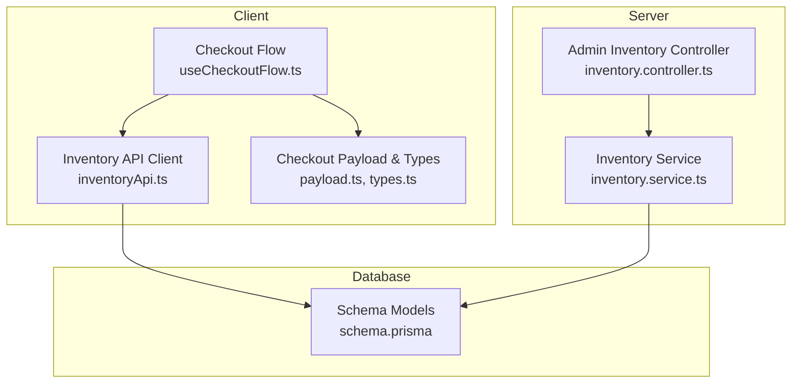
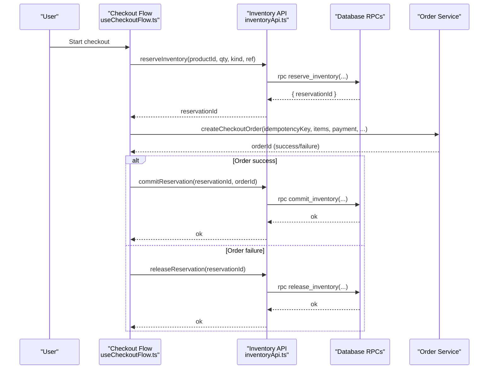
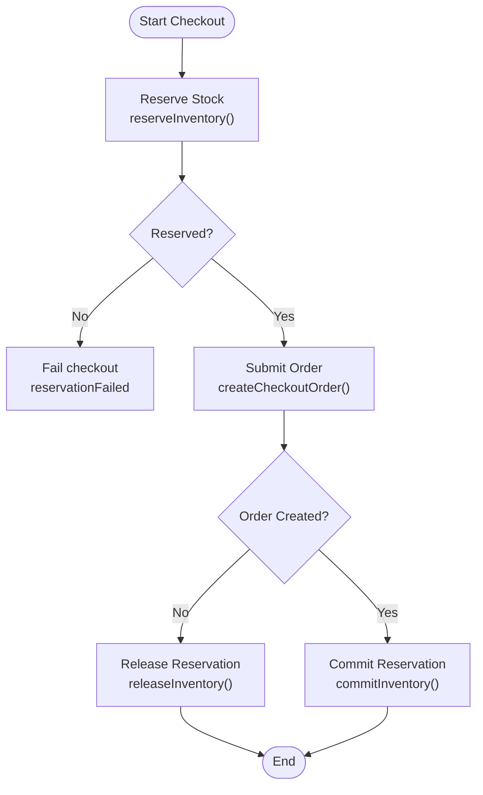
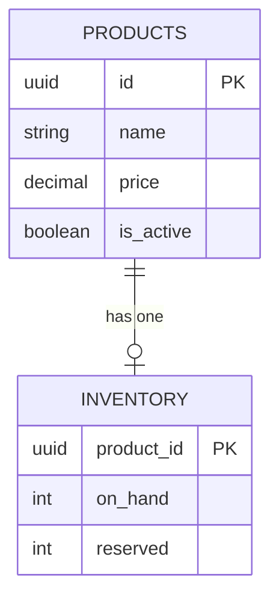
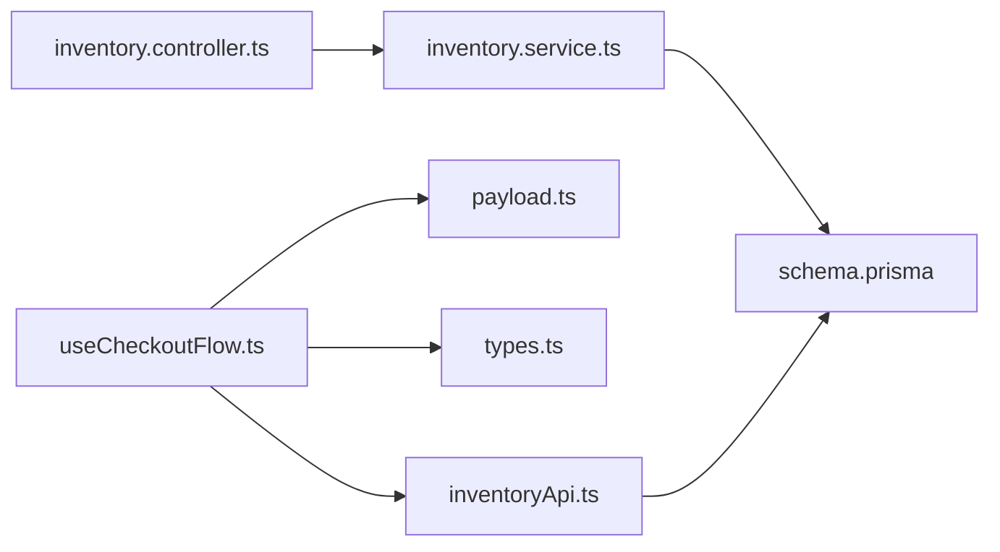

# Inventory Reservations

<cite>
**Referenced Files in This Document**
- [inventory.controller.ts](file://apps/api/src/modules/inventory/inventory.controller.ts)
- [inventory.service.ts](file://apps/api/src/modules/inventory/inventory.service.ts)
- [schema.prisma](file://apps/api/prisma/schema.prisma)
- [useCheckoutFlow.ts](file://apps/shopper-native/src/features/checkout/hooks/useCheckoutFlow.ts)
- [payload.ts](file://apps/shopper-native/src/features/checkout/payload.ts)
- [types.ts](file://apps/shopper-native/src/features/checkout/types.ts)
- [inventoryApi.ts](file://apps/shopper-native/src/features/inventory/api/inventoryApi.ts)
</cite>

## Table of Contents
1. [Introduction](#introduction)
2. [Project Structure](#project-structure)
3. [Core Components](#core-components)
4. [Architecture Overview](#architecture-overview)
5. [Detailed Component Analysis](#detailed-component-analysis)
6. [Dependency Analysis](#dependency-analysis)
7. [Performance Considerations](#performance-considerations)
8. [Troubleshooting Guide](#troubleshooting-guide)
9. [Conclusion](#conclusion)

## Introduction
This document explains the inventory reservation system used during checkout to prevent overselling, how reservations are created, validated, committed, and released, and how concurrent access is handled. It covers the end-to-end flow from client-side reservation attempts through order placement to final inventory commitment or cancellation, including timeout strategies and conflict resolution patterns.

## Project Structure
The reservation system spans:
- Client-side checkout flow that coordinates reservation creation before order submission and commits reservations after successful order placement.
- Database schema that tracks product stock and reserved quantities.
- A minimal admin API for listing inventory (used by operations).

**Diagram sources**
- [useCheckoutFlow.ts](file://apps/shopper-native/src/features/checkout/hooks/useCheckoutFlow.ts)
- [inventoryApi.ts](file://apps/shopper-native/src/features/inventory/api/inventoryApi.ts)
- [payload.ts](file://apps/shopper-native/src/features/checkout/payload.ts)
- [types.ts](file://apps/shopper-native/src/features/checkout/types.ts)
- [inventory.controller.ts](file://apps/api/src/modules/inventory/inventory.controller.ts)
- [inventory.service.ts](file://apps/api/src/modules/inventory/inventory.service.ts)
- [schema.prisma](file://apps/api/prisma/schema.prisma)

**Section sources**
- [useCheckoutFlow.ts](file://apps/shopper-native/src/features/checkout/hooks/useCheckoutFlow.ts)
- [inventoryApi.ts](file://apps/shopper-native/src/features/inventory/api/inventoryApi.ts)
- [inventory.controller.ts](file://apps/api/src/modules/inventory/inventory.controller.ts)
- [inventory.service.ts](file://apps/api/src/modules/inventory/inventory.service.ts)
- [schema.prisma](file://apps/api/prisma/schema.prisma)

## Core Components
- Checkout flow orchestrates reservation lifecycle:
  - Ensures reservations exist before submitting an order.
  - Submits the order with idempotency support.
  - Commits reservations best-effort after order success.
- Inventory API client exposes functions to reserve, release, commit, and validate inventory via database RPCs.
- Admin endpoints provide read-only access to inventory for operations.
- Database schema models track on-hand and reserved quantities per product.

Key responsibilities:
- Prevent overselling by reserving stock at checkout start.
- Ensure atomicity where possible using database-level operations.
- Provide idempotent order submission and best-effort post-commit to avoid blocking user experience.

**Section sources**
- [useCheckoutFlow.ts](file://apps/shopper-native/src/features/checkout/hooks/useCheckoutFlow.ts)
- [inventoryApi.ts](file://apps/shopper-native/src/features/inventory/api/inventoryApi.ts)
- [inventory.controller.ts](file://apps/api/src/modules/inventory/inventory.controller.ts)
- [inventory.service.ts](file://apps/api/src/modules/inventory/inventory.service.ts)
- [schema.prisma](file://apps/api/prisma/schema.prisma)

## Architecture Overview
The reservation architecture uses a three-phase approach:
1. Reserve phase: Client calls reserve RPC to lock available stock for a short window.
2. Submit phase: Client submits order with idempotency key; server creates order and persists it.
3. Commit phase: After successful order creation, client calls commit RPC to permanently deduct stock. If order fails, client can call release to free reserved stock.

**Diagram sources**
- [useCheckoutFlow.ts](file://apps/shopper-native/src/features/checkout/hooks/useCheckoutFlow.ts)
- [inventoryApi.ts](file://apps/shopper-native/src/features/inventory/api/inventoryApi.ts)

## Detailed Component Analysis

### Reservation Lifecycle
- Creation:
  - The checkout flow ensures reservations exist before order submission.
  - The inventory API client calls a database RPC to reserve stock and returns a reservation identifier.
- Validation:
  - The same RPC validates availability and reserves stock atomically.
- Completion:
  - On successful order creation, the checkout flow commits the reservation to finalize stock deduction.
- Cancellation:
  - If order creation fails, the checkout flow releases the reservation to restore stock.

**Diagram sources**
- [useCheckoutFlow.ts](file://apps/shopper-native/src/features/checkout/hooks/useCheckoutFlow.ts)
- [inventoryApi.ts](file://apps/shopper-native/src/features/inventory/api/inventoryApi.ts)

**Section sources**
- [useCheckoutFlow.ts](file://apps/shopper-native/src/features/checkout/hooks/useCheckoutFlow.ts)
- [inventoryApi.ts](file://apps/shopper-native/src/features/inventory/api/inventoryApi.ts)

### Data Model and Storage
- Inventory model stores per-product stock metrics:
  - on_hand: total physical stock
  - reserved: quantity currently reserved but not yet committed
- Products model links to inventory records.

**Diagram sources**
- [schema.prisma](file://apps/api/prisma/schema.prisma)

**Section sources**
- [schema.prisma](file://apps/api/prisma/schema.prisma)

### API Endpoints and RPCs
- Admin Inventory List:
  - GET /admin/inventory?page=...&limit=...
  - Purpose: Paginated listing of inventory for administrative use.
- Inventory RPCs (client-driven):
  - reserve_inventory: Creates a reservation for specified product and quantity; returns reservationId.
  - commit_inventory: Commits a reservation to permanent stock deduction upon successful order placement.
  - release_inventory: Releases a reservation to restore stock when order fails or is cancelled.
  - validate_inventory: Checks current availability and reservation state for given products.

Notes:
- These RPCs are invoked from the client’s inventory API client and executed within the database layer.
- The checkout flow passes a reservation kind and optional reference to tie reservations to business context (e.g., cart or order).

**Section sources**
- [inventory.controller.ts](file://apps/api/src/modules/inventory/inventory.controller.ts)
- [inventory.service.ts](file://apps/api/src/modules/inventory/inventory.service.ts)
- [inventoryApi.ts](file://apps/shopper-native/src/features/inventory/api/inventoryApi.ts)

### Concurrent Reservation Handling and Conflict Resolution
- Atomicity:
  - Reservation creation is performed via a database RPC to ensure atomic checks and updates, preventing overselling under concurrency.
- Idempotency:
  - Order submission uses an idempotency key to safely handle retries without creating duplicate orders.
- Best-effort commit:
  - Committing reservations occurs after order creation and is non-blocking to preserve user experience.
- Timeout strategy:
  - While explicit timeouts are not visible in the client code, the design implies short-lived reservations tied to checkout session duration. Implementers should enforce expiration at the database level (e.g., TTL-based cleanup) to auto-release stale reservations.

Conflict scenarios:
- Multiple users attempt to reserve the same item simultaneously:
  - The first request succeeds; subsequent requests fail due to insufficient available stock.
  - The client surfaces a reservation failure and halts checkout for affected items.

**Section sources**
- [useCheckoutFlow.ts](file://apps/shopper-native/src/features/checkout/hooks/useCheckoutFlow.ts)
- [inventoryApi.ts](file://apps/shopper-native/src/features/inventory/api/inventoryApi.ts)

### Checkout Integration Details
- Before order submission:
  - The checkout flow ensures reservations exist for all line items.
  - Any reservation failures stop the checkout process and surface errors to the user.
- After order submission:
  - On success, the flow commits reservations best-effort to finalize stock deduction.
  - On failure, the flow releases reservations to restore stock.
- Payload composition:
  - Line items include reservation identifiers to link orders to reservations.

**Section sources**
- [useCheckoutFlow.ts](file://apps/shopper-native/src/features/checkout/hooks/useCheckoutFlow.ts)
- [payload.ts](file://apps/shopper-native/src/features/checkout/payload.ts)
- [types.ts](file://apps/shopper-native/src/features/checkout/types.ts)

## Dependency Analysis
- Client dependencies:
  - Checkout flow depends on inventory API client for reservation operations.
  - Checkout payload includes reservation identifiers to associate with order lines.
- Server dependencies:
  - Admin controller depends on inventory service for listing inventory.
  - Inventory service depends on Prisma client to query inventory data.
- Database dependencies:
  - Schema defines inventory and product relationships and fields used by reservation logic.

**Diagram sources**
- [useCheckoutFlow.ts](file://apps/shopper-native/src/features/checkout/hooks/useCheckoutFlow.ts)
- [inventoryApi.ts](file://apps/shopper-native/src/features/inventory/api/inventoryApi.ts)
- [payload.ts](file://apps/shopper-native/src/features/checkout/payload.ts)
- [types.ts](file://apps/shopper-native/src/features/checkout/types.ts)
- [inventory.controller.ts](file://apps/api/src/modules/inventory/inventory.controller.ts)
- [inventory.service.ts](file://apps/api/src/modules/inventory/inventory.service.ts)
- [schema.prisma](file://apps/api/prisma/schema.prisma)

**Section sources**
- [useCheckoutFlow.ts](file://apps/shopper-native/src/features/checkout/hooks/useCheckoutFlow.ts)
- [inventoryApi.ts](file://apps/shopper-native/src/features/inventory/api/inventoryApi.ts)
- [inventory.controller.ts](file://apps/api/src/modules/inventory/inventory.controller.ts)
- [inventory.service.ts](file://apps/api/src/modules/inventory/inventory.service.ts)
- [schema.prisma](file://apps/api/prisma/schema.prisma)

## Performance Considerations
- Prefer database-level atomic operations for reservation to minimize contention and ensure correctness.
- Use idempotency keys for order submission to reduce duplicate processing and network overhead.
- Keep reservation windows short to reduce lock durations and improve throughput.
- Batch validation and reservation calls where possible to reduce round trips.
- Monitor and optimize indexes on product and inventory tables for fast lookups.

[No sources needed since this section provides general guidance]

## Troubleshooting Guide
Common issues and resolutions:
- Reservation failed:
  - Cause: Insufficient available stock or expired reservation.
  - Action: Retry with reduced quantity or refresh availability; implement reservation expiration and background cleanup if not already present.
- Order submission error:
  - Cause: Network or server error; idempotent replay may occur.
  - Action: Handle retry gracefully; ensure release of any reserved stock if order fails.
- Commit best-effort failure:
  - Cause: Post-order commit RPC failure.
  - Action: Implement reconciliation jobs to detect committed orders without corresponding inventory commits and fix discrepancies.

Operational visibility:
- Use admin inventory listing to inspect current on_hand and reserved counts.
- Track reservation failures and order errors in analytics to identify hotspots.

**Section sources**
- [useCheckoutFlow.ts](file://apps/shopper-native/src/features/checkout/hooks/useCheckoutFlow.ts)
- [inventory.controller.ts](file://apps/api/src/modules/inventory/inventory.controller.ts)
- [inventory.service.ts](file://apps/api/src/modules/inventory/inventory.service.ts)

## Conclusion
The reservation system integrates tightly with the checkout flow to prevent overselling and maintain inventory integrity. By combining atomic database operations, idempotent order submission, and best-effort post-commit strategies, the system balances correctness with user experience. To fully realize robustness, implement reservation expiration and automated cleanup to handle edge cases such as abandoned checkouts or server crashes.

[No sources needed since this section summarizes without analyzing specific files]