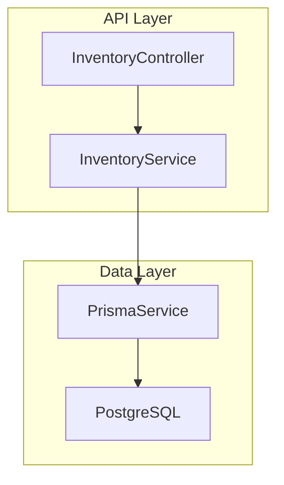
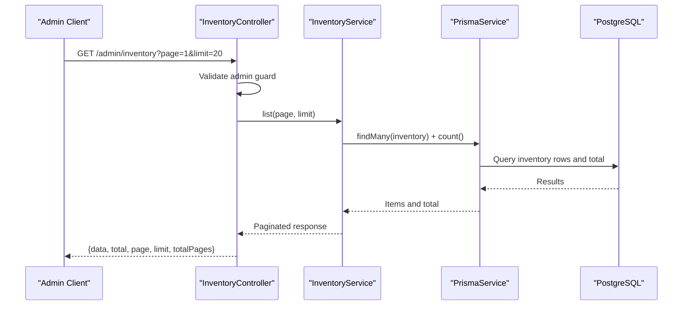
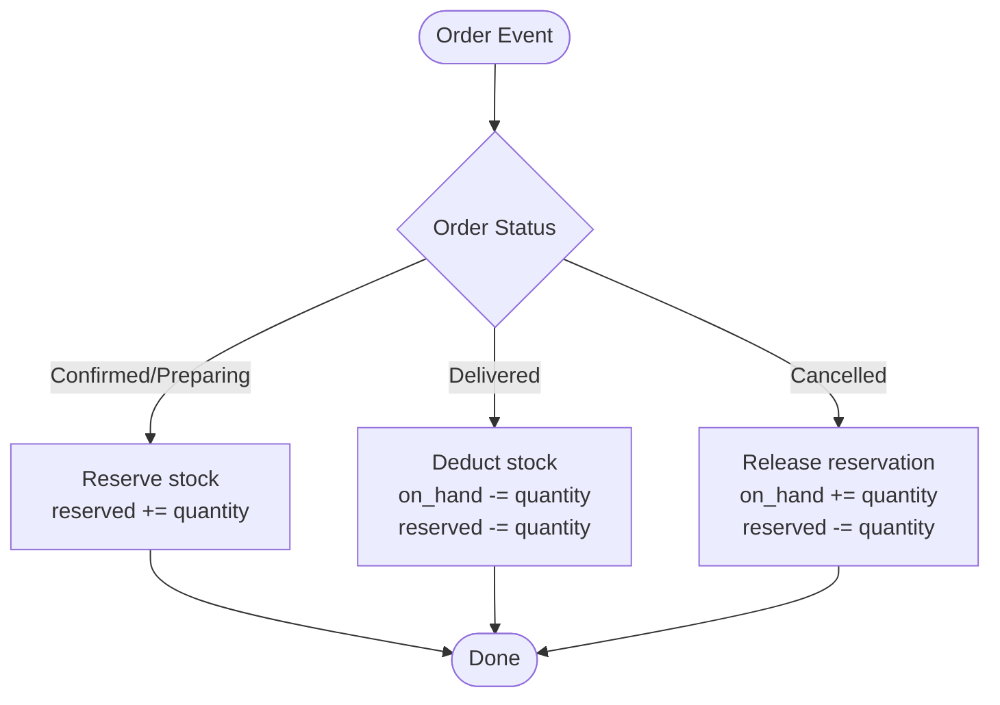
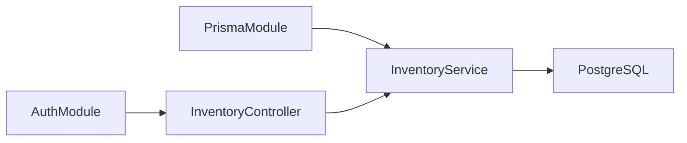

# Stock Tracking

<cite>
**Referenced Files in This Document**
- [inventory.service.ts](file://apps/api/src/modules/inventory/inventory.service.ts)
- [inventory.controller.ts](file://apps/api/src/modules/inventory/inventory.controller.ts)
- [inventory.module.ts](file://apps/api/src/modules/inventory/inventory.module.ts)
- [schema.prisma](file://apps/api/prisma/schema.prisma)
</cite>

## Table of Contents
1. [Introduction](#introduction)
2. [Project Structure](#project-structure)
3. [Core Components](#core-components)
4. [Architecture Overview](#architecture-overview)
5. [Detailed Component Analysis](#detailed-component-analysis)
6. [Dependency Analysis](#dependency-analysis)
7. [Performance Considerations](#performance-considerations)
8. [Troubleshooting Guide](#troubleshooting-guide)
9. [Conclusion](#conclusion)

## Introduction
This document explains the stock tracking functionality within the inventory module, focusing on how product inventory is modeled and exposed via APIs. It covers:
- Real-time stock level monitoring through the inventory listing API
- Automatic stock adjustments triggered by order events (placement, fulfillment, cancellation)
- Stock validation processes to prevent overselling
- The relationship between product inventory and branch-specific stock levels

The system uses a per-product inventory record with on-hand and reserved quantities. Order items reference products and quantities, enabling deduction from available stock when orders are processed.

## Project Structure
The inventory feature is implemented as a NestJS module with a controller exposing an admin-only endpoint to list inventory records, and a service that queries the database using Prisma. The data model defines inventory at the product level with fields for on-hand and reserved quantities.

**Diagram sources**
- [inventory.controller.ts:1-15](file://apps/api/src/modules/inventory/inventory.controller.ts#L1-L15)
- [inventory.service.ts:1-27](file://apps/api/src/modules/inventory/inventory.service.ts#L1-L27)
- [schema.prisma:529-536](file://apps/api/prisma/schema.prisma#L529-L536)

**Section sources**
- [inventory.controller.ts:1-15](file://apps/api/src/modules/inventory/inventory.controller.ts#L1-L15)
- [inventory.service.ts:1-27](file://apps/api/src/modules/inventory/inventory.service.ts#L1-L27)
- [inventory.module.ts:1-14](file://apps/api/src/modules/inventory/inventory.module.ts#L1-L14)
- [schema.prisma:529-536](file://apps/api/prisma/schema.prisma#L529-L536)

## Core Components
- Inventory Controller: Exposes GET /admin/inventory with pagination parameters page and limit. Protected by AdminAuthGuard.
- Inventory Service: Provides list(page, limit) which returns paginated inventory records and total count. Uses Prisma to query the inventory table.
- Data Model: inventory model stores product_id (primary key), on_hand, and reserved. Linked to products model.

Key responsibilities:
- Provide read access to current inventory state for admin dashboards or downstream services
- Support pagination for performance and usability

**Section sources**
- [inventory.controller.ts:1-15](file://apps/api/src/modules/inventory/inventory.controller.ts#L1-L15)
- [inventory.service.ts:1-27](file://apps/api/src/modules/inventory/inventory.service.ts#L1-L27)
- [schema.prisma:529-536](file://apps/api/prisma/schema.prisma#L529-L536)

## Architecture Overview
The inventory module integrates with authentication and Prisma modules. The controller enforces admin access and delegates to the service, which performs database operations. The schema defines inventory per product with on_hand and reserved fields.

**Diagram sources**
- [inventory.controller.ts:1-15](file://apps/api/src/modules/inventory/inventory.controller.ts#L1-L15)
- [inventory.service.ts:1-27](file://apps/api/src/modules/inventory/inventory.service.ts#L1-L27)
- [schema.prisma:529-536](file://apps/api/prisma/schema.prisma#L529-L536)

## Detailed Component Analysis

### Inventory Listing API
- Endpoint: GET /admin/inventory
- Query Parameters:
  - page: integer (default 1)
  - limit: integer (default 20)
- Response:
  - data: array of inventory records
  - total: total number of inventory records
  - page: requested page
  - limit: requested limit
  - totalPages: computed total pages

Behavior:
- Pagination is applied using skip and take
- Total count is fetched concurrently with items for efficient pagination metadata

Security:
- Accessible only to admins due to AdminAuthGuard

**Section sources**
- [inventory.controller.ts:1-15](file://apps/api/src/modules/inventory/inventory.controller.ts#L1-L15)
- [inventory.service.ts:1-27](file://apps/api/src/modules/inventory/inventory.service.ts#L1-L27)

### Inventory Data Model
- inventory table:
  - product_id: primary key, links to products
  - on_hand: integer, default 0
  - reserved: integer, default 0
- products table:
  - id: primary key
  - inventory relation: one-to-one optional link

Implications:
- Each product has exactly one inventory record
- Available stock can be derived as on_hand minus reserved

**Section sources**
- [schema.prisma:529-536](file://apps/api/prisma/schema.prisma#L529-L536)
- [schema.prisma:595-613](file://apps/api/prisma/schema.prisma#L595-L613)

### Order Items and Stock Deduction Flow
Order items reference products and quantities. When orders transition through states (e.g., confirmed, preparing, delivered), stock should be adjusted accordingly. A typical flow:
- On order confirmation/preparation: reserve stock by incrementing reserved for each ordered product
- On fulfillment/delivery: deduct from on_hand and clear reserved
- On cancellation: release reserved back to on_hand

Note: Implement this logic in order processing services to ensure consistency and atomicity.

[No sources needed since this diagram shows conceptual workflow, not actual code structure]

### Stock Validation Process
To prevent overselling:
- Before reserving or fulfilling, validate that available stock (on_hand - reserved) meets demand
- Use database transactions to ensure consistency during updates
- Return clear errors if insufficient stock is detected

Example validation steps:
- Compute available = on_hand - reserved
- If available < requested_quantity, reject operation with insufficient stock error
- Otherwise, proceed with reservation or fulfillment

[No sources needed since this section provides general guidance]

### Branch-Specific Stock Levels
Current schema defines inventory at the product level without a branch dimension. To support branch-specific stock:
- Add a branch identifier to the inventory model (e.g., branch_id)
- Update relationships so inventory is unique per product and branch
- Adjust order fulfillment logic to deduct from the correct branch’s inventory based on pickup location or delivery assignment

Recommendation:
- Introduce branch_id as part of the inventory primary key or add a composite unique constraint
- Ensure order items include branch context when applicable

[No sources needed since this section provides general guidance]

## Dependency Analysis
The inventory module depends on:
- Authentication module for admin access control
- Prisma module for database access
- Database schema for inventory and related entities

**Diagram sources**
- [inventory.module.ts:1-14](file://apps/api/src/modules/inventory/inventory.module.ts#L1-L14)
- [inventory.controller.ts:1-15](file://apps/api/src/modules/inventory/inventory.controller.ts#L1-L15)
- [inventory.service.ts:1-27](file://apps/api/src/modules/inventory/inventory.service.ts#L1-L27)

**Section sources**
- [inventory.module.ts:1-14](file://apps/api/src/modules/inventory/inventory.module.ts#L1-L14)

## Performance Considerations
- Pagination: The list endpoint uses skip/take to avoid loading entire datasets
- Concurrent queries: Total count and items are fetched in parallel to reduce latency
- Indexes: Ensure indexes on frequently queried fields (e.g., product_id) to optimize lookups
- Transactions: Use database transactions for stock adjustments to maintain consistency under high concurrency
- Batching: For bulk order processing, batch updates to minimize round trips
- Monitoring: Track slow queries and adjust indexing or query patterns as needed

[No sources needed since this section provides general guidance]

## Troubleshooting Guide
Common issues and resolutions:
- Insufficient stock: Validate available stock before reservation; return explicit error messages indicating shortage
- Race conditions: Use database transactions and row-level locking where necessary to prevent concurrent modifications
- Incorrect branch stock: Verify branch context in order fulfillment; ensure inventory records are scoped correctly per branch
- Pagination anomalies: Confirm page and limit parameters are integers and within expected ranges

Error handling recommendations:
- Wrap stock mutations in try/catch blocks and map exceptions to user-friendly responses
- Log detailed error contexts for debugging while avoiding sensitive data exposure

[No sources needed since this section provides general guidance]

## Conclusion
The inventory module currently exposes a secure, paginated listing of product inventory records and models inventory per product with on_hand and reserved fields. Order events should trigger automatic stock adjustments following reservation, fulfillment, and cancellation flows. To support branch-specific stock, extend the inventory model to include branch context and update order processing accordingly. Adopt transactional updates, robust validation, and performance optimizations to handle high-volume operations reliably.

[No sources needed since this section summarizes without analyzing specific files]