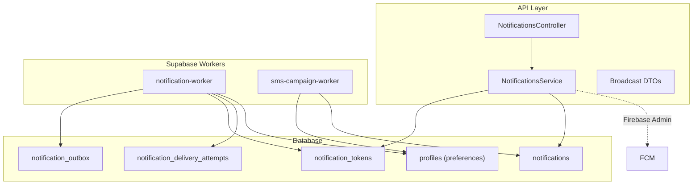
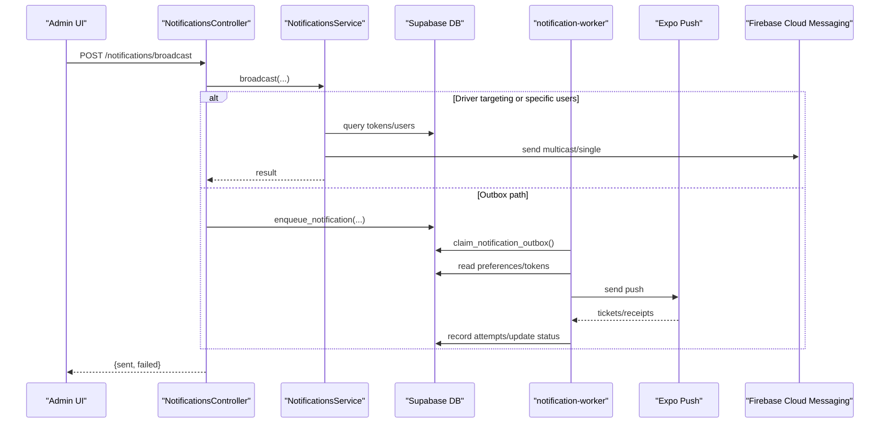
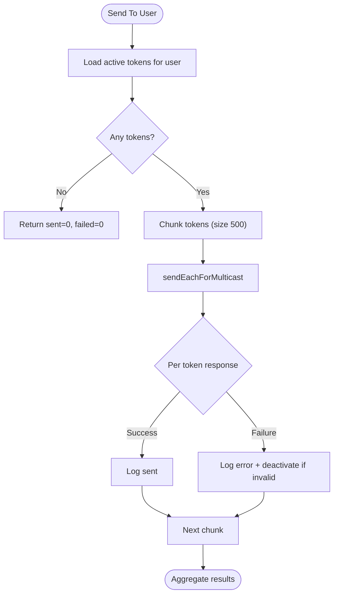
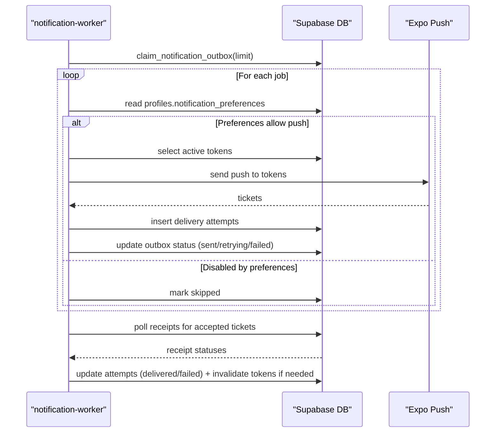
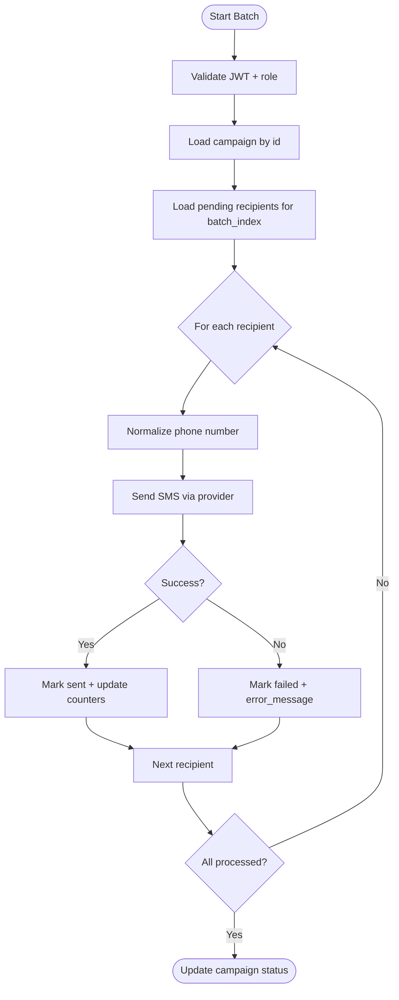
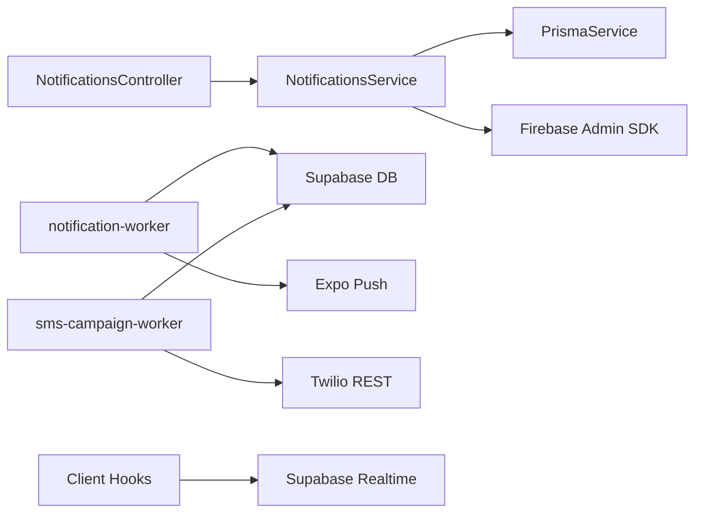

# Notifications Module

<cite>
**Referenced Files in This Document**
- [notifications.module.ts](file://apps/api/src/modules/noti fications/notifications.module.ts)
- [notifications.controller.ts](file://apps/api/src/modules/notifications/notifications.controller.ts)
- [notifications.service.ts](file://apps/api/src/modules/notifications/notifications.service.ts)
- [broadcast.dto.ts](file://apps/api/src/modules/notifications/dto/broadcast.dto.ts)
- [notification-worker/index.ts](file://supabase/functions/notification-worker/index.ts)
- [sms-campaign-worker/index.ts](file://supabase/functions/sms-campaign-worker/index.ts)
- [20260713090000_notification_delivery_pipeline.sql](file://supabase/migrations/20260713090000_notification_delivery_pipeline.sql)
- [20260516_notifications.sql](file://apps/shopper-native/supabase/migrations/20260516_notifications.sql)
- [types.ts](file://apps/shopper-native/src/features/notifications/types.ts)
- [useNotificationPreferences.ts](file://apps/shopper-native/src/features/notifications/hooks/useNotificationPreferences.ts)
- [realtime.ts](file://apps/shopper-native/src/features/notifications/realtime.ts)
</cite>

## Table of Contents
1. [Introduction](#introduction)
2. [Project Structure](#project-structure)
3. [Core Components](#core-components)
4. [Architecture Overview](#architecture-overview)
5. [Detailed Component Analysis](#detailed-component-analysis)
6. [Dependency Analysis](#dependency-analysis)
7. [Performance Considerations](#performance-considerations)
8. [Troubleshooting Guide](#troubleshooting-guide)
9. [Conclusion](#conclusion)
10. [Appendices](#appendices)

## Introduction
The Notifications module provides multi-channel messaging across push notifications, SMS campaigns, and email-capable templates, with robust delivery tracking, user preference management, scheduling via outbox queues, and real-time updates to clients. It integrates with Firebase Cloud Messaging for Android/iOS push, an Expo-based worker for cross-platform push receipts, and a Twilio-based SMS campaign pipeline. The system supports admin-driven broadcasts, driver-targeted messaging, and automated event-driven notifications through database functions and workers.

## Project Structure
The module spans API controllers/services (NestJS), Supabase Edge Functions (workers), and database migrations that define durable queues, tokens, and preferences. Client-side hooks manage preferences and realtime subscriptions.



**Diagram sources**
- [notifications.controller.ts:1-60](file://apps/api/src/modules/notifications/notifications.controller.ts#L1-L60)
- [notifications.service.ts:1-229](file://apps/api/src/modules/notifications/notifications.service.ts#L1-L229)
- [notification-worker/index.ts:1-127](file://supabase/functions/notification-worker/index.ts#L1-L127)
- [sms-campaign-worker/index.ts:1-306](file://supabase/functions/sms-campaign-worker/index.ts#L1-L306)
- [20260713090000_notification_delivery_pipeline.sql:1-94](file://supabase/migrations/20260713090000_notification_delivery_pipeline.sql#L1-L94)
- [20260516_notifications.sql:1-204](file://apps/shopper-native/supabase/migrations/20260516_notifications.sql#L1-L204)

**Section sources**
- [notifications.module.ts:1-14](file://apps/api/src/modules/notifications/notifications.module.ts#L1-L14)
- [notifications.controller.ts:1-60](file://apps/api/src/modules/notifications/notifications.controller.ts#L1-L60)
- [notifications.service.ts:1-229](file://apps/api/src/modules/notifications/notifications.service.ts#L1-L229)
- [20260713090000_notification_delivery_pipeline.sql:1-94](file://supabase/migrations/20260713090000_notification_delivery_pipeline.sql#L1-L94)
- [20260516_notifications.sql:1-204](file://apps/shopper-native/supabase/migrations/20260516_notifications.sql#L1-L204)

## Core Components
- NotificationsService: Handles token registration, single and broadcast push delivery via Firebase, logging, and failure handling.
- NotificationsController: Exposes endpoints for token registration, history retrieval, and admin broadcasts.
- notification-worker: Processes the outbox queue, respects user preferences, sends pushes via Expo, records attempts/receipts, and retries.
- sms-campaign-worker: Processes batched SMS campaigns, validates recipients, sends messages, updates counters, and logs audit events.
- Database schema: Defines notifications, tokens, outbox, delivery attempts, and preferences; includes enqueue functions and claim logic.
- Client preferences and realtime: Hooks and subscriptions for managing user preferences and receiving live notifications.

**Section sources**
- [notifications.service.ts:1-229](file://apps/api/src/modules/notifications/notifications.service.ts#L1-L229)
- [notifications.controller.ts:1-60](file://apps/api/src/modules/notifications/notifications.controller.ts#L1-L60)
- [notification-worker/index.ts:1-127](file://supabase/functions/notification-worker/index.ts#L1-L127)
- [sms-campaign-worker/index.ts:1-306](file://supabase/functions/sms-campaign-worker/index.ts#L1-L306)
- [20260713090000_notification_delivery_pipeline.sql:1-94](file://supabase/migrations/20260713090000_notification_delivery_pipeline.sql#L1-L94)
- [20260516_notifications.sql:1-204](file://apps/shopper-native/supabase/migrations/20260516_notifications.sql#L1-L204)
- [useNotificationPreferences.ts:1-54](file://apps/shopper-native/src/features/notifications/hooks/useNotificationPreferences.ts#L1-L54)
- [realtime.ts:1-99](file://apps/shopper-native/src/features/notifications/realtime.ts#L1-L99)

## Architecture Overview
The system uses a hybrid approach:
- Direct push via Firebase from the API for immediate operational alerts.
- Durable outbox queue for reliable delivery, processed by the notification-worker with retry and receipt tracking.
- SMS campaigns processed by sms-campaign-worker with batch control and auditing.
- Realtime client updates via Supabase Realtime for in-app notifications.



**Diagram sources**
- [notifications.controller.ts:27-58](file://apps/api/src/modules/notifications/notifications.controller.ts#L27-L58)
- [notifications.service.ts:106-211](file://apps/api/src/modules/notifications/notifications.service.ts#L106-L211)
- [20260713090000_notification_delivery_pipeline.sql:50-76](file://supabase/migrations/20260713090000_notification_delivery_pipeline.sql#L50-L76)
- [notification-worker/index.ts:37-126](file://supabase/functions/notification-worker/index.ts#L37-L126)

## Detailed Component Analysis

### NotificationsService (Push Delivery and Token Management)
- Initializes Firebase Admin SDK and handles missing credentials gracefully.
- Registers device tokens with deduplication per platform/device and upserts active tokens.
- Sends single notifications to a token with platform-specific settings and logs outcomes.
- Broadcasts to all, online drivers, drivers by status, or multiple users using chunked multicast.
- Logs every attempt with success/failure and deactivates invalid tokens automatically.



**Diagram sources**
- [notifications.service.ts:106-211](file://apps/api/src/modules/notifications/notifications.service.ts#L106-L211)

**Section sources**
- [notifications.service.ts:1-229](file://apps/api/src/modules/notifications/notifications.service.ts#L1-L229)

### NotificationsController (API Endpoints)
- Driver endpoint to register device tokens with authentication guard.
- Driver endpoint to fetch personal notification history.
- Admin endpoint to broadcast to targets: all drivers (by status), online drivers, or specific users.
- Admin endpoint to retrieve global notification history.

**Section sources**
- [notifications.controller.ts:1-60](file://apps/api/src/modules/notifications/notifications.controller.ts#L1-L60)
- [broadcast.dto.ts:1-53](file://apps/api/src/modules/notifications/dto/broadcast.dto.ts#L1-L53)

### notification-worker (Durable Push Delivery)
- Claims jobs from the outbox with lock and retry semantics.
- Respects user preferences (channel/category toggles).
- Retrieves active tokens and sends via Expo Push; records accepted/failed attempts.
- Polls receipts to mark delivered/failed and invalidates tokens on DeviceNotRegistered.



**Diagram sources**
- [notification-worker/index.ts:37-126](file://supabase/functions/notification-worker/index.ts#L37-L126)
- [20260713090000_notification_delivery_pipeline.sql:50-76](file://supabase/migrations/20260713090000_notification_delivery_pipeline.sql#L50-L76)

**Section sources**
- [notification-worker/index.ts:1-127](file://supabase/functions/notification-worker/index.ts#L1-L127)
- [20260713090000_notification_delivery_pipeline.sql:1-94](file://supabase/migrations/20260713090000_notification_delivery_pipeline.sql#L1-L94)

### sms-campaign-worker (Batched SMS Campaigns)
- Validates caller role and loads campaign metadata.
- Loads pending recipients for a given batch index and marks them sending.
- Normalizes phone numbers and sends via Twilio REST; captures errors per recipient.
- Updates campaign counters and marks completed when all batches processed; logs audit events.



**Diagram sources**
- [sms-campaign-worker/index.ts:140-305](file://supabase/functions/sms-campaign-worker/index.ts#L140-L305)

**Section sources**
- [sms-campaign-worker/index.ts:1-306](file://supabase/functions/sms-campaign-worker/index.ts#L1-L306)

### Database Schema and Enqueue Functions
- notifications: stores in-app notifications with type, category, data, action_url, read status.
- notification_tokens: stores push tokens with validity and last push timestamps.
- notification_outbox: durable queue for push delivery with idempotency keys and retry scheduling.
- notification_delivery_attempts: detailed per-token delivery attempts and receipts.
- enqueue_notification and claim_notification_outbox: secure functions to enqueue and claim jobs atomically.

**Section sources**
- [20260516_notifications.sql:1-204](file://apps/shopper-native/supabase/migrations/20260516_notifications.sql#L1-L204)
- [20260713090000_notification_delivery_pipeline.sql:1-94](file://supabase/migrations/20260713090000_notification_delivery_pipeline.sql#L1-L94)

### User Preference Management and Realtime Delivery
- Preferences stored in profiles.notification_preferences with channel and category toggles.
- Client hook useNotificationPreferences manages local cache and optimistic updates.
- Realtime subscription subscribes to INSERT events for the current user, with retry on connection errors.

```mermaid
classDiagram
class NotificationPreferences {
+channels : {push : boolean, email : boolean, sms : boolean}
+categories : {order_updates : boolean, promotions : boolean, security_alerts : boolean, health_reminders : boolean, new_arrivals : boolean, account_updates : boolean}
}
class UseNotificationPreferences {
+preferences : NotificationPreferences
+update(patch) : void
}
class RealtimeSubscription {
+subscribeToNotifications(userId, onNew) : NotificationSubscription
}
UseNotificationPreferences --> NotificationPreferences : "reads/writes"
RealtimeSubscription --> NotificationPreferences : "respects categories/channels"
```

**Diagram sources**
- [types.ts:1-83](file://apps/shopper-native/src/features/notifications/types.ts#L1-L83)
- [useNotificationPreferences.ts:1-54](file://apps/shopper-native/src/features/notifications/hooks/useNotificationPreferences.ts#L1-L54)
- [realtime.ts:1-99](file://apps/shopper-native/src/features/notifications/realtime.ts#L1-L99)

**Section sources**
- [types.ts:1-83](file://apps/shopper-native/src/features/notifications/types.ts#L1-L83)
- [useNotificationPreferences.ts:1-54](file://apps/shopper-native/src/features/notifications/hooks/useNotificationPreferences.ts#L1-L54)
- [realtime.ts:1-99](file://apps/shopper-native/src/features/notifications/realtime.ts#L1-L99)

## Dependency Analysis
- API layer depends on Prisma for token/history operations and Firebase Admin SDK for push.
- Workers depend on Supabase client and environment variables for DB access and provider credentials.
- Database functions enforce role checks and idempotency to prevent duplicate deliveries.
- Client layers rely on Supabase Realtime for live updates and React Query for preferences caching.



**Diagram sources**
- [notifications.controller.ts:1-60](file://apps/api/src/modules/notifications/notifications.controller.ts#L1-L60)
- [notifications.service.ts:1-229](file://apps/api/src/modules/notifications/notifications.service.ts#L1-L229)
- [notification-worker/index.ts:1-127](file://supabase/functions/notification-worker/index.ts#L1-L127)
- [sms-campaign-worker/index.ts:1-306](file://supabase/functions/sms-campaign-worker/index.ts#L1-L306)
- [realtime.ts:1-99](file://apps/shopper-native/src/features/notifications/realtime.ts#L1-L99)

**Section sources**
- [notifications.module.ts:1-14](file://apps/api/src/modules/notifications/notifications.module.ts#L1-L14)
- [notifications.service.ts:1-229](file://apps/api/src/modules/notifications/notifications.service.ts#L1-L229)
- [notification-worker/index.ts:1-127](file://supabase/functions/notification-worker/index.ts#L1-L127)
- [sms-campaign-worker/index.ts:1-306](file://supabase/functions/sms-campaign-worker/index.ts#L1-L306)

## Performance Considerations
- Multicast batching: NotificationsService chunks tokens into groups of 500 to respect provider limits and reduce overhead.
- Retry strategy: notification-worker uses exponential backoff capped at a maximum interval and max attempts before marking failed.
- Idempotency: enqueue_notification prevents duplicate notifications via idempotency keys based on event_type, recipient, and payload hash.
- Preference filtering: Workers skip delivery when channels/categories are disabled, reducing unnecessary work.
- Receipt polling: Batches of ticket IDs are polled to update delivery status efficiently.

[No sources needed since this section provides general guidance]

## Troubleshooting Guide
- Missing Firebase credentials: Service logs warning and disables push; verify environment variables for project ID, client email, and private key.
- Invalid tokens: On registration-token-not-registered or invalid-registration-token, tokens are deactivated automatically; ensure apps re-register tokens after reinstall.
- Outbox stuck: Check next_attempt_at and locked_until; claim_notification_outbox will process eligible rows; inspect last_error for failures.
- SMS campaign stalls: Ensure campaign status is queued/running and batch_index increments; review sms_audit_log for batch_started/batch_completed events.
- Realtime not updating: Verify Supabase Realtime publication includes notifications table; client subscription retries on CHANNEL_ERROR/TIMED_OUT.

**Section sources**
- [notifications.service.ts:32-48](file://apps/api/src/modules/notifications/notifications.service.ts#L32-L48)
- [notifications.service.ts:121-131](file://apps/api/src/modules/notifications/notifications.service.ts#L121-L131)
- [notification-worker/index.ts:47-99](file://supabase/functions/notification-worker/index.ts#L47-L99)
- [sms-campaign-worker/index.ts:183-202](file://supabase/functions/sms-campaign-worker/index.ts#L183-L202)
- [realtime.ts:67-86](file://apps/shopper-native/src/features/notifications/realtime.ts#L67-L86)

## Conclusion
The Notifications module delivers a resilient, multi-channel messaging system combining direct push via Firebase, durable outbox processing with retry and receipt tracking, and batched SMS campaigns. It enforces user preferences, ensures idempotent delivery, and provides real-time updates to clients. Integration points enable automated notifications triggered by business events through database functions and workers.

[No sources needed since this section summarizes without analyzing specific files]

## Appendices

### API Endpoints Summary
- POST /notifications/token: Register device token (DriverAuthGuard)
- GET /notifications/history: Get personal notification history (DriverAuthGuard)
- POST /notifications/broadcast: Admin broadcast to targets (AdminAuthGuard)
- GET /notifications/admin/history: Global notification history (AdminAuthGuard)

**Section sources**
- [notifications.controller.ts:11-58](file://apps/api/src/modules/notifications/notifications.controller.ts#L11-L58)
- [broadcast.dto.ts:1-53](file://apps/api/src/modules/notifications/dto/broadcast.dto.ts#L1-L53)

### Data Models Overview
- notifications: core in-app notification records with type, category, data, action_url, read status.
- notification_tokens: device push tokens with platform and validity fields.
- notification_outbox: durable queue for push delivery with idempotency and retry scheduling.
- notification_delivery_attempts: per-token delivery attempts and receipt details.
- profiles.notification_preferences: channel and category toggles controlling delivery.

**Section sources**
- [20260516_notifications.sql:12-23](file://apps/shopper-native/supabase/migrations/20260516_notifications.sql#L12-L23)
- [20260516_notifications.sql:95-106](file://apps/shopper-native/supabase/migrations/20260516_notifications.sql#L95-L106)
- [20260713090000_notification_delivery_pipeline.sql:11-44](file://supabase/migrations/20260713090000_notification_delivery_pipeline.sql#L11-L44)
- [20260516_notifications.sql:134-155](file://apps/shopper-native/supabase/migrations/20260516_notifications.sql#L134-L155)