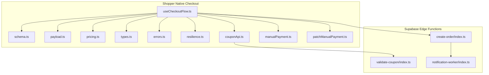
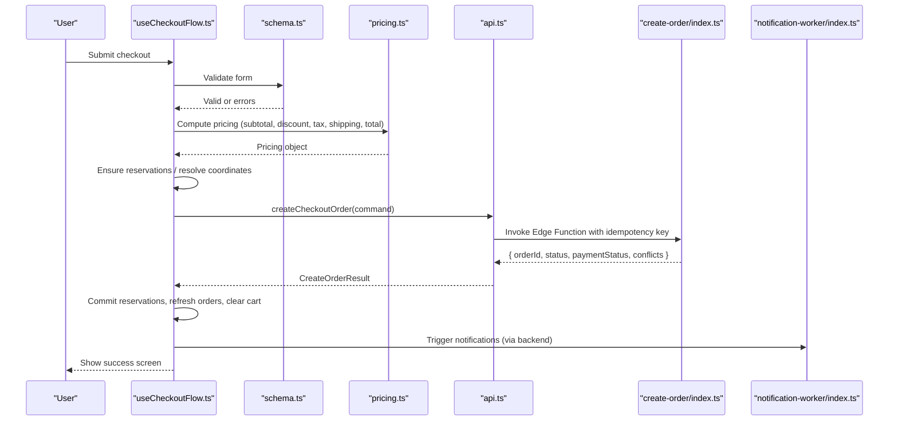
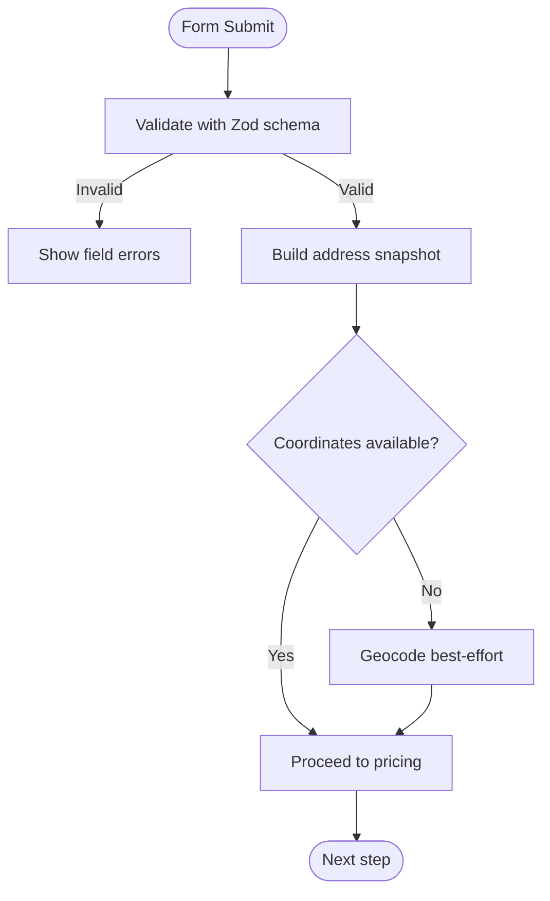
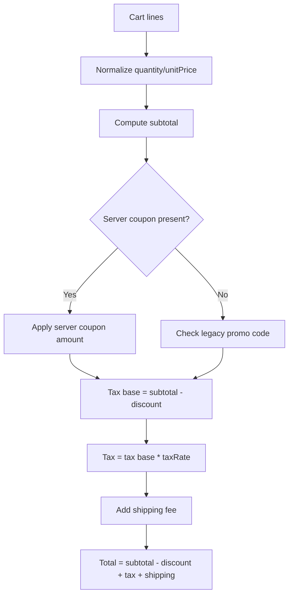
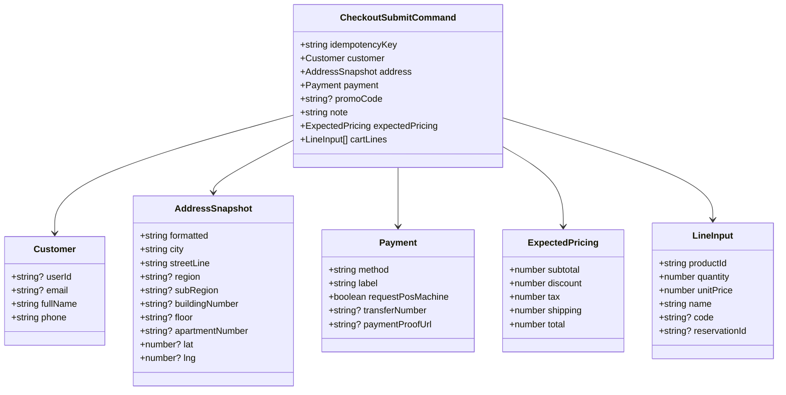
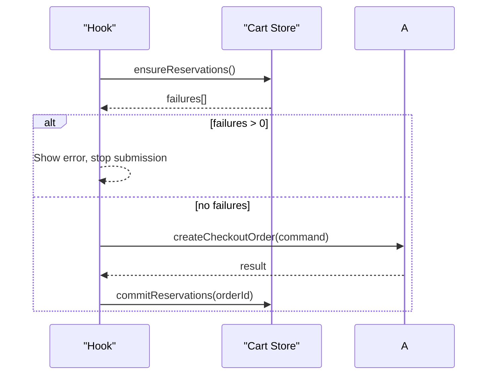
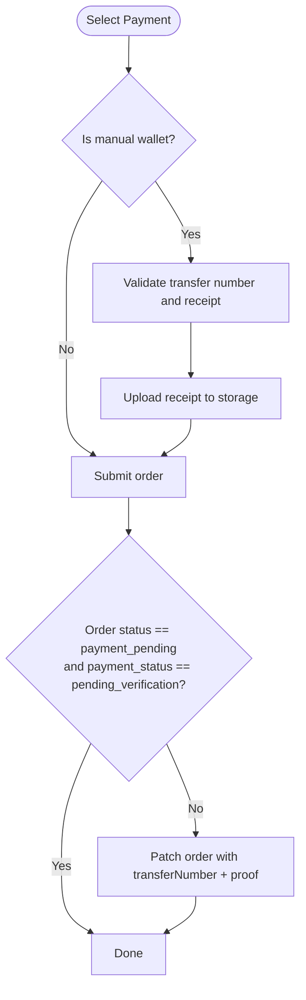
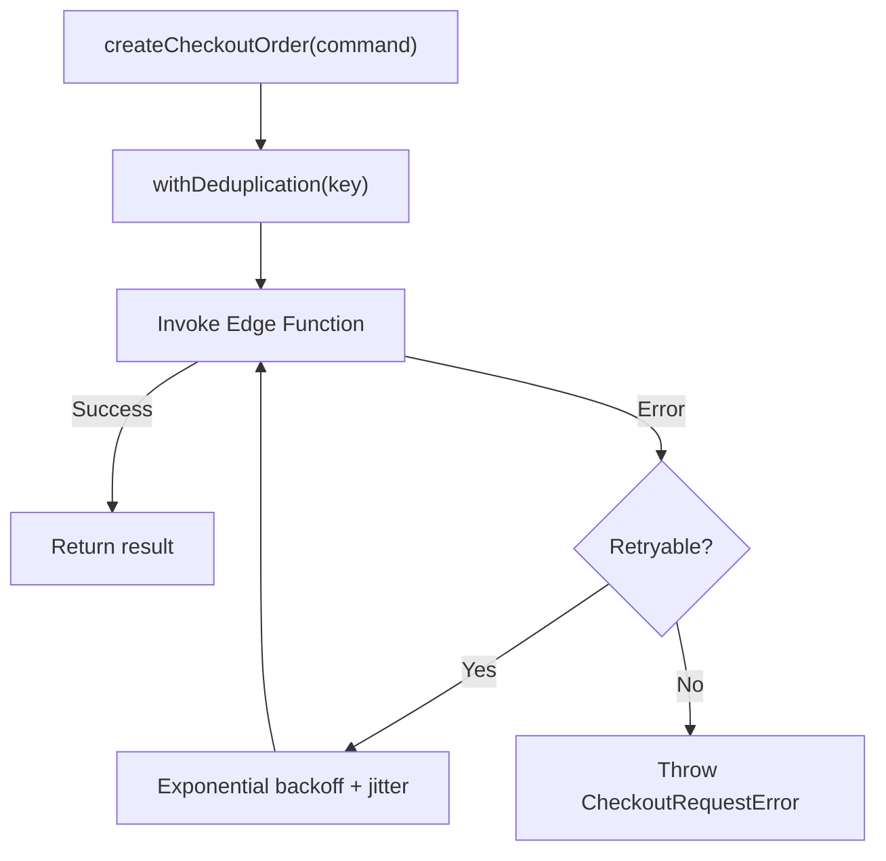
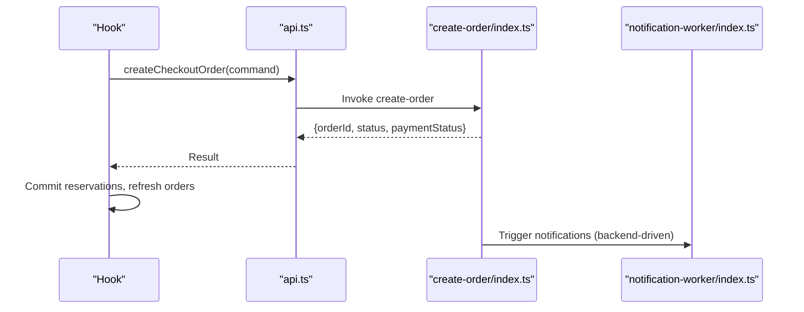
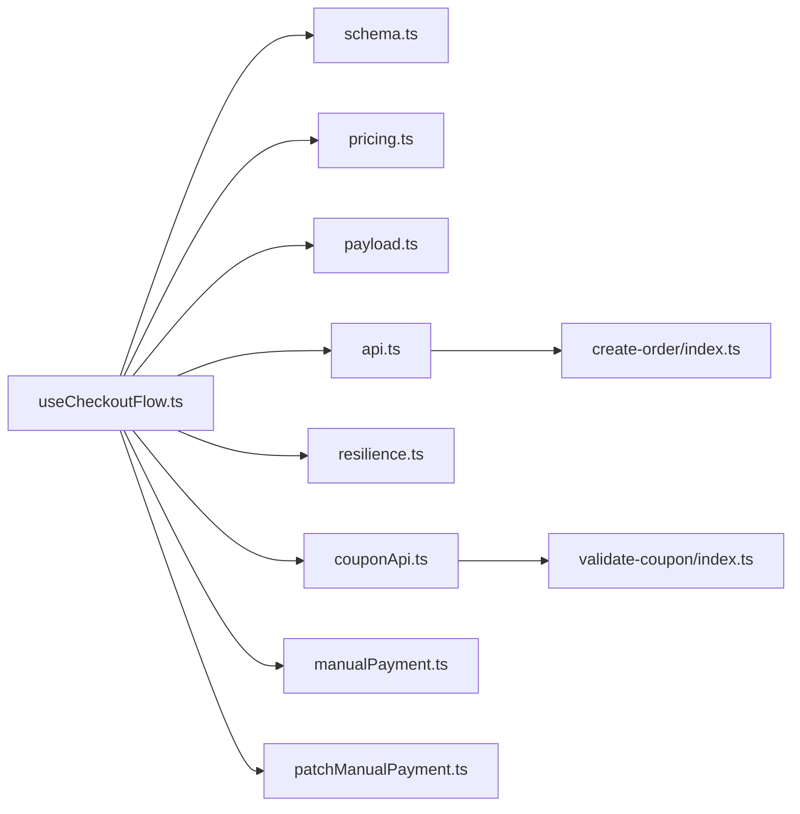

# Order Creation & Processing

<cite>
**Referenced Files in This Document**
- [payload.ts](file://apps/shopper-native/src/features/checkout/payload.ts)
- [schema.ts](file://apps/shopper-native/src/features/checkout/schema.ts)
- [pricing.ts](file://apps/shopper-native/src/features/checkout/pricing.ts)
- [errors.ts](file://apps/shopper-native/src/features/checkout/errors.ts)
- [api.ts](file://apps/shopper-native/src/features/checkout/api.ts)
- [types.ts](file://apps/shopper-native/src/features/checkout/types.ts)
- [resilience.ts](file://apps/shopper-native/src/features/checkout/resilience.ts)
- [useCheckoutFlow.ts](file://apps/shopper-native/src/features/checkout/hooks/useCheckoutFlow.ts)
- [couponApi.ts](file://apps/shopper-native/src/features/checkout/couponApi.ts)
- [manualPayment.ts](file://apps/shopper-native/src/features/checkout/manualPayment.ts)
- [patchManualPayment.ts](file://apps/shopper-native/src/features/checkout/patchManualPayment.ts)
- [create-order function](file://supabase/functions/create-order/index.ts)
- [validate-coupon function](file://supabase/functions/validate-coupon/index.ts)
- [notification-worker function](file://supabase/functions/notification-worker/index.ts)
</cite>

## Table of Contents
1. Introduction
2. Project Structure
3. Core Components
4. Architecture Overview
5. Detailed Component Analysis
6. Dependency Analysis
7. Performance Considerations
8. Troubleshooting Guide
9. Conclusion

## Introduction
This document explains the end-to-end order creation and processing workflow from cart validation to order confirmation. It covers payment method selection, address validation, inventory reservation, order payload structure, validation rules, error handling, coupon application, pricing calculations, tax handling, integration with payment gateways, asynchronous processing, and notifications.

## Project Structure
The checkout flow is implemented primarily in the shopper-native app under features/checkout, with supporting Supabase Edge Functions for order creation and coupon validation. The hook orchestrates UI state, form validation, pricing, reservations, and submission.

**Diagram sources**
- [useCheckoutFlow.ts:1-800](file://apps/shopper-native/src/features/checkout/hooks/useCheckoutFlow.ts#L1-L800)
- [schema.ts:1-73](file://apps/shopper-native/src/features/checkout/schema.ts#L1-L73)
- [pricing.ts:1-83](file://apps/shopper-native/src/features/checkout/pricing.ts#L1-L83)
- [payload.ts:1-153](file://apps/shopper-native/src/features/checkout/payload.ts#L1-L153)
- [types.ts:1-164](file://apps/shopper-native/src/features/checkout/types.ts#L1-L164)
- [errors.ts:1-50](file://apps/shopper-native/src/features/checkout/errors.ts#L1-L50)
- [resilience.ts:1-191](file://apps/shopper-native/src/features/checkout/resilience.ts#L1-L191)
- [couponApi.ts](file://apps/shopper-native/src/features/checkout/couponApi.ts)
- [manualPayment.ts](file://apps/shopper-native/src/features/checkout/manualPayment.ts)
- [patchManualPayment.ts](file://apps/shopper-native/src/features/checkout/patchManualPayment.ts)
- [create-order function](file://supabase/functions/create-order/index.ts)
- [validate-coupon function](file://supabase/functions/validate-coupon/index.ts)
- [notification-worker function](file://supabase/functions/notification-worker/index.ts)

**Section sources**
- [useCheckoutFlow.ts:1-800](file://apps/shopper-native/src/features/checkout/hooks/useCheckoutFlow.ts#L1-L800)
- [api.ts:1-261](file://apps/shopper-native/src/features/checkout/api.ts#L1-L261)

## Core Components
- Form validation schema: enforces required fields and phone format.
- Pricing engine: computes subtotal, discount (server coupon precedence), tax, shipping, total; rounds currency values.
- Payload builder: constructs a typed submit command including customer, address snapshot, payment details, promo code, note, expected pricing, and cart lines.
- API client: calls the create-order Edge Function with retry and deduplication, maps errors, and returns a structured result.
- Resilience layer: exponential backoff retry, in-flight request deduplication, and draft persistence for recovery.
- Hook orchestration: coordinates steps, validations, reservations, geocoding, manual payment receipt upload, and post-submit cleanup.

**Section sources**
- [schema.ts:1-73](file://apps/shopper-native/src/features/checkout/schema.ts#L1-L73)
- [pricing.ts:1-83](file://apps/shopper-native/src/features/checkout/pricing.ts#L1-L83)
- [payload.ts:1-153](file://apps/shopper-native/src/features/checkout/payload.ts#L1-L153)
- [api.ts:1-261](file://apps/shopper-native/src/features/checkout/api.ts#L1-L261)
- [resilience.ts:1-191](file://apps/shopper-native/src/features/checkout/resilience.ts#L1-L191)
- [useCheckoutFlow.ts:1-800](file://apps/shopper-native/src/features/checkout/hooks/useCheckoutFlow.ts#L1-L800)

## Architecture Overview
The checkout flow validates user input, calculates pricing, reserves inventory, builds an order payload, and submits it via a Supabase Edge Function. On success, it commits reservations, refreshes orders, and transitions to a success state. For manual payments, it uploads proof and may patch the order after creation.

**Diagram sources**
- [useCheckoutFlow.ts:450-634](file://apps/shopper-native/src/features/checkout/hooks/useCheckoutFlow.ts#L450-L634)
- [api.ts:140-261](file://apps/shopper-native/src/features/checkout/api.ts#L140-L261)
- [create-order function](file://supabase/functions/create-order/index.ts)
- [notification-worker function](file://supabase/functions/notification-worker/index.ts)

## Detailed Component Analysis

### Form Validation and Address Handling
- Fields validated include full name, Egyptian mobile phone, city, street, building number, floor, apartment number, note, and promo code.
- Phone normalization ensures consistent E.164-like format before OTP checks.
- Address snapshot is built from form inputs and optional region/subregion and coordinates.

**Diagram sources**
- [schema.ts:18-69](file://apps/shopper-native/src/features/checkout/schema.ts#L18-L69)
- [payload.ts:22-53](file://apps/shopper-native/src/features/checkout/payload.ts#L22-L53)
- [useCheckoutFlow.ts:524-553](file://apps/shopper-native/src/features/checkout/hooks/useCheckoutFlow.ts#L524-L553)

**Section sources**
- [schema.ts:1-73](file://apps/shopper-native/src/features/checkout/schema.ts#L1-L73)
- [payload.ts:22-53](file://apps/shopper-native/src/features/checkout/payload.ts#L22-L53)
- [useCheckoutFlow.ts:524-553](file://apps/shopper-native/src/features/checkout/hooks/useCheckoutFlow.ts#L524-L553)

### Pricing, Coupons, Tax, and Shipping
- Pricing normalizes line quantities and unit prices, computes subtotal, applies discount (server coupon takes precedence over legacy promo code), calculates tax on discounted subtotal, adds shipping, and rounds all money values.
- Server coupon validation provides a concrete discount amount that overrides client-side promo logic.

**Diagram sources**
- [pricing.ts:31-82](file://apps/shopper-native/src/features/checkout/pricing.ts#L31-L82)
- [types.ts:120-164](file://apps/shopper-native/src/features/checkout/types.ts#L120-L164)

**Section sources**
- [pricing.ts:1-83](file://apps/shopper-native/src/features/checkout/pricing.ts#L1-L83)
- [types.ts:120-164](file://apps/shopper-native/src/features/checkout/types.ts#L120-L164)
- [useCheckoutFlow.ts:310-322](file://apps/shopper-native/src/features/checkout/hooks/useCheckoutFlow.ts#L310-L322)

### Order Payload Structure
- The submit command includes:
  - Idempotency key
  - Customer info (userId, email, fullName, phone)
  - Address snapshot (formatted, city, streetLine, optional region/subRegion/building/floor/apartment, lat/lng)
  - Payment details (method, label, requestPosMachine, transferNumber for manual methods, paymentProofUrl)
  - Promo code (optional)
  - Note (including payment method and POS request when applicable)
  - Expected pricing (subtotal, discount, tax, shipping, total)
  - Cart lines (productId, quantity, unitPrice, name, code, reservationId)

**Diagram sources**
- [types.ts:69-97](file://apps/shopper-native/src/features/checkout/types.ts#L69-L97)
- [payload.ts:94-152](file://apps/shopper-native/src/features/checkout/payload.ts#L94-L152)

**Section sources**
- [types.ts:69-97](file://apps/shopper-native/src/features/checkout/types.ts#L69-L97)
- [payload.ts:94-152](file://apps/shopper-native/src/features/checkout/payload.ts#L94-L152)

### Inventory Reservation and Commit
- Before submission, the hook ensures reservations exist for cart items. If any fail, it shows an error and aborts submission.
- After successful order creation, reservations are committed asynchronously (best-effort).

**Diagram sources**
- [useCheckoutFlow.ts:473-483](file://apps/shopper-native/src/features/checkout/hooks/useCheckoutFlow.ts#L473-L483)
- [useCheckoutFlow.ts:609-612](file://apps/shopper-native/src/features/checkout/hooks/useCheckoutFlow.ts#L609-L612)

**Section sources**
- [useCheckoutFlow.ts:473-483](file://apps/shopper-native/src/features/checkout/hooks/useCheckoutFlow.ts#L473-L483)
- [useCheckoutFlow.ts:609-612](file://apps/shopper-native/src/features/checkout/hooks/useCheckoutFlow.ts#L609-L612)

### Payment Methods and Manual Payments
- Supported methods include COD, InstaPay, Vodafone Cash, online payment, and bank transfer.
- For manual wallet methods, the flow requires transfer number and receipt upload. If the order is created but not in the expected pending verification state, the hook patches the order with transfer details and proof URL.

**Diagram sources**
- [useCheckoutFlow.ts:493-522](file://apps/shopper-native/src/features/checkout/hooks/useCheckoutFlow.ts#L493-L522)
- [useCheckoutFlow.ts:576-587](file://apps/shopper-native/src/features/checkout/hooks/useCheckoutFlow.ts#L576-L587)
- [manualPayment.ts](file://apps/shopper-native/src/features/checkout/manualPayment.ts)
- [patchManualPayment.ts](file://apps/shopper-native/src/features/checkout/patchManualPayment.ts)

**Section sources**
- [useCheckoutFlow.ts:493-522](file://apps/shopper-native/src/features/checkout/hooks/useCheckoutFlow.ts#L493-L522)
- [useCheckoutFlow.ts:576-587](file://apps/shopper-native/src/features/checkout/hooks/useCheckoutFlow.ts#L576-L587)
- [manualPayment.ts](file://apps/shopper-native/src/features/checkout/manualPayment.ts)
- [patchManualPayment.ts](file://apps/shopper-native/src/features/checkout/patchManualPayment.ts)

### Error Handling and Retry Mechanisms
- Errors are categorized with codes such as TIMEOUT, NETWORK, AUTH, CONFLICT, BAD_RESPONSE, FUNCTION_ERROR, RESERVATION_EXPIRED, UNKNOWN.
- Network and timeout errors are marked retryable; the client retries with exponential backoff and jitter.
- In-flight requests with the same idempotency key are deduplicated to prevent duplicate submissions.
- Draft persistence allows recovery if the app is killed mid-submission.

**Diagram sources**
- [api.ts:140-153](file://apps/shopper-native/src/features/checkout/api.ts#L140-L153)
- [resilience.ts:46-91](file://apps/shopper-native/src/features/checkout/resilience.ts#L46-L91)
- [resilience.ts:98-116](file://apps/shopper-native/src/features/checkout/resilience.ts#L98-L116)
- [errors.ts:7-37](file://apps/shopper-native/src/features/checkout/errors.ts#L7-L37)

**Section sources**
- [errors.ts:1-50](file://apps/shopper-native/src/features/checkout/errors.ts#L1-L50)
- [resilience.ts:1-191](file://apps/shopper-native/src/features/checkout/resilience.ts#L1-L191)
- [api.ts:140-261](file://apps/shopper-native/src/features/checkout/api.ts#L140-L261)

### Asynchronous Processing and Notifications
- After order creation, the hook commits reservations and refreshes orders lists.
- Notifications are triggered via the notification worker function, which can be invoked by backend processes upon order events.

**Diagram sources**
- [useCheckoutFlow.ts:609-612](file://apps/shopper-native/src/features/checkout/hooks/useCheckoutFlow.ts#L609-L612)
- [api.ts:155-235](file://apps/shopper-native/src/features/checkout/api.ts#L155-L235)
- [notification-worker function](file://supabase/functions/notification-worker/index.ts)

**Section sources**
- [useCheckoutFlow.ts:609-612](file://apps/shopper-native/src/features/checkout/hooks/useCheckoutFlow.ts#L609-L612)
- [api.ts:155-235](file://apps/shopper-native/src/features/checkout/api.ts#L155-L235)
- [notification-worker function](file://supabase/functions/notification-worker/index.ts)

## Dependency Analysis
- The hook depends on:
  - Form schema for validation
  - Pricing engine for totals
  - Payload builder for command construction
  - API client for order submission
  - Resilience utilities for retry/deduplication/drafts
  - Coupon API for server-side validation
  - Manual payment utilities for receipt upload and patching

**Diagram sources**
- [useCheckoutFlow.ts:1-800](file://apps/shopper-native/src/features/checkout/hooks/useCheckoutFlow.ts#L1-L800)
- [api.ts:1-261](file://apps/shopper-native/src/features/checkout/api.ts#L1-L261)
- [couponApi.ts](file://apps/shopper-native/src/features/checkout/couponApi.ts)
- [manualPayment.ts](file://apps/shopper-native/src/features/checkout/manualPayment.ts)
- [patchManualPayment.ts](file://apps/shopper-native/src/features/checkout/patchManualPayment.ts)

**Section sources**
- [useCheckoutFlow.ts:1-800](file://apps/shopper-native/src/features/checkout/hooks/useCheckoutFlow.ts#L1-L800)
- [api.ts:1-261](file://apps/shopper-native/src/features/checkout/api.ts#L1-L261)

## Performance Considerations
- Use memoized pricing and derived cart lines to avoid unnecessary recomputation.
- Leverage in-flight deduplication to collapse duplicate submissions during rapid taps.
- Apply exponential backoff with jitter to reduce load spikes during transient network issues.
- Best-effort geocoding avoids blocking order placement when location services are unavailable.
- Async reservation commit prevents blocking the main submission path.

[No sources needed since this section provides general guidance]

## Troubleshooting Guide
Common failure modes and how they are handled:
- Network/timeout errors: retried up to configured attempts; user sees a retryable error message.
- Auth errors: prompt to re-login; profile initialization attempted before submission.
- Reservation expired: indicates items became unavailable; user must review cart and retry.
- Manual payment missing inputs: prompts for transfer number and receipt; upload errors mapped to user-friendly messages.
- Draft recovery: if the app crashes mid-submission, the next launch offers to restore form data.

**Section sources**
- [errors.ts:7-49](file://apps/shopper-native/src/features/checkout/errors.ts#L7-L49)
- [resilience.ts:118-191](file://apps/shopper-native/src/features/checkout/resilience.ts#L118-L191)
- [useCheckoutFlow.ts:493-522](file://apps/shopper-native/src/features/checkout/hooks/useCheckoutFlow.ts#L493-L522)
- [api.ts:174-217](file://apps/shopper-native/src/features/checkout/api.ts#L174-L217)

## Conclusion
The checkout system combines robust client-side validation, resilient networking, precise pricing, and reliable server-side order creation. It supports multiple payment methods, handles manual payments with proof uploads, and integrates coupons through server validation. Asynchronous reservation commits and notification triggers ensure smooth post-order processing while maintaining a responsive user experience.

[No sources needed since this section summarizes without analyzing specific files]