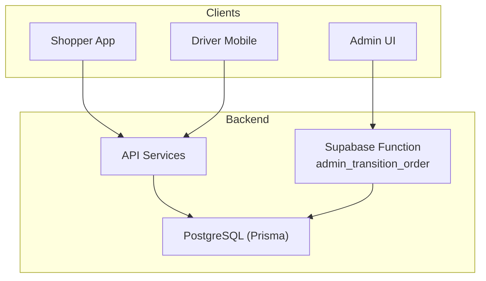
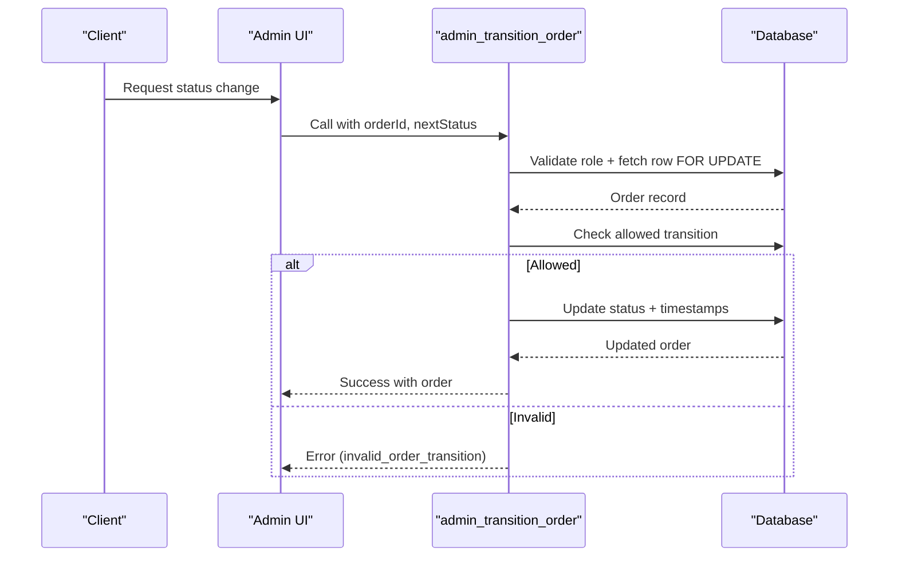
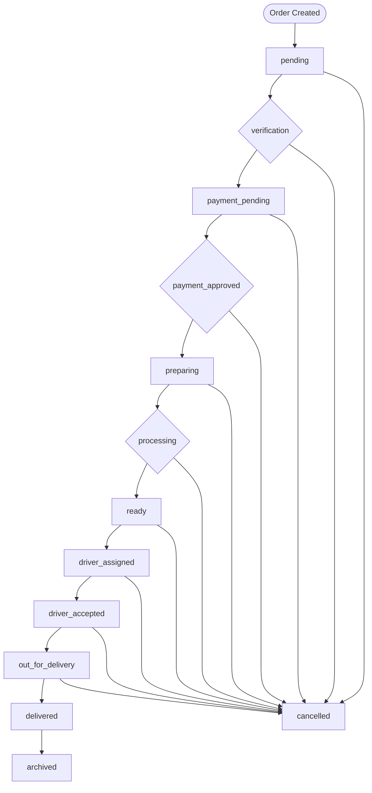
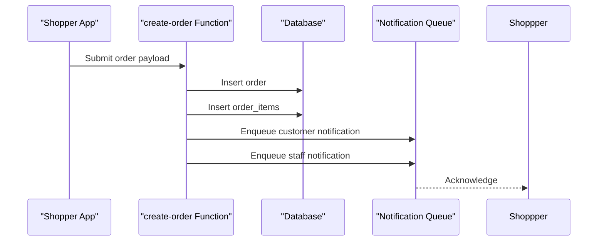
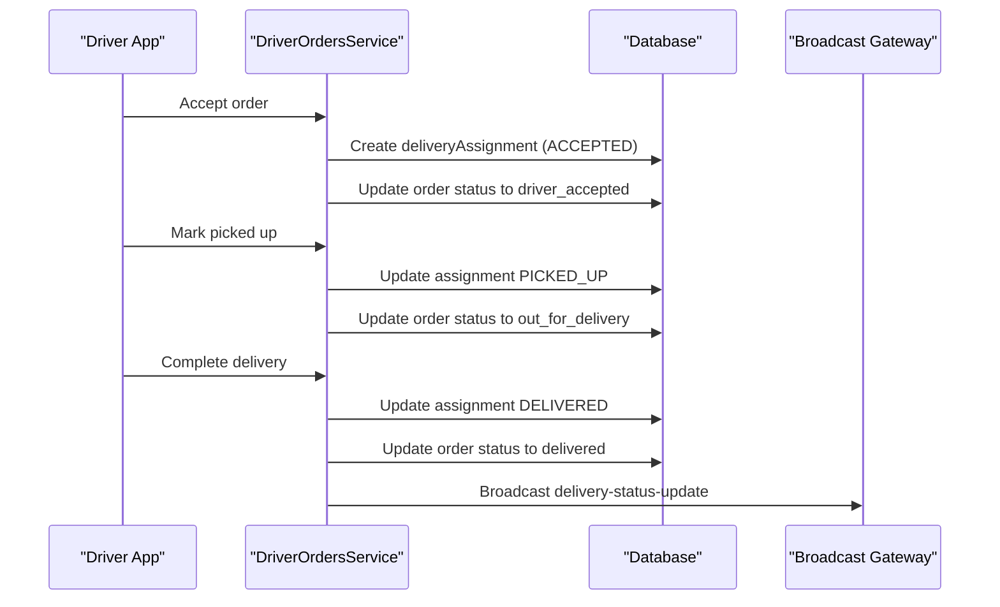
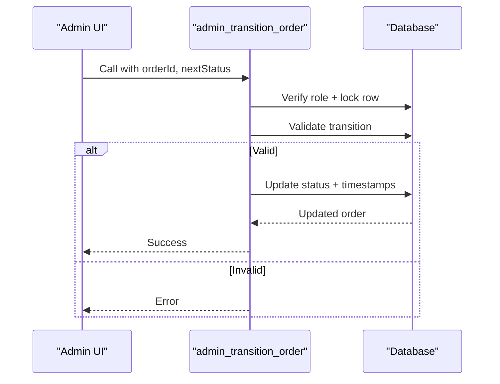
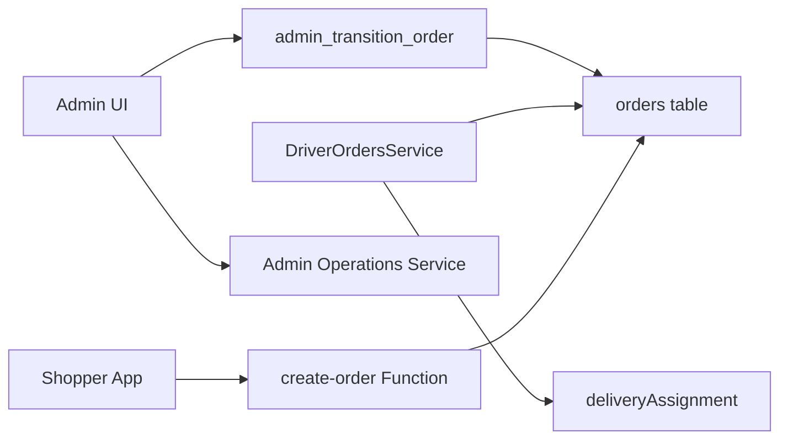

# Order Lifecycle Management

<cite>
**Referenced Files in This Document**
- [schema.prisma](file://apps/api/prisma/schema.prisma)
- [20260715150000_canonical_order_lifecycle.sql](file://supabase/migrations/20260715150000_canonical_order_lifecycle.sql)
- [driver-orders.service.ts](file://apps/api/src/modules/driver/driver-orders.service.ts)
- [admin-operations.service.ts](file://apps/api/src/modules/admin/admin-operations.service.ts)
- [create-order/index.ts](file://apps/shopper-native/supabase/functions/create-order/index.ts)
- [adminOrdersApi.ts](file://apps/shopper-web/src/services/adminOrdersApi.ts)
- [OrdersPage.tsx](file://apps/admin/src/pages/OrdersPage.tsx)
</cite>

## Table of Contents
1. Introduction
2. Project Structure
3. Core Components
4. Architecture Overview
5. Detailed Component Analysis
6. Dependency Analysis
7. Performance Considerations
8. Troubleshooting Guide
9. Conclusion

## Introduction
This document explains the canonical order lifecycle management system, covering states from creation through fulfillment and closure. It details the state machine, business rules for transitions, validation checks, automatic status updates, and end-to-end flows across client apps and backend services. The goal is to provide a clear, code-backed understanding of how orders flow through stages such as pending, confirmed, processing, preparing, out_for_delivery, delivered, and cancelled, with additional canonical states used by the platform.

## Project Structure
The order lifecycle spans multiple layers:
- Database schema defines the orders model and order_status enum.
- A Supabase function enforces canonical transitions via a secure stored procedure.
- API services implement driver-side delivery workflows that update both assignment and order statuses.
- Admin UI calls into backend endpoints or RPCs to transition orders.
- Shopper clients create orders and rely on backend normalization for consistent status display.

**Diagram sources**
- [schema.prisma:556-592](file://apps/api/prisma/schema.prisma#L556-L592)
- [20260715150000_canonical_order_lifecycle.sql:16-41](file://supabase/migrations/20260715150000_canonical_order_lifecycle.sql#L16-L41)
- [driver-orders.service.ts:187-295](file://apps/api/src/modules/driver/driver-orders.service.ts#L187-L295)
- [adminOrdersApi.ts:293-307](file://apps/shopper-web/src/services/adminOrdersApi.ts#L293-L307)

**Section sources**
- [schema.prisma:556-592](file://apps/api/prisma/schema.prisma#L556-L592)
- [20260715150000_canonical_order_lifecycle.sql:1-41](file://supabase/migrations/20260715150000_canonical_order_lifecycle.sql#L1-41)

## Core Components
- Orders model and order_status enum define the canonical states and core fields like last_status_at and updated_at.
- Canonical transition RPC validates allowed transitions and persists changes atomically.
- Driver service manages delivery assignments and maps assignment states to canonical order states.
- Admin operations expose endpoints to assign drivers and update order status.
- Shopper native create-order function inserts orders and items, then triggers notifications.

Key responsibilities:
- Enforce state graph integrity at the database layer.
- Provide driver-facing workflows for pickup and delivery.
- Offer admin controls for manual transitions when needed.
- Ensure order creation is idempotent and auditable.

**Section sources**
- [schema.prisma:753-763](file://apps/api/prisma/schema.prisma#L753-L763)
- [20260715150000_canonical_order_lifecycle.sql:16-41](file://supabase/migrations/20260715150000_canonical_order_lifecycle.sql#L16-L41)
- [driver-orders.service.ts:569-611](file://apps/api/src/modules/driver/driver-orders.service.ts#L569-L611)
- [admin-operations.service.ts:183-266](file://apps/api/src/modules/admin/admin-operations.service.ts#L183-L266)
- [create-order/index.ts:289-334](file://apps/shopper-native/supabase/functions/create-order/index.ts#L289-L334)

## Architecture Overview
The canonical lifecycle is enforced by a stored procedure that only allows valid transitions. Driver actions update delivery assignments and map to canonical order states. Admin UI can call the RPC directly or use API endpoints to transition orders.

**Diagram sources**
- [20260715150000_canonical_order_lifecycle.sql:16-41](file://supabase/migrations/20260715150000_canonical_order_lifecycle.sql#L16-L41)
- [adminOrdersApi.ts:293-307](file://apps/shopper-web/src/services/adminOrdersApi.ts#L293-L307)

## Detailed Component Analysis

### Canonical State Machine and Rules
- States include: pending, verification, payment_pending, payment_approved, preparing, processing, ready, driver_assigned, driver_accepted, out_for_delivery, picked_up, shipped, delivered, cancelled, archived.
- Only specific transitions are permitted; attempts outside the graph raise an error.
- Timestamps last_status_at and updated_at are updated on each transition.

**Diagram sources**
- [20260715150000_canonical_order_lifecycle.sql:24-35](file://supabase/migrations/20260715150000_canonical_order_lifecycle.sql#L24-L35)
- [schema.prisma:753-763](file://apps/api/prisma/schema.prisma#L753-L763)

**Section sources**
- [20260715150000_canonical_order_lifecycle.sql:16-41](file://supabase/migrations/20260715150000_canonical_order_lifecycle.sql#L16-L41)
- [schema.prisma:753-763](file://apps/api/prisma/schema.prisma#L753-L763)

### Order Creation Workflow
- Shopper app creates an order via a Supabase function that inserts the order and its items, then enqueues notifications.
- Initial order status is set according to business rules (e.g., pending).
- Notifications inform staff and customers about the new order.

**Diagram sources**
- [create-order/index.ts:289-334](file://apps/shopper-native/supabase/functions/create-order/index.ts#L289-L334)

**Section sources**
- [create-order/index.ts:289-334](file://apps/shopper-native/supabase/functions/create-order/index.ts#L289-L334)

### Driver Delivery Lifecycle and Mapping to Canonical States
- Drivers view available orders in ready state and accept them, creating a delivery assignment.
- Assignment workflow progresses through accepted, en route to pickup, arrived at pharmacy, picked up, en route to customer, arrived at customer, and delivered.
- Each relevant assignment transition maps to a canonical order state (e.g., picked_up → out_for_delivery; delivered → delivered).

**Diagram sources**
- [driver-orders.service.ts:187-295](file://apps/api/src/modules/driver/driver-orders.service.ts#L187-L295)
- [driver-orders.service.ts:402-510](file://apps/api/src/modules/driver/driver-orders.service.ts#L402-L510)
- [driver-orders.service.ts:569-611](file://apps/api/src/modules/driver/driver-orders.service.ts#L569-L611)

**Section sources**
- [driver-orders.service.ts:187-295](file://apps/api/src/modules/driver/driver-orders.service.ts#L187-L295)
- [driver-orders.service.ts:402-510](file://apps/api/src/modules/driver/driver-orders.service.ts#L402-L510)
- [driver-orders.service.ts:569-611](file://apps/api/src/modules/driver/driver-orders.service.ts#L569-L611)

### Admin Transitions and Manual Updates
- Admin UI can call the canonical RPC to transition orders, ensuring all changes pass validation.
- Alternatively, admin endpoints may be used to assign drivers or update status via backend services.
- The RPC enforces role-based access and prevents invalid transitions.

**Diagram sources**
- [adminOrdersApi.ts:293-307](file://apps/shopper-web/src/services/adminOrdersApi.ts#L293-L307)
- [20260715150000_canonical_order_lifecycle.sql:16-41](file://supabase/migrations/20260715150000_canonical_order_lifecycle.sql#L16-L41)

**Section sources**
- [adminOrdersApi.ts:293-307](file://apps/shopper-web/src/services/adminOrdersApi.ts#L293-L307)
- [20260715150000_canonical_order_lifecycle.sql:16-41](file://supabase/migrations/20260715150000_canonical_order_lifecycle.sql#L16-L41)
- [admin-operations.service.ts:183-266](file://apps/api/src/modules/admin/admin-operations.service.ts#L183-L266)
- [OrdersPage.tsx:59-79](file://apps/admin/src/pages/OrdersPage.tsx#L59-L79)

## Dependency Analysis
- The canonical transition RPC depends on roles and order existence; it is the authoritative source for safe transitions.
- Driver service depends on delivery assignments and maps assignment states to canonical order states.
- Admin UI depends on either the RPC or backend endpoints to perform transitions.
- Order creation depends on inserting orders and items, then triggering notifications.

**Diagram sources**
- [20260715150000_canonical_order_lifecycle.sql:16-41](file://supabase/migrations/20260715150000_canonical_order_lifecycle.sql#L16-L41)
- [driver-orders.service.ts:569-611](file://apps/api/src/modules/driver/driver-orders.service.ts#L569-L611)
- [adminOrdersApi.ts:293-307](file://apps/shopper-web/src/services/adminOrdersApi.ts#L293-L307)
- [create-order/index.ts:289-334](file://apps/shopper-native/supabase/functions/create-order/index.ts#L289-L334)

**Section sources**
- [20260715150000_canonical_order_lifecycle.sql:16-41](file://supabase/migrations/20260715150000_canonical_order_lifecycle.sql#L16-L41)
- [driver-orders.service.ts:569-611](file://apps/api/src/modules/driver/driver-orders.service.ts#L569-L611)
- [adminOrdersApi.ts:293-307](file://apps/shopper-web/src/services/adminOrdersApi.ts#L293-L307)
- [create-order/index.ts:289-334](file://apps/shopper-native/supabase/functions/create-order/index.ts#L289-L334)

## Performance Considerations
- Use transactions to ensure atomicity when updating assignments and order statuses together.
- Lock rows during critical transitions to prevent race conditions.
- Keep broadcast updates non-blocking so they do not fail requests if unavailable.
- Indexes on status and created_at improve query performance for listing and filtering orders.

[No sources needed since this section provides general guidance]

## Troubleshooting Guide
Common issues and resolutions:
- Invalid transition: Occurs when attempting a state change not allowed by the canonical graph. Resolve by following the defined transitions or using admin tools to correct state.
- Insufficient privilege: RPC requires specific roles; ensure the caller has admin, manager, or pharmacist privileges.
- Order not found: Verify the order exists before transitioning.
- Driver must be online: Driver actions require the driver profile to be marked online.
- Active delivery conflict: Drivers cannot accept another order while an active delivery is in progress.

**Section sources**
- [20260715150000_canonical_order_lifecycle.sql:16-41](file://supabase/migrations/20260715150000_canonical_order_lifecycle.sql#L16-L41)
- [driver-orders.service.ts:68-70](file://apps/api/src/modules/driver/driver-orders.service.ts#L68-L70)
- [driver-orders.service.ts:191-215](file://apps/api/src/modules/driver/driver-orders.service.ts#L191-L215)

## Conclusion
The order lifecycle is governed by a canonical state machine enforced at the database layer, with driver workflows mapping assignment states to canonical order states. Admin UI uses a secure RPC to perform validated transitions, while shopper clients create orders reliably and trigger notifications. This design ensures consistency, auditability, and resilience across the entire order flow from creation to delivery and archival.

[No sources needed since this section summarizes without analyzing specific files]