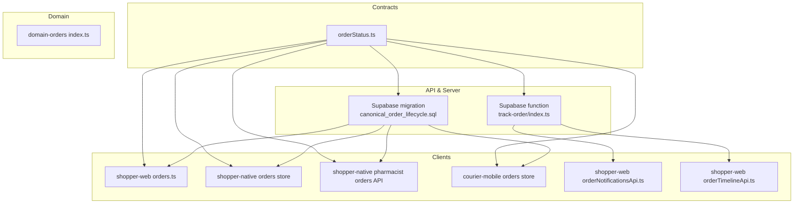
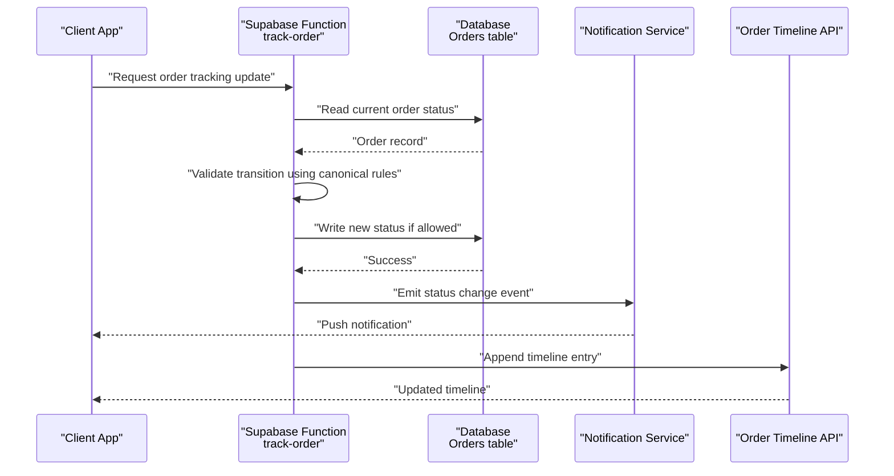
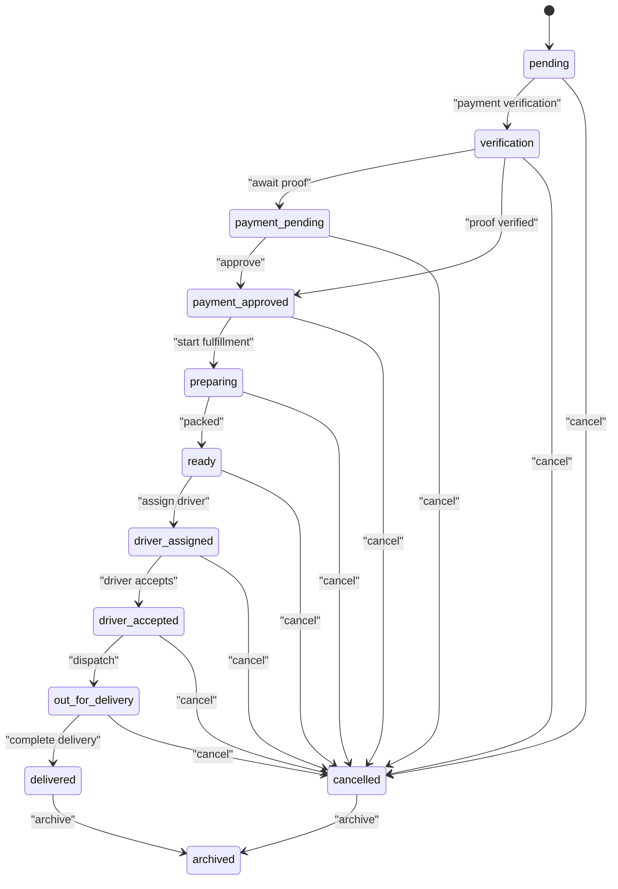
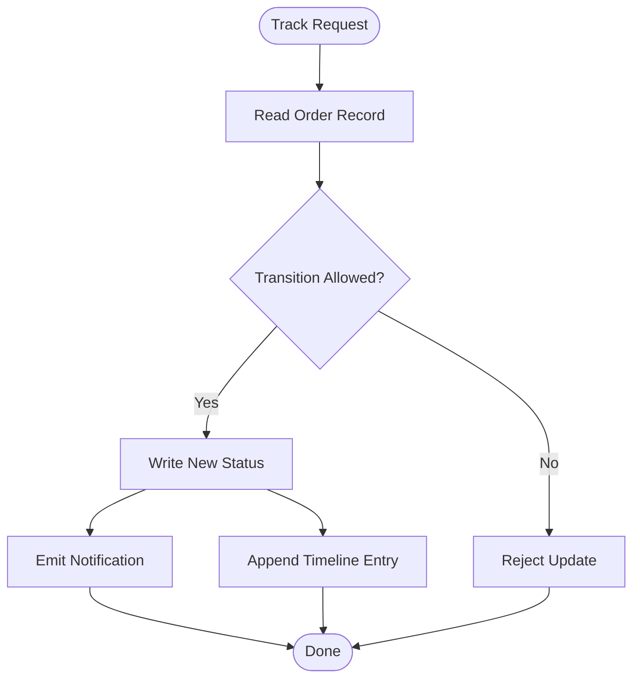
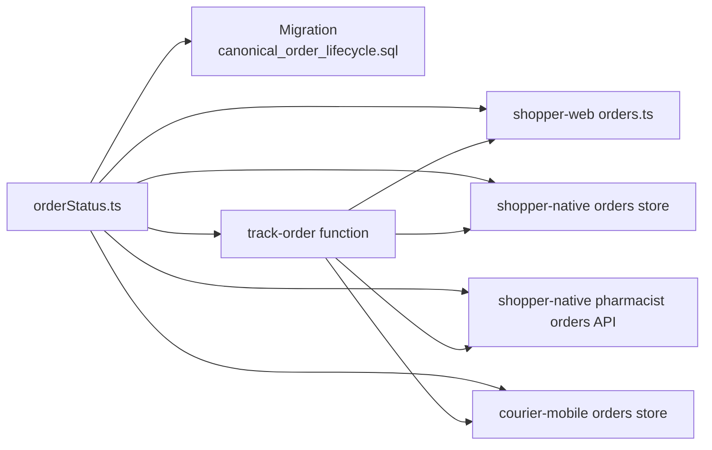

# Orders Module

<cite>
**Referenced Files in This Document**
- [orderStatus.ts](file://packages/contracts/src/orderStatus.ts)
- [index.ts](file://packages/domain-orders/src/index.ts)
- [orders.store.ts](file://apps/courier-mobile/src/stores/orders.store.ts)
- [orders.styles.ts](file://apps/shopper-native/src/features/orders/components/orders.styles.ts)
- [orders.ts (pharmacist api)](file://apps/shopper-native/src/features/pharmacist/api/orders.ts)
- [orders.ts (native store)](file://apps/shopper-native/src/stores/orders.ts)
- [orders.ts (web app)](file://apps/shopper-web/src/app/orders.ts)
- [orderNotificationsApi.ts](file://apps/shopper-web/src/services/orderNotificationsApi.ts)
- [orderTimelineApi.ts](file://apps/shopper-web/src/services/orderTimelineApi.ts)
- [20260715150000_canonical_order_lifecycle.sql](file://supabase/migrations/20260715150000_canonical_order_lifecycle.sql)
- [track-order function](file://supabase/functions/track-order/index.ts)
</cite>

## Table of Contents
1. [Introduction](#introduction)
2. [Project Structure](#project-structure)
3. [Core Components](#core-components)
4. [Architecture Overview](#architecture-overview)
5. [Detailed Component Analysis](#detailed-component-analysis)
6. [Dependency Analysis](#dependency-analysis)
7. [Performance Considerations](#performance-considerations)
8. [Troubleshooting Guide](#troubleshooting-guide)
9. [Conclusion](#conclusion)
10. [Appendices](#appendices)

## Introduction
This document describes the Orders module across the platform, focusing on the end-to-end order lifecycle from creation to fulfillment. It consolidates the canonical order status model, state transitions, and integration points with delivery, notifications, and client applications (web, native, courier). The goal is to provide a clear, code-grounded reference for developers and operators managing orders, payments, inventory, and delivery workflows.

## Project Structure
The Orders module spans multiple layers:
- Contracts define the canonical order statuses and allowed transitions.
- Domain package exposes minimal domain types used by clients.
- API layer integrates with database migrations and functions for tracking and lifecycle management.
- Client apps implement UI and local stores for order browsing, details, and timeline updates.
- Supabase functions handle real-time tracking and other server-side orchestration.

**Diagram sources**
- [orderStatus.ts:59-167](file://packages/contracts/src/orderStatus.ts#L59-L167)
- [index.ts:1-2](file://packages/domain-orders/src/index.ts#L1-L2)
- [20260715150000_canonical_order_lifecycle.sql](file://supabase/migrations/20260715150000_canonical_order_lifecycle.sql)
- [track-order function](file://supabase/functions/track-order/index.ts)
- [orders.ts (web app):1-200](file://apps/shopper-web/src/app/orders.ts)
- [orders.ts (native store):1-200](file://apps/shopper-native/src/stores/orders.ts)
- [orders.ts (pharmacist api):1-200](file://apps/shopper-native/src/features/pharmacist/api/orders.ts)
- [orders.store.ts (courier):1-200](file://apps/courier-mobile/src/stores/orders.store.ts)
- [orderNotificationsApi.ts:1-200](file://apps/shopper-web/src/services/orderNotificationsApi.ts)
- [orderTimelineApi.ts:1-200](file://apps/shopper-web/src/services/orderTimelineApi.ts)

**Section sources**
- [orderStatus.ts:59-167](file://packages/contracts/src/orderStatus.ts#L59-L167)
- [index.ts:1-2](file://packages/domain-orders/src/index.ts#L1-L2)

## Core Components
- Canonical order statuses and transitions: A single source of truth defines all valid statuses and which transitions are permitted between them.
- Order lifecycle enforcement: Database migrations codify the canonical lifecycle; server functions enforce or assist with state changes like tracking updates.
- Client integrations: Web and native apps consume the canonical statuses to render consistent UIs, timelines, and notifications. Courier app uses order data for delivery operations.

Key responsibilities:
- Status normalization and validation across all surfaces.
- Consistent labeling and localization for status display.
- Real-time tracking via Supabase function and APIs.
- Notification and timeline services for customers and staff.

**Section sources**
- [orderStatus.ts:59-167](file://packages/contracts/src/orderStatus.ts#L59-L167)
- [20260715150000_canonical_order_lifecycle.sql](file://supabase/migrations/20260715150000_canonical_order_lifecycle.sql)
- [track-order function](file://supabase/functions/track-order/index.ts)

## Architecture Overview
The order system enforces a canonical lifecycle through shared contracts and database-level definitions. Clients read and display statuses consistently, while server-side components manage transitions and integrate with delivery and notification systems.

**Diagram sources**
- [orderStatus.ts:134-167](file://packages/contracts/src/orderStatus.ts#L134-L167)
- [track-order function](file://supabase/functions/track-order/index.ts)
- [orderTimelineApi.ts:1-200](file://apps/shopper-web/src/services/orderTimelineApi.ts)
- [orderNotificationsApi.ts:1-200](file://apps/shopper-web/src/services/orderNotificationsApi.ts)

## Detailed Component Analysis

### Canonical Order Lifecycle and State Machine
The canonical lifecycle defines all accepted statuses and the allowed transitions between them. It also normalizes legacy values to ensure consistency across systems. Terminal states include delivered and cancelled, with archived as a post-terminal archival step.

**Diagram sources**
- [orderStatus.ts:134-167](file://packages/contracts/src/orderStatus.ts#L134-L167)

**Section sources**
- [orderStatus.ts:59-167](file://packages/contracts/src/orderStatus.ts#L59-L167)

### Order Creation and Cart Processing
While cart processing is not detailed in this document’s referenced files, order creation typically involves:
- Validating items and pricing against catalog and promotions.
- Reserving or checking inventory availability.
- Determining payment method and initial status based on policy (e.g., COD vs manual wallet requiring verification).
- Persisting the order with an initial canonical status and emitting events for downstream processes.

Operational notes:
- Ensure initial status aligns with canonical rules before any write.
- Use normalized status values to avoid legacy inconsistencies.

[No sources needed since this section provides general guidance without analyzing specific files]

### Payment Handling and Confirmation
Payment handling integrates with the canonical lifecycle:
- Manual wallet payments may start in a verification/payment_pending state until proof is reviewed.
- Once approved, orders transition to preparing for fulfillment.
- Rejections or failures can lead to cancellation or re-attempts depending on business rules.

Integration points:
- Notifications inform customers and staff about payment status changes.
- Timeline records each payment-related event for auditability.

**Section sources**
- [orderStatus.ts:113-167](file://packages/contracts/src/orderStatus.ts#L113-L167)
- [orderNotificationsApi.ts:1-200](file://apps/shopper-web/src/services/orderNotificationsApi.ts)
- [orderTimelineApi.ts:1-200](file://apps/shopper-web/src/services/orderTimelineApi.ts)

### Order Tracking and Status Notifications
Tracking is facilitated by a dedicated Supabase function that reads the current order state, validates transitions, and writes updates when allowed. Notifications and timeline APIs propagate changes to clients.

**Diagram sources**
- [track-order function](file://supabase/functions/track-order/index.ts)
- [orderStatus.ts:134-167](file://packages/contracts/src/orderStatus.ts#L134-L167)
- [orderNotificationsApi.ts:1-200](file://apps/shopper-web/src/services/orderNotificationsApi.ts)
- [orderTimelineApi.ts:1-200](file://apps/shopper-web/src/services/orderTimelineApi.ts)

**Section sources**
- [track-order function](file://supabase/functions/track-order/index.ts)
- [orderStatus.ts:134-167](file://packages/contracts/src/orderStatus.ts#L134-L167)

### Order Modifications, Cancellations, and Refunds
- Modifications: Typically limited after confirmation; changes may require cancellation and re-order or admin override depending on policy.
- Cancellations: Allowed from non-terminal states per canonical transitions; enforced at both application and database levels.
- Refunds: Post-delivery or cancellation flows should be recorded in timeline and linked to payment records; notifications inform stakeholders.

Best practices:
- Always validate transitions using canonical rules before writing.
- Log every modification in the timeline for traceability.
- Use notifications to keep customers informed of changes.

**Section sources**
- [orderStatus.ts:134-167](file://packages/contracts/src/orderStatus.ts#L134-L167)
- [orderTimelineApi.ts:1-200](file://apps/shopper-web/src/services/orderTimelineApi.ts)
- [orderNotificationsApi.ts:1-200](file://apps/shopper-web/src/services/orderNotificationsApi.ts)

### Order History, Bulk Operations, and Reporting
- Order history: Built from timeline entries and status changes; accessible via timeline APIs.
- Bulk operations: Admin or ops tools can batch-update statuses where allowed by canonical transitions; always enforce role-based checks and audit logs.
- Reporting: Aggregate metrics such as conversion rates, average preparation time, delivery SLA adherence, and cancellation reasons derived from timeline and status history.

Implementation tips:
- Expose filtered queries by status, date ranges, and branch/driver.
- Provide export capabilities for analytics and compliance.

[No sources needed since this section provides general guidance without analyzing specific files]

### Data Model and Business Rules
- Data model: Orders table includes fields for customer, items, totals, addresses, payment info, and status. Migrations define the canonical lifecycle constraints.
- Business rules:
  - Only canonical statuses are written; legacy synonyms are normalized.
  - Transitions must follow the defined graph; terminal states restrict further changes.
  - Role-based access controls govern who can move orders between states.

Database alignment:
- Migration ensures schema supports canonical lifecycle and related indexes for performance.

**Section sources**
- [20260715150000_canonical_order_lifecycle.sql](file://supabase/migrations/20260715150000_canonical_order_lifecycle.sql)
- [orderStatus.ts:59-167](file://packages/contracts/src/orderStatus.ts#L59-L167)

### Integration with Inventory and Delivery Modules
- Inventory: When orders are confirmed/preparing, reserve or decrement stock accordingly; handle backorders or partial fulfillment policies.
- Delivery: Driver assignment and dispatch flow transitions through driver_assigned, driver_accepted, and out_for_delivery; completion leads to delivered.

Courier integration:
- Courier mobile store consumes order data to support pickup and delivery tasks.

**Section sources**
- [orders.store.ts (courier):1-200](file://apps/courier-mobile/src/stores/orders.store.ts)
- [orderStatus.ts:134-167](file://packages/contracts/src/orderStatus.ts#L134-L167)

## Dependency Analysis
The Orders module depends on shared contracts for status definitions and transitions, database migrations for schema enforcement, and Supabase functions for server-side orchestration. Client applications depend on these contracts and APIs to present consistent experiences.

**Diagram sources**
- [orderStatus.ts:59-167](file://packages/contracts/src/orderStatus.ts#L59-L167)
- [20260715150000_canonical_order_lifecycle.sql](file://supabase/migrations/20260715150000_canonical_order_lifecycle.sql)
- [track-order function](file://supabase/functions/track-order/index.ts)
- [orders.ts (web app):1-200](file://apps/shopper-web/src/app/orders.ts)
- [orders.ts (native store):1-200](file://apps/shopper-native/src/stores/orders.ts)
- [orders.ts (pharmacist api):1-200](file://apps/shopper-native/src/features/pharmacist/api/orders.ts)
- [orders.store.ts (courier):1-200](file://apps/courier-mobile/src/stores/orders.store.ts)

**Section sources**
- [orderStatus.ts:59-167](file://packages/contracts/src/orderStatus.ts#L59-L167)
- [20260715150000_canonical_order_lifecycle.sql](file://supabase/migrations/20260715150000_canonical_order_lifecycle.sql)
- [track-order function](file://supabase/functions/track-order/index.ts)

## Performance Considerations
- Indexes: Ensure orders table is indexed on frequently queried columns such as status, customer_id, created_at, and branch/driver associations.
- Queries: Use pagination and filtering for order lists; avoid loading full timelines unless necessary.
- Real-time updates: Limit frequency of tracking updates; batch notifications where appropriate.
- Caching: Cache static labels and localized status text on clients to reduce network calls.

[No sources needed since this section provides general guidance without analyzing specific files]

## Troubleshooting Guide
Common issues and resolutions:
- Invalid status transitions: Validate against canonical transitions before writing; log rejected attempts for audit.
- Legacy status mismatches: Normalize incoming statuses to canonical values; map legacy synonyms explicitly.
- Tracking delays: Check track-order function execution logs and database locks; ensure notifications and timeline APIs are reachable.
- Inconsistent UI states: Refresh timelines and re-fetch order details after state changes; debounce rapid updates.

Operational checks:
- Verify migration applied successfully and enum matches canonical definitions.
- Confirm role-based permissions allow intended transitions.
- Inspect notification delivery and timeline entries for completeness.

**Section sources**
- [orderStatus.ts:102-167](file://packages/contracts/src/orderStatus.ts#L102-L167)
- [orderTimelineApi.ts:1-200](file://apps/shopper-web/src/services/orderTimelineApi.ts)
- [orderNotificationsApi.ts:1-200](file://apps/shopper-web/src/services/orderNotificationsApi.ts)

## Conclusion
The Orders module enforces a robust, canonical lifecycle through shared contracts and database-level constraints. Clients render consistent experiences by consuming normalized statuses and transitions. Server-side functions coordinate tracking and integrate with notifications and timelines. Adhering to the canonical rules ensures reliability, auditability, and scalability across web, native, and courier applications.

[No sources needed since this section summarizes without analyzing specific files]

## Appendices

### Status Labels and Localization
Canonical statuses include bilingual labels for Arabic and English, ensuring consistent presentation across interfaces.

**Section sources**
- [orderStatus.ts:113-132](file://packages/contracts/src/orderStatus.ts#L113-L132)

### Domain Types
Minimal domain types expose operational states for modules that need lightweight status indicators.

**Section sources**
- [index.ts:1-2](file://packages/domain-orders/src/index.ts#L1-L2)