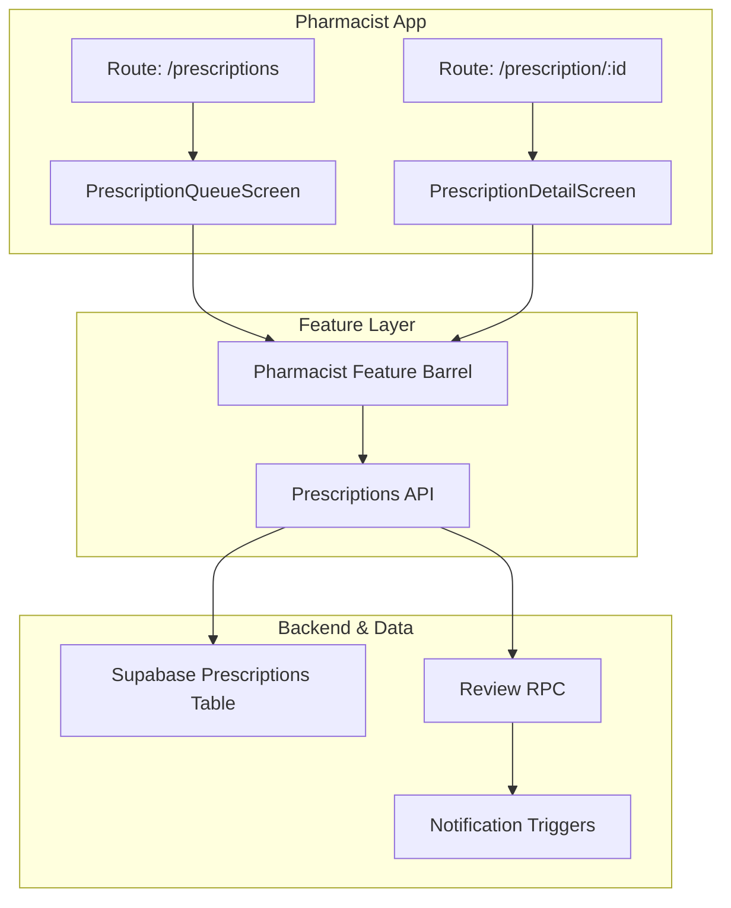
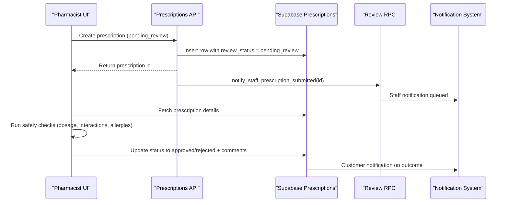
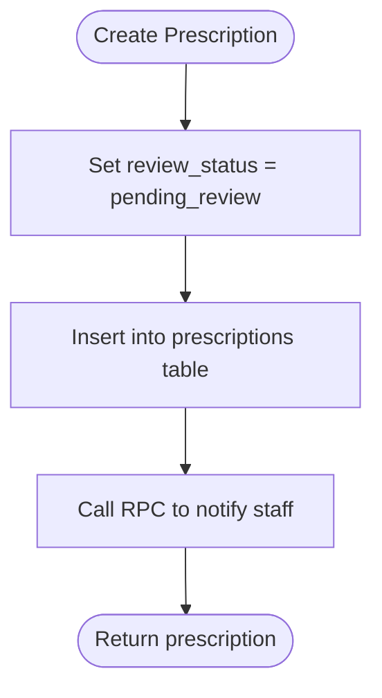
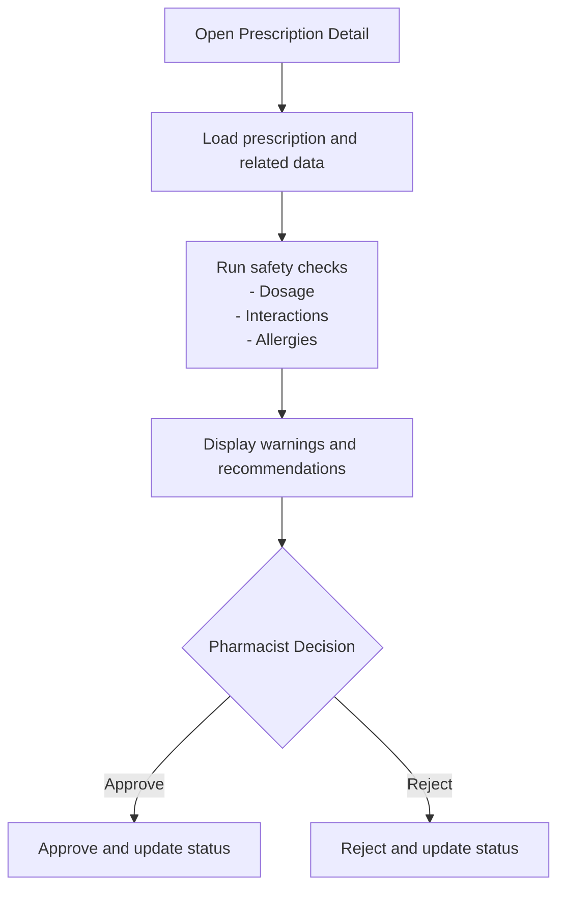
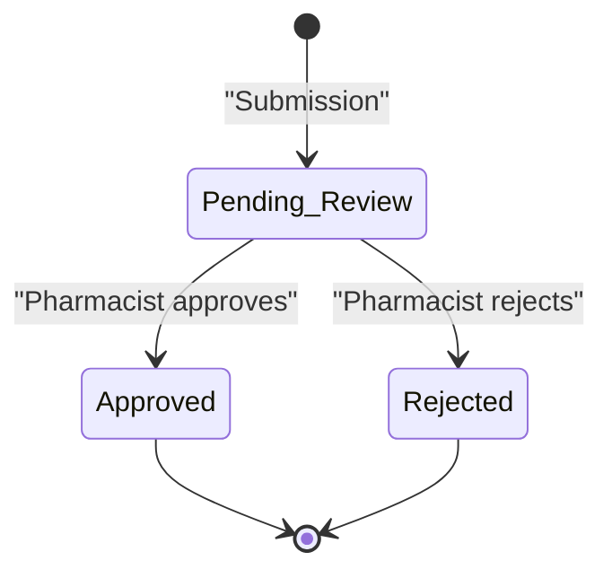
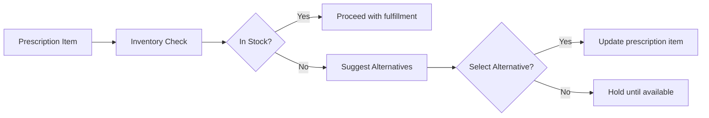
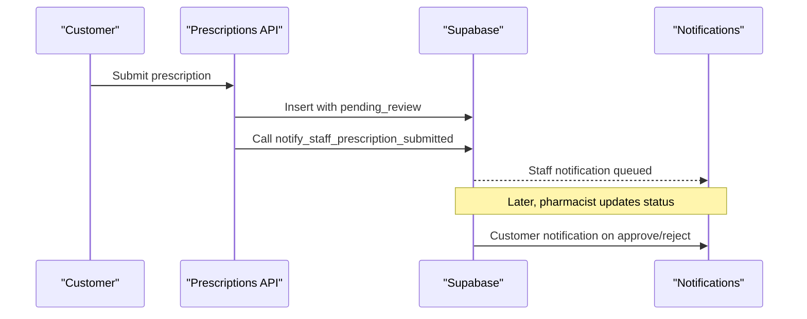
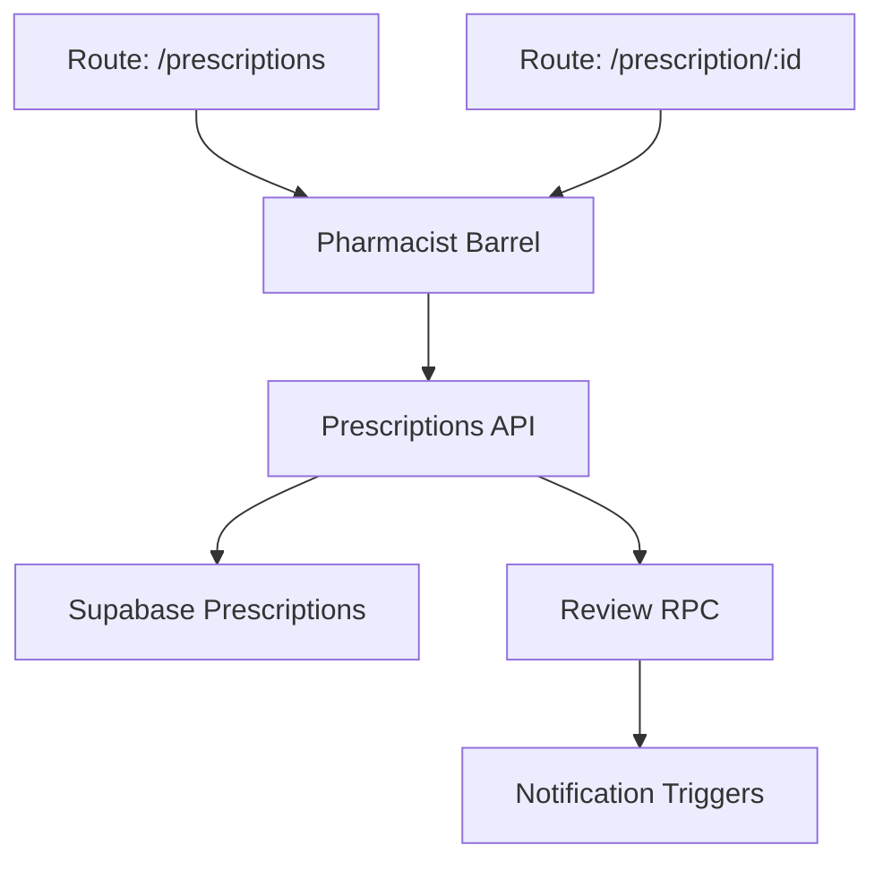

# Pharmacist Review Workflow

<cite>
**Referenced Files in This Document**
- [prescriptions.tsx](file://apps/shopper-native/app/(pharmacist)/prescriptions.tsx)
- [id.tsx](file://apps/shopper-native/app/(pharmacist)/prescription/[id].tsx)
- [index.ts](file://apps/shopper-native/src/features/pharmacist/index.ts)
- [api.ts](file://apps/shopper-native/src/features/prescriptions/api.ts)
- [20260705_prescriptions_admin_review.sql](file://database/20260705_prescriptions_admin_review.sql)
- [20260809120000_prescription_review_rpc.sql](file://supabase/migrations/20260809120000_prescription_review_rpc.sql)
- [20260729120000_pharmacist_customer_notifications.sql](file://supabase/migrations/20260729120000_pharmacist_customer_notifications.sql)
- [20260809103000_prescription_submission_notifications.sql](file://supabase/migrations/20260809103000_prescription_submission_notifications.sql)
- [InventoryScreen.tsx](file://apps/shopper-native/src/features/pharmacist/screens/InventoryScreen.tsx)
- [InventoryIntelligenceScreen.tsx](file://apps/shopper-native/src/features/pharmacist/screens/InventoryIntelligenceScreen.tsx)
</cite>

## Table of Contents
1. Introduction
2. Project Structure
3. Core Components
4. Architecture Overview
5. Detailed Component Analysis
6. Dependency Analysis
7. Performance Considerations
8. Troubleshooting Guide
9. Conclusion

## Introduction
This document describes the pharmacist review workflow for prescriptions, covering prescription verification, safety checks, and approval processes. It explains the pharmacist review interface (prescription display, drug interaction checking, dosage validation, allergy warnings), the approval/rejection workflow with status transitions, comments, and audit trails, integration with inventory systems to check medication availability and alternative suggestions, and notification triggers to customers when prescriptions are approved or rejected.

## Project Structure
The pharmacist review feature is implemented primarily in the shopper-native app under the pharmacist feature module and routes:
- Routes expose screens for the prescription queue and detail view.
- The pharmacist feature barrel exports screens and hooks used by the pharmacist UI.
- Prescription submission and lifecycle management are handled via a dedicated API that interacts with Supabase tables and RPCs.
- Database migrations define the review-related schema, RPCs, and notifications.

**Diagram sources**
- [prescriptions.tsx:1-2](file://apps/shopper-native/app/(pharmacist)/prescriptions.tsx#L1-L2)
- [id.tsx:1-2](file://apps/shopper-native/app/(pharmacist)/prescription/[id].tsx#L1-L2)
- [index.ts:6-18](file://apps/shopper-native/src/features/pharmacist/index.ts#L6-L18)
- [api.ts:75-108](file://apps/shopper-native/src/features/prescriptions/api.ts#L75-L108)
- [20260809120000_prescription_review_rpc.sql:1-200](file://supabase/migrations/20260809120000_prescription_review_rpc.sql#L1-L200)
- [20260729120000_pharmacist_customer_notifications.sql:1-200](file://supabase/migrations/20260729120000_pharmacist_customer_notifications.sql#L1-L200)

**Section sources**
- [prescriptions.tsx:1-2](file://apps/shopper-native/app/(pharmacist)/prescriptions.tsx#L1-L2)
- [id.tsx:1-2](file://apps/shopper-native/app/(pharmacist)/prescription/[id].tsx#L1-L2)
- [index.ts:6-18](file://apps/shopper-native/src/features/pharmacist/index.ts#L6-L18)
- [api.ts:75-108](file://apps/shopper-native/src/features/prescriptions/api.ts#L75-L108)

## Core Components
- Prescription Queue Screen: Displays pending prescriptions for pharmacist review.
- Prescription Detail Screen: Shows full prescription details, supports safety checks, and enables approval/rejection actions.
- Prescriptions API: Creates prescriptions, sets initial review status to pending, uploads images, and notifies staff on submission.
- Database Schema and Migrations: Define review statuses, fields for comments/audit, and RPCs for review operations.
- Notifications: Trigger customer notifications on approval/rejection and on submission.

Key responsibilities:
- Display: Load and render prescription data for review.
- Safety Checks: Validate dosage, interactions, allergies (via UI logic and backend rules).
- Approval Flow: Transition status from pending to approved or rejected; record comments and audit entries.
- Inventory Integration: Check stock and suggest alternatives during review.
- Notifications: Inform customers about submission, approval, and rejection outcomes.

**Section sources**
- [index.ts:9-18](file://apps/shopper-native/src/features/pharmacist/index.ts#L9-L18)
- [api.ts:75-108](file://apps/shopper-native/src/features/prescriptions/api.ts#L75-L108)
- [20260705_prescriptions_admin_review.sql:1-200](file://database/20260705_prescriptions_admin_review.sql#L1-L200)
- [20260809120000_prescription_review_rpc.sql:1-200](file://supabase/migrations/20260809120000_prescription_review_rpc.sql#L1-L200)
- [20260729120000_pharmacist_customer_notifications.sql:1-200](file://supabase/migrations/20260729120000_pharmacist_customer_notifications.sql#L1-L200)

## Architecture Overview
The pharmacist review workflow spans mobile screens, feature services, and backend database functions:

**Diagram sources**
- [api.ts:75-108](file://apps/shopper-native/src/features/prescriptions/api.ts#L75-L108)
- [20260809120000_prescription_review_rpc.sql:1-200](file://supabase/migrations/20260809120000_prescription_review_rpc.sql#L1-L200)
- [20260729120000_pharmacist_customer_notifications.sql:1-200](file://supabase/migrations/20260729120000_pharmacist_customer_notifications.sql#L1-L200)

## Detailed Component Analysis

### Prescription Submission and Initial Status
- New prescriptions are created with review_status set to pending_review to ensure every submission enters the pharmacist review queue.
- On creation, a staff notification is triggered so pharmacists can act promptly.
- Image upload support allows attaching prescription images to records.

**Diagram sources**
- [api.ts:75-108](file://apps/shopper-native/src/features/prescriptions/api.ts#L75-L108)

**Section sources**
- [api.ts:75-108](file://apps/shopper-native/src/features/prescriptions/api.ts#L75-L108)

### Review Interface: Display and Safety Checks
- The pharmacist route exposes a queue screen and a detail screen for each prescription.
- The detail screen should present:
  - Prescription metadata (name, dose, doctor, refills, rx number, image path).
  - Safety checks:
    - Dosage validation against product constraints.
    - Drug interaction checks across items in the order or patient profile.
    - Allergy warnings based on customer health profile.
- These checks can be enforced via UI validations and backend rules; results guide pharmacist decisions.

**Diagram sources**
- [prescriptions.tsx:1-2](file://apps/shopper-native/app/(pharmacist)/prescriptions.tsx#L1-L2)
- [id.tsx:1-2](file://apps/shopper-native/app/(pharmacist)/prescription/[id].tsx#L1-L2)

**Section sources**
- [prescriptions.tsx:1-2](file://apps/shopper-native/app/(pharmacist)/prescriptions.tsx#L1-L2)
- [id.tsx:1-2](file://apps/shopper-native/app/(pharmacist)/prescription/[id].tsx#L1-L2)

### Approval/Rejection Workflow: Status Transitions, Comments, Audit Trails
- Status transitions:
  - From pending_review to approved or rejected upon pharmacist action.
- Comments and audit:
  - Capture pharmacist comments and timestamps for traceability.
  - Ensure changes are logged through database-level triggers or RPCs.
- Notification triggers:
  - On approval or rejection, notify the customer via the notification system.

**Diagram sources**
- [20260705_prescriptions_admin_review.sql:1-200](file://database/20260705_prescriptions_admin_review.sql#L1-L200)
- [20260809120000_prescription_review_rpc.sql:1-200](file://supabase/migrations/20260809120000_prescription_review_rpc.sql#L1-L200)
- [20260729120000_pharmacist_customer_notifications.sql:1-200](file://supabase/migrations/20260729120000_pharmacist_customer_notifications.sql#L1-L200)

**Section sources**
- [20260705_prescriptions_admin_review.sql:1-200](file://database/20260705_prescriptions_admin_review.sql#L1-L200)
- [20260809120000_prescription_review_rpc.sql:1-200](file://supabase/migrations/20260809120000_prescription_review_rpc.sql#L1-L200)
- [20260729120000_pharmacist_customer_notifications.sql:1-200](file://supabase/migrations/20260729120000_pharmacist_customer_notifications.sql#L1-L200)

### Inventory Integration: Availability and Alternatives
- During review, pharmacists can check medication availability using the inventory screens.
- If unavailable, the system can suggest alternatives based on product catalog and stock levels.
- This integration helps reduce delays and improves fulfillment accuracy.

**Diagram sources**
- [InventoryScreen.tsx:1-200](file://apps/shopper-native/src/features/pharmacist/screens/InventoryScreen.tsx#L1-L200)
- [InventoryIntelligenceScreen.tsx:1-200](file://apps/shopper-native/src/features/pharmacist/screens/InventoryIntelligenceScreen.tsx#L1-L200)

**Section sources**
- [InventoryScreen.tsx:1-200](file://apps/shopper-native/src/features/pharmacist/screens/InventoryScreen.tsx#L1-L200)
- [InventoryIntelligenceScreen.tsx:1-200](file://apps/shopper-native/src/features/pharmacist/screens/InventoryIntelligenceScreen.tsx#L1-L200)

### Notification Triggers for Customers
- On submission: Staff notified to begin review.
- On approval/rejection: Customer receives a notification indicating the outcome.
- Notifications are managed via database triggers/RPCs and stored in the notification system.

**Diagram sources**
- [api.ts:75-108](file://apps/shopper-native/src/features/prescriptions/api.ts#L75-L108)
- [20260809103000_prescription_submission_notifications.sql:1-200](file://supabase/migrations/20260809103000_prescription_submission_notifications.sql#L1-L200)
- [20260729120000_pharmacist_customer_notifications.sql:1-200](file://supabase/migrations/20260729120000_pharmacist_customer_notifications.sql#L1-L200)

**Section sources**
- [api.ts:75-108](file://apps/shopper-native/src/features/prescriptions/api.ts#L75-L108)
- [20260809103000_prescription_submission_notifications.sql:1-200](file://supabase/migrations/20260809103000_prescription_submission_notifications.sql#L1-L200)
- [20260729120000_pharmacist_customer_notifications.sql:1-200](file://supabase/migrations/20260729120000_pharmacist_customer_notifications.sql#L1-L200)

## Dependency Analysis
- Mobile routes depend on pharmacist feature screens.
- Screens depend on the pharmacist feature barrel for exports.
- Prescriptions API depends on Supabase client and RPCs for notifications and review operations.
- Database migrations provide schema, RPCs, and triggers for review and notifications.

**Diagram sources**
- [prescriptions.tsx:1-2](file://apps/shopper-native/app/(pharmacist)/prescriptions.tsx#L1-L2)
- [id.tsx:1-2](file://apps/shopper-native/app/(pharmacist)/prescription/[id].tsx#L1-L2)
- [index.ts:6-18](file://apps/shopper-native/src/features/pharmacist/index.ts#L6-L18)
- [api.ts:75-108](file://apps/shopper-native/src/features/prescriptions/api.ts#L75-L108)
- [20260809120000_prescription_review_rpc.sql:1-200](file://supabase/migrations/20260809120000_prescription_review_rpc.sql#L1-L200)

**Section sources**
- [prescriptions.tsx:1-2](file://apps/shopper-native/app/(pharmacist)/prescriptions.tsx#L1-L2)
- [id.tsx:1-2](file://apps/shopper-native/app/(pharmacist)/prescription/[id].tsx#L1-L2)
- [index.ts:6-18](file://apps/shopper-native/src/features/pharmacist/index.ts#L6-L18)
- [api.ts:75-108](file://apps/shopper-native/src/features/prescriptions/api.ts#L75-L108)
- [20260809120000_prescription_review_rpc.sql:1-200](file://supabase/migrations/20260809120000_prescription_review_rpc.sql#L1-L200)

## Performance Considerations
- Batch operations: When reviewing multiple prescriptions, batch updates to minimize network calls.
- Caching: Cache prescription lists and inventory data locally to reduce latency.
- Optimistic UI: Update UI immediately on user actions while background tasks complete.
- Indexing: Ensure database indexes on frequently queried columns (e.g., review_status, user_id).
- Image handling: Compress images before upload to reduce bandwidth and storage costs.

[No sources needed since this section provides general guidance]

## Troubleshooting Guide
Common issues and resolutions:
- Prescription not appearing in queue:
  - Verify review_status is pending_review after creation.
  - Confirm staff notification RPC executed successfully.
- Safety checks not triggering:
  - Ensure UI validates dosage and fetches allergy/interaction data before allowing approval.
  - Check backend rules enforce constraints at the database level.
- Notifications not sent:
  - Confirm notification triggers are active and permissions allow inserts.
  - Validate customer notification migration is applied.
- Inventory mismatch:
  - Refresh inventory data before finalizing decisions.
  - Use intelligence screen to reconcile stock discrepancies.

**Section sources**
- [api.ts:75-108](file://apps/shopper-native/src/features/prescriptions/api.ts#L75-L108)
- [20260729120000_pharmacist_customer_notifications.sql:1-200](file://supabase/migrations/20260729120000_pharmacist_customer_notifications.sql#L1-L200)
- [20260809103000_prescription_submission_notifications.sql:1-200](file://supabase/migrations/20260809103000_prescription_submission_notifications.sql#L1-L200)

## Conclusion
The pharmacist review workflow ensures every prescription undergoes verification, safety checks, and explicit approval or rejection with full auditability. Integration with inventory systems enhances decision-making by providing availability and alternatives. Robust notification triggers keep both staff and customers informed throughout the process. Adhering to the outlined flows and safeguards promotes safe, efficient prescription processing.

[No sources needed since this section summarizes without analyzing specific files]