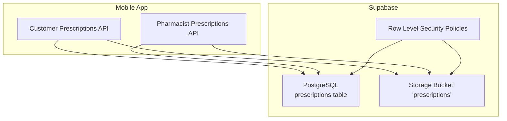
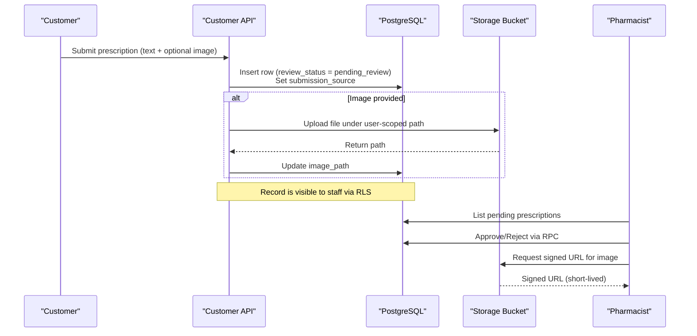
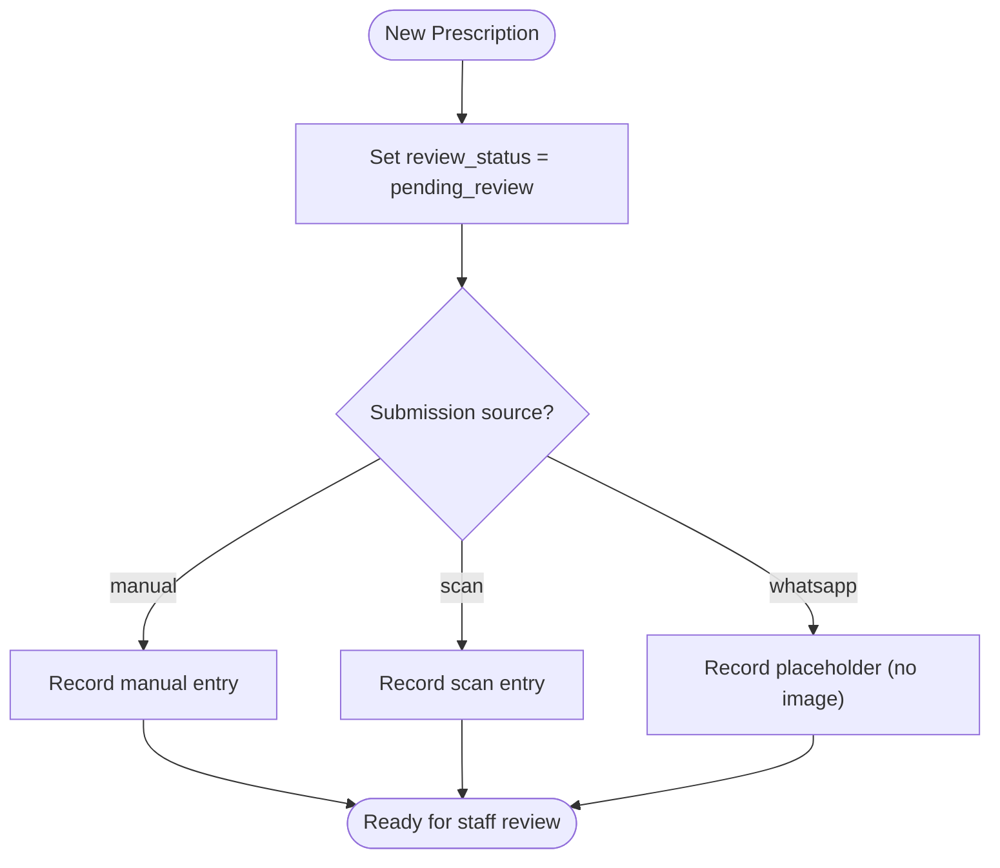
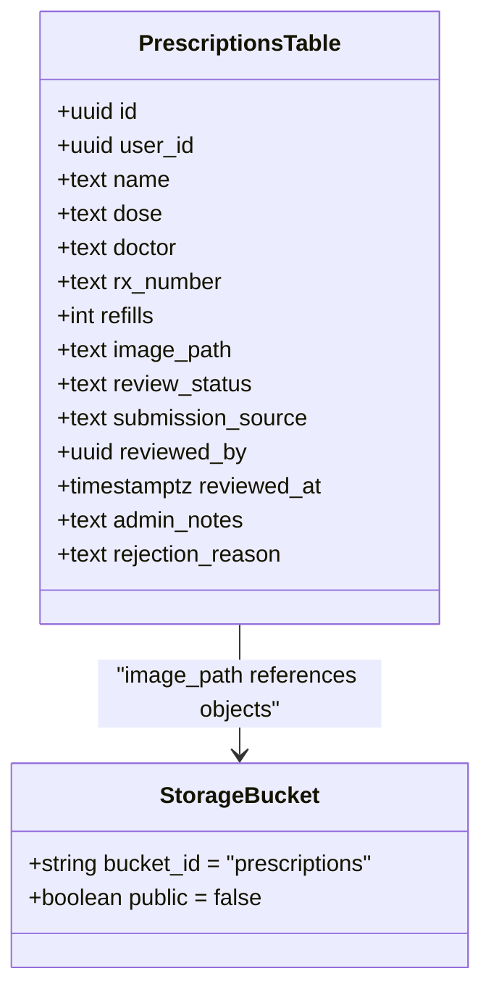
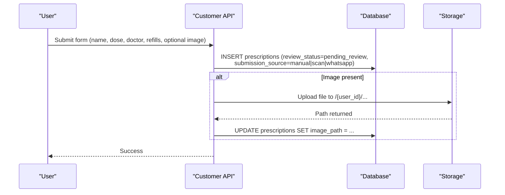
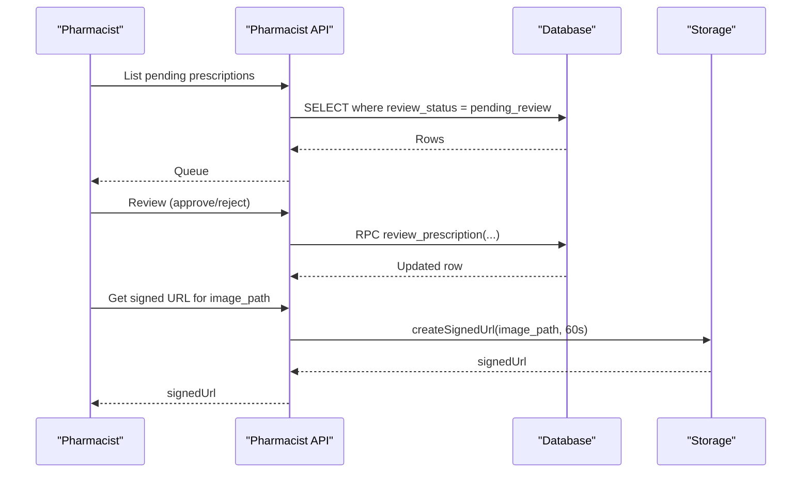
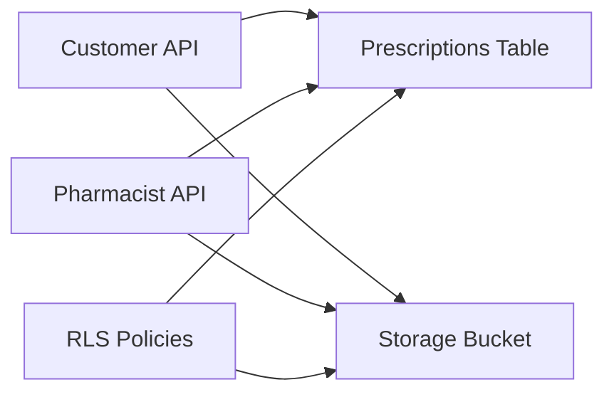

# Prescription Upload & Processing

<cite>
**Referenced Files in This Document**
- [20260817100000_prescription_image_upload.sql](file://supabase/migrations/20260817100000_prescription_image_upload.sql)
- [20260705_prescriptions_admin_review.sql](file://database/20260705_prescriptions_admin_review.sql)
- [prescriptions.ts (pharmacist API)](file://apps/shopper-native/src/features/pharmacist/api/prescriptions.ts)
- [api.ts (customer prescriptions)](file://apps/shopper-native/src/features/prescriptions/api.ts)
- [20260517_pharmacy_schema.sql](file://apps/shopper-native/supabase/migrations/20260517_pharmacy_schema.sql)
</cite>

## Table of Contents
1. Introduction
2. Project Structure
3. Core Components
4. Architecture Overview
5. Detailed Component Analysis
6. Dependency Analysis
7. Performance Considerations
8. Troubleshooting Guide
9. Conclusion

## Introduction
This document explains the prescription upload and processing functionality across the application. It covers:
- File upload workflow for prescription images and PDFs
- Supported formats, size limits, and validation rules
- OCR capabilities and Arabic text support considerations
- Image preprocessing, compression, and storage optimization
- Error handling for corrupted files, invalid formats, and network failures
- Integration with Supabase Storage and metadata management via database columns and policies

The system supports both manual prescription entry and image-based submissions. Staff can review and approve or reject prescriptions through a secure workflow.

## Project Structure
Prescription-related logic spans database migrations, client-side APIs, and storage policies:
- Database schema defines the prescriptions table and review workflow fields
- A dedicated Supabase Storage bucket enforces per-user and staff access policies
- Customer-facing API handles submission and optional image upload
- Pharmacist-facing API provides review queue operations and signed URL generation for secure image viewing

**Diagram sources**
- [20260817100000_prescription_image_upload.sql:1-78](file://supabase/migrations/20260817100000_prescription_image_upload.sql#L1-L78)
- [20260705_prescriptions_admin_review.sql:18-75](file://database/20260705_prescriptions_admin_review.sql#L18-L75)
- [prescriptions.ts (pharmacist API):80-174](file://apps/shopper-native/src/features/pharmacist/api/prescriptions.ts#L80-L174)
- [api.ts (customer prescriptions):155-169](file://apps/shopper-native/src/features/prescriptions/api.ts#L155-L169)

**Section sources**
- [20260517_pharmacy_schema.sql:59-86](file://apps/shopper-native/supabase/migrations/20260517_pharmacy_schema.sql#L59-L86)
- [20260705_prescriptions_admin_review.sql:18-75](file://database/20260705_prescriptions_admin_review.sql#L18-L75)
- [20260817100000_prescription_image_upload.sql:9-75](file://supabase/migrations/20260817100000_prescription_image_upload.sql#L9-L75)
- [prescriptions.ts (pharmacist API):24-76](file://apps/shopper-native/src/features/pharmacist/api/prescriptions.ts#L24-L76)
- [api.ts (customer prescriptions):155-169](file://apps/shopper-native/src/features/prescriptions/api.ts#L155-L169)

## Core Components
- Prescriptions table and lifecycle:
  - Core fields include user association, drug details, status, and timestamps
  - Review workflow fields enable staff approval/rejection and auditability
- Storage integration:
  - Private bucket named “prescriptions” stores uploaded documents
  - Row-level security restricts uploads/reads to the authenticated user; staff can read all
- Customer submission flow:
  - Creates a prescription record and optionally uploads an image
  - Sets submission source and review status appropriately
- Pharmacist review flow:
  - Lists pending prescriptions and retrieves details
  - Approves or rejects using a server RPC
  - Generates short-lived signed URLs to view stored images securely

**Section sources**
- [20260517_pharmacy_schema.sql:59-86](file://apps/shopper-native/supabase/migrations/20260517_pharmacy_schema.sql#L59-L86)
- [20260705_prescriptions_admin_review.sql:18-75](file://database/20260705_prescriptions_admin_review.sql#L18-L75)
- [20260817100000_prescription_image_upload.sql:9-75](file://supabase/migrations/20260817100000_prescription_image_upload.sql#L9-L75)
- [prescriptions.ts (pharmacist API):80-174](file://apps/shopper-native/src/features/pharmacist/api/prescriptions.ts#L80-L174)
- [api.ts (customer prescriptions):155-169](file://apps/shopper-native/src/features/prescriptions/api.ts#L155-L169)

## Architecture Overview
End-to-end flow from customer upload to pharmacist review:

**Diagram sources**
- [api.ts (customer prescriptions):155-169](file://apps/shopper-native/src/features/prescriptions/api.ts#L155-L169)
- [20260705_prescriptions_admin_review.sql:18-75](file://database/20260705_prescriptions_admin_review.sql#L18-L75)
- [prescriptions.ts (pharmacist API):80-174](file://apps/shopper-native/src/features/pharmacist/api/prescriptions.ts#L80-L174)
- [20260817100000_prescription_image_upload.sql:17-75](file://supabase/migrations/20260817100000_prescription_image_upload.sql#L17-L75)

## Detailed Component Analysis

### Database Schema and Review Workflow
- The base schema defines the prescriptions table with core fields and ownership policies
- An additive migration introduces review workflow fields:
  - review_status: pending_review, approved, rejected
  - submission_source: manual, scan, whatsapp
  - reviewed_by, reviewed_at, admin_notes, rejection_reason
- Staff-only policies allow reading and updating review fields for admin/manager/pharmacist roles

**Diagram sources**
- [20260705_prescriptions_admin_review.sql:18-41](file://database/20260705_prescriptions_admin_review.sql#L18-L41)

**Section sources**
- [20260517_pharmacy_schema.sql:59-86](file://apps/shopper-native/supabase/migrations/20260517_pharmacy_schema.sql#L59-L86)
- [20260705_prescriptions_admin_review.sql:18-75](file://database/20260705_prescriptions_admin_review.sql#L18-L75)

### Storage Integration and Access Control
- A private storage bucket “prescriptions” is created
- Policies enforce:
  - Customers can insert/update/read/delete only their own files
  - Staff can read all files in the bucket
- The prescriptions table stores image_path pointing into this bucket

**Diagram sources**
- [20260817100000_prescription_image_upload.sql:9-75](file://supabase/migrations/20260817100000_prescription_image_upload.sql#L9-L75)

**Section sources**
- [20260817100000_prescription_image_upload.sql:17-75](file://supabase/migrations/20260817100000_prescription_image_upload.sql#L17-L75)

### Customer Submission Flow (Text + Optional Image)
- On submit, the app creates a prescription row with review_status set to pending_review
- If an image is provided, it is uploaded to the user-scoped path in the storage bucket
- The image_path is persisted on the prescription row for later retrieval

**Diagram sources**
- [api.ts (customer prescriptions):155-169](file://apps/shopper-native/src/features/prescriptions/api.ts#L155-L169)
- [20260705_prescriptions_admin_review.sql:18-41](file://database/20260705_prescriptions_admin_review.sql#L18-L41)
- [20260817100000_prescription_image_upload.sql:23-45](file://supabase/migrations/20260817100000_prescription_image_upload.sql#L23-L45)

**Section sources**
- [api.ts (customer prescriptions):155-169](file://apps/shopper-native/src/features/prescriptions/api.ts#L155-L169)
- [20260705_prescriptions_admin_review.sql:18-41](file://database/20260705_prescriptions_admin_review.sql#L18-L41)
- [20260817100000_prescription_image_upload.sql:23-45](file://supabase/migrations/20260817100000_prescription_image_upload.sql#L23-L45)

### Pharmacist Review Flow and Secure Image Viewing
- Staff list pending prescriptions and fetch details
- Approve/reject via a server RPC that updates review fields
- Generate short-lived signed URLs to view stored images safely

**Diagram sources**
- [prescriptions.ts (pharmacist API):80-174](file://apps/shopper-native/src/features/pharmacist/api/prescriptions.ts#L80-L174)

**Section sources**
- [prescriptions.ts (pharmacist API):80-174](file://apps/shopper-native/src/features/pharmacist/api/prescriptions.ts#L80-L174)

### OCR Capabilities and Arabic Text Support
- The codebase indicates that scanned submissions are tracked via submission_source values including “scan”
- Comments clarify that scanning occurs on-device and does not upload raw images for OCR in certain flows
- There is no OCR service implementation in the repository; OCR would be performed client-side or by an external service not present here
- Arabic text support depends on the chosen OCR engine; accuracy considerations should account for script complexity, image quality, and language models

[No sources needed since this section summarizes OCR behavior based on existing comments and absence of OCR implementation]

### Image Preprocessing, Compression, and Storage Optimization
- No explicit preprocessing or compression logic is implemented in the referenced files
- Best practices for mobile capture include:
  - Limiting resolution and applying lossy compression before upload
  - Cropping and deskewing to improve readability
  - Normalizing orientation and contrast for better OCR results
- Storage optimization:
  - Use user-scoped paths to avoid collisions
  - Enforce reasonable file size limits at the client layer
  - Leverage short-lived signed URLs for secure access

[No sources needed since this section provides general guidance]

## Dependency Analysis
Key dependencies between components:
- Customer API depends on database inserts and storage uploads
- Pharmacist API depends on database queries and storage signed URL generation
- Storage policies depend on authentication and role checks
- Review workflow depends on database policies and RPC

**Diagram sources**
- [api.ts (customer prescriptions):155-169](file://apps/shopper-native/src/features/prescriptions/api.ts#L155-L169)
- [prescriptions.ts (pharmacist API):80-174](file://apps/shopper-native/src/features/pharmacist/api/prescriptions.ts#L80-L174)
- [20260817100000_prescription_image_upload.sql:23-75](file://supabase/migrations/20260817100000_prescription_image_upload.sql#L23-L75)

**Section sources**
- [20260817100000_prescription_image_upload.sql:23-75](file://supabase/migrations/20260817100000_prescription_image_upload.sql#L23-L75)
- [prescriptions.ts (pharmacist API):80-174](file://apps/shopper-native/src/features/pharmacist/api/prescriptions.ts#L80-L174)
- [api.ts (customer prescriptions):155-169](file://apps/shopper-native/src/features/prescriptions/api.ts#L155-L169)

## Performance Considerations
- Prefer client-side image compression to reduce upload sizes and improve reliability
- Use pagination and selective field selection when listing prescriptions
- Short-lived signed URLs minimize exposure window for sensitive documents
- Indexes on review_status and timestamps aid query performance for queues

[No sources needed since this section provides general guidance]

## Troubleshooting Guide
Common issues and mitigations:
- Corrupted or invalid files:
  - Validate file type and size on the client before upload
  - Handle storage errors and retry with reduced size if necessary
- Network failures:
  - Implement retries with exponential backoff for upload and RPC calls
  - Persist partial state locally and resume on reconnect
- Permission errors:
  - Ensure user is authenticated and has appropriate role for staff actions
  - Verify storage policies allow access to the intended bucket and path
- Missing image_path:
  - Confirm upload succeeded and update was applied
  - For “whatsapp” submissions, note that image may not be stored

**Section sources**
- [20260817100000_prescription_image_upload.sql:23-75](file://supabase/migrations/20260817100000_prescription_image_upload.sql#L23-L75)
- [prescriptions.ts (pharmacist API):165-174](file://apps/shopper-native/src/features/pharmacist/api/prescriptions.ts#L165-L174)
- [api.ts (customer prescriptions):155-169](file://apps/shopper-native/src/features/prescriptions/api.ts#L155-L169)

## Conclusion
The prescription upload and processing pipeline integrates a secure storage bucket with a robust database-backed review workflow. Customers can submit text-only or image-backed prescriptions, which enter a staff review queue. Staff can approve or reject entries and securely view stored images via short-lived signed URLs. While OCR is indicated for scanned submissions, actual OCR implementation is not present in the repository and would need to be added client-side or via an external service. Adhering to the recommended preprocessing, compression, and error handling practices will improve reliability and performance.