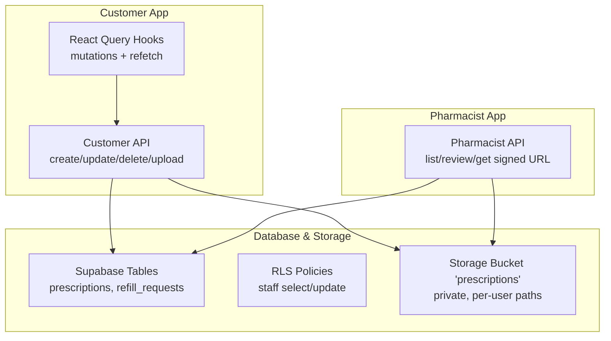
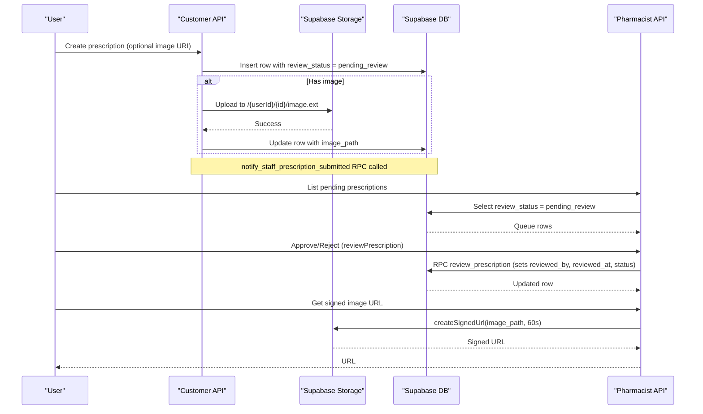
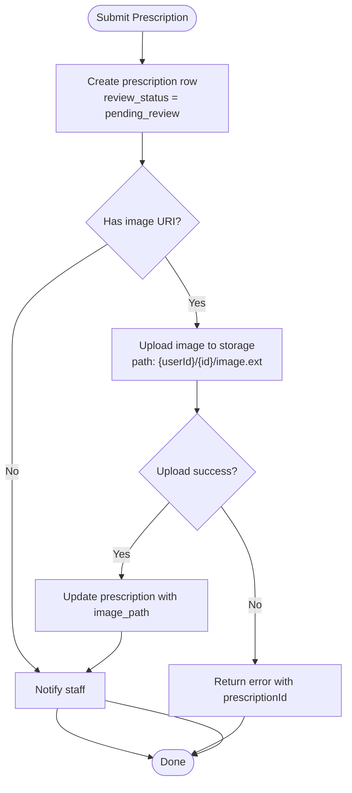
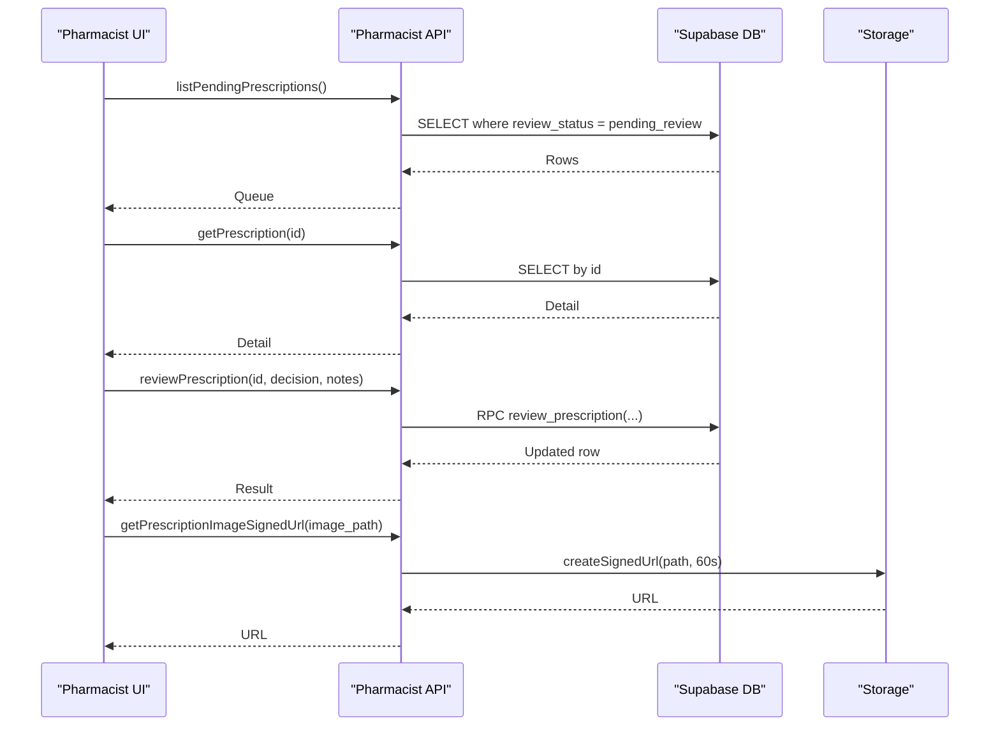
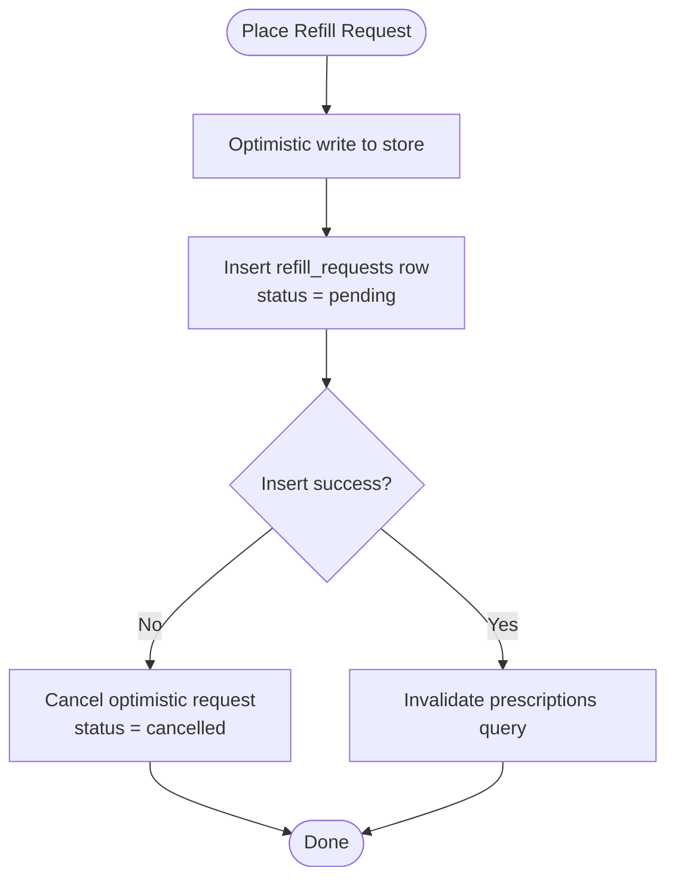
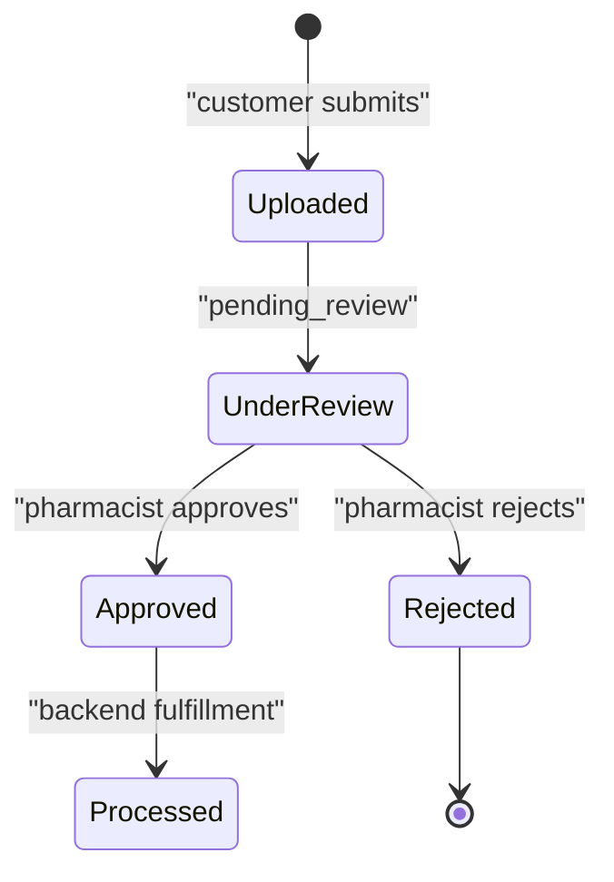
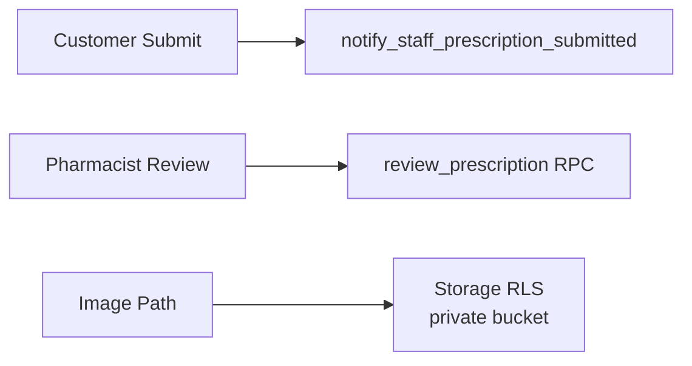
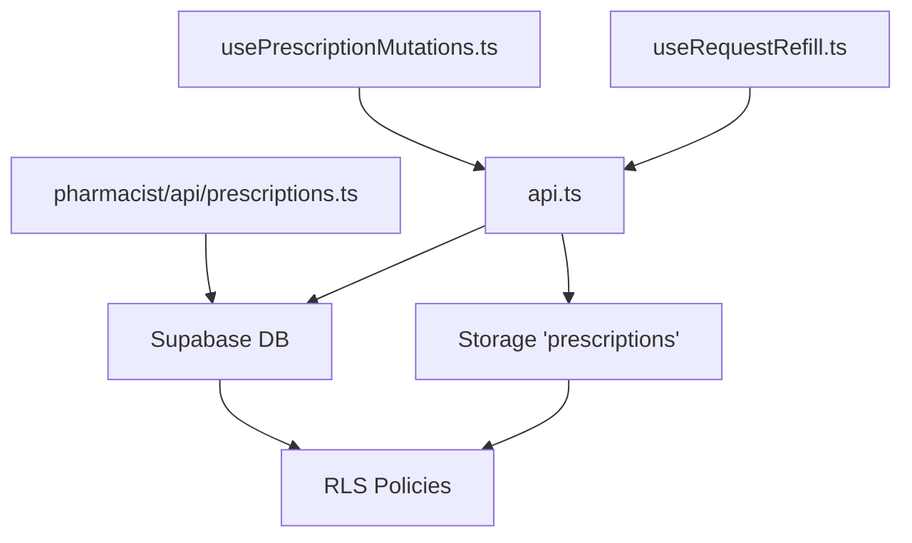

# Prescriptions Module

<cite>
**Referenced Files in This Document**
- [index.ts](file://packages/domain-prescriptions/src/index.ts)
- [api.ts](file://apps/shopper-native/src/features/prescriptions/api.ts)
- [prescriptions.ts](file://apps/shopper-native/src/features/pharmacist/api/prescriptions.ts)
- [usePrescriptionMutations.ts](file://apps/shopper-native/src/features/prescriptions/hooks/usePrescriptionMutations.ts)
- [useRequestRefill.ts](file://apps/shopper-native/src/features/prescriptions/hooks/useRequestRefill.ts)
- [20260705120000_prescriptions_admin_review.sql](file://supabase/migrations/20260705120000_prescriptions_admin_review.sql)
- [20260817100000_prescription_image_upload.sql](file://supabase/migrations/20260817100000_prescription_image_upload.sql)
</cite>

## Table of Contents
1. Introduction
2. Project Structure
3. Core Components
4. Architecture Overview
5. Detailed Component Analysis
6. Dependency Analysis
7. Performance Considerations
8. Troubleshooting Guide
9. Conclusion

## Introduction
This document describes the Prescriptions module end-to-end: how customers submit prescriptions (including image uploads), how pharmacists review and approve or reject them, how refill requests are placed and tracked, and how status management and notifications integrate with inventory and staff workflows. It focuses on the implemented client APIs, database policies, and hooks that power the workflow.

## Project Structure
The Prescriptions feature spans three layers:
- Domain types for workflow steps
- Customer-facing API for creating, updating, and deleting prescriptions and uploading images
- Pharmacist-facing API for reviewing pending prescriptions and generating secure image links
- Database migrations that add review columns, storage bucket policies, and RLS rules

**Diagram sources**
- [api.ts:75-109](file://apps/shopper-native/src/features/prescriptions/api.ts#L75-L109)
- [prescriptions.ts:83-148](file://apps/shopper-native/src/features/pharmacist/api/prescriptions.ts#L83-L148)
- [20260705120000_prescriptions_admin_review.sql:18-93](file://supabase/migrations/20260705120000_prescriptions_admin_review.sql#L18-L93)
- [20260817100000_prescription_image_upload.sql:9-77](file://supabase/migrations/20260817100000_prescription_image_upload.sql#L9-L77)

**Section sources**
- [index.ts:1-7](file://packages/domain-prescriptions/src/index.ts#L1-L7)
- [api.ts:1-193](file://apps/shopper-native/src/features/prescriptions/api.ts#L1-L193)
- [prescriptions.ts:1-175](file://apps/shopper-native/src/features/pharmacist/api/prescriptions.ts#L1-L175)
- [20260705120000_prescriptions_admin_review.sql:1-96](file://supabase/migrations/20260705120000_prescriptions_admin_review.sql#L1-L96)
- [20260817100000_prescription_image_upload.sql:1-78](file://supabase/migrations/20260817100000_prescription_image_upload.sql#L1-L78)

## Core Components
- Prescription lifecycle states: uploaded, under_review, approved, rejected, processed
- Customer submission: create prescription, optional image upload, update to link image, delete
- Pharmacist review: list pending, fetch detail, approve/reject via RPC, generate signed image URLs
- Refill requests: optimistic local request, server insert, refresh to authoritative state
- Security: RLS on tables and storage; staff-only visibility and actions

Key responsibilities:
- api.ts: customer-side CRUD and image upload pipeline
- pharmacist/api/prescriptions.ts: staff-side review queue and actions
- Migrations: schema additions, RLS, storage policies
- Hooks: React Query mutations and optimistic refill flow

**Section sources**
- [index.ts:1-7](file://packages/domain-prescriptions/src/index.ts#L1-L7)
- [api.ts:23-66](file://apps/shopper-native/src/features/prescriptions/api.ts#L23-L66)
- [api.ts:75-109](file://apps/shopper-native/src/features/prescriptions/api.ts#L75-L109)
- [api.ts:158-182](file://apps/shopper-native/src/features/prescriptions/api.ts#L158-L182)
- [prescriptions.ts:83-148](file://apps/shopper-native/src/features/pharmacist/api/prescriptions.ts#L83-L148)
- [useRequestRefill.ts:40-64](file://apps/shopper-native/src/features/prescriptions/hooks/useRequestRefill.ts#L40-L64)
- [20260705120000_prescriptions_admin_review.sql:18-93](file://supabase/migrations/20260705120000_prescriptions_admin_review.sql#L18-L93)
- [20260817100000_prescription_image_upload.sql:9-77](file://supabase/migrations/20260817100000_prescription_image_upload.sql#L9-L77)

## Architecture Overview
The module implements a secure, role-based workflow:
- Customers submit prescriptions into a “pending_review” queue.
- Staff can view only their own submissions as customers, but staff roles see all pending items.
- Pharmacists approve or reject using an RPC that records reviewer identity and timestamps.
- Images are stored in a private bucket with per-user path enforcement and staff read access.
- Refill requests use optimistic UI updates and then reconcile with server state.

**Diagram sources**
- [api.ts:75-109](file://apps/shopper-native/src/features/prescriptions/api.ts#L75-L109)
- [api.ts:158-182](file://apps/shopper-native/src/features/prescriptions/api.ts#L158-L182)
- [prescriptions.ts:83-148](file://apps/shopper-native/src/features/pharmacist/api/prescriptions.ts#L83-L148)
- [prescriptions.ts:165-174](file://apps/shopper-native/src/features/pharmacist/api/prescriptions.ts#L165-L174)
- [20260705120000_prescriptions_admin_review.sql:18-93](file://supabase/migrations/20260705120000_prescriptions_admin_review.sql#L18-L93)
- [20260817100000_prescription_image_upload.sql:9-77](file://supabase/migrations/20260817100000_prescription_image_upload.sql#L9-L77)

## Detailed Component Analysis

### Prescription Submission and Image Handling
- Creates a prescription record with review_status set to pending_review and marks submission source.
- Optional image upload to a private storage bucket with per-user directory scoping.
- If image upload fails, the prescription remains in pending_review without an image path, enabling retry/cleanup.
- Updates prescription with image_path after successful upload.
- Triggers a notification RPC to alert staff of new submissions.

**Diagram sources**
- [api.ts:75-109](file://apps/shopper-native/src/features/prescriptions/api.ts#L75-L109)
- [api.ts:158-182](file://apps/shopper-native/src/features/prescriptions/api.ts#L158-L182)

**Section sources**
- [api.ts:23-66](file://apps/shopper-native/src/features/prescriptions/api.ts#L23-L66)
- [api.ts:75-109](file://apps/shopper-native/src/features/prescriptions/api.ts#L75-L109)
- [api.ts:158-182](file://apps/shopper-native/src/features/prescriptions/api.ts#L158-L182)

### Pharmacist Review Workflow
- Lists pending prescriptions ordered by creation time.
- Fetches single prescription details including customer profile fields joined from profiles.
- Approves or rejects via an RPC that records reviewer identity, timestamp, notes, and rejection reason.
- Generates short-lived signed URLs for viewing prescription images securely.

**Diagram sources**
- [prescriptions.ts:83-148](file://apps/shopper-native/src/features/pharmacist/api/prescriptions.ts#L83-L148)
- [prescriptions.ts:165-174](file://apps/shopper-native/src/features/pharmacist/api/prescriptions.ts#L165-L174)

**Section sources**
- [prescriptions.ts:83-148](file://apps/shopper-native/src/features/pharmacist/api/prescriptions.ts#L83-L148)
- [prescriptions.ts:165-174](file://apps/shopper-native/src/features/pharmacist/api/prescriptions.ts#L165-L174)

### Refill Requests
- Optimistically creates a refill request locally so the UI updates immediately.
- Inserts a refill request row with status pending.
- On failure, cancels the optimistic request by marking it cancelled.
- On success, invalidates queries to refresh from server state.

**Diagram sources**
- [useRequestRefill.ts:40-64](file://apps/shopper-native/src/features/prescriptions/hooks/useRequestRefill.ts#L40-L64)

**Section sources**
- [useRequestRefill.ts:1-76](file://apps/shopper-native/src/features/prescriptions/hooks/useRequestRefill.ts#L1-L76)

### Status Management and History
- New prescriptions enter with review_status = pending_review.
- Staff review sets review_status to approved or rejected, recording reviewer and timestamps.
- Refill requests track lifecycle through status transitions managed by backend processes and staff actions.
- The domain layer defines workflow steps for higher-level orchestration.

**Diagram sources**
- [index.ts:1-7](file://packages/domain-prescriptions/src/index.ts#L1-L7)
- [20260705120000_prescriptions_admin_review.sql:18-41](file://supabase/migrations/20260705120000_prescriptions_admin_review.sql#L18-L41)

**Section sources**
- [index.ts:1-7](file://packages/domain-prescriptions/src/index.ts#L1-L7)
- [20260705120000_prescriptions_admin_review.sql:18-41](file://supabase/migrations/20260705120000_prescriptions_admin_review.sql#L18-L41)

### Notifications and Integration Points
- On prescription submission, a notification RPC is invoked to alert staff.
- Pharmacist review uses an RPC to atomically update review fields and audit metadata.
- Storage policies enforce per-user uploads and staff read access for review.

**Diagram sources**
- [api.ts:101-107](file://apps/shopper-native/src/features/prescriptions/api.ts#L101-L107)
- [prescriptions.ts:135-148](file://apps/shopper-native/src/features/pharmacist/api/prescriptions.ts#L135-L148)
- [20260817100000_prescription_image_upload.sql:21-77](file://supabase/migrations/20260817100000_prescription_image_upload.sql#L21-L77)

**Section sources**
- [api.ts:101-107](file://apps/shopper-native/src/features/prescriptions/api.ts#L101-L107)
- [prescriptions.ts:135-148](file://apps/shopper-native/src/features/pharmacist/api/prescriptions.ts#L135-L148)
- [20260817100000_prescription_image_upload.sql:21-77](file://supabase/migrations/20260817100000_prescription_image_upload.sql#L21-L77)

## Dependency Analysis
- Customer API depends on Supabase client for DB and Storage operations.
- Pharmacist API depends on Supabase client and relies on RLS policies for staff access.
- Migrations define schema changes and security policies that both APIs depend on.
- Hooks depend on React Query for caching and mutation orchestration.

**Diagram sources**
- [usePrescriptionMutations.ts:1-57](file://apps/shopper-native/src/features/prescriptions/hooks/usePrescriptionMutations.ts#L1-L57)
- [useRequestRefill.ts:1-76](file://apps/shopper-native/src/features/prescriptions/hooks/useRequestRefill.ts#L1-L76)
- [api.ts:1-193](file://apps/shopper-native/src/features/prescriptions/api.ts#L1-L193)
- [prescriptions.ts:1-175](file://apps/shopper-native/src/features/pharmacist/api/prescriptions.ts#L1-L175)
- [20260705120000_prescriptions_admin_review.sql:57-93](file://supabase/migrations/20260705120000_prescriptions_admin_review.sql#L57-L93)
- [20260817100000_prescription_image_upload.sql:21-77](file://supabase/migrations/20260817100000_prescription_image_upload.sql#L21-L77)

**Section sources**
- [usePrescriptionMutations.ts:1-57](file://apps/shopper-native/src/features/prescriptions/hooks/usePrescriptionMutations.ts#L1-L57)
- [useRequestRefill.ts:1-76](file://apps/shopper-native/src/features/prescriptions/hooks/useRequestRefill.ts#L1-L76)
- [api.ts:1-193](file://apps/shopper-native/src/features/prescriptions/api.ts#L1-L193)
- [prescriptions.ts:1-175](file://apps/shopper-native/src/features/pharmacist/api/prescriptions.ts#L1-L175)
- [20260705120000_prescriptions_admin_review.sql:57-93](file://supabase/migrations/20260705120000_prescriptions_admin_review.sql#L57-L93)
- [20260817100000_prescription_image_upload.sql:21-77](file://supabase/migrations/20260817100000_prescription_image_upload.sql#L21-L77)

## Performance Considerations
- Use pagination and ordering for large prescription lists to reduce payload size.
- Prefer signed URLs for image viewing to avoid long-lived public links.
- Batch operations where possible and rely on server-side filtering via RLS.
- Avoid redundant refetches; leverage React Query cache invalidation strategically.

[No sources needed since this section provides general guidance]

## Troubleshooting Guide
Common issues and resolutions:
- Image upload failures: The submission returns an error with the prescription ID; the record remains in pending_review without an image path. Retry upload or clean up failed files.
- Staff cannot view prescriptions: Verify user role satisfies RLS policy for staff select/update.
- Signed URL generation errors: Ensure image_path exists and storage policies allow staff read access.
- Refill request rollback: On network failure, the optimistic request is marked cancelled; reattempt placement.

**Section sources**
- [api.ts:158-182](file://apps/shopper-native/src/features/prescriptions/api.ts#L158-L182)
- [prescriptions.ts:165-174](file://apps/shopper-native/src/features/pharmacist/api/prescriptions.ts#L165-L174)
- [20260705120000_prescriptions_admin_review.sql:57-93](file://supabase/migrations/20260705120000_prescriptions_admin_review.sql#L57-L93)
- [useRequestRefill.ts:40-64](file://apps/shopper-native/src/features/prescriptions/hooks/useRequestRefill.ts#L40-L64)

## Conclusion
The Prescriptions module provides a secure, auditable workflow for customer submissions and pharmacist review, with robust image handling and refill request tracking. Role-based access controls ensure data isolation and staff oversight. The design separates concerns across customer and pharmacist APIs, backed by clear database policies and efficient hooks for responsive UX.

[No sources needed since this section summarizes without analyzing specific files]