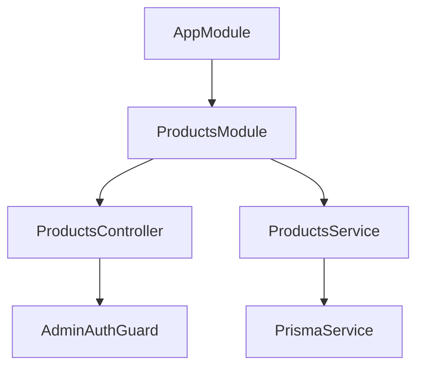
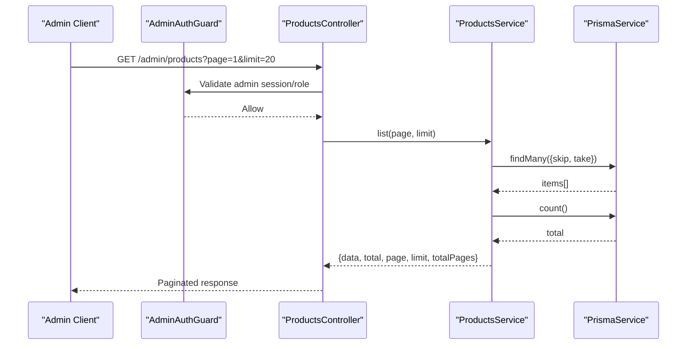
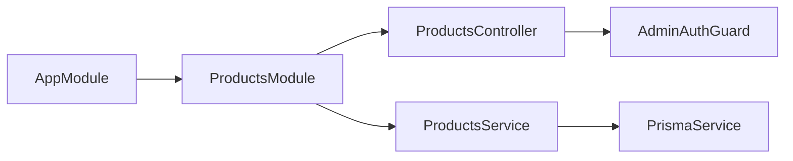

# CRUD Operations

<cite>
**Referenced Files in This Document**
- [products.controller.ts](file://apps/api/src/modules/products/products.controller.ts)
- [products.service.ts](file://apps/api/src/modules/products/products.service.ts)
- [products.module.ts](file://apps/api/src/modules/products/products.module.ts)
- [app.module.ts](file://apps/api/src/app.module.ts)
- [schema.prisma](file://apps/api/prisma/schema.prisma)
- [admin-auth.guard.ts](file://apps/api/src/auth/admin-auth.guard.ts)
</cite>

## Table of Contents
1. Introduction
2. Project Structure
3. Core Components
4. Architecture Overview
5. Detailed Component Analysis
6. Dependency Analysis
7. Performance Considerations
8. Troubleshooting Guide
9. Conclusion

## Introduction
This document describes the product domain as implemented in the API, focusing on available operations and data model. It explains how products are modeled in the database, how they are listed via a protected endpoint, and what is currently missing for full CRUD (create, update, delete). It also outlines recommended request/response schemas, validation rules, and authentication requirements based on existing guards and modules.

## Project Structure
The product feature is implemented under apps/api/src/modules/products with a standard NestJS module structure:
- Controller exposes HTTP endpoints
- Service encapsulates business logic and data access
- Module wires controller, service, Prisma, and Auth dependencies
- The application registers the ProductsModule at the root AppModule

**Diagram sources**
- [app.module.ts:1-30](file://apps/api/src/app.module.ts#L1-L30)
- [products.module.ts:1-14](file://apps/api/src/modules/products/products.module.ts#L1-L14)
- [products.controller.ts:1-15](file://apps/api/src/modules/products/products.controller.ts#L1-L15)
- [products.service.ts:1-27](file://apps/api/src/modules/products/products.service.ts#L1-L27)

**Section sources**
- [app.module.ts:1-30](file://apps/api/src/app.module.ts#L1-L30)
- [products.module.ts:1-14](file://apps/api/src/modules/products/products.module.ts#L1-L14)

## Core Components
- ProductsController: Defines the admin route prefix and lists products with pagination.
- ProductsService: Implements list with skip/take pagination and returns total count and metadata.
- ProductsModule: Registers controller/service and imports Prisma and Auth modules.
- AdminAuthGuard: Protects routes requiring admin privileges.

Key behaviors:
- All product endpoints are guarded by AdminAuthGuard, meaning only authenticated admins can access them.
- Listing supports page and limit query parameters with server-side pagination.

**Section sources**
- [products.controller.ts:1-15](file://apps/api/src/modules/products/products.controller.ts#L1-L15)
- [products.service.ts:1-27](file://apps/api/src/modules/products/products.service.ts#L1-L27)
- [products.module.ts:1-14](file://apps/api/src/modules/products/products.module.ts#L1-L14)
- [admin-auth.guard.ts](file://apps/api/src/auth/admin-auth.guard.ts)

## Architecture Overview
The current implementation provides a read-only, paginated listing of products under an admin-scoped route. Create, update, and delete operations are not yet exposed by controllers.

**Diagram sources**
- [products.controller.ts:5-13](file://apps/api/src/modules/products/products.controller.ts#L5-L13)
- [products.service.ts:8-25](file://apps/api/src/modules/products/products.service.ts#L8-L25)
- [admin-auth.guard.ts](file://apps/api/src/auth/admin-auth.guard.ts)

## Detailed Component Analysis

### Product Data Model
The product entity is defined in the Prisma schema under the public schema. It includes identifiers, names in multiple languages, category fields, pricing, status flags, source attribution, and timestamps. An optional one-to-one inventory record tracks stock levels per product.

- Primary key: id (UUID)
- Names: Name, Name_Ar, Name_En
- Category: Category, Category_Name, Category_Name_En
- Pricing: Price (Decimal)
- Status: is_active (Boolean)
- Source: source (String)
- Timestamps: created_at, updated_at
- Inventory relation: inventory (one-to-one)

Inventory model:
- product_id (PK, FK to products.id)
- on_hand (Integer, default 0)
- reserved (Integer, default 0)

Validation and constraints:
- Database-level types enforce numeric precision for Price and integer ranges for inventory counts.
- Required fields such as Name are enforced by the schema definition.
- Business constraints like availability should be derived from is_active and inventory levels in service logic.

Notes:
- Images are not represented in the current schema; if needed, add an images table or JSON array field.
- Categories are stored as strings; consider normalizing into a categories table for referential integrity.

**Section sources**
- [schema.prisma:595-613](file://apps/api/prisma/schema.prisma#L595-L613)
- [schema.prisma:528-536](file://apps/api/prisma/schema.prisma#L528-L536)

### REST Endpoints

#### List Products (Read)
- Method: GET
- URL: /admin/products
- Query Parameters:
  - page: integer (default 1)
  - limit: integer (default 20)
- Authentication: Admin role required (AdminAuthGuard)
- Success Response (200):
  - data: array of product objects
  - total: number of products
  - page: requested page
  - limit: requested limit
  - totalPages: computed total pages
- Error Responses:
  - 401 Unauthorized: Missing or invalid admin credentials
  - 403 Forbidden: Insufficient permissions
  - 422 Unprocessable Entity: Invalid page/limit values

Example request:
- GET /admin/products?page=1&limit=20

Example response body:
- {
    "data": [...],
    "total": 123,
    "page": 1,
    "limit": 20,
    "totalPages": 7
  }

**Section sources**
- [products.controller.ts:5-13](file://apps/api/src/modules/products/products.controller.ts#L5-L13)
- [products.service.ts:8-25](file://apps/api/src/modules/products/products.service.ts#L8-L25)
- [admin-auth.guard.ts](file://apps/api/src/auth/admin-auth.guard.ts)

#### Create Product (Create)
- Status: Not implemented in the current codebase.
- Recommended endpoint: POST /admin/products
- Authentication: Admin role required
- Request Body (recommended):
  - name: string (required)
  - name_ar: string (optional)
  - name_en: string (optional)
  - category: string (optional)
  - category_name: string (optional)
  - category_name_en: string (optional)
  - price: decimal (optional)
  - is_active: boolean (optional, default true)
  - source: string (optional)
  - images: array of image URLs (optional; requires schema extension)
  - inventory.on_hand: integer (optional; defaults to 0)
  - inventory.reserved: integer (optional; defaults to 0)
- Validation Rules:
  - name must be non-empty
  - price must be a valid decimal >= 0
  - inventory counts must be non-negative integers
- Success Response (201):
  - Created product object including generated id and timestamps
- Error Responses:
  - 400 Bad Request: Validation errors
  - 401/403: Authentication/authorization failures
  - 409 Conflict: Duplicate barcode/code (if enforced)

Implementation notes:
- Add a controller method with a DTO/validation pipe.
- Use Prisma create with transactional write to ensure product and inventory records are consistent.
- If images are supported, handle file uploads and persist references before creating the product.

[No sources needed since this section proposes future functionality]

#### Update Product (Update)
- Status: Not implemented in the current codebase.
- Recommended endpoint: PATCH /admin/products/:id
- Authentication: Admin role required
- Request Body (partial updates allowed):
  - Any subset of product fields listed above
- Validation Rules:
  - Same as create for provided fields
- Success Response (200):
  - Updated product object
- Error Responses:
  - 404 Not Found: Product does not exist
  - 400 Bad Request: Validation errors
  - 401/403: Authentication/authorization failures

Implementation notes:
- Validate input using DTOs.
- Use Prisma update with selective fields.
- Optionally enforce business rules (e.g., disallow negative prices).

[No sources needed since this section proposes future functionality]

#### Delete Product (Delete)
- Status: Not implemented in the current codebase.
- Recommended endpoint: DELETE /admin/products/:id
- Authentication: Admin role required
- Success Response (204 No Content):
  - Deletion confirmed
- Error Responses:
  - 404 Not Found: Product does not exist
  - 401/403: Authentication/authorization failures

Implementation notes:
- Consider soft deletes via a deleted_at flag if historical references are required.
- Ensure related records (e.g., order_items snapshots) remain unaffected.

[No sources needed since this section proposes future functionality]

### Authentication and Authorization
- All product endpoints are protected by AdminAuthGuard, enforcing admin-level access.
- Clients must include a valid admin session/token as configured by the auth module.

**Section sources**
- [products.controller.ts:1-7](file://apps/api/src/modules/products/products.controller.ts#L1-L7)
- [admin-auth.guard.ts](file://apps/api/src/auth/admin-auth.guard.ts)

### Pagination and Querying
- Page-based pagination is implemented with skip and take.
- Response includes total count and computed totalPages for UI navigation.

**Section sources**
- [products.service.ts:8-25](file://apps/api/src/modules/products/products.service.ts#L8-L25)

## Dependency Analysis
The ProductsModule depends on:
- PrismaModule for database access
- AuthModule for admin authorization
- The root AppModule registers the module so routes are mounted

**Diagram sources**
- [app.module.ts:1-30](file://apps/api/src/app.module.ts#L1-L30)
- [products.module.ts:1-14](file://apps/api/src/modules/products/products.module.ts#L1-L14)
- [products.controller.ts:1-15](file://apps/api/src/modules/products/products.controller.ts#L1-L15)
- [products.service.ts:1-27](file://apps/api/src/modules/products/products.service.ts#L1-L27)

**Section sources**
- [app.module.ts:1-30](file://apps/api/src/app.module.ts#L1-L30)
- [products.module.ts:1-14](file://apps/api/src/modules/products/products.module.ts#L1-L14)

## Performance Considerations
- Pagination uses skip/take to avoid loading entire datasets.
- Count and findMany are executed concurrently to minimize latency.
- For large catalogs, consider adding indexes on frequently filtered fields (e.g., category, is_active).
- If implementing search, leverage database full-text or vector search capabilities already present in the repository.

[No sources needed since this section provides general guidance]

## Troubleshooting Guide
Common issues and resolutions:
- 401/403 on product endpoints:
  - Ensure the client has a valid admin session/token.
  - Verify AdminAuthGuard configuration and roles.
- Empty results when listing:
  - Confirm that products exist in the database.
  - Check pagination parameters (page, limit).
- Validation errors on future create/update:
  - Ensure required fields are present and correctly typed.
  - Validate numeric fields (price, inventory counts) against expected ranges.

**Section sources**
- [products.controller.ts:5-13](file://apps/api/src/modules/products/products.controller.ts#L5-L13)
- [products.service.ts:8-25](file://apps/api/src/modules/products/products.service.ts#L8-L25)
- [admin-auth.guard.ts](file://apps/api/src/auth/admin-auth.guard.ts)

## Conclusion
Currently, the API exposes a secure, paginated list of products under an admin route. The product data model supports multilingual names, categories, pricing, activity status, and inventory linkage. Full CRUD operations (create, update, delete) are not yet implemented and should follow the recommended patterns outlined here, leveraging DTOs, validation, and transactions to maintain data integrity.