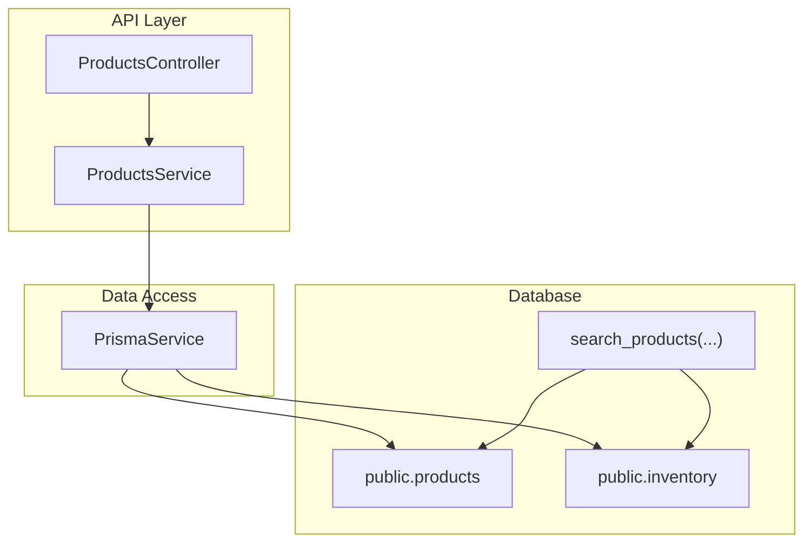
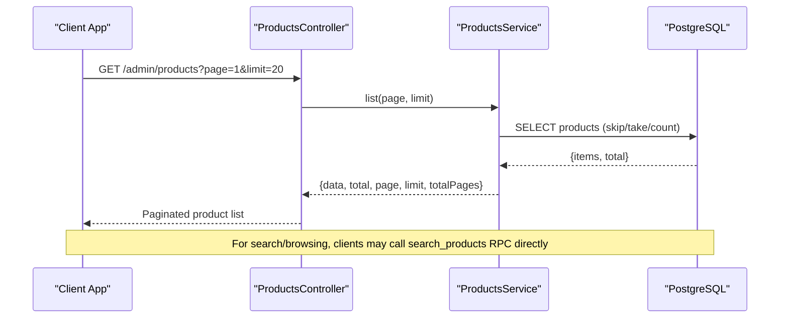
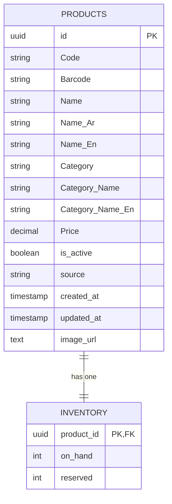
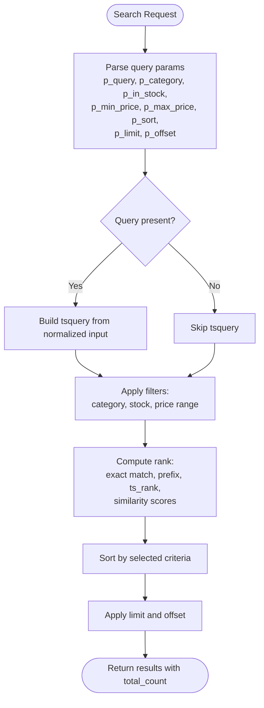
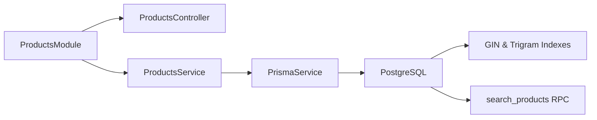

# Products Module

<cite>
**Referenced Files in This Document**
- [products.controller.ts](file://apps/api/src/modules/products/products.controller.ts)
- [products.service.ts](file://apps/api/src/modules/products/products.service.ts)
- [products.module.ts](file://apps/api/src/modules/products/products.module.ts)
- [schema.prisma](file://apps/api/prisma/schema.prisma)
- [20260522_products_search.sql](file://apps/shopper-native/supabase/migrations/20260522_products_search.sql)
- [20260603_products_search_vector.sql](file://database/20260603_products_search_vector.sql)
- [20260530_product_real_fields.sql](file://database/20260530_product_real_fields.sql)
</cite>

## Table of Contents
1. Introduction
2. Project Structure
3. Core Components
4. Architecture Overview
5. Detailed Component Analysis
6. Dependency Analysis
7. Performance Considerations
8. Troubleshooting Guide
9. Conclusion

## Introduction
This document describes the Products module, covering CRUD endpoints, search and filtering (including Arabic language support), category management, inventory integration, data models, validation rules, business logic, and API specifications with request/response examples. The backend is a NestJS module exposing admin product listing, while advanced search, ranking, and filtering are implemented as PostgreSQL functions using full-text search and trigram indexes. Inventory is modeled as a one-to-one relation to products.

## Project Structure
The Products module is organized as a typical NestJS feature module:
- Controller exposes HTTP endpoints under an admin route guarded by an admin auth guard.
- Service encapsulates data access via Prisma.
- Database schema defines the products table and its relationship to inventory.
- Search and filtering are provided by database-level SQL migrations that add a tsvector column, triggers, GIN indexes, and a search RPC function.

**Diagram sources**
- [products.controller.ts:5-13](file://apps/api/src/modules/products/products.controller.ts#L5-L13)
- [products.service.ts:8-25](file://apps/api/src/modules/products/products.service.ts#L8-L25)
- [schema.prisma:595-613](file://apps/api/prisma/schema.prisma#L595-L613)
- [schema.prisma:529-536](file://apps/api/prisma/schema.prisma#L529-L536)
- [20260522_products_search.sql:122-244](file://apps/shopper-native/supabase/migrations/20260522_products_search.sql#L122-L244)

**Section sources**
- [products.controller.ts:1-15](file://apps/api/src/modules/products/products.controller.ts#L1-L15)
- [products.service.ts:1-27](file://apps/api/src/modules/products/products.service.ts#L1-L27)
- [products.module.ts:1-14](file://apps/api/src/modules/products/products.module.ts#L1-L14)
- [schema.prisma:595-613](file://apps/api/prisma/schema.prisma#L595-L613)
- [schema.prisma:529-536](file://apps/api/prisma/schema.prisma#L529-L536)
- [20260522_products_search.sql:1-288](file://apps/shopper-native/supabase/migrations/20260522_products_search.sql#L1-L288)

## Core Components
- ProductsController: Exposes GET /admin/products with pagination query parameters page and limit. Protected by AdminAuthGuard.
- ProductsService: Implements list(page, limit) using Prisma to fetch paginated products and total count. Returns data, total, page, limit, totalPages.
- Data Models:
  - products: id, Code, Barcode, Name, Name_Ar, Name_En, Category, Category_Name, Category_Name_En, Price, is_active, source, timestamps, optional image_url, and a relation to inventory.
  - inventory: product_id (PK), on_hand, reserved; linked to products.
- Search & Filtering: Provided by search_products RPC which supports:
  - Full-text search across Name, Name_Ar, Name_En, Code, Barcode, Category fields.
  - Trigram-based fuzzy matching for typos.
  - Filters: category, in_stock, min_price, max_price.
  - Sorting: relevance, price_asc, price_desc, name_asc, newest.
  - Pagination: limit and offset with capped limits.
  - Ranking includes exact code/barcode match boost, prefix matches, ts_rank, and similarity scores.
- Additional Product Fields: Migration adds rating_avg, rating_count, discount_percent, is_new, is_bestseller, is_sale with partial indexes for common queries.

**Section sources**
- [products.controller.ts:5-13](file://apps/api/src/modules/products/products.controller.ts#L5-L13)
- [products.service.ts:8-25](file://apps/api/src/modules/products/products.service.ts#L8-L25)
- [schema.prisma:595-613](file://apps/api/prisma/schema.prisma#L595-L613)
- [schema.prisma:529-536](file://apps/api/prisma/schema.prisma#L529-L536)
- [20260522_products_search.sql:122-244](file://apps/shopper-native/supabase/migrations/20260522_products_search.sql#L122-L244)
- [20260530_product_real_fields.sql:10-35](file://database/20260530_product_real_fields.sql#L10-L35)

## Architecture Overview
The system combines a NestJS admin API for product listing with a robust Postgres-backed search layer. The controller delegates to the service, which uses Prisma for basic listing. For advanced search and browsing, clients call the search_products RPC directly against the database, leveraging tsvector full-text search and trigram indexes for performance and bilingual support.

**Diagram sources**
- [products.controller.ts:5-13](file://apps/api/src/modules/products/products.controller.ts#L5-L13)
- [products.service.ts:8-25](file://apps/api/src/modules/products/products.service.ts#L8-L25)
- [20260522_products_search.sql:122-244](file://apps/shopper-native/supabase/migrations/20260522_products_search.sql#L122-L244)

## Detailed Component Analysis

### ProductsController
- Route: GET /admin/products
- Query Parameters:
  - page: integer, default 1
  - limit: integer, default 20
- Behavior:
  - Validates and passes page/limit to service.
  - Response includes data array, total count, current page, limit, and totalPages.
- Security:
  - Guarded by AdminAuthGuard to restrict to admin users.

Request Example
- Method: GET
- URL: /admin/products?page=1&limit=20
- Headers: Authorization (Bearer token with admin role)

Response Example
- Status: 200 OK
- Body:
  - data: array of product objects
  - total: number
  - page: number
  - limit: number
  - totalPages: number

**Section sources**
- [products.controller.ts:5-13](file://apps/api/src/modules/products/products.controller.ts#L5-L13)
- [products.service.ts:8-25](file://apps/api/src/modules/products/products.service.ts#L8-L25)

### ProductsService
- list(page, limit):
  - Computes skip from page and limit.
  - Executes findMany with skip/take and count concurrently.
  - Returns structured response with pagination metadata.

Complexity
- Time: O(k + n) where k is limit and n is total rows for count; optimized by database indexing.
- Space: O(k) for returned items.

**Section sources**
- [products.service.ts:8-25](file://apps/api/src/modules/products/products.service.ts#L8-L25)

### Data Models and Relationships
- products:
  - Primary key: id
  - Identifiers: Code, Barcode
  - Names: Name, Name_Ar, Name_En
  - Categorization: Category, Category_Name, Category_Name_En
  - Pricing: Price
  - Visibility: is_active
  - Source: source
  - Timestamps: created_at, updated_at
  - Optional: image_url
  - Relation: inventory (one-to-one)
- inventory:
  - product_id: PK referencing products.id
  - on_hand: available stock
  - reserved: allocated stock

**Diagram sources**
- [schema.prisma:595-613](file://apps/api/prisma/schema.prisma#L595-L613)
- [schema.prisma:529-536](file://apps/api/prisma/schema.prisma#L529-L536)

**Section sources**
- [schema.prisma:595-613](file://apps/api/prisma/schema.prisma#L595-L613)
- [schema.prisma:529-536](file://apps/api/prisma/schema.prisma#L529-L536)

### Search Functionality and Filtering
- Full-text search:
  - Uses tsvector generated or maintained via trigger combining Name, Name_Ar, Name_En, Code, Barcode, Category fields.
  - GIN index on search_vector enables fast @@ lookups.
- Fuzzy matching:
  - pg_trgm provides similarity() and % operator for typo tolerance.
- Bilingual support:
  - 'simple' tokenizer used for both Arabic and English; unaccent applied to normalize input.
- Filters:
  - p_category: exact match on Category_Name
  - p_in_stock: filter by Stock > 0
  - p_min_price, p_max_price: numeric range
- Sorting:
  - relevance, price_asc, price_desc, name_asc, newest
- Pagination:
  - p_limit capped between 1 and 100
  - p_offset non-negative
- Ranking:
  - Exact code/barcode match boost
  - Prefix matches on names
  - ts_rank(tsvector, tsquery)
  - Similarity scores for names, code, barcode

**Diagram sources**
- [20260522_products_search.sql:122-244](file://apps/shopper-native/supabase/migrations/20260522_products_search.sql#L122-L244)

**Section sources**
- [20260522_products_search.sql:21-113](file://apps/shopper-native/supabase/migrations/20260522_products_search.sql#L21-L113)
- [20260522_products_search.sql:122-244](file://apps/shopper-native/supabase/migrations/20260522_products_search.sql#L122-L244)
- [20260603_products_search_vector.sql:22-44](file://database/20260603_products_search_vector.sql#L22-L44)

### Category Management and Browsing
- Categories are represented by Category, Category_Name, and Category_Name_En fields.
- Browsing by category:
  - Use search_products with p_category set to the desired category name.
  - Combine with sorting options like newest or price ranges.
- Indexes:
  - Compound indexes on Category_Name and Price, and Category_Name and id desc for efficient category browsing and sorting.

Example Usage
- To browse products in a category sorted by newest:
  - Call search_products with p_category="Electronics", p_sort="newest", p_limit=24, p_offset=0.

**Section sources**
- [20260522_products_search.sql:89-99](file://apps/shopper-native/supabase/migrations/20260522_products_search.sql#L89-L99)
- [20260522_products_search.sql:122-244](file://apps/shopper-native/supabase/migrations/20260522_products_search.sql#L122-L244)

### Inventory Integration
- Inventory model tracks on_hand and reserved per product.
- Stock availability:
  - In-stock filter uses Stock > 0; ensure Stock field exists or map to inventory.on_hand in your application layer if needed.
- Synchronization considerations:
  - When updating inventory, ensure consistency with product visibility (is_active) and search results.
  - Consider background jobs to reconcile inventory changes and update search indices if using custom logic beyond the RPC.

Validation Rules
- Ensure on_hand and reserved are non-negative.
- Prevent reserved > on_hand to avoid overselling.

**Section sources**
- [schema.prisma:529-536](file://apps/api/prisma/schema.prisma#L529-L536)
- [20260522_products_search.sql:193-197](file://apps/shopper-native/supabase/migrations/20260522_products_search.sql#L193-L197)

### Business Logic and Validation
- Product creation/update:
  - Validate required fields such as Name, Price, and categorization fields.
  - Normalize inputs (trim, case handling) before persisting.
  - Maintain search_vector via trigger or generated column.
- Deactivation:
  - Set is_active=false to hide from search and listings without deleting records.
- Ratings and promotions:
  - Use rating_avg, rating_count, discount_percent, and badge flags (is_new, is_bestseller, is_sale) for display and filtering enhancements.

**Section sources**
- [20260530_product_real_fields.sql:10-35](file://database/20260530_product_real_fields.sql#L10-L35)
- [20260522_products_search.sql:29-56](file://apps/shopper-native/supabase/migrations/20260522_products_search.sql#L29-L56)
- [20260603_products_search_vector.sql:22-44](file://database/20260603_products_search_vector.sql#L22-L44)

### API Endpoint Specifications

#### List Products (Admin)
- Endpoint: GET /admin/products
- Query Parameters:
  - page: integer, default 1
  - limit: integer, default 20
- Authentication: Admin role required
- Response:
  - data: array of product objects
  - total: number
  - page: number
  - limit: number
  - totalPages: number

Request Example
- GET /admin/products?page=1&limit=20
- Headers: Authorization: Bearer <token>

Response Example
- 200 OK
- {
  "data": [...],
  "total": 1234,
  "page": 1,
  "limit": 20,
  "totalPages": 62
}

**Section sources**
- [products.controller.ts:5-13](file://apps/api/src/modules/products/products.controller.ts#L5-L13)
- [products.service.ts:8-25](file://apps/api/src/modules/products/products.service.ts#L8-L25)

#### Search and Browse Products (RPC)
- Function: public.search_products(p_query, p_category, p_in_stock, p_min_price, p_max_price, p_sort, p_limit, p_offset)
- Parameters:
  - p_query: text, optional
  - p_category: text, optional
  - p_in_stock: boolean, default false
  - p_min_price: numeric, optional
  - p_max_price: numeric, optional
  - p_sort: text, default 'relevance'; allowed: relevance, price_asc, price_desc, name_asc, newest
  - p_limit: int, default 24, capped 1..100
  - p_offset: int, default 0
- Returns:
  - id, code, barcode, name_ar, name_en, price, stock, category_name, category_name_en, image_url, rank, total_count

Request Example
- Call search_products with:
  - p_query="aspirin", p_category="Pharmacy", p_in_stock=true, p_min_price=5, p_max_price=50, p_sort="price_asc", p_limit=24, p_offset=0

Response Example
- Array of product objects including rank and total_count indicating result set size.

**Section sources**
- [20260522_products_search.sql:122-244](file://apps/shopper-native/supabase/migrations/20260522_products_search.sql#L122-L244)

## Dependency Analysis
- NestJS Module Dependencies:
  - ProductsModule imports PrismaModule and AuthModule.
  - Controller depends on ProductsService.
  - Service depends on PrismaService for data access.
- Database Dependencies:
  - search_products relies on extensions pg_trgm and unaccent.
  - Uses GIN indexes on search_vector and trigram indexes on name/code/barcode columns.
  - Relies on products and inventory tables.

**Diagram sources**
- [products.module.ts:7-12](file://apps/api/src/modules/products/products.module.ts#L7-L12)
- [20260522_products_search.sql:21-23](file://apps/shopper-native/supabase/migrations/20260522_products_search.sql#L21-L23)
- [20260522_products_search.sql:71-113](file://apps/shopper-native/supabase/migrations/20260522_products_search.sql#L71-L113)

**Section sources**
- [products.module.ts:1-14](file://apps/api/src/modules/products/products.module.ts#L1-L14)
- [20260522_products_search.sql:21-113](file://apps/shopper-native/supabase/migrations/20260522_products_search.sql#L21-L113)

## Performance Considerations
- Use search_products for complex queries to leverage server-side ranking and filtering.
- Ensure indexes exist:
  - GIN on search_vector
  - Trigram GIN on Name, Name_Ar, Name_En, Code, Barcode
  - Compound indexes on Category_Name with Price and id desc
- Cap p_limit to avoid large result sets; use pagination with p_offset.
- Prefer is_active filters to reduce scan size.
- Monitor query plans for search_products under load; consider tuning pg_trgm.similarity_threshold if needed.

[No sources needed since this section provides general guidance]

## Troubleshooting Guide
Common Issues:
- Missing search_vector column:
  - Symptom: search_products fails at compile-time.
  - Resolution: Run migration to add generated search_vector and create GIN index.
- Slow searches:
  - Check if pg_trgm and unaccent extensions are enabled.
  - Verify trigram indexes exist on relevant columns.
- Incorrect Arabic results:
  - Ensure 'simple' tokenizer is used and unaccent applied to normalize input.
- Out-of-stock products appearing:
  - Confirm p_in_stock filter is set when needed and Stock field reflects inventory accurately.

**Section sources**
- [20260603_products_search_vector.sql:22-44](file://database/20260603_products_search_vector.sql#L22-L44)
- [20260522_products_search.sql:21-23](file://apps/shopper-native/supabase/migrations/20260522_products_search.sql#L21-L23)
- [20260522_products_search.sql:71-113](file://apps/shopper-native/supabase/migrations/20260522_products_search.sql#L71-L113)
- [20260522_products_search.sql:193-197](file://apps/shopper-native/supabase/migrations/20260522_products_search.sql#L193-L197)

## Conclusion
The Products module provides a solid foundation for product management with a NestJS admin endpoint for listing and a powerful PostgreSQL-backed search and filtering system. It supports bilingual content, fuzzy matching, category-based browsing, and integrates with inventory for stock-aware results. By following the recommended validations, indexes, and usage patterns, you can achieve responsive and accurate product discovery experiences.

[No sources needed since this section summarizes without analyzing specific files]