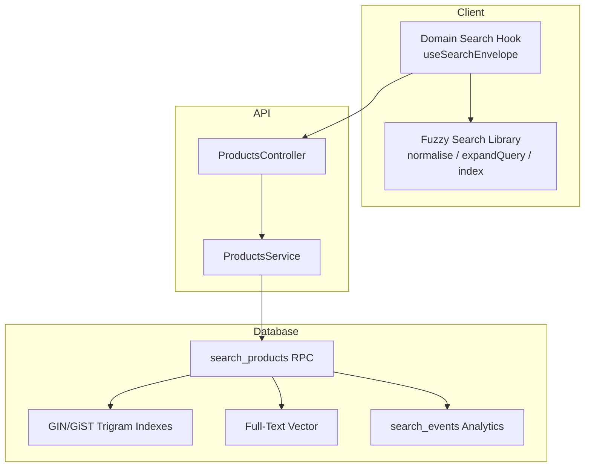
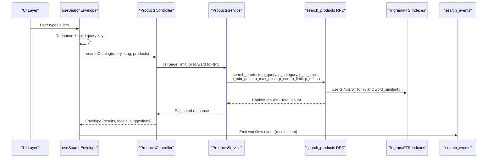
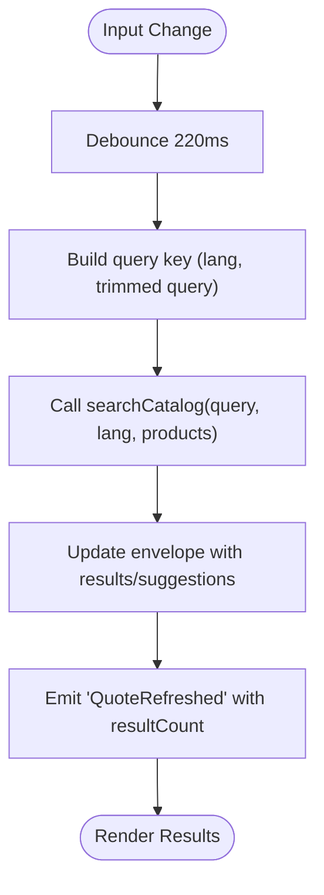
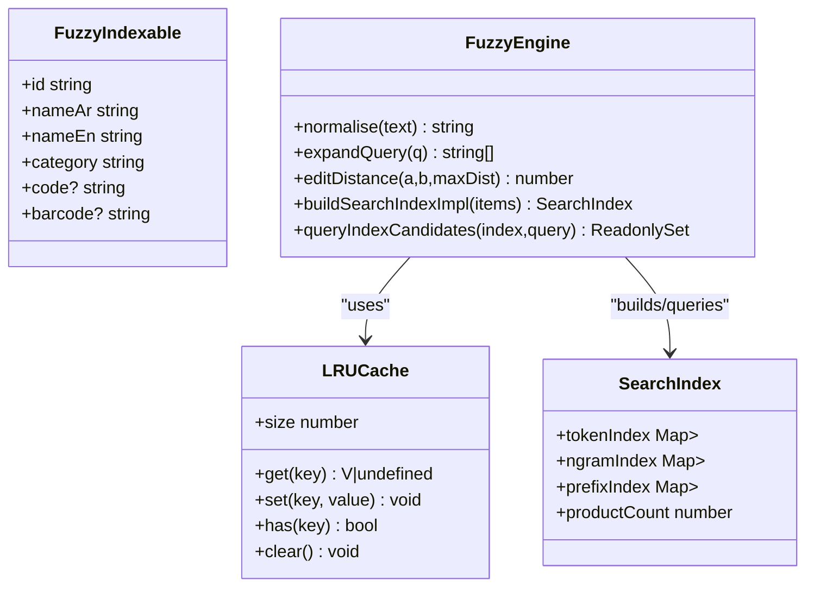
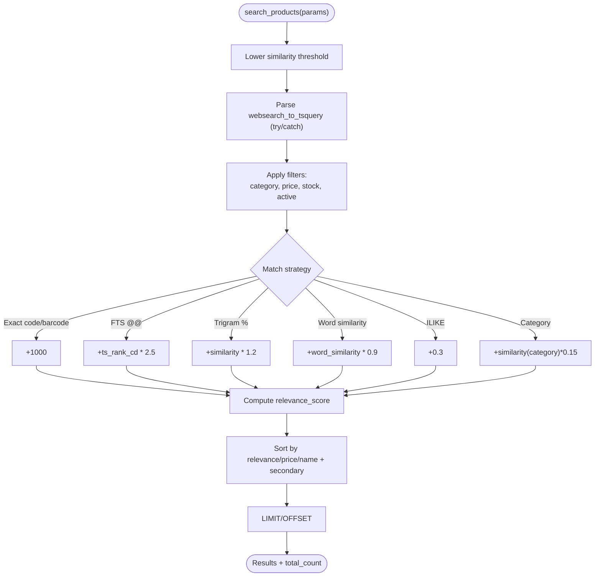
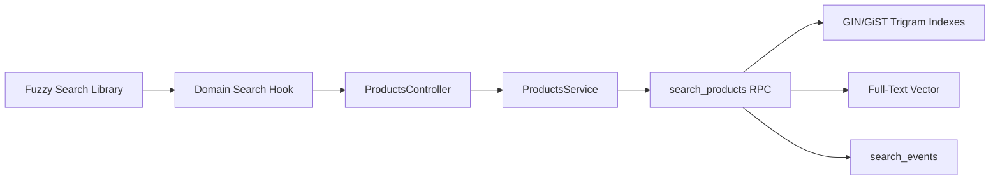

# Search & Filtering

<cite>
**Referenced Files in This Document**
- [20260601_search_analytics.sql](file://database/20260601_search_analytics.sql)
- [20260603_products_search_vector.sql](file://database/20260603_products_search_vector.sql)
- [20260604_search_products_resilient.sql](file://database/20260604_search_products_resilient.sql)
- [index.ts (domain-search)](file://packages/domain-search/src/index.ts)
- [index.ts (fuzzy-search)](file://packages/fuzzy-search/src/index.ts)
- [products.controller.ts](file://apps/api/src/modules/products/products.controller.ts)
- [products.service.ts](file://apps/api/src/modules/products/products.service.ts)
- [searchSuggestions.ts](file://apps/shopper-web/src/services/searchSuggestions.ts)
</cite>

## Table of Contents
1. Introduction
2. Project Structure
3. Core Components
4. Architecture Overview
5. Detailed Component Analysis
6. Dependency Analysis
7. Performance Considerations
8. Troubleshooting Guide
9. Conclusion
10. Appendices

## Introduction
This document explains the product search and filtering system with a focus on full-text search, Arabic language support, fuzzy matching, relevance scoring, filters, sorting, pagination, analytics, and performance optimizations. It covers both client-side indexing and server-side PostgreSQL-based search to deliver fast, accurate results for bilingual queries.

## Project Structure
The search capability spans multiple layers:
- Client-side domain layer provides debounced search state and envelope handling.
- A dedicated fuzzy-search library implements Arabic normalization, bilingual dictionary expansion, token/n-gram indexes, and edit-distance scoring.
- The API exposes endpoints for catalog browsing and integrates with database RPCs for advanced search.
- PostgreSQL migrations implement full-text search vectors, trigram indexes, and a unified search function with composite relevance scoring and analytics.

**Diagram sources**
- [index.ts (domain-search):38-89](file://packages/domain-search/src/index.ts#L38-L89)
- [index.ts (fuzzy-search):106-141](file://packages/fuzzy-search/src/index.ts#L106-L141)
- [products.controller.ts:5-13](file://apps/api/src/modules/products/products.controller.ts#L5-L13)
- [products.service.ts:8-25](file://apps/api/src/modules/products/products.service.ts#L8-L25)
- [20260601_search_analytics.sql:185-324](file://database/20260601_search_analytics.sql#L185-L324)
- [20260603_products_search_vector.sql:24-39](file://database/20260603_products_search_vector.sql#L24-L39)

**Section sources**
- [index.ts (domain-search):38-89](file://packages/domain-search/src/index.ts#L38-L89)
- [index.ts (fuzzy-search):106-141](file://packages/fuzzy-search/src/index.ts#L106-L141)
- [products.controller.ts:5-13](file://apps/api/src/modules/products/products.controller.ts#L5-L13)
- [products.service.ts:8-25](file://apps/api/src/modules/products/products.service.ts#L8-L25)
- [20260601_search_analytics.sql:185-324](file://database/20260601_search_analytics.sql#L185-L324)
- [20260603_products_search_vector.sql:24-39](file://database/20260603_products_search_vector.sql#L24-L39)

## Core Components
- Domain search hook: Debounces user input, builds query keys by language, calls the API client’s searchCatalog, and emits workflow events with result counts.
- Fuzzy search library: Normalizes Arabic and English text, expands queries via a bilingual pharmaceutical dictionary, builds inverted and n-gram indexes, and computes edit distances for typo tolerance.
- Database search RPC: Unified search function combining full-text search, trigram similarity, word similarity, ILIKE fallback, category/price/stock filters, sorting, and pagination; logs analytics events.

Key responsibilities:
- Full-text search with Arabic normalization and bilingual expansion.
- Fuzzy matching with Levenshtein distance and bigram similarity.
- Relevance scoring that prioritizes exact code/barcode matches, full-text cover density, whole-string and partial trigram matches, ILIKE substring matches, and category soft boosts.
- Filters: category, price range, availability status.
- Sorting: relevance, price ascending/descending, name ascending.
- Pagination: limit and offset.
- Analytics: log search events and retrieve popular searches.

**Section sources**
- [index.ts (domain-search):38-89](file://packages/domain-search/src/index.ts#L38-L89)
- [index.ts (fuzzy-search):106-141](file://packages/fuzzy-search/src/index.ts#L106-L141)
- [20260601_search_analytics.sql:185-324](file://database/20260601_search_analytics.sql#L185-L324)
- [20260604_search_products_resilient.sql:39-214](file://database/20260604_search_products_resilient.sql#L39-L214)

## Architecture Overview
The search flow starts at the client with debounced input, leverages local fuzzy logic for suggestions and candidate narrowing, then delegates to the server’s PostgreSQL RPC for authoritative ranking and filtering.

**Diagram sources**
- [index.ts (domain-search):38-89](file://packages/domain-search/src/index.ts#L38-L89)
- [products.controller.ts:5-13](file://apps/api/src/modules/products/products.controller.ts#L5-L13)
- [products.service.ts:8-25](file://apps/api/src/modules/products/products.service.ts#L8-L25)
- [20260601_search_analytics.sql:185-324](file://database/20260601_search_analytics.sql#L185-L324)

## Detailed Component Analysis

### Client-Side Search State and Envelope
- Debounces user input to reduce network calls.
- Builds stable query keys per language to enable caching.
- Calls the API client’s searchCatalog and returns an envelope containing results, suggestions, collections, facets, and timestamps.
- Emits workflow events with source, query, and result count for analytics.

**Diagram sources**
- [index.ts (domain-search):38-89](file://packages/domain-search/src/index.ts#L38-L89)

**Section sources**
- [index.ts (domain-search):38-89](file://packages/domain-search/src/index.ts#L38-L89)

### Fuzzy Search Library (Arabic Support and Bilingual Expansion)
- Normalization removes diacritics, unifies hamza variants, converts taa marbuta and alef maqsura, strips tatweel, lowercases, and cleans punctuation.
- Bilingual dictionary maps normalized Arabic terms to English equivalents and vice versa, enabling cross-script discovery.
- Query expansion adds synonyms from the dictionary and individual tokens to broaden matches.
- Edit distance uses Levenshtein with early exit thresholds for typo tolerance.
- Inverted index and 3-char n-gram prefix trie accelerate candidate retrieval.

**Diagram sources**
- [index.ts (fuzzy-search):47-69](file://packages/fuzzy-search/src/index.ts#L47-L69)
- [index.ts (fuzzy-search):75-100](file://packages/fuzzy-search/src/index.ts#L75-L100)
- [index.ts (fuzzy-search):106-141](file://packages/fuzzy-search/src/index.ts#L106-L141)
- [index.ts (fuzzy-search):747-768](file://packages/fuzzy-search/src/index.ts#L747-L768)
- [index.ts (fuzzy-search):782-800](file://packages/fuzzy-search/src/index.ts#L782-L800)

**Section sources**
- [index.ts (fuzzy-search):106-141](file://packages/fuzzy-search/src/index.ts#L106-L141)
- [index.ts (fuzzy-search):747-768](file://packages/fuzzy-search/src/index.ts#L747-L768)
- [index.ts (fuzzy-search):782-800](file://packages/fuzzy-search/src/index.ts#L782-L800)

### Database Search RPC and Relevance Scoring
- Parameters: query, category, in-stock filter, min/max price, sort, limit, offset.
- Filters:
  - Category equality.
  - Price range.
  - Availability: active and stock > 0 when requested.
- Matching strategies (with weights):
  - Exact code/barcode match (highest priority).
  - Full-text cover density using ts_rank_cd.
  - Whole-string trigram similarity.
  - Word/partial trigram similarity for live typing.
  - ILIKE substring fallback for edge cases.
  - Category soft boost.
- Sorting:
  - Relevance (default for keyword searches).
  - Price ascending/descending.
  - Name ascending.
  - Secondary: in-stock first, then alphabetical by English name.
- Pagination: LIMIT and OFFSET.
- Analytics:
  - Log search events with query, result count, and source.
  - Retrieve popular searches over a time window.

**Diagram sources**
- [20260604_search_products_resilient.sql:39-214](file://database/20260604_search_products_resilient.sql#L39-L214)
- [20260601_search_analytics.sql:185-324](file://database/20260601_search_analytics.sql#L185-L324)

**Section sources**
- [20260601_search_analytics.sql:185-324](file://database/20260601_search_analytics.sql#L185-L324)
- [20260604_search_products_resilient.sql:39-214](file://database/20260604_search_products_resilient.sql#L39-L214)

### API Layer and Pagination
- Controller exposes a paginated list endpoint with page and limit parameters.
- Service performs skip/take pagination and returns data, total, page, limit, and totalPages.

```mermaid
sequenceDiagram
participant Client as "Caller"
participant Ctrl as "ProductsController"
participant Svc as "ProductsService"
Client->>Ctrl : GET /admin/products?page=1&limit=20
Ctrl->>Svc : list(page, limit)
Svc->>Svc : skip = (page-1)*limit
Svc->>Svc : findMany(skip, take)
Svc->>Svc : count()
Svc-->>Ctrl : {data, total, page, limit, totalPages}
Ctrl-->>Client : JSON response
```

**Diagram sources**
- [products.controller.ts:5-13](file://apps/api/src/modules/products/products.controller.ts#L5-L13)
- [products.service.ts:8-25](file://apps/api/src/modules/products/products.service.ts#L8-L25)

**Section sources**
- [products.controller.ts:5-13](file://apps/api/src/modules/products/products.controller.ts#L5-L13)
- [products.service.ts:8-25](file://apps/api/src/modules/products/products.service.ts#L8-L25)

### Search Suggestions
- Web service provides search suggestions integration point for the shopper interface.

**Section sources**
- [searchSuggestions.ts](file://apps/shopper-web/src/services/searchSuggestions.ts)

## Dependency Analysis
- Client dependencies:
  - Domain search hook depends on API client and core query keys.
  - Fuzzy search library is independent and reusable across clients.
- Server dependencies:
  - Controller depends on ProductsService.
  - Service depends on Prisma for basic listing; advanced search uses PostgreSQL RPC.
- Database dependencies:
  - search_products relies on pg_trgm extensions, GIN/GiST trigram indexes, and optional full-text vector column.
  - Analytics depend on search_events table and helper functions.

**Diagram sources**
- [index.ts (domain-search):38-89](file://packages/domain-search/src/index.ts#L38-L89)
- [products.controller.ts:5-13](file://apps/api/src/modules/products/products.controller.ts#L5-L13)
- [products.service.ts:8-25](file://apps/api/src/modules/products/products.service.ts#L8-L25)
- [20260601_search_analytics.sql:185-324](file://database/20260601_search_analytics.sql#L185-L324)

**Section sources**
- [index.ts (domain-search):38-89](file://packages/domain-search/src/index.ts#L38-L89)
- [products.controller.ts:5-13](file://apps/api/src/modules/products/products.controller.ts#L5-L13)
- [products.service.ts:8-25](file://apps/api/src/modules/products/products.service.ts#L8-L25)
- [20260601_search_analytics.sql:185-324](file://database/20260601_search_analytics.sql#L185-L324)

## Performance Considerations
- Indexing:
  - GIN trigram indexes on Name_Ar, Name_En, Code, Barcode accelerate substring and whole-string matching.
  - GiST trigram indexes on Name_Ar, Name_En accelerate word_similarity for partial matches during live typing.
  - Optional generated tsvector column with GIN index improves full-text @@ lookups.
- Query optimization:
  - Lowered similarity threshold for short Arabic terms.
  - Pre-parsed tsquery with exception handling prevents crashes on malformed input.
  - Composite relevance scoring balances multiple strategies without dominating any single one.
- Caching:
  - LRU caches in fuzzy search for normalization and hot paths.
  - Client-side debouncing reduces request frequency.
- Pagination:
  - Server-side LIMIT/OFFSET ensures bounded result sets.
- Analytics:
  - Partial indexes on search_events optimize trending queries and user history.

[No sources needed since this section provides general guidance]

## Troubleshooting Guide
Common issues and resolutions:
- Missing search_vector column:
  - The resilient version of search_products avoids dependency on the generated column by computing tsvector inline. Ensure migrations are applied in order or use the resilient function.
- Malformed query strings:
  - The RPC wraps tsquery parsing in try/catch to fall back to trigram-only matching if parsing fails.
- Slow searches:
  - Verify GIN/GiST trigram indexes exist and are up to date.
  - Confirm pg_trgm extension is enabled.
- No results for short queries:
  - Adjust similarity threshold or rely on ILIKE fallback already built into the RPC.
- Analytics not recording:
  - Ensure RLS policies allow inserts and that the log_search_event function is callable by the current role.

**Section sources**
- [20260604_search_products_resilient.sql:39-214](file://database/20260604_search_products_resilient.sql#L39-L214)
- [20260601_search_analytics.sql:185-324](file://database/20260601_search_analytics.sql#L185-L324)

## Conclusion
The search and filtering system combines robust client-side fuzzy logic with powerful PostgreSQL full-text and trigram capabilities to deliver fast, accurate, bilingual product search. It supports comprehensive filters, flexible sorting, reliable pagination, and analytics for continuous improvement. Proper indexing and resilient SQL ensure consistent performance and stability under varied query conditions.

[No sources needed since this section summarizes without analyzing specific files]

## Appendices

### Search Parameters Reference
- Keywords: free-text query used across FTS, trigram, and ILIKE strategies.
- Category: exact match against Category_Name.
- Price Range: min and max bounds applied to Price.
- Availability Status: in-stock filter combined with is_active and Stock > 0.
- Sorting: relevance, price_asc, price_desc, name_asc; secondary sorts prioritize in-stock items and English name.
- Pagination: limit and offset for result slicing.

**Section sources**
- [20260601_search_analytics.sql:185-324](file://database/20260601_search_analytics.sql#L185-L324)
- [20260604_search_products_resilient.sql:39-214](file://database/20260604_search_products_resilient.sql#L39-L214)

### Example Complex Queries
- Find painkillers in stock within a price range, sorted by relevance:
  - Query: “painkiller”
  - Category: null
  - In-stock: true
  - Min price: set as needed
  - Max price: set as needed
  - Sort: relevance
  - Limit/Offset: paginate results
- Browse a category with no keywords but apply price and stock filters:
  - Query: null or empty
  - Category: target category
  - In-stock: true/false
  - Price range: set bounds
  - Sort: newest or name
  - Limit/Offset: paginate results

[No sources needed since this section provides conceptual examples]

### Search Analytics
- Log search events after submission to capture query, result count, and source.
- Retrieve popular searches over a configurable time window for trending displays.

**Section sources**
- [20260601_search_analytics.sql:112-172](file://database/20260601_search_analytics.sql#L112-L172)