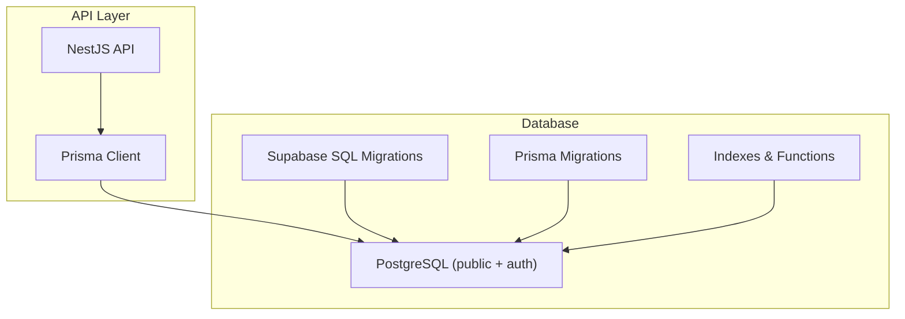
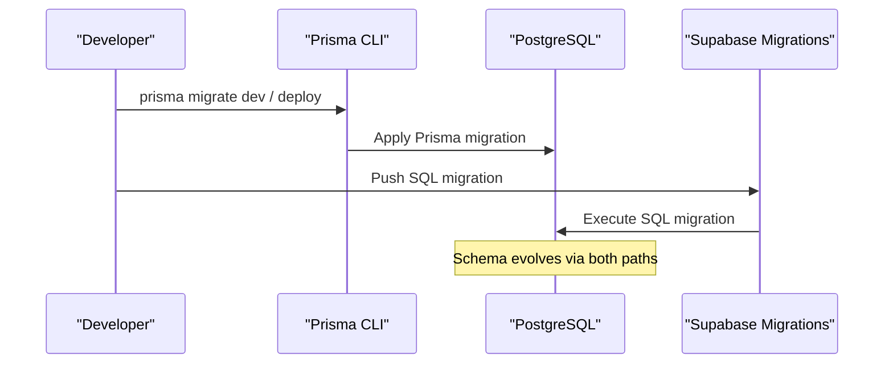
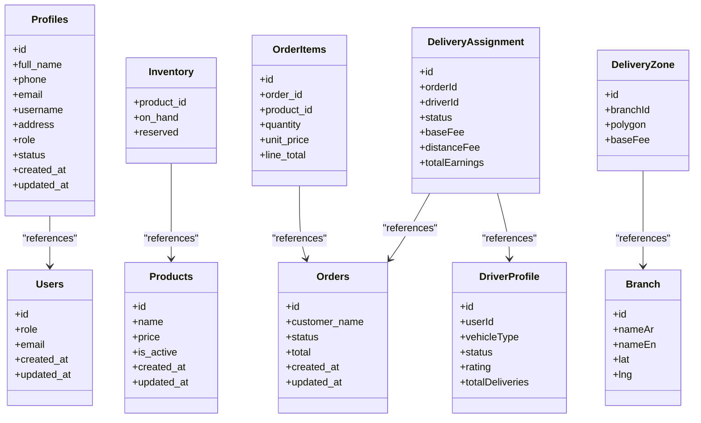

# Database Schema & Migrations

<cite>
**Referenced Files in This Document**
- [schema.prisma](file://apps/api/prisma/schema.prisma)
- [seed.ts](file://apps/api/prisma/seed.ts)
- [seed-drivers.ts](file://apps/api/prisma/seed-drivers.ts)
- [20260715150000_canonical_order_lifecycle.sql](file://supabase/migrations/20260715150000_canonical_order_lifecycle.sql)
- [20260809100000_pharmacist_inventory_adjustment.sql](file://supabase/migrations/20260809100000_pharmacist_inventory_adjustment.sql)
- [20260713120000_promotions_domain.sql](file://supabase/migrations/20260713120000_promotions_domain.sql)
- [performance_indexes.sql](file://database/performance_indexes.sql)
- [supabase_indexes.sql](file://database/supabase_indexes.sql)
</cite>

## Table of Contents
1. Introduction
2. Project Structure
3. Core Components
4. Architecture Overview
5. Detailed Component Analysis
6. Dependency Analysis
7. Performance Considerations
8. Troubleshooting Guide
9. Conclusion
10. Appendices

## Introduction
This document describes the database schema and migration strategy for a pharmacy domain platform. It covers entities such as users, profiles, products, inventory, orders, drivers, delivery assignments, branches, zones, promotions, notifications, and related operational tables. It explains how Prisma models map to PostgreSQL schemas, field types, constraints, and indexes; how migrations are managed via both Prisma and Supabase SQL migrations; and how data seeding is performed. It also outlines normalization principles, performance optimization techniques, backup considerations, and scalability guidance tailored to pharmacy operations.

## Project Structure
The database layer spans two complementary systems:
- Prisma schema defines application-facing models and relationships used by the NestJS API.
- Supabase SQL migrations define business logic, security policies, and additional tables/functions that evolve the schema over time.
- Seed scripts populate initial branches, delivery zones, and driver test data.
- Indexing scripts optimize product catalog and order queries.

**Diagram sources**
- [schema.prisma:1-11](file://apps/api/prisma/schema.prisma#L1-L11)
- [20260715150000_canonical_order_lifecycle.sql:1-41](file://supabase/migrations/20260715150000_canonical_order_lifecycle.sql#L1-L41)
- [20260809100000_pharmacist_inventory_adjustment.sql:1-83](file://supabase/migrations/20260809100000_pharmacist_inventory_adjustment.sql#L1-L83)
- [performance_indexes.sql:1-243](file://database/performance_indexes.sql#L1-L243)

**Section sources**
- [schema.prisma:1-11](file://apps/api/prisma/schema.prisma#L1-L11)

## Core Components
Key entities and their roles:
- Users and Profiles: Authentication and role-based access across customer, pharmacist, manager, admin, and driver roles.
- Products and Inventory: Catalog items with stock tracking and availability.
- Orders and Order Items: Customer purchases with lifecycle states and line items.
- Drivers, Delivery Assignments, Sessions, Earnings: Delivery workflow and compensation tracking.
- Branches and Delivery Zones: Geographic service areas with distance-based fees and surge pricing.
- Promotions: Discount rules applied to products within active windows.
- Notifications: Device tokens and delivery logs for push notifications.

Relationships overview:
- One-to-one between users and profiles.
- One-to-many from products to inventory and order_items.
- One-to-many from orders to order_items.
- One-to-many from drivers to deliveries and earnings; one-to-one from drivers to sessions per shift.
- Many-to-many between promotions and products via junction table.
- Branches have many delivery zones.

**Section sources**
- [schema.prisma:496-1066](file://apps/api/prisma/schema.prisma#L496-L1066)
- [20260713120000_promotions_domain.sql:1-64](file://supabase/migrations/20260713120000_promotions_domain.sql#L1-L64)

## Architecture Overview
The system uses a dual migration approach:
- Prisma manages application-level schema evolution and type-safe client generation.
- Supabase SQL migrations add domain-specific tables, functions, and Row Level Security policies.

**Diagram sources**
- [schema.prisma:1-11](file://apps/api/prisma/schema.prisma#L1-L11)
- [20260715150000_canonical_order_lifecycle.sql:1-41](file://supabase/migrations/20260715150000_canonical_order_lifecycle.sql#L1-L41)

## Detailed Component Analysis

### Users and Profiles
- Users reside in the auth schema and include authentication fields, roles, and timestamps.
- Profiles extend user identity with display name, phone, email, username, address, role, status, and timestamps.
- Relationships:
  - profiles.id references users.id with cascade delete.
  - orders link to profiles via user_id and assigned_driver_id through named relations.

Constraints and indexes:
- Unique constraints on profile phone and user phone where applicable.
- Indexes on user_id and created_at for order lookups.

Normalization:
- Separation of auth concerns (users) from application identity (profiles) supports multi-role scenarios and clean separation of responsibilities.

**Section sources**
- [schema.prisma:407-458](file://apps/api/prisma/schema.prisma#L407-L458)
- [schema.prisma:617-635](file://apps/api/prisma/schema.prisma#L617-L635)
- [schema.prisma:556-592](file://apps/api/prisma/schema.prisma#L556-L592)

### Products and Inventory
- Products store multilingual names, category metadata, price, activity flag, source, and timestamps.
- Inventory tracks on-hand and reserved quantities per product.
- Relationship:
  - inventory.product_id references products.id.

Constraints and indexes:
- Primary key on product id.
- Inventory keyed by product_id.
- Additional search and filtering indexes are provided by indexing scripts.

Normalization:
- Decoupling product catalog from stock levels enables independent updates and clearer ownership.

**Section sources**
- [schema.prisma:595-613](file://apps/api/prisma/schema.prisma#L595-L613)
- [schema.prisma:528-536](file://apps/api/prisma/schema.prisma#L528-L536)
- [supabase_indexes.sql:1-129](file://database/supabase_indexes.sql#L1-L129)

### Orders and Order Items
- Orders capture customer details, coordinates, status, totals, payment info, and timestamps.
- Order items record product snapshots, quantities, prices, and line totals.
- Relationships:
  - order_items.order_id references orders.id with cascade delete.
  - orders.user_id and orders.assigned_driver_id reference profiles via named relations.

Lifecycle and state transitions:
- Canonical order lifecycle enforced by a stored function that validates allowed transitions and updates audit timestamps.

Constraints and indexes:
- Unique external_ref and qr_token.
- Composite indexes on user_id and created_at, and on status and created_at for efficient listing.

Normalization:
- Snapshotting product data at purchase time preserves historical accuracy even if catalog changes.

**Section sources**
- [schema.prisma:540-592](file://apps/api/prisma/schema.prisma#L540-L592)
- [20260715150000_canonical_order_lifecycle.sql:1-41](file://supabase/migrations/20260715150000_canonical_order_lifecycle.sql#L1-L41)

### Drivers, Delivery Assignments, Sessions, Earnings
- DriverProfile extends profiles with vehicle details, documents, online status, location, ratings, and earnings metrics.
- DeliveryAssignment links orders to drivers and records pickup/delivery proof, fees, and timeline.
- DriverSession tracks shifts with online time, deliveries, earnings, and distance.
- DriverEarning records per-delivery compensation and payment status.

Relationships:
- DriverLocation belongs to DriverProfile.
- DeliveryAssignment references orders and DriverProfile.
- DriverSession and DriverEarning reference DriverProfile.

Constraints and indexes:
- Unique userId in DriverProfile.
- Unique orderId in DeliveryAssignment.
- Indexes on driverId, status, and timestamps for efficient queries.

Normalization:
- Clear separation of driver identity, assignment workflow, session accounting, and financial records.

**Section sources**
- [schema.prisma:806-983](file://apps/api/prisma/schema.prisma#L806-L983)

### Branches and Delivery Zones
- Branch stores branch identifiers, bilingual names, geographic area, coordinates, embed source, load factor, and activity status.
- DeliveryZone defines polygon coverage, base fee, free delivery threshold, and surge parameters per branch.

Relationships:
- DeliveryZone.branchId references Branch.id with cascade delete.

Business rules:
- Distance-based tiered pricing and late-night surcharge implemented via seed-generated concentric polygons around each branch.

**Section sources**
- [schema.prisma:765-803](file://apps/api/prisma/schema.prisma#L765-L803)
- [seed.ts:1-177](file://apps/api/prisma/seed.ts#L1-L177)

### Promotions
- Promotions define discount type, value, and active window with creation metadata.
- Promotion_products maps promotions to products.

Security:
- Row Level Security policies restrict public reads to active promotions and enforce manager-only write access.

Functions:
- Effective price calculation helper for percentage or fixed discounts.

**Section sources**
- [20260713120000_promotions_domain.sql:1-64](file://supabase/migrations/20260713120000_promotions_domain.sql#L1-L64)

### Notifications
- NotificationToken stores device tokens and platform metadata per user.
- NotificationLog records send attempts, statuses, and click events.

Relationships:
- NotificationToken.userId references profiles.id.
- NotificationLog optionally targets users or tokens.

**Section sources**
- [schema.prisma:986-1036](file://apps/api/prisma/schema.prisma#L986-L1036)

### Enums and Domain Types
- app_role enumerates platform roles.
- order_status enumerates canonical order states.
- DriverStatus and DeliveryStatus model driver and delivery lifecycles.

**Section sources**
- [schema.prisma:743-763](file://apps/api/prisma/schema.prisma#L743-L763)
- [schema.prisma:1038-1065](file://apps/api/prisma/schema.prisma#L1038-L1065)

## Dependency Analysis

**Diagram sources**
- [schema.prisma:407-458](file://apps/api/prisma/schema.prisma#L407-L458)
- [schema.prisma:595-613](file://apps/api/prisma/schema.prisma#L595-L613)
- [schema.prisma:528-536](file://apps/api/prisma/schema.prisma#L528-L536)
- [schema.prisma:540-592](file://apps/api/prisma/schema.prisma#L540-L592)
- [schema.prisma:806-934](file://apps/api/prisma/schema.prisma#L806-L934)
- [schema.prisma:765-803](file://apps/api/prisma/schema.prisma#L765-L803)

**Section sources**
- [schema.prisma:407-1066](file://apps/api/prisma/schema.prisma#L407-L1066)

## Performance Considerations
Indexing strategy:
- Product catalog: composite indexes for search, category filters, price sorting, full-text search, low-stock alerts, and pagination.
- Orders: indexes on status/date, customer phone, QR token, and driver assignment.
- Order items: indexes on order_id and product_id for analytics.

Optimization practices:
- Use partial indexes to exclude soft-deleted rows.
- Enable parallel workers for large tables.
- Run ANALYZE after bulk operations to refresh statistics.
- Monitor slow queries and index usage via provided views.

Backup procedures:
- Use provider-native backups (e.g., Supabase project backups) and schedule regular point-in-time recovery points.
- For critical financial data (orders, earnings), consider logical exports of key tables and periodic dumps.

Scalability considerations:
- Partition high-volume tables like DriverLocation and NotificationLog by timestamp ranges if growth warrants it.
- Archive completed orders and assignments periodically to maintain query performance.
- Cache frequently accessed catalog data at the application layer while keeping authoritative state in the database.

**Section sources**
- [performance_indexes.sql:1-243](file://database/performance_indexes.sql#L1-L243)
- [supabase_indexes.sql:1-227](file://database/supabase_indexes.sql#L1-L227)

## Troubleshooting Guide
Common issues and resolutions:
- Invalid order transitions: Ensure state changes go through the canonical transition function to validate allowed transitions.
- Inventory adjustments: Use the atomic adjustment function to prevent underflow against committed/reserved stock and ensure idempotency via keys.
- Slow product searches: Verify indexes exist and are being used; run ANALYZE and check slow query views.
- Driver assignment conflicts: Confirm unique constraints on delivery assignments and order statuses before reassignment.

Operational checks:
- Validate RLS policies for promotions and other sensitive tables.
- Confirm enum values match expected states after migrations.
- Review error messages raised by stored functions for precise diagnostics.

**Section sources**
- [20260715150000_canonical_order_lifecycle.sql:1-41](file://supabase/migrations/20260715150000_canonical_order_lifecycle.sql#L1-L41)
- [20260809100000_pharmacist_inventory_adjustment.sql:1-83](file://supabase/migrations/20260809100000_pharmacist_inventory_adjustment.sql#L1-L83)
- [performance_indexes.sql:148-243](file://database/performance_indexes.sql#L148-L243)

## Conclusion
The database design separates concerns across authentication, catalog, orders, delivery, and promotions while enforcing strict lifecycle controls and security policies. Prisma provides type-safe access for the API, and Supabase SQL migrations evolve domain logic and safety guarantees. Indexing and maintenance scripts support high-performance catalog browsing and order management. The schema balances normalization with practical needs like product snapshots and real-time driver tracking, enabling scalable pharmacy operations.

## Appendices

### Data Seeding Strategy
- Branches and zones: Seed script creates predefined branches and generates concentric delivery zones with distance-based fees and surge settings.
- Drivers: Seed script creates test driver accounts and sample delivery assignments for development workflows.

Execution notes:
- Ensure environment variables for Supabase service role and seed passwords are set when running driver seeds.
- Re-seeding deletes existing zones per branch to recreate cleanly.

**Section sources**
- [seed.ts:1-177](file://apps/api/prisma/seed.ts#L1-L177)
- [seed-drivers.ts:1-184](file://apps/api/prisma/seed-drivers.ts#L1-L184)

### Migration Management Process
- Prisma migrations: Define and apply schema changes via Prisma CLI; generate client for type safety.
- Supabase SQL migrations: Add domain tables, functions, and RLS policies; versioned by timestamped files.
- Best practices:
  - Keep Prisma focused on application models; use SQL migrations for complex business logic and security.
  - Always back up before applying migrations in production.
  - Test migrations locally and verify with integration tests.

**Section sources**
- [schema.prisma:1-11](file://apps/api/prisma/schema.prisma#L1-L11)
- [20260715150000_canonical_order_lifecycle.sql:1-41](file://supabase/migrations/20260715150000_canonical_order_lifecycle.sql#L1-L41)
- [20260809100000_pharmacist_inventory_adjustment.sql:1-83](file://supabase/migrations/20260809100000_pharmacist_inventory_adjustment.sql#L1-L83)

### Data Modeling Decisions and Normalization
- Users vs Profiles: Separates authentication from application identity and roles.
- Products vs Inventory: Decouples catalog from stock levels for independent updates.
- Orders vs Order Items: Preserves purchase history with snapshots to avoid drift.
- Drivers vs Deliveries: Tracks assignment lifecycle and earnings separately for clarity and reporting.
- Promotions: Centralized discount rules with explicit active windows and product mappings.

Scalability considerations:
- Use partitioning for high-write tables (e.g., locations, logs).
- Archive old data to keep hot sets small.
- Leverage indexes judiciously to balance read performance and write overhead.

[No sources needed since this section summarizes modeling principles without analyzing specific files]